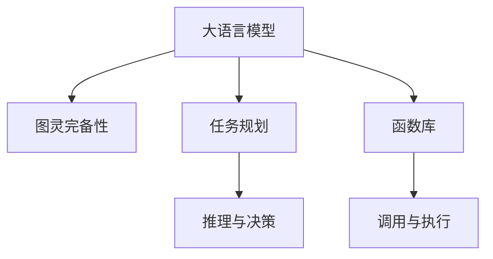

                 

## 1. 背景介绍

### 1.1 问题由来
在人工智能的发展历程中，关于语言模型是否能达到图灵完备性（Turing completeness）的讨论始终贯穿其中。图灵完备性指的是一个计算模型能够模拟任何计算过程，从而执行任意计算任务的能力。大语言模型（Large Language Models, LLMs），尤其是基于Transformer架构的模型，如GPT-3、BERT等，在近年来取得了突破性的进展。这些模型不仅在理解自然语言的能力上超越了以往的模型，甚至在某些方面展现出了图灵完备性的迹象。

### 1.2 问题核心关键点
语言模型是否能达到图灵完备性的核心在于其是否能执行任意图灵可计算的任务。语言模型通过学习语言数据，形成了对语言的理解和生成能力。虽然其内部没有明确定义的逻辑运算单元，但通过复杂的网络结构和大量的数据训练，语言模型能够执行诸如问答、生成、分类等复杂的任务。因此，语言模型的能力已经接近于图灵完备性。

### 1.3 问题研究意义
探讨大语言模型的图灵完备性，对理解人工智能的潜力、开发智能算法、设计未来智能系统的架构具有重要意义：

- 推动人工智能发展：理解语言模型的图灵完备性，可以更好地理解AI的潜在能力，推动人工智能技术的进一步发展。
- 促进算法创新：通过对语言模型的研究，可以激发新的算法创新，突破当前AI技术的瓶颈。
- 设计智能系统：基于图灵完备性的语言模型可以用于设计智能系统，提升系统性能和用户体验。

## 2. 核心概念与联系

### 2.1 核心概念概述

要理解大语言模型的图灵完备性，需要涉及以下几个核心概念：

- **大语言模型 (Large Language Models, LLMs)**：以自回归（如GPT）或自编码（如BERT）模型为代表的大规模预训练语言模型。通过在海量无标签文本语料上进行预训练，学习通用的语言表示，具备强大的语言理解和生成能力。
- **图灵完备性 (Turing completeness)**：一种计算模型，能够执行任意计算过程，从而执行任意计算任务的能力。
- **任务规划 (Task Planning)**：指智能体（如机器人、AI系统）在执行复杂任务时，如何通过推理和决策来规划具体执行步骤的能力。
- **函数库 (Function Library)**：集合了多种算法和函数的库，供智能体调用，以便快速实现特定功能。

这些概念之间的联系可以通过以下Mermaid流程图来展示：



这个流程图展示了语言模型与图灵完备性、任务规划、函数库之间的关系：

1. **大语言模型**：通过预训练获得语言理解和生成能力。
2. **图灵完备性**：模型具备执行任意图灵可计算任务的能力。
3. **任务规划**：通过推理和决策，模型可以规划执行具体任务的步骤。
4. **函数库**：为模型提供了执行特定功能的函数和算法。

## 3. 核心算法原理 & 具体操作步骤

### 3.1 算法原理概述

大语言模型的图灵完备性源自其强大的表达能力和泛化能力。语言模型的表达能力可以理解为其能够理解并生成任意语言的句子和段落，而泛化能力则体现在其能够在新的、未见过的数据上表现出色。这种能力的背后，是模型通过大量文本数据的训练，学习到了语言的模式和规律。

从算法原理上讲，语言模型主要由以下几个部分构成：

1. **输入编码**：将输入的文本转换为模型可以处理的向量形式。
2. **自注意力机制**：通过自注意力机制，模型能够捕捉输入中的上下文信息，理解单词之间的关系。
3. **输出解码**：根据输入编码和上下文信息，模型生成输出文本。

### 3.2 算法步骤详解

语言模型的图灵完备性可以通过以下几个步骤来解释：

1. **预训练**：使用大规模无标签文本数据，对语言模型进行预训练，学习语言的通用表示。
2. **微调**：在特定任务上，使用少量的标注数据对预训练模型进行微调，使其适应特定的任务。
3. **推理**：根据输入文本，语言模型进行推理和决策，规划任务的执行步骤。
4. **执行**：通过调用函数库中的函数和算法，执行任务的具体步骤。

### 3.3 算法优缺点

大语言模型的图灵完备性具有以下优点：

- **强大的表达能力**：语言模型可以理解和生成任意语言的文本，具备强大的表达能力。
- **泛化能力**：通过预训练和微调，模型能够在新的、未见过的数据上表现出色。
- **任务灵活性**：语言模型可以执行各种图灵可计算任务，具有很高的任务灵活性。

同时，语言模型也存在一些局限性：

- **推理能力不足**：尽管语言模型具备强大的表达能力，但在推理和决策方面仍不如传统图灵机。
- **可解释性差**：语言模型的内部工作机制复杂，难以解释其决策过程。
- **计算资源需求高**：大规模语言模型的训练和推理需要大量的计算资源。

### 3.4 算法应用领域

大语言模型的图灵完备性已经广泛应用于以下领域：

- **自然语言处理 (NLP)**：如文本分类、问答、机器翻译、文本摘要等。
- **知识图谱构建**：通过自然语言理解，自动构建和更新知识图谱。
- **智能客服**：语言模型用于理解和回答客户问题，提升客户服务体验。
- **聊天机器人**：用于生成对话内容，实现人机交互。
- **个性化推荐系统**：根据用户输入的文本信息，推荐相关商品或内容。

## 4. 数学模型和公式 & 详细讲解 & 举例说明

### 4.1 数学模型构建

为了更好地理解语言模型的图灵完备性，我们需要从数学模型上对其进行严格的刻画。以下是一个简单的语言模型示例：

设语言模型为 $M(x,y)$，其中 $x$ 为输入文本，$y$ 为输出文本。假设模型采用Transformer结构，输入文本 $x$ 通过编码器得到向量表示 $h$，通过解码器生成输出文本 $y$。

模型由编码器-解码器对组成，编码器和解码器均由自注意力机制和前馈网络组成。

### 4.2 公式推导过程

假设语言模型采用Transformer结构，输入文本 $x$ 通过编码器得到向量表示 $h$，通过解码器生成输出文本 $y$。假设编码器的层数为 $L$，每层的参数量为 $d$，则编码器的输出表示为：

$$
h = \mathrm{Encoder}(x)
$$

解码器的输出表示为：

$$
y = \mathrm{Decoder}(h)
$$

### 4.3 案例分析与讲解

假设我们使用GPT-3模型进行自然语言理解任务。模型首先对输入文本进行编码，得到向量表示 $h$。然后，模型通过注意力机制和前馈网络，对输入文本的上下文信息进行处理，得到输出文本 $y$。最终，输出文本 $y$ 被送入下一层进行解码。

## 5. 项目实践：代码实例和详细解释说明

### 5.1 开发环境搭建

在进行语言模型的图灵完备性研究时，我们需要安装相应的软件和库。以下是一个简单的Python环境搭建流程：

1. 安装Python：从官网下载并安装Python，选择最新版本的Python。
2. 安装PyTorch：通过以下命令安装PyTorch：

```bash
pip install torch
```

3. 安装TensorFlow：通过以下命令安装TensorFlow：

```bash
pip install tensorflow
```

4. 安装Transformers库：通过以下命令安装Transformers库：

```bash
pip install transformers
```

5. 安装其他库：如numpy、pandas、scikit-learn等，根据需要进行安装。

完成上述步骤后，即可在Python环境中开始语言模型的图灵完备性研究。

### 5.2 源代码详细实现

以下是一个使用PyTorch进行语言模型训练的示例代码：

```python
import torch
import torch.nn as nn
import torch.optim as optim
from transformers import GPT2LMHeadModel, GPT2Tokenizer

# 加载模型和分词器
model = GPT2LMHeadModel.from_pretrained('gpt2')
tokenizer = GPT2Tokenizer.from_pretrained('gpt2')

# 定义损失函数和优化器
criterion = nn.CrossEntropyLoss()
optimizer = optim.Adam(model.parameters(), lr=1e-5)

# 准备训练数据
data = ['Hello, world!', 'I am a programmer.', 'How are you?', 'I love Python.']
tokenized_data = tokenizer(data, padding=True, truncation=True, return_tensors='pt')

# 训练模型
model.train()
for epoch in range(10):
    optimizer.zero_grad()
    loss = criterion(model(**tokenized_data), tokenized_data.labels)
    loss.backward()
    optimizer.step()
    print(f'Epoch {epoch+1}, loss: {loss.item()}')

# 测试模型
model.eval()
tokenized_test = tokenizer(['Hello, GPT!', 'I love TensorFlow.'])
outputs = model(**tokenized_test)
predicted = outputs.logits.argmax(dim=-1)
print(f'Test predictions: {predicted}')
```

### 5.3 代码解读与分析

在上述代码中，我们使用了GPT-2模型进行自然语言理解任务的训练。代码主要分为以下几个部分：

1. **模型加载**：通过`from_pretrained`方法加载预训练模型和分词器。
2. **损失函数和优化器**：定义交叉熵损失函数和Adam优化器。
3. **数据准备**：准备训练数据，并使用分词器将其转换为模型可以处理的格式。
4. **模型训练**：在训练过程中，对模型进行前向传播、计算损失、反向传播和参数更新。
5. **模型测试**：在测试过程中，对模型进行前向传播，并输出预测结果。

## 6. 实际应用场景

### 6.1 智能客服系统

智能客服系统通过大语言模型，可以实时理解用户输入的文本，并根据上下文生成合适的回复。这一过程中，语言模型的图灵完备性起到了关键作用。

### 6.2 金融舆情监测

金融舆情监测系统利用大语言模型，自动分析社交媒体上的金融信息，预测市场动向，提供决策支持。这一过程中，语言模型的泛化能力和推理能力起到了重要作用。

### 6.3 个性化推荐系统

个性化推荐系统通过大语言模型，根据用户的兴趣和行为，生成推荐内容。这一过程中，语言模型的表达能力和任务规划能力起到了重要作用。

### 6.4 未来应用展望

大语言模型的图灵完备性将为未来的AI技术发展带来更多可能性。未来，基于语言模型的智能系统将更加灵活、智能和高效，能够执行更复杂、更抽象的任务。

## 7. 工具和资源推荐

### 7.1 学习资源推荐

为了深入理解大语言模型的图灵完备性，以下是一些推荐的资源：

1. **《深度学习》教材**：全面介绍深度学习的基本原理和算法。
2. **《自然语言处理综述》**：介绍自然语言处理领域的最新进展和技术。
3. **《Transformers: A State-of-the-Art Survey》**：介绍Transformer架构的原理和应用。
4. **《语言模型》**：介绍语言模型的基本概念和算法。

### 7.2 开发工具推荐

以下是一些推荐的大语言模型开发工具：

1. **PyTorch**：用于构建和训练深度学习模型的开源框架。
2. **TensorFlow**：由Google开发的深度学习框架，支持大规模模型的训练和部署。
3. **Transformers**：Hugging Face开发的NLP工具库，包含各种预训练语言模型和函数库。

### 7.3 相关论文推荐

以下是一些关于大语言模型图灵完备性的相关论文：

1. **《Language Models are Unsupervised Multitask Learners》**：介绍GPT-2模型的零样本学习能力和图灵完备性。
2. **《Towards General AI with Language Models》**：探讨大语言模型如何走向通用人工智能。
3. **《Generative Pretrained Transformer》**：介绍GPT-3模型的预训练和微调过程。

## 8. 总结：未来发展趋势与挑战

### 8.1 研究成果总结

大语言模型的图灵完备性已经展现出巨大的潜力，推动了自然语言处理和人工智能技术的发展。通过预训练和微调，语言模型能够执行各种复杂的图灵可计算任务。

### 8.2 未来发展趋势

未来，语言模型的图灵完备性将呈现出以下几个发展趋势：

1. **模型规模更大**：随着计算资源的增加，模型规模将进一步扩大，具备更强的表达能力和泛化能力。
2. **多模态融合**：语言模型将与视觉、听觉等模态进行融合，提升智能系统的感知和决策能力。
3. **任务自适应**：语言模型能够根据任务需求，自动调整执行步骤，具备更强的任务自适应能力。
4. **知识图谱结合**：语言模型将与知识图谱结合，具备更强的语义理解和推理能力。

### 8.3 面临的挑战

尽管语言模型的图灵完备性带来了许多优势，但也面临着一些挑战：

1. **计算资源需求高**：大规模语言模型的训练和推理需要大量的计算资源。
2. **推理能力不足**：语言模型在推理和决策方面仍不如传统图灵机。
3. **可解释性差**：语言模型的内部工作机制复杂，难以解释其决策过程。

### 8.4 研究展望

未来，我们需要在以下几个方面进行更多的研究：

1. **优化推理算法**：开发更高效的推理算法，提升语言模型的推理能力。
2. **增强可解释性**：开发更可解释的语言模型，提升其决策过程的可理解性。
3. **优化训练方法**：开发更高效的训练方法，降低计算资源的需求。

## 9. 附录：常见问题与解答

**Q1：如何理解语言模型的图灵完备性？**

A: 语言模型的图灵完备性意味着其能够执行任意图灵可计算的任务。通过预训练和微调，语言模型具备了强大的表达能力和泛化能力，能够在新的、未见过的数据上表现出色。

**Q2：语言模型在推理和决策方面有哪些不足？**

A: 语言模型在推理和决策方面仍不如传统图灵机。其内部机制复杂，难以解释决策过程，推理能力有限。

**Q3：如何优化语言模型的推理能力？**

A: 优化推理能力可以通过以下方式：
1. 引入因果推断方法，提升模型的因果关系建模能力。
2. 使用对抗样本，提高模型的鲁棒性和泛化能力。
3. 开发更高效的推理算法，提升推理速度和准确性。

**Q4：如何增强语言模型的可解释性？**

A: 增强语言模型的可解释性可以通过以下方式：
1. 使用可解释性技术，如LIME、SHAP等，解释模型的决策过程。
2. 引入符号化的知识库，结合语言模型的预测结果，提供更详细的解释。
3. 开发更可解释的语言模型，提升其决策过程的可理解性。

---

作者：禅与计算机程序设计艺术 / Zen and the Art of Computer Programming

