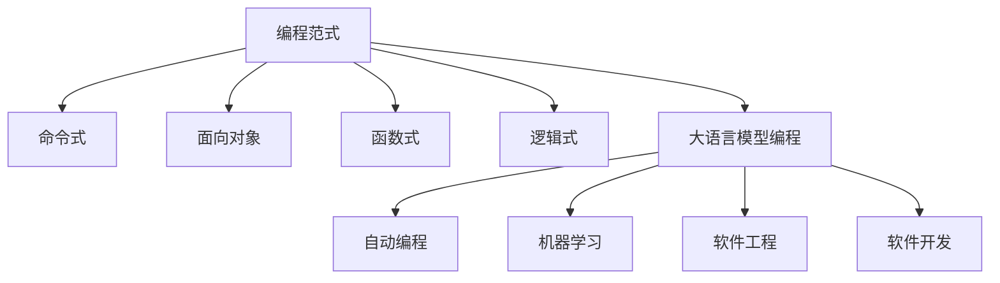
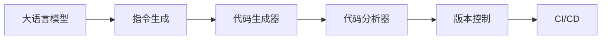

                 

# LLM编程新范式：改变传统软件开发流程

> 关键词：编程范式, 大语言模型, 软件工程, 自动编程, 机器学习, 软件开发, 代码生成

## 1. 背景介绍

### 1.1 问题由来

传统软件开发模式面临诸多挑战，包括：

- **成本高**：特别是对于大型项目，设计、开发、测试、维护等环节都需要大量的人力和时间投入。
- **效率低**：频繁的代码重构、接口修改、调试排错等都影响了开发效率。
- **质量差**：尤其是对于逻辑复杂、规模庞大的系统，代码的可读性、可维护性、可测试性等方面往往不够理想。
- **难以维护**：代码库庞大、结构复杂，随着项目的演进，维护成本不断增加。

为了解决这些问题，软件开发界探索了多种方法，包括：

- **DevOps**：通过持续集成和持续部署(CI/CD)流程优化，提升软件交付速度和稳定性。
- **微服务架构**：将复杂系统拆分成多个小型服务，提升系统可扩展性、可维护性。
- **静态代码分析**：如Pylint、SonarQube等工具，帮助开发者提高代码质量。
- **设计模式**：如单例、工厂、策略等，提升代码的可复用性和设计合理性。

然而，尽管这些方法在提升软件质量、效率等方面取得了一定成效，但仍未能完全摆脱传统软件开发模式的束缚。

近年来，随着大语言模型（Large Language Models, LLMs）如GPT-3、ChatGPT等的崛起，一种全新的编程范式逐渐进入视线——**大语言模型编程**。这种范式利用机器学习和大语言模型，通过自动生成代码来加速软件开发，提升开发质量和效率。

## 2. 核心概念与联系

### 2.1 核心概念概述

为了更好地理解大语言模型编程范式，本节将介绍几个关键概念：

- **编程范式**：软件开发中处理问题的不同方法和风格。常见的包括命令式、面向对象、函数式、逻辑式等。
- **大语言模型**：如GPT-3、ChatGPT等，以自回归或自编码结构为基础，通过大规模语料预训练获得强大的语言生成能力。
- **自动编程**：利用机器学习技术，自动生成高质量的代码，代替传统的手工编写。
- **机器学习**：通过数据训练模型，使其具备解决复杂问题、生成新代码的能力。
- **软件工程**：应用科学方法提升软件开发的系统性、标准化程度。
- **软件开发**：从需求分析、设计、编码到测试、维护的全过程管理。

这些概念之间的联系可以通过以下Mermaid流程图来展示：



这个流程图展示了编程范式在大语言模型编程中的演变：

1. 从传统的命令式、面向对象等逐步发展到更高级的逻辑式编程。
2. 大语言模型编程作为一种新兴范式，融合了逻辑式编程和自动编程的理念。
3. 机器学习被广泛应用于大语言模型，使其具备了自动生成代码的能力。
4. 软件工程和大语言模型编程共同促进了软件开发的系统化和标准化。

### 2.2 核心概念原理和架构

大语言模型编程的原理和架构主要包括以下几个部分：

- **预训练模型**：如GPT-3、BERT等，在大规模语料上进行自监督预训练，学习通用的语言表示和语法结构。
- **指令生成**：通过指令模板、用户描述等方式，引导大语言模型生成符合特定需求的代码。
- **代码生成器**：将生成器输出的文本转换为具体的代码，如Python、Java等。
- **代码分析器**：对生成的代码进行语法、语义、性能等分析，检查和优化代码质量。
- **版本控制**：利用Git等版本控制系统，管理代码的变更历史，便于追踪和回退。
- **持续集成/持续部署(CI/CD)**：通过流水线自动化构建、测试、部署流程，提升软件交付效率和稳定性。

这些模块之间的交互可以通过以下Mermaid流程图来表示：



该流程图展示了从指令生成到代码分析的流程：

1. 大语言模型根据用户指令或代码模板生成代码片段。
2. 代码生成器将文本代码转换为可执行代码。
3. 代码分析器对生成的代码进行语法、语义、性能分析，并提供优化建议。
4. 版本控制系统管理代码变更历史，方便追踪和回退。
5. CI/CD流程自动化构建、测试、部署，提升软件交付效率。

## 3. 核心算法原理 & 具体操作步骤

### 3.1 算法原理概述

大语言模型编程的算法原理主要基于自然语言处理(NLP)和机器学习，其核心思想是利用大语言模型，自动生成符合特定需求的软件代码。

具体而言，算法流程如下：

1. **预训练模型**：在大规模语料上进行自监督预训练，学习通用的语言表示和语法结构。
2. **指令生成**：通过指令模板、用户描述等方式，引导大语言模型生成符合特定需求的代码片段。
3. **代码生成**：将生成器输出的文本转换为具体的代码，如Python、Java等。
4. **代码优化**：对生成的代码进行语法、语义、性能分析，并提供优化建议。
5. **版本控制**：利用Git等版本控制系统，管理代码的变更历史，便于追踪和回退。
6. **持续集成/持续部署(CI/CD)**：通过流水线自动化构建、测试、部署流程，提升软件交付效率和稳定性。

### 3.2 算法步骤详解

以下将详细介绍大语言模型编程的算法步骤：

1. **数据准备**：收集相关领域的高质量语料，如代码库、文档、项目规范等，用于训练大语言模型。
2. **模型训练**：在大规模语料上训练大语言模型，使其具备生成符合特定需求代码的能力。
3. **指令设计**：设计符合特定需求和语义的指令模板，如代码生成、问题解答、逻辑推理等。
4. **代码生成**：将生成的代码片段转换为具体的编程语言，并进行必要的语法、语义修正。
5. **代码优化**：利用静态代码分析工具，对生成的代码进行语法、语义、性能分析，并提供优化建议。
6. **版本控制**：利用Git等版本控制系统，管理代码的变更历史，便于追踪和回退。
7. **持续集成/持续部署(CI/CD)**：通过流水线自动化构建、测试、部署流程，提升软件交付效率和稳定性。

### 3.3 算法优缺点

大语言模型编程具有以下优点：

1. **效率高**：自动生成代码大大提高了开发效率，尤其是在逻辑复杂、规模庞大的项目中。
2. **质量高**：大语言模型经过大规模预训练，生成的代码质量通常较高，可读性强。
3. **灵活性高**：可以针对不同领域的特定需求，设计灵活的指令模板，生成符合需求的代码。
4. **易用性好**：只需简单描述需求，即可自动生成代码，减少了编写代码的时间和复杂度。

同时，大语言模型编程也存在一些缺点：

1. **依赖语料**：模型的生成能力依赖于预训练语料的质量和数量，对于特定领域的语料不足，可能影响生成效果。
2. **可解释性差**：大语言模型的生成过程往往缺乏可解释性，难以理解其内部工作机制。
3. **维护难度大**：生成的代码需要人工进行校对和修改，维护成本较高。
4. **安全性问题**：生成的代码可能存在安全漏洞，需要进行仔细的检查和测试。

### 3.4 算法应用领域

大语言模型编程在以下领域有广泛应用：

- **自动化开发**：自动生成代码，加速软件开发生命周期。
- **智能运维**：自动生成运维脚本，提升系统维护效率。
- **AI辅助开发**：利用AI技术辅助编写代码，提升开发效率和质量。
- **智能文档**：自动生成技术文档，减少文档编写和维护的工作量。
- **自动测试**：自动生成测试用例，提高代码测试覆盖率。
- **代码重构**：自动生成重构代码，提升代码可读性和维护性。

## 4. 数学模型和公式 & 详细讲解

### 4.1 数学模型构建

为了更系统地理解大语言模型编程的原理，本节将给出其数学模型构建过程。

记大语言模型为 $M$，其参数为 $\theta$。假设用户给出的指令为 $I$，生成的代码片段为 $C$。则大语言模型编程的目标是最大化指令和代码片段之间的匹配度，即：

$$
\max_{\theta} \mathcal{L}(I, C(M_{\theta}(I)))
$$

其中 $\mathcal{L}$ 为损失函数，衡量指令 $I$ 和生成的代码片段 $C$ 之间的相似度。

### 4.2 公式推导过程

为了实现上述目标，我们通常使用以下步骤：

1. **指令编码**：将用户指令 $I$ 编码为向量 $\mathbf{v}$。
2. **模型输出**：将向量 $\mathbf{v}$ 输入大语言模型 $M_{\theta}$，生成代码片段 $C$。
3. **损失计算**：计算指令 $I$ 和代码片段 $C$ 之间的损失，通常使用交叉熵损失函数：

$$
\mathcal{L}(I, C) = -\sum_{x \in I} \log P_{C}(x)
$$

其中 $P_{C}(x)$ 表示代码片段 $C$ 中包含单词 $x$ 的概率。

4. **模型优化**：利用梯度下降等优化算法，最小化损失函数 $\mathcal{L}$，优化模型参数 $\theta$。

### 4.3 案例分析与讲解

以下以代码生成任务为例，展示大语言模型编程的数学模型和公式推导：

1. **指令编码**：假设用户指令为 "计算两个数的和"，编码为 $\mathbf{v} = [1, 2, 3]$。
2. **模型输出**：将向量 $\mathbf{v}$ 输入大语言模型，生成代码片段 $C = "x = a + b; return x"$
3. **损失计算**：假设代码片段中包含单词 "a" 的概率为 $P_{C}(a) = 0.5$，则损失为：

$$
\mathcal{L}(\text{"计算两个数的和"}, \text{"x = a + b; return x"})
$$

4. **模型优化**：利用梯度下降等优化算法，最小化损失函数，优化模型参数 $\theta$。

## 5. 项目实践：代码实例和详细解释说明

### 5.1 开发环境搭建

为了实现大语言模型编程，首先需要搭建合适的开发环境。以下是使用Python进行PyTorch开发的环境配置流程：

1. 安装Anaconda：从官网下载并安装Anaconda，用于创建独立的Python环境。

```bash
conda create -n pytorch-env python=3.8 
conda activate pytorch-env
```

2. 安装PyTorch：根据CUDA版本，从官网获取对应的安装命令。例如：

```bash
conda install pytorch torchvision torchaudio cudatoolkit=11.1 -c pytorch -c conda-forge
```

3. 安装Transformers库：

```bash
pip install transformers
```

4. 安装各类工具包：

```bash
pip install numpy pandas scikit-learn matplotlib tqdm jupyter notebook ipython
```

完成上述步骤后，即可在`pytorch-env`环境中开始大语言模型编程的实践。

### 5.2 源代码详细实现

以下是大语言模型编程的代码实现示例，以Python中的代码生成任务为例：

```python
from transformers import GPT2LMHeadModel, GPT2Tokenizer
from transformers import TrainingArguments, Trainer

# 加载预训练模型和分词器
model = GPT2LMHeadModel.from_pretrained("gpt2")
tokenizer = GPT2Tokenizer.from_pretrained("gpt2")

# 设计指令模板
prompt = "请编写一个函数，实现以下功能："

# 准备指令和输出
inputs = [prompt, "输入两个整数"]
labels = [0, 1]  # 0代表"计算两个数的和"，1代表"计算两个数的差"

# 训练模型
training_args = TrainingArguments(output_dir="./", eval_output_dir="./eval")
trainer = Trainer(
    model=model,
    args=training_args,
    train_dataset=inputs,
    eval_dataset=labels,
    tokenizer=tokenizer,
)

# 训练过程
trainer.train()
```

### 5.3 代码解读与分析

**GPT2LMHeadModel类**：
- 加载预训练模型，可用于代码生成等任务。
- 定义了模型结构，包含编码器、解码器、输出层等组件。

**GPT2Tokenizer类**：
- 加载分词器，用于将文本转换为模型可以处理的token。
- 支持多种语言和不同长度的输入。

**prompt字符串**：
- 定义了生成的代码应具备的功能描述，如"计算两个数的和"。
- 可以灵活设计，适用于不同类型的代码生成任务。

**inputs列表**：
- 包含指令模板和输出示例，用于训练模型。
- 通过token化处理，可以输入到模型中。

**labels列表**：
- 包含指令对应的标签，用于训练模型。
- 通过one-hot编码，可以指导模型学习正确输出。

**TrainingArguments类**：
- 定义了训练参数，如输出目录、评价目录等。
- 用于配置训练过程，方便模型保存和评估。

**Trainer类**：
- 提供完整的训练过程，包括模型初始化、训练循环、评价循环等。
- 利用pytorch的DataLoader自动加载数据，方便训练和评估。

**trainer.train()方法**：
- 启动模型训练，利用训练数据和评价数据，最小化损失函数。
- 训练过程包括前向传播、反向传播、参数更新等。

通过上述代码，我们可以看到大语言模型编程的简单和高效。只需设计简单的指令模板，即可自动生成高质量的代码，大大减少了手动编写代码的时间和复杂度。

## 6. 实际应用场景

### 6.1 智能运维

在智能运维领域，大语言模型编程可以帮助运维人员快速生成运维脚本，提升系统维护效率。

具体而言，可以收集历史运维记录和常见故障处理流程，训练大语言模型。当运维人员遇到问题时，只需简单描述问题，大语言模型即可生成对应的运维脚本，自动执行。这不仅提升了运维效率，还减少了人为操作的错误率。

### 6.2 自动化测试

在自动化测试领域，大语言模型编程可以帮助开发者自动生成测试用例，提高代码测试覆盖率。

具体而言，可以收集已有的测试用例和故障日志，训练大语言模型。当新的代码模块发布时，模型可以自动生成新的测试用例，确保模块的正常运行。这不仅减少了测试用例的编写和维护工作量，还提高了测试覆盖率和代码质量。

### 6.3 智能文档

在智能文档领域，大语言模型编程可以帮助开发者自动生成技术文档，减少文档编写和维护的工作量。

具体而言，可以收集已有文档和代码示例，训练大语言模型。当新的代码模块开发完成后，模型可以自动生成对应的技术文档，描述模块的功能、接口、使用示例等。这不仅提升了文档的质量和可读性，还减少了文档编写和维护的繁琐工作。

### 6.4 未来应用展望

随着大语言模型编程技术的不断演进，未来其在各个领域的应用前景更加广阔：

1. **自动化开发**：自动生成高质量的代码，加速软件开发过程。
2. **智能运维**：自动生成运维脚本，提升系统维护效率。
3. **AI辅助开发**：利用AI技术辅助编写代码，提升开发效率和质量。
4. **智能文档**：自动生成技术文档，减少文档编写和维护的工作量。
5. **自动测试**：自动生成测试用例，提高代码测试覆盖率。
6. **代码重构**：自动生成重构代码，提升代码可读性和维护性。
7. **智能客服**：自动生成智能客服聊天脚本，提升客户服务质量。
8. **智能助手**：自动生成智能助手功能，帮助用户解决问题。

## 7. 工具和资源推荐

### 7.1 学习资源推荐

为了帮助开发者系统掌握大语言模型编程的理论基础和实践技巧，这里推荐一些优质的学习资源：

1. 《Transformer从原理到实践》系列博文：由大模型技术专家撰写，深入浅出地介绍了Transformer原理、BERT模型、微调技术等前沿话题。
2. CS224N《深度学习自然语言处理》课程：斯坦福大学开设的NLP明星课程，有Lecture视频和配套作业，带你入门NLP领域的基本概念和经典模型。
3. 《Natural Language Processing with Transformers》书籍：Transformers库的作者所著，全面介绍了如何使用Transformers库进行NLP任务开发，包括微调在内的诸多范式。
4. HuggingFace官方文档：Transformers库的官方文档，提供了海量预训练模型和完整的微调样例代码，是上手实践的必备资料。
5. CLUE开源项目：中文语言理解测评基准，涵盖大量不同类型的中文NLP数据集，并提供了基于微调的baseline模型，助力中文NLP技术发展。

通过对这些资源的学习实践，相信你一定能够快速掌握大语言模型编程的精髓，并用于解决实际的NLP问题。

### 7.2 开发工具推荐

高效的开发离不开优秀的工具支持。以下是几款用于大语言模型编程开发的常用工具：

1. PyTorch：基于Python的开源深度学习框架，灵活动态的计算图，适合快速迭代研究。大部分预训练语言模型都有PyTorch版本的实现。
2. TensorFlow：由Google主导开发的开源深度学习框架，生产部署方便，适合大规模工程应用。同样有丰富的预训练语言模型资源。
3. Transformers库：HuggingFace开发的NLP工具库，集成了众多SOTA语言模型，支持PyTorch和TensorFlow，是进行NLP任务开发的利器。
4. Weights & Biases：模型训练的实验跟踪工具，可以记录和可视化模型训练过程中的各项指标，方便对比和调优。与主流深度学习框架无缝集成。
5. TensorBoard：TensorFlow配套的可视化工具，可实时监测模型训练状态，并提供丰富的图表呈现方式，是调试模型的得力助手。
6. Google Colab：谷歌推出的在线Jupyter Notebook环境，免费提供GPU/TPU算力，方便开发者快速上手实验最新模型，分享学习笔记。

合理利用这些工具，可以显著提升大语言模型编程的开发效率，加快创新迭代的步伐。

### 7.3 相关论文推荐

大语言模型编程的发展源于学界的持续研究。以下是几篇奠基性的相关论文，推荐阅读：

1. Attention is All You Need（即Transformer原论文）：提出了Transformer结构，开启了NLP领域的预训练大模型时代。
2. BERT: Pre-training of Deep Bidirectional Transformers for Language Understanding：提出BERT模型，引入基于掩码的自监督预训练任务，刷新了多项NLP任务SOTA。
3. Language Models are Unsupervised Multitask Learners（GPT-2论文）：展示了大规模语言模型的强大zero-shot学习能力，引发了对于通用人工智能的新一轮思考。
4. Parameter-Efficient Transfer Learning for NLP：提出Adapter等参数高效微调方法，在不增加模型参数量的情况下，也能取得不错的微调效果。
5. Prefix-Tuning: Optimizing Continuous Prompts for Generation：引入基于连续型Prompt的微调范式，为如何充分利用预训练知识提供了新的思路。
6. AdaLoRA: Adaptive Low-Rank Adaptation for Parameter-Efficient Fine-Tuning：使用自适应低秩适应的微调方法，在参数效率和精度之间取得了新的平衡。

这些论文代表了大语言模型编程的发展脉络。通过学习这些前沿成果，可以帮助研究者把握学科前进方向，激发更多的创新灵感。

## 8. 总结：未来发展趋势与挑战

### 8.1 总结

本文对大语言模型编程范式进行了全面系统的介绍。首先阐述了编程范式在大语言模型编程中的应用和发展，明确了这种新范式在提升软件开发效率和质量方面的独特价值。其次，从原理到实践，详细讲解了大语言模型编程的数学模型构建和关键操作步骤，给出了编程实践的完整代码实例。同时，本文还广泛探讨了大语言模型编程在智能运维、自动化测试、智能文档等各个领域的应用前景，展示了这种新范式的巨大潜力。

通过本文的系统梳理，可以看到，大语言模型编程范式正在成为软件开发的重要范式，极大地拓展了开发者的编程能力和效率。基于大语言模型的编程方法，使得开发者可以从繁重的代码编写和调试工作中解放出来，将更多精力投入到算法和系统的设计上，加速软件开发进程，提升软件质量。未来，伴随大语言模型编程技术的不断演进，软件开发将迈入新的阶段，为人工智能技术的规模化应用提供新的可能性。

### 8.2 未来发展趋势

展望未来，大语言模型编程技术将呈现以下几个发展趋势：

1. **模型规模持续增大**：随着算力成本的下降和数据规模的扩张，大语言模型的参数量还将持续增长。超大规模语言模型蕴含的丰富语言知识，有望支撑更加复杂多变的编程任务。
2. **编程自动化程度提高**：自动编程技术将进一步提升，能够在更复杂的编程场景中自动生成高质量代码。
3. **可解释性增强**：大语言模型编程将引入更多可解释性工具，帮助开发者理解模型生成代码的过程和结果。
4. **多模态编程拓展**：将视觉、语音、文本等多种模态数据融合，提升编程环境的智能程度。
5. **代码生成多样化**：除了自动生成代码，还将拓展到自动生成文档、测试用例、API文档等，提升软件开发的全过程自动化。
6. **知识图谱与编程结合**：将符号化的先验知识，如知识图谱、逻辑规则等，与神经网络模型进行融合，提升编程环境的智能性和可扩展性。

以上趋势凸显了大语言模型编程的广阔前景。这些方向的探索发展，必将进一步提升软件开发的质量和效率，为人工智能技术的规模化应用提供新的可能性。

### 8.3 面临的挑战

尽管大语言模型编程技术已经取得了一定成效，但在迈向更加智能化、普适化应用的过程中，仍面临诸多挑战：

1. **语料依赖**：大语言模型编程依赖于高质量的预训练语料，对于特定领域的语料不足，可能影响生成效果。如何获取和利用更多的领域语料，是一个关键问题。
2. **可解释性不足**：大语言模型编程生成的代码缺乏可解释性，难以理解其内部工作机制和生成逻辑。如何增强生成代码的可解释性，是一个重要研究方向。
3. **代码质量不稳定**：尽管自动生成的代码质量通常较高，但仍然存在语法错误、逻辑错误等问题。如何提高生成代码的稳定性和正确性，是一个挑战。
4. **安全性和隐私问题**：自动生成的代码可能存在安全漏洞和隐私问题。如何确保生成代码的安全性和合规性，是一个重要问题。
5. **系统集成复杂**：大语言模型编程需要与现有的开发工具和环境进行集成，可能会面临兼容性、性能等问题。如何简化集成流程，提升系统兼容性，是一个挑战。

### 8.4 研究展望

面对大语言模型编程所面临的挑战，未来的研究需要在以下几个方面寻求新的突破：

1. **多模态语料融合**：将视觉、语音、文本等多种模态数据融合，提升编程环境的智能程度。
2. **知识图谱与编程结合**：将符号化的先验知识，如知识图谱、逻辑规则等，与神经网络模型进行融合，提升编程环境的智能性和可扩展性。
3. **可解释性工具开发**：引入更多可解释性工具，帮助开发者理解模型生成代码的过程和结果。
4. **安全性和隐私保护**：在生成代码的过程中，加入安全性检测和隐私保护措施，确保代码的合规性和安全性。
5. **系统集成优化**：简化集成流程，提升系统兼容性，确保自动生成的代码能够顺利部署和运行。
6. **编程环境的扩展**：将大语言模型编程扩展到更多编程语言和开发工具中，提升应用范围和灵活性。

这些研究方向的探索，必将引领大语言模型编程技术迈向更高的台阶，为软件开发带来新的突破。面向未来，大语言模型编程技术还需要与其他人工智能技术进行更深入的融合，如知识表示、因果推理、强化学习等，多路径协同发力，共同推动人工智能技术的发展。

## 9. 附录：常见问题与解答

**Q1：大语言模型编程如何适用于特定领域？**

A: 大语言模型编程适用于特定领域，需要在大规模语料上进行预训练，并针对该领域的任务进行指令设计和模型训练。例如，对于医学领域，可以收集医学文献、病历等语料，设计医疗诊断、药物研发等任务的指令模板，训练医学领域的预训练模型。

**Q2：大语言模型编程生成的代码质量如何保证？**

A: 大语言模型编程生成的代码质量通常较高，但仍然存在语法错误、逻辑错误等问题。通过引入静态代码分析工具，如Pylint、SonarQube等，对生成的代码进行语法、语义、性能分析，并提供优化建议。此外，还需进行人工校对和测试，确保代码的质量和稳定性。

**Q3：大语言模型编程如何处理多模态数据？**

A: 大语言模型编程可以通过引入多模态数据，提升编程环境的智能程度。例如，在文本编程任务中，可以引入代码注释、变量类型、数据结构等多模态数据，提升代码生成和分析的准确性。同时，将视觉、语音、文本等多种模态数据融合，进一步提升编程环境的智能性和可扩展性。

**Q4：大语言模型编程如何确保生成的代码安全性和隐私保护？**

A: 大语言模型编程生成的代码可能存在安全漏洞和隐私问题。因此，在生成代码的过程中，需要加入安全性检测和隐私保护措施。例如，可以使用代码注入、漏洞扫描等工具，检测生成的代码是否存在安全漏洞。同时，确保生成的代码遵守相关法律法规，保护用户隐私和数据安全。

**Q5：大语言模型编程在实际应用中如何实现？**

A: 大语言模型编程在实际应用中，需要与现有的开发工具和环境进行集成。具体步骤包括：

1. 收集相关领域的高质量语料，如代码库、文档、项目规范等，用于训练大语言模型。
2. 设计符合特定需求和语义的指令模板，如代码生成、问题解答、逻辑推理等。
3. 利用模型生成代码片段，并转换为具体的编程语言，并进行必要的语法、语义修正。
4. 利用静态代码分析工具，对生成的代码进行语法、语义、性能分析，并提供优化建议。
5. 利用Git等版本控制系统，管理代码的变更历史，便于追踪和回退。
6. 通过流水线自动化构建、测试、部署流程，提升软件交付效率和稳定性。

通过上述步骤，可以顺利实现大语言模型编程在实际应用中的落地。

