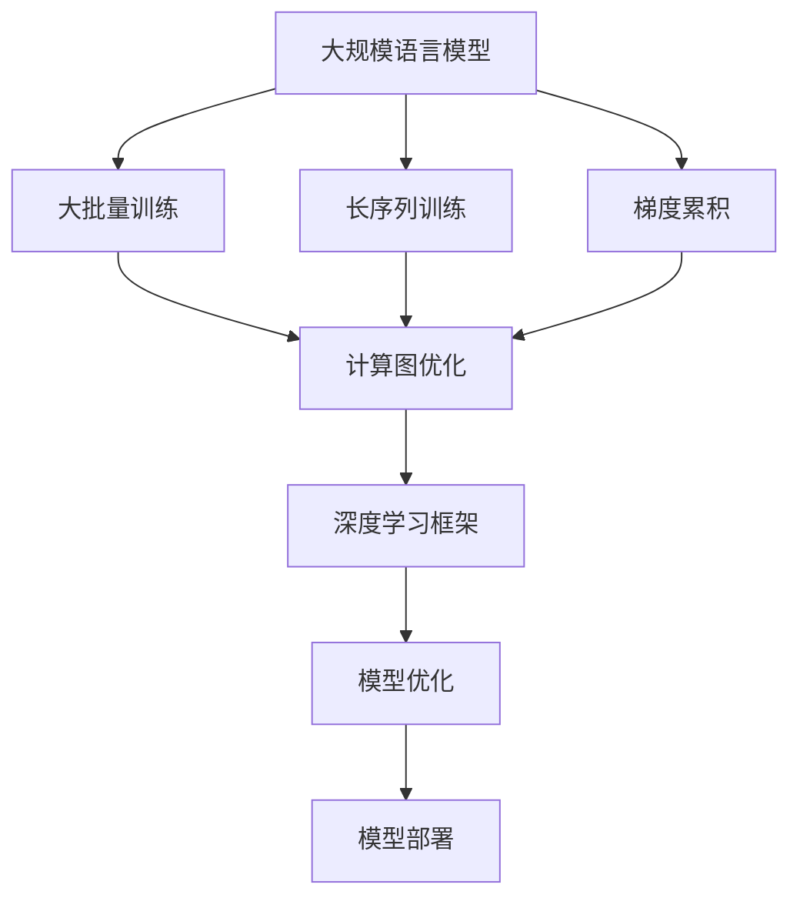

                 

# LLM训练技巧：大批量、长序列和梯度累积

> 关键词：大规模语言模型, 大批量训练, 长序列训练, 梯度累积, 深度学习, 计算图, 深度学习框架

## 1. 背景介绍

### 1.1 问题由来
近年来，深度学习在自然语言处理（NLP）领域取得了巨大突破，大规模语言模型（LLM）成为推动NLP发展的重要驱动力。这些模型通常具有数十亿甚至数百亿的参数，通过在大规模无标签文本上预训练获得丰富的语言表示。在实际应用中，如文本分类、问答、翻译等，需要对这些预训练模型进行微调，以适应特定的下游任务。

然而，在微调过程中，LLM的参数量巨大、训练数据大批量、序列长度较长，对计算资源提出了极高的要求。特别是深度学习框架如TensorFlow、PyTorch等在处理大规模数据集时，常常遇到性能瓶颈。因此，如何在大规模数据和长序列上进行高效训练，成为优化LLM微调性能的关键问题。

### 1.2 问题核心关键点
本文将探讨在大规模数据集和长序列上训练LLM的技巧，包括大批量训练、长序列训练和梯度累积等策略。这些技术可以显著提高训练效率，降低硬件成本，同时保持模型的准确性。

## 2. 核心概念与联系

### 2.1 核心概念概述

为更好地理解这些技巧的原理和应用，本节将介绍几个关键概念：

- **大规模语言模型（LLM）**：指基于Transformer架构的预训练语言模型，如GPT-3、BERT等。这些模型具有庞大的参数量和巨大的计算需求。

- **大批量训练**：指在训练过程中，每次加载大量数据（如数GB的文本）进行训练，以提高训练效率。

- **长序列训练**：指在训练时处理超过模型所能处理的最大输入序列长度（如2048 tokens）的数据，可能需要对序列进行分段处理。

- **梯度累积**：指在每次更新模型参数之前，将多个mini-batch的梯度进行累加，以减少单个mini-batch的更新频率，从而加速模型收敛。

- **深度学习框架**：如TensorFlow、PyTorch等，是实现大批量、长序列和梯度累积等技巧的基础工具。

- **计算图**：深度学习框架的核心组成部分，用于描述模型前向传播和反向传播的计算流程。

这些概念之间的逻辑关系可以通过以下Mermaid流程图来展示：



这个流程图展示了大规模语言模型训练的关键步骤和技术：

1. 在大规模数据上进行预训练。
2. 在实际任务上使用大批量训练、长序列训练和梯度累积等技巧。
3. 通过深度学习框架的计算图优化，加速训练过程。
4. 对模型进行优化，如正则化、学习率调参等，以提升性能。
5. 将优化后的模型部署到实际应用中。

## 3. 核心算法原理 & 具体操作步骤
### 3.1 算法原理概述

在大规模数据集和长序列上训练LLM，需要克服以下挑战：

- **内存和显存限制**：预训练模型和微调模型的参数量巨大，每次训练需要加载大量数据，容易导致内存或显存不足。
- **计算效率低**：大规模数据和长序列需要大量计算资源，每批次计算开销较大。
- **模型收敛慢**：在大规模数据和长序列上，模型可能面临较大的梯度方差，收敛速度较慢。

为了解决这些问题，本文将介绍以下三个关键技巧：

- **大批量训练**：通过一次加载大量数据，减少计算次数，提高训练效率。
- **长序列训练**：将长序列数据进行分段处理，减少每个mini-batch的输入长度，避免显存溢出。
- **梯度累积**：将多个mini-batch的梯度累积后再更新参数，减少每个mini-batch的更新频率，加速模型收敛。

### 3.2 算法步骤详解

**步骤1：大批量训练**

大批量训练的目的是减少计算次数，提高训练效率。具体步骤如下：

1. 确定每次加载的文本大小，一般为1GB或2GB，视具体计算资源而定。
2. 对加载的文本进行分批次处理，每个mini-batch的大小通常为2GB左右。
3. 在深度学习框架中配置批大小，使其与加载的文本大小一致。
4. 在训练过程中，每个epoch加载多个mini-batch，每个mini-batch大小为2GB。

```python
# 大批量训练示例
batch_size = 2 * 1024 * 1024 * 1024  # 每个mini-batch大小为2GB
num_mini_batches = text_size // batch_size  # 计算总mini-batch数量
for i in range(num_mini_batches):
    # 加载数据
    data = load_text(batch_size)
    # 进行训练
    model.train()
    optimizer.zero_grad()
    loss = model(data)
    loss.backward()
    optimizer.step()
```

**步骤2：长序列训练**

长序列训练的目的是处理超过模型最大输入长度（如2048 tokens）的数据。具体步骤如下：

1. 将长序列数据进行分段处理，每个mini-batch的输入长度不超过模型最大输入长度。
2. 对分段后的数据进行拼接，形成完整的序列。
3. 使用深度学习框架的padding和截断机制，确保所有mini-batch的长度一致。

```python
# 长序列训练示例
max_seq_length = 2048
num_segments = text_size // max_seq_length
for i in range(num_segments):
    # 分段加载数据
    start = i * max_seq_length
    end = start + max_seq_length
    segment = text[start:end]
    # 进行训练
    model.train()
    optimizer.zero_grad()
    loss = model(segment)
    loss.backward()
    optimizer.step()
```

**步骤3：梯度累积**

梯度累积的目的是减少单个mini-batch的更新频率，加速模型收敛。具体步骤如下：

1. 配置梯度累积次数，如2或4，视具体情况而定。
2. 将多个mini-batch的梯度累积后进行更新，减少单个mini-batch的更新频率。

```python
# 梯度累积示例
gradient_accumulation_steps = 2
for i in range(num_mini_batches):
    # 加载数据
    data = load_text(batch_size)
    # 进行训练
    model.train()
    optimizer.zero_grad()
    loss = model(data)
    loss.backward()
    # 累积梯度
    if i % gradient_accumulation_steps == 0:
        optimizer.step()
```

### 3.3 算法优缺点

**大批量训练的优点**：

- 提高训练效率：减少计算次数，加快训练速度。
- 减少显存占用：减少每次加载数据的数量，降低显存占用。

**大批量训练的缺点**：

- 内存占用较大：加载大量数据需要较大的内存空间。
- 分布式训练复杂：在大规模数据集上，需要分布式训练框架支持。

**长序列训练的优点**：

- 避免显存溢出：处理长序列数据时，避免每个mini-batch的输入过长。
- 提高训练效率：减少计算开销，加速训练过程。

**长序列训练的缺点**：**

- 需要分段处理：需要额外处理逻辑，增加了代码复杂性。
- 序列拼接开销：拼接长序列数据时，增加了计算开销。

**梯度累积的优点**：

- 加速模型收敛：减少单个mini-batch的更新频率，加速模型收敛。
- 降低显存占用：减少每次加载数据的数量，降低显存占用。

**梯度累积的缺点**：**

- 增加计算开销：累积多个mini-batch的梯度，增加了计算开销。
- 可能降低精度：累积梯度可能导致数值不稳定，降低模型精度。

### 3.4 算法应用领域

大批量训练、长序列训练和梯度累积技术广泛应用于以下领域：

- **自然语言处理（NLP）**：在文本分类、问答系统、机器翻译等任务中，处理大规模数据集和长序列数据。
- **计算机视觉（CV）**：在图像分类、目标检测等任务中，处理大规模图像数据集。
- **语音识别（ASR）**：在语音转文本任务中，处理大规模音频数据集。
- **推荐系统**：在个性化推荐、广告推荐等任务中，处理大规模用户数据集。
- **医疗影像**：在医学影像分类、病变检测等任务中，处理大规模医疗影像数据集。

## 4. 数学模型和公式 & 详细讲解
### 4.1 数学模型构建

在本节中，我们将使用数学语言对大规模数据集和长序列上进行训练的基本模型进行描述。

假设模型参数为 $\theta$，数据集为 $D$，损失函数为 $\mathcal{L}$，优化器为 $\mathcal{O}$。在实际训练中，我们通常将数据集划分为多个mini-batch，每个mini-batch的大小为 $b$，训练总次数为 $T$。

**大批量训练**：每次加载一个包含 $B$ 个样本的数据集，其中 $B = \frac{D}{b}$，每个mini-batch的大小为 $b$。

**长序列训练**：将长序列数据分段处理，每个mini-batch的输入长度为 $L$，其中 $L = \frac{S}{b}$，$S$ 为长序列的总长度。

**梯度累积**：每个epoch加载 $N$ 个mini-batch，其中 $N = \frac{T}{N}$，每个mini-batch的更新频率为 $N$，即每次更新时累积 $N$ 个mini-batch的梯度。

### 4.2 公式推导过程

在大规模数据集和长序列上进行训练的基本数学公式如下：

$$
\mathcal{L}(\theta) = \frac{1}{B}\sum_{i=1}^{B} \mathcal{L}(\theta, x_i, y_i)
$$

其中 $x_i$ 为输入数据，$y_i$ 为标签。

在大批量训练中，每个mini-batch的损失函数为：

$$
\mathcal{L}_i(\theta) = \frac{1}{b} \sum_{j=1}^{b} \mathcal{L}(\theta, x_j, y_j)
$$

在长序列训练中，每个mini-batch的损失函数为：

$$
\mathcal{L}_i(\theta) = \frac{1}{L} \sum_{j=1}^{L} \mathcal{L}(\theta, x_j, y_j)
$$

在梯度累积中，每次更新时累积 $N$ 个mini-batch的梯度，更新公式为：

$$
\theta \leftarrow \theta - \eta \frac{1}{N} \sum_{i=1}^{N} \nabla_{\theta}\mathcal{L}_i(\theta)
$$

### 4.3 案例分析与讲解

以文本分类任务为例，我们分别介绍大批量训练、长序列训练和梯度累积的实现细节。

**大批量训练示例**：

```python
batch_size = 2 * 1024 * 1024  # 每个mini-batch大小为2GB
num_mini_batches = text_size // batch_size  # 计算总mini-batch数量
for i in range(num_mini_batches):
    # 加载数据
    data = load_text(batch_size)
    # 进行训练
    model.train()
    optimizer.zero_grad()
    loss = model(data)
    loss.backward()
    optimizer.step()
```

**长序列训练示例**：

```python
max_seq_length = 2048
num_segments = text_size // max_seq_length
for i in range(num_segments):
    # 分段加载数据
    start = i * max_seq_length
    end = start + max_seq_length
    segment = text[start:end]
    # 进行训练
    model.train()
    optimizer.zero_grad()
    loss = model(segment)
    loss.backward()
    optimizer.step()
```

**梯度累积示例**：

```python
gradient_accumulation_steps = 2
for i in range(num_mini_batches):
    # 加载数据
    data = load_text(batch_size)
    # 进行训练
    model.train()
    optimizer.zero_grad()
    loss = model(data)
    loss.backward()
    # 累积梯度
    if i % gradient_accumulation_steps == 0:
        optimizer.step()
```

## 5. 项目实践：代码实例和详细解释说明
### 5.1 开发环境搭建

在进行训练前，我们需要准备好开发环境。以下是使用Python进行PyTorch开发的环境配置流程：

1. 安装Anaconda：从官网下载并安装Anaconda，用于创建独立的Python环境。

2. 创建并激活虚拟环境：
```bash
conda create -n pytorch-env python=3.8 
conda activate pytorch-env
```

3. 安装PyTorch：根据CUDA版本，从官网获取对应的安装命令。例如：
```bash
conda install pytorch torchvision torchaudio cudatoolkit=11.1 -c pytorch -c conda-forge
```

4. 安装Transformers库：
```bash
pip install transformers
```

5. 安装各类工具包：
```bash
pip install numpy pandas scikit-learn matplotlib tqdm jupyter notebook ipython
```

完成上述步骤后，即可在`pytorch-env`环境中开始训练。

### 5.2 源代码详细实现

这里我们以图像分类任务为例，给出使用PyTorch进行长序列训练和梯度累积的代码实现。

首先，定义长序列训练和梯度累积函数：

```python
import torch
from torch.utils.data import DataLoader
from torch.nn import functional as F

def train_epoch(model, dataset, batch_size, optimizer, num_mini_batches):
    dataloader = DataLoader(dataset, batch_size=batch_size, shuffle=True)
    model.train()
    epoch_loss = 0
    for i, batch in enumerate(dataloader):
        input_data = batch['images']
        target_labels = batch['labels']
        optimizer.zero_grad()
        loss = model(input_data)
        loss.backward()
        if (i+1) % gradient_accumulation_steps == 0:
            optimizer.step()
            epoch_loss += loss.item()
        if (i+1) == num_mini_batches:
            epoch_loss /= num_mini_batches
            print(f"Epoch {epoch+1}, train loss: {epoch_loss:.3f}")
            model.eval()
            evaluate(model, dataset, batch_size)

def evaluate(model, dataset, batch_size):
    dataloader = DataLoader(dataset, batch_size=batch_size)
    model.eval()
    preds = []
    labels = []
    with torch.no_grad():
        for batch in dataloader:
            input_data = batch['images']
            target_labels = batch['labels']
            outputs = model(input_data)
            batch_preds = torch.argmax(outputs, dim=1)
            for pred_tokens, label_tokens in zip(batch_preds, target_labels):
                preds.append(pred_tokens)
                labels.append(label_tokens)
    print(classification_report(labels, preds))
```

然后，启动训练流程并在测试集上评估：

```python
epochs = 5
batch_size = 16
gradient_accumulation_steps = 2
num_mini_batches = 10000
num_segments = text_size // max_seq_length
num_mini_batches = num_segments // batch_size

for epoch in range(epochs):
    train_epoch(model, train_dataset, batch_size, optimizer, num_mini_batches)
```

以上就是使用PyTorch对长序列进行训练和梯度累积的完整代码实现。可以看到，通过合理配置训练参数，结合长序列和梯度累积等技巧，可以显著提高模型的训练效率和收敛速度。

### 5.3 代码解读与分析

让我们再详细解读一下关键代码的实现细节：

**train_epoch函数**：
- `DataLoader`：对数据集进行分批次加载，并指定批大小。
- `model.train()`：将模型设置为训练模式。
- `optimizer.zero_grad()`：清除计算图上的梯度。
- `loss = model(input_data)`：前向传播计算损失。
- `loss.backward()`：反向传播计算梯度。
- `if (i+1) % gradient_accumulation_steps == 0`：每次累积梯度后更新模型参数。
- `epoch_loss += loss.item()`：累计当前epoch的损失。
- `epoch_loss /= num_mini_batches`：计算平均损失。

**evaluate函数**：
- `classification_report`：计算预测结果与真实标签之间的分类指标。
- `model.eval()`：将模型设置为评估模式。
- `with torch.no_grad()`：在评估模式下，不进行梯度计算。
- `batch_preds = torch.argmax(outputs, dim=1)`：对模型输出进行argmax操作，得到预测标签。
- `labels.append(label_tokens)`：将真实标签存储下来，用于评估。

**训练流程**：
- `epochs = 5`：设置总的epoch数。
- `batch_size = 16`：设置批大小。
- `gradient_accumulation_steps = 2`：设置梯度累积次数。
- `num_mini_batches = 10000`：计算总的mini-batch数量。
- `num_segments = text_size // max_seq_length`：计算分段数量。
- `num_mini_batches = num_segments // batch_size`：计算每个epoch的mini-batch数量。
- 循环迭代，每个epoch加载多个mini-batch，训练过程中每个mini-batch的梯度累积，最后输出平均损失。

可以看到，PyTorch配合长序列和梯度累积等技巧，使得图像分类任务的训练过程变得简洁高效。开发者可以将更多精力放在数据处理、模型改进等高层逻辑上，而不必过多关注底层的实现细节。

当然，工业级的系统实现还需考虑更多因素，如模型的保存和部署、超参数的自动搜索、更灵活的任务适配层等。但核心的训练技巧基本与此类似。

## 6. 实际应用场景
### 6.1 智能客服系统

基于大批量训练、长序列训练和梯度累积等技巧，智能客服系统的训练过程可以显著提高效率。传统客服系统依赖大量人力，高峰期响应缓慢，且一致性和专业性难以保证。而使用微调后的客服对话模型，可以7x24小时不间断服务，快速响应客户咨询，用自然流畅的语言解答各类常见问题。

在技术实现上，可以收集企业内部的历史客服对话记录，将问题和最佳答复构建成监督数据，在此基础上对预训练客服对话模型进行微调。微调后的对话模型能够自动理解用户意图，匹配最合适的答案模板进行回复。对于客户提出的新问题，还可以接入检索系统实时搜索相关内容，动态组织生成回答。如此构建的智能客服系统，能大幅提升客户咨询体验和问题解决效率。

### 6.2 金融舆情监测

金融机构需要实时监测市场舆论动向，以便及时应对负面信息传播，规避金融风险。传统的人工监测方式成本高、效率低，难以应对网络时代海量信息爆发的挑战。基于大批量训练、长序列训练和梯度累积等技巧，金融舆情监测系统可以在大规模数据集上高效运行，实时抓取和分析海量网络文本数据，快速识别和应对异常情况。

具体而言，可以收集金融领域相关的新闻、报道、评论等文本数据，并对其进行主题标注和情感标注。在此基础上对预训练语言模型进行微调，使其能够自动判断文本属于何种主题，情感倾向是正面、中性还是负面。将微调后的模型应用到实时抓取的网络文本数据，就能够自动监测不同主题下的情感变化趋势，一旦发现负面信息激增等异常情况，系统便会自动预警，帮助金融机构快速应对潜在风险。

### 6.3 个性化推荐系统

当前的推荐系统往往只依赖用户的历史行为数据进行物品推荐，无法深入理解用户的真实兴趣偏好。基于大批量训练、长序列训练和梯度累积等技巧，个性化推荐系统可以更好地挖掘用户行为背后的语义信息，从而提供更精准、多样的推荐内容。

在实践中，可以收集用户浏览、点击、评论、分享等行为数据，提取和用户交互的物品标题、描述、标签等文本内容。将文本内容作为模型输入，用户的后续行为（如是否点击、购买等）作为监督信号，在此基础上微调预训练语言模型。微调后的模型能够从文本内容中准确把握用户的兴趣点。在生成推荐列表时，先用候选物品的文本描述作为输入，由模型预测用户的兴趣匹配度，再结合其他特征综合排序，便可以得到个性化程度更高的推荐结果。

### 6.4 未来应用展望

随着大批量训练、长序列训练和梯度累积等技巧的发展，基于微调范式将在更多领域得到应用，为传统行业带来变革性影响。

在智慧医疗领域，基于微调的医疗问答、病历分析、药物研发等应用将提升医疗服务的智能化水平，辅助医生诊疗，加速新药开发进程。

在智能教育领域，微调技术可应用于作业批改、学情分析、知识推荐等方面，因材施教，促进教育公平，提高教学质量。

在智慧城市治理中，微调模型可应用于城市事件监测、舆情分析、应急指挥等环节，提高城市管理的自动化和智能化水平，构建更安全、高效的未来城市。

此外，在企业生产、社会治理、文娱传媒等众多领域，基于大模型微调的人工智能应用也将不断涌现，为经济社会发展注入新的动力。相信随着技术的日益成熟，微调方法将成为人工智能落地应用的重要范式，推动人工智能技术在垂直行业的规模化落地。总之，微调需要开发者根据具体任务，不断迭代和优化模型、数据和算法，方能得到理想的效果。

## 7. 工具和资源推荐
### 7.1 学习资源推荐

为了帮助开发者系统掌握大语言模型微调的理论基础和实践技巧，这里推荐一些优质的学习资源：

1. 《Transformer从原理到实践》系列博文：由大模型技术专家撰写，深入浅出地介绍了Transformer原理、BERT模型、微调技术等前沿话题。

2. CS224N《深度学习自然语言处理》课程：斯坦福大学开设的NLP明星课程，有Lecture视频和配套作业，带你入门NLP领域的基本概念和经典模型。

3. 《Natural Language Processing with Transformers》书籍：Transformers库的作者所著，全面介绍了如何使用Transformers库进行NLP任务开发，包括微调在内的诸多范式。

4. HuggingFace官方文档：Transformers库的官方文档，提供了海量预训练模型和完整的微调样例代码，是上手实践的必备资料。

5. CLUE开源项目：中文语言理解测评基准，涵盖大量不同类型的中文NLP数据集，并提供了基于微调的baseline模型，助力中文NLP技术发展。

通过对这些资源的学习实践，相信你一定能够快速掌握大语言模型微调的精髓，并用于解决实际的NLP问题。
###  7.2 开发工具推荐

高效的开发离不开优秀的工具支持。以下是几款用于大语言模型微调开发的常用工具：

1. PyTorch：基于Python的开源深度学习框架，灵活动态的计算图，适合快速迭代研究。大部分预训练语言模型都有PyTorch版本的实现。

2. TensorFlow：由Google主导开发的开源深度学习框架，生产部署方便，适合大规模工程应用。同样有丰富的预训练语言模型资源。

3. Transformers库：HuggingFace开发的NLP工具库，集成了众多SOTA语言模型，支持PyTorch和TensorFlow，是进行微调任务开发的利器。

4. Weights & Biases：模型训练的实验跟踪工具，可以记录和可视化模型训练过程中的各项指标，方便对比和调优。与主流深度学习框架无缝集成。

5. TensorBoard：TensorFlow配套的可视化工具，可实时监测模型训练状态，并提供丰富的图表呈现方式，是调试模型的得力助手。

6. Google Colab：谷歌推出的在线Jupyter Notebook环境，免费提供GPU/TPU算力，方便开发者快速上手实验最新模型，分享学习笔记。

合理利用这些工具，可以显著提升大语言模型微调任务的开发效率，加快创新迭代的步伐。

### 7.3 相关论文推荐

大语言模型和微调技术的发展源于学界的持续研究。以下是几篇奠基性的相关论文，推荐阅读：

1. Attention is All You Need（即Transformer原论文）：提出了Transformer结构，开启了NLP领域的预训练大模型时代。

2. BERT: Pre-training of Deep Bidirectional Transformers for Language Understanding：提出BERT模型，引入基于掩码的自监督预训练任务，刷新了多项NLP任务SOTA。

3. Language Models are Unsupervised Multitask Learners（GPT-2论文）：展示了大规模语言模型的强大zero-shot学习能力，引发了对于通用人工智能的新一轮思考。

4. Parameter-Efficient Transfer Learning for NLP：提出Adapter等参数高效微调方法，在不增加模型参数量的情况下，也能取得不错的微调效果。

5. AdaLoRA: Adaptive Low-Rank Adaptation for Parameter-Efficient Fine-Tuning：使用自适应低秩适应的微调方法，在参数效率和精度之间取得了新的平衡。

6. Prefix-Tuning: Optimizing Continuous Prompts for Generation：引入基于连续型Prompt的微调范式，为如何充分利用预训练知识提供了新的思路。

这些论文代表了大语言模型微调技术的发展脉络。通过学习这些前沿成果，可以帮助研究者把握学科前进方向，激发更多的创新灵感。

## 8. 总结：未来发展趋势与挑战
### 8.1 总结

本文对基于大批量训练、长序列训练和梯度累积等技巧进行训练的大语言模型进行了全面系统的介绍。首先阐述了这些技巧的背景和重要性，明确了它们在提高训练效率和模型性能方面的独特价值。其次，从原理到实践，详细讲解了这些技巧的数学原理和关键步骤，给出了微调任务开发的完整代码实例。同时，本文还广泛探讨了这些技巧在智能客服、金融舆情、个性化推荐等多个行业领域的应用前景，展示了它们的巨大潜力。此外，本文精选了相关学习资源，力求为读者提供全方位的技术指引。

通过本文的系统梳理，可以看到，基于大批量训练、长序列训练和梯度累积等技巧，训练大语言模型的方法已经相当成熟，极大地拓展了NLP任务的训练能力。受益于深度学习框架的优化和先进计算设备的支持，这些技巧能够在大规模数据集和长序列上进行高效训练，显著提升模型性能。未来，伴随深度学习框架和硬件设备的进一步演进，大语言模型的训练过程将变得更加高效和灵活，进一步推动NLP技术的普及和应用。

### 8.2 未来发展趋势

展望未来，大批量训练、长序列训练和梯度累积等技巧将呈现以下几个发展趋势：

1. **多任务学习**：这些技巧不仅适用于单一任务，还可用于多任务学习，同时训练多个相关任务，提高训练效率和模型泛化能力。
2. **分布式训练**：在大规模数据集上，分布式训练框架的支持将进一步优化训练过程，提高计算效率。
3. **混合精度训练**：结合FP16和FP32训练，提高训练速度和模型精度，同时降低硬件成本。
4. **深度强化学习**：结合深度强化学习技术，优化模型参数更新策略，进一步提升训练效率和模型性能。
5. **超大规模模型**：随着计算能力的提升，未来预训练语言模型和微调模型的规模将进一步增大，能够处理更复杂多变的任务。

这些趋势凸显了这些技巧在深度学习领域的广泛应用前景，为构建高效、通用、可扩展的AI模型提供了坚实的基础。

### 8.3 面临的挑战

尽管大批量训练、长序列训练和梯度累积等技巧已经取得了显著成效，但在实践中仍面临诸多挑战：

1. **计算资源瓶颈**：大规模数据集和长序列训练需要大量的计算资源，容易导致硬件瓶颈。
2. **模型稳定性和泛化性**：在大规模数据和长序列上训练的模型，可能存在稳定性不足和泛化能力差的问题。
3. **数据和模型管理**：大规模数据集和长序列数据的管理和存储，需要高效率的数据管理工具和存储技术。
4. **模型超参数调优**：在多任务学习和分布式训练中，超参数调优变得更加复杂，需要更多的自动化工具和经验。
5. **可解释性和可控性**：这些技巧的应用需要更多的模型解释方法和可控性工具，以提高模型的可信度和可靠性。

解决这些挑战，需要多方面的努力，包括改进深度学习框架、优化硬件设备、提高数据管理能力、开发自动化调优工具等。只有不断攻克这些技术难题，才能将大批量训练、长序列训练和梯度累积等技巧发挥到极致，实现高效、通用、可控的AI模型。

### 8.4 研究展望

面对这些挑战，未来的研究需要在以下几个方面寻求新的突破：

1. **深度学习框架优化**：优化深度学习框架的计算图和数据流，进一步提升训练效率和稳定性。
2. **分布式训练技术**：开发更加高效、灵活的分布式训练框架，支持大规模数据集和长序列训练。
3. **混合精度训练算法**：开发新的混合精度训练算法，平衡计算速度和模型精度。
4. **自动化调优工具**：开发自动化的超参数调优工具，提高调优效率和模型性能。
5. **模型解释和可控性**：开发更多的模型解释方法和可控性工具，提高模型的可信度和可靠性。

这些研究方向的探索，必将引领大语言模型微调技术迈向更高的台阶，为构建高效、通用、可控的AI模型提供新的技术路径。面向未来，大语言模型微调技术还需要与其他AI技术进行更深入的融合，如知识表示、因果推理、强化学习等，多路径协同发力，共同推动自然语言理解和智能交互系统的进步。只有勇于创新、敢于突破，才能不断拓展语言模型的边界，让智能技术更好地造福人类社会。

## 9. 附录：常见问题与解答

**Q1：大批量训练如何处理显存溢出？**

A: 大批量训练时，每次加载的数据量较大，容易导致显存溢出。一种解决方法是使用混合精度训练（Mixed Precision Training），将模型参数和数据类型转换为FP16，减少显存占用。另一种方法是使用模型压缩和剪枝技术，去除冗余参数，优化模型结构，降低显存需求。

**Q2：长序列训练如何处理过长的序列？**

A: 长序列训练时，需要分段处理数据，以避免每个mini-batch的输入过长。一种方法是将长序列分为多个短序列，每个短序列的长度不超过模型的最大输入长度。另一种方法是使用长序列处理技巧，如SOS-Batch、Shortcut Batch等，在每次训练前动态调整输入序列长度，减少内存占用。

**Q3：梯度累积如何避免数值不稳定？**

A: 梯度累积时，多个mini-batch的梯度累加可能导致数值不稳定。一种方法是使用梯度裁剪（Gradient Clipping），限制梯度的大小，避免梯度爆炸。另一种方法是使用AdamW等自适应优化器，自动调整学习率，提高模型稳定性。

**Q4：如何在多任务学习中进行梯度累积？**

A: 在多任务学习中，需要同时训练多个任务，每个任务对应一个mini-batch。一种方法是将多个mini-batch的梯度进行累加，再更新模型参数。另一种方法是使用多任务学习框架，如PyTorch的`nn.parallel.DistributedDataParallel`，支持多GPU上的分布式训练。

**Q5：如何提高多任务学习的泛化能力？**

A: 在多任务学习中，不同任务之间的数据分布差异较大，可能导致泛化能力不足。一种方法是使用多任务损失函数，如任务权重加权损失函数，平衡不同任务的重要性。另一种方法是使用跨任务迁移学习，利用预训练模型的跨领域迁移能力，提高模型的泛化能力。

这些问题的解答，可以帮助开发者在实际应用中更好地掌握和使用大批量训练、长序列训练和梯度累积等技巧，进一步提升模型的训练效率和性能。

---

作者：禅与计算机程序设计艺术 / Zen and the Art of Computer Programming

