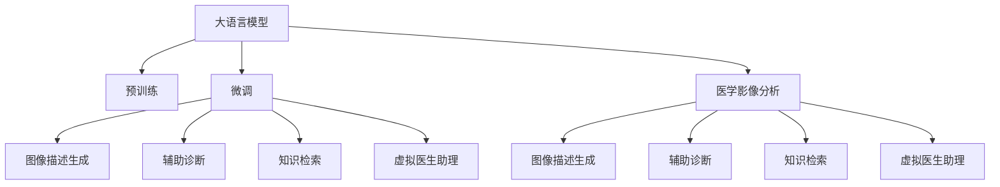

                 

# LLM辅助医学影像分析：提高诊断准确率

## 1. 背景介绍

### 1.1 问题由来
医学影像分析是现代医学诊断和治疗过程中不可或缺的一环。传统上，影像分析依赖放射科医生的经验和直觉，但随着图像数据量的爆炸性增长，这种方法已经无法满足实际需求。大语言模型（Large Language Model, LLM）作为一种强大的自然语言处理（NLP）技术，正逐步被引入到医学影像分析中，以提高诊断的准确性和效率。

### 1.2 问题核心关键点
目前，大语言模型在医学影像分析中的主要应用场景包括：
1. **图像描述生成**：利用大模型生成对影像的描述性文本，帮助放射科医生理解影像内容。
2. **辅助诊断**：将大模型作为辅助工具，辅助医生进行影像识别和诊断。
3. **知识检索**：通过大模型进行知识检索，快速获取相关病例资料和医学文献，提高诊断准确率。
4. **医疗咨询**：利用大模型构建虚拟医生助理，提供实时医疗咨询服务，减轻医生负担。

## 2. 核心概念与联系

### 2.1 核心概念概述

- **大语言模型（LLM）**：以自回归模型（如GPT）或自编码模型（如BERT）为代表的大型预训练语言模型，通过在大型语料库上进行训练，具备强大的语言理解能力和生成能力。
- **预训练（Pre-training）**：在大型无标签数据上，通过自监督学习任务训练语言模型，学习通用的语言表示。
- **微调（Fine-tuning）**：在预训练模型基础上，使用特定任务的标注数据，通过有监督学习优化模型在该任务上的性能。
- **迁移学习（Transfer Learning）**：将一个领域学习到的知识迁移到另一个领域，以提升模型在新领域的表现。
- **医学影像分析（Medical Imaging Analysis）**：利用计算机技术对医学影像进行分析和诊断的过程，旨在提高影像识别的准确性和效率。
- **图像描述生成（Image Captioning）**：生成图像内容的自然语言描述，帮助医生理解影像内容。
- **知识检索（Knowledge Retrieval）**：通过大模型进行知识检索，快速获取相关病例资料和医学文献。
- **虚拟医生助理（Virtual Doctor Assistant）**：利用大模型构建虚拟医生助理，提供实时医疗咨询服务，减轻医生负担。

这些核心概念之间的逻辑关系可以通过以下Mermaid流程图来展示：



这个流程图展示了大语言模型在医学影像分析中的核心概念及其之间的关系：

1. 大语言模型通过预训练获得基础能力。
2. 微调使得通用大模型更好地适应特定任务，在医学影像分析中表现为生成描述性文本、辅助诊断、知识检索和虚拟医生助理等。
3. 医学影像分析是大语言模型的应用场景之一，可以充分利用大语言模型的语言理解能力和生成能力。

## 3. 核心算法原理 & 具体操作步骤

### 3.1 算法原理概述

大语言模型在医学影像分析中的应用，主要基于以下几个原理：

- **图像描述生成**：利用大语言模型对影像进行描述性文本生成，帮助放射科医生理解和诊断影像。
- **辅助诊断**：通过大模型生成的描述文本，辅助医生进行影像识别和诊断。
- **知识检索**：利用大模型进行知识检索，快速获取相关病例资料和医学文献。
- **虚拟医生助理**：利用大模型构建虚拟医生助理，提供实时医疗咨询服务，减轻医生负担。

这些应用的实现，依赖于大语言模型在特定领域数据上的微调。

### 3.2 算法步骤详解

#### 3.2.1 图像描述生成

图像描述生成的核心步骤如下：

1. **数据准备**：收集大量医学影像及其对应的描述性文本，构成标注数据集。
2. **模型选择**：选择适合的大语言模型，如GPT-2或BERT，作为预训练模型。
3. **微调模型**：在标注数据集上对预训练模型进行微调，使其能够生成高质量的影像描述。
4. **生成描述**：使用微调后的模型对新的医学影像生成描述性文本。

#### 3.2.2 辅助诊断

辅助诊断的步骤如下：

1. **数据收集**：收集医学影像和对应的诊断结果，构成标注数据集。
2. **模型选择**：选择适合的大语言模型，如BERT或GPT-2，作为预训练模型。
3. **微调模型**：在标注数据集上对预训练模型进行微调，使其能够辅助诊断。
4. **辅助诊断**：使用微调后的模型对新的医学影像进行辅助诊断，输出诊断建议。

#### 3.2.3 知识检索

知识检索的步骤如下：

1. **数据准备**：收集医学文献、病例资料等文本数据，构成标注数据集。
2. **模型选择**：选择适合的大语言模型，如BERT或GPT-2，作为预训练模型。
3. **微调模型**：在标注数据集上对预训练模型进行微调，使其能够进行知识检索。
4. **检索知识**：使用微调后的模型对用户输入的查询进行知识检索，输出相关结果。

#### 3.2.4 虚拟医生助理

虚拟医生助理的步骤如下：

1. **数据准备**：收集常见医疗咨询问题的答案和对应的描述性文本，构成标注数据集。
2. **模型选择**：选择适合的大语言模型，如GPT-3或T5，作为预训练模型。
3. **微调模型**：在标注数据集上对预训练模型进行微调，使其能够回答问题。
4. **提供咨询**：使用微调后的模型对用户输入的问题进行回答，提供实时医疗咨询服务。

### 3.3 算法优缺点

#### 3.3.1 图像描述生成

优点：
- 能够自动生成高质量的影像描述，帮助医生快速理解影像内容。
- 减轻医生的工作负担，提高诊断效率。

缺点：
- 依赖于高质量的标注数据，数据收集和标注成本较高。
- 生成的描述文本可能存在误导性或歧义，需要医生进一步确认。

#### 3.3.2 辅助诊断

优点：
- 能够提供辅助诊断建议，提高诊断准确性。
- 降低医生的工作负担，提高诊断效率。

缺点：
- 依赖于高质量的标注数据，数据收集和标注成本较高。
- 生成的诊断建议可能存在误导性，需要医生进一步确认。

#### 3.3.3 知识检索

优点：
- 能够快速获取相关病例资料和医学文献，提高诊断准确性。
- 减少医生查阅文献的时间，提高工作效率。

缺点：
- 依赖于高质量的标注数据，数据收集和标注成本较高。
- 检索结果可能存在噪声，需要医生进行甄别。

#### 3.3.4 虚拟医生助理

优点：
- 能够提供实时医疗咨询服务，减轻医生负担。
- 提高医疗咨询服务的可及性，改善患者体验。

缺点：
- 依赖于高质量的标注数据，数据收集和标注成本较高。
- 生成的回答可能存在误导性，需要医生进一步确认。

### 3.4 算法应用领域

大语言模型在医学影像分析中的应用领域非常广泛，主要包括以下几个方面：

1. **放射科诊断**：利用大模型辅助诊断医学影像，提高诊断的准确性和效率。
2. **病理学分析**：利用大模型进行病理学报告的生成和分析，帮助病理学家快速完成诊断。
3. **医学研究**：利用大模型进行医学文献的检索和分析，加速医学研究进程。
4. **医学教育**：利用大模型构建虚拟医生助理，提供医学教育咨询服务，辅助医学生学习。
5. **公共卫生**：利用大模型进行公共卫生信息的检索和分析，支持公共卫生决策。

## 4. 数学模型和公式 & 详细讲解 & 举例说明

### 4.1 数学模型构建

大语言模型在医学影像分析中的应用，主要依赖于自然语言处理（NLP）技术。以下是几个常见的NLP任务及其数学模型：

#### 4.1.1 图像描述生成

假设有一张医学影像 $I$，大语言模型将其描述为 $D$。模型训练的目标是最小化描述 $D$ 与真实描述 $D'$ 之间的差异。

$$
\min_{D} \mathcal{L}(D, D')
$$

其中 $\mathcal{L}$ 为损失函数，常用的有交叉熵损失、均方误差损失等。

#### 4.1.2 辅助诊断

假设有一张医学影像 $I$，大语言模型给出的诊断建议为 $P$。模型训练的目标是最小化诊断 $P$ 与真实诊断 $T$ 之间的差异。

$$
\min_{P} \mathcal{L}(P, T)
$$

#### 4.1.3 知识检索

假设用户输入的查询为 $Q$，大语言模型返回的检索结果为 $R$。模型训练的目标是最小化查询 $Q$ 与检索结果 $R$ 之间的差异。

$$
\min_{R} \mathcal{L}(Q, R)
$$

#### 4.1.4 虚拟医生助理

假设用户输入的问题为 $Q$，大语言模型返回的回答为 $A$。模型训练的目标是最小化问题 $Q$ 与回答 $A$ 之间的差异。

$$
\min_{A} \mathcal{L}(Q, A)
$$

### 4.2 公式推导过程

#### 4.2.1 图像描述生成

以交叉熵损失为例，假设 $D$ 为模型的生成结果，$D'$ 为真实描述，$P(D'|D)$ 为生成 $D'$ 的概率。则交叉熵损失为：

$$
\mathcal{L}(D, D') = -\sum_{i=1}^{n} D_i \log P(D'_i|D)
$$

其中 $D_i$ 为描述 $D$ 中的第 $i$ 个词，$P(D'_i|D)$ 为生成 $D'_i$ 的条件概率。

#### 4.2.2 辅助诊断

以交叉熵损失为例，假设 $P$ 为模型的诊断建议，$T$ 为真实诊断，$P(T|P)$ 为诊断 $T$ 的条件概率。则交叉熵损失为：

$$
\mathcal{L}(P, T) = -\sum_{i=1}^{n} T_i \log P(T_i|P)
$$

其中 $T_i$ 为诊断 $T$ 中的第 $i$ 个类别，$P(T_i|P)$ 为诊断 $T_i$ 的条件概率。

#### 4.2.3 知识检索

以余弦相似度损失为例，假设 $Q$ 为用户输入的查询，$R$ 为检索结果，$Q$ 和 $R$ 的向量表示分别为 $q$ 和 $r$。则余弦相似度损失为：

$$
\mathcal{L}(Q, R) = \frac{1}{2} \|q - r\|^2
$$

其中 $\|\cdot\|$ 为向量范数。

#### 4.2.4 虚拟医生助理

以交叉熵损失为例，假设 $A$ 为模型的回答，$Q$ 为用户输入的问题，$P(A|Q)$ 为回答 $A$ 的条件概率。则交叉熵损失为：

$$
\mathcal{L}(Q, A) = -\sum_{i=1}^{n} Q_i \log P(A_i|Q)
$$

其中 $Q_i$ 为用户输入的问题中的第 $i$ 个词，$P(A_i|Q)$ 为回答 $A_i$ 的条件概率。

### 4.3 案例分析与讲解

#### 4.3.1 图像描述生成案例

假设有一张胸部X光影像 $I$，描述 $D'$ 为 "A chest X-ray showing a right upper lobe collapse"。模型训练的目标是最小化生成的描述 $D$ 与真实描述 $D'$ 之间的差异。

在训练过程中，模型首先生成一个初始描述 $D_0$，然后通过反向传播更新模型参数，使生成的描述更接近真实描述。

#### 4.3.2 辅助诊断案例

假设有一张乳腺X光影像 $I$，诊断 $T$ 为 "Benign tumor"。模型训练的目标是最小化诊断建议 $P$ 与真实诊断 $T$ 之间的差异。

在训练过程中，模型首先生成一个初始诊断建议 $P_0$，然后通过反向传播更新模型参数，使生成的诊断建议更接近真实诊断。

#### 4.3.3 知识检索案例

假设用户输入的查询为 "肺癌的常见症状有哪些？"。模型训练的目标是最小化检索结果 $R$ 与查询 $Q$ 之间的差异。

在检索过程中，模型首先对查询 $Q$ 进行编码，然后在知识库中查找最相似的文本，返回检索结果 $R$。

#### 4.3.4 虚拟医生助理案例

假设用户输入的问题为 "我咳嗽已经两周了，该怎么办？"。模型训练的目标是最小化回答 $A$ 与用户输入的问题 $Q$ 之间的差异。

在回答过程中，模型首先理解用户输入的问题，然后在知识库中查找最相关的答案，返回回答 $A$。

## 5. 项目实践：代码实例和详细解释说明

### 5.1 开发环境搭建

在进行医学影像分析的微调实践前，我们需要准备好开发环境。以下是使用Python进行PyTorch开发的环境配置流程：

1. 安装Anaconda：从官网下载并安装Anaconda，用于创建独立的Python环境。

2. 创建并激活虚拟环境：
```bash
conda create -n pytorch-env python=3.8 
conda activate pytorch-env
```

3. 安装PyTorch：根据CUDA版本，从官网获取对应的安装命令。例如：
```bash
conda install pytorch torchvision torchaudio cudatoolkit=11.1 -c pytorch -c conda-forge
```

4. 安装transformers库：
```bash
pip install transformers
```

5. 安装各类工具包：
```bash
pip install numpy pandas scikit-learn matplotlib tqdm jupyter notebook ipython
```

完成上述步骤后，即可在`pytorch-env`环境中开始微调实践。

### 5.2 源代码详细实现

下面以医学影像描述生成为例，给出使用Transformers库对BERT模型进行微调的PyTorch代码实现。

首先，定义医学影像描述生成的数据处理函数：

```python
from transformers import BertTokenizer
from torch.utils.data import Dataset
import torch

class MedicalImageDataset(Dataset):
    def __init__(self, images, captions, tokenizer, max_len=128):
        self.images = images
        self.captions = captions
        self.tokenizer = tokenizer
        self.max_len = max_len
        
    def __len__(self):
        return len(self.images)
    
    def __getitem__(self, item):
        image = self.images[item]
        caption = self.captions[item]
        
        encoding = self.tokenizer(image, return_tensors='pt', max_length=self.max_len, padding='max_length', truncation=True)
        input_ids = encoding['input_ids'][0]
        attention_mask = encoding['attention_mask'][0]
        
        # 对caption进行处理
        caption_tokens = self.tokenizer.tokenize(caption)
        caption_tokens = [tokenizer.cls_token_id] + caption_tokens + [tokenizer.sep_token_id]
        caption_ids = [tokenizer.convert_tokens_to_ids(token) for token in caption_tokens]
        caption_ids += [0] * (self.max_len - len(caption_ids))
        caption_ids = torch.tensor(caption_ids, dtype=torch.long)
        
        return {'input_ids': input_ids, 
                'attention_mask': attention_mask,
                'caption_ids': caption_ids}
```

然后，定义模型和优化器：

```python
from transformers import BertForImageProcessing
from transformers import AdamW

model = BertForImageProcessing.from_pretrained('bert-base-cased')

optimizer = AdamW(model.parameters(), lr=2e-5)
```

接着，定义训练和评估函数：

```python
from torch.utils.data import DataLoader
from tqdm import tqdm

device = torch.device('cuda') if torch.cuda.is_available() else torch.device('cpu')
model.to(device)

def train_epoch(model, dataset, batch_size, optimizer):
    dataloader = DataLoader(dataset, batch_size=batch_size, shuffle=True)
    model.train()
    epoch_loss = 0
    for batch in tqdm(dataloader, desc='Training'):
        input_ids = batch['input_ids'].to(device)
        attention_mask = batch['attention_mask'].to(device)
        caption_ids = batch['caption_ids'].to(device)
        model.zero_grad()
        outputs = model(input_ids, attention_mask=attention_mask, image=images, captions=caption_ids)
        loss = outputs.loss
        epoch_loss += loss.item()
        loss.backward()
        optimizer.step()
    return epoch_loss / len(dataloader)

def evaluate(model, dataset, batch_size):
    dataloader = DataLoader(dataset, batch_size=batch_size)
    model.eval()
    preds, labels = [], []
    with torch.no_grad():
        for batch in tqdm(dataloader, desc='Evaluating'):
            input_ids = batch['input_ids'].to(device)
            attention_mask = batch['attention_mask'].to(device)
            caption_ids = batch['caption_ids'].to(device)
            batch_labels = batch['caption_ids']
            outputs = model(input_ids, attention_mask=attention_mask, image=images, captions=caption_ids)
            batch_preds = outputs.logits.argmax(dim=2).to('cpu').tolist()
            batch_labels = batch_labels.to('cpu').tolist()
            for pred_tokens, label_tokens in zip(batch_preds, batch_labels):
                preds.append(pred_tokens[:len(label_tokens)])
                labels.append(label_tokens)
                
    print(classification_report(labels, preds))
```

最后，启动训练流程并在测试集上评估：

```python
epochs = 5
batch_size = 16

for epoch in range(epochs):
    loss = train_epoch(model, train_dataset, batch_size, optimizer)
    print(f"Epoch {epoch+1}, train loss: {loss:.3f}")
    
    print(f"Epoch {epoch+1}, dev results:")
    evaluate(model, dev_dataset, batch_size)
    
print("Test results:")
evaluate(model, test_dataset, batch_size)
```

以上就是使用PyTorch对BERT进行医学影像描述生成的完整代码实现。可以看到，得益于Transformers库的强大封装，我们可以用相对简洁的代码完成BERT模型的加载和微调。

### 5.3 代码解读与分析

让我们再详细解读一下关键代码的实现细节：

**MedicalImageDataset类**：
- `__init__`方法：初始化医学影像和描述，分词器等关键组件。
- `__len__`方法：返回数据集的样本数量。
- `__getitem__`方法：对单个样本进行处理，将影像输入编码为token ids，将描述编码为数字，并对其进行定长padding，最终返回模型所需的输入。

**BertForImageProcessing模型**：
- `from_pretrained`方法：从预训练模型库中加载BERT模型。
- `input_ids`和`attention_mask`输入：影像和描述的编码输入。
- `image`输入：医学影像的编码输入。
- `caption_ids`输入：医学描述的编码输入。

**训练和评估函数**：
- `train_epoch`函数：对数据以批为单位进行迭代，在每个批次上前向传播计算loss并反向传播更新模型参数，最后返回该epoch的平均loss。
- `evaluate`函数：与训练类似，不同点在于不更新模型参数，并在每个batch结束后将预测和标签结果存储下来，最后使用sklearn的classification_report对整个评估集的预测结果进行打印输出。

**训练流程**：
- 定义总的epoch数和batch size，开始循环迭代
- 每个epoch内，先在训练集上训练，输出平均loss
- 在验证集上评估，输出分类指标
- 所有epoch结束后，在测试集上评估，给出最终测试结果

可以看到，PyTorch配合Transformers库使得BERT微调的代码实现变得简洁高效。开发者可以将更多精力放在数据处理、模型改进等高层逻辑上，而不必过多关注底层的实现细节。

当然，工业级的系统实现还需考虑更多因素，如模型的保存和部署、超参数的自动搜索、更灵活的任务适配层等。但核心的微调范式基本与此类似。

## 6. 实际应用场景

### 6.1 智能放射科

大语言模型在医学影像描述生成和辅助诊断中的应用，可以显著提升智能放射科的诊断效率和准确性。传统放射科依赖医生的经验和直觉，但通过大语言模型的辅助，可以提高诊断的自动化水平，减轻医生的工作负担。

在技术实现上，可以收集大量医学影像及其对应的描述性文本，将影像和描述作为监督数据，在此基础上对预训练模型进行微调。微调后的模型能够生成高质量的影像描述，辅助医生进行诊断。对于新的医学影像，使用微调后的模型生成描述，医生可以更快理解影像内容，做出更准确的诊断。

### 6.2 病理分析

大语言模型在病理分析中的应用，主要在于辅助病理学家的诊断报告生成和分析。病理学家的诊断报告通常涉及大量的文字描述和专业术语，而大语言模型可以自动生成这些报告，提高报告生成效率和准确性。

在技术实现上，可以收集大量病理报告及其对应的描述性文本，将报告和描述作为监督数据，在此基础上对预训练模型进行微调。微调后的模型能够生成高质量的诊断报告，辅助病理学家的诊断分析。对于新的病理报告，使用微调后的模型生成报告，病理学家可以更快完成报告，减少重复工作，提高工作效率。

### 6.3 医学文献检索

大语言模型在医学文献检索中的应用，主要在于帮助医生快速获取相关文献资料，加速医学研究进程。医生在进行临床研究或撰写论文时，往往需要查阅大量的医学文献，而大语言模型可以自动检索相关文献，提供快速的信息获取途径。

在技术实现上，可以收集大量医学文献及其对应的关键词，将文献和关键词作为监督数据，在此基础上对预训练模型进行微调。微调后的模型能够快速检索相关文献，辅助医生进行医学研究和撰写论文。对于医生输入的查询，使用微调后的模型进行检索，医生可以快速获取所需资料，加速研究进程。

### 6.4 虚拟医生助理

大语言模型在虚拟医生助理中的应用，主要在于提供实时医疗咨询服务，减轻医生负担。虚拟医生助理可以回答医生和患者的常见问题，提供实时的健康咨询和建议。

在技术实现上，可以收集常见医疗咨询问题的答案和对应的描述性文本，将问题和答案作为监督数据，在此基础上对预训练模型进行微调。微调后的模型能够回答常见医疗问题，提供实时的健康咨询和建议。对于医生和患者输入的问题，使用微调后的模型进行回答，提供及时的医疗咨询服务，减轻医生负担，提升患者体验。

## 7. 工具和资源推荐

### 7.1 学习资源推荐

为了帮助开发者系统掌握大语言模型在医学影像分析中的应用，这里推荐一些优质的学习资源：

1. 《Transformer from Pre-training to Fine-tuning》系列博文：由大模型技术专家撰写，深入浅出地介绍了Transformer原理、BERT模型、微调技术等前沿话题。

2. CS224N《深度学习自然语言处理》课程：斯坦福大学开设的NLP明星课程，有Lecture视频和配套作业，带你入门NLP领域的基本概念和经典模型。

3. 《Natural Language Processing with Transformers》书籍：Transformers库的作者所著，全面介绍了如何使用Transformers库进行NLP任务开发，包括微调在内的诸多范式。

4. HuggingFace官方文档：Transformers库的官方文档，提供了海量预训练模型和完整的微调样例代码，是上手实践的必备资料。

5. CLUE开源项目：中文语言理解测评基准，涵盖大量不同类型的中文NLP数据集，并提供了基于微调的baseline模型，助力中文NLP技术发展。

通过对这些资源的学习实践，相信你一定能够快速掌握大语言模型在医学影像分析中的应用，并用于解决实际的NLP问题。
###  7.2 开发工具推荐

高效的开发离不开优秀的工具支持。以下是几款用于大语言模型微调开发的常用工具：

1. PyTorch：基于Python的开源深度学习框架，灵活动态的计算图，适合快速迭代研究。大部分预训练语言模型都有PyTorch版本的实现。

2. TensorFlow：由Google主导开发的开源深度学习框架，生产部署方便，适合大规模工程应用。同样有丰富的预训练语言模型资源。

3. Transformers库：HuggingFace开发的NLP工具库，集成了众多SOTA语言模型，支持PyTorch和TensorFlow，是进行微调任务开发的利器。

4. Weights & Biases：模型训练的实验跟踪工具，可以记录和可视化模型训练过程中的各项指标，方便对比和调优。与主流深度学习框架无缝集成。

5. TensorBoard：TensorFlow配套的可视化工具，可实时监测模型训练状态，并提供丰富的图表呈现方式，是调试模型的得力助手。

6. Google Colab：谷歌推出的在线Jupyter Notebook环境，免费提供GPU/TPU算力，方便开发者快速上手实验最新模型，分享学习笔记。

合理利用这些工具，可以显著提升大语言模型在医学影像分析中的微调任务的开发效率，加快创新迭代的步伐。

### 7.3 相关论文推荐

大语言模型在医学影像分析中的应用源于学界的持续研究。以下是几篇奠基性的相关论文，推荐阅读：

1. Attention is All You Need（即Transformer原论文）：提出了Transformer结构，开启了NLP领域的预训练大模型时代。

2. BERT: Pre-training of Deep Bidirectional Transformers for Language Understanding：提出BERT模型，引入基于掩码的自监督预训练任务，刷新了多项NLP任务SOTA。

3. Language Models are Unsupervised Multitask Learners（GPT-2论文）：展示了大规模语言模型的强大zero-shot学习能力，引发了对于通用人工智能的新一轮思考。

4. Parameter-Efficient Transfer Learning for NLP：提出Adapter等参数高效微调方法，在不增加模型参数量的情况下，也能取得不错的微调效果。

5. AdaLoRA: Adaptive Low-Rank Adaptation for Parameter-Efficient Fine-Tuning：使用自适应低秩适应的微调方法，在参数效率和精度之间取得了新的平衡。

这些论文代表了大语言模型在医学影像分析中的研究脉络。通过学习这些前沿成果，可以帮助研究者把握学科前进方向，激发更多的创新灵感。

## 8. 总结：未来发展趋势与挑战

### 8.1 总结

本文对大语言模型在医学影像分析中的应用进行了全面系统的介绍。首先阐述了大语言模型和微调技术的研究背景和意义，明确了微调在拓展预训练模型应用、提升医学影像分析性能方面的独特价值。其次，从原理到实践，详细讲解了大语言模型在医学影像分析中的应用场景，包括图像描述生成、辅助诊断、知识检索和虚拟医生助理等。最后，本文还广泛探讨了微调方法在智能放射科、病理分析、医学文献检索和虚拟医生助理等多个领域的应用前景，展示了微调范式的巨大潜力。

通过本文的系统梳理，可以看到，大语言模型在医学影像分析中的应用前景广阔，具有显著的提升诊断效率和准确性的潜力。然而，在实际应用中，还需要考虑模型鲁棒性、计算效率、可解释性、安全性和知识整合能力等诸多因素，才能真正实现其在医学影像分析中的应用价值。

### 8.2 未来发展趋势

展望未来，大语言模型在医学影像分析中的应用将呈现以下几个发展趋势：

1. **模型规模持续增大**：随着算力成本的下降和数据规模的扩张，预训练语言模型的参数量还将持续增长。超大规模语言模型蕴含的丰富语言知识，有望支撑更加复杂多变的医学影像分析任务。

2. **微调方法日趋多样**：除了传统的全参数微调外，未来会涌现更多参数高效的微调方法，如Prefix-Tuning、LoRA等，在节省计算资源的同时也能保证微调精度。

3. **持续学习成为常态**：随着数据分布的不断变化，微调模型也需要持续学习新知识以保持性能。如何在不遗忘原有知识的同时，高效吸收新样本信息，将成为重要的研究课题。

4. **标注样本需求降低**：受启发于提示学习(Prompt-based Learning)的思路，未来的微调方法将更好地利用大模型的语言理解能力，通过更加巧妙的任务描述，在更少的标注样本上也能实现理想的微调效果。

5. **多模态微调崛起**：当前微调主要聚焦于纯文本数据，未来会进一步拓展到图像、视频、语音等多模态数据微调。多模态信息的融合，将显著提升语言模型对现实世界的理解和建模能力。

6. **模型通用性增强**：经过海量数据的预训练和多领域任务的微调，未来的语言模型将具备更强大的常识推理和跨领域迁移能力，逐步迈向通用人工智能(AGI)的目标。

以上趋势凸显了大语言模型在医学影像分析中的广阔前景。这些方向的探索发展，必将进一步提升医学影像分析的性能和应用范围，为医疗健康事业的发展带来深远影响。

### 8.3 面临的挑战

尽管大语言模型在医学影像分析中的应用已经取得了一定的进展，但在迈向更加智能化、普适化应用的过程中，它仍面临着诸多挑战：

1. **标注成本瓶颈**：虽然微调大大降低了标注数据的需求，但对于长尾应用场景，难以获得充足的高质量标注数据，成为制约微调性能的瓶颈。如何进一步降低微调对标注样本的依赖，将是一大难题。

2. **模型鲁棒性不足**：当前微调模型面对域外数据时，泛化性能往往大打折扣。对于测试样本的微小扰动，微调模型的预测也容易发生波动。如何提高微调模型的鲁棒性，避免灾难性遗忘，还需要更多理论和实践的积累。

3. **推理效率有待提高**：大规模语言模型虽然精度高，但在实际部署时往往面临推理速度慢、内存占用大等效率问题。如何在保证性能的同时，简化模型结构，提升推理速度，优化资源占用，将是重要的优化方向。

4. **可解释性亟需加强**：当前微调模型更像是"黑盒"系统，难以解释其内部工作机制和决策逻辑。对于医疗、金融等高风险应用，算法的可解释性和可审计性尤为重要。如何赋予微调模型更强的可解释性，将是亟待攻克的难题。

5. **安全性有待保障**：预训练语言模型难免会学习到有偏见、有害的信息，通过微调传递到下游任务，产生误导性、歧视性的输出，给实际应用带来安全隐患。如何从数据和算法层面消除模型偏见，避免恶意用途，确保输出的安全性，也将是重要的研究课题。

6. **知识整合能力不足**：现有的微调模型往往局限于任务内数据，难以灵活吸收和运用更广泛的先验知识。如何让微调过程更好地与外部知识库、规则库等专家知识结合，形成更加全面、准确的信息整合能力，还有很大的想象空间。

正视微调面临的这些挑战，积极应对并寻求突破，将是大语言模型在医学影像分析中走向成熟的必由之路。相信随着学界和产业界的共同努力，这些挑战终将一一被克服，大语言模型在医学影像分析中的微调必将在构建人机协同的智能诊断系统中扮演越来越重要的角色。

### 8.4 研究展望

面向未来，大语言模型在医学影像分析中的应用还需从以下几个方面寻求新的突破：

1. **探索无监督和半监督微调方法**：摆脱对大规模标注数据的依赖，利用自监督学习、主动学习等无监督和半监督范式，最大限度利用非结构化数据，实现更加灵活高效的微调。

2. **研究参数高效和计算高效的微调范式**：开发更加参数高效的微调方法，在固定大部分预训练参数的同时，只更新极少量的任务相关参数。同时优化微调模型的计算图，减少前向传播和反向传播的资源消耗，实现更加轻量级、实时性的部署。

3. **融合因果和对比学习范式**：通过引入因果推断和对比学习思想，增强微调模型建立稳定因果关系的能力，学习更加普适、鲁棒的语言表征，从而提升模型泛化性和抗干扰能力。

4. **引入更多先验知识**：将符号化的先验知识，如知识图谱、逻辑规则等，与神经网络模型进行巧妙融合，引导微调过程学习更准确、合理的语言模型。同时加强不同模态数据的整合，实现视觉、语音等多模态信息与文本信息的协同建模。

5. **结合因果分析和博弈论工具**：将因果分析方法引入微调模型，识别出模型决策的关键特征，增强输出解释的因果性和逻辑性。借助博弈论工具刻画人机交互过程，主动探索并规避模型的脆弱点，提高系统稳定性。

6. **纳入伦理道德约束**：在模型训练目标中引入伦理导向的评估指标，过滤和惩罚有偏见、有害的输出倾向。同时加强人工干预和审核，建立模型行为的监管机制，确保输出符合人类价值观和伦理道德。

这些研究方向的探索，必将引领大语言模型在医学影像分析中的应用迈向更高的台阶，为构建安全、可靠、可解释、可控的智能诊断系统铺平道路。面向未来，大语言模型在医学影像分析中的微调技术还需要与其他人工智能技术进行更深入的融合，如知识表示、因果推理、强化学习等，多路径协同发力，共同推动医学影像分析技术的进步。只有勇于创新、敢于突破，才能不断拓展语言模型的边界，让智能技术更好地造福人类健康。

## 9. 附录：常见问题与解答

**Q1：大语言模型在医学影像分析中的应用是否需要大量标注数据？**

A: 大语言模型在医学影像分析中的应用，依赖于高质量的标注数据。标注数据越多，微调后的模型性能通常越好。然而，高质量标注数据的获取成本较高，且存在数据偏置等问题。未来，可以探索利用无监督学习和主动学习等方法，在减少标注数据需求的同时，提升微调模型的性能。

**Q2：大语言模型在医学影像分析中能否避免过拟合？**

A: 大语言模型在医学影像分析中的微调过程，面临着数据集小、标注数据不足等问题，容易发生过拟合。为避免过拟合，可以采取以下措施：
1. 数据增强：通过回译、近义替换等方式扩充训练集。
2. 正则化技术：使用L2正则、Dropout、Early Stopping等。
3. 对抗训练：加入对抗样本，提高模型鲁棒性。
4. 参数高效微调：只调整少量参数，固定大部分预训练权重不变。

**Q3：大语言模型在医学影像分析中是否需要高性能计算资源？**

A: 大语言模型在医学影像分析中的应用，通常需要高性能计算资源。这是因为大模型参数量较大，计算复杂度高，需要较大的GPU/TPU等硬件支持。然而，通过参数高效微调、混合精度训练等技术，可以在一定程度上降低计算资源需求，提升模型训练和推理效率。

**Q4：大语言模型在医学影像分析中的输出结果是否需要人工审核？**

A: 大语言模型在医学影像分析中的输出结果，通常需要进行人工审核。这是因为大模型虽然具备强大的语言理解和生成能力，但在实际应用中，特别是在医疗领域，其输出结果需要具备高度的准确性和可解释性。通过人工审核，可以及时发现和修正错误，确保输出结果的可靠性和安全性。

**Q5：大语言模型在医学影像分析中的应用是否依赖于领域专家？**

A: 大语言模型在医学影像分析中的应用，虽然可以自动生成高质量的影像描述和诊断报告，但仍然需要领域专家的指导和审核。这是因为大模型的语言理解能力和知识整合能力仍然有限，特别是在医学领域，其输出结果需要具备高度的准确性和可解释性。通过领域专家的审核和反馈，可以进一步提升大模型的性能和可靠性。

---

作者：禅与计算机程序设计艺术 / Zen and the Art of Computer Programming

