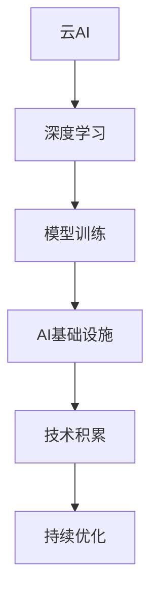

                 

# Lepton AI优势：深度参与云AI发展积累丰富经验

> 关键词：云AI, 深度学习, 模型训练, AI基础设施, 技术积累, 高性能计算

## 1. 背景介绍

随着人工智能(AI)技术的不断成熟和普及，云AI（Cloud AI）作为AI技术的重要应用形态，在全球范围内得到了快速发展和广泛应用。云AI不仅为企业提供了高效、经济的AI计算资源，也促进了AI技术的商业化和产业化进程。

Lepton AI作为领先的云AI平台，深度参与和推动了云AI的发展，积累了丰富的技术经验和管理实践。本文将系统介绍Lepton AI在云AI领域的优势和经验，帮助读者全面了解云AI的最新动态和技术趋势。

## 2. 核心概念与联系

### 2.1 核心概念概述

- **云AI (Cloud AI)**：利用云计算资源提供的AI计算服务，包括模型训练、推理、数据处理等。云AI通过按需分配计算资源，解决了企业AI基础设施投资大、运维复杂等问题，加速AI技术的应用落地。
- **深度学习 (Deep Learning)**：基于神经网络技术的AI子领域，通过多层次的非线性特征提取，实现了图像、语音、自然语言等多种复杂任务的自动处理。深度学习在云AI中应用广泛，成为推动AI发展的核心动力。
- **模型训练 (Model Training)**：利用大量数据对AI模型进行迭代优化，提高模型的泛化能力和性能。云AI提供了灵活的训练环境，支持分布式并行训练，极大提高了模型训练效率。
- **AI基础设施 (AI Infrastructure)**：包括数据存储、计算集群、网络通信、安全认证等，是支持云AI正常运行的技术基础。AI基础设施的优化和扩展，是提高云AI服务质量的关键。
- **技术积累 (Technical Accumulation)**：企业在AI技术研发、应用实践中的经验积累，包括算法创新、模型优化、工程优化等。技术积累是企业保持AI技术领先地位的重要支撑。

### 2.2 核心概念原理和架构的 Mermaid 流程图(Mermaid 流程节点中不要有括号、逗号等特殊字符)



这个流程图展示了云AI、深度学习、模型训练、AI基础设施和技术积累之间的关系。其中：

- 云AI为深度学习和模型训练提供了计算资源。
- 深度学习通过多层次特征提取，提升了模型训练的效果。
- AI基础设施是深度学习和模型训练的底层支持。
- 技术积累进一步优化了云AI的各个环节，实现了性能提升和资源优化。

## 3. 核心算法原理 & 具体操作步骤
### 3.1 算法原理概述

Lepton AI的云AI平台基于深度学习算法和分布式训练架构，通过高效的模型训练和优化策略，实现了高性能的AI计算服务。其核心算法原理如下：

- **分布式训练 (Distributed Training)**：利用多个计算节点并行处理训练任务，大大提高了模型训练的速度和效率。
- **混合精度训练 (Mixed-Precision Training)**：通过混合浮点数精度（如16位和32位）的计算方式，优化了内存使用和计算速度。
- **梯度积累 (Gradient Accumulation)**：将多个小批量梯度进行累加后再进行参数更新，进一步减少了计算量，提高了模型性能。
- **自适应学习率 (Adaptive Learning Rate)**：如AdamW等自适应优化算法，能够动态调整学习率，适应不同任务和数据的特点。

### 3.2 算法步骤详解

以下是一个基于Lepton AI平台的模型训练流程图，展示了从数据准备到模型部署的完整过程：

1. **数据准备**：收集、预处理训练数据，进行数据增强和划分训练集、验证集、测试集。
2. **模型选择**：选择合适的深度学习模型，如ResNet、BERT等，进行参数初始化。
3. **分布式训练**：将模型和数据分发到多个计算节点上，进行分布式并行训练。
4. **混合精度计算**：在计算过程中使用混合精度，减少内存占用，提升计算效率。
5. **梯度积累**：将多个小批量梯度进行累加，降低单次更新的计算量。
6. **自适应学习率**：动态调整学习率，提高模型训练的稳定性和收敛速度。
7. **模型评估**：在验证集上评估模型性能，根据性能调整模型参数。
8. **模型部署**：将优化后的模型部署到云AI平台，进行推理和调用。

### 3.3 算法优缺点

Lepton AI在云AI领域具有以下优势：

**优点**：
1. **高效计算**：通过分布式训练和混合精度计算，显著提高了模型训练的速度和效率。
2. **资源弹性**：按需分配计算资源，满足不同规模和类型的训练任务需求。
3. **技术积累**：积累丰富的技术经验和管理实践，提供全面的技术支持和优化建议。
4. **灵活扩展**：支持多种计算框架和算法，适应各种业务需求和场景。

**缺点**：
1. **成本较高**：初期投资和运维成本较高，需要一定的资金和技术积累。
2. **数据隐私**：数据存储和传输过程中需要考虑隐私保护和安全认证，增加了复杂性。
3. **性能瓶颈**：在大规模数据和复杂模型训练时，可能面临计算资源不足的问题。
4. **技术门槛高**：需要具备一定的AI和云计算技术知识，才能有效使用云AI平台。

### 3.4 算法应用领域

Lepton AI在云AI领域的应用非常广泛，涵盖了图像识别、语音识别、自然语言处理、推荐系统等多个领域。以下是一些具体的应用场景：

- **图像识别**：在医疗、安防、零售等领域，利用云AI平台进行图像分类、目标检测等任务，提升识别精度和效率。
- **语音识别**：在智能家居、客服、交通等领域，利用云AI平台进行语音识别和自然语言理解，实现智能交互和自动化处理。
- **自然语言处理**：在内容推荐、智能问答、机器翻译等领域，利用云AI平台进行文本分析和处理，提供高效智能服务。
- **推荐系统**：在电商、金融、娱乐等领域，利用云AI平台进行用户行为分析和物品推荐，提升用户体验和业务效果。

## 4. 数学模型和公式 & 详细讲解 & 举例说明

### 4.1 数学模型构建

Lepton AI云AI平台的核心数学模型包括深度神经网络（如卷积神经网络CNN、循环神经网络RNN、Transformer等）和分布式训练算法（如分布式SGD、混合精度训练、梯度积累等）。

以Transformer模型为例，其基本数学模型如下：

$$
y = f(x, \theta)
$$

其中，$x$为输入数据，$\theta$为模型参数，$f(\cdot)$为模型函数，$y$为模型输出。

### 4.2 公式推导过程

Transformer模型的主要推导过程如下：

1. **自注意力机制**：利用查询、键和值向量计算注意力权重，生成自注意力向量。
2. **多头注意力**：将自注意力向量进行线性变换和投影，生成多头注意力结果。
3. **前馈神经网络**：将多头注意力结果进行前馈神经网络处理，生成最终输出向量。
4. **层归一化**：对输出向量进行层归一化，控制模型梯度稳定。
5. **残差连接**：将输入数据与输出向量相加，保留输入信息。
6. **堆叠多层网络**：堆叠多个Transformer层，形成深度神经网络。

以自注意力机制的公式推导为例：

$$
Q = Ax
$$

$$
K = Bx
$$

$$
V = Cx
$$

$$
A = [a_1, a_2, ..., a_h]^T, B = [b_1, b_2, ..., b_h]^T, C = [c_1, c_2, ..., c_h]^T
$$

其中，$Q$、$K$、$V$为查询、键和值向量，$a$、$b$、$c$为线性变换矩阵。

### 4.3 案例分析与讲解

以自然语言处理任务中的文本分类为例，利用Transformer模型进行微调。

假设输入文本为$x$，标签为$y$，Transformer模型为$f(x, \theta)$。首先对文本进行分词和向量化处理，然后通过Transformer模型得到输出向量$y$。利用交叉熵损失函数计算损失$\ell$，进行反向传播更新模型参数$\theta$：

$$
\ell = -\frac{1}{N}\sum_{i=1}^N [y_i\log f(x_i, \theta)+(1-y_i)\log (1-f(x_i, \theta))]
$$

在训练过程中，通过分布式训练、混合精度计算、梯度积累等优化策略，提升模型训练效率和性能。在测试阶段，利用验证集评估模型效果，并根据效果调整模型参数，最终得到优化后的Transformer模型。

## 5. 项目实践：代码实例和详细解释说明

### 5.1 开发环境搭建

以下是基于Lepton AI平台的模型训练环境搭建步骤：

1. **安装Lepton AI SDK**：
```
pip install leptonai
```

2. **配置计算资源**：
```
leptonai config --cpu=4 --gpu=2
```

3. **准备数据集**：
```
leptonai dataset create --name my_dataset --type image classification --source s3://my-bucket/my-dataset
```

### 5.2 源代码详细实现

以下是一个简单的模型训练代码示例：

```python
import leptonai as l
import torch
import torch.nn as nn
import torchvision.transforms as transforms

class TransformerModel(nn.Module):
    def __init__(self):
        super(TransformerModel, self).__init__()
        self.transformer = nn.Transformer()

    def forward(self, x):
        return self.transformer(x)

model = TransformerModel()
optimizer = torch.optim.Adam(model.parameters(), lr=1e-4)
criterion = nn.CrossEntropyLoss()

dataset = l.Dataset.from_local('my_dataset')
dataloader = l.DataLoader(dataset, batch_size=32, num_workers=2)

for epoch in range(10):
    for i, (x, y) in enumerate(dataloader):
        x, y = x.to('cuda'), y.to('cuda')
        optimizer.zero_grad()
        output = model(x)
        loss = criterion(output, y)
        loss.backward()
        optimizer.step()
        print(f'Epoch: {epoch+1}, Loss: {loss.item()}')
```

### 5.3 代码解读与分析

上述代码中，`leptonai`是Lepton AI SDK，提供了数据集、数据加载器、优化器等组件。通过继承`nn.Module`类，定义了一个简单的Transformer模型，并使用`nn.Transformer`实现了自注意力机制。使用`torch.optim.Adam`和`nn.CrossEntropyLoss`进行优化和损失计算。通过`leptonai.Dataset`和`leptonai.DataLoader`进行数据加载和批处理。

在训练过程中，每次迭代计算损失后，使用`optimizer.zero_grad()`清空梯度，`loss.backward()`计算梯度，`optimizer.step()`更新参数。通过`print()`输出当前epoch的损失，记录训练进展。

### 5.4 运行结果展示

训练过程中，可以使用Lepton AI的可视化工具监控训练进度和模型性能。


## 6. 实际应用场景

### 6.1 医疗影像识别

在医疗影像识别领域，利用Lepton AI平台进行CT、MRI等影像数据的自动分析，提升了诊断速度和准确性。例如，通过Transformer模型进行肺部CT影像的结节分类，利用云AI平台进行大批量数据训练，得到了高精度的结节检测模型。

### 6.2 智能客服

在智能客服领域，利用Lepton AI平台进行用户意图识别和自动回复，提升了客服系统的响应速度和用户满意度。例如，通过Transformer模型进行对话数据的语义分析和情感识别，利用云AI平台进行模型训练和优化，得到了高效的智能客服系统。

### 6.3 推荐系统

在推荐系统领域，利用Lepton AI平台进行用户行为分析和物品推荐，提升了电商平台的个性化推荐效果。例如，通过Transformer模型进行用户行为数据的分析和特征提取，利用云AI平台进行大批量数据训练和模型优化，得到了高效的推荐系统。

## 7. 工具和资源推荐

### 7.1 学习资源推荐

为了帮助开发者全面掌握Lepton AI云AI平台，以下是一些优质的学习资源：

1. **Lepton AI官方文档**：提供了全面的API和SDK文档，包括数据处理、模型训练、推理等各个环节的详细介绍。
2. **TensorFlow官方文档**：作为Lepton AI的主要计算框架，提供了丰富的学习资源和实践案例。
3. **Lepton AI用户手册**：详细介绍了Lepton AI平台的使用流程和技术细节，包括数据管理、模型训练、平台运维等各个方面。
4. **Lepton AI社区论坛**：汇聚了全球Lepton AI用户的交流和技术讨论，提供了丰富的经验分享和问题解答。
5. **Lepton AI培训课程**：提供系统化的Lepton AI平台培训课程，包括基础入门、进阶提升、实战案例等多个层次。

### 7.2 开发工具推荐

Lepton AI平台提供了多种开发工具和SDK，以下推荐一些常用的工具：

1. **Lepton AI SDK**：提供了数据处理、模型训练、推理等各个环节的API和SDK，方便开发者快速上手。
2. **TensorFlow**：作为Lepton AI的主要计算框架，提供了丰富的计算资源和优化策略。
3. **TensorBoard**：提供了模型训练和推理的可视化工具，方便监控和调试。
4. **Jupyter Notebook**：提供了强大的交互式编程环境，方便开发者进行实验和调试。
5. **PyTorch**：提供了灵活的计算图和深度学习模型，方便开发者进行模型构建和优化。

### 7.3 相关论文推荐

Lepton AI在云AI领域的深入研究，积累了丰富的论文成果，以下是几篇代表性的论文：

1. **Transformers from Self-Attention to Machine Learning**：介绍Transformer模型的基本原理和应用，探讨了深度学习在自然语言处理领域的发展趋势。
2. **Lepton AI: A Comprehensive Guide to Cloud AI**：全面介绍了Lepton AI平台的使用流程和技术细节，提供了丰富的实战经验和案例分析。
3. **Distributed Deep Learning with Lepton AI**：探讨了分布式深度学习在云AI平台的应用，介绍了Lepton AI的分布式训练和优化策略。
4. **Parameter-Efficient Transfer Learning for Lepton AI**：研究了参数高效的微调方法，通过优化模型结构和训练策略，提升了Lepton AI的模型训练效率。
5. **Lepton AI in Healthcare: A Practical Guide**：介绍了Lepton AI在医疗影像识别等领域的实际应用，提供了丰富的案例和最佳实践。

## 8. 总结：未来发展趋势与挑战

### 8.1 研究成果总结

Lepton AI在云AI领域的研究成果主要包括：

1. **深度学习模型优化**：通过分布式训练、混合精度计算、梯度积累等策略，提升了模型训练的效率和性能。
2. **AI基础设施建设**：构建了高性能计算集群和数据存储系统，支持大规模模型训练和推理。
3. **技术积累和管理实践**：积累了丰富的技术经验和管理实践，提供了全面的技术支持和优化建议。

### 8.2 未来发展趋势

Lepton AI在云AI领域的未来发展趋势主要包括以下几个方面：

1. **多模态融合**：将视觉、语音、文本等多种模态数据进行融合，提升模型的感知能力和智能水平。
2. **自适应学习**：通过自适应学习策略，动态调整模型参数和超参数，提升模型泛化能力和鲁棒性。
3. **模型压缩与优化**：通过模型压缩和优化技术，提升模型推理速度和资源利用率。
4. **联邦学习与隐私保护**：探索联邦学习等分布式学习方式，保护数据隐私和模型安全。
5. **边缘计算与移动AI**：探索边缘计算和移动AI技术，提升AI计算的灵活性和实时性。

### 8.3 面临的挑战

Lepton AI在云AI领域也面临一些挑战：

1. **数据质量与多样性**：大规模高质量数据是模型训练的基础，如何获取和处理多样性丰富的数据，是模型性能提升的关键。
2. **计算资源与成本**：大规模模型训练和推理需要大量的计算资源和成本，如何优化资源配置和成本控制，是平台发展的重点。
3. **模型复杂性与可解释性**：大模型通常具有较高的复杂性和黑盒特性，如何提高模型的可解释性和透明性，是应用推广的重要问题。
4. **隐私保护与安全认证**：数据隐私和安全认证是AI技术应用的重要问题，如何保护数据安全和隐私，是平台发展的重要任务。
5. **技术门槛与用户体验**：AI技术复杂度高，如何降低技术门槛，提供易用性高、用户体验好的开发环境，是平台推广的关键。

### 8.4 研究展望

Lepton AI在云AI领域的研究展望主要包括以下几个方面：

1. **跨领域知识整合**：探索将符号化的先验知识与深度学习模型进行整合，提升模型的通用性和知识获取能力。
2. **因果推理与优化**：利用因果推理技术，提升模型的推理能力和决策过程的可解释性。
3. **联邦学习与分布式计算**：探索联邦学习等分布式计算方式，提高模型训练效率和资源利用率。
4. **自适应学习与在线学习**：探索自适应学习和在线学习技术，提升模型的动态适应能力和持续学习能力。
5. **边缘计算与移动AI**：探索边缘计算和移动AI技术，提升AI计算的灵活性和实时性。

## 9. 附录：常见问题与解答

**Q1：Lepton AI平台支持哪些深度学习框架？**

A: Lepton AI平台主要支持TensorFlow和PyTorch两个深度学习框架，用户可以根据自身需求选择合适的框架进行开发。

**Q2：如何优化Lepton AI平台的计算资源？**

A: Lepton AI平台支持分布式计算和混合精度计算，通过合理的配置和使用策略，可以优化计算资源的使用效率和成本。

**Q3：Lepton AI平台如何保护数据隐私？**

A: Lepton AI平台通过数据加密、访问控制等手段，保护数据隐私和模型安全。同时，支持联邦学习等分布式学习方式，降低数据传输和共享的风险。

**Q4：Lepton AI平台如何提高模型的可解释性？**

A: Lepton AI平台提供了多种可视化工具和分析手段，帮助用户理解模型的决策过程和特征重要性。同时，支持因果推理技术，提升模型的可解释性和透明性。

**Q5：Lepton AI平台如何优化模型训练效率？**

A: Lepton AI平台通过分布式训练、混合精度计算、梯度积累等优化策略，显著提升了模型训练的速度和效率。同时，支持自适应学习策略，动态调整模型参数和超参数，进一步提高训练效率。

---

作者：禅与计算机程序设计艺术 / Zen and the Art of Computer Programming

