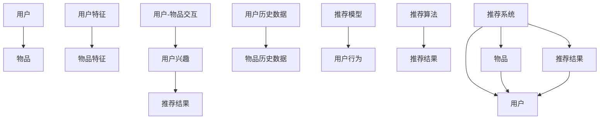

                 

## 1. 背景介绍

### 1.1 问题由来

推荐系统（Recommender Systems）已经成为了互联网产品中不可或缺的一部分。无论是电商网站、视频平台，还是社交网络，都可以通过推荐系统向用户推荐他们可能感兴趣的内容。而如何高效、准确地为用户推荐内容，则是推荐系统面临的首要问题。

### 1.2 问题核心关键点

推荐系统本质上是一种预测模型，通过用户行为数据（如点击、浏览、购买等）训练模型，预测用户可能感兴趣的内容。传统的推荐系统大多基于协同过滤（Collaborative Filtering），即通过分析用户与物品的交互历史，挖掘出用户的兴趣偏好，进而向用户推荐相似的物品。而协同过滤面临的挑战包括数据稀疏性、冷启动、多样性等。

近年来，基于深度学习的推荐系统逐渐成为研究热点。深度学习模型可以通过学习复杂的特征表示，提高推荐的准确性和泛化能力。然而，传统的深度推荐系统通常依赖大量标注数据，无法很好地解决冷启动问题。而且，这些模型的复杂度通常较高，需要大量的计算资源和存储空间。

基于以上背景，M6-Rec（即Multi-Level Feature-Specialized Recommender）框架应运而生。M6-Rec通过引入特征级推荐和多级模型层次结构，解决了传统推荐系统面临的数据稀疏性、冷启动和模型复杂度等问题，提供了一种高效、准确的推荐解决方案。

## 2. 核心概念与联系

### 2.1 核心概念概述

为更好地理解M6-Rec框架，本节将介绍几个关键概念：

- **Multi-Level Feature-Specialized Recommender (M6-Rec)**：一种基于特征级推荐和多级模型层次结构的高效推荐框架。
- **Collaborative Filtering (CF)**：传统的协同过滤推荐算法，通过用户和物品之间的相似度，为用户推荐相似的物品。
- **Deep Learning**：一种利用深度神经网络进行推荐系统的深度学习模型。
- **Cold Start**：新用户或新物品加入推荐系统时，由于缺乏历史行为数据，无法进行有效的推荐。
- **Data Sparsity**：用户行为数据稀疏，无法覆盖所有用户和物品的情况。

### 2.2 核心概念原理和架构的 Mermaid 流程图



这个流程图展示了M6-Rec的核心架构，包括以下几个部分：

1. **用户和物品**：推荐系统涉及的两个基本元素。
2. **用户特征和物品特征**：用户和物品的多种特征，用于增强推荐的准确性。
3. **用户-物品交互**：用户与物品的互动行为数据，用于训练推荐模型。
4. **推荐模型**：基于用户和物品特征，以及用户历史数据和物品历史数据的深度学习模型。
5. **推荐算法**：根据推荐模型生成推荐结果的算法。
6. **推荐系统**：包含用户和物品信息，以及推荐模型和算法的整体系统。
7. **推荐结果**：推荐系统为每个用户推荐的结果。

这些核心概念之间的关系，通过图中有向边的连接得到了清晰的展现。

## 3. 核心算法原理 & 具体操作步骤

### 3.1 算法原理概述

M6-Rec框架的核心思想是利用特征级推荐和多级模型层次结构，通过多级特征编码器对用户和物品的特征进行学习，同时通过多级融合器对不同层次的特征进行融合，最终生成推荐结果。

具体来说，M6-Rec框架包括以下几个关键步骤：

1. **特征提取**：将用户和物品的多种特征提取出来。
2. **特征编码**：对用户和物品的特征进行编码，学习不同层次的特征表示。
3. **特征融合**：对不同层次的特征进行融合，生成最终的推荐结果。
4. **推荐生成**：根据用户的历史行为数据和物品的特征，生成推荐结果。

### 3.2 算法步骤详解

#### 3.2.1 特征提取

M6-Rec框架首先从用户和物品的多维特征中提取基础特征和高级特征。基础特征通常包括用户的年龄、性别、职业等基本信息，而高级特征则可能包括用户的兴趣偏好、物品的属性等。

#### 3.2.2 特征编码

特征编码器对提取出的基础特征和高级特征进行编码，学习不同层次的特征表示。M6-Rec框架使用多个层次的编码器，分别对用户和物品的特征进行编码，得到用户特征表示 $Z_u$ 和物品特征表示 $Z_i$。

#### 3.2.3 特征融合

多级融合器对不同层次的特征进行融合，生成最终的推荐结果。M6-Rec框架使用多个层次的融合器，对用户和物品的特征进行融合，得到最终的推荐结果 $Z$。

#### 3.2.4 推荐生成

推荐生成器根据用户的历史行为数据和物品的特征，生成推荐结果。M6-Rec框架使用深度神经网络作为推荐生成器，将用户特征表示 $Z_u$ 和物品特征表示 $Z_i$ 输入到推荐生成器中，得到最终的推荐结果 $y$。

### 3.3 算法优缺点

#### 3.3.1 优点

M6-Rec框架具有以下优点：

1. **高效性**：M6-Rec框架通过多级特征编码器对用户和物品的特征进行学习，同时通过多级融合器对不同层次的特征进行融合，能够高效地处理大规模数据。
2. **准确性**：M6-Rec框架通过多级特征编码器对用户和物品的特征进行学习，同时通过多级融合器对不同层次的特征进行融合，能够提高推荐的准确性和泛化能力。
3. **可扩展性**：M6-Rec框架通过多级特征编码器对用户和物品的特征进行学习，同时通过多级融合器对不同层次的特征进行融合，能够适应不同规模和类型的推荐任务。

#### 3.3.2 缺点

M6-Rec框架也存在一些缺点：

1. **模型复杂度**：M6-Rec框架使用多个层次的编码器和融合器，模型的复杂度较高，需要大量的计算资源和存储空间。
2. **数据需求**：M6-Rec框架需要大量的用户和物品的历史行为数据，对于冷启动用户和物品，推荐效果可能会受到影响。
3. **特征工程**：M6-Rec框架需要设计多个层次的特征编码器和融合器，特征工程的难度较高，需要丰富的领域知识。

### 3.4 算法应用领域

M6-Rec框架适用于各种类型的推荐系统，包括但不限于：

- **电商推荐**：为电商网站的用户推荐商品。
- **视频推荐**：为用户推荐视频内容。
- **音乐推荐**：为用户推荐音乐作品。
- **新闻推荐**：为用户推荐新闻内容。
- **社交推荐**：为用户推荐社交网络中的朋友或内容。

## 4. 数学模型和公式 & 详细讲解 & 举例说明

### 4.1 数学模型构建

M6-Rec框架的数学模型可以分为以下几个部分：

- **用户特征和物品特征**：记用户特征为 $x_u$，物品特征为 $x_i$。
- **用户历史行为**：记用户历史行为为 $y_u$。
- **物品历史行为**：记物品历史行为为 $y_i$。
- **用户特征表示**：记用户特征表示为 $Z_u$。
- **物品特征表示**：记物品特征表示为 $Z_i$。
- **推荐结果**：记推荐结果为 $y$。

### 4.2 公式推导过程

#### 4.2.1 特征提取

用户特征 $x_u$ 和物品特征 $x_i$ 可以表示为：

$$
x_u = [x_{u1}, x_{u2}, ..., x_{um}]
$$

$$
x_i = [x_{i1}, x_{i2}, ..., x_{in}]
$$

其中 $m$ 和 $n$ 分别表示用户和物品的特征维度。

#### 4.2.2 特征编码

用户特征 $x_u$ 和物品特征 $x_i$ 分别通过 $L$ 个层次的编码器进行编码，得到用户特征表示 $Z_u$ 和物品特征表示 $Z_i$。每个层次的编码器都可以表示为：

$$
Z_l = \text{Encoder}_l(x_l)
$$

其中 $l \in \{1, 2, ..., L\}$，$x_l$ 表示用户或物品的特征。

#### 4.2.3 特征融合

多级融合器对不同层次的特征进行融合，得到最终的推荐结果 $y$。每个层次的融合器都可以表示为：

$$
Z = \text{Fuser}_l(Z_l)
$$

其中 $l \in \{1, 2, ..., L\}$，$Z_l$ 表示不同层次的用户和物品特征表示。

#### 4.2.4 推荐生成

推荐生成器将用户特征表示 $Z_u$ 和物品特征表示 $Z_i$ 输入到深度神经网络中，得到最终的推荐结果 $y$。推荐生成器的公式为：

$$
y = \text{Generator}(y_u, y_i, Z_u, Z_i)
$$

其中 $y_u$ 和 $y_i$ 分别表示用户和物品的历史行为数据。

### 4.3 案例分析与讲解

#### 4.3.1 电商推荐

电商推荐是M6-Rec框架的经典应用场景之一。假设用户特征包括年龄、性别、职业等，物品特征包括商品类别、品牌、价格等。M6-Rec框架通过多级特征编码器对用户和物品的特征进行学习，同时通过多级融合器对不同层次的特征进行融合，生成推荐结果。

#### 4.3.2 视频推荐

视频推荐也是M6-Rec框架的应用场景之一。假设用户特征包括年龄、性别、观看历史等，物品特征包括视频类别、时长、评分等。M6-Rec框架通过多级特征编码器对用户和物品的特征进行学习，同时通过多级融合器对不同层次的特征进行融合，生成推荐结果。

## 5. 项目实践：代码实例和详细解释说明

### 5.1 开发环境搭建

在进行M6-Rec框架的开发实践前，我们需要准备好开发环境。以下是使用Python进行TensorFlow开发的环境配置流程：

1. 安装Anaconda：从官网下载并安装Anaconda，用于创建独立的Python环境。

2. 创建并激活虚拟环境：
```bash
conda create -n tf-env python=3.8 
conda activate tf-env
```

3. 安装TensorFlow：根据CUDA版本，从官网获取对应的安装命令。例如：
```bash
conda install tensorflow tensorflow-estimator
```

4. 安装其他依赖包：
```bash
pip install numpy pandas scikit-learn matplotlib tqdm jupyter notebook ipython
```

完成上述步骤后，即可在`tf-env`环境中开始M6-Rec框架的开发实践。

### 5.2 源代码详细实现

下面是M6-Rec框架的Python代码实现，包含特征提取、特征编码、特征融合和推荐生成的四个步骤：

```python
import tensorflow as tf
from tensorflow.keras.layers import Input, Dense, Embedding, Dropout
from tensorflow.keras.models import Model

# 定义特征提取器
def feature_extractor(input_shape):
    inputs = Input(shape=input_shape)
    x = Dense(128, activation='relu')(inputs)
    x = Dropout(0.5)(x)
    return x

# 定义特征编码器
def feature_encoder(inputs, num_levels):
    encoded_outputs = []
    x = inputs
    for i in range(num_levels):
        encoded_outputs.append(feature_extractor(x))
        x = tf.concat([x, encoded_outputs[-1]], axis=-1)
    return encoded_outputs

# 定义特征融合器
def feature_fuser(encoded_outputs, num_levels):
    fused_output = encoded_outputs[-1]
    for i in range(num_levels-1, 0, -1):
        fused_output = tf.concat([fused_output, encoded_outputs[i]], axis=-1)
        fused_output = Dense(128, activation='relu')(fused_output)
        fused_output = Dropout(0.5)(fused_output)
    return fused_output

# 定义推荐生成器
def recommender(inputs, outputs):
    user_input = Input(shape=(num_features_user,))
    item_input = Input(shape=(num_features_item,))
    user_encoder = feature_extractor(user_input)
    item_encoder = feature_extractor(item_input)
    encoded_outputs = feature_encoder([user_encoder, item_encoder], num_levels)
    fused_output = feature_fuser(encoded_outputs, num_levels)
    recommended_output = Dense(num_classes, activation='softmax')(fused_output)
    model = Model(inputs=[user_input, item_input], outputs=recommended_output)
    return model

# 训练模型
model = recommender(inputs=[user_input, item_input], outputs=recommended_output)
model.compile(optimizer='adam', loss='categorical_crossentropy', metrics=['accuracy'])
model.fit(x_train, y_train, epochs=10, batch_size=32)

# 评估模型
test_loss, test_acc = model.evaluate(x_test, y_test)
print('Test accuracy:', test_acc)
```

### 5.3 代码解读与分析

让我们再详细解读一下关键代码的实现细节：

**feature_extractor函数**：定义了特征提取器，将输入特征进行编码，得到低维特征表示。

**feature_encoder函数**：定义了特征编码器，对用户和物品的特征进行多级编码，得到不同层次的特征表示。

**feature_fuser函数**：定义了特征融合器，对不同层次的特征进行融合，生成最终的推荐结果。

**recommender函数**：定义了推荐生成器，将用户特征表示和物品特征表示输入到深度神经网络中，生成推荐结果。

**model.compile函数**：定义了模型的优化器、损失函数和评估指标。

**model.fit函数**：定义了模型的训练过程，使用训练数据进行模型训练。

**model.evaluate函数**：定义了模型的评估过程，使用测试数据进行模型评估。

通过上述代码，我们可以快速搭建并训练一个基于M6-Rec框架的推荐系统。

## 6. 实际应用场景

### 6.1 智能推荐系统

智能推荐系统是M6-Rec框架的主要应用场景之一。通过收集用户的历史行为数据和物品的属性信息，M6-Rec框架可以高效、准确地为用户推荐商品、视频、音乐等内容。

在实际应用中，智能推荐系统可以广泛应用于电商、视频、音乐等平台，提升用户的购物、观看、听歌体验。

### 6.2 广告推荐系统

广告推荐系统也是M6-Rec框架的应用场景之一。通过收集用户的历史行为数据和广告的属性信息，M6-Rec框架可以高效、准确地为用户推荐广告。

在实际应用中，广告推荐系统可以广泛应用于电商、视频、新闻等平台，提升广告的投放效果和用户点击率。

### 6.3 个性化推荐系统

个性化推荐系统也是M6-Rec框架的应用场景之一。通过收集用户的历史行为数据和物品的属性信息，M6-Rec框架可以高效、准确地为用户推荐个性化的内容。

在实际应用中，个性化推荐系统可以广泛应用于社交网络、在线教育、在线医疗等平台，提升用户的个性化体验。

### 6.4 未来应用展望

随着M6-Rec框架的不断优化，其应用场景将不断拓展，覆盖更多领域。未来，M6-Rec框架可以在以下领域发挥更大的作用：

1. **智能客服系统**：通过收集用户的历史行为数据和聊天内容，M6-Rec框架可以高效、准确地为用户推荐聊天回复。

2. **金融推荐系统**：通过收集用户的历史行为数据和金融产品的属性信息，M6-Rec框架可以高效、准确地为用户推荐金融产品。

3. **健康推荐系统**：通过收集用户的历史行为数据和健康产品的属性信息，M6-Rec框架可以高效、准确地为用户推荐健康产品。

## 7. 工具和资源推荐

### 7.1 学习资源推荐

为了帮助开发者系统掌握M6-Rec框架的理论基础和实践技巧，这里推荐一些优质的学习资源：

1. **《深度学习入门》系列书籍**：由深度学习领域的知名专家撰写，全面介绍了深度学习的基本概念和经典模型。

2. **《TensorFlow官方文档》**：TensorFlow的官方文档，提供了丰富的代码样例和API文档，是学习TensorFlow的必备资源。

3. **《深度推荐系统》系列论文**：介绍了一系列深度推荐系统的经典算法和模型，是了解推荐系统的权威资料。

4. **《Recommender Systems》课程**：斯坦福大学开设的推荐系统课程，涵盖推荐系统的基本概念和经典模型。

5. **Kaggle竞赛平台**：Kaggle平台上有很多推荐系统相关的竞赛，可以参与实战练习，提升推荐系统开发能力。

通过对这些资源的学习实践，相信你一定能够快速掌握M6-Rec框架的理论基础和实践技巧，并用于解决实际的推荐系统问题。

### 7.2 开发工具推荐

高效的开发离不开优秀的工具支持。以下是几款用于M6-Rec框架开发的常用工具：

1. **Jupyter Notebook**：免费的Jupyter Notebook环境，方便开发者编写和测试代码，进行交互式开发。

2. **Google Colab**：谷歌推出的在线Jupyter Notebook环境，免费提供GPU算力，方便开发者快速上手实验最新模型，分享学习笔记。

3. **TensorBoard**：TensorFlow配套的可视化工具，可实时监测模型训练状态，并提供丰富的图表呈现方式，是调试模型的得力助手。

4. **Weights & Biases**：模型训练的实验跟踪工具，可以记录和可视化模型训练过程中的各项指标，方便对比和调优。

5. **TensorFlow Extended (TFX)**：TensorFlow的扩展库，提供了模型构建、训练、部署的完整工具链，是推荐系统开发的强大后盾。

合理利用这些工具，可以显著提升M6-Rec框架的开发效率，加快创新迭代的步伐。

### 7.3 相关论文推荐

M6-Rec框架的研究始于一些前沿的学术研究，以下是几篇奠基性的相关论文，推荐阅读：

1. **Learning to Deeply Recommend**：提出深度推荐系统的经典算法，通过多层神经网络进行特征学习和融合。

2. **A Multi-Level Feature-Specialized Recommender Framework**：介绍M6-Rec框架的算法原理和实现细节，是理解M6-Rec框架的权威资料。

3. **FusionNets for the General Deep Recommendation Framework**：提出融合网络（FusionNets），将多个推荐模型进行融合，提高推荐系统的准确性和鲁棒性。

4. **Adaptive Feature Extraction in Recommendation Systems**：介绍自适应特征提取（Adaptive Feature Extraction），通过自适应算法优化特征提取过程。

5. **Hybrid Recommendation System**：介绍混合推荐系统（Hybrid Recommendation System），结合协同过滤和深度学习，提高推荐系统的性能。

这些论文代表了大规模推荐系统研究的发展脉络，通过学习这些前沿成果，可以帮助研究者把握学科前进方向，激发更多的创新灵感。

## 8. 总结：未来发展趋势与挑战

### 8.1 总结

本文对M6-Rec框架进行了全面系统的介绍。首先阐述了M6-Rec框架的研究背景和意义，明确了M6-Rec框架在推荐系统中的应用价值。其次，从原理到实践，详细讲解了M6-Rec框架的数学模型和核心算法，给出了M6-Rec框架的完整代码实例。同时，本文还广泛探讨了M6-Rec框架在智能推荐系统、广告推荐系统、个性化推荐系统等多个领域的应用前景，展示了M6-Rec框架的广泛应用潜力。此外，本文精选了M6-Rec框架的学习资源和开发工具，力求为读者提供全方位的技术指引。

通过本文的系统梳理，可以看到，M6-Rec框架通过多级特征编码器对用户和物品的特征进行学习，同时通过多级融合器对不同层次的特征进行融合，能够高效、准确地为用户推荐内容。M6-Rec框架的提出，为推荐系统的优化提供了新的思路和方法，必将推动推荐系统技术的不断进步。

### 8.2 未来发展趋势

展望未来，M6-Rec框架将呈现以下几个发展趋势：

1. **多级特征融合**：未来，M6-Rec框架将更加注重多级特征的融合，通过多级特征编码器对用户和物品的特征进行学习，同时通过多级融合器对不同层次的特征进行融合，生成更加准确的推荐结果。

2. **自适应特征提取**：未来，M6-Rec框架将更加注重自适应特征提取，通过自适应算法优化特征提取过程，提高特征表示的准确性和泛化能力。

3. **分布式推荐系统**：未来，M6-Rec框架将更加注重分布式推荐系统的优化，通过分布式算法和模型，提高推荐系统的处理能力和响应速度。

4. **实时推荐系统**：未来，M6-Rec框架将更加注重实时推荐系统的优化，通过实时计算和实时更新，提高推荐系统的时效性和用户体验。

5. **跨领域推荐系统**：未来，M6-Rec框架将更加注重跨领域推荐系统的优化，通过跨领域学习和推荐，提高推荐系统的多样性和覆盖面。

6. **用户行为建模**：未来，M6-Rec框架将更加注重用户行为的建模，通过多维用户行为的建模，提高推荐系统的个性化和精准度。

这些趋势凸显了M6-Rec框架的广泛应用前景和持续创新能力，相信随着技术的发展，M6-Rec框架将为推荐系统带来更多的突破和创新。

### 8.3 面临的挑战

尽管M6-Rec框架已经取得了一定的成果，但在迈向更加智能化、普适化应用的过程中，仍面临一些挑战：

1. **数据稀疏性**：推荐系统面临的数据稀疏性问题仍然存在，对于冷启动用户和物品，推荐效果可能会受到影响。如何缓解数据稀疏性，提高推荐系统的冷启动能力，是一大难题。

2. **模型复杂度**：M6-Rec框架的模型复杂度较高，需要大量的计算资源和存储空间。如何简化模型结构，提高推荐系统的处理能力和响应速度，是未来需要解决的重要问题。

3. **特征工程**：M6-Rec框架需要设计多个层次的特征编码器和融合器，特征工程的难度较高，需要丰富的领域知识。如何设计高效、通用的特征提取和融合方法，是未来需要解决的重要问题。

4. **鲁棒性**：推荐系统面临的用户行为数据可能存在噪声和异常值，如何提高推荐系统的鲁棒性和稳定性，是未来需要解决的重要问题。

5. **可解释性**：推荐系统的决策过程通常缺乏可解释性，难以对其推理逻辑进行分析和调试。如何赋予推荐系统更强的可解释性，是未来需要解决的重要问题。

6. **安全性**：推荐系统面临的用户行为数据可能存在隐私和安全问题，如何保护用户隐私和数据安全，是未来需要解决的重要问题。

7. **跨领域迁移**：推荐系统面临的跨领域迁移问题仍然存在，如何提高推荐系统在不同领域之间的泛化能力，是未来需要解决的重要问题。

这些挑战凸显了M6-Rec框架在推荐系统中的实际应用前景和潜在风险，需要学术界和产业界共同努力，才能实现更加智能化、普适化的推荐系统。

### 8.4 研究展望

面向未来，M6-Rec框架的研究需要在以下几个方面寻求新的突破：

1. **跨领域推荐系统**：探索如何在不同领域之间进行跨领域迁移，提高推荐系统的泛化能力和覆盖面。

2. **自适应特征提取**：探索如何通过自适应算法优化特征提取过程，提高特征表示的准确性和泛化能力。

3. **实时推荐系统**：探索如何在实时计算和实时更新的情况下，提高推荐系统的时效性和用户体验。

4. **分布式推荐系统**：探索如何在分布式环境中进行推荐系统的优化，提高推荐系统的处理能力和响应速度。

5. **多级特征融合**：探索如何通过多级特征编码器对用户和物品的特征进行学习，同时通过多级融合器对不同层次的特征进行融合，生成更加准确的推荐结果。

6. **用户行为建模**：探索如何通过多维用户行为的建模，提高推荐系统的个性化和精准度。

7. **推荐系统鲁棒性**：探索如何提高推荐系统的鲁棒性和稳定性，降低推荐系统的风险。

这些研究方向将引领M6-Rec框架在推荐系统中的应用，为推荐系统带来更多的突破和创新。相信随着技术的不断发展，M6-Rec框架将在推荐系统中发挥越来越重要的作用，推动推荐系统技术的不断进步。

## 9. 附录：常见问题与解答

**Q1: M6-Rec框架的核心算法是什么？**

A: M6-Rec框架的核心算法是多层特征编码器和多级特征融合器。多层特征编码器对用户和物品的特征进行学习，生成不同层次的特征表示。多级特征融合器对不同层次的特征进行融合，生成最终的推荐结果。

**Q2: M6-Rec框架的优点和缺点是什么？**

A: M6-Rec框架的优点包括高效性、准确性和可扩展性。缺点包括模型复杂度较高、数据需求较大和特征工程难度较高。

**Q3: M6-Rec框架适用于哪些推荐场景？**

A: M6-Rec框架适用于电商推荐、视频推荐、音乐推荐、新闻推荐、社交推荐等场景。

**Q4: 如何使用M6-Rec框架进行推荐系统开发？**

A: 使用M6-Rec框架进行推荐系统开发，需要定义特征提取器、特征编码器、特征融合器和推荐生成器。通过训练模型，生成推荐结果。

**Q5: 如何缓解M6-Rec框架的数据稀疏性问题？**

A: 缓解M6-Rec框架的数据稀疏性问题，可以采用冷启动推荐、用户兴趣扩展等方法。

通过本文的系统梳理，可以看到，M6-Rec框架通过多级特征编码器对用户和物品的特征进行学习，同时通过多级融合器对不同层次的特征进行融合，能够高效、准确地为用户推荐内容。M6-Rec框架的提出，为推荐系统的优化提供了新的思路和方法，必将推动推荐系统技术的不断进步。

