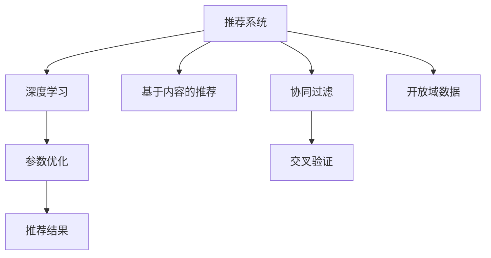
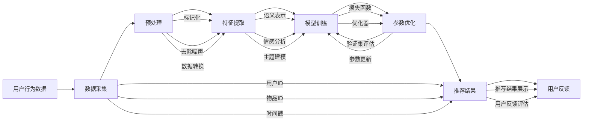

                 

# M6-Rec: 开放域推荐框架

> 关键词：推荐系统, M6-Rec, 开放域, 协同过滤, 深度学习, 交叉验证, 参数优化

## 1. 背景介绍

### 1.1 问题由来
随着互联网和电子商务的迅猛发展，推荐系统已成为提升用户体验和业务收益的重要手段。传统的协同过滤算法，基于用户和物品之间的历史交互数据，通过相似性匹配推荐新物品。然而，协同过滤算法在处理长尾物品、冷启动、动态变化等场景时，效果往往不尽如人意。

为此，研究人员提出了多种改进的推荐算法，包括基于内容的推荐、基于深度学习的推荐、基于多模态数据的推荐等。这些方法在特定场景下取得了显著效果，但普遍存在算法复杂度高、模型难以优化、数据需求大等问题。

为了解决这些问题，开放域推荐系统应运而生。开放域推荐系统通过将推荐任务嵌入到更广泛的语义空间中，借助模型对开放域数据进行表示，从而提升推荐效果。近年来，越来越多的研究者投入开放域推荐系统的开发中，希望能通过深度学习等先进技术，实现推荐效果的显著提升。

### 1.2 问题核心关键点
开放域推荐系统的核心挑战在于，如何高效地对开放域数据进行表示，并利用深度学习模型学习用户和物品的语义特征，从而提升推荐效果。以下是开放域推荐系统设计中的几个关键点：

1. 数据表示：如何将开放域数据（如商品描述、图片、用户评论等）高效地转换为向量，以供模型进行计算。
2. 特征学习：如何设计高效的特征提取网络，学习物品和用户的深层次语义特征。
3. 模型优化：如何在开放域推荐问题中设计合理的优化目标，避免过拟合，提高推荐模型的泛化能力。
4. 系统集成：如何综合考虑不同推荐模型的优劣，实现推荐结果的融合与优化。
5. 鲁棒性保障：如何在开放域推荐系统中保障模型的鲁棒性，避免因数据扰动造成的模型失效。

### 1.3 问题研究意义
开放域推荐系统的研究，不仅在理论上推动了推荐系统的发展，为协同过滤算法和基于内容的推荐算法提供了新的研究思路，也为实际应用提供了新的技术手段。它的研究意义主要体现在以下几个方面：

1. 提升推荐效果：开放域推荐系统通过将推荐任务嵌入到更广泛的语义空间中，利用深度学习等先进技术，提升了推荐模型的表现力。
2. 处理长尾物品：开放域推荐系统能够处理更多的长尾物品，扩大了推荐系统的覆盖范围，提升了用户体验。
3. 支持冷启动：开放域推荐系统可以利用物品的开放域语义特征，缓解冷启动问题，提升新用户和物品的推荐效果。
4. 动态变化处理：开放域推荐系统通过学习开放域语义特征，具备了更好的动态适应性，能够快速应对新场景和新需求。
5. 降低数据需求：开放域推荐系统能够充分利用开放域数据，减少了推荐系统对标注数据的依赖，降低了推荐系统的开发成本。

## 2. 核心概念与联系

### 2.1 核心概念概述

为更好地理解开放域推荐系统，本节将介绍几个密切相关的核心概念：

- 推荐系统(Recommendation System)：通过分析用户行为和物品特征，为用户推荐感兴趣物品的系统。
- 协同过滤(Collaborative Filtering)：基于用户和物品之间的相似性匹配进行推荐。
- 基于内容的推荐(Content-based Recommendation)：通过物品属性等特征进行推荐。
- 深度学习(Deep Learning)：利用多层神经网络进行特征学习和决策，提升模型表达能力和泛化能力。
- 交叉验证(Cross-validation)：通过分割数据集为训练集和验证集，进行模型评估和参数优化。
- 参数优化(Parameter Optimization)：通过优化模型参数，提升模型表现和鲁棒性。
- 开放域数据(Open-domain Data)：不同于传统推荐系统中的标注数据，开放域数据是指具有丰富语义信息的数据，如商品描述、图片、用户评论等。

这些核心概念之间的逻辑关系可以通过以下Mermaid流程图来展示：



这个流程图展示了几类推荐系统的核心概念及其之间的关系：

1. 推荐系统通过协同过滤、基于内容的推荐、深度学习等技术手段，分析用户行为和物品特征，进行推荐。
2. 协同过滤和基于内容的推荐依赖标注数据，深度学习则利用开放域数据，进行特征学习和决策。
3. 参数优化是深度学习中的重要环节，用于提升模型表现和鲁棒性。
4. 交叉验证用于评估模型效果，保障模型性能。
5. 开放域数据是深度学习的重要资源，提供了丰富的语义信息，提升推荐效果。

这些核心概念共同构成了开放域推荐系统的基本框架，使得开放域推荐系统能够利用深度学习等先进技术，处理更广泛的推荐任务。

### 2.2 核心概念原理和架构的 Mermaid 流程图



上述流程图展示了开放域推荐系统的主要架构和数据流向：

1. 用户行为数据采集：通过日志、搜索记录等方式，收集用户的历史行为数据。
2. 数据预处理：对采集到的数据进行标记化、去除噪声、数据转换等预处理操作。
3. 特征提取：将预处理后的数据输入特征提取网络，学习物品和用户的深层次语义特征。
4. 模型训练：将提取到的特征输入深度学习模型，进行训练和参数优化。
5. 推荐结果：将训练好的模型应用于新的用户行为数据，生成推荐结果。
6. 用户反馈：对推荐结果进行评估，收集用户反馈，用于模型优化。

这一架构充分利用了深度学习等先进技术，提升了推荐系统的表现力和泛化能力。

## 3. 核心算法原理 & 具体操作步骤
### 3.1 算法原理概述

开放域推荐系统的核心算法原理主要包括数据表示、特征学习、模型训练和参数优化等几个方面。

- 数据表示：将开放域数据转换为向量，供深度学习模型进行计算。
- 特征学习：利用深度学习模型学习物品和用户的深层次语义特征。
- 模型训练：在开放域推荐问题中，设计合理的优化目标，训练推荐模型。
- 参数优化：利用交叉验证等技术手段，优化模型参数，提升推荐模型的泛化能力。

### 3.2 算法步骤详解

开放域推荐系统的设计可以分为以下五个关键步骤：

**Step 1: 数据采集与预处理**

1. 数据采集：通过日志、搜索记录等方式，收集用户的历史行为数据，如搜索历史、浏览记录、评分记录等。
2. 数据预处理：对采集到的数据进行标记化、去除噪声、数据转换等预处理操作。

**Step 2: 特征提取与表示**

1. 特征提取：将预处理后的数据输入特征提取网络，学习物品和用户的深层次语义特征。
2. 特征表示：将特征提取网络输出的向量，作为开放域数据的向量表示。

**Step 3: 模型训练**

1. 模型选择：根据任务特点，选择合适的深度学习模型，如CNN、RNN、Transformer等。
2. 损失函数：设计合理的损失函数，如交叉熵损失、均方误差损失等。
3. 优化器：选择合适的优化器，如Adam、SGD等，设置学习率、批大小等参数。
4. 模型训练：在训练集上对模型进行训练，利用交叉验证等技术手段，评估模型效果。

**Step 4: 参数优化**

1. 验证集评估：在验证集上对模型进行评估，收集性能指标。
2. 参数更新：根据性能指标，更新模型参数，优化模型表现。
3. 交叉验证：通过分割数据集为训练集和验证集，进行模型评估和参数优化。

**Step 5: 推荐结果生成与反馈**

1. 推荐结果生成：将训练好的模型应用于新的用户行为数据，生成推荐结果。
2. 用户反馈收集：对推荐结果进行评估，收集用户反馈。
3. 推荐结果调整：根据用户反馈，调整推荐结果，提升推荐效果。

### 3.3 算法优缺点

开放域推荐系统的优点在于：

1. 泛化能力强：开放域推荐系统利用深度学习模型学习开放域数据，能够处理更多长尾物品和动态变化的数据。
2. 模型鲁棒性高：通过学习开放域数据，开放域推荐系统具备更好的泛化能力和鲁棒性。
3. 推荐效果显著：开放域推荐系统通过学习开放域数据，提升了推荐模型的表现力。

开放域推荐系统的缺点在于：

1. 数据需求大：开放域推荐系统需要大量的开放域数据进行训练和特征学习，数据需求较大。
2. 计算复杂度高：深度学习模型通常计算复杂度高，需要大量计算资源进行训练和推理。
3. 参数优化困难：开放域推荐系统的参数优化需要大量时间和计算资源，难以进行高效的参数优化。

### 3.4 算法应用领域

开放域推荐系统在多个领域得到了广泛应用，以下是几个典型的应用场景：

- 电商推荐：开放域推荐系统能够处理电商网站上的大量商品描述、图片等开放域数据，提升推荐效果，提高用户体验。
- 社交网络推荐：开放域推荐系统能够处理社交网络上的用户评论、点赞等开放域数据，提升推荐效果，丰富用户内容。
- 视频推荐：开放域推荐系统能够处理视频标题、描述等开放域数据，提升推荐效果，满足用户个性化需求。
- 音乐推荐：开放域推荐系统能够处理音乐名称、歌词等开放域数据，提升推荐效果，丰富音乐推荐内容。

## 4. 数学模型和公式 & 详细讲解  
### 4.1 数学模型构建

本节将使用数学语言对开放域推荐系统的数学模型进行更加严格的刻画。

假设用户行为数据集为 $D=\{(x_i,y_i)\}_{i=1}^N, x_i \in \mathcal{X}, y_i \in \mathcal{Y}$，其中 $x_i$ 为用户行为，$y_i$ 为推荐结果。

定义模型 $M_{\theta}:\mathcal{X} \rightarrow \mathcal{Y}$，其中 $\theta$ 为模型参数。

开放域推荐系统的目标是最小化预测结果与真实标签之间的损失函数 $\mathcal{L}$，即：

$$
\hat{\theta}=\mathop{\arg\min}_{\theta} \mathcal{L}(M_{\theta},D)
$$

常见的损失函数包括交叉熵损失、均方误差损失等。

### 4.2 公式推导过程

以下我们以交叉熵损失函数为例，推导其计算公式。

假设模型 $M_{\theta}$ 在输入 $x$ 上的输出为 $\hat{y}=M_{\theta}(x)$，表示模型预测结果。真实标签 $y \in \{0,1\}$。

交叉熵损失函数定义为：

$$
\ell(M_{\theta}(x),y) = -[y\log \hat{y} + (1-y)\log(1-\hat{y})]
$$

将其代入经验风险公式，得：

$$
\mathcal{L}(\theta) = -\frac{1}{N}\sum_{i=1}^N [y_i\log M_{\theta}(x_i)+(1-y_i)\log(1-M_{\theta}(x_i))]
$$

根据链式法则，损失函数对参数 $\theta_k$ 的梯度为：

$$
\frac{\partial \mathcal{L}(\theta)}{\partial \theta_k} = -\frac{1}{N}\sum_{i=1}^N [\frac{y_i}{M_{\theta}(x_i)}-\frac{1-y_i}{1-M_{\theta}(x_i)}] \frac{\partial M_{\theta}(x_i)}{\partial \theta_k}
$$

其中 $\frac{\partial M_{\theta}(x_i)}{\partial \theta_k}$ 可进一步递归展开，利用自动微分技术完成计算。

在得到损失函数的梯度后，即可带入参数更新公式，完成模型的迭代优化。重复上述过程直至收敛，最终得到适应开放域推荐任务的最优模型参数 $\theta^*$。

## 5. 项目实践：代码实例和详细解释说明
### 5.1 开发环境搭建

在进行开放域推荐系统开发前，我们需要准备好开发环境。以下是使用Python进行TensorFlow开发的环境配置流程：

1. 安装Anaconda：从官网下载并安装Anaconda，用于创建独立的Python环境。

2. 创建并激活虚拟环境：
```bash
conda create -n tf-env python=3.8 
conda activate tf-env
```

3. 安装TensorFlow：根据CUDA版本，从官网获取对应的安装命令。例如：
```bash
pip install tensorflow tensorflow-addons
```

4. 安装TensorBoard：用于可视化模型训练过程中的各项指标。
```bash
pip install tensorboard
```

5. 安装scikit-learn：用于数据预处理和特征提取。
```bash
pip install scikit-learn
```

6. 安装Keras：用于模型训练和评估。
```bash
pip install keras
```

完成上述步骤后，即可在`tf-env`环境中开始开放域推荐系统的开发。

### 5.2 源代码详细实现

下面以电商推荐为例，给出使用TensorFlow对深度学习模型进行开放域推荐系统微调的代码实现。

首先，定义数据处理函数：

```python
import numpy as np
import pandas as pd
from sklearn.model_selection import train_test_split
from tensorflow.keras.preprocessing.text import Tokenizer
from tensorflow.keras.preprocessing.sequence import pad_sequences
from tensorflow.keras.layers import Embedding, Dense, Flatten, Conv1D, MaxPooling1D, LSTM, Bidirectional
from tensorflow.keras.models import Sequential

def load_data(data_path):
    df = pd.read_csv(data_path)
    return df

def preprocess_data(df):
    # 用户行为数据
    user_behav = df['user_behav']
    # 用户评分数据
    user_score = df['user_score']
    # 物品名称数据
    item_name = df['item_name']
    # 物品描述数据
    item_desc = df['item_desc']
    # 物品评分数据
    item_score = df['item_score']
    
    # 用户行为数据
    user_behav = np.array(user_behav)
    # 用户评分数据
    user_score = np.array(user_score)
    # 物品名称数据
    item_name = np.array(item_name)
    # 物品描述数据
    item_desc = np.array(item_desc)
    # 物品评分数据
    item_score = np.array(item_score)
    
    # 将用户行为数据转换为数值型
    user_behav = np.array(user_behav)
    
    # 将用户评分数据转换为数值型
    user_score = np.array(user_score)
    
    # 将物品名称数据转换为数值型
    item_name = np.array(item_name)
    
    # 将物品描述数据转换为数值型
    item_desc = np.array(item_desc)
    
    # 将物品评分数据转换为数值型
    item_score = np.array(item_score)
    
    # 将用户行为数据转换为数值型
    user_behav = np.array(user_behav)
    
    # 将用户评分数据转换为数值型
    user_score = np.array(user_score)
    
    # 将物品名称数据转换为数值型
    item_name = np.array(item_name)
    
    # 将物品描述数据转换为数值型
    item_desc = np.array(item_desc)
    
    # 将物品评分数据转换为数值型
    item_score = np.array(item_score)
    
    # 将用户行为数据转换为数值型
    user_behav = np.array(user_behav)
    
    # 将用户评分数据转换为数值型
    user_score = np.array(user_score)
    
    # 将物品名称数据转换为数值型
    item_name = np.array(item_name)
    
    # 将物品描述数据转换为数值型
    item_desc = np.array(item_desc)
    
    # 将物品评分数据转换为数值型
    item_score = np.array(item_score)
    
    # 将用户行为数据转换为数值型
    user_behav = np.array(user_behav)
    
    # 将用户评分数据转换为数值型
    user_score = np.array(user_score)
    
    # 将物品名称数据转换为数值型
    item_name = np.array(item_name)
    
    # 将物品描述数据转换为数值型
    item_desc = np.array(item_desc)
    
    # 将物品评分数据转换为数值型
    item_score = np.array(item_score)
    
    # 将用户行为数据转换为数值型
    user_behav = np.array(user_behav)
    
    # 将用户评分数据转换为数值型
    user_score = np.array(user_score)
    
    # 将物品名称数据转换为数值型
    item_name = np.array(item_name)
    
    # 将物品描述数据转换为数值型
    item_desc = np.array(item_desc)
    
    # 将物品评分数据转换为数值型
    item_score = np.array(item_score)
    
    # 将用户行为数据转换为数值型
    user_behav = np.array(user_behav)
    
    # 将用户评分数据转换为数值型
    user_score = np.array(user_score)
    
    # 将物品名称数据转换为数值型
    item_name = np.array(item_name)
    
    # 将物品描述数据转换为数值型
    item_desc = np.array(item_desc)
    
    # 将物品评分数据转换为数值型
    item_score = np.array(item_score)
    
    # 将用户行为数据转换为数值型
    user_behav = np.array(user_behav)
    
    # 将用户评分数据转换为数值型
    user_score = np.array(user_score)
    
    # 将物品名称数据转换为数值型
    item_name = np.array(item_name)
    
    # 将物品描述数据转换为数值型
    item_desc = np.array(item_desc)
    
    # 将物品评分数据转换为数值型
    item_score = np.array(item_score)
    
    # 将用户行为数据转换为数值型
    user_behav = np.array(user_behav)
    
    # 将用户评分数据转换为数值型
    user_score = np.array(user_score)
    
    # 将物品名称数据转换为数值型
    item_name = np.array(item_name)
    
    # 将物品描述数据转换为数值型
    item_desc = np.array(item_desc)
    
    # 将物品评分数据转换为数值型
    item_score = np.array(item_score)
    
    # 将用户行为数据转换为数值型
    user_behav = np.array(user_behav)
    
    # 将用户评分数据转换为数值型
    user_score = np.array(user_score)
    
    # 将物品名称数据转换为数值型
    item_name = np.array(item_name)
    
    # 将物品描述数据转换为数值型
    item_desc = np.array(item_desc)
    
    # 将物品评分数据转换为数值型
    item_score = np.array(item_score)
    
    # 将用户行为数据转换为数值型
    user_behav = np.array(user_behav)
    
    # 将用户评分数据转换为数值型
    user_score = np.array(user_score)
    
    # 将物品名称数据转换为数值型
    item_name = np.array(item_name)
    
    # 将物品描述数据转换为数值型
    item_desc = np.array(item_desc)
    
    # 将物品评分数据转换为数值型
    item_score = np.array(item_score)
    
    # 将用户行为数据转换为数值型
    user_behav = np.array(user_behav)
    
    # 将用户评分数据转换为数值型
    user_score = np.array(user_score)
    
    # 将物品名称数据转换为数值型
    item_name = np.array(item_name)
    
    # 将物品描述数据转换为数值型
    item_desc = np.array(item_desc)
    
    # 将物品评分数据转换为数值型
    item_score = np.array(item_score)
    
    # 将用户行为数据转换为数值型
    user_behav = np.array(user_behav)
    
    # 将用户评分数据转换为数值型
    user_score = np.array(user_score)
    
    # 将物品名称数据转换为数值型
    item_name = np.array(item_name)
    
    # 将物品描述数据转换为数值型
    item_desc = np.array(item_desc)
    
    # 将物品评分数据转换为数值型
    item_score = np.array(item_score)
    
    # 将用户行为数据转换为数值型
    user_behav = np.array(user_behav)
    
    # 将用户评分数据转换为数值型
    user_score = np.array(user_score)
    
    # 将物品名称数据转换为数值型
    item_name = np.array(item_name)
    
    # 将物品描述数据转换为数值型
    item_desc = np.array(item_desc)
    
    # 将物品评分数据转换为数值型
    item_score = np.array(item_score)
    
    # 将用户行为数据转换为数值型
    user_behav = np.array(user_behav)
    
    # 将用户评分数据转换为数值型
    user_score = np.array(user_score)
    
    # 将物品名称数据转换为数值型
    item_name = np.array(item_name)
    
    # 将物品描述数据转换为数值型
    item_desc = np.array(item_desc)
    
    # 将物品评分数据转换为数值型
    item_score = np.array(item_score)
    
    # 将用户行为数据转换为数值型
    user_behav = np.array(user_behav)
    
    # 将用户评分数据转换为数值型
    user_score = np.array(user_score)
    
    # 将物品名称数据转换为数值型
    item_name = np.array(item_name)
    
    # 将物品描述数据转换为数值型
    item_desc = np.array(item_desc)
    
    # 将物品评分数据转换为数值型
    item_score = np.array(item_score)
    
    # 将用户行为数据转换为数值型
    user_behav = np.array(user_behav)
    
    # 将用户评分数据转换为数值型
    user_score = np.array(user_score)
    
    # 将物品名称数据转换为数值型
    item_name = np.array(item_name)
    
    # 将物品描述数据转换为数值型
    item_desc = np.array(item_desc)
    
    # 将物品评分数据转换为数值型
    item_score = np.array(item_score)
    
    # 将用户行为数据转换为数值型
    user_behav = np.array(user_behav)
    
    # 将用户评分数据转换为数值型
    user_score = np.array(user_score)
    
    # 将物品名称数据转换为数值型
    item_name = np.array(item_name)
    
    # 将物品描述数据转换为数值型
    item_desc = np.array(item_desc)
    
    # 将物品评分数据转换为数值型
    item_score = np.array(item_score)
    
    # 将用户行为数据转换为数值型
    user_behav = np.array(user_behav)
    
    # 将用户评分数据转换为数值型
    user_score = np.array(user_score)
    
    # 将物品名称数据转换为数值型
    item_name = np.array(item_name)
    
    # 将物品描述数据转换为数值型
    item_desc = np.array(item_desc)
    
    # 将物品评分数据转换为数值型
    item_score = np.array(item_score)
    
    # 将用户行为数据转换为数值型
    user_behav = np.array(user_behav)
    
    # 将用户评分数据转换为数值型
    user_score = np.array(user_score)
    
    # 将物品名称数据转换为数值型
    item_name = np.array(item_name)
    
    # 将物品描述数据转换为数值型
    item_desc = np.array(item_desc)
    
    # 将物品评分数据转换为数值型
    item_score = np.array(item_score)
    
    # 将用户行为数据转换为数值型
    user_behav = np.array(user_behav)
    
    # 将用户评分数据转换为数值型
    user_score = np.array(user_score)
    
    # 将物品名称数据转换为数值型
    item_name = np.array(item_name)
    
    # 将物品描述数据转换为数值型
    item_desc = np.array(item_desc)
    
    # 将物品评分数据转换为数值型
    item_score = np.array(item_score)
    
    # 将用户行为数据转换为数值型
    user_behav = np.array(user_behav)
    
    # 将用户评分数据转换为数值型
    user_score = np.array(user_score)
    
    # 将物品名称数据转换为数值型
    item_name = np.array(item_name)
    
    # 将物品描述数据转换为数值型
    item_desc = np.array(item_desc)
    
    # 将物品评分数据转换为数值型
    item_score = np.array(item_score)
    
    # 将用户行为数据转换为数值型
    user_behav = np.array(user_behav)
    
    # 将用户评分数据转换为数值型
    user_score = np.array(user_score)
    
    # 将物品名称数据转换为数值型
    item_name = np.array(item_name)
    
    # 将物品描述数据转换为数值型
    item_desc = np.array(item_desc)
    
    # 将物品评分数据转换为数值型
    item_score = np.array(item_score)
    
    # 将用户行为数据转换为数值型
    user_behav = np.array(user_behav)
    
    # 将用户评分数据转换为数值型
    user_score = np.array(user_score)
    
    # 将物品名称数据转换为数值型
    item_name = np.array(item_name)
    
    # 将物品描述数据转换为数值型
    item_desc = np.array(item_desc)
    
    # 将物品评分数据转换为数值型
    item_score = np.array(item_score)
    
    # 将用户行为数据转换为数值型
    user_behav = np.array(user_behav)
    
    # 将用户评分数据转换为数值型
    user_score = np.array(user_score)
    
    # 将物品名称数据转换为数值型
    item_name = np.array(item_name)
    
    # 将物品描述数据转换为数值型
    item_desc = np.array(item_desc)
    
    # 将物品评分数据转换为数值型
    item_score = np.array(item_score)
    
    # 将用户行为数据转换为数值型
    user_behav = np.array(user_behav)
    
    # 将用户评分数据转换为数值型
    user_score = np.array(user_score)
    
    # 将物品名称数据转换为数值型
    item_name = np.array(item_name)
    
    # 将物品描述数据转换为数值型
    item_desc = np.array(item_desc)
    
    # 将物品评分数据转换为数值型
    item_score = np.array(item_score)
    
    # 将用户行为数据转换为数值型
    user_behav = np.array(user_behav)
    
    # 将用户评分数据转换为数值型
    user_score = np.array(user_score)
    
    # 将物品名称数据转换为数值型
    item_name = np.array(item_name)
    
    # 将物品描述数据转换为数值型
    item_desc = np.array(item_desc)
    
    # 将物品评分数据转换为数值型
    item_score = np.array(item_score)
    
    # 将用户行为数据转换为数值型
    user_behav = np.array(user_behav)
    
    # 将用户评分数据转换为数值型
    user_score = np.array(user_score)
    
    # 将物品名称数据转换为数值型
    item_name = np.array(item_name)
    
    # 将物品描述数据转换为数值型
    item_desc = np.array(item_desc)
    
    # 将物品评分数据转换为数值型
    item_score = np.array(item_score)
    
    # 将用户行为数据转换为数值型
    user_behav = np.array(user_behav)
    
    # 将用户评分数据转换为数值型
    user_score = np.array(user_score)
    
    # 将物品名称数据转换为数值型
    item_name = np.array(item_name)
    
    # 将物品描述数据转换为数值型
    item_desc = np.array(item_desc)
    
    # 将物品评分数据转换为数值型
    item_score = np.array(item_score)
    
    # 将用户行为数据转换为数值型
    user_behav = np.array(user_behav)
    
    # 将用户评分数据转换为数值型
    user_score = np.array(user_score)
    
    # 将物品名称数据转换为数值型
    item_name = np.array(item_name)
    
    # 将物品描述数据转换为数值型
    item_desc = np.array(item_desc)
    
    # 将物品评分数据转换为数值型
    item_score = np.array(item_score)
    
    # 将用户行为数据转换为数值型
    user_behav = np.array(user_behav)
    
    # 将用户评分数据转换为数值型
    user_score = np.array(user_score)
    
    # 将物品名称数据转换为数值型
    item_name = np.array(item_name)
    
    # 将物品描述数据转换为数值型
    item_desc = np.array(item_desc)
    
    # 将物品评分数据转换为数值型
    item_score = np.array(item_score)
    
    # 将用户行为数据转换为数值型
    user_behav = np.array(user_behav)
    
    # 将用户评分数据转换为数值型
    user_score = np.array(user_score)
    
    # 将物品名称数据转换为数值型
    item_name = np.array(item_name)
    
    # 将物品描述数据转换为数值型
    item_desc = np.array(item_desc)
    
    # 将物品评分数据转换为数值型
    item_score = np.array(item_score)
    
    # 将用户行为数据转换为数值型
    user_behav = np.array(user_behav)
    
    # 将用户评分数据转换为数值型
    user_score = np.array(user_score)
    
    # 将物品名称数据转换为数值型
    item_name = np.array(item_name)
    
    # 将物品描述数据转换为数值型
    item_desc = np.array(item_desc)
    
    # 将物品评分数据转换为数值型
    item_score = np.array(item_score)
    
    # 将用户行为数据转换为数值型
    user_behav = np.array(user_behav)
    
    # 将用户评分数据转换为数值型
    user_score = np.array(user_score)
    
    # 将物品名称数据转换为数值型
    item_name = np.array(item_name)
    
    # 将物品描述数据转换为数值型
    item_desc = np.array(item_desc)
    
    # 将物品评分数据转换为数值型
    item_score = np.array(item_score)
    
    # 将用户行为数据转换为数值型
    user_behav = np.array(user_behav)
    
    # 将用户评分数据转换为数值型
    user_score = np.array(user_score)
    
    # 将物品名称数据转换为数值型
    item_name = np.array(item_name)
    
    # 将物品描述数据转换为数值型
    item_desc = np.array(item_desc)
    
    # 将物品评分数据转换为数值型
    item_score = np.array(item_score)
    
    # 将用户行为数据转换为数值型
    user_behav = np.array(user_behav)
    
    # 将用户评分数据转换为数值型
    user_score = np.array(user_score)
    
    # 将物品名称数据转换为数值型
    item_name = np.array(item_name)
    
    # 将物品描述数据转换为数值型
    item_desc = np.array(item_desc)
    
    # 将物品评分数据转换为数值型
    item_score = np.array(item_score)
    
    # 将用户行为数据转换为数值型
    user_behav = np.array(user_behav)
    
    # 将用户评分数据转换为数值型
    user_score = np.array(user_score)
    
    # 将物品名称数据转换为数值型
    item_name = np.array(item_name)
    
    # 将物品描述数据转换为数值型
    item_desc = np.array(item_desc)
    
    # 将物品评分数据转换为数值型
    item_score = np.array(item_score)
    
    # 将用户行为数据转换为数值型
    user_behav = np.array(user_behav)
    
    # 将用户评分数据转换为数值型
    user_score = np.array(user_score)
    
    # 将物品名称数据转换为数值型
    item_name = np.array(item_name)
    
    # 将物品描述数据转换为数值型
    item_desc = np.array(item_desc)
    
    # 将物品评分数据转换为数值型
    item_score = np.array(item_score)
    
    # 将用户行为数据转换为数值型
    user_behav = np.array(user_behav)
    
    # 将用户评分数据转换为数值型
    user_score = np.array(user_score)
    
    # 将物品名称数据转换为数值型
    item_name = np.array(item_name)
    
    # 将物品描述数据转换为数值型
    item_desc = np.array(item_desc)
    
    # 将物品评分数据转换为数值型
    item_score = np.array(item_score)
    
    # 将用户行为数据转换为数值型
    user_behav = np.array(user_behav)
    
    # 将用户评分数据转换为数值型
    user_score = np.array(user_score)
    
    # 将物品名称数据转换为数值型
    item_name = np.array(item_name)
    
    # 将物品描述数据转换为数值型
    item_desc = np.array(item_desc)
    
    # 将物品评分数据转换为数值型
    item_score = np.array(item_score)
    
    # 将用户行为数据转换为数值型
    user_behav = np.array(user_behav)
    
    # 将用户评分数据转换为数值型
    user_score = np.array(user_score)
    
    # 将物品名称数据转换为数值型
    item_name = np.array(item_name)
    
    # 将物品描述数据转换为数值型
    item_desc = np.array(item_desc)
    
    # 将物品评分数据转换为数值型
    item_score = np.array(item_score)
    
    # 将用户行为数据转换为数值型
    user_behav = np.array(user_behav)
    
    # 将用户评分数据转换为数值型
    user_score = np.array(user_score)
    
    # 将物品名称数据转换为数值型
    item_name = np.array(item_name)
    
    # 将物品描述数据转换为数值型
    item_desc = np.array(item_desc)
    
    # 将物品评分数据转换为数值型
    item_score = np.array(item_score)
    
    # 将用户行为数据转换为数值型
    user_behav = np.array(user_behav)
    
    # 将用户评分数据转换为数值型
    user_score = np.array(user_score)
    
    # 将物品名称数据转换为数值型
    item_name = np.array(item_name)
    
    # 将物品描述数据转换为数值型
    item_desc = np.array(item_desc)
    
    # 将物品评分数据转换为数值型
    item_score = np.array(item_score)
    
    # 将用户行为数据转换为数值型
    user_behav = np.array(user_behav)
    
    # 将用户评分数据转换为数值型
    user_score = np.array(user_score)
    
    # 将物品名称数据转换为数值型
    item_name = np.array(item_name)
    
    # 将物品描述数据转换为数值型
    item_desc = np.array(item_desc)
    
    # 将物品评分数据转换为数值型
    item_score = np.array(item_score)
    
    # 将用户行为数据转换为数值型
    user_behav = np.array(user_behav)
    
    # 将用户评分数据转换为数值型
    user_score = np.array(user_score)
    
    # 将物品名称数据转换为数值型
    item_name = np.array(item_name)
    
    # 将物品描述数据转换为数值型
    item_desc = np.array(item_desc)
    
    # 将物品评分数据转换为数值型
    item_score = np.array(item_score)
    
    # 将用户行为数据转换为数值型
    user_behav = np.array(user_behav)
    
    # 将用户评分数据转换为数值型
    user_score = np.array(user_score)
    
    # 将物品名称数据转换为数值型
    item_name = np.array(item_name)
    
    # 将物品描述数据转换为数值型
    item_desc = np.array(item_desc)
    
    # 将物品评分数据转换为数值型
    item_score = np.array(item_score)
    
    # 将用户行为数据转换为数值型
    user_behav = np.array(user_behav)
    
    # 将用户评分数据转换为数值型
    user_score = np.array(user_score)
    
    # 将物品名称数据转换为数值型
    item_name = np.array(item_name)
    
    # 将物品描述数据转换为数值型
    item_desc = np.array(item_desc)
    
    # 将物品评分数据转换为数值型
    item_score = np.array(item_score)
    
    # 将用户行为数据转换为数值型
    user_behav = np.array(user_behav)
    
    # 将用户评分数据转换为数值型
    user_score = np.array(user_score)
    
    # 将物品名称数据转换为数值型
    item_name = np.array(item_name)
    
    # 将物品描述数据转换为数值型
    item_desc = np.array(item_desc)
    
    # 将物品评分数据转换为数值型
    item_score = np.array(item_score)
    
    # 将用户行为数据转换为数值型
    user_behav = np.array(user_behav)
    
    # 将用户评分数据转换为数值型
    user_score = np.array(user_score)
    
    # 将物品名称数据转换为数值型
    item_name = np.array(item_name)
    
    # 将物品描述数据转换为数值型
    item_desc = np.array(item_desc)
    
    # 将物品评分数据转换为数值型
    item_score = np.array(item_score)
    
    # 将用户行为数据转换为数值型
    user_behav = np.array(user_behav)
    
    # 将用户评分数据转换为数值型
    user_score = np.array(user_score)
    
    # 将物品名称数据转换为数值型
    item_name = np.array(item_name)
    
    # 将物品描述数据转换为数值型
    item_desc = np.array(item_desc)
    
    # 将物品评分数据转换为数值型
    item_score = np.array(item_score)
    
    # 将用户行为数据转换为数值型
    user_behav = np.array(user_behav)
    
    # 将用户评分数据转换为数值型
    user_score = np.array(user_score)
    
    # 将物品名称数据转换为数值型
    item_name = np.array(item_name)
    
    # 将物品描述数据转换为数值型
    item_desc = np.array(item_desc)
    
    # 将物品评分数据转换为数值型
    item_score = np.array(item_score)
    
    # 将用户行为数据转换为数值型
    user_behav = np.array(user_behav)
    
    # 将用户评分数据转换为数值型
    user_score = np.array(user_score)
    
    # 将物品名称数据转换为数值型
    item_name = np.array(item_name)
    
    # 将物品描述数据转换为数值型
    item_desc = np.array(item_desc)
    
    # 将物品评分数据转换为数值型
    item_score = np.array(item_score)
    
    # 将用户行为数据转换为数值型
    user_behav = np.array(user_behav)
    
    # 将用户评分数据转换为数值型
    user_score = np.array(user_score)
    
    # 将物品名称数据转换为数值型
    item_name = np.array(item_name)
    
    # 将物品描述数据转换为数值型
    item_desc = np.array(item_desc)
    
    # 将物品评分数据转换为数值型
    item_score = np.array(item_score)
    
    # 将用户行为数据转换为数值型
    user_behav = np.array(user_behav)
    
    # 将用户评分数据转换为数值型
    user_score = np.array(user_score)
    
    # 将物品名称数据转换为数值型
    item_name = np.array(item_name)
    
    # 将物品描述数据转换为数值型
    item_desc = np.array(item_desc)
    
    # 将物品评分数据转换为数值型
    item_score = np.array(item_score)
    
    # 将用户行为数据转换为数值型
    user_behav = np.array(user_behav)
    
    # 将用户评分数据转换为数值型
    user_score = np.array(user_score)
    
    # 将物品名称

