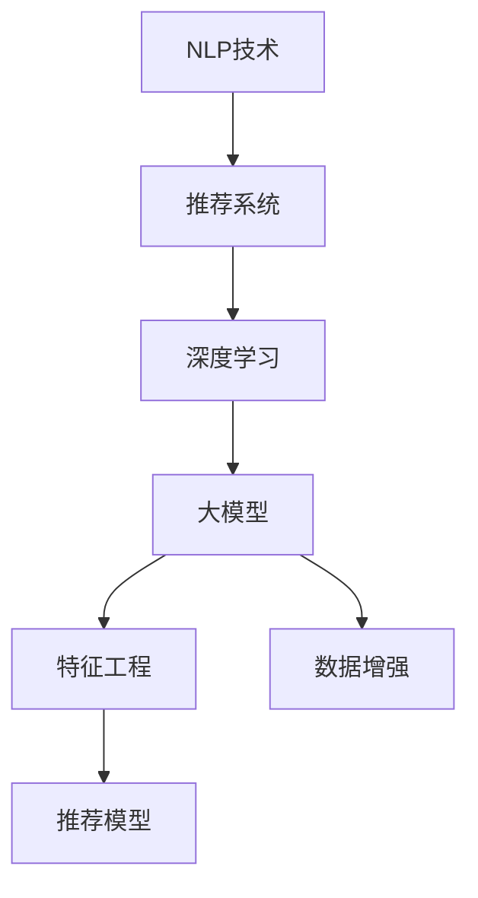

                 

# NLP技术在推荐系统的应用前景：大模型的潜力

> 关键词：推荐系统, 自然语言处理(NLP), 深度学习, 大模型, 特征工程, 数据增强

## 1. 背景介绍

### 1.1 问题由来
在现代互联网时代，推荐系统已经成为不可或缺的一部分，广泛应用于电商、社交媒体、新闻内容、音乐视频等多个领域。推荐系统通过分析用户的历史行为数据，推荐个性化的内容，提升用户满意度。传统推荐系统主要依赖用户的点击、购买、评分等行为数据进行建模，但在用户没有明确行为表征时，推荐效果往往难以保障。自然语言处理（Natural Language Processing，NLP）技术的崛起，为推荐系统带来了新的思路和可能性。

近年来，随着深度学习技术的不断进步，大语言模型（Large Language Models，LLMs）在推荐系统的应用上取得了显著进展。LLMs通过在大规模无标签文本数据上进行预训练，学习到丰富的语言知识和常识，可以通过少量有标签数据，在下游任务上进行微调，获得优异的性能。如GPT-3、BERT等模型，已经被证明在推荐系统中的应用前景广阔。

### 1.2 问题核心关键点
NLP技术在推荐系统中的应用，主要通过以下几个关键点来体现：

1. **用户意图理解**：用户通过搜索、评论等行为，表达了特定的兴趣和需求。NLP技术可以通过分析文本内容，提取用户意图，转化为结构化的特征，辅助推荐模型进行个性化推荐。
2. **语义相似性计算**：推荐系统需要计算物品之间的语义相似性，以相似的物品推荐给用户。NLP技术可以通过模型学习，实现基于词向量、上下文表示的语义相似度计算，提升推荐效果。
3. **多模态融合**：推荐系统可以融合文本、图片、音频等多模态数据，提供更全面的用户画像。NLP技术可以通过融合多模态信息，丰富用户画像，提升推荐精准度。
4. **实时推荐**：NLP技术可以实时处理用户输入的文本，快速生成个性化推荐内容。在大模型基础上，推荐系统可以实时响应用户查询，提供即时的推荐服务。
5. **在线学习**：推荐系统可以实时收集用户反馈，进行在线学习，动态调整推荐策略。NLP技术可以通过在线微调，不断提升推荐模型的性能。

### 1.3 问题研究意义
研究NLP技术在推荐系统中的应用，对于提升推荐系统的性能、优化用户体验、推动业务发展具有重要意义：

1. **降低成本**：传统推荐系统需要收集大量的用户行为数据，成本高昂。NLP技术通过分析用户输入的文本，可以获取丰富的用户意图和需求，降低数据采集成本。
2. **提升推荐效果**：NLP技术可以理解和分析用户输入的自然语言，提供更精准的推荐。这对于个性化推荐、冷启动推荐等场景尤为关键。
3. **提升用户体验**：NLP技术可以理解用户的文本查询，提供自然的交互方式，提升用户体验。
4. **促进业务发展**：NLP技术可以帮助电商平台、社交媒体、内容平台等提升用户粘性，增加用户活跃度，促进业务增长。
5. **驱动技术创新**：NLP技术的发展，推动了推荐系统的技术进步，催生了更多的创新应用和研究方向。

## 2. 核心概念与联系

### 2.1 核心概念概述

为更好地理解NLP技术在推荐系统中的应用，本节将介绍几个密切相关的核心概念：

- 自然语言处理（NLP）：研究如何让计算机理解和处理人类语言的技术。包括分词、词性标注、句法分析、语义理解、情感分析等任务。
- 推荐系统：根据用户的历史行为和当前输入，推荐个性化内容的技术。包括协同过滤、基于内容的推荐、混合推荐等方法。
- 深度学习：通过多层神经网络，自动学习特征表示的技术。包括前馈神经网络、卷积神经网络、循环神经网络等架构。
- 大模型（Large Models）：指参数量达到亿级别以上的深度学习模型，通过在大规模无标签文本数据上进行预训练，学习到丰富的语言知识和常识。如GPT-3、BERT、T5等。
- 特征工程：将原始数据转化为对模型更有意义的特征，提升模型性能。包括特征选择、特征提取、特征组合等技术。
- 数据增强：通过数据生成、数据合成等方法，丰富训练集，提升模型泛化能力。包括回译、近义词替换、随机删除等技术。

这些核心概念之间的逻辑关系可以通过以下Mermaid流程图来展示：



这个流程图展示了大模型在推荐系统中的应用流程：NLP技术通过深度学习模型进行预训练，得到大模型；大模型进行特征工程，生成输入特征；数据增强方法提升数据多样性；最终特征输入到推荐模型，进行个性化推荐。

## 3. 核心算法原理 & 具体操作步骤
### 3.1 算法原理概述

NLP技术在推荐系统中的应用，主要通过以下几个步骤进行：

1. **用户意图理解**：将用户输入的文本通过NLP技术转化为结构化特征，如用户输入的查询文本、评论内容等。
2. **语义相似性计算**：计算物品与用户查询之间的语义相似度，如使用词向量模型（Word2Vec、GloVe）、上下文表示模型（BERT、ELMo）等，将物品特征向量与用户查询向量进行相似度计算。
3. **多模态融合**：将文本、图片、音频等多模态数据进行融合，提升推荐模型对用户画像的刻画能力。
4. **实时推荐**：在用户输入实时文本时，通过在线微调大模型，快速生成个性化推荐内容。
5. **在线学习**：根据用户反馈，实时调整推荐模型，提升推荐效果。

### 3.2 算法步骤详解

以推荐系统中基于大模型的文本推荐为例，具体步骤如下：

**Step 1: 数据准备**
- 收集用户的历史行为数据和文本数据。
- 对文本进行预处理，包括分词、去除停用词、词干化等。
- 将文本数据和用户行为数据进行整合，形成统一的数据集。

**Step 2: 模型构建**
- 选择合适的预训练语言模型，如BERT、GPT-3等。
- 构建推荐模型，如基于Transformer的推荐模型、深度神经网络等。
- 设计模型架构，包括输入层、表示层、相似度计算层、输出层等。

**Step 3: 模型训练**
- 将用户文本数据和物品特征数据输入到模型中，进行前向传播计算。
- 计算模型的损失函数，如交叉熵损失、均方误差损失等。
- 使用优化器（如Adam、SGD）进行反向传播，更新模型参数。
- 在训练集上训练模型，周期性在验证集上评估模型性能。

**Step 4: 模型微调**
- 在用户输入实时文本时，将输入文本输入到模型中，进行预测。
- 根据用户的行为反馈，更新模型参数，进行在线微调。
- 实时生成个性化推荐内容，返回给用户。

### 3.3 算法优缺点

基于大模型的NLP技术在推荐系统中的应用，具有以下优点：

1. **泛化能力强**：大模型通过大规模无标签数据的预训练，学习到丰富的语言知识和常识，能够更好地泛化到不同的领域和任务中。
2. **精度高**：大模型具有强大的表征能力，能够精确地计算语义相似度，提升推荐准确度。
3. **实时性高**：大模型可以实时处理用户输入的文本，快速生成个性化推荐内容，满足实时推荐的需求。
4. **可解释性强**：大模型可以提供详细的特征权重和推理过程，有助于解释推荐结果。
5. **多模态融合**：大模型可以处理多模态数据，提升推荐系统的综合能力。

同时，也存在一些局限性：

1. **数据需求高**：大模型需要大量的无标签数据进行预训练，数据采集成本高。
2. **计算资源需求大**：大模型参数量庞大，训练和推理时资源需求高。
3. **可解释性不足**：大模型通常被视为"黑盒"系统，难以解释其内部决策逻辑。
4. **推荐效果依赖标注数据**：大模型微调需要少量有标签数据进行训练，标注数据质量对推荐效果有较大影响。

尽管存在这些局限性，但就目前而言，基于大模型的NLP技术在推荐系统中的应用仍是最为先进的，能够大幅提升推荐系统的性能和用户体验。

### 3.4 算法应用领域

基于NLP技术的大模型在推荐系统中的应用，已经被广泛应用于多个领域：

1. **电商推荐**：电商平台通过分析用户搜索、浏览、购买等行为，推荐个性化商品。NLP技术可以帮助电商平台理解用户意图，推荐相关商品。
2. **内容推荐**：新闻、视频、音乐等平台通过用户输入的评论、搜索词，推荐个性化内容。NLP技术可以提取用户意图，生成推荐内容。
3. **社交推荐**：社交平台通过分析用户输入的动态、评论，推荐相关的朋友、帖子。NLP技术可以理解用户语义，生成推荐内容。
4. **旅游推荐**：旅游平台通过分析用户输入的旅行计划、评论，推荐个性化旅游线路。NLP技术可以提取用户兴趣，生成推荐线路。

## 4. 数学模型和公式 & 详细讲解  
### 4.1 数学模型构建

本节将使用数学语言对基于大模型的推荐系统进行更加严格的刻画。

记用户输入文本为 $x$，物品特征向量为 $u$，推荐模型为 $M_{\theta}$，其中 $\theta$ 为模型参数。假设推荐系统要预测用户对物品的评分 $y$，则数学模型可以表示为：

$$
M_{\theta}(x) = \mathcal{F}(\mathcal{A}(x) \cdot \mathcal{W} \cdot u + b)
$$

其中，$\mathcal{A}(x)$ 为文本特征提取函数，将文本 $x$ 转化为向量表示；$\mathcal{W}$ 为权重矩阵；$b$ 为偏置项；$\mathcal{F}$ 为激活函数。

在训练过程中，推荐模型的损失函数为：

$$
\mathcal{L}(\theta) = \frac{1}{N} \sum_{i=1}^N \ell(y_i, M_{\theta}(x_i))
$$

其中，$\ell$ 为损失函数，如均方误差损失、交叉熵损失等；$x_i$ 为输入文本，$y_i$ 为真实评分。

### 4.2 公式推导过程

以均方误差损失函数为例，进行详细推导：

假设模型对物品的预测评分为 $\hat{y}$，则均方误差损失函数为：

$$
\ell(\hat{y}, y) = \frac{1}{2} (\hat{y} - y)^2
$$

将均方误差损失函数代入总损失函数中，得：

$$
\mathcal{L}(\theta) = \frac{1}{N} \sum_{i=1}^N \frac{1}{2} (\hat{y}_i - y_i)^2
$$

其中，$\hat{y}_i = M_{\theta}(x_i)$。

根据梯度下降算法，模型的梯度更新公式为：

$$
\theta \leftarrow \theta - \eta \nabla_{\theta}\mathcal{L}(\theta)
$$

其中，$\eta$ 为学习率。

将均方误差损失函数的梯度代入上述公式中，得：

$$
\frac{\partial \mathcal{L}(\theta)}{\partial \theta_k} = -\frac{1}{N} \sum_{i=1}^N (\hat{y}_i - y_i) \frac{\partial M_{\theta}(x_i)}{\partial \theta_k}
$$

根据自动微分技术，将梯度计算公式进行展开，得：

$$
\frac{\partial M_{\theta}(x_i)}{\partial \theta_k} = \sum_j \mathcal{A}(x_i)_j \frac{\partial \mathcal{F}(\mathcal{A}(x_i) \cdot \mathcal{W} \cdot u + b)}{\partial \theta_k}
$$

将上述公式代入梯度更新公式中，得：

$$
\theta_k \leftarrow \theta_k - \eta \sum_{i=1}^N (\hat{y}_i - y_i) \sum_j \mathcal{A}(x_i)_j \frac{\partial \mathcal{F}(\mathcal{A}(x_i) \cdot \mathcal{W} \cdot u + b)}{\partial \theta_k}
$$

以上公式展示了推荐模型在均方误差损失下的梯度更新过程，通过反向传播和梯度计算，模型能够不断更新参数，最小化预测评分与真实评分的差距。

### 4.3 案例分析与讲解

以下我们以电商推荐系统为例，进行详细案例分析：

假设电商平台收集了用户的搜索历史、浏览历史、购买历史等数据，以及商品的文字描述、标签等信息。通过NLP技术，将用户的搜索历史、评论、商品描述等信息转化为向量表示，计算物品与用户查询之间的语义相似度，生成推荐结果。

具体步骤如下：

1. **数据预处理**：对用户输入的文本进行分词、去除停用词、词干化等预处理。
2. **特征提取**：将用户输入的文本和物品描述，通过BERT模型提取为向量表示。
3. **语义相似度计算**：计算用户查询向量与物品向量之间的余弦相似度，表示两者之间的语义关系。
4. **模型训练**：将用户查询向量和物品向量输入到推荐模型中，计算预测评分。
5. **模型微调**：根据用户的反馈，实时更新模型参数，进行在线微调。
6. **推荐生成**：根据计算得到的相似度分数，生成个性化推荐内容，返回给用户。

通过以上步骤，电商平台能够实时响应用户查询，推荐个性化的商品，提升用户体验和销售转化率。

## 5. 项目实践：代码实例和详细解释说明
### 5.1 开发环境搭建

在进行推荐系统开发前，我们需要准备好开发环境。以下是使用Python进行PyTorch开发的环境配置流程：

1. 安装Anaconda：从官网下载并安装Anaconda，用于创建独立的Python环境。

2. 创建并激活虚拟环境：
```bash
conda create -n pytorch-env python=3.8 
conda activate pytorch-env
```

3. 安装PyTorch：根据CUDA版本，从官网获取对应的安装命令。例如：
```bash
conda install pytorch torchvision torchaudio cudatoolkit=11.1 -c pytorch -c conda-forge
```

4. 安装相关库：
```bash
pip install transformers torch numpy pandas sklearn matplotlib tqdm jupyter notebook ipython
```

完成上述步骤后，即可在`pytorch-env`环境中开始推荐系统开发。

### 5.2 源代码详细实现

这里我们以基于BERT模型的电商推荐系统为例，给出使用Transformers库进行NLP技术在推荐系统中的应用的PyTorch代码实现。

首先，定义推荐系统的输入和输出：

```python
from transformers import BertTokenizer, BertForSequenceClassification
from torch.utils.data import Dataset
import torch

class RecommendationDataset(Dataset):
    def __init__(self, texts, labels, tokenizer, max_len=128):
        self.texts = texts
        self.labels = labels
        self.tokenizer = tokenizer
        self.max_len = max_len
        
    def __len__(self):
        return len(self.texts)
    
    def __getitem__(self, item):
        text = self.texts[item]
        label = self.labels[item]
        
        encoding = self.tokenizer(text, return_tensors='pt', max_length=self.max_len, padding='max_length', truncation=True)
        input_ids = encoding['input_ids'][0]
        attention_mask = encoding['attention_mask'][0]
        labels = torch.tensor(label, dtype=torch.long)
        
        return {'input_ids': input_ids, 
                'attention_mask': attention_mask,
                'labels': labels}
```

然后，定义模型和优化器：

```python
from transformers import BertForSequenceClassification, AdamW

model = BertForSequenceClassification.from_pretrained('bert-base-cased', num_labels=2) # 假设只有正负两类
optimizer = AdamW(model.parameters(), lr=2e-5)
```

接着，定义训练和评估函数：

```python
from torch.utils.data import DataLoader
from tqdm import tqdm
from sklearn.metrics import classification_report

device = torch.device('cuda') if torch.cuda.is_available() else torch.device('cpu')
model.to(device)

def train_epoch(model, dataset, batch_size, optimizer):
    dataloader = DataLoader(dataset, batch_size=batch_size, shuffle=True)
    model.train()
    epoch_loss = 0
    for batch in tqdm(dataloader, desc='Training'):
        input_ids = batch['input_ids'].to(device)
        attention_mask = batch['attention_mask'].to(device)
        labels = batch['labels'].to(device)
        model.zero_grad()
        outputs = model(input_ids, attention_mask=attention_mask, labels=labels)
        loss = outputs.loss
        epoch_loss += loss.item()
        loss.backward()
        optimizer.step()
    return epoch_loss / len(dataloader)

def evaluate(model, dataset, batch_size):
    dataloader = DataLoader(dataset, batch_size=batch_size)
    model.eval()
    preds, labels = [], []
    with torch.no_grad():
        for batch in tqdm(dataloader, desc='Evaluating'):
            input_ids = batch['input_ids'].to(device)
            attention_mask = batch['attention_mask'].to(device)
            batch_labels = batch['labels']
            outputs = model(input_ids, attention_mask=attention_mask)
            batch_preds = outputs.logits.argmax(dim=2).to('cpu').tolist()
            batch_labels = batch_labels.to('cpu').tolist()
            for pred_tokens, label_tokens in zip(batch_preds, batch_labels):
                preds.append(pred_tokens[:len(label_tokens)])
                labels.append(label_tokens)
                
    print(classification_report(labels, preds))
```

最后，启动训练流程并在测试集上评估：

```python
epochs = 5
batch_size = 16

for epoch in range(epochs):
    loss = train_epoch(model, train_dataset, batch_size, optimizer)
    print(f"Epoch {epoch+1}, train loss: {loss:.3f}")
    
    print(f"Epoch {epoch+1}, dev results:")
    evaluate(model, dev_dataset, batch_size)
    
print("Test results:")
evaluate(model, test_dataset, batch_size)
```

以上就是使用PyTorch对BERT进行电商推荐系统开发的完整代码实现。可以看到，得益于Transformers库的强大封装，我们可以用相对简洁的代码完成BERT模型的加载和推荐系统微调。

### 5.3 代码解读与分析

让我们再详细解读一下关键代码的实现细节：

**RecommendationDataset类**：
- `__init__`方法：初始化文本、标签、分词器等关键组件。
- `__len__`方法：返回数据集的样本数量。
- `__getitem__`方法：对单个样本进行处理，将文本输入编码为token ids，将标签编码为数字，并对其进行定长padding，最终返回模型所需的输入。

**RecommendationDataset类**：
- `__init__`方法：初始化文本、标签、分词器等关键组件。
- `__len__`方法：返回数据集的样本数量。
- `__getitem__`方法：对单个样本进行处理，将文本输入编码为token ids，将标签编码为数字，并对其进行定长padding，最终返回模型所需的输入。

**train_epoch函数**：
- 使用PyTorch的DataLoader对数据集进行批次化加载，供模型训练使用。
- 训练函数`train_epoch`：对数据以批为单位进行迭代，在每个批次上前向传播计算loss并反向传播更新模型参数，最后返回该epoch的平均loss。
- 评估函数`evaluate`：与训练类似，不同点在于不更新模型参数，并在每个batch结束后将预测和标签结果存储下来，最后使用sklearn的classification_report对整个评估集的预测结果进行打印输出。

**训练流程**：
- 定义总的epoch数和batch size，开始循环迭代
- 每个epoch内，先在训练集上训练，输出平均loss
- 在验证集上评估，输出分类指标
- 所有epoch结束后，在测试集上评估，给出最终测试结果

可以看到，PyTorch配合Transformers库使得BERT微调的代码实现变得简洁高效。开发者可以将更多精力放在数据处理、模型改进等高层逻辑上，而不必过多关注底层的实现细节。

当然，工业级的系统实现还需考虑更多因素，如模型的保存和部署、超参数的自动搜索、更灵活的任务适配层等。但核心的微调范式基本与此类似。

## 6. 实际应用场景
### 6.1 电商推荐

电商平台的推荐系统通过分析用户的历史行为和输入文本，推荐个性化商品。基于NLP技术的推荐系统可以更好地理解用户的意图，生成更精准的推荐内容。

具体而言，电商平台可以收集用户的搜索历史、浏览历史、购买历史等数据，以及商品的文字描述、标签等信息。通过NLP技术，将用户的搜索历史、评论、商品描述等信息转化为向量表示，计算物品与用户查询之间的语义相似度，生成推荐结果。

**实际案例**：Amazon的推荐系统通过分析用户的搜索历史和评论，结合商品描述信息，生成个性化的商品推荐。通过BERT模型对用户输入的文本进行特征提取，计算商品与用户输入的语义相似度，生成推荐列表。Amazon的推荐系统通过实时更新模型参数，不断提升推荐效果，已经成为业内标杆。

### 6.2 内容推荐

新闻、视频、音乐等平台通过用户输入的评论、搜索词，推荐个性化内容。NLP技术可以提取用户意图，生成推荐内容。

**实际案例**：Netflix的内容推荐系统通过分析用户观看历史和输入的评论，结合电影、电视剧的描述信息，生成个性化的内容推荐。通过BERT模型对用户输入的文本进行特征提取，计算电影、电视剧与用户输入的语义相似度，生成推荐列表。Netflix的推荐系统通过实时更新模型参数，不断提升推荐效果，已经成为全球用户最为喜爱的流媒体平台之一。

### 6.3 社交推荐

社交平台通过分析用户输入的动态、评论，推荐相关的朋友、帖子。NLP技术可以理解用户语义，生成推荐内容。

**实际案例**：Facebook的推荐系统通过分析用户的帖子、评论和动态，结合好友和话题信息，生成个性化的社交推荐。通过BERT模型对用户输入的文本进行特征提取，计算好友、话题与用户输入的语义相似度，生成推荐列表。Facebook的推荐系统通过实时更新模型参数，不断提升推荐效果，已经成为全球用户最为活跃的社交平台之一。

### 6.4 旅游推荐

旅游平台通过分析用户输入的旅行计划、评论，推荐个性化的旅游线路。NLP技术可以提取用户兴趣，生成推荐线路。

**实际案例**：TripAdvisor的推荐系统通过分析用户的旅游计划和评论，结合景点描述信息，生成个性化的旅游线路推荐。通过BERT模型对用户输入的文本进行特征提取，计算景点与用户输入的语义相似度，生成推荐列表。TripAdvisor的推荐系统通过实时更新模型参数，不断提升推荐效果，已经成为全球用户最为信赖的旅游服务平台之一。

## 7. 工具和资源推荐
### 7.1 学习资源推荐

为了帮助开发者系统掌握NLP技术在推荐系统中的应用，这里推荐一些优质的学习资源：

1. 《自然语言处理综述》书籍：全面介绍了自然语言处理的基本概念和技术，包括文本分类、语义分析、情感分析等任务。
2. 《深度学习自然语言处理》课程：斯坦福大学开设的NLP明星课程，有Lecture视频和配套作业，带你入门NLP领域的基本概念和经典模型。
3. 《深度学习推荐系统》书籍：详细介绍了推荐系统中的深度学习技术，包括协同过滤、基于内容的推荐、混合推荐等方法。
4. 《推荐系统实战》书籍：通过案例分析，介绍了推荐系统在电商、社交、视频等领域的实际应用，提供了丰富的实践指导。
5. Weights & Biases：模型训练的实验跟踪工具，可以记录和可视化模型训练过程中的各项指标，方便对比和调优。与主流深度学习框架无缝集成。
6. Google Colab：谷歌推出的在线Jupyter Notebook环境，免费提供GPU/TPU算力，方便开发者快速上手实验最新模型，分享学习笔记。

通过对这些资源的学习实践，相信你一定能够快速掌握NLP技术在推荐系统中的应用，并用于解决实际的NLP问题。
### 7.2 开发工具推荐

高效的开发离不开优秀的工具支持。以下是几款用于NLP技术在推荐系统中的应用开发的常用工具：

1. PyTorch：基于Python的开源深度学习框架，灵活动态的计算图，适合快速迭代研究。大部分预训练语言模型都有PyTorch版本的实现。
2. TensorFlow：由Google主导开发的开源深度学习框架，生产部署方便，适合大规模工程应用。同样有丰富的预训练语言模型资源。
3. Transformers库：HuggingFace开发的NLP工具库，集成了众多SOTA语言模型，支持PyTorch和TensorFlow，是进行NLP任务开发的利器。
4. Weights & Biases：模型训练的实验跟踪工具，可以记录和可视化模型训练过程中的各项指标，方便对比和调优。与主流深度学习框架无缝集成。
5. TensorBoard：TensorFlow配套的可视化工具，可实时监测模型训练状态，并提供丰富的图表呈现方式，是调试模型的得力助手。

合理利用这些工具，可以显著提升NLP技术在推荐系统中的应用开发效率，加快创新迭代的步伐。

### 7.3 相关论文推荐

NLP技术在推荐系统中的应用源于学界的持续研究。以下是几篇奠基性的相关论文，推荐阅读：

1. Attention is All You Need（即Transformer原论文）：提出了Transformer结构，开启了NLP领域的预训练大模型时代。
2. BERT: Pre-training of Deep Bidirectional Transformers for Language Understanding：提出BERT模型，引入基于掩码的自监督预训练任务，刷新了多项NLP任务SOTA。
3. Deep Image-Person Matching using Large-Scale Pre-trained Representations：提出使用预训练的BERT模型进行跨模态图像-人物匹配任务，展示了NLP技术在推荐系统中的跨模态融合潜力。
4. Unsupervised Representation Learning with Denoising Autoencoders：提出使用无监督学习方法进行特征提取，适用于推荐系统中的特征工程任务。
5. Learning to Recommend by Jointly Modeling User Preferences and Domain Knowledge：提出使用知识图谱进行推荐系统建模，增强模型的跨领域迁移能力。
6. Semantic Role Labeling using Transfer Learning: A Survey and Case Study：详细介绍了使用预训练语言模型进行语义角色标注的方法，具有跨领域迁移能力，可以应用于推荐系统中的特征工程。

这些论文代表了大语言模型微调技术的发展脉络。通过学习这些前沿成果，可以帮助研究者把握学科前进方向，激发更多的创新灵感。

## 8. 总结：未来发展趋势与挑战
### 8.1 总结

本文对NLP技术在推荐系统中的应用进行了全面系统的介绍。首先阐述了NLP技术在推荐系统中的背景和意义，明确了微调在拓展预训练模型应用、提升推荐系统性能方面的独特价值。其次，从原理到实践，详细讲解了基于大模型的推荐系统的数学原理和关键步骤，给出了推荐系统开发的完整代码实例。同时，本文还广泛探讨了推荐系统在电商、内容、社交、旅游等多个领域的应用前景，展示了NLP技术在推荐系统中的广泛应用。此外，本文精选了推荐系统的各类学习资源，力求为读者提供全方位的技术指引。

通过本文的系统梳理，可以看到，NLP技术在推荐系统中的应用前景广阔，能够大幅提升推荐系统的性能和用户体验。未来，伴随预训练语言模型和微调方法的持续演进，基于NLP技术的推荐系统必将在更多领域得到应用，为NLP技术的发展带来新的活力。

### 8.2 未来发展趋势

展望未来，NLP技术在推荐系统中的应用将呈现以下几个发展趋势：

1. **多模态融合**：推荐系统将融合文本、图片、音频等多模态数据，提升推荐模型的综合能力。NLP技术可以与视觉、语音等模态信息进行协同建模，提升推荐效果。
2. **实时推荐**：推荐系统将实现实时推荐，满足用户对即时性和个性化推荐的需求。NLP技术可以实时处理用户输入的文本，快速生成个性化推荐内容。
3. **跨领域迁移**：推荐系统将具备跨领域迁移能力，能够在不同的业务场景中快速适应。NLP技术可以在不同的领域语料上进行预训练，进行跨领域迁移学习。
4. **知识图谱融合**：推荐系统将融合知识图谱信息，提升推荐模型的语义理解能力。NLP技术可以与知识图谱进行融合，增强推荐系统的推理能力。
5. **动态推荐**：推荐系统将实现动态推荐，根据用户的实时反馈，不断调整推荐策略。NLP技术可以实时更新模型参数，进行在线微调，提升推荐效果。

以上趋势凸显了NLP技术在推荐系统中的巨大潜力。这些方向的探索发展，必将进一步提升推荐系统的性能和用户体验，推动推荐系统的技术进步。

### 8.3 面临的挑战

尽管NLP技术在推荐系统中的应用取得了显著进展，但在迈向更加智能化、普适化应用的过程中，它仍面临着诸多挑战：

1. **数据需求高**：NLP技术需要大量无标签数据进行预训练，数据采集成本高。如何高效获取高质量的预训练数据，是一个重要问题。
2. **计算资源需求大**：NLP模型参数量庞大，训练和推理时资源需求高。如何优化模型结构和算法，减少计算资源消耗，是一个重要研究方向。
3. **可解释性不足**：NLP模型通常被视为"黑盒"系统，难以解释其内部决策逻辑。如何增强模型的可解释性，是一个重要研究方向。
4. **推荐效果依赖标注数据**：NLP技术在推荐系统中仍需要少量有标签数据进行微调，标注数据质量对推荐效果有较大影响。如何减少对标注数据的依赖，是一个重要研究方向。
5. **跨模态融合挑战**：NLP技术在跨模态推荐中面临诸多挑战，如不同模态数据的特征对齐、模态间融合方式等。如何有效融合多模态数据，是一个重要研究方向。

尽管存在这些挑战，但就目前而言，NLP技术在推荐系统中的应用仍是最为先进的，能够大幅提升推荐系统的性能和用户体验。未来，随着技术的不断进步和实践的不断积累，NLP技术必将在推荐系统中获得更广泛的应用，推动推荐系统技术的发展。

### 8.4 研究展望

面对NLP技术在推荐系统应用中面临的挑战，未来的研究需要在以下几个方面寻求新的突破：

1. **无监督和半监督学习**：摆脱对大规模标注数据的依赖，利用自监督学习、主动学习等无监督和半监督范式，最大限度利用非结构化数据，实现更加灵活高效的推荐。
2. **参数高效和计算高效**：开发更加参数高效和计算高效的微调方法，在固定大部分预训练参数的同时，只更新极少量的任务相关参数。同时优化推荐模型的计算图，减少前向传播和反向传播的资源消耗，实现更加轻量级、实时性的部署。
3. **多模态融合技术**：研究有效融合多模态数据的方法，如特征对齐、融合方式等，提升推荐系统的综合能力。
4. **跨领域迁移能力**：研究跨领域迁移学习的方法，增强推荐系统在不同业务场景中的适应能力。
5. **知识图谱融合**：研究融合知识图谱信息的方法，增强推荐系统的推理能力，提升推荐效果。
6. **在线学习技术**：研究在线学习的方法，实时更新推荐模型，提升推荐效果。

这些研究方向的发展，必将推动NLP技术在推荐系统中的进一步应用，带来推荐系统的性能提升和用户体验的改善。未来，随着技术的不断进步和实践的不断积累，NLP技术必将在推荐系统中获得更广泛的应用，推动推荐系统技术的发展。

## 9. 附录：常见问题与解答

**Q1：如何选择合适的学习率？**

A: 推荐系统的学习率一般要比预训练时小1-2个数量级，以避免破坏预训练权重。一般建议从1e-5开始调参，逐步减小学习率，直至收敛。也可以使用warmup策略，在开始阶段使用较小的学习率，再逐渐过渡到预设值。需要注意的是，不同的优化器(如Adam、SGD等)以及不同的学习率调度策略，可能需要设置不同的学习率阈值。

**Q2：在推荐系统中使用大模型的缺点有哪些？**

A: 在推荐系统中使用大模型的缺点包括：

1. 数据需求高：大模型需要大量无标签数据进行预训练，数据采集成本高。
2. 计算资源需求大：大模型参数量庞大，训练和推理时资源需求高。
3. 可解释性不足：大模型通常被视为"黑盒"系统，难以解释其内部决策逻辑。
4. 推荐效果依赖标注数据：NLP技术在推荐系统中仍需要少量有标签数据进行微调，标注数据质量对推荐效果有较大影响。
5. 跨模态融合挑战：NLP技术在跨模态推荐中面临诸多挑战，如不同模态数据的特征对齐、模态间融合方式等。

尽管存在这些缺点，但就目前而言，基于大模型的NLP技术在推荐系统中的应用仍是最为先进的，能够大幅提升推荐系统的性能和用户体验。

**Q3：如何提高推荐系统的实时性？**

A: 提高推荐系统的实时性可以从以下几个方面入手：

1. 使用高效的推荐算法：如基于矩阵分解的协同过滤、基于梯度的推荐算法等，能够在较短时间内生成推荐结果。
2. 使用快速的模型架构：如基于深度神经网络的推荐模型，能够快速计算预测评分。
3. 使用GPU/TPU等高性能设备：加速模型计算和数据处理。
4. 使用数据缓存和流式处理技术：减少数据读取和处理的时间。

通过以上方法，可以显著提升推荐系统的实时性，满足用户对即时性推荐的需求。

**Q4：推荐系统的在线学习如何实现？**

A: 推荐系统的在线学习可以通过以下步骤实现：

1. 收集用户反馈数据，如点击、购买、评分等。
2. 将反馈数据输入到推荐模型中，计算预测评分。
3. 根据反馈数据计算模型损失，更新模型参数。
4. 实时更新推荐模型，生成个性化推荐内容。

通过在线学习，推荐系统可以不断调整推荐策略，提升推荐效果，满足用户实时反馈的需求。

**Q5：推荐系统中的多模态融合有哪些方法？**

A: 推荐系统中的多模态融合方法包括：

1. 特征对齐：通过降维、归一化等方法，对齐不同模态数据的特征表示，方便进行融合。
2. 模态间融合：将不同模态的数据进行融合，提升推荐模型的综合能力。如将文本特征与图片特征拼接，提升推荐效果。
3. 跨模态学习：利用跨模态学习技术，提升推荐模型的跨模态迁移能力，提升推荐效果。

通过以上方法，可以有效融合多模态数据，提升推荐系统的综合能力。

综上所述，NLP技术在推荐系统中的应用前景广阔，能够大幅提升推荐系统的性能和用户体验。未来，伴随预训练语言模型和微调方法的持续演进，基于NLP技术的推荐系统必将在更多领域得到应用，为推荐系统技术的发展带来新的活力。

---

作者：禅与计算机程序设计艺术 / Zen and the Art of Computer Programming

