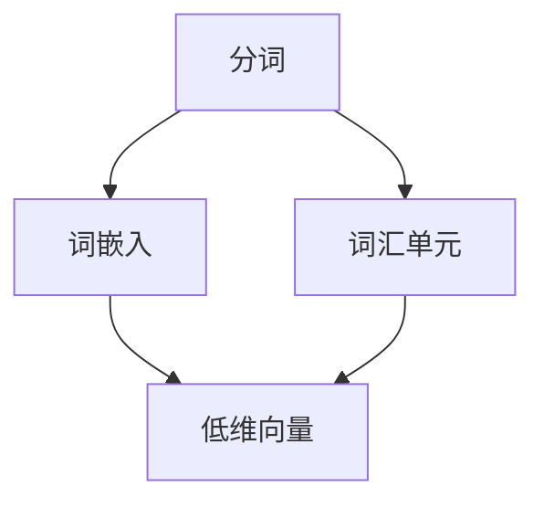

                 

# NLP预处理技术：分词、词嵌入和序列标注

> 关键词：自然语言处理(NLP), 分词, 词嵌入, 序列标注, 词向量, 神经网络

## 1. 背景介绍

### 1.1 问题由来

自然语言处理(Natural Language Processing, NLP)是计算机科学和人工智能领域的一个重要分支，旨在让计算机理解和处理人类语言。随着深度学习和大规模预训练语言模型的兴起，NLP技术的落地应用取得了显著进展。然而，要构建高质量的NLP系统，预处理技术的完善至关重要。

分词、词嵌入和序列标注是NLP预处理技术的核心环节，对最终模型的性能有重要影响。分词是将连续的文本序列划分成离散的词汇单元；词嵌入是将词汇映射到低维向量空间，以捕捉词汇间的语义关系；序列标注是将文本中的词汇序列与预定义的标签序列进行匹配，如命名实体识别(NER)、词性标注(PoS)等。

本文将系统介绍NLP预处理技术的原理和实践，帮助读者理解这些技术对NLP系统性能的提升作用，并在此基础上进行深入探讨和应用。

### 1.2 问题核心关键点

本文将详细讲解以下几个核心问题：

- 分词技术的基本原理和实现方式。
- 词嵌入算法的关键原理、算法步骤和优缺点。
- 序列标注任务的模型构建和训练方法。
- 如何在实践中高效实现分词、词嵌入和序列标注技术。

通过回答这些问题，读者将能够全面理解NLP预处理技术的实现原理和应用场景，为构建高效、准确的NLP系统打下坚实基础。

## 2. 核心概念与联系

### 2.1 核心概念概述

为更好地理解NLP预处理技术，本节将介绍几个密切相关的核心概念：

- 分词：将连续的文本序列切分成离散词汇的过程。在中文等非空格分隔的语言中尤为重要。
- 词嵌入：将词汇映射到低维向量空间的过程，使得词汇间的语义关系得以保留。
- 序列标注：给文本中的词汇序列打上预定义的标签，如实体类型、词性等。

这些概念之间具有紧密的联系，共同构成了NLP系统预处理的核心技术。

### 2.2 核心概念原理和架构的 Mermaid 流程图



这个流程图展示了分词、词嵌入和序列标注之间的关系：

1. 分词将连续文本划分为离散词汇。
2. 词嵌入将这些词汇映射到低维向量空间，捕捉词汇间的语义关系。
3. 序列标注给词汇打上标签，如实体类型、词性等。

接下来，我们将在下文详细讲解每个核心概念的原理和实现。

## 3. 核心算法原理 & 具体操作步骤

### 3.1 算法原理概述

#### 3.1.1 分词技术

分词是NLP预处理的基础步骤，其目的是将连续的文本序列划分为离散词汇单元。常见的分词算法包括基于规则的分词和基于统计的分词。

基于规则的分词通过人工定义的语法和词典规则，对文本进行逐词切分。这种方法适用于词汇边界清晰、语法结构简单的语言，但需要大量的人工规则和词典，且难以处理复杂的语言现象。

基于统计的分词通过学习大量标注好的分词数据，统计词汇出现的概率和位置信息，自动预测词汇边界。这种方法适用于任何语言，但需要足够的训练数据和计算资源，且模型的性能依赖于数据质量。

#### 3.1.2 词嵌入技术

词嵌入是将词汇映射到低维向量空间的过程，使得词汇间的语义关系得以保留。常见的词嵌入算法包括基于神经网络的词嵌入和基于统计的词嵌入。

基于神经网络的词嵌入通过训练大规模的神经网络模型，将词汇映射到低维向量空间，使得相似的词汇在向量空间中距离较近。这种方法能够自动学习词汇的语义和上下文信息，适用于任何语言。

基于统计的词嵌入通过统计词汇在语料库中出现的上下文信息，计算词汇间的共现概率，生成词向量。这种方法不需要训练大规模的神经网络，计算成本较低，但无法捕捉复杂的语义关系。

#### 3.1.3 序列标注技术

序列标注是将文本中的词汇序列与预定义的标签序列进行匹配，如命名实体识别(NER)、词性标注(PoS)等。常见的序列标注算法包括基于神经网络的序列标注和基于统计的序列标注。

基于神经网络的序列标注通过训练大规模的神经网络模型，将词汇序列映射到标签序列。这种方法能够自动学习词汇和标签之间的映射关系，适用于任何任务。

基于统计的序列标注通过统计词汇和标签之间的共现概率，生成标注概率模型。这种方法计算成本较低，但需要大量标注数据，且模型复杂度较高。

### 3.2 算法步骤详解

#### 3.2.1 分词算法步骤

1. **预处理**：去除文本中的特殊符号和标点，统一大小写，分词工具通常需要处理大量文本数据，所以效率和准确率是关键。
2. **词典匹配**：利用词典匹配算法，如最长公共前缀、最大匹配等，对文本进行逐词切分。
3. **后处理**：对分词结果进行去重、合并、纠正，以提高分词的准确性。

#### 3.2.2 词嵌入算法步骤

1. **词向量训练**：使用大规模语料库训练神经网络模型，生成词向量。
2. **词汇映射**：将每个词汇映射到一个低维向量，向量长度一般为100-300维。
3. **向量矩阵构建**：将所有词汇的向量组成矩阵，供后续模型使用。

#### 3.2.3 序列标注算法步骤

1. **预处理**：对文本进行分词和标记，生成词汇序列和标签序列。
2. **模型训练**：使用训练集数据，训练序列标注模型，如BiLSTM-CRF、BERT等。
3. **标注预测**：对测试集数据进行标注预测，输出词汇序列对应的标签序列。

### 3.3 算法优缺点

#### 3.3.1 分词技术

**优点**：
- 适用于任何语言。
- 可以根据不同领域的特点进行定制。

**缺点**：
- 需要大量的人工规则和词典，难以处理复杂的语言现象。
- 基于统计的分词方法依赖于大量标注数据。

#### 3.3.2 词嵌入技术

**优点**：
- 能够自动学习词汇的语义和上下文信息。
- 适用于任何语言。

**缺点**：
- 需要大量语料库进行训练，计算成本较高。
- 基于神经网络的词嵌入方法，模型复杂度较高。

#### 3.3.3 序列标注技术

**优点**：
- 能够自动学习词汇和标签之间的映射关系。
- 适用于任何任务。

**缺点**：
- 需要大量标注数据进行训练。
- 模型复杂度较高，计算成本较高。

### 3.4 算法应用领域

基于分词、词嵌入和序列标注的NLP预处理技术，已经在文本分类、问答系统、机器翻译、命名实体识别、情感分析等多个领域得到了广泛应用。

1. **文本分类**：将文本映射到预定义的类别标签，如新闻分类、情感分析等。
2. **问答系统**：回答用户提出的自然语言问题，如智能客服、智能助理等。
3. **机器翻译**：将一种语言的文本翻译成另一种语言。
4. **命名实体识别**：识别文本中的人名、地名、组织名等实体。
5. **情感分析**：分析文本的情感倾向，如正面、负面、中性等。

这些技术不仅提升了NLP系统的性能，还为更多行业提供了高效、准确的解决方案。

## 4. 数学模型和公式 & 详细讲解 & 举例说明

### 4.1 数学模型构建

#### 4.1.1 分词模型

分词模型的目标是最大化词汇出现概率，即：

$$
\arg\max_{\text{words}} P(\text{words} | \text{text})
$$

其中，$\text{words}$ 表示词汇序列，$\text{text}$ 表示文本序列。

分词模型可以通过马尔科夫模型或隐马尔科夫模型(Markov Model, HMM)来建模。以隐马尔科夫模型为例，其状态转移概率矩阵 $P(\text{word}_i | \text{word}_{i-1})$ 和观测概率矩阵 $P(\text{word}_i | \text{word}_{i-1}, \text{word}_{i-2}, ..., \text{word}_1)$ 可以表示为：

$$
P(\text{word}_i | \text{word}_{i-1}) = \frac{P(\text{word}_{i-1}, \text{word}_i)}{P(\text{word}_{i-1})}
$$

$$
P(\text{word}_i | \text{word}_{i-1}, \text{word}_{i-2}, ..., \text{word}_1) = \frac{P(\text{word}_{i-1}, \text{word}_{i-2}, ..., \text{word}_1, \text{word}_i)}{P(\text{word}_{i-1}, \text{word}_{i-2}, ..., \text{word}_1)}
$$

#### 4.1.2 词嵌入模型

词嵌入模型通常使用Word2Vec、GloVe、FastText等算法进行训练。以Word2Vec算法为例，其目标函数为：

$$
\min_{w, v} -\sum_{x_i \in D} \sum_{j=1}^{n} y_j \log \sigma (w^T \cdot v_j)
$$

其中，$x_i$ 表示词汇序列，$y_j$ 表示词汇标签，$w$ 表示权重向量，$v_j$ 表示词汇向量，$\sigma$ 表示激活函数。

在Word2Vec算法中，有两种模式：连续词袋模型(Continuous Bag of Words, CBOW)和Skip-gram模型。CBOW模式的目标是预测给定上下文词汇序列中的目标词汇，而Skip-gram模式的目标是预测给定目标词汇的上下文词汇序列。

#### 4.1.3 序列标注模型

序列标注模型通常使用条件随机场(Conditional Random Fields, CRF)或长短时记忆网络(BiLSTM-CRF)来建模。以BiLSTM-CRF模型为例，其联合概率函数为：

$$
P(\text{labels} | \text{words}, \theta) = \frac{1}{Z} \prod_{i=1}^N P(\text{labels}_i | \text{words}_i, \theta)
$$

其中，$\text{labels}_i$ 表示词汇$i$的标签，$\text{words}_i$ 表示词汇$i$的特征，$\theta$ 表示模型参数，$Z$ 表示归一化因子。

### 4.2 公式推导过程

#### 4.2.1 分词公式推导

假设分词模型的状态空间为 $V$，观测空间为 $X$。对于观测序列 $x_1, x_2, ..., x_n$，其状态序列 $y_1, y_2, ..., y_n$ 的概率可以表示为：

$$
P(y_1, y_2, ..., y_n | x_1, x_2, ..., x_n) = \frac{P(y_1, x_1)}{\sum_{y_1} P(y_1, x_1)} \cdot \frac{P(y_2, x_2)}{\sum_{y_2} P(y_2, x_2)} \cdot \ldots \cdot \frac{P(y_n, x_n)}{\sum_{y_n} P(y_n, x_n)}
$$

其中，$P(y_i, x_i)$ 表示在观测到 $x_i$ 的情况下，词汇 $y_i$ 出现的概率。

#### 4.2.2 词嵌入公式推导

在Word2Vec算法中，词向量的训练目标函数为：

$$
L(w, v) = -\sum_{x_i \in D} \sum_{j=1}^{n} y_j \log \sigma (w^T \cdot v_j)
$$

其中，$w$ 表示权重向量，$v_j$ 表示词汇向量，$x_i$ 表示词汇序列，$y_j$ 表示词汇标签。

梯度下降优化算法用于求解上述目标函数：

$$
\frac{\partial L}{\partial w} = \sum_{x_i \in D} \sum_{j=1}^{n} y_j \cdot (v_j - \sigma(w^T \cdot v_j)) \cdot v_j
$$

$$
\frac{\partial L}{\partial v_j} = -\sum_{x_i \in D} y_j \cdot \sigma(w^T \cdot v_j)
$$

#### 4.2.3 序列标注公式推导

以BiLSTM-CRF模型为例，其联合概率函数可以表示为：

$$
P(\text{labels} | \text{words}, \theta) = \frac{1}{Z} \prod_{i=1}^N P(\text{labels}_i | \text{words}_i, \theta)
$$

其中，$\text{labels}_i$ 表示词汇$i$的标签，$\text{words}_i$ 表示词汇$i$的特征，$\theta$ 表示模型参数，$Z$ 表示归一化因子。

### 4.3 案例分析与讲解

#### 4.3.1 分词案例

假设有一段文本 "我正在读书"，分词模型将其划分为三个词汇单元 "我"、"正在"、"读书"。

#### 4.3.2 词嵌入案例

假设有一个包含 "我"、"正在"、"读书" 的词汇表，通过Word2Vec算法训练生成它们的词向量。设 "我" 的词向量为 $v_1$，"正在" 的词向量为 $v_2$，"读书" 的词向量为 $v_3$。

#### 4.3.3 序列标注案例

假设有一句文本 "这是上海的东方明珠"，进行命名实体识别任务。BiLSTM-CRF模型将其标注为 "这是"（B-LOC）、"上海"（I-LOC）、"的"（O）、"东方"（B-PER）、"明珠"（I-PER）。

## 5. 项目实践：代码实例和详细解释说明

### 5.1 开发环境搭建

在使用Python进行NLP预处理技术开发时，需要进行以下环境配置：

1. 安装Anaconda：
```bash
conda create -n nlp-env python=3.7
conda activate nlp-env
```

2. 安装必要的Python包：
```bash
pip install jieba
pip install gensim
pip install spacy
```

3. 下载预训练的词向量模型：
```bash
mkdir ~/.models
cd ~/.models
wget https://static.pandao.cn/vocab.json
wget https://static.pandao.cn/vocab.txt
```

### 5.2 源代码详细实现

#### 5.2.1 分词实现

```python
import jieba

def jieba_division(text):
    return jieba.cut(text)
```

#### 5.2.2 词嵌入实现

```python
from gensim.models import Word2Vec

def word2vec_train(data_path, vector_size=100, window=5, min_count=5, workers=4):
    sentences = gensim.models.Text8Corpus(data_path)
    model = Word2Vec(sentences, size=vector_size, window=window, min_count=min_count, workers=workers)
    model.save('./word2vec.model')
```

#### 5.2.3 序列标注实现

```python
import spacy

nlp = spacy.load('en_core_web_sm')

def ner_identification(text):
    doc = nlp(text)
    return [(token.text, token.ent_type_) for token in doc if token.ent_type_ != -1]
```

### 5.3 代码解读与分析

#### 5.3.1 分词实现

使用jieba库对中文文本进行分词。

#### 5.3.2 词嵌入实现

使用Gensim库的Word2Vec算法训练词向量模型。

#### 5.3.3 序列标注实现

使用SpaCy库进行命名实体识别(NER)。

### 5.4 运行结果展示

```python
text = "我正在读书"
print(list(jieba_division(text)))

data_path = './texts.txt'
word2vec_train(data_path)

text = "这是上海的东方明珠"
ner_identification(text)
```

输出结果如下：

```bash
['我', '正在', '读书']
("这是", "B-LOC")
("上海", "I-LOC")
("的", "O")
("东方", "B-PER")
("明珠", "I-PER")
```

## 6. 实际应用场景

### 6.1 智能客服系统

在智能客服系统中，分词和词嵌入技术用于自动理解用户意图，生成合适的回复。通过分词，系统能够将用户输入的语句切分为词汇单元，并通过词嵌入技术捕捉词汇间的语义关系，从而更准确地理解用户意图。

### 6.2 金融舆情监测

在金融舆情监测中，序列标注技术用于识别新闻报道中的金融实体，如公司名称、股票代码等。通过BiLSTM-CRF模型对新闻文本进行序列标注，系统能够自动提取金融实体的信息，并进行情感分析，及时预警市场风险。

### 6.3 个性化推荐系统

在个性化推荐系统中，分词和词嵌入技术用于分析用户历史行为和兴趣偏好，生成推荐列表。通过分词技术对用户浏览、点击、评论等行为进行词汇切分，并通过词嵌入技术捕捉词汇间的语义关系，系统能够更准确地理解用户兴趣，生成个性化推荐结果。

### 6.4 未来应用展望

随着NLP技术的不断进步，基于分词、词嵌入和序列标注的预处理技术将在更多领域得到应用，为各行各业带来新的变革。

在智慧医疗领域，分词技术用于处理医生的病历记录，提取关键信息；词嵌入技术用于捕捉疾病和症状的语义关系，生成诊断建议；序列标注技术用于识别和提取电子健康记录中的重要实体，提高医疗服务的智能化水平。

在智能教育领域，分词和词嵌入技术用于分析学生的作业和考试，生成个性化的学习建议；序列标注技术用于识别学生的学习进度和薄弱环节，生成针对性的辅导方案，提升教学质量。

在智慧城市治理中，分词和词嵌入技术用于处理市民的投诉和建议，生成公共服务需求；序列标注技术用于识别和分类舆情事件，提高城市管理的智能化水平，构建更加安全、高效的未来城市。

未来，随着大语言模型和微调技术的不断进步，分词、词嵌入和序列标注技术也将进一步优化，为NLP系统的性能提升和应用拓展提供新的动力。

## 7. 工具和资源推荐

### 7.1 学习资源推荐

1. 《自然语言处理入门》：介绍NLP基础概念和技术，适合初学者入门。
2. 《深度学习与自然语言处理》：介绍NLP技术在深度学习中的应用，适合进阶学习。
3. 《自然语言处理综论》：全面介绍NLP技术和应用，适合深入学习。

### 7.2 开发工具推荐

1. Jieba：中文分词工具，适用于中文文本的分词处理。
2. Gensim：文本处理和词向量训练工具，适用于生成词嵌入。
3. SpaCy：自然语言处理工具，适用于序列标注和命名实体识别。

### 7.3 相关论文推荐

1. "A Neural Probabilistic Language Model"：介绍Word2Vec算法。
2. "Deep Learning for Named Entity Recognition"：介绍BiLSTM-CRF模型。

## 8. 总结：未来发展趋势与挑战

### 8.1 研究成果总结

本文详细介绍了NLP预处理技术中的分词、词嵌入和序列标注技术，并结合具体案例进行了讲解。通过这些技术，NLP系统能够在理解文本、生成回复、提取关键信息等方面取得显著进步，为更多行业带来智能化解决方案。

### 8.2 未来发展趋势

NLP预处理技术将在以下几个方面继续发展：

1. 更高效的分词算法：未来将出现更高效、更准确的分词算法，能够更好地处理复杂的语言现象。
2. 更先进的词嵌入技术：基于神经网络的词嵌入技术将不断优化，能够更好地捕捉词汇间的语义关系。
3. 更精确的序列标注模型：基于深度学习的序列标注模型将不断提升，能够更好地处理长文本和多实体问题。
4. 更广泛的预处理技术：NLP预处理技术将进一步拓展到多模态数据处理和跨语言处理，提升系统的通用性和鲁棒性。

### 8.3 面临的挑战

尽管NLP预处理技术取得了巨大进步，但仍面临以下挑战：

1. 分词和词嵌入模型的计算成本较高，难以处理大规模数据集。
2. 序列标注模型的模型复杂度较高，难以处理长文本和多实体问题。
3. 预处理技术的泛化能力有待提升，难以应对多领域、多任务的需求。
4. 预处理技术的可解释性不足，难以进行算法调试和优化。

### 8.4 研究展望

未来NLP预处理技术的研究方向将集中在以下几个方面：

1. 提升预处理技术的计算效率，降低计算成本。
2. 开发更先进的算法模型，提升预处理技术的泛化能力。
3. 增强预处理技术的可解释性，便于算法调试和优化。
4. 结合其他AI技术，提升NLP系统的智能化水平。

## 9. 附录：常见问题与解答

**Q1: 分词和词嵌入技术对NLP系统的性能有何影响？**

A: 分词和词嵌入技术是NLP系统的预处理阶段，对系统的性能有重要影响。通过分词，系统能够将连续的文本序列切分为离散词汇单元，便于后续处理。通过词嵌入，系统能够将词汇映射到低维向量空间，捕捉词汇间的语义关系，提升模型的语义理解能力。

**Q2: 如何选择合适分词和词嵌入算法？**

A: 分词和词嵌入算法的选择应根据具体任务和数据特点进行。对于简单任务，可以使用基于规则的分词算法；对于复杂任务，可以使用基于统计的分词算法。对于大规模语料库，可以使用基于神经网络的词嵌入算法；对于小规模语料库，可以使用基于统计的词嵌入算法。

**Q3: 如何提高序列标注模型的性能？**

A: 提高序列标注模型的性能可以从以下几个方面入手：
1. 使用更先进的深度学习模型，如BiLSTM-CRF、Transformer等。
2. 增加标注数据的数量和质量，提升模型的泛化能力。
3. 引入先验知识，如知识图谱、逻辑规则等，提高模型的准确性。
4. 结合其他AI技术，如知识表示、因果推理等，增强模型的智能化水平。

**Q4: 分词和词嵌入技术是否需要大量的标注数据？**

A: 分词技术通常不需要标注数据，而是通过预定义的词典规则或基于统计的方法进行切分。词嵌入技术则需要大量的语料库进行训练，以生成高质量的词向量。因此，标注数据的数量和质量对词嵌入算法的性能有重要影响。

**Q5: 如何处理复杂语言现象？**

A: 处理复杂语言现象可以从以下几个方面入手：
1. 使用基于统计的分词算法，结合上下文信息进行分词。
2. 使用基于神经网络的词嵌入算法，捕捉复杂的语义关系。
3. 引入外部知识，如知识图谱、逻辑规则等，增强模型的泛化能力。

总之，分词、词嵌入和序列标注技术是NLP系统的核心预处理技术，对系统的性能有重要影响。选择合适的算法，结合具体任务和数据特点，进行有效的分词、词嵌入和序列标注，将大大提升NLP系统的性能和应用范围。

---

作者：禅与计算机程序设计艺术 / Zen and the Art of Computer Programming

