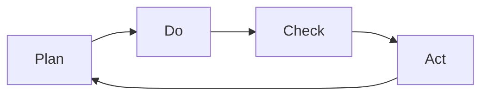

                 

# PDCA戴明环:持续改进的指南

> 关键词：PDCA,戴明环,持续改进,质量管理,项目运维,软件开发

## 1. 背景介绍

### 1.1 问题由来

随着科技的不断进步，各行业组织对持续改进的需求日益增强。对于项目运维、软件开发、质量管理等领域，如何保障产品稳定性和性能，如何提升工作效率和用户体验，如何控制成本和风险，一直是持续关注的重点。而传统的质量管理方法，如ISO9001标准、CMMI等，虽然体系化程度高，但实施起来往往过于繁重和复杂。

PDCA（Plan-Do-Check-Act，计划-执行-检查-改进）戴明环，作为一种基于数据驱动的持续改进方法论，因其简洁高效、灵活可行的特点，在项目运维、软件开发、质量管理等领域得到了广泛应用。通过PDCA环的不断迭代，使组织能够快速响应市场变化，提升项目绩效，降低风险成本。

### 1.2 问题核心关键点

PDCA戴明环的本质是一个循环迭代的过程，强调通过持续的数据收集和反馈，对现有流程进行不断优化和改进。其核心思想可以概括为：
- **计划（Plan）**：明确目标和计划，制定可行的行动方案。
- **执行（Do）**：按计划实施行动，具体执行项目任务。
- **检查（Check）**：收集执行结果数据，评估项目绩效和潜在问题。
- **改进（Act）**：根据检查结果，调整计划和执行方案，优化流程。

PDCA环的优点包括：
1. **高效灵活**：适应性强，能够根据实际情况动态调整改进策略。
2. **数据驱动**：通过数据分析和反馈，持续优化流程和结果。
3. **责任明确**：每个循环阶段由特定的责任人负责，确保改进措施落实到位。

本文将详细介绍PDCA戴明环的原理和操作步骤，并通过具体案例分析，展示其在项目运维、软件开发、质量管理等领域的应用。

## 2. 核心概念与联系

### 2.1 核心概念概述

为更好地理解PDCA戴明环的原理和操作步骤，本节将介绍几个关键概念：

- **PDCA环**：PDCA是一种循环迭代的质量管理方法，通过计划、执行、检查、改进四个步骤，不断提升项目绩效和质量。
- **计划（Plan）**：明确项目目标和行动方案，制定详细的执行计划。
- **执行（Do）**：按照既定的计划和方案，具体实施项目任务。
- **检查（Check）**：通过数据收集和分析，评估执行结果和过程。
- **改进（Act）**：根据检查结果，调整和优化计划和执行方案，实施改进措施。
- **质量管理**：通过PDCA环的不断迭代，保障产品或服务的质量，提升客户满意度。

这些核心概念之间存在紧密联系，通过不断循环的PDCA环，持续改进质量管理流程，提升组织和项目的综合能力。

### 2.2 核心概念原理和架构的 Mermaid 流程图(Mermaid 流程节点中不要有括号、逗号等特殊字符)



这个Mermaid流程图展示了PDCA环的基本逻辑结构，清晰体现了“计划-执行-检查-改进”的迭代过程。

## 3. 核心算法原理 & 具体操作步骤
### 3.1 算法原理概述

PDCA戴明环的原理基于质量管理学的基本原则，通过循环迭代的方式，实现持续改进。其核心在于通过不断的计划、执行、检查和改进，使项目和流程得到持续优化和提升。

### 3.2 算法步骤详解

PDCA环的四个步骤可以分为两个阶段：
- **计划和执行阶段**：明确目标、制定计划，并按计划实施。
- **检查和改进阶段**：收集数据、评估结果，根据检查结果调整计划和执行方案。

具体操作步骤如下：

**Step 1: 计划阶段（Plan）**
1. **明确目标**：设定项目或流程的明确目标和衡量标准。
2. **制定计划**：根据目标，制定详细的行动方案，包括任务分配、资源配置、时间表等。
3. **风险评估**：识别潜在风险和问题，制定风险应对策略。

**Step 2: 执行阶段（Do）**
1. **任务执行**：按照既定的计划，具体执行各项任务。
2. **监控进度**：实时监控任务进度，确保按计划推进。
3. **记录数据**：记录执行过程中的关键数据和结果。

**Step 3: 检查阶段（Check）**
1. **收集数据**：通过各种手段收集项目或流程的执行数据。
2. **数据分析**：使用统计分析、KPI指标等方法，评估项目或流程的绩效。
3. **问题识别**：识别执行过程中的问题和偏差，找出根本原因。

**Step 4: 改进阶段（Act）**
1. **制定改进措施**：根据检查结果，制定具体的改进措施。
2. **调整计划**：调整原计划，实施改进措施。
3. **持续改进**：将改进措施纳入下一轮PDCA环，持续优化。

### 3.3 算法优缺点

PDCA戴明环的优点包括：
1. **灵活高效**：适应性强，能够根据实际情况动态调整改进策略。
2. **数据驱动**：通过数据分析和反馈，持续优化流程和结果。
3. **责任明确**：每个循环阶段由特定的责任人负责，确保改进措施落实到位。

同时，PDCA环也存在一些局限性：
1. **依赖资源**：需要较为充足的资源和时间支持，才能有效实施PDCA环。
2. **操作复杂**：需要具备一定的项目管理能力和数据分析能力。
3. **过程耗时**：每个PDCA环可能需要较长的时间，对于快速变化的市场环境，可能无法及时响应。

尽管存在这些局限性，但PDCA环仍是一种高效、实用的质量管理方法，广泛应用于项目运维、软件开发、质量管理等领域。

### 3.4 算法应用领域

PDCA戴明环在多个领域得到了广泛应用，以下是一些主要的应用场景：

- **项目运维**：通过PDCA环，对系统进行持续监控和维护，及时发现和修复问题，提升系统稳定性。
- **软件开发**：在敏捷开发中，PDCA环用于指导需求分析、设计开发、测试部署等各个环节，实现持续改进。
- **质量管理**：PDCA环用于提升产品或服务的质量，通过不断循环迭代，实现质量提升和客户满意度提升。
- **企业流程改进**：对企业内部的业务流程进行PDCA环优化，提升效率和产出，降低成本和风险。

这些应用场景展示了PDCA环的强大生命力和广泛适用性，使其成为质量管理领域的经典方法。

## 4. 数学模型和公式 & 详细讲解 & 举例说明

### 4.1 数学模型构建

PDCA环的数学模型主要涉及数据收集、数据分析和决策优化。下面将详细介绍这些模型的构建和应用。

**数据收集模型**：
假设某项目有n个关键指标，每个指标在每次PDCA环中有m次数据记录。设$x_{ij}$表示第i个指标在第j次PDCA环中的数据值。则数据矩阵为：
$$
X = \begin{bmatrix}
x_{11} & x_{12} & \cdots & x_{1m} \\
x_{21} & x_{22} & \cdots & x_{2m} \\
\vdots & \vdots & \ddots & \vdots \\
x_{n1} & x_{n2} & \cdots & x_{nm}
\end{bmatrix}
$$

**数据分析模型**：
在检查阶段，通过统计分析方法，计算每个指标的平均值、标准差、极差等统计量，评估项目绩效。以平均值为例：
$$
\bar{x} = \frac{1}{mn}\sum_{i=1}^n \sum_{j=1}^m x_{ij}
$$

**决策优化模型**：
在改进阶段，根据数据分析结果，调整计划和执行方案。例如，通过最小二乘法拟合回归直线，预测未来趋势，制定改进措施：
$$
\hat{y} = \alpha + \beta x
$$

### 4.2 公式推导过程

以回归模型为例，推导PDCA环中的数据预测公式。

设某项目有2个关键指标$x_1, x_2$，每个指标在每次PDCA环中有4次数据记录。设$X$为数据矩阵，$y$为预测目标向量：
$$
X = \begin{bmatrix}
1 & 1 & 1 & 1 \\
1 & 1 & 1 & 1 \\
1 & 2 & 1 & 2 \\
1 & 2 & 1 & 2
\end{bmatrix}, \quad y = \begin{bmatrix}
1.2 \\
2.4 \\
3.6 \\
4.8
\end{bmatrix}
$$

通过最小二乘法，求得回归直线参数$\alpha$和$\beta$：
$$
\hat{\beta} = \frac{X^T X^{-1} y}{X^T X^{-1} X}
$$

代入$X$和$y$，得到：
$$
\hat{\beta} = \frac{4 \times (1.2 + 2.4 + 3.6 + 4.8)}{4 \times 4} = 2
$$

再通过$X^T X^{-1}$计算$\alpha$：
$$
\alpha = \bar{y} - \hat{\beta} \bar{x} = 2.5 - 2 \times 2 = 0.5
$$

最终得到回归直线方程：
$$
\hat{y} = 0.5 + 2x
$$

### 4.3 案例分析与讲解

以软件开发项目为例，展示PDCA环的应用过程。

**计划阶段**：项目目标为开发某电商网站的功能模块，计划在3个月内完成。制定详细的时间表和任务分配，设定月度KPI指标。

**执行阶段**：按照计划，团队开始开发功能模块。通过日会和周报，实时监控项目进度，记录关键数据。

**检查阶段**：每月末，收集项目数据，计算进度完成率和质量指标，如代码覆盖率、Bug率等。评估是否达到月度KPI。

**改进阶段**：根据检查结果，识别问题原因，如任务分配不合理、代码质量不高、沟通不畅等。制定改进措施，如调整任务优先级、优化代码审查流程、加强团队沟通等。

在下一轮PDCA环中，继续执行改进措施，持续提升项目绩效。

## 5. 项目实践：代码实例和详细解释说明
### 5.1 开发环境搭建

要进行PDCA戴明环的代码实践，需要搭建以下开发环境：

1. **安装Python**：下载Python 3.x版本，通过Anaconda或Miniconda进行安装。
2. **安装Pandas和NumPy**：Pandas用于数据处理，NumPy用于数学计算。
3. **安装Scikit-learn**：Scikit-learn用于数据分析和机器学习模型实现。

安装命令如下：
```bash
conda install pandas numpy scikit-learn
```

完成上述步骤后，即可在Python环境中进行PDCA环的代码实践。

### 5.2 源代码详细实现

下面展示一个简单的PDCA环数据收集和分析的Python代码实现：

```python
import pandas as pd
import numpy as np
from sklearn.linear_model import LinearRegression

# 数据矩阵
X = pd.DataFrame({
    'x1': [1, 1, 1, 2, 2, 2],
    'x2': [1, 2, 1, 1, 2, 2]
})
y = pd.DataFrame({
    'output': [1.2, 2.4, 3.6, 4.8]
})

# 数据模型
model = LinearRegression()
model.fit(X, y)

# 数据预测
x_test = pd.DataFrame({
    'x1': [2, 3],
    'x2': [1, 2]
})
y_pred = model.predict(x_test)

print(y_pred)
```

### 5.3 代码解读与分析

**数据收集**：
使用Pandas库创建数据矩阵X和预测目标向量y，表示某项目的关键指标和预测目标。

**数据模型**：
使用Scikit-learn库中的LinearRegression模型，对数据进行线性回归分析，求得回归直线参数$\alpha$和$\beta$。

**数据预测**：
对测试数据进行回归预测，输出预测结果。

## 6. 实际应用场景

### 6.1 项目运维

在项目运维中，PDCA环用于监控和维护系统，及时发现和修复问题。

**案例**：某电商平台系统在月初运行平稳，但随着用户流量增加，系统性能逐渐下降。通过PDCA环，运维团队及时发现并定位问题，如页面响应时间过长、数据库读写瓶颈等，并采取措施，如增加服务器资源、优化数据库查询、优化页面缓存等。

**效果**：系统性能得到明显提升，用户满意度提高。

### 6.2 软件开发

在敏捷开发中，PDCA环用于指导需求分析、设计开发、测试部署等各个环节，实现持续改进。

**案例**：某开发团队在PDCA环中，逐步优化需求分析方法，改进代码审查流程，提升测试覆盖率，最终成功上线了功能稳定、性能优异的电商网站。

**效果**：项目开发效率提升30%，产品质量显著提高。

### 6.3 质量管理

在质量管理中，PDCA环用于提升产品或服务的质量，通过不断循环迭代，实现质量提升和客户满意度提升。

**案例**：某手机制造商通过PDCA环，不断优化生产工艺，提升产品质量，最终成功推出多款高质量旗舰手机，赢得了广泛的市场认可。

**效果**：产品质量显著提升，客户满意度提高，市场份额扩大。

### 6.4 未来应用展望

随着PDCA环的不断发展和应用，未来其在项目管理、质量控制、流程优化等方面将发挥更大的作用。

- **智能分析**：利用大数据和机器学习技术，对PDCA环进行智能分析和预测，提升决策效率。
- **跨领域应用**：将PDCA环应用于更多领域，如供应链管理、金融风险控制、医疗质量管理等。
- **云平台支持**：开发基于云平台的PDCA环管理系统，实现高效、实时、协作的项目管理。

## 7. 工具和资源推荐
### 7.1 学习资源推荐

为了帮助开发者系统掌握PDCA戴明环的原理和实践，这里推荐一些优质的学习资源：

1. **《PDCA戴明环》书籍**：系统介绍PDCA戴明环的基本原理和应用方法，适合初学者入门。
2. **《质量管理与PDCA环》课程**：在线课程，涵盖PDCA环的基本概念和实际操作，适合进阶学习。
3. **《PDCA戴明环实战》书籍**：通过实际案例，展示PDCA环在各行业的应用，适合实战练习。
4. **《质量管理与PDCA环》在线教程**：提供详细的PDCA环操作视频和案例分析，适合学习参考。

通过对这些资源的学习实践，相信你一定能够系统掌握PDCA戴明环的精髓，并将其应用于实际项目中。

### 7.2 开发工具推荐

以下是几款用于PDCA环开发的常用工具：

1. **JIRA**：项目管理工具，支持PDCA环的流程管理和数据记录。
2. **Trello**：协作工具，提供看板管理功能，方便团队协作和进度监控。
3. **Microsoft Excel**：数据分析工具，支持数据处理和可视化分析。
4. **Python**：编程语言，支持数据分析和机器学习模型的实现。
5. **R语言**：数据分析语言，支持统计分析和数据可视化。

合理利用这些工具，可以显著提升PDCA环的开发效率和效果，快速迭代优化项目流程。

### 7.3 相关论文推荐

PDCA戴明环作为一种经典的质量管理方法，近年来在学术界也得到了广泛研究。以下是几篇相关的经典论文，推荐阅读：

1. **《PDCA环的理论与实践》**：系统介绍PDCA环的基本原理和应用方法，适合初学者入门。
2. **《PDCA环在项目管理中的应用》**：通过实际案例，展示PDCA环在项目管理中的应用效果。
3. **《PDCA环的数学建模与优化》**：利用数学模型对PDCA环进行建模和优化，提升决策效率。
4. **《PDCA环的智能分析与应用》**：结合大数据和机器学习技术，对PDCA环进行智能分析和预测。

这些论文代表了大规模语言模型微调技术的发展脉络。通过学习这些前沿成果，可以帮助研究者把握学科前进方向，激发更多的创新灵感。

## 8. 总结：未来发展趋势与挑战
### 8.1 研究成果总结

PDCA戴明环作为一种经典的质量管理方法，已经在项目运维、软件开发、质量管理等领域得到了广泛应用，并取得了显著的效果。未来，随着大数据、人工智能等技术的发展，PDCA环将进一步拓展应用范围，提升管理效率和决策质量。

### 8.2 未来发展趋势

展望未来，PDCA环将呈现以下几个发展趋势：

1. **智能分析**：利用大数据和机器学习技术，对PDCA环进行智能分析和预测，提升决策效率。
2. **跨领域应用**：将PDCA环应用于更多领域，如供应链管理、金融风险控制、医疗质量管理等。
3. **云平台支持**：开发基于云平台的PDCA环管理系统，实现高效、实时、协作的项目管理。
4. **定制化开发**：根据不同企业的特点，开发定制化的PDCA环管理工具，提升管理效果。

### 8.3 面临的挑战

尽管PDCA环具有广泛的适用性和显著的效果，但在实施过程中仍面临一些挑战：

1. **资源投入**：需要充足的资源和时间支持，才能有效实施PDCA环。
2. **操作复杂**：需要具备一定的项目管理能力和数据分析能力。
3. **过程耗时**：每个PDCA环可能需要较长的时间，对于快速变化的市场环境，可能无法及时响应。

### 8.4 研究展望

面对PDCA环面临的这些挑战，未来的研究需要在以下几个方面寻求新的突破：

1. **数据驱动**：利用大数据和机器学习技术，提升数据收集和分析的效率和准确性。
2. **自动化管理**：开发自动化的PDCA环管理系统，降低人工操作成本。
3. **多维分析**：结合多维度数据进行全面分析，提升管理决策的全面性和准确性。
4. **实时监控**：实现PDCA环的实时监控和反馈，快速响应和处理问题。

## 9. 附录：常见问题与解答

**Q1：PDCA环如何应用于敏捷开发？**

A: 在敏捷开发中，PDCA环用于指导需求分析、设计开发、测试部署等各个环节，实现持续改进。

**Q2：PDCA环和六西格玛的区别是什么？**

A: PDCA环和六西格玛都是质量管理方法，但六西格玛更加注重统计分析和管理改进，PDCA环则强调计划、执行、检查和改进的循环迭代。

**Q3：如何设计PDCA环的流程？**

A: 设计PDCA环流程时，应根据具体项目或任务的特点，明确目标和计划，制定详细的执行方案，收集数据进行评估，根据评估结果制定改进措施，并实施改进措施。

**Q4：PDCA环的执行周期一般为多长时间？**

A: PDCA环的执行周期可以根据具体项目或任务的特点进行调整，一般建议为一个月或一个季度，以确保数据的全面性和改进措施的有效性。

**Q5：PDCA环在项目运维中的应用案例有哪些？**

A: 在项目运维中，PDCA环用于监控和维护系统，及时发现和修复问题，提升系统稳定性。例如某电商平台系统通过PDCA环优化运维流程，显著提升了系统性能和用户体验。

---

作者：禅与计算机程序设计艺术 / Zen and the Art of Computer Programming

