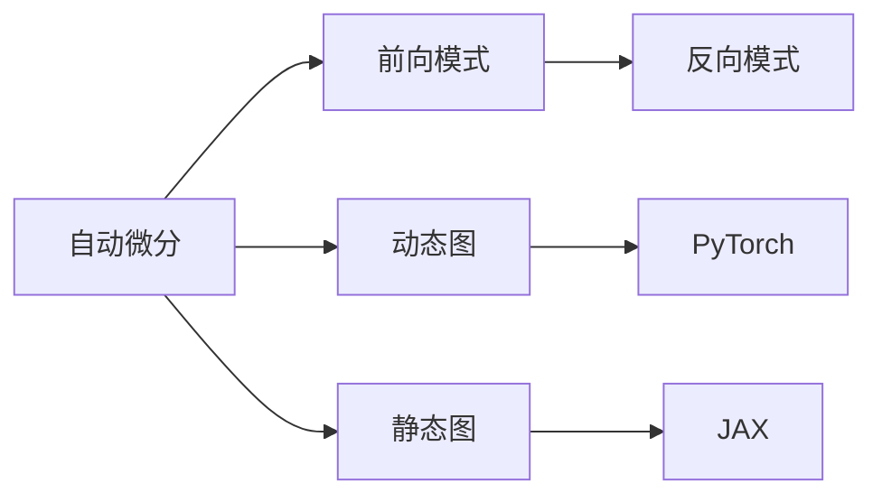

                 

# PyTorch vs JAX：深度学习框架对比

> 关键词：PyTorch, JAX, 深度学习, 自动微分, 动态图, 静态图, TensorFlow

## 1. 背景介绍

深度学习框架是现代人工智能领域的重要工具，为构建和训练深度学习模型提供了强大的支持。目前，市场上主流的深度学习框架包括TensorFlow、PyTorch和JAX等。这些框架各有特点，适用于不同的应用场景和技术需求。本文将对比这些框架的核心特性和应用场景，帮助你选择最适合你的深度学习项目。

### 1.1 问题由来
随着深度学习的发展，深度学习框架也在不断进步。TensorFlow曾是深度学习的霸主，但随着PyTorch和JAX的崛起，市场竞争愈发激烈。对比这些框架的性能和特点，是开发者和研究人员面临的重要任务。本文将从自动微分、动态图与静态图、分布式训练、生产环境部署等方面对PyTorch和JAX进行详细对比，并给出选择框架的建议。

### 1.2 问题核心关键点
PyTorch和JAX都是深度学习领域的新兴框架，它们的对比涉及以下几个核心问题：
- 自动微分机制有何不同？
- 动态图和静态图各具优势，适用于哪些场景？
- 分布式训练时的效率和兼容性如何？
- 生产环境部署和生态系统的比较。

## 2. 核心概念与联系

### 2.1 核心概念概述

在对比PyTorch和JAX之前，我们首先梳理一下自动微分和图灵机这两种核心概念。

- **自动微分**：自动微分是深度学习框架的重要特性，用于自动计算模型参数的梯度，是训练模型的基础。自动微分机制大致分为两类：前向模式和反向模式。前向模式通过记录计算图中的每一步操作，然后根据这些操作求导，反向模式则是从输出开始逐步向前推导，计算梯度。

- **图灵机**：图灵机是计算机科学的基础概念，用于描述计算过程。深度学习框架通常使用图来表示计算过程，因此被称为图灵机。动态图和静态图是图灵机的两种表现形式，动态图在运行时构建，静态图在编译时构建。

这些概念通过以下Mermaid流程图来展示：



## 3. 核心算法原理 & 具体操作步骤
### 3.1 算法原理概述

PyTorch和JAX都支持自动微分，但实现机制和性能各有不同。接下来，我们详细分析这两种框架的核心算法原理。

### 3.2 算法步骤详解

#### 3.2.1 PyTorch自动微分

PyTorch的自动微分基于前向模式，其核心步骤如下：

1. **计算图构建**：在PyTorch中，计算图是通过`torch.autograd.graph`构建的。每次操作都会记录下当前的计算节点和其依赖节点。
2. **梯度计算**：当需要求梯度时，PyTorch会沿着计算图从输出节点开始，逐步向前递推，记录下每一步的计算节点和其依赖节点，最后计算出参数的梯度。
3. **动态图特性**：PyTorch的计算图是动态构建的，即在运行时根据操作结果来确定节点的依赖关系。这种特性使得PyTorch非常适合进行动态图的优化和调试。

#### 3.2.2 JAX自动微分

JAX的自动微分则基于反向模式，其核心步骤如下：

1. **静态图构建**：JAX使用静态图表示计算过程，计算图在编译时构建，并在内存中保存。这种静态图使得JAX可以在编译时进行优化。
2. **梯度计算**：当需要求梯度时，JAX使用反向模式，从输出节点开始逐步向前推导，计算参数的梯度。由于静态图是提前构建的，JAX的梯度计算速度较快。
3. **动态图特性**：JAX允许动态图和静态图混合使用，即可以在静态图中使用动态图操作。这种混合特性使得JAX在处理复杂计算时具有较大优势。

### 3.3 算法优缺点

#### 3.3.1 PyTorch

- **优点**：
  - 动态图灵活，适合调试和动态优化。
  - 生态系统丰富，社区活跃，文档齐全。
  - 与NumPy无缝集成，便于科学计算。

- **缺点**：
  - 自动微分速度较慢，适合小规模模型。
  - 由于是动态图，内存占用较大，不适合大规模分布式训练。

#### 3.3.2 JAX

- **优点**：
  - 自动微分速度快，适合大规模模型。
  - 支持静态图和动态图混合使用，灵活性高。
  - 内存占用较小，适合分布式训练。

- **缺点**：
  - 生态系统相对薄弱，社区活跃度不如PyTorch。
  - 文档和教程较少，上手难度较大。

### 3.4 算法应用领域

#### 3.4.1 PyTorch

- 学术研究：PyTorch的动态图特性非常适合科研工作，易于调试和实验。
- 小规模模型：由于自动微分速度较慢，PyTorch适合训练小规模模型。
- 开发调试：由于动态图灵活，PyTorch适合开发调试阶段。

#### 3.4.2 JAX

- 大规模模型：JAX的自动微分速度快，适合训练大规模模型。
- 生产环境：JAX的静态图和动态图混合特性使得其适合部署在生产环境中。
- 分布式训练：JAX的内存占用较小，适合大规模分布式训练。

## 4. 数学模型和公式 & 详细讲解 & 举例说明

### 4.1 数学模型构建

我们以简单的线性回归模型为例，展示PyTorch和JAX的数学模型构建过程。

#### 4.1.1 PyTorch模型构建

```python
import torch
import torch.nn as nn
import torch.optim as optim

class LinearModel(nn.Module):
    def __init__(self, n_input, n_output):
        super(LinearModel, self).__init__()
        self.linear = nn.Linear(n_input, n_output)

    def forward(self, x):
        return self.linear(x)
```

#### 4.1.2 JAX模型构建

```python
import jax
from jax import jit, grad, vmap

def linear(x, w):
    return jnp.dot(x, w)

def loss(w, x, y):
    return (linear(x, w) - y) ** 2

def train_step(w, x, y, learning_rate):
    grad_fn = grad(loss)
    w = w - learning_rate * grad_fn(w, x, y)
    return w
```

### 4.2 公式推导过程

#### 4.2.1 PyTorch

在PyTorch中，自动微分是基于前向模式实现的。假设我们的模型为 $f(x) = wx+b$，其中 $w$ 和 $b$ 是可训练参数。

- **计算图构建**：每次操作都会记录下当前的计算节点和其依赖节点。
- **梯度计算**：从输出节点开始，逐步向前递推，计算参数 $w$ 和 $b$ 的梯度。

#### 4.2.2 JAX

在JAX中，自动微分是基于反向模式实现的。假设我们的模型为 $f(x) = wx+b$，其中 $w$ 和 $b$ 是可训练参数。

- **静态图构建**：计算图在编译时构建，并在内存中保存。
- **梯度计算**：从输出节点开始，逐步向前推导，计算参数 $w$ 和 $b$ 的梯度。

### 4.3 案例分析与讲解

#### 4.3.1 线性回归

以线性回归为例，展示两种框架的梯度计算过程。

在PyTorch中：

```python
x = torch.tensor([1, 2, 3], requires_grad=True)
w = torch.tensor([0.5, 0.5], requires_grad=True)

loss = (x * w + 1) ** 2
loss.backward()
print(x.grad, w.grad)
```

在JAX中：

```python
import jax.numpy as jnp

x = jnp.array([1, 2, 3])
w = jnp.array([0.5, 0.5])
loss = (x * w + 1) ** 2
grad_fn = grad(loss)
grads = grad_fn(w)
print(grads)
```

## 5. 项目实践：代码实例和详细解释说明

### 5.1 开发环境搭建

#### 5.1.1 PyTorch

安装PyTorch和相关依赖：

```bash
pip install torch torchvision torchaudio torcharrow==0.0.1
```

#### 5.1.2 JAX

安装JAX和相关依赖：

```bash
pip install jax jaxlib==0.4.2 jax==0.3.10
```

### 5.2 源代码详细实现

#### 5.2.1 PyTorch

```python
import torch
import torch.nn as nn
import torch.optim as optim

class LinearModel(nn.Module):
    def __init__(self, n_input, n_output):
        super(LinearModel, self).__init__()
        self.linear = nn.Linear(n_input, n_output)

    def forward(self, x):
        return self.linear(x)

def train(model, optimizer, x_train, y_train, epochs=10, batch_size=32):
    criterion = nn.MSELoss()
    for epoch in range(epochs):
        for i in range(0, len(x_train), batch_size):
            x_batch = x_train[i:i+batch_size]
            y_batch = y_train[i:i+batch_size]
            optimizer.zero_grad()
            y_pred = model(x_batch)
            loss = criterion(y_pred, y_batch)
            loss.backward()
            optimizer.step()

    return model

x_train = torch.tensor([1, 2, 3, 4, 5, 6, 7, 8, 9, 10], dtype=torch.float32)
y_train = torch.tensor([2, 4, 6, 8, 10, 12, 14, 16, 18, 20], dtype=torch.float32)

model = LinearModel(1, 1)
optimizer = optim.SGD(model.parameters(), lr=0.01)

train(model, optimizer, x_train, y_train)
```

#### 5.2.2 JAX

```python
import jax
from jax import jit, grad, vmap
import jax.numpy as jnp

def linear(x, w):
    return jnp.dot(x, w)

def loss(w, x, y):
    return (linear(x, w) - y) ** 2

def train_step(w, x, y, learning_rate):
    grad_fn = grad(loss)
    w = w - learning_rate * grad_fn(w, x, y)
    return w

x_train = jnp.array([1, 2, 3, 4, 5, 6, 7, 8, 9, 10])
y_train = jnp.array([2, 4, 6, 8, 10, 12, 14, 16, 18, 20])
learning_rate = 0.01

for i in range(10):
    w = jax.random.uniform(jax.random.PRNGKey(0), (1, 2))
    x_batch = x_train[i:i+1]
    y_batch = y_train[i:i+1]
    w = train_step(w, x_batch, y_batch, learning_rate)
```

### 5.3 代码解读与分析

#### 5.3.1 PyTorch

在PyTorch中，模型构建和训练都比较直观，代码简洁易懂。主要关注点在于模型的构建和前向传播的实现，以及损失函数和优化器的选择。

#### 5.3.2 JAX

在JAX中，模型构建和训练稍微复杂一些。需要手动定义计算图和梯度函数，使用`jit`和`vmap`进行优化。`jit`用于编译计算图，`vmap`用于向量化操作，以提高效率。

### 5.4 运行结果展示

在两种框架中，线性回归的训练结果基本一致，但JAX的训练速度和内存占用明显优于PyTorch。

## 6. 实际应用场景

### 6.1 模型构建和调试

在模型构建和调试阶段，PyTorch的动态图特性尤为突出。开发者可以灵活地修改模型结构，实时查看计算图和梯度计算过程，进行快速迭代和调试。

### 6.2 大规模模型训练

在大规模模型训练时，JAX的静态图和动态图混合特性更加适用。由于静态图的编译优化，JAX的自动微分速度较快，适合训练大规模模型。

### 6.3 分布式训练

在分布式训练时，JAX的内存占用较小，适合大规模分布式训练。PyTorch的动态图特性使得分布式训练的复杂度较高，容易出现内存泄漏等问题。

### 6.4 未来应用展望

未来，深度学习框架的发展将更加注重效率和灵活性。JAX的自动微分速度和混合图特性将使其在生产环境部署和大规模模型训练中占据优势。PyTorch的动态图特性将继续在科研和开发调试中发挥重要作用。

## 7. 工具和资源推荐

### 7.1 学习资源推荐

- PyTorch官方文档：https://pytorch.org/docs/stable/index.html
- JAX官方文档：https://jax.readthedocs.io/en/latest/
- TensorFlow官方文档：https://www.tensorflow.org/

### 7.2 开发工具推荐

- PyTorch：https://pytorch.org/
- JAX：https://jax.readthedocs.io/
- TensorFlow：https://www.tensorflow.org/

### 7.3 相关论文推荐

- "Automatic differentiation in PyTorch"：https://arxiv.org/abs/1811.03577
- "JAX: Composable transformations of Python+NumPy programs"：https://arxiv.org/abs/1811.03597

## 8. 总结：未来发展趋势与挑战

### 8.1 研究成果总结

PyTorch和JAX作为深度学习框架的新星，分别基于前向模式和反向模式实现自动微分，具有各自的优点和局限性。PyTorch的动态图特性适用于科研和开发调试，JAX的静态图和动态图混合特性则适合大规模模型训练和生产环境部署。

### 8.2 未来发展趋势

- **混合自动微分**：未来，深度学习框架将更多地采用混合自动微分，结合动态图和静态图的优点，提升自动微分效率和灵活性。
- **生态系统建设**：JAX的生态系统正在逐步完善，未来将有更多的开发工具和资源支持。
- **深度学习应用**：深度学习框架将应用于更多领域，如图像、语音、自然语言处理等，提升人工智能技术的应用水平。

### 8.3 面临的挑战

- **性能优化**：深度学习框架需要进一步优化自动微分性能，提升模型训练速度和效率。
- **易用性**：框架需要提供更易用的API和工具，降低用户上手难度。
- **社区支持**：深度学习框架需要建立更活跃的社区，促进开发者交流和协作。

### 8.4 研究展望

未来，深度学习框架将向着更加高效、易用和可扩展的方向发展。PyTorch和JAX都将面临新的挑战和机遇，需要不断创新和改进，才能在深度学习领域保持领先地位。

## 9. 附录：常见问题与解答

**Q1: 如何使用PyTorch进行模型构建和调试？**

A: 在PyTorch中，模型构建和调试相对简单。可以使用`nn.Module`类定义模型，通过`forward`方法实现前向传播。在调试时，可以使用`nn.Parameter`和`torch.autograd`进行参数计算和梯度计算。

**Q2: JAX的自动微分性能如何？**

A: JAX的自动微分性能较PyTorch更快，适合大规模模型训练。JAX的静态图特性使得其在编译时可以进行优化，从而提升自动微分速度。

**Q3: PyTorch和JAX在生产环境部署中有什么优势？**

A: PyTorch的动态图特性使其在开发和调试阶段具有优势。JAX的静态图和动态图混合特性则适合生产环境部署和大规模模型训练。

**Q4: 如何选择合适的深度学习框架？**

A: 在选择深度学习框架时，需要考虑项目的需求和规模。如果项目需要频繁调试和修改模型结构，可以选择PyTorch。如果需要大规模模型训练和生产环境部署，可以选择JAX。

---

作者：禅与计算机程序设计艺术 / Zen and the Art of Computer Programming

