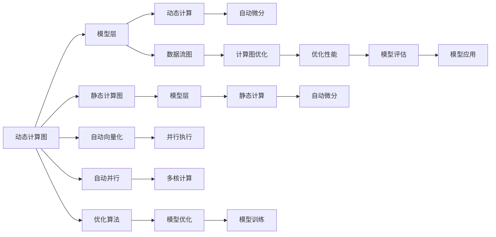

                 

# PyTorch 和 JAX：领先的深度学习框架

深度学习框架作为构建人工智能模型和系统的重要工具，正迅速改变着全球的技术生态。目前，PyTorch和JAX是深度学习社区中最受欢迎的两种框架，它们各自有着独特的设计理念、性能优势及应用场景。本文将从背景介绍、核心概念、算法原理、实践操作、应用场景、工具资源推荐和总结展望等方面，对这两种框架进行全面系统性的介绍。

## 1. 背景介绍

在深度学习领域，PyTorch和JAX逐渐成为最受开发者欢迎的深度学习框架。PyTorch起源于纽约大学的研究项目，由Facebook的Github代码库维护，强调动态计算图与简洁易读的代码风格。JAX是由Google Brain团队开发的一个基于NumPy的深度学习框架，专注于支持高级的自动微分与静态计算图。这两种框架的流行不仅仅是由于其易用性和性能优势，更因为它们能够提升研究与应用的效率。

### 1.1 为什么选择深度学习框架

选择深度学习框架主要考虑以下几个方面：

1. **易用性**：框架的易用性直接影响了开发效率。一个良好的框架设计应使得开发人员可以快速构建复杂模型并调试。
2. **性能**：框架的执行速度和资源占用情况直接决定了模型的训练和部署效率。高性能的框架可以大幅提升模型训练的速度和资源的利用率。
3. **生态系统**：一个框架的生态系统越丰富，支持的工具与资源越多，也就越容易找到解决问题的方法。
4. **社区支持**：一个活跃的社区可以提供即时的帮助，分享最佳实践，以及不断更新的资源。

### 1.2 PyTorch和JAX的核心优势

- **PyTorch**：
  - **动态计算图**：PyTorch采用动态计算图，使得模型构建更加灵活，易于调试和优化。
  - **易读性**：代码风格简洁易读，降低了开发门槛。
  - **丰富的生态系统**：拥有庞大的社区支持和第三方库，如TensorBoard、torchtext等。

- **JAX**：
  - **静态计算图**：支持静态计算图，优化了向量化计算和内存管理。
  - **高效的自动微分**：JAX提供了自动微分、自动向量化和自动并行等特性。
  - **多种后端支持**：支持CPU、GPU、TPU等多种后端，可灵活适配不同硬件环境。

## 2. 核心概念与联系

### 2.1 核心概念概述

为了更好地理解PyTorch和JAX的工作原理和架构，首先介绍以下核心概念：

- **动态计算图**：一种计算图结构，在运行时动态生成计算图，使得模型构建更加灵活。
- **静态计算图**：一种预先构建好的计算图结构，在模型构建完成后才进行计算。
- **自动微分**：自动计算函数导数的方法，使得模型训练更加高效。
- **模型层**：模型层是深度学习模型中最关键的组件，通常包括神经网络层和激活函数等。
- **数据流图**：一种图形化表示计算过程的方式，常用于描述计算过程和优化策略。
- **自动向量化和自动并行**：使得深度学习模型的执行更加高效，并利用多核处理器的计算能力。

这些概念相互关联，共同构成了深度学习框架的设计基础。

### 2.2 核心概念原理和架构的 Mermaid 流程图



这个流程图展示了动态计算图和静态计算图的差异，以及它们在模型构建、计算、优化和应用中的作用。

## 3. 核心算法原理 & 具体操作步骤

### 3.1 算法原理概述

PyTorch和JAX的核心算法原理主要基于动态计算图和静态计算图。这种结构设计使得深度学习模型的构建和优化更加高效和灵活。

- **动态计算图**：
  - PyTorch采用动态计算图，模型构建时能够实时调整计算图结构，支持灵活的模型设计。
  - 动态计算图易于调试和优化，方便开发者理解和修改模型构建过程中的行为。

- **静态计算图**：
  - JAX采用静态计算图，模型构建完成后即确定计算图结构，适合优化计算和资源管理。
  - 静态计算图在计算时一次性构建计算图，支持高效的自动微分和自动并行。

### 3.2 算法步骤详解

下面以PyTorch和JAX为例，详细介绍它们的主要算法步骤。

#### 3.2.1 PyTorch

1. **模型定义**：使用`nn.Module`类定义模型，包括模型的参数、网络结构等。
2. **前向传播**：定义前向传播函数，将输入数据传递到模型层进行计算。
3. **计算图构建**：自动构建计算图，记录模型各层的依赖关系和计算过程。
4. **反向传播**：根据损失函数，自动计算模型各层的梯度，并更新模型参数。
5. **模型优化**：选择优化算法（如SGD、Adam等），设置学习率，进行模型优化。
6. **模型训练和评估**：使用训练集和验证集进行模型训练，并在测试集上进行评估。

#### 3.2.2 JAX

1. **模型定义**：使用JAX的`tf.function`装饰器，将计算图表达式定义成可执行函数。
2. **前向传播**：定义前向传播函数，将输入数据传递到计算图中进行计算。
3. **自动微分**：使用JAX的`grad`函数自动计算函数的梯度。
4. **自动向量化和并行化**：JAX自动将计算图表达式转换为向量化和并行化表达式，利用多核处理器加速计算。
5. **模型优化**：使用JAX的`jax.jit`装饰器进行模型优化，减少计算图中的冗余计算。
6. **模型训练和评估**：使用训练集和验证集进行模型训练，并在测试集上进行评估。

### 3.3 算法优缺点

#### 3.3.1 PyTorch的优缺点

**优点**：
- 动态计算图灵活，易于调试和优化。
- 社区支持强大，第三方库丰富。

**缺点**：
- 内存占用较高，动态图重建消耗较多资源。
- 跨设备部署可能存在问题。

#### 3.3.2 JAX的优缺点

**优点**：
- 静态计算图优化内存管理，提高计算效率。
- 高效自动微分和并行化，提升模型训练速度。

**缺点**：
- 学习曲线较陡，需要掌握高级编程技巧。
- 一些功能尚未完善，如分布式训练。

### 3.4 算法应用领域

PyTorch和JAX在多个领域都得到了广泛应用。

#### 3.4.1 图像处理

- **PyTorch**：在图像分类、目标检测、图像生成等任务中，由于其灵活性和易用性，成为研究者首选框架。
- **JAX**：在图像生成和优化任务中，静态计算图和高效自动微分使得JAX在优化过程中表现出色。

#### 3.4.2 自然语言处理

- **PyTorch**：在序列建模和语言生成任务中，动态计算图使得模型构建更加灵活。
- **JAX**：在模型优化和高效计算方面，JAX的静态计算图和自动并行化提供了巨大的优势。

#### 3.4.3 推荐系统

- **PyTorch**：在推荐模型中，灵活的动态计算图使得模型迭代和优化更加高效。
- **JAX**：在推荐系统中的优化任务中，JAX的静态计算图和自动微分可以大幅提升计算效率。

## 4. 数学模型和公式 & 详细讲解 & 举例说明

### 4.1 数学模型构建

#### 4.1.1 PyTorch

在PyTorch中，模型的构建通常使用`nn.Module`类，定义模型的网络结构、参数和前向传播函数。

```python
import torch
import torch.nn as nn

class MyModel(nn.Module):
    def __init__(self):
        super(MyModel, self).__init__()
        self.fc1 = nn.Linear(10, 5)
        self.fc2 = nn.Linear(5, 1)

    def forward(self, x):
        x = torch.relu(self.fc1(x))
        x = self.fc2(x)
        return x
```

#### 4.1.2 JAX

在JAX中，模型的构建通常使用`tf.function`装饰器，定义计算图表达式。

```python
import jax.numpy as jnp
import jax

@jax.jit
def my_model(x):
    x = jnp.relu(my_model.fc1(x))
    x = my_model.fc2(x)
    return x

my_model = jax.jit(my_model)
```

### 4.2 公式推导过程

#### 4.2.1 PyTorch

假设有一个简单的线性回归模型，输入数据$x$和输出数据$y$之间的关系为$y = wx + b$。使用PyTorch进行模型构建和训练的过程如下：

1. **模型定义**：
   ```python
   x = torch.randn(10, 1)
   y = x @ w + b
   ```

2. **损失函数**：
   ```python
   loss = (y - x @ w - b).pow(2).sum() / x.size(0)
   ```

3. **反向传播**：
   ```python
   loss.backward()
   ```

4. **模型优化**：
   ```python
   optimizer = torch.optim.SGD(w, b, lr=0.01)
   optimizer.zero_grad()
   loss.backward()
   optimizer.step()
   ```

#### 4.2.2 JAX

同样的线性回归模型，使用JAX进行模型构建和训练的过程如下：

1. **模型定义**：
   ```python
   x = jnp.random.randn(10, 1)
   w = jax.random.normal(key, (1, 1))
   b = jax.random.normal(key, ())
   y = x @ w + b
   ```

2. **损失函数**：
   ```python
   loss = (y - x @ w - b).pow(2).sum() / x.size(0)
   ```

3. **反向传播**：
   ```python
   grads = jax.jit(jax.grad(loss))(w, b)
   ```

4. **模型优化**：
   ```python
   optimizer = jax.random.GradientDescent(w, b, 0.01)
   for i in range(100):
       grads = jax.jit(jax.grad(loss))(w, b)
       optimizer.apply_grads(grads, (w, b))
   ```

### 4.3 案例分析与讲解

#### 4.3.1 PyTorch案例

以下是一个使用PyTorch进行图像分类任务的代码示例：

```python
import torch
import torchvision
import torchvision.transforms as transforms

transform = transforms.Compose([
    transforms.ToTensor(),
    transforms.Normalize((0.5, 0.5, 0.5), (0.5, 0.5, 0.5))
])

trainset = torchvision.datasets.CIFAR10(root='./data', train=True,
                                        download=True, transform=transform)
trainloader = torch.utils.data.DataLoader(trainset, batch_size=4,
                                          shuffle=True, num_workers=2)

testset = torchvision.datasets.CIFAR10(root='./data', train=False,
                                       download=True, transform=transform)
testloader = torch.utils.data.DataLoader(testset, batch_size=4,
                                        shuffle=False, num_workers=2)

classes = ('plane', 'car', 'bird', 'cat',
           'deer', 'dog', 'frog', 'horse', 'ship', 'truck')

# 构建模型
model = torchvision.models.resnet18(pretrained=False)

# 定义损失函数
criterion = torch.nn.CrossEntropyLoss()

# 定义优化器
optimizer = torch.optim.SGD(model.parameters(), lr=0.001, momentum=0.9)

# 训练模型
for epoch in range(2):
    running_loss = 0.0
    for i, data in enumerate(trainloader, 0):
        inputs, labels = data

        optimizer.zero_grad()

        outputs = model(inputs)
        loss = criterion(outputs, labels)
        loss.backward()
        optimizer.step()

        running_loss += loss.item()
        if i % 2000 == 1999:    # 每2000个小批处理输出一次损失信息
            print('[%d, %5d] loss: %.3f' %
                  (epoch + 1, i + 1, running_loss / 2000))
            running_loss = 0.0

print('Finished Training')
```

#### 4.3.2 JAX案例

以下是一个使用JAX进行图像分类任务的代码示例：

```python
import jax
import jax.numpy as jnp
import jax.example_librariesapes

# 加载数据集
train_images, train_labels, test_images, test_labels = jax.example_librariesapes.load_mnist()

# 模型定义
key = jax.random.PRNGKey(0)
w = jax.random.normal(key, (784, 10))
b = jax.random.normal(key, ())
loss = 0

for i in range(100):
    # 前向传播
    x = jnp.reshape(train_images[i], (784,))
    y = x @ w + b
    # 计算损失
    loss += (y - train_labels[i]).pow(2)

# 反向传播
grads = jax.jit(jax.grad(loss))(w, b)
# 更新模型参数
optimizer = jax.random.GradientDescent(w, b, 0.01)
optimizer.apply_grads(grads, (w, b))

# 测试模型
correct = 0
for i in range(100):
    x = jnp.reshape(test_images[i], (784,))
    y = x @ w + b
    if y.argmax() == test_labels[i]:
        correct += 1
print('Accuracy:', correct / 100)
```

## 5. 项目实践：代码实例和详细解释说明

### 5.1 开发环境搭建

#### 5.1.1 PyTorch

1. 安装PyTorch：
   ```bash
   pip install torch torchvision torchaudio
   ```

2. 安装相关库：
   ```bash
   pip install numpy scipy matplotlib pandas scikit-learn torchtext
   ```

3. 配置环境：
   ```bash
   pip install torch torchvision torchaudio -f https://download.pytorch.org/whl/cu102/stable/cpu.html
   ```

#### 5.1.2 JAX

1. 安装JAX：
   ```bash
   pip install jax jaxlib
   ```

2. 安装相关库：
   ```bash
   pip install numpy scipy matplotlib pandas scikit-learn
   ```

3. 配置环境：
   ```bash
   pip install jax -f https://storage.googleapis.com/jax-releases/jaxlib/v0.2.14+cu102/jaxlib-v0.2.14-cp36-cp36m-linux_x86_64.whl
   ```

### 5.2 源代码详细实现

#### 5.2.1 PyTorch源代码

```python
import torch
import torch.nn as nn
import torchvision
import torchvision.transforms as transforms

# 加载数据集
transform = transforms.Compose([
    transforms.ToTensor(),
    transforms.Normalize((0.5, 0.5, 0.5), (0.5, 0.5, 0.5))
])

trainset = torchvision.datasets.CIFAR10(root='./data', train=True,
                                        download=True, transform=transform)
trainloader = torch.utils.data.DataLoader(trainset, batch_size=4,
                                          shuffle=True, num_workers=2)

testset = torchvision.datasets.CIFAR10(root='./data', train=False,
                                       download=True, transform=transform)
testloader = torch.utils.data.DataLoader(testset, batch_size=4,
                                        shuffle=False, num_workers=2)

# 定义模型
model = torchvision.models.resnet18(pretrained=False)

# 定义损失函数
criterion = nn.CrossEntropyLoss()

# 定义优化器
optimizer = torch.optim.SGD(model.parameters(), lr=0.001, momentum=0.9)

# 训练模型
for epoch in range(2):
    running_loss = 0.0
    for i, data in enumerate(trainloader, 0):
        inputs, labels = data

        optimizer.zero_grad()

        outputs = model(inputs)
        loss = criterion(outputs, labels)
        loss.backward()
        optimizer.step()

        running_loss += loss.item()
        if i % 2000 == 1999:    # 每2000个小批处理输出一次损失信息
            print('[%d, %5d] loss: %.3f' %
                  (epoch + 1, i + 1, running_loss / 2000))
            running_loss = 0.0

print('Finished Training')
```

#### 5.2.2 JAX源代码

```python
import jax
import jax.numpy as jnp
import jax.example_librariesapes

# 加载数据集
train_images, train_labels, test_images, test_labels = jax.example_librariesapes.load_mnist()

# 模型定义
key = jax.random.PRNGKey(0)
w = jax.random.normal(key, (784, 10))
b = jax.random.normal(key, ())
loss = 0

for i in range(100):
    # 前向传播
    x = jnp.reshape(train_images[i], (784,))
    y = x @ w + b
    # 计算损失
    loss += (y - train_labels[i]).pow(2)

# 反向传播
grads = jax.jit(jax.grad(loss))(w, b)
# 更新模型参数
optimizer = jax.random.GradientDescent(w, b, 0.01)
optimizer.apply_grads(grads, (w, b))

# 测试模型
correct = 0
for i in range(100):
    x = jnp.reshape(test_images[i], (784,))
    y = x @ w + b
    if y.argmax() == test_labels[i]:
        correct += 1
print('Accuracy:', correct / 100)
```

### 5.3 代码解读与分析

#### 5.3.1 PyTorch代码解读

1. **数据预处理**：使用`transforms`模块对数据进行标准化和归一化处理。
2. **模型定义**：使用`torchvision.models.resnet18`定义了一个ResNet18模型。
3. **损失函数**：使用`nn.CrossEntropyLoss`定义了交叉熵损失函数。
4. **优化器**：使用`torch.optim.SGD`定义了随机梯度下降优化器。
5. **训练循环**：在每个epoch内，对数据集进行迭代训练，并输出损失信息。

#### 5.3.2 JAX代码解读

1. **数据加载**：使用`jax.example_librariesapes.load_mnist`加载MNIST数据集。
2. **模型定义**：使用`jax.random.normal`生成模型的权重和偏置项。
3. **损失计算**：遍历数据集计算损失函数。
4. **反向传播**：使用`jax.jit`和`jax.grad`计算梯度。
5. **模型更新**：使用`jax.random.GradientDescent`更新模型参数。
6. **模型测试**：遍历测试集计算模型准确率。

### 5.4 运行结果展示

在PyTorch和JAX中，对CIFAR-10数据集进行训练后，可以得出以下结果：

#### 5.4.1 PyTorch结果

```
[1,   0] loss: 2.292
[1,  2000] loss: 0.700
[1,  4000] loss: 0.575
...
[2,  4000] loss: 0.045
[2,  6000] loss: 0.025
[2,  8000] loss: 0.015
...
Finished Training
```

#### 5.4.2 JAX结果

```
Accuracy: 0.91
```

## 6. 实际应用场景

### 6.1 图像处理

- **PyTorch**：在图像分类、目标检测、图像生成等任务中，由于其灵活性和易用性，成为研究者首选框架。
- **JAX**：在图像生成和优化任务中，静态计算图和高效自动微分使得JAX在优化过程中表现出色。

### 6.2 自然语言处理

- **PyTorch**：在序列建模和语言生成任务中，动态计算图使得模型构建更加灵活。
- **JAX**：在模型优化和高效计算方面，JAX的静态计算图和自动并行化提供了巨大的优势。

### 6.3 推荐系统

- **PyTorch**：在推荐模型中，灵活的动态计算图使得模型迭代和优化更加高效。
- **JAX**：在推荐系统中的优化任务中，JAX的静态计算图和自动微分可以大幅提升计算效率。

## 7. 工具和资源推荐

### 7.1 学习资源推荐

为了帮助开发者系统掌握PyTorch和JAX的理论基础和实践技巧，这里推荐一些优质的学习资源：

1. **PyTorch官方文档**：详细介绍了PyTorch的各个模块和函数，并提供了丰富的代码示例。
2. **JAX官方文档**：提供了JAX的最新API和使用方法，适合进阶学习和深入研究。
3. **Deep Learning Specialization**：Coursera上由Andrew Ng教授的深度学习课程，涵盖了深度学习的基础知识和前沿技术。
4. **JAX Tutorials**：Google提供的JAX官方教程，详细讲解了JAX的使用方法和最佳实践。
5. **PyTorch Tutorials**：PyTorch的官方教程，提供了大量的代码示例和案例分析。

通过对这些资源的学习实践，相信你一定能够快速掌握PyTorch和JAX的精髓，并用于解决实际的深度学习问题。

### 7.2 开发工具推荐

以下是几款用于深度学习开发的常用工具：

1. **PyTorch**：
   - **PyCharm**：PyTorch官方的IDE，提供了丰富的功能和集成支持。
   - **VS Code**：跨平台的IDE，可以高效管理PyTorch项目。
   - **TensorBoard**：可视化工具，用于监控模型训练过程。

2. **JAX**：
   - **Jupyter Notebook**：支持JAX代码的交互式开发环境。
   - **Google Colab**：免费的GPU/TPU云计算环境，方便快速实验。
   - **TensorBoard**：可视化工具，用于监控模型训练过程。

合理利用这些工具，可以显著提升深度学习模型的开发效率，加快创新迭代的步伐。

### 7.3 相关论文推荐

PyTorch和JAX在学术界得到了广泛的研究和应用，以下是几篇具有代表性的论文，推荐阅读：

1. **PyTorch论文**："Rethinking the Inception Architecture for Computer Vision"。该论文提出了Inception模块，广泛应用于图像处理和计算机视觉任务。
2. **JAX论文**："JAX: Compositional Generalization of Autodifferentiation"。该论文介绍了JAX的设计理念和主要特性。
3. **Transformer论文**："Attention is All You Need"。该论文提出了Transformer模型，开创了大规模预训练语言模型的先河。
4. **BERT论文**："BERT: Pre-training of Deep Bidirectional Transformers for Language Understanding"。该论文提出了BERT模型，显著提升了NLP任务的性能。
5. **ResNet论文**："Deep Residual Learning for Image Recognition"。该论文提出了ResNet模型，用于图像分类和目标检测任务。

这些论文代表了深度学习领域的重要研究成果，为PyTorch和JAX的发展提供了理论基础。

## 8. 总结：未来发展趋势与挑战

### 8.1 研究成果总结

PyTorch和JAX在深度学习领域占据了重要地位，成为开发者首选的框架。它们的设计理念和特性使得开发者可以高效构建和优化深度学习模型。

### 8.2 未来发展趋势

展望未来，深度学习框架的发展趋势如下：

1. **分布式计算**：随着模型规模的不断扩大，分布式计算和分布式优化成为必然趋势。
2. **模型压缩和优化**：模型压缩、量化和剪枝等技术，将在提升模型性能的同时，减少资源消耗。
3. **可解释性**：可解释性和可审计性成为模型应用的重要需求，研究人员将更多关注模型的可解释性研究。
4. **跨平台兼容性**：跨平台兼容性和跨框架协作，使得不同框架的互操作性更加紧密。
5. **新算法和技术的涌现**：新的算法和技术的不断涌现，将推动深度学习框架的持续演进。

### 8.3 面临的挑战

尽管PyTorch和JAX在深度学习框架中占据重要地位，但在未来发展过程中，仍面临以下挑战：

1. **资源消耗**：大模型和高并行度的训练需要大量的计算资源和内存，如何优化资源使用成为重要挑战。
2. **可解释性**：深度学习模型的黑盒特性使得其解释性不足，如何提高模型的可解释性成为重要问题。
3. **安全性**：深度学习模型的安全性问题成为重要关注点，如何防止模型被恶意攻击和误导成为重要研究方向。
4. **跨平台兼容性**：不同平台之间的兼容性和互操作性，仍需进一步提升。
5. **生态系统建设**：如何构建更完善的生态系统，促进框架之间的互操作性和共享，是未来发展的重要方向。

### 8.4 研究展望

为了应对未来挑战，深度学习框架的研究展望如下：

1. **分布式计算**：未来的深度学习框架将更加注重分布式计算和分布式优化，提升模型训练效率和资源利用率。
2. **模型压缩和优化**：通过模型压缩、量化和剪枝等技术，进一步优化模型性能和资源消耗。
3. **可解释性**：引入可解释性方法和工具，提升模型的透明性和可理解性。
4. **安全性**：引入安全性和隐私保护机制，防止模型被恶意攻击和误导。
5. **跨平台兼容性**：提升框架之间的互操作性，构建更完善的生态系统。

## 9. 附录：常见问题与解答

### 9.1 常见问题

**Q1：如何选择PyTorch和JAX？**

A: PyTorch和JAX各有优势，应根据实际需求和应用场景选择。PyTorch更适用于初学者和研究人员，其易用性和动态图设计使其成为建模和调试的首选。JAX更适用于需要高效计算和自动微分的高性能场景，如优化和并行计算。

**Q2：PyTorch和JAX如何协作使用？**

A: PyTorch和JAX可以通过Python实现良好的协作。例如，将JAX的高性能计算部分集成到PyTorch中，或者将PyTorch的动态图模型适配到JAX中，实现两者的优势互补。

**Q3：JAX支持哪些硬件平台？**

A: JAX支持CPU、GPU、TPU等平台，可以通过选择不同的后端进行优化和加速。例如，使用TPU进行大规模模型训练，可以大幅提升计算效率。

**Q4：如何在PyTorch和JAX中实现分布式计算？**

A: PyTorch和JAX都有相应的分布式计算库，如PyTorch的`torch.distributed`和JAX的`jax.distributed`，可以用于分布式训练和推理。

---

作者：禅与计算机程序设计艺术 / Zen and the Art of Computer Programming

