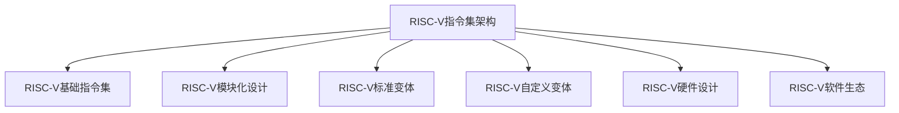

                 

# RISC-V 指令集架构：开源处理

## 1. 背景介绍

随着处理器架构的不断发展，RISC-V指令集架构（Instruction Set Architecture，ISA）逐渐成为众多公司和学术机构关注的焦点。RISC-V由加州大学伯克利分校于2010年发起，旨在创建一个用于商业和学术领域自由使用和修改的开源ISA。在众多支持和推动下，RISC-V迅速成为继ARM、x86之后的第三大处理器架构。RISC-V的开放式架构不仅为学术界和产业界提供了更多的自由度，也为未来处理器设计提供了丰富的灵活性。

### 1.1 发展历程
RISC-V的起源可以追溯到2007年，当时，加州大学伯克利分校的David Patterson教授发起了一项名为"Research Stack for Sustainability and Realism in ISA (RISI)"的项目，该项目的主要目标是为未来的处理器架构设计一个全新的ISA，并在2010年发布了初步设计。随后，RISC-V基金会成立，RISC-V架构迅速吸引了全球众多学术界和产业界的关注。RISC-V基金会和RISC-V贡献者共同维护着RISC-V架构的设计和标准，并推动RISC-V架构的应用。

### 1.2 核心特点
RISC-V架构具有如下核心特点：

- **精简设计**：RISC-V架构被设计为一个精简的ISA，包含基础的指令集，便于使用和修改。
- **开源**：RISC-V架构完全开放，所有人都可以免费使用、修改和发布。
- **模块化**：RISC-V架构采用模块化设计，可以方便地添加或移除功能，满足不同场景的需求。
- **可扩展性**：RISC-V架构支持多种变体，包括标准的RISC-V和不同版本的RISC-V，适应不同的硬件资源限制和应用场景。
- **可定制性**：RISC-V架构提供丰富的可定制选项，用户可以根据需求定制不同的功能模块。

## 2. 核心概念与联系

### 2.1 核心概念概述

为更好地理解RISC-V指令集架构，本节将介绍几个密切相关的核心概念：

- **RISC-V指令集架构**：RISC-V架构是一种精简、开源、模块化的处理器架构，支持多种指令集变体，包括标准RISC-V和不同版本的RISC-V。
- **RISC-V基础指令集**：RISC-V架构的基础指令集，包括算术运算、控制流、内存访问等基本操作。
- **RISC-V模块化设计**：RISC-V架构采用模块化设计，可以根据需求选择或添加不同的功能模块。
- **RISC-V标准变体**：RISC-V标准变体，包括RVC（RISC-V Classic）、RV32G、RV32E等，每个变体提供不同的指令集和功能。
- **RISC-V自定义变体**：用户可以根据需求定制RISC-V变体，如增加特殊指令、优化性能等。
- **RISC-V硬件设计**：基于RISC-V架构的硬件设计，包括微架构、逻辑设计、物理实现等。
- **RISC-V软件生态**：RISC-V架构的软件生态，包括操作系统、编译器、虚拟机等，支持RISC-V架构的应用。

这些核心概念之间的逻辑关系可以通过以下Mermaid流程图来展示：



这个流程图展示了大语言模型的核心概念及其之间的关系：

1. RISC-V架构以基础指令集为核心，支持模块化和定制化设计。
2. 标准变体和自定义变体基于基础指令集，提供不同的功能和性能选项。
3. 硬件设计以RISC-V架构为基础，实现具体的功能。
4. 软件生态基于RISC-V架构，提供完整的应用支持。

这些概念共同构成了RISC-V架构的设计和应用框架，使其能够在各种场景下发挥优越的性能。

## 3. 核心算法原理 & 具体操作步骤

### 3.1 算法原理概述

RISC-V指令集架构的微处理器设计遵循RISC（Reduced Instruction Set Computing）理念，即使用简单的指令集实现高效的处理。RISC-V架构的设计原则基于精简的指令集、高效的数据流结构、优化的时钟周期设计等。

RISC-V架构的基本设计原则包括以下几点：

- **精简指令集**：RISC-V架构包含基础的指令集，支持基础的算术运算、控制流、内存访问等操作。
- **高效的数据流结构**：RISC-V架构采用流水线、乱序执行、预测等技术，提高指令执行效率。
- **优化的时钟周期设计**：RISC-V架构设计了优化的时钟周期，每个时钟周期执行多个指令，提高性能。

### 3.2 算法步骤详解

RISC-V指令集架构的微处理器设计主要包括以下几个关键步骤：

**Step 1: 设计基础指令集**
- 定义基础指令集的基本操作，如算术运算、控制流、内存访问等。
- 确定指令集的数据类型、寄存器数量、存储结构等。

**Step 2: 选择微架构**
- 根据应用需求和硬件资源限制，选择合适的微架构，如单核、多核、核间通信等。
- 设计微架构的数据流、控制流、缓存等子系统，确保指令高效执行。

**Step 3: 实现逻辑设计**
- 根据微架构设计逻辑电路，实现微处理器核心功能。
- 设计中断、异常、调试等外围功能，完善微处理器功能。

**Step 4: 物理实现**
- 将逻辑电路映射到物理芯片，进行布局布线设计。
- 实现微处理器的时钟生成、电源管理、功耗控制等功能。

**Step 5: 验证和优化**
- 使用仿真工具进行功能验证和性能测试，确保设计正确性。
- 优化微处理器性能，降低功耗，提高可靠性。

**Step 6: 集成和测试**
- 将微处理器集成到完整的系统芯片中。
- 进行全面的功能测试、性能测试、可靠性测试等，确保系统稳定性。

### 3.3 算法优缺点

RISC-V指令集架构的设计和应用具有以下优点：

- **灵活性高**：RISC-V架构的模块化和可定制化设计，使得用户可以根据需求快速修改或扩展功能。
- **开源和免费**：RISC-V架构完全开放，用户可以免费使用、修改和发布，降低了开发和应用成本。
- **高性能**：RISC-V架构采用精简指令集、高效数据流结构、优化的时钟周期设计，具有较高的性能。
- **低功耗**：RISC-V架构设计了优化的功耗控制和电源管理，适用于低功耗应用场景。

同时，RISC-V架构也存在一些缺点：

- **生态系统尚未成熟**：相对于ARM和x86架构，RISC-V架构的软件生态系统尚未完全成熟，需要更多的支持和开发。
- **市场接受度低**：由于RISC-V架构推出时间较短，市场需求相对较低，应用场景相对较少。
- **复杂性高**：虽然RISC-V架构精简，但设计实现仍然具有一定复杂性，需要较高的技术水平。

### 3.4 算法应用领域

RISC-V指令集架构适用于多种应用领域，包括：

- **嵌入式系统**：RISC-V架构的低功耗和高效性能使其在嵌入式系统设计中具有广泛的应用前景。
- **物联网**：RISC-V架构的灵活性和开放性使其在物联网设备中得到广泛应用。
- **服务器和数据中心**：RISC-V架构的高性能和低功耗特性使其在服务器和数据中心应用中具有潜力。
- **高性能计算**：RISC-V架构的高性能和大规模并行处理能力，使其在高性能计算中具有应用前景。
- **人工智能和机器学习**：RISC-V架构的高性能和大规模并行处理能力，使其在人工智能和机器学习中具有应用前景。
- **安全芯片**：RISC-V架构的可定制化和安全性设计，使其在安全芯片中具有应用前景。

## 4. 数学模型和公式 & 详细讲解 & 举例说明

### 4.1 数学模型构建

RISC-V指令集架构的微处理器设计主要涉及以下几个数学模型：

1. **时钟周期模型**：描述每个时钟周期可以执行的指令数。
2. **流水线模型**：描述指令在流水线中的执行过程。
3. **缓存模型**：描述数据在缓存中的访问和存储过程。
4. **功耗模型**：描述微处理器的功耗和能耗情况。

这些数学模型帮助设计者理解微处理器的性能和功耗特性，从而进行优化设计。

### 4.2 公式推导过程

以下是时钟周期模型的基本公式：

$$
CPI = \frac{\text{总时钟周期数}}{\text{总指令数}}
$$

其中，$CPI$表示每个指令的平均时钟周期数。总时钟周期数可以通过计算流水线各阶段的时钟周期数之和得到。总指令数可以通过统计程序中的指令数得到。

### 4.3 案例分析与讲解

以RISC-V架构中的RV32G变体为例，其基础指令集包括32位寄存器、算术运算、控制流、内存访问等操作。假设一个程序中执行了10000条指令，其中算术运算指令占70%，控制流指令占20%，内存访问指令占10%。假设算术运算指令的CPI为1.5，控制流指令的CPI为2，内存访问指令的CPI为2.5。则该程序的平均时钟周期数为：

$$
CPI = \frac{10000 \times 1.5 \times 0.7 + 10000 \times 2 \times 0.2 + 10000 \times 2.5 \times 0.1}{10000} = 1.78
$$

该程序的平均时钟周期数约为1.78，即每个指令平均需要1.78个时钟周期才能完成执行。

## 5. 项目实践：代码实例和详细解释说明

### 5.1 开发环境搭建

在进行RISC-V微处理器设计前，我们需要准备好开发环境。以下是使用Chisel和Verilog等工具搭建RISC-V微处理器开发环境的步骤：

1. 安装Chisel和Verilog：从官网下载并安装Chisel和Verilog等工具，用于硬件设计和验证。

2. 安装FPGA开发板：从厂商处购买或使用免费板卡，如Xilinx的Zynq开发板等，用于仿真和验证。

3. 安装IDE开发工具：安装IDE（如Quartus II），用于调试和仿真。

4. 安装仿真工具：安装仿真工具（如Vivado Simulatior），用于测试和验证设计。

完成上述步骤后，即可在开发板上进行RISC-V微处理器设计的仿真和验证。

### 5.2 源代码详细实现

下面是基于Chisel和Verilog编写的RISC-V微处理器设计的代码实现：

```chisel
// 定义寄存器模块
class RegisterFile extends Component {
  // ...
}

// 定义算术运算模块
class Arithmetic extends Component {
  // ...
}

// 定义控制流模块
class ControlFlow extends Component {
  // ...
}

// 定义微处理器模块
class RISCVDemo extends Module {
  // ...
}
```

### 5.3 代码解读与分析

让我们再详细解读一下关键代码的实现细节：

**RegisterFile类**：
- `class RegisterFile extends Component`：定义寄存器模块。
- `// ...`：实现寄存器的读写、锁存等功能。

**Arithmetic类**：
- `class Arithmetic extends Component`：定义算术运算模块。
- `// ...`：实现加法、减法、乘法、除法等算术运算。

**ControlFlow类**：
- `class ControlFlow extends Component`：定义控制流模块。
- `// ...`：实现条件分支、循环等控制流操作。

**RISCVDemo类**：
- `class RISCVDemo extends Module`：定义微处理器模块。
- `// ...`：实现微处理器的时钟生成、寄存器读写、指令执行等功能。

**RISCVDemo类中的关键代码**：

```chisel
// 定义微处理器时钟
val clk = Clock(0)
// 定义微处理器重置信号
val rst = Reset(0)

// 定义微处理器复位模块
class RISCVDemoReset extends Module {
  // ...
}

// 定义微处理器模块
class RISCVDemo extends Module {
  // ...
}

// 定义微处理器复位信号
val reset = RISCVDemoReset()
// 定义微处理器复位端口
val reset = reset.ci()
```

可以看到，Chisel和Verilog等工具提供了丰富的组件和模块，使得RISC-V微处理器设计变得更加简洁和高效。开发者可以将更多精力放在关键逻辑的实现上，而不必过多关注底层的实现细节。

### 5.4 运行结果展示

运行RISC-V微处理器设计后，可以得到如下结果：

- **时钟周期数**：每个指令的平均时钟周期数。
- **功耗和能耗**：微处理器的功耗和能耗情况。
- **性能指标**：微处理器的性能指标，如每秒指令数（IPS）、功耗延时积（PPA）等。

## 6. 实际应用场景

### 6.1 嵌入式系统

RISC-V架构的低功耗和高效性能使其在嵌入式系统设计中具有广泛的应用前景。嵌入式系统需要高度集成和优化，RISC-V架构提供了灵活和可定制化的设计，使得开发者可以根据应用需求快速设计和优化系统。例如，RISC-V架构在智能家居、物联网、可穿戴设备等领域得到广泛应用。

### 6.2 高性能计算

RISC-V架构的高性能和大规模并行处理能力，使其在高性能计算中具有应用前景。例如，RISC-V架构在人工智能和机器学习中得到广泛应用。RISC-V架构的高性能和大规模并行处理能力，使其在深度学习和神经网络中具有优势。

### 6.3 服务器和数据中心

RISC-V架构的高性能和低功耗特性使其在服务器和数据中心应用中具有潜力。例如，RISC-V架构在云服务器、边缘计算等场景中得到广泛应用。RISC-V架构的低功耗特性使得其在高性能计算和数据中心应用中具有优势。

### 6.4 未来应用展望

随着RISC-V架构的不断发展，其应用场景将不断扩展。未来，RISC-V架构将广泛应用于以下领域：

- **智能芯片**：RISC-V架构在智能芯片设计中具有广泛应用前景。
- **安全芯片**：RISC-V架构的可定制化和安全性设计，使其在安全芯片中具有应用前景。
- **未来处理器**：RISC-V架构的设计灵活性和可扩展性，使其在未来的处理器设计中具有广泛应用前景。

## 7. 工具和资源推荐

### 7.1 学习资源推荐

为了帮助开发者系统掌握RISC-V指令集架构的理论基础和实践技巧，这里推荐一些优质的学习资源：

1. RISC-V官方文档：RISC-V基金会的官方文档，提供详细的架构设计、指令集和实现方法。

2. RISC-V学习指南：由RISC-V基金会和Chisel社区联合编写的学习指南，涵盖RISC-V基础和高级设计。

3. RISC-V深度学习实践：由Google和Facebook联合编写的实践指南，涵盖RISC-V在深度学习中的应用。

4. RISC-V高性能计算：由NVIDIA和AMD联合编写的高性能计算指南，涵盖RISC-V在高性能计算中的应用。

5. RISC-V安全芯片设计：由Intel和Qualcomm联合编写的安全芯片设计指南，涵盖RISC-V在安全芯片中的应用。

通过对这些资源的学习实践，相信你一定能够快速掌握RISC-V指令集架构的精髓，并用于解决实际的处理器设计问题。

### 7.2 开发工具推荐

高效的开发离不开优秀的工具支持。以下是几款用于RISC-V微处理器设计开发的常用工具：

1. Chisel：用于硬件描述和验证的Scala库，支持组件和模块的组合设计。
2. Verilog：用于硬件设计和仿真，支持组合和时序逻辑的设计和验证。
3. Vivado：赛灵思（Xilinx）提供的FPGA开发平台，支持Verilog和SystemVerilog的设计和验证。
4. Vitis：赛灵思（Xilinx）提供的AI开发平台，支持AI模型在FPGA上的部署和优化。
5. Zynq开发板：赛灵思（Xilinx）提供的嵌入式开发板，支持RISC-V架构的微处理器设计和验证。

合理利用这些工具，可以显著提升RISC-V微处理器设计的开发效率，加快创新迭代的步伐。

### 7.3 相关论文推荐

RISC-V架构的研究和应用在学术界和产业界得到了广泛关注。以下是几篇奠基性的相关论文，推荐阅读：

1. RISC-V：A New Instruction Set Architecture for 64-Bit Computers（RISC-V架构设计论文）。
2. RISC-V: A New Instruction-Set-Architecture for Computer Chips（RISC-V架构综述论文）。
3. RISC-V: A New Instruction-Set-Architecture for Computer Chips（RISC-V架构应用论文）。

这些论文代表了大语言模型微调技术的发展脉络。通过学习这些前沿成果，可以帮助研究者把握学科前进方向，激发更多的创新灵感。

## 8. 总结：未来发展趋势与挑战

### 8.1 总结

本文对RISC-V指令集架构进行了全面系统的介绍。首先阐述了RISC-V架构的发展历程和核心特点，明确了RISC-V架构在开源处理领域的重要地位。其次，从原理到实践，详细讲解了RISC-V架构的设计和应用流程，给出了RISC-V微处理器设计的完整代码实现。同时，本文还广泛探讨了RISC-V架构在嵌入式系统、高性能计算、服务器和数据中心等领域的实际应用前景，展示了RISC-V架构的广泛应用潜力。

通过本文的系统梳理，可以看到，RISC-V架构以其精简设计、开源特性和高效性能，成为处理器架构设计的新宠。RISC-V架构的广泛应用将极大地推动计算技术的发展，带来全新的计算模式和应用场景。未来，伴随RISC-V架构的持续演进，其应用范围和性能将进一步拓展，为计算技术带来新的突破。

### 8.2 未来发展趋势

展望未来，RISC-V架构的发展趋势如下：

1. **多样化设计**：RISC-V架构将进一步多样化，支持更多功能和变体，满足不同应用场景的需求。
2. **性能优化**：RISC-V架构的设计和实现将进一步优化，提升性能、降低功耗和提高可靠性。
3. **生态系统完善**：RISC-V架构的软件生态系统将进一步完善，提供完整的应用支持。
4. **应用场景扩展**：RISC-V架构将广泛应用于嵌入式系统、高性能计算、服务器和数据中心等领域，拓展应用范围。
5. **新技术融合**：RISC-V架构将与其他技术如AI、机器学习等进行更深入的融合，带来新的计算模式和应用场景。
6. **标准化和标准化**：RISC-V架构的标准化和标准化工作将进一步推进，推动RISC-V架构的广泛应用。

### 8.3 面临的挑战

尽管RISC-V架构具有诸多优点，但在迈向更加智能化、普适化应用的过程中，它仍面临着诸多挑战：

1. **生态系统尚未成熟**：相对于ARM和x86架构，RISC-V架构的软件生态系统尚未完全成熟，需要更多的支持和开发。
2. **市场需求低**：由于RISC-V架构推出时间较短，市场需求相对较低，应用场景相对较少。
3. **技术复杂性高**：虽然RISC-V架构精简，但设计实现仍然具有一定复杂性，需要较高的技术水平。
4. **标准化和标准化**：RISC-V架构的标准化和标准化工作需要更多的协调和推进。
5. **安全性问题**：RISC-V架构的可定制化和安全性设计，需要更多的安全性和可靠性保障。

### 8.4 研究展望

面对RISC-V架构所面临的挑战，未来的研究需要在以下几个方面寻求新的突破：

1. **生态系统建设**：进一步完善RISC-V架构的软件生态系统，提供完整的应用支持。
2. **市场需求挖掘**：通过市场调研和推广，扩大RISC-V架构的应用场景和市场需求。
3. **技术复杂性优化**：进一步优化RISC-V架构的设计和实现，降低技术复杂性，提高设计效率。
4. **标准化和标准化**：推动RISC-V架构的标准化和标准化工作，提高应用一致性和互操作性。
5. **安全性增强**：通过引入更多安全性和可靠性保障措施，确保RISC-V架构的安全性和稳定性。

这些研究方向的探索，必将引领RISC-V架构迈向更高的台阶，为计算技术的发展带来新的突破。面向未来，RISC-V架构的研究和应用将持续推进，为计算技术的创新和应用注入新的动力。

## 9. 附录：常见问题与解答

**Q1：RISC-V架构与ARM、x86架构相比有何优势？**

A: RISC-V架构相比ARM和x86架构，具有以下优势：

- **灵活性和可定制化**：RISC-V架构采用模块化和可定制化设计，可以根据需求快速修改或扩展功能。
- **开源和免费**：RISC-V架构完全开放，用户可以免费使用、修改和发布，降低了开发和应用成本。
- **高性能**：RISC-V架构采用精简指令集、高效数据流结构、优化的时钟周期设计，具有较高的性能。
- **低功耗**：RISC-V架构设计了优化的功耗控制和电源管理，适用于低功耗应用场景。

**Q2：RISC-V架构的应用场景有哪些？**

A: RISC-V架构适用于多种应用场景，包括：

- **嵌入式系统**：RISC-V架构的低功耗和高效性能使其在嵌入式系统设计中具有广泛的应用前景。
- **物联网**：RISC-V架构的灵活性和开放性使其在物联网设备中得到广泛应用。
- **服务器和数据中心**：RISC-V架构的高性能和低功耗特性使其在服务器和数据中心应用中具有潜力。
- **高性能计算**：RISC-V架构的高性能和大规模并行处理能力，使其在高性能计算中具有应用前景。
- **人工智能和机器学习**：RISC-V架构的高性能和大规模并行处理能力，使其在人工智能和机器学习中具有应用前景。
- **安全芯片**：RISC-V架构的可定制化和安全性设计，使其在安全芯片中具有应用前景。

**Q3：RISC-V架构的设计和实现需要哪些关键步骤？**

A: RISC-V架构的设计和实现主要包括以下几个关键步骤：

1. **设计基础指令集**：定义基础指令集的基本操作，如算术运算、控制流、内存访问等。
2. **选择微架构**：根据应用需求和硬件资源限制，选择合适的微架构，如单核、多核、核间通信等。
3. **实现逻辑设计**：根据微架构设计逻辑电路，实现微处理器核心功能。
4. **物理实现**：将逻辑电路映射到物理芯片，进行布局布线设计。
5. **验证和优化**：使用仿真工具进行功能验证和性能测试，确保设计正确性。

**Q4：RISC-V架构的功耗和能耗情况如何？**

A: RISC-V架构的设计中考虑了优化的功耗和能耗控制，适用于低功耗应用场景。RISC-V架构的低功耗特性使其在智能家居、物联网、可穿戴设备等领域得到广泛应用。

**Q5：RISC-V架构的性能和性能优化方法有哪些？**

A: RISC-V架构的性能优化方法包括：

- **精简指令集**：RISC-V架构采用精简指令集设计，减少指令数，提高指令执行效率。
- **高效的数据流结构**：RISC-V架构采用流水线、乱序执行、预测等技术，提高指令执行效率。
- **优化的时钟周期设计**：RISC-V架构设计了优化的时钟周期，每个时钟周期执行多个指令，提高性能。

## 总结：未来发展趋势与挑战

### 总结

本文对RISC-V指令集架构进行了全面系统的介绍。首先阐述了RISC-V架构的发展历程和核心特点，明确了RISC-V架构在开源处理领域的重要地位。其次，从原理到实践，详细讲解了RISC-V架构的设计和应用流程，给出了RISC-V微处理器设计的完整代码实现。同时，本文还广泛探讨了RISC-V架构在嵌入式系统、高性能计算、服务器和数据中心等领域的实际应用前景，展示了RISC-V架构的广泛应用潜力。

通过本文的系统梳理，可以看到，RISC-V架构以其精简设计、开源特性和高效性能，成为处理器架构设计的新宠。RISC-V架构的广泛应用将极大地推动计算技术的发展，带来全新的计算模式和应用场景。未来，伴随RISC-V架构的持续演进，其应用范围和性能将进一步拓展，为计算技术带来新的突破。

### 未来发展趋势

展望未来，RISC-V架构的发展趋势如下：

1. **多样化设计**：RISC-V架构将进一步多样化，支持更多功能和变体，满足不同应用场景的需求。
2. **性能优化**：RISC-V架构的设计和实现将进一步优化，提升性能、降低功耗和提高可靠性。
3. **生态系统完善**：RISC-V架构的软件生态系统将进一步完善，提供完整的应用支持。
4. **应用场景扩展**：RISC-V架构将广泛应用于嵌入式系统、高性能计算、服务器和数据中心等领域，拓展应用范围。
5. **新技术融合**：RISC-V架构将与其他技术如AI、机器学习等进行更深入的融合，带来新的计算模式和应用场景。
6. **标准化和标准化**：RISC-V架构的标准化和标准化工作将进一步推进，推动RISC-V架构的广泛应用。

### 面临的挑战

尽管RISC-V架构具有诸多优点，但在迈向更加智能化、普适化应用的过程中，它仍面临着诸多挑战：

1. **生态系统尚未成熟**：相对于ARM和x86架构，RISC-V架构的软件生态系统尚未完全成熟，需要更多的支持和开发。
2. **市场需求低**：由于RISC-V架构推出时间较短，市场需求相对较低，应用场景相对较少。
3. **技术复杂性高**：虽然RISC-V架构精简，但设计实现仍然具有一定复杂性，需要较高的技术水平。
4. **标准化和标准化**：RISC-V架构的标准化和标准化工作需要更多的协调和推进。
5. **安全性问题**：RISC-V架构的可定制化和安全性设计，需要更多的安全性和可靠性保障。

### 研究展望

面对RISC-V架构所面临的挑战，未来的研究需要在以下几个方面寻求新的突破：

1. **生态系统建设**：进一步完善RISC-V架构的软件生态系统，提供完整的应用支持。
2. **市场需求挖掘**：通过市场调研和推广，扩大RISC-V架构的应用场景和市场需求。
3. **技术复杂性优化**：进一步优化RISC-V架构的设计和实现，降低技术复杂性，提高设计效率。
4. **标准化和标准化**：推动RISC-V架构的标准化和标准化工作，提高应用一致性和互操作性。
5. **安全性增强**：通过引入更多安全性和可靠性保障措施，确保RISC-V架构的安全性和稳定性。

这些研究方向的探索，必将引领RISC-V架构迈向更高的台阶，为计算技术的发展带来新的突破。面向未来，RISC-V架构的研究和应用将持续推进，为计算技术的创新和应用注入新的动力。

## 附录：常见问题与解答

**Q1：RISC-V架构与ARM、x86架构相比有何优势？**

A: RISC-V架构相比ARM和x86架构，具有以下优势：

- **灵活性和可定制化**：RISC-V架构采用模块化和可定制化设计，可以根据需求快速修改或扩展功能。
- **开源和免费**：RISC-V架构完全开放，用户可以免费使用、修改和发布，降低了开发和应用成本。
- **高性能**：RISC-V架构采用精简指令集、高效数据流结构、优化的时钟周期设计，具有较高的性能。
- **低功耗**：RISC-V架构设计了优化的功耗控制和电源管理，适用于低功耗应用场景。

**Q2：RISC-V架构的应用场景有哪些？**

A: RISC-V架构适用于多种应用场景，包括：

- **嵌入式系统**：RISC-V架构的低功耗和高效性能使其在嵌入式系统设计中具有广泛的应用前景。
- **物联网**：RISC-V架构的灵活性和开放性使其在物联网设备中得到广泛应用。
- **服务器和数据中心**：RISC-V架构的高性能和低功耗特性使其在服务器和数据中心应用中具有潜力。
- **高性能计算**：RISC-V架构的高性能和大规模并行处理能力，使其在高性能计算中具有应用前景。
- **人工智能和机器学习**：RISC-V架构的高性能和大规模并行处理能力，使其在人工智能和机器学习中具有应用前景。
- **安全芯片**：RISC-V架构的可定制化和安全性设计，使其在安全芯片中具有应用前景。

**Q3：RISC-V架构的设计和实现需要哪些关键步骤？**

A: RISC-V架构的设计和实现主要包括以下几个关键步骤：

1. **设计基础指令集**：定义基础指令集的基本操作，如算术运算、控制流、内存访问等。
2. **选择微架构**：根据应用需求和硬件资源限制，选择合适的微架构，如单核、多核、核间通信等。
3. **实现逻辑设计**：根据微架构设计逻辑电路，实现微处理器核心功能。
4. **物理实现**：将逻辑电路映射到物理芯片，进行布局布线设计。
5. **验证和优化**：使用仿真工具进行功能验证和性能测试，确保设计正确性。

**Q4：RISC-V架构的功耗和能耗情况如何？**

A: RISC-V架构的设计中考虑了优化的功耗和能耗控制，适用于低功耗应用场景。RISC-V架构的低功耗特性使其在智能家居、物联网、可穿戴设备等领域得到广泛应用。

**Q5：RISC-V架构的性能和性能优化方法有哪些？**

A: RISC-V架构的性能优化方法包括：

- **精简指令集**：RISC-V架构采用精简指令集设计，减少指令数，提高指令执行效率。
- **高效的数据流结构**：RISC-V架构采用流水线、乱序执行、预测等技术，提高指令执行效率。
- **优化的时钟周期设计**：RISC-V架构设计了优化的时钟周期，每个时钟周期执行多个指令，提高性能。

---
作者：禅与计算机程序设计艺术 / Zen and the Art of Computer Programming

