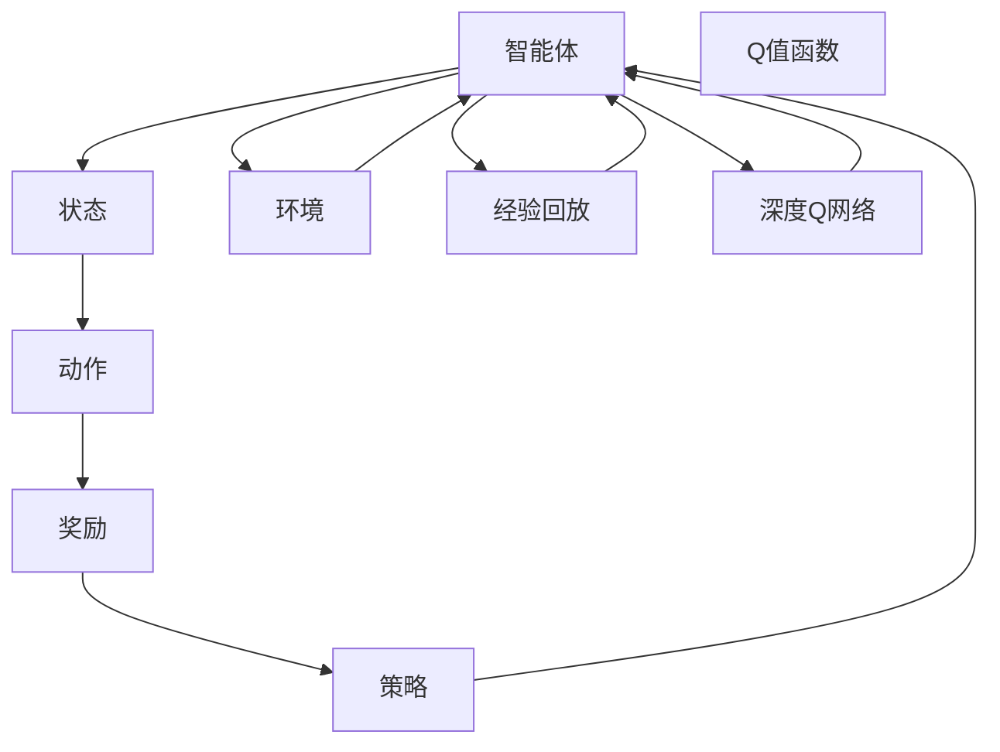

                 

# RL 在游戏和机器人中的应用

> 关键词：强化学习(RL), 深度学习, 游戏AI, 机器人控制, 决策优化, 奖励函数, 环境建模, 经验回放(Experience Replay)

## 1. 背景介绍

### 1.1 问题由来
近年来，随着深度学习和强化学习技术的飞速发展，许多复杂任务正在逐步从传统的规则驱动方法，转向更加灵活、自适应的学习范式。在游戏和机器人领域，智能体（agent）通过与环境互动，不断学习最优策略，已经成为行业的热点。

在电子游戏中，智能体不仅需要根据游戏规则制定策略，还需要应对多变和不确定的环境，如玩家操作、随机事件等。此外，游戏AI必须保证策略的安全性、公平性，同时尽可能提升游戏体验，满足用户期望。

在机器人领域，智能体需要处理更多现实世界的物理约束，如机械臂的操作、机器人的运动控制等。机器人必须具备实时性、稳定性，同时能够在复杂的动态环境中完成任务。

游戏和机器人领域的共同点在于，它们都是动态的非线性环境，智能体需要从观察中学习如何做出最优决策。因此，强化学习成为实现这些目标的重要工具。

### 1.2 问题核心关键点
强化学习（Reinforcement Learning, RL）是一种通过与环境互动，智能体通过学习获得最优策略的学习方法。在游戏和机器人领域，其主要应用点如下：

1. **游戏AI**：在游戏中，智能体通过接收环境反馈（如得分、得分、当前位置等），学习如何采取最优的行动策略，以最大化奖励。

2. **机器人控制**：在机器人领域，智能体通过控制机器人的行为，最大化某个目标函数（如到达目标位置、完成任务等）。

3. **动态决策优化**：智能体通过学习动态环境中的最优策略，应对环境变化和不确定性。

4. **奖励函数设计**：如何设计合适的奖励函数，以指导智能体的行为，是强化学习的核心问题之一。

5. **环境建模**：对环境的准确建模，是智能体学习策略的基础。

6. **经验回放(Experience Replay)**：如何高效存储和重放智能体的互动经验，加速学习过程。

通过这些问题点的系统解答，可以帮助开发者掌握在游戏和机器人领域应用强化学习技术的精髓，并避免常见误区。

## 2. 核心概念与联系

### 2.1 核心概念概述

为了更好地理解强化学习在游戏和机器人中的应用，我们首先介绍几个核心概念：

- **强化学习**：一种通过与环境互动，智能体学习最优决策的机器学习方法。其核心在于通过不断的尝试，学习如何在给定的环境中实现最优策略。

- **智能体**：游戏中的玩家或机器人，通过在环境中采取行动，以最大化期望奖励。

- **环境**：智能体可以感知并互动的环境，如游戏场景、机器人所处的世界等。

- **状态(state)**：智能体在特定时间点的环境状态，如玩家的位置、游戏地图、机器人的位置等。

- **动作(action)**：智能体可以采取的行动，如玩家的移动、机器人的移动、打击等。

- **奖励(reward)**：智能体在每个状态下获得的奖励，指导智能体如何选择最优动作。

- **Q值函数(Q-function)**：描述在给定状态下，采取特定动作的长期期望奖励。

- **策略(policy)**：智能体在给定状态下，选择动作的映射策略，通常采用深度神经网络实现。

- **经验回放(Experience Replay)**：通过存储和重放智能体与环境的互动经验，加速模型学习和收敛。

- **深度Q网络(Deep Q-Network, DQN)**：使用深度神经网络实现Q值函数，是强化学习的主流方法之一。

这些概念之间的联系可以通过以下Mermaid流程图来展示：



这个流程图展示了强化学习中各核心概念之间的关系：

1. 智能体在环境中接收状态，并选择动作。
2. 环境返回奖励，智能体更新策略。
3. 通过经验回放和深度Q网络，智能体不断更新Q值函数，优化策略。

## 3. 核心算法原理 & 具体操作步骤

### 3.1 算法原理概述

强化学习的核心思想是，智能体通过与环境的不断交互，利用奖励信号指导策略学习。其目标是在特定环境中，找到能够最大化期望奖励的策略。

形式化地，设环境状态为 $s \in \mathcal{S}$，智能体采取的动作为 $a \in \mathcal{A}$，奖励函数为 $r: \mathcal{S} \times \mathcal{A} \rightarrow [0,1]$，策略为 $\pi: \mathcal{S} \rightarrow \mathcal{A}$。强化学习的过程可以描述为：

1. 在每个时间步 $t$，智能体从环境中接收状态 $s_t$，选择动作 $a_t$，环境返回奖励 $r_{t+1}$ 和下一状态 $s_{t+1}$。

2. 智能体根据当前状态和动作，计算出长期奖励 $R_{t:T} = \sum_{k=t}^{T} \gamma^{k-t}r_k$，其中 $\gamma$ 为折扣因子。

3. 智能体根据策略 $\pi$，选择动作 $a_{t+1} \sim \pi(a|s_{t+1})$，重复步骤1。

4. 训练过程通过最大化期望回报 $V_{\pi}(s) = \mathbb{E}[\sum_{k=t}^{T} \gamma^{k-t}r_k]$ 来实现。

通过不断的尝试和奖励反馈，智能体逐渐学习到最优策略，实现目标任务。

### 3.2 算法步骤详解

强化学习的具体步骤可以分为以下几个关键阶段：

**Step 1: 定义问题与设定目标**

- 确定智能体的目标，如最大化得分、最小化任务成本等。
- 定义状态空间、动作空间、奖励函数。
- 设计评估策略效果的指标，如得分、准确率、完成时间等。

**Step 2: 选择算法**

- 选择合适的强化学习算法，如Q-Learning、SARSA、Deep Q Network(DQN)等。

**Step 3: 模型设计与训练**

- 设计深度神经网络模型，作为Q值函数或策略函数的近似器。
- 选择合适的损失函数和优化器，如均方误差、交叉熵、Adam等。
- 设置训练参数，如学习率、批大小、迭代次数等。

**Step 4: 经验回放与模型更新**

- 使用经验回放机制，存储智能体的互动经验。
- 定期从经验回放池中抽样，进行模型更新。
- 使用蒙特卡罗树搜索(MCTS)等方法，优化模型参数。

**Step 5: 模型评估与部署**

- 在测试集上评估模型性能，对比与策略更新前的提升。
- 部署模型到实际应用场景，进行实时决策。
- 持续收集新数据，定期更新模型，保持模型时效性。

### 3.3 算法优缺点

强化学习在游戏和机器人领域具有以下优点：

1. 无需大量标注数据：通过与环境的互动，智能体能够自主学习最优策略，而不需要像监督学习那样需要大量标注数据。
2. 灵活性高：智能体可以自主适应复杂多变的任务环境，具有较强的泛化能力。
3. 自适应性强：智能体能够实时调整策略，适应环境变化，具有动态优化能力。

但强化学习也存在以下缺点：

1. 奖励设计困难：设计合适的奖励函数，需要考虑多目标和不确定性，复杂度较高。
2. 训练时间长：强化学习通常需要大量时间进行探索，容易陷入局部最优解。
3. 模型不稳定：智能体策略的稳定性受到环境变化和随机性的影响。

## 4. 数学模型和公式 & 详细讲解 & 举例说明

### 4.1 数学模型构建

我们以AlphaGo为例，介绍强化学习的数学模型构建方法。AlphaGo的目标是通过在围棋游戏中不断下棋，学习最优的下棋策略。

定义状态 $s_t$ 为游戏局面，动作 $a_t$ 为落子位置，奖励 $r_t$ 为当前局面的胜负情况，策略 $\pi(a|s)$ 为在给定局面下选择动作的概率分布。

AlphaGo通过蒙特卡罗树搜索(MCTS)策略，最大化长期奖励 $V(s_t)$，实现最优策略学习。

### 4.2 公式推导过程

AlphaGo的策略 $\pi(a|s)$ 可以表示为：

$$
\pi(a|s) = \frac{e^{Q_\theta(s,a)}}{\sum_{a'}e^{Q_\theta(s,a')}}
$$

其中 $Q_\theta(s,a)$ 为使用深度神经网络近似得到的Q值函数，$\theta$ 为模型参数。

AlphaGo的损失函数为均方误差：

$$
L(\theta) = \mathbb{E}_{s,a}[(Q_\theta(s,a) - (r_{t+1} + \gamma V_{\theta}(s_{t+1})))^2]
$$

其中 $\mathbb{E}_{s,a}$ 表示在策略 $\pi$ 下，对每个状态-动作对的期望。

通过反向传播算法，计算梯度并更新模型参数：

$$
\nabla_{\theta}L(\theta) = \mathbb{E}_{s,a}[(2(Q_\theta(s,a) - (r_{t+1} + \gamma V_{\theta}(s_{t+1})) \nabla_{\theta} Q_\theta(s,a))
$$

### 4.3 案例分析与讲解

AlphaGo通过自适应蒙特卡罗树搜索算法，学习最优的下棋策略。其核心思想是通过模拟对弈，反复优化策略，最终实现人类级甚至超越人类的围棋水平。

AlphaGo的成功，展示了强化学习在游戏领域的强大潜力。类似的技术也可以应用到其他复杂游戏中，如星际争霸、DOTA等。

## 5. 项目实践：代码实例和详细解释说明

### 5.1 开发环境搭建

在进行强化学习项目开发前，需要准备好开发环境。以下是使用Python进行TensorFlow开发的环境配置流程：

1. 安装Anaconda：从官网下载并安装Anaconda，用于创建独立的Python环境。

2. 创建并激活虚拟环境：
```bash
conda create -n rl-env python=3.8 
conda activate rl-env
```

3. 安装TensorFlow：根据CUDA版本，从官网获取对应的安装命令。例如：
```bash
conda install tensorflow tensorflow-gpu=2.5 -c conda-forge
```

4. 安装相关工具包：
```bash
pip install numpy scipy matplotlib scikit-learn tqdm jupyter notebook ipython
```

完成上述步骤后，即可在`rl-env`环境中开始强化学习项目开发。

### 5.2 源代码详细实现

下面我们以AlphaGo为例，给出使用TensorFlow实现强化学习的PyTorch代码实现。

首先，定义AlphaGo的策略函数：

```python
import tensorflow as tf

class AlphaGoPolicy(tf.keras.Model):
    def __init__(self, model_dim):
        super(AlphaGoPolicy, self).__init__()
        self.dense1 = tf.keras.layers.Dense(256, activation='relu')
        self.dense2 = tf.keras.layers.Dense(model_dim, activation='softmax')
        
    def call(self, inputs):
        x = self.dense1(inputs)
        x = self.dense2(x)
        return x
```

然后，定义AlphaGo的Q值函数：

```python
class AlphaGoQ(tf.keras.Model):
    def __init__(self, model_dim):
        super(AlphaGoQ, self).__init__()
        self.dense1 = tf.keras.layers.Dense(256, activation='relu')
        self.dense2 = tf.keras.layers.Dense(1)
        
    def call(self, inputs):
        x = self.dense1(inputs)
        x = self.dense2(x)
        return x
```

接着，定义经验回放池：

```python
import numpy as np

class ReplayMemory:
    def __init__(self, capacity):
        self.capacity = capacity
        self.memory = []
        self.position = 0
    
    def push(self, state, action, reward, next_state):
        transition = np.hstack([state, action, reward, next_state])
        if len(self.memory) < self.capacity:
            self.memory.append(transition)
        else:
            self.memory[self.position] = transition
            self.position = (self.position + 1) % self.capacity
    
    def sample(self, batch_size):
        return np.array(random.sample(self.memory, batch_size))
```

最后，定义训练过程：

```python
batch_size = 32
learning_rate = 0.001
gamma = 0.99
memory = ReplayMemory(100000)
for episode in range(1000):
    state = np.array([0, 0, 0, 0])
    done = False
    while not done:
        action_probs = alpha_go_policy.predict(state)
        action = np.random.choice(np.arange(len(action_probs)), p=action_probs)
        next_state, reward, done, _ = env.step(action)
        memory.push(state, action, reward, next_state)
        state = next_state
    state = np.array([0, 0, 0, 0])
    while not done:
        action_probs = alpha_go_policy.predict(state)
        action = np.argmax(action_probs)
        next_state, reward, done, _ = env.step(action)
        memory.push(state, action, reward, next_state)
        state = next_state
    if episode % 100 == 0:
        for _ in range(batch_size):
            transition_batch = memory.sample(batch_size)
            q_values = alpha_go_q.predict(transition_batch[:, :3])
            target_q_values = np.zeros((batch_size, 1))
            for i in range(batch_size):
                if transition_batch[i, 2] == 1:
                    target_q_values[i] = transition_batch[i, 3] + gamma * np.amax(alpha_go_q.predict(transition_batch[i, 3:]))
                else:
                    target_q_values[i] = q_values[i]
            alpha_go_q.compile(optimizer=tf.keras.optimizers.Adam(learning_rate), loss='mse')
            alpha_go_q.fit(transition_batch[:, :3], target_q_values, epochs=1, verbose=0)
```

以上就是使用TensorFlow实现AlphaGo的完整代码。可以看到，AlphaGo的核心在于策略函数和Q值函数的定义，以及经验回放机制的实现。

### 5.3 代码解读与分析

让我们再详细解读一下关键代码的实现细节：

**AlphaGoPolicy类**：
- `__init__`方法：定义策略函数的层结构。
- `call`方法：实现策略函数的输出，通过两层Dense层，输出动作的概率分布。

**AlphaGoQ类**：
- `__init__`方法：定义Q值函数的层结构。
- `call`方法：实现Q值函数的输出，通过两层Dense层，输出Q值。

**ReplayMemory类**：
- `__init__`方法：初始化经验回放池。
- `push`方法：将新的一步互动经验存储到回放池中。
- `sample`方法：从回放池中随机抽取一批经验进行训练。

**训练过程**：
- 定义批处理大小、学习率、折扣因子等关键参数。
- 在每个回合中，智能体通过策略函数选择动作，与环境互动。
- 将互动经验存储到回放池中。
- 在每个回合结束后，智能体根据经验回放池进行策略更新。
- 定期评估模型性能，更新Q值函数。

通过这些代码实现，AlphaGo的强化学习过程得以具体呈现。

## 6. 实际应用场景

### 6.1 游戏AI

在游戏AI中，智能体需要面对不断变化的环境和玩家操作，其策略必须能够快速适应和调整。AlphaGo的成功展示了强化学习在游戏AI领域的潜力，其他复杂的电子游戏也正在广泛应用强化学习技术，如星际争霸、DOTA等。

通过强化学习，游戏AI可以不断优化策略，提升玩家的游戏体验，同时也增加了游戏的趣味性和挑战性。

### 6.2 机器人控制

在机器人领域，智能体需要控制机械臂、移动机器人等设备，完成特定的任务。强化学习使得机器人能够实时适应环境变化，提升任务执行效率和稳定性。

例如，通过强化学习，机器人可以在动态的工业环境中，自主规划路径，避开障碍物，高效完成任务。此外，强化学习也应用于机器人学习复杂动作和技能，如无人驾驶汽车、无人机等。

### 6.3 动态决策优化

在许多决策优化问题中，环境具有高度不确定性，强化学习提供了灵活的解决方案。例如，在供应链管理中，智能体需要优化订单分配、库存管理等任务，以最大化利润。通过强化学习，智能体能够实时调整策略，优化供应链效率，适应市场变化。

## 7. 工具和资源推荐

### 7.1 学习资源推荐

为了帮助开发者系统掌握强化学习在游戏和机器人领域的应用，以下是一些优质的学习资源：

1. **《深度强化学习》(David Silver 著)**：由知名深度学习专家David Silver所著，全面介绍强化学习的理论基础和应用，是强化学习入门的经典教材。

2. **OpenAI博客**：OpenAI团队定期发布最新研究进展和实践经验，涵盖从基础到前沿的强化学习技术。

3. **《强化学习基础》(Abdullayev 和 Rios 著)**：介绍强化学习的核心概念、算法和实际应用，适合初学者入门。

4. **DeepMind论文集**：DeepMind团队的研究成果，涵盖AlphaGo、AlphaGo Zero等经典项目，是学习和研究的宝贵资源。

5. **GitHub上的强化学习项目**：如OpenAI的AlphaGo、GitHub Deep Learning repository等，提供丰富的代码示例和项目资源。

6. **在线课程**：如Coursera上的《强化学习》课程、edX上的《深度强化学习》课程等，提供系统化的学习内容。

通过对这些资源的学习实践，相信你一定能够快速掌握强化学习在游戏和机器人领域的应用方法，并用于解决实际问题。

### 7.2 开发工具推荐

高效的开发离不开优秀的工具支持。以下是几款用于强化学习开发的常用工具：

1. **TensorFlow**：由Google主导开发的开源深度学习框架，支持自动微分、自动调用GPU/TPU等高性能设备，适合复杂的强化学习模型开发。

2. **PyTorch**：Facebook开源的深度学习框架，具有动态计算图、灵活的模型定义等优点，适合快速原型开发。

3. **OpenAI Gym**：用于游戏AI和机器人控制等环境的模拟平台，提供丰富的环境和算法接口。

4. **PyBullet**：用于机器人模拟的开源库，支持多种物理引擎，适合机器人学习路径规划、运动控制等任务。

5. **TensorBoard**：TensorFlow配套的可视化工具，实时监控模型训练状态，并提供丰富的图表呈现方式，是调试模型的得力助手。

6. **Weights & Biases**：模型训练的实验跟踪工具，可以记录和可视化模型训练过程中的各项指标，方便对比和调优。

7. **Gym Monitor**：用于监控Gym环境的开发工具，提供实时监控和可视化界面，便于实验调试。

合理利用这些工具，可以显著提升强化学习项目的开发效率，加快创新迭代的步伐。

### 7.3 相关论文推荐

强化学习在游戏和机器人领域的研究发展迅速，以下是几篇奠基性的相关论文，推荐阅读：

1. **AlphaGo**：DeepMind团队开发的游戏AI，展示了强化学习在复杂游戏中的强大能力。

2. **Rainbow**：DeepMind开发的强化学习算法，结合多种策略和学习方法，进一步提升了AlphaGo Zero的效果。

3. **Adversarial Imitation Learning**：由Google开发的模仿学习算法，利用对抗性强化学习提升机器人的精确度和稳定性。

4. **Soft Actor-Critic**：一种基于策略梯度的强化学习算法，结合策略优化和价值优化，适用于复杂的机器人控制任务。

5. **Policy Distillation**：通过知识蒸馏方法，将人类专家的策略传授给AI，提升机器人的学习和决策能力。

这些论文代表了大强化学习在游戏和机器人领域的发展脉络。通过学习这些前沿成果，可以帮助研究者把握学科前进方向，激发更多的创新灵感。

## 8. 总结：未来发展趋势与挑战

### 8.1 总结

本文对强化学习在游戏和机器人中的应用进行了全面系统的介绍。首先阐述了强化学习的基本概念和关键原理，明确了强化学习在游戏和机器人领域的独特价值。其次，从原理到实践，详细讲解了强化学习的数学模型、算法步骤和核心思想，给出了具体的代码实现和分析。同时，本文还广泛探讨了强化学习在游戏AI、机器人控制、动态决策优化等多个领域的应用前景，展示了强化学习技术的广泛应用潜力。

通过本文的系统梳理，可以看到，强化学习在游戏和机器人领域已经成为重要的技术手段，具有广阔的应用前景。未来，伴随技术的持续演进，强化学习必将在更多领域得到广泛应用，为人类社会带来更深远的影响。

### 8.2 未来发展趋势

展望未来，强化学习在游戏和机器人领域将呈现以下几个发展趋势：

1. **多智能体协作**：未来智能体将更加注重协作，通过团队协作提升决策效率和稳定性。

2. **强化学习与深度学习融合**：结合深度学习和强化学习，优化模型学习能力和决策质量。

3. **实时优化与反馈**：在实时环境中，智能体需要快速适应和调整策略，确保最优决策。

4. **多目标优化**：同时优化多个目标，提升系统综合性能，如机器人任务多样性、游戏策略复杂性等。

5. **可解释性**：增强模型的可解释性，提升用户对系统决策的信任和接受度。

6. **跨领域应用**：强化学习技术将在更多领域得到应用，如金融、医疗、能源等。

以上趋势凸显了强化学习在游戏和机器人领域的应用前景，这些方向的探索发展，必将进一步提升系统性能，推动人工智能技术的规模化应用。

### 8.3 面临的挑战

尽管强化学习在游戏和机器人领域已经取得了显著成就，但在迈向更加智能化、普适化应用的过程中，它仍面临诸多挑战：

1. **奖励设计复杂**：设计合适的奖励函数，需要考虑多目标和不确定性，复杂度较高。

2. **训练时间长**：强化学习通常需要大量时间进行探索，容易陷入局部最优解。

3. **模型稳定性差**：智能体策略的稳定性受到环境变化和随机性的影响。

4. **计算资源消耗大**：大规模模型训练和实时决策，需要大量计算资源。

5. **模型可解释性差**：强化学习模型通常缺乏可解释性，难以解释其内部工作机制和决策逻辑。

6. **安全性问题**：智能体决策可能涉及人机交互、风险决策等，安全性问题尤为关键。

7. **数据采集难度高**：需要大规模的实时数据采集和处理，数据采集难度和成本较高。

正视强化学习面临的这些挑战，积极应对并寻求突破，将是其迈向成熟的必由之路。相信随着学界和产业界的共同努力，这些挑战终将一一被克服，强化学习必将在构建人机协同的智能时代中扮演越来越重要的角色。

### 8.4 研究展望

面对强化学习面临的挑战，未来的研究需要在以下几个方面寻求新的突破：

1. **增强奖励设计能力**：通过更好的奖励函数设计方法，提升模型学习能力和决策质量。

2. **提高模型训练效率**：采用强化学习与深度学习的结合方法，提升训练速度和模型质量。

3. **增强模型可解释性**：通过可解释的强化学习方法，提高模型的透明度和可解释性。

4. **优化资源使用**：采用模型压缩、稀疏化存储等技术，优化计算资源使用效率。

5. **提升安全性和鲁棒性**：通过安全约束和鲁棒性增强技术，提高系统稳定性和安全性。

6. **跨领域应用研究**：探索强化学习在更多领域的应用，如金融、医疗、能源等，推动多学科的交叉融合。

这些研究方向的探索，必将引领强化学习在游戏和机器人领域迈向更高的台阶，为构建安全、可靠、可解释、可控的智能系统铺平道路。面向未来，强化学习技术还需要与其他人工智能技术进行更深入的融合，如知识表示、因果推理、强化学习等，多路径协同发力，共同推动人工智能技术的发展。只有勇于创新、敢于突破，才能不断拓展强化学习的边界，让智能技术更好地造福人类社会。

## 9. 附录：常见问题与解答

**Q1：强化学习在游戏AI和机器人控制中有什么区别？**

A: 强化学习在游戏AI和机器人控制中的主要区别在于应用场景的不同。游戏AI需要通过与游戏环境的互动，学习最优的下棋策略或游戏策略，而机器人控制则需要通过与物理环境的互动，学习最优的运动控制策略。

**Q2：如何设计合适的奖励函数？**

A: 设计合适的奖励函数，需要考虑任务的具体要求和环境特性。通常采用以下步骤：
1. 确定任务目标，如最大化得分、最小化任务成本等。
2. 考虑奖励的合理性和可计算性，避免奖励信号的过拟合或误导。
3. 根据具体任务，设计奖励函数，如围棋中的胜负奖励、机器人控制中的距离奖励等。

**Q3：如何优化强化学习的训练过程？**

A: 优化强化学习的训练过程，可以采用以下方法：
1. 使用经验回放和模型更新机制，加速模型收敛。
2. 采用深度Q网络和策略优化方法，提升模型学习效率。
3. 使用多智能体协作和迁移学习方法，增强模型的泛化能力。
4. 采用模型压缩和稀疏化存储技术，优化计算资源使用。

**Q4：如何在实时环境中应用强化学习？**

A: 在实时环境中应用强化学习，需要采用以下技术：
1. 使用分布式计算和并行化技术，加速模型训练和推理。
2. 采用轻量级模型和高效的优化算法，减少计算资源消耗。
3. 引入在线学习技术和模型更新机制，实时适应环境变化。
4. 采用模型蒸馏和迁移学习方法，提升模型泛化能力和鲁棒性。

通过这些技术，可以确保强化学习在实时环境中高效、稳定地运行。

**Q5：强化学习的未来趋势是什么？**

A: 强化学习的未来趋势包括：
1. 多智能体协作，提升系统决策效率和稳定性。
2. 强化学习与深度学习的融合，优化模型学习能力和决策质量。
3. 实时优化与反馈，确保最优决策。
4. 多目标优化，提升系统综合性能。
5. 增强模型可解释性，提升用户信任度。
6. 跨领域应用，推动多学科的交叉融合。

这些趋势将推动强化学习在游戏和机器人领域的应用和发展。

---

作者：禅与计算机程序设计艺术 / Zen and the Art of Computer Programming

