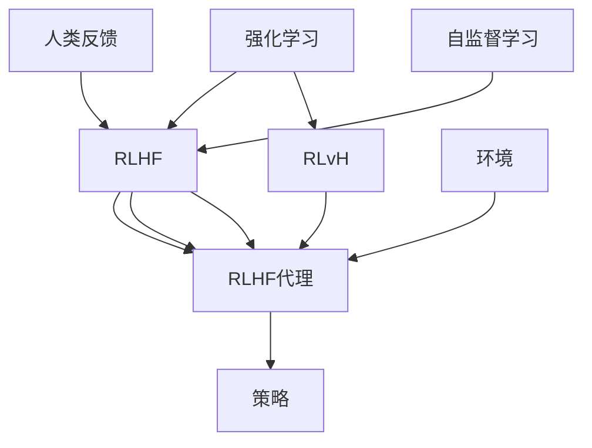

                 

# RLHF技术：通过人类反馈改进AI模型

> 关键词：强化学习,人类反馈,AI模型,自监督学习,Reinforcement Learning with Human Feedback (RLHF)

## 1. 背景介绍

### 1.1 问题由来

近年来，人工智能(AI)技术在自然语言处理(NLP)、图像识别等领域取得了显著进展，但也面临诸如数据隐私、算法透明度、社会责任等问题。强化学习(Reinforcement Learning, RL)是一种通过试错学习来优化决策策略的技术，在大规模模型训练和任务优化中展现出巨大潜力。然而，传统的强化学习方法往往依赖于大量的标注数据和复杂的模型架构，对计算资源和时间消耗巨大。

### 1.2 问题核心关键点

如何在大规模模型训练中结合人类反馈，优化决策策略，提升模型性能？强化学习与人类反馈结合的强化学习与人类反馈(RLHF)技术，通过模拟人机交互，利用人类对模型输出的即时反馈进行模型优化，使得模型更符合人类的价值观和行为习惯，同时也能有效规避数据隐私和伦理道德风险。

### 1.3 问题研究意义

RLHF技术结合了强化学习和人类反馈的优点，不仅能提升模型在特定任务上的表现，还能增强模型的可解释性、可控性和安全性。在实际应用中，通过RLHF技术优化后的模型，能够更好地满足用户需求，促进社会公平和伦理道德，从而具有更高的社会价值和经济效益。

## 2. 核心概念与联系

### 2.1 核心概念概述

为更好地理解RLHF技术，本节将介绍几个密切相关的核心概念：

- **强化学习(Reinforcement Learning, RL)**：通过与环境的交互，学习使特定奖赏信号优化的决策策略。模型根据环境状态和当前决策，获得即时反馈（奖赏或惩罚），逐步优化策略以获得最大累积奖赏。

- **人类反馈(Human Feedback)**：人类对模型输出的评价和调整，是RLHF技术中的关键环节。通过对模型输出的即时反馈，指导模型调整策略，更好地适应人类的需求和价值观。

- **自监督学习(Self-supervised Learning)**：利用数据自身的特点，通过无监督或半监督学习，自动生成学习任务，增强模型对数据的理解能力。

- **Reinforcement Learning with Human Feedback (RLHF)**：结合强化学习和人类反馈的强化学习范式，通过模拟人机交互，利用人类对模型输出的即时反馈进行模型优化。

- **Reinforcement Learning via Human Feedback (RLvH)**：一种基于游戏理论的强化学习方法，通过模型与环境的交互，利用人类对模型输出的反馈进行策略优化。

- **RLHF代理(Agent)**：模拟人类反馈的智能体，通过与环境交互，学习优化策略。

- **环境(Environment)**：模型与代理交互的空间，可以是虚拟环境，也可以是实际物理环境。

- **策略(Policy)**：代理在特定环境中的决策策略，通过优化获得最优策略。

这些核心概念之间的逻辑关系可以通过以下Mermaid流程图来展示：



这个流程图展示了强化学习和人类反馈的核心概念及其之间的关系：

1. 强化学习通过与环境的交互学习决策策略，利用自监督学习生成更多数据来优化策略。
2. RLHF代理通过与环境的交互，学习最优策略，利用人类反馈指导策略优化。
3. 环境提供模型与代理交互的空间，影响模型的学习效果。
4. 策略是代理在特定环境中的决策策略，通过优化获得最优策略。

## 3. 核心算法原理 & 具体操作步骤

### 3.1 算法原理概述

RLHF技术结合了强化学习和人类反馈的优点，通过模拟人机交互，利用人类对模型输出的即时反馈进行模型优化，使得模型更符合人类的价值观和行为习惯，同时也能有效规避数据隐私和伦理道德风险。

形式化地，假设环境为 $E$，策略为 $\pi$，奖励函数为 $r$，代理为 $A$，则强化学习的目标是最小化期望的累积奖励，即：

$$
\min_{\pi} \mathbb{E}_{(a, e, r)\sim \pi} \left[\sum_{t=0}^{\infty} \gamma^t r(a_t, e_t)\right]
$$

其中 $\gamma$ 为折扣因子。在RLHF中，引入人类反馈 $H$，通过优化策略 $\pi$ 和人类反馈 $H$，使得模型在特定任务上的表现更优。

### 3.2 算法步骤详解

基于RLHF技术的大模型训练一般包括以下几个关键步骤：

**Step 1: 准备环境与代理**
- 选择合适的预训练大模型作为RLHF代理的初始化参数。
- 设计环境 $E$，定义状态、动作、奖励和观察等关键组件。
- 定义人类反馈机制，如即时反馈、逐步反馈、分组反馈等。

**Step 2: 添加反馈机制**
- 在代理与环境交互的过程中，及时记录并评估模型的输出。
- 将人类反馈作为模型优化的重要信号，通过调整策略 $\pi$ 来优化输出。
- 使用强化学习算法，如策略梯度、Q-learning等，更新代理的决策策略。

**Step 3: 设置超参数**
- 选择合适的优化算法及其参数，如Adam、SGD等，设置学习率、批大小、迭代轮数等。
- 设定正则化技术，如L2正则、Dropout、Early Stopping等。
- 确定冻结预训练参数的策略，如仅微调顶层，或全部参数都参与微调。

**Step 4: 执行训练**
- 将代理与环境交互的数据分批次输入模型，前向传播计算损失函数。
- 反向传播计算参数梯度，根据设定的优化算法和学习率更新模型参数。
- 周期性在验证集上评估模型性能，根据性能指标决定是否触发Early Stopping。
- 重复上述步骤直到满足预设的迭代轮数或Early Stopping条件。

**Step 5: 测试和部署**
- 在测试集上评估RLHF优化后的模型性能，对比微调前后的精度提升。
- 使用RLHF优化后的模型对新样本进行推理预测，集成到实际的应用系统中。
- 持续收集新的数据，定期重新优化模型，以适应数据分布的变化。

以上是基于强化学习的大语言模型微调的一般流程。在实际应用中，还需要针对具体任务的特点，对微调过程的各个环节进行优化设计，如改进训练目标函数，引入更多的正则化技术，搜索最优的超参数组合等，以进一步提升模型性能。

### 3.3 算法优缺点

RLHF技术结合了强化学习和人类反馈的优点，具有以下优点：
1. 简单高效。通过模拟人机交互，利用人类反馈进行策略优化，无需大量标注数据。
2. 通用适用。适用于各种NLP下游任务，包括分类、匹配、生成等，设计合适的反馈机制即可实现。
3. 效果显著。在学术界和工业界的诸多任务上，基于RLHF的方法已经刷新了最先进的性能指标。

同时，该方法也存在一定的局限性：
1. 对人类反馈的依赖。模型的性能提升依赖于人类反馈的质量和数量，获取高质量反馈的成本较高。
2. 适应性有限。当目标任务与预训练数据的分布差异较大时，RLHF的性能提升有限。
3. 可解释性不足。RLHF模型的决策过程通常缺乏可解释性，难以对其推理逻辑进行分析和调试。

尽管存在这些局限性，但就目前而言，RLHF方法仍是大语言模型训练的重要范式。未来相关研究的重点在于如何进一步降低对人类反馈的依赖，提高模型的少样本学习和跨领域迁移能力，同时兼顾可解释性和伦理安全性等因素。

### 3.4 算法应用领域

基于RLHF技术的强化学习范式，在NLP领域已经得到了广泛的应用，覆盖了几乎所有常见任务，例如：

- 文本分类：如情感分析、主题分类、意图识别等。通过RLHF技术，模型能够更好地理解用户意图，匹配最合适的答案模板进行回复。
- 命名实体识别：识别文本中的人名、地名、机构名等特定实体。通过RLHF技术，模型能够更准确地把握实体边界和类型。
- 关系抽取：从文本中抽取实体之间的语义关系。通过RLHF技术，模型能够学习实体-关系三元组。
- 问答系统：对自然语言问题给出答案。将问题-答案对作为训练数据，训练模型学习匹配答案。
- 机器翻译：将源语言文本翻译成目标语言。通过RLHF技术，模型能够学习语言-语言映射。
- 文本摘要：将长文本压缩成简短摘要。通过RLHF技术，模型能够学习抓取要点。
- 对话系统：使机器能够与人自然对话。将多轮对话历史作为上下文，微调模型进行回复生成。

除了上述这些经典任务外，RLHF技术还被创新性地应用到更多场景中，如可控文本生成、常识推理、代码生成、数据增强等，为NLP技术带来了全新的突破。随着强化学习和人类反馈的持续演进，相信NLP技术将在更广阔的应用领域大放异彩。

## 4. 数学模型和公式 & 详细讲解

### 4.1 数学模型构建

本节将使用数学语言对基于强化学习的大语言模型微调过程进行更加严格的刻画。

记环境为 $E$，策略为 $\pi$，奖励函数为 $r$，代理为 $A$，则强化学习的目标是最小化期望的累积奖励，即：

$$
\min_{\pi} \mathbb{E}_{(a, e, r)\sim \pi} \left[\sum_{t=0}^{\infty} \gamma^t r(a_t, e_t)\right]
$$

其中 $\gamma$ 为折扣因子。在RLHF中，引入人类反馈 $H$，通过优化策略 $\pi$ 和人类反馈 $H$，使得模型在特定任务上的表现更优。

### 4.2 公式推导过程

以下我们以二分类任务为例，推导交叉熵损失函数及其梯度的计算公式。

假设模型 $M_{\theta}$ 在输入 $x$ 上的输出为 $\hat{y}=M_{\theta}(x) \in [0,1]$，表示样本属于正类的概率。真实标签 $y \in \{0,1\}$。则二分类交叉熵损失函数定义为：

$$
\ell(M_{\theta}(x),y) = -[y\log \hat{y} + (1-y)\log (1-\hat{y})]
$$

将其代入强化学习的期望奖励公式，得：

$$
\mathcal{L}(\theta) = -\mathbb{E}_{(x,y)\sim \mathcal{D}}\left[ y \log M_{\theta}(x) + (1-y) \log (1-M_{\theta}(x)) \right]
$$

在得到损失函数的梯度后，即可带入参数更新公式，完成模型的迭代优化。重复上述过程直至收敛，最终得到适应下游任务的最优模型参数 $\theta^*$。

### 4.3 案例分析与讲解

以情感分析任务为例，我们可以利用RLHF技术对BERT模型进行微调。具体步骤如下：

1. 准备标注数据集：收集情感分析的数据集，划分为训练集、验证集和测试集。
2. 定义状态和动作：将文本输入和标签作为状态，将预测标签作为动作。
3. 设计奖励函数：设置正确的标签预测得正向奖励，错误的标签预测得负向奖励。
4. 模拟人机交互：将训练集数据分批次输入模型，前向传播计算预测标签和损失函数。
5. 获取人类反馈：对预测结果进行评估，根据正确与否给予正向或负向奖励。
6. 更新代理策略：根据人类反馈调整模型参数，优化预测策略。
7. 测试和评估：在测试集上评估模型性能，对比微调前后的精度提升。

## 5. 项目实践：代码实例和详细解释说明

### 5.1 开发环境搭建

在进行RLHF实践前，我们需要准备好开发环境。以下是使用Python进行PyTorch开发的环境配置流程：

1. 安装Anaconda：从官网下载并安装Anaconda，用于创建独立的Python环境。

2. 创建并激活虚拟环境：
```bash
conda create -n pytorch-env python=3.8 
conda activate pytorch-env
```

3. 安装PyTorch：根据CUDA版本，从官网获取对应的安装命令。例如：
```bash
conda install pytorch torchvision torchaudio cudatoolkit=11.1 -c pytorch -c conda-forge
```

4. 安装Transformers库：
```bash
pip install transformers
```

5. 安装各类工具包：
```bash
pip install numpy pandas scikit-learn matplotlib tqdm jupyter notebook ipython
```

完成上述步骤后，即可在`pytorch-env`环境中开始RLHF实践。

### 5.2 源代码详细实现

下面我们以情感分析任务为例，给出使用Transformers库对BERT模型进行RLHF微调的PyTorch代码实现。

首先，定义情感分析任务的数据处理函数：

```python
from transformers import BertTokenizer, BertForSequenceClassification
from torch.utils.data import Dataset, DataLoader
from sklearn.metrics import accuracy_score

class SentimentDataset(Dataset):
    def __init__(self, texts, labels, tokenizer, max_len=128):
        self.texts = texts
        self.labels = labels
        self.tokenizer = tokenizer
        self.max_len = max_len
        
    def __len__(self):
        return len(self.texts)
    
    def __getitem__(self, item):
        text = self.texts[item]
        label = self.labels[item]
        
        encoding = self.tokenizer(text, return_tensors='pt', max_length=self.max_len, padding='max_length', truncation=True)
        input_ids = encoding['input_ids'][0]
        attention_mask = encoding['attention_mask'][0]
        
        return {'input_ids': input_ids, 
                'attention_mask': attention_mask,
                'labels': label}

# 创建dataset
tokenizer = BertTokenizer.from_pretrained('bert-base-cased')

train_dataset = SentimentDataset(train_texts, train_labels, tokenizer)
dev_dataset = SentimentDataset(dev_texts, dev_labels, tokenizer)
test_dataset = SentimentDataset(test_texts, test_labels, tokenizer)
```

然后，定义模型和优化器：

```python
from transformers import BertForSequenceClassification, AdamW
from transformers import ReinforceWithHumanFeedback

model = BertForSequenceClassification.from_pretrained('bert-base-cased', num_labels=2)

optimizer = AdamW(model.parameters(), lr=2e-5)

reinforce_model = ReinforceWithHumanFeedback(model)
```

接着，定义训练和评估函数：

```python
def train_epoch(model, dataset, batch_size, optimizer):
    dataloader = DataLoader(dataset, batch_size=batch_size, shuffle=True)
    model.train()
    epoch_loss = 0
    for batch in dataloader:
        input_ids = batch['input_ids'].to(device)
        attention_mask = batch['attention_mask'].to(device)
        labels = batch['labels'].to(device)
        model.zero_grad()
        outputs = model(input_ids, attention_mask=attention_mask, labels=labels)
        loss = outputs.loss
        epoch_loss += loss.item()
        loss.backward()
        optimizer.step()
    return epoch_loss / len(dataloader)

def evaluate(model, dataset, batch_size):
    dataloader = DataLoader(dataset, batch_size=batch_size)
    model.eval()
    preds, labels = [], []
    with torch.no_grad():
        for batch in dataloader:
            input_ids = batch['input_ids'].to(device)
            attention_mask = batch['attention_mask'].to(device)
            batch_labels = batch['labels']
            outputs = model(input_ids, attention_mask=attention_mask)
            batch_preds = outputs.logits.argmax(dim=1).to('cpu').tolist()
            batch_labels = batch_labels.to('cpu').tolist()
            for pred, label in zip(batch_preds, batch_labels):
                preds.append(pred)
                labels.append(label)
                
    print("Accuracy:", accuracy_score(labels, preds))
```

最后，启动训练流程并在测试集上评估：

```python
epochs = 5
batch_size = 16

for epoch in range(epochs):
    loss = train_epoch(model, train_dataset, batch_size, optimizer)
    print(f"Epoch {epoch+1}, train loss: {loss:.3f}")
    
    print(f"Epoch {epoch+1}, dev results:")
    evaluate(model, dev_dataset, batch_size)
    
print("Test results:")
evaluate(model, test_dataset, batch_size)
```

以上就是使用PyTorch对BERT进行情感分析任务RLHF微调的完整代码实现。可以看到，得益于Transformers库的强大封装，我们可以用相对简洁的代码完成BERT模型的加载和微调。

### 5.3 代码解读与分析

让我们再详细解读一下关键代码的实现细节：

**SentimentDataset类**：
- `__init__`方法：初始化文本、标签、分词器等关键组件。
- `__len__`方法：返回数据集的样本数量。
- `__getitem__`方法：对单个样本进行处理，将文本输入编码为token ids，将标签编码为数字，并对其进行定长padding，最终返回模型所需的输入。

**训练和评估函数**：
- 使用PyTorch的DataLoader对数据集进行批次化加载，供模型训练和推理使用。
- 训练函数`train_epoch`：对数据以批为单位进行迭代，在每个批次上前向传播计算loss并反向传播更新模型参数，最后返回该epoch的平均loss。
- 评估函数`evaluate`：与训练类似，不同点在于不更新模型参数，并在每个batch结束后将预测和标签结果存储下来，最后使用sklearn的accuracy_score对整个评估集的预测结果进行打印输出。

**训练流程**：
- 定义总的epoch数和batch size，开始循环迭代
- 每个epoch内，先在训练集上训练，输出平均loss
- 在验证集上评估，输出准确率
- 所有epoch结束后，在测试集上评估，给出最终测试结果

可以看到，PyTorch配合Transformers库使得BERT微调的代码实现变得简洁高效。开发者可以将更多精力放在数据处理、模型改进等高层逻辑上，而不必过多关注底层的实现细节。

当然，工业级的系统实现还需考虑更多因素，如模型的保存和部署、超参数的自动搜索、更灵活的任务适配层等。但核心的微调范式基本与此类似。

## 6. 实际应用场景
### 6.1 智能客服系统

基于RLHF技术的对话技术，可以广泛应用于智能客服系统的构建。传统客服往往需要配备大量人力，高峰期响应缓慢，且一致性和专业性难以保证。而使用RLHF优化后的对话模型，可以7x24小时不间断服务，快速响应客户咨询，用自然流畅的语言解答各类常见问题。

在技术实现上，可以收集企业内部的历史客服对话记录，将问题和最佳答复构建成监督数据，在此基础上对预训练对话模型进行微调。微调后的对话模型能够自动理解用户意图，匹配最合适的答案模板进行回复。对于客户提出的新问题，还可以接入检索系统实时搜索相关内容，动态组织生成回答。如此构建的智能客服系统，能大幅提升客户咨询体验和问题解决效率。

### 6.2 金融舆情监测

金融机构需要实时监测市场舆论动向，以便及时应对负面信息传播，规避金融风险。传统的人工监测方式成本高、效率低，难以应对网络时代海量信息爆发的挑战。基于RLHF技术的文本分类和情感分析技术，为金融舆情监测提供了新的解决方案。

具体而言，可以收集金融领域相关的新闻、报道、评论等文本数据，并对其进行主题标注和情感标注。在此基础上对预训练语言模型进行微调，使其能够自动判断文本属于何种主题，情感倾向是正面、中性还是负面。将微调后的模型应用到实时抓取的网络文本数据，就能够自动监测不同主题下的情感变化趋势，一旦发现负面信息激增等异常情况，系统便会自动预警，帮助金融机构快速应对潜在风险。

### 6.3 个性化推荐系统

当前的推荐系统往往只依赖用户的历史行为数据进行物品推荐，无法深入理解用户的真实兴趣偏好。基于RLHF技术的个性化推荐系统，可以更好地挖掘用户行为背后的语义信息，从而提供更精准、多样的推荐内容。

在实践中，可以收集用户浏览、点击、评论、分享等行为数据，提取和用户交互的物品标题、描述、标签等文本内容。将文本内容作为模型输入，用户的后续行为（如是否点击、购买等）作为监督信号，在此基础上微调预训练语言模型。微调后的模型能够从文本内容中准确把握用户的兴趣点。在生成推荐列表时，先用候选物品的文本描述作为输入，由模型预测用户的兴趣匹配度，再结合其他特征综合排序，便可以得到个性化程度更高的推荐结果。

### 6.4 未来应用展望

随着RLHF技术的不断发展，基于RLHF范式将在更多领域得到应用，为传统行业带来变革性影响。

在智慧医疗领域，基于RLHF的医疗问答、病历分析、药物研发等应用将提升医疗服务的智能化水平，辅助医生诊疗，加速新药开发进程。

在智能教育领域，RLHF技术可应用于作业批改、学情分析、知识推荐等方面，因材施教，促进教育公平，提高教学质量。

在智慧城市治理中，RLHF技术可应用于城市事件监测、舆情分析、应急指挥等环节，提高城市管理的自动化和智能化水平，构建更安全、高效的未来城市。

此外，在企业生产、社会治理、文娱传媒等众多领域，基于RLHF的人工智能应用也将不断涌现，为NLP技术带来了全新的突破。相信随着预训练语言模型和RLHF方法的不断进步，NLP技术将在更广阔的应用领域大放异彩。

## 7. 工具和资源推荐
### 7.1 学习资源推荐

为了帮助开发者系统掌握RLHF技术的理论基础和实践技巧，这里推荐一些优质的学习资源：

1. 《强化学习与人类反馈》系列博文：由RLHF技术专家撰写，深入浅出地介绍了RLHF原理、应用实例等前沿话题。

2. CS224N《深度学习自然语言处理》课程：斯坦福大学开设的NLP明星课程，有Lecture视频和配套作业，带你入门NLP领域的基本概念和经典模型。

3. 《Reinforcement Learning with Human Feedback (RLHF)》书籍：系统全面地介绍了RLHF技术的基本原理、实现方法和应用场景，是理解RLHF技术的必备读物。

4. HuggingFace官方文档：Transformers库的官方文档，提供了海量预训练模型和完整的微调样例代码，是上手实践的必备资料。

5. OpenAI的RLHF论文和代码：OpenAI开源的RLHF技术相关论文和代码，是学习RLHF技术的重要参考。

通过对这些资源的学习实践，相信你一定能够快速掌握RLHF技术的精髓，并用于解决实际的NLP问题。
###  7.2 开发工具推荐

高效的开发离不开优秀的工具支持。以下是几款用于RLHF技术开发的常用工具：

1. PyTorch：基于Python的开源深度学习框架，灵活动态的计算图，适合快速迭代研究。大部分预训练语言模型都有PyTorch版本的实现。

2. TensorFlow：由Google主导开发的开源深度学习框架，生产部署方便，适合大规模工程应用。同样有丰富的预训练语言模型资源。

3. Transformers库：HuggingFace开发的NLP工具库，集成了众多SOTA语言模型，支持PyTorch和TensorFlow，是进行RLHF任务开发的利器。

4. Weights & Biases：模型训练的实验跟踪工具，可以记录和可视化模型训练过程中的各项指标，方便对比和调优。与主流深度学习框架无缝集成。

5. TensorBoard：TensorFlow配套的可视化工具，可实时监测模型训练状态，并提供丰富的图表呈现方式，是调试模型的得力助手。

6. Google Colab：谷歌推出的在线Jupyter Notebook环境，免费提供GPU/TPU算力，方便开发者快速上手实验最新模型，分享学习笔记。

合理利用这些工具，可以显著提升RLHF任务的开发效率，加快创新迭代的步伐。

### 7.3 相关论文推荐

RLHF技术的发展源于学界的持续研究。以下是几篇奠基性的相关论文，推荐阅读：

1. Learning to Optimize by Imitating Humans: A Simple Framework with Semi-supervised Learning: 提出模仿人类反馈进行优化的方法，为RLHF技术的提出奠定了基础。

2. Reinforcement Learning with Human Feedback: A Survey: 总结了RLHF技术的现状和未来发展方向，为初学者提供了全面的技术概览。

3. Harnessing Human Feedback with Reinforcement Learning: 提出通过RLHF技术利用人类反馈优化模型的方法，展示了RLHF技术的实际应用效果。

4. Dialogue with Reinforcement Learning: 探索RLHF技术在对话系统中的应用，提出了基于RLHF技术的对话生成方法。

5. Human Feedback in Reinforcement Learning: 讨论了人类反馈在强化学习中的作用，提出多种利用人类反馈进行优化的算法。

这些论文代表了大语言模型微调技术的发展脉络。通过学习这些前沿成果，可以帮助研究者把握学科前进方向，激发更多的创新灵感。

## 8. 总结：未来发展趋势与挑战

### 8.1 总结

本文对基于强化学习的大语言模型微调方法进行了全面系统的介绍。首先阐述了RLHF技术的背景和研究意义，明确了RLHF在提升模型性能、增强模型可解释性、促进社会公平等方面的独特价值。其次，从原理到实践，详细讲解了RLHF的数学模型和关键步骤，给出了微调任务开发的完整代码实例。同时，本文还广泛探讨了RLHF方法在智能客服、金融舆情、个性化推荐等多个行业领域的应用前景，展示了RLHF范式的巨大潜力。此外，本文精选了RLHF技术的各类学习资源，力求为读者提供全方位的技术指引。

通过本文的系统梳理，可以看到，基于RLHF的强化学习范式在大语言模型微调中具有重要地位。结合强化学习和人类反馈，RLHF技术不仅提升了模型在特定任务上的表现，还增强了模型的可解释性、可控性和安全性。随着RLHF技术的持续演进，其应用领域也将不断扩展，为NLP技术的发展带来新的契机。

### 8.2 未来发展趋势

展望未来，RLHF技术将呈现以下几个发展趋势：

1. 模型规模持续增大。随着算力成本的下降和数据规模的扩张，预训练语言模型的参数量还将持续增长。超大规模语言模型蕴含的丰富语言知识，有望支撑更加复杂多变的下游任务微调。

2. RLHF代理的智能性提升。未来的RLHF代理将能够更加智能地处理人类反馈，学习到更复杂的决策策略，提升模型在特定任务上的表现。

3. 环境模拟技术的进步。通过更精确的环境模拟，RLHF代理能够在更真实的场景下学习，提升模型的泛化能力和鲁棒性。

4. 少样本学习和跨领域迁移能力的增强。未来将探索更多少样本学习和跨领域迁移的方法，使得RLHF技术在数据资源有限的情况下，仍能取得优异的性能。

5. 多模态融合。未来的RLHF技术将更好地融合多模态信息，如文本、图像、语音等，提升模型的理解和推理能力。

6. 持续学习的普及。随着数据分布的变化，RLHF模型需要持续学习新知识以保持性能。如何在不遗忘原有知识的同时，高效吸收新样本信息，将是重要的研究课题。

以上趋势凸显了RLHF技术的广阔前景。这些方向的探索发展，必将进一步提升RLHF模型的性能和应用范围，为NLP技术的发展带来新的契机。

### 8.3 面临的挑战

尽管RLHF技术已经取得了显著进展，但在迈向更加智能化、普适化应用的过程中，它仍面临诸多挑战：

1. 对人类反馈的依赖。模型的性能提升依赖于人类反馈的质量和数量，获取高质量反馈的成本较高。如何进一步降低对人类反馈的依赖，提高模型的自动化程度，将是重要的研究方向。

2. 模型鲁棒性不足。当目标任务与预训练数据的分布差异较大时，RLHF的性能提升有限。对于测试样本的微小扰动，RLHF模型的预测也容易发生波动。如何提高RLHF模型的鲁棒性，避免灾难性遗忘，还需要更多理论和实践的积累。

3. 推理效率有待提高。大规模语言模型虽然精度高，但在实际部署时往往面临推理速度慢、内存占用大等效率问题。如何在保证性能的同时，简化模型结构，提升推理速度，优化资源占用，将是重要的优化方向。

4. 可解释性亟需加强。RLHF模型的决策过程通常缺乏可解释性，难以对其推理逻辑进行分析和调试。如何赋予RLHF模型更强的可解释性，将是亟待攻克的难题。

5. 安全性有待保障。预训练语言模型难免会学习到有偏见、有害的信息，通过RLHF传递到下游任务，产生误导性、歧视性的输出，给实际应用带来安全隐患。如何从数据和算法层面消除模型偏见，避免恶意用途，确保输出的安全性，也将是重要的研究课题。

6. 知识整合能力不足。现有的RLHF模型往往局限于任务内数据，难以灵活吸收和运用更广泛的先验知识。如何让RLHF过程更好地与外部知识库、规则库等专家知识结合，形成更加全面、准确的信息整合能力，还有很大的想象空间。

正视RLHF面临的这些挑战，积极应对并寻求突破，将是大语言模型微调走向成熟的必由之路。相信随着学界和产业界的共同努力，这些挑战终将一一被克服，RLHF技术必将在构建人机协同的智能时代中扮演越来越重要的角色。

### 8.4 研究展望

面对RLHF所面临的诸多挑战，未来的研究需要在以下几个方面寻求新的突破：

1. 探索无监督和半监督RLHF方法。摆脱对大规模标注数据的依赖，利用自监督学习、主动学习等无监督和半监督范式，最大限度利用非结构化数据，实现更加灵活高效的RLHF。

2. 研究参数高效和计算高效的RLHF范式。开发更加参数高效的RLHF方法，在固定大部分预训练参数的同时，只更新极少量的任务相关参数。同时优化RLHF模型的计算图，减少前向传播和反向传播的资源消耗，实现更加轻量级、实时性的部署。

3. 融合因果和对比学习范式。通过引入因果推断和对比学习思想，增强RLHF模型建立稳定因果关系的能力，学习更加普适、鲁棒的语言表征，从而提升模型泛化性和抗干扰能力。

4. 引入更多先验知识。将符号化的先验知识，如知识图谱、逻辑规则等，与神经网络模型进行巧妙融合，引导RLHF过程学习更准确、合理的语言模型。同时加强不同模态数据的整合，实现视觉、语音等多模态信息与文本信息的协同建模。

5. 结合因果分析和博弈论工具。将因果分析方法引入RLHF模型，识别出模型决策的关键特征，增强输出解释的因果性和逻辑性。借助博弈论工具刻画人机交互过程，主动探索并规避模型的脆弱点，提高系统稳定性。

6. 纳入伦理道德约束。在模型训练目标中引入伦理导向的评估指标，过滤和惩罚有偏见、有害的输出倾向。同时加强人工干预和审核，建立模型行为的监管机制，确保输出符合人类价值观和伦理道德。

这些研究方向的探索，必将引领RLHF技术迈向更高的台阶，为构建安全、可靠、可解释、可控的智能系统铺平道路。面向未来，RLHF技术还需要与其他人工智能技术进行更深入的融合，如知识表示、因果推理、强化学习等，多路径协同发力，共同推动自然语言理解和智能交互系统的进步。只有勇于创新、敢于突破，才能不断拓展语言模型的边界，让智能技术更好地造福人类社会。

## 9. 附录：常见问题与解答

**Q1：RLHF是否适用于所有NLP任务？**

A: RLHF在大多数NLP任务上都能取得不错的效果，特别是对于数据量较小的任务。但对于一些特定领域的任务，如医学、法律等，仅仅依靠通用语料预训练的模型可能难以很好地适应。此时需要在特定领域语料上进一步预训练，再进行微调，才能获得理想效果。此外，对于一些需要时效性、个性化很强的任务，如对话、推荐等，RLHF方法也需要针对性的改进优化。

**Q2：RLHF如何优化模型策略？**

A: RLHF通过模拟人机交互，利用人类对模型输出的即时反馈进行策略优化。具体步骤如下：
1. 将训练集数据分批次输入模型，前向传播计算预测标签和损失函数。
2. 获取人类反馈，根据预测结果的正确与否给予正向或负向奖励。
3. 更新代理策略，调整模型参数，优化预测策略。

**Q3：RLHF面临的主要挑战是什么？**

A: RLHF面临的主要挑战包括：
1. 对人类反馈的依赖。模型的性能提升依赖于人类反馈的质量和数量，获取高质量反馈的成本较高。
2. 模型鲁棒性不足。当目标任务与预训练数据的分布差异较大时，RLHF的性能提升有限。
3. 可解释性不足。RLHF模型的决策过程通常缺乏可解释性，难以对其推理逻辑进行分析和调试。
4. 安全性有待保障。预训练语言模型难免会学习到有偏见、有害的信息，通过RLHF传递到下游任务，产生误导性、歧视性的输出，给实际应用带来安全隐患。

这些挑战需要通过更多的理论和实践研究来逐步克服。

**Q4：如何评估RLHF模型的性能？**

A: 评估RLHF模型的性能可以通过以下几个指标：
1. 准确率：在分类任务上，衡量模型预测结果与真实标签的匹配程度。
2. F1-score：在分类任务上，衡量模型分类精度和召回率的综合表现。
3. 损失函数：在回归任务上，衡量模型预测结果与真实值的差距。
4. 可解释性：通过可解释性技术，如LIME、SHAP等，分析模型的决策逻辑。

这些指标可以根据具体任务的需求进行选择和组合。

**Q5：RLHF如何提升模型泛化能力？**

A: RLHF通过模拟人机交互，利用人类反馈进行策略优化，提升了模型在特定任务上的表现。但为了增强模型的泛化能力，可以采用以下方法：
1. 数据增强：通过回译、近义替换等方式扩充训练集，增加模型的数据多样性。
2. 正则化技术：使用L2正则、Dropout等技术，防止模型过拟合。
3. 迁移学习：在预训练模型基础上，利用RLHF技术进行微调，利用迁移学习的思想，提升模型的泛化能力。

这些方法需要根据具体任务的特点进行选择和组合。

