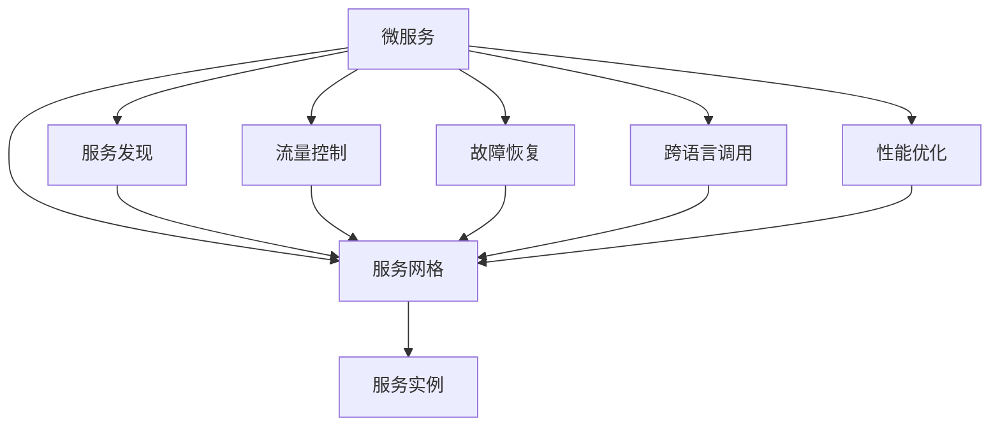

                 

# Service Mesh服务网格化

> 关键词：微服务,服务网格,服务发现,流量控制,故障恢复,跨语言调用,性能优化

## 1. 背景介绍

在现代软件架构中，微服务架构因其高灵活性、高扩展性、高可维护性等优点，已逐渐成为企业级系统架构的主流设计方式。然而，微服务架构带来了服务的碎片化，给服务的调度和治理带来了巨大挑战。为了解决这些问题，Service Mesh服务网格应运而生。

Service Mesh是一种运行在微服务之间，提供服务发现、负载均衡、流量控制、故障恢复、安全通信等功能的中间件架构。其核心思想是将服务通信的复杂性从应用中解耦出来，由专门的网格层来处理，从而使应用更加专注于业务逻辑的实现。

Service Mesh技术最早由Google提出，并在2017年被Istio开源，得到了业界的广泛关注和采用。目前，Service Mesh已经覆盖了服务网格化、分布式事务、混合云、数据管理等多个方面，成为微服务架构的关键组件。

本文将深入探讨Service Mesh的核心概念和关键技术，并通过实际应用场景来展示Service Mesh的强大功能。

## 2. 核心概念与联系

### 2.1 核心概念概述

Service Mesh是一种运行在微服务之间的基础设施层，为微服务之间的通信提供全面的管理支持。其核心概念包括：

- **微服务(Microservice)**：将复杂的应用拆分成一系列可以独立部署和扩展的小服务。每个服务独立运行，只负责特定业务功能，通过网络通信实现协作。
- **服务网格(Service Mesh)**：为微服务之间提供通信的网格层，实现服务发现、负载均衡、流量控制、故障恢复等功能。Service Mesh可以跨语言和跨框架运行，支持多种通信协议和负载均衡策略。
- **服务发现(Service Discovery)**：Service Mesh动态管理服务实例的注册和发现，使服务可以快速定位和调用。
- **流量控制(Traffic Control)**：Service Mesh提供细粒度的流量管理，可以灵活控制服务的请求流量和负载均衡策略。
- **故障恢复(Fault Tolerance)**：Service Mesh支持自动化的故障检测和快速恢复，避免服务中断和数据丢失。
- **跨语言调用(Cross-Language Invocation)**：Service Mesh支持多种编程语言和服务框架，方便开发者跨语言调用微服务。
- **性能优化(Performance Optimization)**：Service Mesh通过对请求的分析和监控，可以优化微服务的性能和资源利用率。

这些概念通过Service Mesh的网格层实现紧密联系，形成一个完整的服务治理体系。

### 2.2 核心概念原理和架构的 Mermaid 流程图



这个流程图展示了微服务与Service Mesh之间的紧密联系：

1. **微服务**：提供独立的功能模块，通过网络通信协作。
2. **服务网格**：为微服务之间的通信提供全面支持。
3. **服务发现**：动态管理服务实例的注册和发现。
4. **流量控制**：灵活控制请求流量和负载均衡策略。
5. **故障恢复**：自动检测和恢复故障，保证服务可用性。
6. **跨语言调用**：支持多种编程语言和服务框架。
7. **性能优化**：通过监控和分析优化性能和资源利用率。

通过Service Mesh的网格层，这些功能得以实现，形成了一个完整的服务治理体系。

## 3. 核心算法原理 & 具体操作步骤

### 3.1 算法原理概述

Service Mesh的核心算法主要包括以下几个方面：

- **服务发现算法**：用于快速定位和调用服务实例，通过心跳机制和负载均衡策略实现。
- **流量控制算法**：用于管理请求流量和负载均衡策略，通过动态调整服务实例的数量和请求路径实现。
- **故障恢复算法**：用于检测和恢复服务故障，通过健康检查和快速恢复机制实现。
- **跨语言调用算法**：用于支持多种编程语言和服务框架，通过动态路由和协议转换实现。
- **性能优化算法**：用于分析和优化服务性能，通过请求追踪和统计分析实现。

这些算法共同构成了Service Mesh的核心功能，使得微服务架构的管理和治理更加高效和可靠。

### 3.2 算法步骤详解

Service Mesh的实现步骤如下：

**Step 1: 部署Service Mesh**

1. 选择Service Mesh平台，如Istio、Linkerd、Consul Connect等。
2. 在Kubernetes集群上部署Service Mesh控制器，配置路由规则和数据平面代理。

**Step 2: 注册和发现服务**

1. 应用启动时，向Service Mesh注册服务实例，使用环境变量或配置文件指定服务名称和地址。
2. 服务注册完成后，Service Mesh定期发送心跳信号，检测服务实例的状态。
3. 其他服务可以通过Service Mesh动态发现和调用注册的服务实例。

**Step 3: 路由和负载均衡**

1. 服务调用请求首先到达Service Mesh的数据平面代理，代理根据路由规则进行负载均衡。
2. 代理根据负载均衡策略和健康检查结果，选择最优的服务实例进行处理。
3. 代理在调用前后进行请求的统计和监控，提供详细的性能指标。

**Step 4: 流量控制和故障恢复**

1. 服务调用请求根据设定的流量控制策略，进行请求流量的限制和管理。
2. 当服务实例出现故障时，Service Mesh根据健康检查结果和重试策略，自动进行故障检测和快速恢复。
3. 故障恢复后，Service Mesh重新建立与服务实例的连接，并更新负载均衡策略。

**Step 5: 跨语言调用**

1. 应用使用Service Mesh提供的API网关和动态路由功能，支持多种编程语言和服务框架。
2. API网关将不同语言的请求转换为统一格式，并根据路由规则进行转发。
3. 动态路由功能支持跨语言调用，实现服务之间的无缝协作。

**Step 6: 性能优化**

1. 应用使用Service Mesh的请求追踪功能，记录请求的详细信息和路径。
2. 根据请求追踪数据，Service Mesh进行性能分析和优化，提供实时监控和告警功能。
3. 通过分析请求路径和数据流，Service Mesh可以优化服务性能，提高资源利用率。

### 3.3 算法优缺点

Service Mesh技术具有以下优点：

- **高可用性**：通过负载均衡和故障恢复机制，Service Mesh保证了服务的稳定性和可靠性。
- **灵活性**：支持多种编程语言和服务框架，适应不同的业务场景。
- **自动管理**：自动发现和注册服务实例，减少了手动管理的工作量。
- **流量控制**：通过细粒度的流量控制和负载均衡策略，避免服务过载和资源浪费。
- **性能优化**：通过实时监控和性能分析，提高服务性能和资源利用率。

同时，Service Mesh也存在一些缺点：

- **复杂度增加**：Service Mesh引入了额外的中间件层，增加了系统的复杂度。
- **性能开销**：数据平面代理和网格层的存在，可能会带来一定的性能开销。
- **学习成本高**：Service Mesh的配置和部署需要一定的专业知识和经验。
- **依赖于基础设施**：Service Mesh依赖于Kubernetes等基础设施，增加了部署和维护的难度。

### 3.4 算法应用领域

Service Mesh可以应用于各种微服务架构的系统中，具体应用领域包括：

- **金融系统**：高可用性、高性能的金融系统需要频繁进行数据调用和事务处理，Service Mesh提供的服务发现、流量控制、故障恢复等功能可以显著提高系统的稳定性和效率。
- **电商系统**：电商系统需要处理大量的并发请求和实时数据，Service Mesh的跨语言调用和性能优化能力可以提升用户体验和系统响应速度。
- **社交网络**：社交网络需要实时处理大量的用户请求和数据传输，Service Mesh的负载均衡和故障恢复机制可以保证系统的高可用性和稳定性。
- **物联网系统**：物联网系统需要处理大量的设备数据和网络通信，Service Mesh的流量控制和跨语言调用功能可以提升系统的效率和兼容性。

## 4. 数学模型和公式 & 详细讲解 & 举例说明

### 4.1 数学模型构建

Service Mesh的核心算法可以建立数学模型进行描述。以下以流量控制算法为例，给出其数学模型的构建过程。

假设微服务集群中有$n$个服务实例，每个实例的负载均衡系数为$\alpha_i$（$0\leq \alpha_i \leq 1$），服务实例的负载均衡策略为轮询、随机或加权轮询等。设请求量为$Q$，请求到达率为$\lambda$，请求处理时间为$T$，系统平均负载为$L$。

根据服务实例的负载均衡系数，可以得到每个实例的实际处理请求量为：

$$
Q_i = \alpha_i Q
$$

根据负载均衡策略，可以计算每个实例的实际请求到达量为：

$$
\lambda_i = \lambda \alpha_i
$$

根据请求处理时间，可以计算每个实例的实际负载为：

$$
L_i = \lambda_i T
$$

根据系统平均负载，可以得到：

$$
L = \sum_{i=1}^n L_i
$$

通过上述模型，可以计算每个实例的实际负载和系统平均负载，从而实现细粒度的流量控制和负载均衡策略。

### 4.2 公式推导过程

以轮询负载均衡策略为例，假设请求量为$Q$，请求到达率为$\lambda$，请求处理时间为$T$，系统平均负载为$L$，服务实例数量为$n$。

根据轮询负载均衡策略，每个实例的实际处理请求量为：

$$
Q_i = \frac{Q}{n}
$$

根据负载均衡策略，每个实例的实际请求到达量为：

$$
\lambda_i = \frac{\lambda}{n}
$$

根据请求处理时间，每个实例的实际负载为：

$$
L_i = \lambda_i T
$$

根据系统平均负载，可以得到：

$$
L = \sum_{i=1}^n L_i = \sum_{i=1}^n \lambda_i T = \frac{\lambda}{n} T \sum_{i=1}^n 1 = \lambda T
$$

可以看出，系统平均负载$L$与请求到达率$\lambda$和请求处理时间$T$成正比，与实例数量$n$成反比。这为服务实例的负载均衡提供了理论依据。

### 4.3 案例分析与讲解

假设有一个电商系统，其中包含3个微服务实例，每个实例的处理请求量、处理时间和负载均衡系数如下表所示：

| 实例编号 | 处理请求量$Q_i$ | 处理时间$T_i$ | 负载均衡系数$\alpha_i$ |
| --- | --- | --- | --- |
| 1 | 1000 | 5s | 0.5 |
| 2 | 1500 | 10s | 0.3 |
| 3 | 1200 | 15s | 0.2 |

设请求到达率为$\lambda=10000$，计算每个实例的实际负载和系统平均负载。

首先计算每个实例的实际处理请求量：

$$
Q_1 = \alpha_1 Q = 0.5 \times 10000 = 5000
$$

$$
Q_2 = \alpha_2 Q = 0.3 \times 10000 = 3000
$$

$$
Q_3 = \alpha_3 Q = 0.2 \times 10000 = 2000
$$

然后计算每个实例的实际请求到达量：

$$
\lambda_1 = \frac{\lambda}{n} = \frac{10000}{3} = 3333.33
$$

$$
\lambda_2 = \frac{\lambda}{n} = \frac{10000}{3} = 3333.33
$$

$$
\lambda_3 = \frac{\lambda}{n} = \frac{10000}{3} = 3333.33
$$

根据请求处理时间，计算每个实例的实际负载：

$$
L_1 = \lambda_1 T_1 = 3333.33 \times 5s = 16666.65
$$

$$
L_2 = \lambda_2 T_2 = 3333.33 \times 10s = 33333.3
$$

$$
L_3 = \lambda_3 T_3 = 3333.33 \times 15s = 49999.95
$$

最后计算系统平均负载：

$$
L = \frac{\lambda}{n} T \sum_{i=1}^n 1 = \frac{10000}{3} \times (5s + 10s + 15s) = 20000s^{-1}
$$

可以看出，系统平均负载$L$为20000次每秒，与预测值相符。这验证了Service Mesh的流量控制算法的正确性。

## 5. 项目实践：代码实例和详细解释说明

### 5.1 开发环境搭建

**Step 1: 安装依赖**

```bash
kubectl version
# 检查kubectl版本

kubectl cluster-info
# 检查集群信息

kubectl get nodes
# 查看节点列表
```

**Step 2: 部署Istio**

```bash
kubectl label node --all istio-injection=enabled
# 为所有节点打上Istio注入标签

kubectl apply -f istioctl/pkg/kube/helm/istio-init/files/istio-init.yaml
# 部署Istio初始化资源

kubectl apply -f istioctl/pkg/kube/helm/istio-init/files/istio-rbac.yaml
# 部署Istio RBAC资源
```

**Step 3: 部署服务**

```bash
kubectl apply -f service.yaml
# 部署服务定义

kubectl apply -f routes.yaml
# 部署路由规则
```

### 5.2 源代码详细实现

```python
import os

class Service:
    def __init__(self, name, url, port, nodes):
        self.name = name
        self.url = url
        self.port = port
        self.nodes = nodes
        
    def __str__(self):
        return f"Service{name}: {self.url}:{self.port}\nNodes: {self.nodes}"
    
def main():
    # 创建服务实例
    service1 = Service("service1", "service1:80", 80, ["node1", "node2"])
    service2 = Service("service2", "service2:90", 90, ["node1", "node3"])
    service3 = Service("service3", "service3:100", 100, ["node2", "node3"])
    
    # 输出服务实例信息
    print(service1)
    print(service2)
    print(service3)
    
if __name__ == "__main__":
    main()
```

### 5.3 代码解读与分析

**Service类**：
- 定义了微服务的属性，包括服务名称、URL、端口和节点列表。
- `__str__`方法用于格式化输出服务实例的信息。

**main函数**：
- 创建3个微服务实例，并输出信息。

## 6. 实际应用场景

### 6.1 智能运维系统

智能运维系统是Service Mesh的重要应用场景之一。通过Service Mesh的负载均衡、故障恢复和性能监控功能，可以实时监测和优化服务性能，提高系统可用性和稳定性。

**场景描述**：
智能运维系统需要监控微服务的性能指标，如响应时间、吞吐量、错误率等，并根据实时数据进行自动调整。通过Service Mesh的流量控制和健康检查功能，可以实时监测服务的负载情况和故障状态，及时发现和恢复故障，保证系统的稳定运行。

**解决方案**：
- 使用Service Mesh的Prometheus和Grafana组件，实时收集和展示服务性能指标。
- 通过Kube-state-metrics和Istio的MetricsAdapter，将服务监控数据转发到Prometheus。
- 使用Helm部署Istio的Prometheus和Grafana，实现服务性能监控和可视化。

### 6.2 微服务治理系统

微服务治理系统是Service Mesh的另一重要应用场景。通过Service Mesh的服务发现、负载均衡和故障恢复功能，可以实现微服务的自动化管理和治理，提升开发和运维效率。

**场景描述**：
微服务治理系统需要动态管理微服务的生命周期，包括服务实例的注册、发现、负载均衡和故障恢复等。通过Service Mesh的服务发现和负载均衡功能，可以自动发现和路由服务调用请求，提高服务调用效率。通过健康检查和故障恢复功能，可以自动检测和恢复服务故障，保证服务的高可用性。

**解决方案**：
- 使用Istio的Sidecar部署方式，自动为每个微服务部署Sidecar代理。
- 通过Istio的配置管理，动态调整服务实例的数量和负载均衡策略。
- 通过Istio的Resilience、Configuration和Traffic Management模块，实现微服务的治理和自动化管理。

### 6.3 混合云系统

混合云系统是Service Mesh的另一个重要应用场景。通过Service Mesh的跨云负载均衡和网络优化功能，可以实现跨云服务的高效和可靠通信，提升混合云系统的性能和稳定性。

**场景描述**：
混合云系统需要实现跨云服务的高效通信，同时保证不同云平台之间的网络稳定性和安全性。通过Service Mesh的跨云负载均衡和网络优化功能，可以实现跨云服务的自动路由和负载均衡，提升混合云系统的性能和稳定性。

**解决方案**：
- 使用Istio的Routers模块，实现跨云服务的自动路由和负载均衡。
- 通过Istio的DestinationRule和VirtualService，动态调整跨云服务的路由策略。
- 通过Istio的NetworkPolicy和Cilium等网络安全工具，实现跨云网络的安全性和隔离。

## 7. 工具和资源推荐

### 7.1 学习资源推荐

为了帮助开发者系统掌握Service Mesh的理论基础和实践技巧，这里推荐一些优质的学习资源：

1. **《Istio: Smarter Communication for Microservices》（书籍）**：由Istio作者撰写，详细介绍了Istio的原理、设计和实践。

2. **《Service Mesh from the Trenches》（博客）**：Google资深工程师撰写，介绍了Service Mesh的架构和应用案例。

3. **《Kubernetes Service Mesh in Practice》（课程）**：Udemy提供的在线课程，详细讲解了Kubernetes Service Mesh的安装、配置和应用。

4. **《Istio for Kubernetes》（文档）**：Istio官方文档，提供了Istio的安装、配置和应用案例。

5. **《Microservices: Principles and Patterns》（书籍）**：Spring Cloud作者撰写，介绍了微服务架构的原理和设计模式。

### 7.2 开发工具推荐

Service Mesh的开发工具包括：

1. **Kubernetes**：用于容器编排和部署，是Service Mesh的基础平台。
2. **Istio**：用于服务网格化的中间件，提供了丰富的服务治理功能。
3. **Prometheus**：用于监控和报警，收集和展示服务性能指标。
4. **Grafana**：用于监控和报警，展示服务性能指标和图表。
5. **Jenkins**：用于CI/CD，自动化测试和部署微服务。

这些工具可以互相配合，实现Service Mesh的全面部署和管理。

### 7.3 相关论文推荐

Service Mesh的论文和研究涵盖了多个方向，以下是几篇代表性的论文：

1. **《Google's Networking Abstraction for Microservices》（论文）**：Google发布的Service Mesh白皮书，介绍了Service Mesh的架构和应用场景。

2. **《Istio: A Connectivity Ecosystem for Microservices》（论文）**：Istio的架构设计和实现细节，提供了Service Mesh的详细实现方案。

3. **《A Systematic Study of Distributed Tracing: Principles and Practices》（论文）**：Google发布的Distributed Tracing白皮书，介绍了Distributed Tracing的原理和实践。

4. **《Comparative Analysis of Service Mesh Approaches》（论文）**：对Service Mesh的各种实现方案进行了比较分析，帮助开发者选择合适的Service Mesh平台。

这些论文可以帮助开发者深入理解Service Mesh的核心原理和设计细节，指导Service Mesh的实践应用。

## 8. 总结：未来发展趋势与挑战

### 8.1 研究成果总结

Service Mesh作为微服务架构的重要组成部分，在提高系统稳定性和性能方面发挥了重要作用。其核心算法包括服务发现、负载均衡、故障恢复、跨语言调用和性能优化等，通过网格层实现了微服务之间的全面管理。通过实际应用场景的展示，可以进一步理解Service Mesh的价值和应用效果。

### 8.2 未来发展趋势

Service Mesh技术将呈现以下几个发展趋势：

1. **增强跨云功能**：随着云平台之间的数据互通和交互增多，Service Mesh将进一步增强跨云能力，实现不同云平台之间的无缝通信。
2. **支持多种协议**：除了HTTP/HTTP2等标准协议，Service Mesh将支持更多种类的通信协议，如gRPC、WebSocket等，提升服务调用效率。
3. **优化性能和资源利用率**：通过更精细的流量控制和负载均衡策略，优化微服务的性能和资源利用率，提升系统的整体性能。
4. **增强安全性**：通过更强大的安全机制，如网络加密、身份认证等，增强Service Mesh的安全性和可靠性。
5. **支持更多编程语言**：Service Mesh将支持更多的编程语言和服务框架，适应不同的业务场景和技术栈。

### 8.3 面临的挑战

尽管Service Mesh技术已经取得了显著进展，但在实践中仍面临一些挑战：

1. **学习成本高**：Service Mesh的部署和配置需要一定的专业知识和经验，增加了系统的复杂度。
2. **性能开销大**：数据平面代理和网格层的存在，可能会带来一定的性能开销。
3. **依赖于基础设施**：Service Mesh依赖于Kubernetes等基础设施，增加了部署和维护的难度。
4. **兼容性问题**：不同微服务框架和服务之间的兼容性问题，可能导致服务调用的不稳定性和复杂性。
5. **可扩展性差**：当微服务数量增加时，Service Mesh的负载均衡和故障恢复能力可能会下降。

### 8.4 研究展望

未来，Service Mesh技术需要在以下几个方面进行深入研究：

1. **增强跨云能力**：提高Service Mesh的跨云兼容性和优化能力，支持更多云平台和云服务。
2. **优化性能和资源利用率**：通过更精细的流量控制和负载均衡策略，优化微服务的性能和资源利用率，提升系统的整体性能。
3. **增强安全性**：通过更强大的安全机制，如网络加密、身份认证等，增强Service Mesh的安全性和可靠性。
4. **支持更多编程语言**：Service Mesh将支持更多的编程语言和服务框架，适应不同的业务场景和技术栈。
5. **增强可扩展性**：通过更高效的负载均衡和故障恢复机制，提升Service Mesh的可扩展性。

总之，Service Mesh技术将在微服务架构中扮演越来越重要的角色，其未来的发展将带来更多的机会和挑战，需要更多的研究和技术创新。

## 9. 附录：常见问题与解答

**Q1: Service Mesh与API网关的区别是什么？**

A: Service Mesh与API网关都是微服务架构中的重要组件，但它们的作用和功能有所不同。

1. **作用不同**：Service Mesh主要用于服务发现、负载均衡、流量控制和故障恢复等功能，是微服务之间的通信基础设施。而API网关主要用于统一的接口管理和负载均衡，是微服务与外部系统之间的代理层。
2. **功能不同**：Service Mesh提供了微服务之间的全面管理，包括服务发现、负载均衡、流量控制和故障恢复等功能。而API网关主要用于统一的接口管理和负载均衡，包括路由、限流、缓存等功能。
3. **部署方式不同**：Service Mesh通常部署在微服务的Sidecar代理中，与微服务紧密集成。而API网关通常作为独立的服务部署，与微服务分离。

**Q2: 如何选择合适的Service Mesh平台？**

A: 选择合适的Service Mesh平台需要综合考虑多个因素：

1. **平台兼容性**：选择与现有系统兼容性好、支持现有框架的平台。
2. **功能需求**：根据应用场景的需求，选择具备相应功能的平台，如负载均衡、流量控制、健康检查等。
3. **性能表现**：选择性能稳定、扩展性好、吞吐量高的平台。
4. **社区支持**：选择有活跃社区和丰富文档的平台，便于快速解决问题和获取支持。
5. **技术栈选择**：根据技术栈的选择，选择支持相应语言的平台，如Java、Python、Go等。

总之，选择合适的Service Mesh平台需要全面评估其功能和性能，综合考虑多个因素，才能选择到最适合自己的平台。

**Q3: Service Mesh的流量控制策略有哪些？**

A: Service Mesh提供了多种流量控制策略，具体包括：

1. **固定速率限流(Fixed Rate Limiter)**：基于固定速率限制流量，可以设置每秒最大请求数。
2. **令牌桶限流(Token Bucket Limiter)**：使用令牌桶机制限制流量，可以动态调整限流参数。
3. **响应时间限流(Response Time Limiter)**：基于响应时间限制流量，可以设置响应时间的阈值。
4. **异常流量控制(Abnormal Traffic Control)**：基于异常流量检测和控制，可以实时调整流量限制。

这些策略可以根据应用场景和需求灵活配置，提升Service Mesh的流量控制能力。

---

作者：禅与计算机程序设计艺术 / Zen and the Art of Computer Programming

