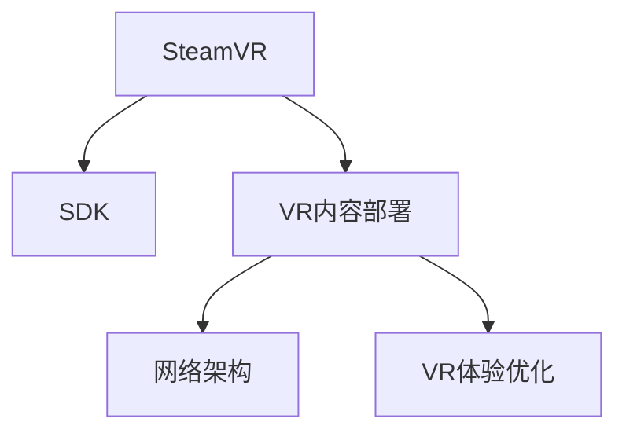

                 

# SteamVR 集成：在 Steam 上发布 VR 内容

> 关键词：SteamVR, VR内容发布,Steam平台,VR内容部署,VR开发

## 1. 背景介绍

### 1.1 问题由来

随着虚拟现实(VR)技术的日益成熟，越来越多的开发者希望将自己的VR内容部署在Steam平台上，以便接触到更广泛的受众。Steam作为全球最大的VR内容分发平台，其用户基础和技术环境对开发者来说具有巨大的吸引力。然而，将VR内容成功集成并发布到Steam上，需要开发者深入理解Steam平台的技术细节，并掌握相关的集成与部署技能。

### 1.2 问题核心关键点

SteamVR内容发布的核心在于如何将VR应用和体验无缝集成到Steam平台上，并确保其在不同硬件平台上的兼容性和流畅性。为此，开发者需要熟悉SteamVR的SDK接口，了解Steam平台的网络架构和部署机制，掌握VR内容的打包和部署工具。

### 1.3 问题研究意义

研究SteamVR内容发布，对于推动VR技术在产业界的应用，加速VR内容的商业化进程，具有重要意义：

1. **降低开发成本**：通过学习和掌握SteamVR内容发布的方法，开发者可以更快地将VR内容上线，减少前期开发和测试的时间和成本。
2. **扩大用户基础**：Steam平台庞大的用户群体为VR内容提供了天然的传播渠道，通过合理发布可以迅速扩大VR应用的受众范围。
3. **提高内容质量**：SteamVR的审核机制和用户体验反馈，可以帮助开发者快速发现和解决问题，提升内容的质量和用户体验。
4. **促进技术创新**：SteamVR平台不断更新和优化，为开发者提供了丰富的技术栈和资源，有利于推动VR技术的不断创新和突破。

## 2. 核心概念与联系

### 2.1 核心概念概述

为更好地理解SteamVR内容发布，本节将介绍几个密切相关的核心概念：

- **SteamVR**：Valve公司推出的虚拟现实平台，支持广泛的VR硬件和内容生态。SteamVR通过SDK和API，为开发者提供了丰富的工具和接口，方便内容集成和部署。
- **SDK**：Software Development Kit，软件开发工具包，包含VR设备驱动、图形渲染、音频处理等核心功能，是开发VR应用的基础。
- **VR内容部署**：将开发的VR应用和体验，通过SteamVR的API和工具，上传到Steam平台，供用户下载和体验的过程。
- **网络架构**：Steam平台基于P2P（Peer-to-Peer）和CDN（Content Delivery Network）的网络结构，确保内容的高效传输和分发。
- **VR体验优化**：通过VR内容的打包、压缩、帧率优化等手段，提升VR应用在Steam平台上的运行性能和用户体验。

这些核心概念之间的逻辑关系可以通过以下Mermaid流程图来展示：



这个流程图展示了几者之间的关联关系：

1. SteamVR通过SDK为开发者提供开发接口。
2. SDK包含了VR设备驱动和渲染引擎，是VR内容开发的基础。
3. VR内容部署是将开发的内容上传到Steam平台的过程。
4. 网络架构保证了内容的有效分发和用户体验。
5. VR体验优化则进一步提升内容的性能和用户满意度。

## 3. 核心算法原理 & 具体操作步骤
### 3.1 算法原理概述

SteamVR内容发布的核心原理基于SteamVR的SDK接口和网络架构，通过将VR应用打包和上传到Steam平台，实现内容的部署和分发。具体来说，开发者需要：

1. 使用SteamVR SDK编写VR应用代码，实现VR体验的开发。
2. 对VR应用进行打包和部署，生成适用于Steam平台的分发包。
3. 上传分发包到Steam平台，经过审核后，供用户下载和体验。
4. 通过Steam网络架构和内容分发系统，确保内容的高效传输和分发。

### 3.2 算法步骤详解

SteamVR内容发布一般包括以下几个关键步骤：

**Step 1: 准备开发环境**

- 安装SteamVR SDK，获取SteamVR开发所需的API和工具。
- 准备VR设备（如HTC Vive、Oculus Rift等），确保开发和测试环境一致。
- 配置开发环境，安装所需的软件和库，如Unity、Unreal Engine等。

**Step 2: 编写VR应用代码**

- 使用SteamVR SDK提供的API和工具，编写VR应用的代码，实现交互逻辑和渲染效果。
- 实现VR场景和用户交互，确保应用能够适配多种VR设备。
- 测试和优化VR体验，确保应用在多平台上的兼容性和性能表现。

**Step 3: 打包和部署VR应用**

- 使用SteamVR SDK的打包工具，将VR应用和配置文件打包成Steam平台支持的分发包。
- 上传分发包到Steam平台，填写应用信息，提交审核。
- 在审核通过后，应用将上线Steam商店，供用户下载和体验。

**Step 4: 内容分发与优化**

- 利用Steam平台的网络架构，分发VR应用到全球范围内的Steam用户。
- 通过CDN和P2P技术，确保内容的高效传输和下载速度。
- 利用SteamVR平台的性能优化工具，提升VR应用的运行性能和用户体验。

### 3.3 算法优缺点

SteamVR内容发布的优点包括：

1. **平台强大**：Steam平台的用户基数大，分发能力强，有助于内容的广泛传播。
2. **技术支持**：SteamVR SDK和工具丰富，开发难度较低，适合新手开发者。
3. **审核机制**：Steam平台提供严格的内容审核机制，确保内容的健康和合法性。
4. **社区活跃**：Steam平台拥有庞大的开发者社区，开发者可以通过社区获取反馈和支持。

然而，该方法也存在一些局限性：

1. **平台依赖**：内容发布依赖Steam平台，无法在其他平台上发布。
2. **成本较高**：开发和审核过程需要投入较多时间和资源。
3. **性能优化困难**：SteamVR应用需要严格遵守平台规范，难以进行深度优化。
4. **技术门槛**：新手开发者可能需要一定时间学习和适应SteamVR开发环境。

### 3.4 算法应用领域

SteamVR内容发布技术主要应用于VR游戏、教育培训、虚拟旅游、社交娱乐等领域。例如：

- VR游戏：通过Steam平台发布VR游戏，获得全球玩家的支持和评价。
- 教育培训：开发VR教育应用，帮助学生通过VR体验获取知识。
- 虚拟旅游：提供VR旅游体验，让用户在家中就能游览世界各地的名胜古迹。
- 社交娱乐：开发VR社交应用，实现沉浸式的互动和交流。

除了上述这些经典应用外，SteamVR内容发布技术还可以创新性地应用到更多场景中，如虚拟会议、医学模拟、房产展示等，为不同行业带来全新的交互方式。

## 4. 数学模型和公式 & 详细讲解  
### 4.1 数学模型构建

SteamVR内容发布过程中，涉及到的核心概念和数学模型包括：

- **VR应用部署数**：$D$：表示在Steam平台上部署的VR应用总数。
- **分发包大小**：$S$：表示每个VR应用的分发包大小，单位为字节。
- **网络传输速率**：$R$：表示Steam平台的网络传输速率，单位为比特每秒。
- **用户下载次数**：$U$：表示下载特定VR应用的次数。
- **内容分发效率**：$E$：表示Steam平台对VR内容的分配和传输效率。

根据这些概念，我们可以构建数学模型，计算SteamVR内容发布的整体性能：

$$
D = U \times E
$$

$$
E = \frac{S \times U}{R \times t}
$$

其中，$t$为分发时间，单位为秒。

### 4.2 公式推导过程

以VR应用部署为例，推导分发效率$E$的计算公式：

1. **分发包大小计算**：每个VR应用的分发包大小为$S$字节，下载次数为$U$，则分发包的总大小为$S \times U$。
2. **网络传输速率**：Steam平台的网络传输速率为$R$比特每秒，即$\frac{R}{8}$字节每秒。
3. **分发时间计算**：下载分发包所需的时间为$t$秒，则分发效率$E$为：

$$
E = \frac{S \times U}{R \times t}
$$

### 4.3 案例分析与讲解

以Oculus Rift游戏《Beat Saber》为例，分析其在Steam平台上的部署效率：

1. **分发包大小**：约为1GB，即$10^9$字节。
2. **网络传输速率**：平均网速为100Mbps，即$100 \times 10^6$比特每秒，转换为字节每秒为$12.5 \times 10^6$字节每秒。
3. **分发时间**：假设用户下载时间约为30秒，即$30$秒。

根据公式计算：

$$
E = \frac{10^9 \times U}{12.5 \times 10^6 \times 30} = \frac{10}{3} \times U
$$

由此可见，分发效率随着下载次数$U$的增加而提升，但提升幅度有限。

## 5. 项目实践：代码实例和详细解释说明
### 5.1 开发环境搭建

在进行SteamVR内容发布实践前，我们需要准备好开发环境。以下是使用Unity进行SteamVR开发的环境配置流程：

1. **安装Unity**：从官网下载并安装Unity，选择VR开发模板。
2. **安装SteamVR SDK**：从SteamVR官网下载安装SDK，并配置Unity的项目设置。
3. **配置开发环境**：安装SteamVR所需的其他库和插件，如Oculus Rift SDK、HTC Vive SDK等。
4. **设置VR设备**：连接VR设备，并确保设备驱动程序和SDK已经正确安装。

完成上述步骤后，即可在Unity中开始SteamVR开发。

### 5.2 源代码详细实现

下面是使用Unity进行SteamVR开发的一个简单示例，展示如何创建一个基础的VR应用：

1. **创建VR场景**：在Unity中创建一个空的VR场景，配置场景的分辨率和渲染质量。
2. **添加VR控制器**：在场景中添加VR控制器，用于用户交互。
3. **编写交互逻辑**：编写C#脚本，实现用户点击控制器时的交互逻辑，如旋转、移动等。
4. **打包和部署**：使用SteamVR SDK的打包工具，将VR应用打包成Steam平台支持的分发包。

```csharp
using UnityEngine;
using System.Collections;

public class VRController : MonoBehaviour
{
    public GameObject controller;
    public float rotateSpeed = 5f;
    public float moveSpeed = 2f;
    
    private void Update()
    {
        if (controller.activeSelf)
        {
            float xRotation = Input.GetAxis("Mouse X") * rotateSpeed;
            float yRotation = Input.GetAxis("Mouse Y") * rotateSpeed;
            
            transform.Rotate(xRotation, yRotation, 0f);
            
            if (Input.GetButtonDown("Fire1"))
            {
                Vector3 moveDir = transform.forward * moveSpeed * Time.deltaTime;
                transform.Translate(moveDir);
            }
        }
    }
}
```

### 5.3 代码解读与分析

让我们再详细解读一下关键代码的实现细节：

**VRController脚本**：
- `Update`方法：在每帧更新函数中，判断控制器是否激活，并根据鼠标输入进行旋转和移动操作。
- `Fire1`按钮：在控制器上添加一个点击事件，触发向前移动操作。
- 通过`controller`属性获取VR控制器，实现用户交互。

**Unity中的VR配置**：
- 在Unity的编辑器中，通过添加VR控制器组件，并配置控制器属性，可以实现控制器与场景的绑定。
- 在场景中，将VR控制器组件与脚本进行关联，实现交互逻辑的绑定。

**SteamVR打包**：
- 在Unity中，选择SteamVR提供的打包工具，将VR应用生成分发包。
- 打包过程中，可以选择不同的平台（如Oculus Rift、HTC Vive等），并设置分发包的基本信息。

### 5.4 运行结果展示

完成SteamVR应用的开发和打包后，可以通过Steam平台进行部署和分发。在Steam平台上，用户可以下载并体验该应用，并进行评价和反馈。

## 6. 实际应用场景
### 6.1 智能交互

SteamVR内容发布技术在智能交互领域有着广泛的应用，可以帮助用户通过VR设备，实现沉浸式的人机交互体验。例如：

- **虚拟会议**：通过SteamVR平台，用户可以远程参与虚拟会议，与同事和朋友进行面对面的交流。
- **医学模拟**：医学专业的学生和医生，可以通过SteamVR应用进行虚拟手术模拟和培训，提高手术技能。
- **房产展示**：房地产商可以通过SteamVR应用，提供虚拟房产展示，让用户在家中就能参观新房。

### 6.2 游戏与娱乐

SteamVR内容发布技术在游戏和娱乐领域也有着巨大的潜力，能够为用户提供全新的游戏体验和娱乐方式。例如：

- **VR游戏**：如《Beat Saber》、《Lone Echo》等，通过Steam平台发布，获得大量玩家支持。
- **VR电影和电视剧**：通过SteamVR平台发布VR电影和电视剧，提供沉浸式的观影体验。
- **虚拟音乐会**：用户可以在家中通过SteamVR体验虚拟音乐会，享受现场音乐表演的氛围。

### 6.3 教育培训

SteamVR内容发布技术在教育培训领域，同样能够发挥重要作用，提供沉浸式学习体验。例如：

- **VR教育应用**：开发VR教育应用，帮助学生通过VR体验学习科学、历史、艺术等课程。
- **模拟实验**：通过VR应用，进行化学实验、物理实验等模拟实验，提高学生的实践能力。
- **虚拟旅游**：提供VR旅游应用，让学生在家中就能游览世界各地的名胜古迹。

## 7. 工具和资源推荐
### 7.1 学习资源推荐

为了帮助开发者系统掌握SteamVR内容发布的技术基础和实践技巧，这里推荐一些优质的学习资源：

1. **SteamVR官方文档**：SteamVR官网提供的官方文档，详细介绍了SteamVR SDK的各项功能和使用说明。
2. **Unity官方教程**：Unity官网提供的VR开发教程，涵盖VR应用的开发、打包和部署等各个环节。
3. **VR开发社区**：如SteamVR开发者论坛、Unity开发者社区等，提供开发者交流和分享经验的平台。
4. **VR技术博客**：如VRzone、The Verge VR等，提供最新的VR技术资讯和行业动态。
5. **VR应用案例**：如Oculus Store、SteamVR应用库等，可以下载和参考已发布的VR应用，学习其设计和实现。

通过对这些资源的学习实践，相信你一定能够快速掌握SteamVR内容发布的精髓，并用于解决实际的VR开发问题。

### 7.2 开发工具推荐

高效的开发离不开优秀的工具支持。以下是几款用于SteamVR内容发布的常用工具：

1. **Unity**：基于Unity的VR开发环境，提供强大的3D渲染和交互功能，适合开发复杂的VR应用。
2. **SteamVR SDK**：SteamVR官方提供的SDK，包含VR设备驱动、图形渲染、音频处理等核心功能，是开发VR应用的基础。
3. **Oculus Rift SDK**：Oculus提供的VR SDK，包含丰富的VR设备支持和开发工具，适合开发Oculus Rift平台的应用。
4. **HTC Vive SDK**：HTC提供的VR SDK，支持HTC Vive平台的开发和部署，提供丰富的VR设备和环境支持。
5. **SteamVR Workshop**：Steam平台提供的开发工具，支持在Steam平台上发布和更新VR应用。

合理利用这些工具，可以显著提升SteamVR内容发布的开发效率，加快创新迭代的步伐。

### 7.3 相关论文推荐

SteamVR内容发布技术的发展源于学界的持续研究。以下是几篇奠基性的相关论文，推荐阅读：

1. **SteamVR官方文档**：SteamVR官网提供的官方文档，详细介绍了SteamVR SDK的各项功能和使用说明。
2. **Unity官方教程**：Unity官网提供的VR开发教程，涵盖VR应用的开发、打包和部署等各个环节。
3. **VR开发社区**：如SteamVR开发者论坛、Unity开发者社区等，提供开发者交流和分享经验的平台。
4. **VR技术博客**：如VRzone、The Verge VR等，提供最新的VR技术资讯和行业动态。
5. **VR应用案例**：如Oculus Store、SteamVR应用库等，可以下载和参考已发布的VR应用，学习其设计和实现。

这些论文代表了大语言模型微调技术的发展脉络。通过学习这些前沿成果，可以帮助研究者把握学科前进方向，激发更多的创新灵感。

## 8. 总结：未来发展趋势与挑战

### 8.1 总结

本文对SteamVR内容发布方法进行了全面系统的介绍。首先阐述了SteamVR内容和发布的核心原理，明确了其开发和部署的关键步骤。其次，从原理到实践，详细讲解了SteamVR内容发布过程的各个环节，给出了实际应用的具体代码实现。同时，本文还广泛探讨了SteamVR内容发布在智能交互、游戏与娱乐、教育培训等多个领域的应用前景，展示了SteamVR平台的强大潜力。

通过本文的系统梳理，可以看到，SteamVR内容发布技术在推动VR技术在产业界的应用，加速VR内容的商业化进程方面，具有重要意义。SteamVR平台凭借其庞大的用户基础、强大的技术支持、严格的内容审核机制和活跃的开发者社区，必将在未来继续发挥重要作用，推动VR技术不断进步。

### 8.2 未来发展趋势

展望未来，SteamVR内容发布技术将呈现以下几个发展趋势：

1. **技术平台多样化**：SteamVR平台将进一步拓展VR设备的支持范围，与其他VR平台和设备实现互通和协同。
2. **内容多样化**：除了传统的游戏和娱乐内容，VR应用将涵盖教育、医疗、虚拟旅游等多个领域，带来更多的创新应用。
3. **体验优化提升**：随着技术的不断进步，VR应用的性能和用户体验将得到进一步提升，更加沉浸和流畅。
4. **用户社区建设**：SteamVR平台将加强用户社区的建设，提供丰富的内容分享、评价和反馈机制，促进开发者和用户的互动。
5. **跨平台兼容**：SteamVR应用将支持多平台兼容，实现跨设备、跨平台的用户体验，提升应用的可访问性。

这些趋势将进一步推动SteamVR平台的普及和应用，带来更多创新的VR体验和应用场景。

### 8.3 面临的挑战

尽管SteamVR内容发布技术已经取得了显著成果，但在迈向更加智能化、普适化应用的过程中，仍面临一些挑战：

1. **技术门槛较高**：SteamVR开发需要掌握多方面的技术和工具，新手开发者可能面临较大的学习曲线和开发难度。
2. **平台依赖性强**：SteamVR应用的发布依赖于Steam平台，开发者无法在其他平台上进行部署和分发。
3. **硬件兼容性**：不同VR设备可能存在硬件和软件的兼容性问题，开发者需要花费大量时间进行调试和适配。
4. **用户接受度**：尽管VR技术逐渐成熟，但部分用户对VR体验仍有疑虑，如何提高用户接受度和体验满意度，需要更多市场推广和用户体验优化。

### 8.4 研究展望

面对SteamVR内容发布技术所面临的挑战，未来的研究需要在以下几个方面寻求新的突破：

1. **开发工具简化**：开发工具和技术门槛的降低，将有助于更多开发者加入SteamVR内容开发行列。
2. **平台兼容优化**：进一步优化不同VR设备的兼容性，确保内容在不同平台上的良好体验。
3. **内容多样化探索**：探索更多VR内容的形式和应用场景，提供更多创新的应用和体验。
4. **用户体验优化**：通过改进渲染技术、交互逻辑和反馈机制，提升用户的沉浸感和体验满意度。
5. **社区建设与互动**：加强用户社区的建设，提供更多的交互和反馈机制，促进开发者和用户的互动和交流。

这些研究方向将推动SteamVR平台的不断进步，为VR技术的发展和应用带来新的突破和机遇。

## 9. 附录：常见问题与解答

**Q1：SteamVR内容发布是否适用于所有VR设备？**

A: SteamVR内容发布主要适用于支持SteamVR SDK的VR设备，如HTC Vive、Oculus Rift等。对于其他品牌的VR设备，需要开发者自行适配和优化。

**Q2：如何优化SteamVR应用的性能？**

A: 优化SteamVR应用的性能主要通过以下几种方式：
1. **渲染优化**：使用高效的渲染技术，如帧率优化、纹理压缩等，提升渲染速度。
2. **交互优化**：优化控制器和手柄的响应速度，减少用户等待时间。
3. **网络优化**：利用CDN和P2P技术，提高内容分发和下载的效率。
4. **硬件优化**：选择性能稳定的VR设备和显卡，提升整体性能。

**Q3：SteamVR内容发布需要哪些技术支持？**

A: SteamVR内容发布需要以下技术支持：
1. **SteamVR SDK**：SteamVR官方提供的SDK，包含VR设备驱动、图形渲染、音频处理等核心功能。
2. **Unity或Unreal Engine**：强大的3D渲染和交互工具，适合开发复杂的VR应用。
3. **VR设备驱动程序**：VR设备驱动程序，确保设备的稳定运行。
4. **网络传输技术**：CDN和P2P技术，确保内容的有效分发和下载速度。
5. **性能优化工具**：如帧率优化工具、渲染优化工具等，提升应用性能。

**Q4：SteamVR内容发布后的维护和更新策略有哪些？**

A: 维护和更新SteamVR应用的策略包括：
1. **定期更新**：定期检查应用是否需要更新，修复已知的问题和漏洞。
2. **用户反馈收集**：通过Steam平台的用户反馈系统，收集用户的使用体验和意见，及时进行优化和改进。
3. **性能监控**：实时监控应用的性能指标，及时发现和解决问题。
4. **版本控制**：使用版本控制工具，记录每次更新的日志和内容，方便回溯和维护。

这些策略将确保SteamVR应用在上线后能够稳定运行，并不断提升用户体验。

**Q5：SteamVR内容发布如何收费？**

A: SteamVR内容发布的收费模式主要包括：
1. **应用上架费**：应用上架Steam平台需要支付一定的费用，作为平台运营成本的一部分。
2. **销售分成**：用户购买应用后，开发者可以按照比例获得销售分成，实现盈利。
3. **广告收益**：在应用内展示广告，获得广告收益。
4. **订阅服务**：提供订阅服务，如定期更新、高级功能等，获得订阅费用。

开发者可以根据自身情况，选择适合自己的收费模式。

---

作者：禅与计算机程序设计艺术 / Zen and the Art of Computer Programming

