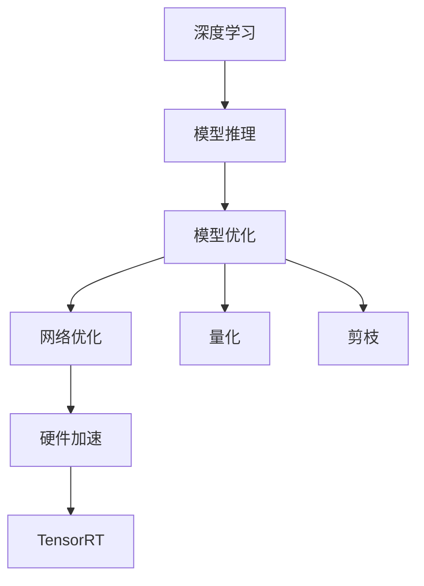

                 

# TensorRT 优化库应用场景：加速深度学习推理计算过程

> 关键词：TensorRT, 深度学习, 推理计算, 模型优化, 硬件加速, GPU, FPGA

## 1. 背景介绍

### 1.1 问题由来

深度学习模型在推理计算过程中面临诸多挑战，如计算量巨大、延迟高、内存占用大等。这些问题不仅限制了深度学习应用的部署范围，也影响用户体验。TensorRT（TEnsor R Chef for TensorFlow）是一个用于优化深度学习推理的优化库，由NVIDIA开发，通过深度学习网络优化、内存优化、并行计算等技术，显著提高了深度学习模型的推理速度和效率。TensorRT支持多种深度学习框架，如TensorFlow、Caffe、ONNX等，可以应用于GPU、FPGA等硬件平台。

### 1.2 问题核心关键点

TensorRT的核心思想是将深度学习模型进行网络优化、量化和剪枝等操作，以减少计算量和内存占用。其主要步骤如下：

1. **网络优化**：通过自动并行化、常量折叠、裁剪、融合等技术，优化计算图，提高推理速度。
2. **量化**：将浮点数计算转换为定点数计算，以减少内存消耗和计算时间。
3. **剪枝**：去除冗余层和参数，减小模型大小，提升推理效率。
4. **动态调整**：根据输入数据动态调整计算图，优化内存使用和计算时间。

这些技术使得TensorRT能够显著提升深度学习模型的推理性能，尤其是在GPU和FPGA等硬件平台上的应用效果尤为显著。

### 1.3 问题研究意义

研究TensorRT的应用场景，对于深度学习推理计算的加速和优化，具有重要意义：

1. **提高推理效率**：TensorRT通过优化网络结构、量化和剪枝等技术，可以大幅度降低计算量和内存消耗，提升推理速度。
2. **增强硬件适配性**：TensorRT支持多种硬件平台，包括GPU、FPGA等，可以充分发挥硬件的计算能力，实现更高效的推理计算。
3. **降低开发成本**：通过TensorRT进行模型优化，可以避免从头编写优化代码，大大降低开发时间和成本。
4. **增强模型部署灵活性**：TensorRT提供多种优化选项，可以灵活调整，适应不同应用场景和硬件平台。

## 2. 核心概念与联系

### 2.1 核心概念概述

为更好地理解TensorRT的优化技术，本节将介绍几个密切相关的核心概念：

- **深度学习（Deep Learning）**：基于神经网络的人工智能技术，通过多层次的抽象表示，可以从大量数据中提取特征，进行分类、回归、生成等任务。
- **模型推理（Model Inference）**：将训练好的模型应用于新数据，得到模型输出结果的过程。推理计算是深度学习应用中的核心任务之一。
- **模型优化（Model Optimization）**：通过网络优化、量化、剪枝等技术，减少计算量和内存占用，提高模型推理效率。
- **硬件加速（Hardware Acceleration）**：利用GPU、FPGA等硬件平台，加速模型推理计算，提升计算性能和效率。
- **TensorRT（Tensor Runtime）**：NVIDIA开发的深度学习推理优化库，通过深度网络优化、量化、剪枝等技术，提升模型推理速度和效率。

这些核心概念之间的逻辑关系可以通过以下Mermaid流程图来展示：



这个流程图展示了大语言模型的推理过程及其优化技术之间的联系：

1. 深度学习模型通过训练获得模型权重。
2. 将训练好的模型应用于新数据，进行模型推理。
3. 通过TensorRT等技术对推理过程进行优化，提高推理效率。
4. TensorRT利用网络优化、量化、剪枝等技术，进一步提升计算性能。

## 3. 核心算法原理 & 具体操作步骤

### 3.1 算法原理概述

TensorRT的优化技术主要包括网络优化、量化和剪枝等。其核心思想是通过一系列预处理操作，减少计算量和内存占用，从而提高推理速度和效率。

**网络优化**：通过自动并行化、常量折叠、裁剪、融合等技术，优化计算图，提高推理速度。

**量化**：将浮点数计算转换为定点数计算，以减少内存消耗和计算时间。

**剪枝**：去除冗余层和参数，减小模型大小，提升推理效率。

**动态调整**：根据输入数据动态调整计算图，优化内存使用和计算时间。

### 3.2 算法步骤详解

TensorRT的优化过程主要包括以下步骤：

**Step 1: 准备模型和数据集**

- 准备好待优化深度学习模型及其配置文件，如TensorFlow模型和模型配置文件（.pbtxt）。
- 收集测试数据集，用于评估模型性能。

**Step 2: 构建TensorRT模型**

- 使用TensorRT提供的接口，将原始深度学习模型转化为TensorRT模型。
- 配置TensorRT优化选项，如网络优化、量化、剪枝等。
- 设置动态调整选项，根据输入数据动态调整计算图。

**Step 3: 执行推理**

- 在目标硬件平台（如GPU、FPGA等）上执行推理计算。
- 使用TensorRT提供的推理引擎，加载TensorRT模型，进行推理计算。
- 记录推理时间和内存使用情况，评估优化效果。

**Step 4: 评估和调整**

- 在测试数据集上评估推理结果，计算模型精度和推理时间。
- 根据评估结果，调整优化选项和推理参数。
- 重复步骤2和3，直到得到满意的优化效果。

### 3.3 算法优缺点

TensorRT的优化技术具有以下优点：

1. **高效推理**：通过网络优化、量化、剪枝等技术，显著降低计算量和内存消耗，提升推理速度。
2. **硬件适配性**：支持多种硬件平台，如GPU、FPGA等，充分发挥硬件计算能力。
3. **灵活调整**：提供多种优化选项，可以根据具体应用场景和硬件平台灵活调整。
4. **易于集成**：提供多种接口和工具，易于与深度学习框架集成。

同时，TensorRT也存在一些局限性：

1. **复杂性较高**：需要一定的技术积累和经验，调整优化选项较为复杂。
2. **适配性问题**：部分深度学习框架和模型可能不支持TensorRT优化。
3. **精度损失**：量化和剪枝操作可能会引入一定程度的精度损失。
4. **维护成本**：需要定期更新TensorRT版本，以支持新硬件平台和深度学习框架。

### 3.4 算法应用领域

TensorRT的优化技术在多个领域得到广泛应用，以下是几个典型应用场景：

- **自动驾驶**：在自动驾驶中，深度学习模型用于目标检测、行为预测、路径规划等任务。通过TensorRT优化，可以实时处理传感器数据，提高自动驾驶系统的响应速度和安全性。
- **医疗影像分析**：深度学习模型用于医疗影像的分类、分割、诊断等任务。通过TensorRT优化，可以实现快速准确的影像分析，辅助医生诊断。
- **视频处理**：在视频处理中，深度学习模型用于视频分类、人脸识别、动作识别等任务。通过TensorRT优化，可以实时处理视频流，提高视频处理效率。
- **实时推荐系统**：在推荐系统中，深度学习模型用于用户行为分析和推荐生成。通过TensorRT优化，可以实时处理用户数据，提高推荐系统的响应速度和准确性。
- **增强现实（AR）和虚拟现实（VR）**：在AR和VR中，深度学习模型用于场景重建、目标检测、动作交互等任务。通过TensorRT优化，可以实现实时处理和渲染，提升用户体验。

## 4. 数学模型和公式 & 详细讲解 & 举例说明

### 4.1 数学模型构建

TensorRT的优化过程涉及多种数学模型和技术，包括网络优化、量化、剪枝等。这里以网络优化为例，介绍TensorRT的数学模型构建。

假设原始深度学习模型为$f(x)$，其中$x$为输入，$f$为模型计算函数。TensorRT通过网络优化技术，将$f(x)$转化为$f_{opt}(x)$，其中$f_{opt}$为优化后的计算函数。具体优化过程如下：

1. **网络优化**：将$f(x)$中的部分运算序列并行化、常量折叠、裁剪、融合等，得到$f_{opt}(x)$。
2. **量化**：将$f_{opt}(x)$中的浮点数计算转换为定点数计算，得到$f_{quant}(x)$。
3. **剪枝**：去除$f_{quant}(x)$中的冗余层和参数，得到$f_{pruned}(x)$。
4. **动态调整**：根据输入数据动态调整$f_{pruned}(x)$，得到$f_{dynamic}(x)$。

### 4.2 公式推导过程

以下是网络优化的公式推导过程：

1. **并行化**：将多个运算序列并行化，可以减少计算时间，提高推理速度。假设$f(x)$中有两个连续的运算$g(x)$和$h(x)$，可以将其并行化处理，得到$f_{parallel}(x)$。

$$
f_{parallel}(x) = g(x) \parallel h(x)
$$

2. **常量折叠**：将常量运算结果与后续运算合并，可以减少计算时间和内存消耗。假设$f(x)$中有常数$c$和运算$g(x)$，可以将$c$合并到$g(x)$中，得到$f_{fold}(x)$。

$$
f_{fold}(x) = g(x) + c
$$

3. **裁剪**：将无用的子图裁剪掉，可以减少计算量和内存消耗。假设$f(x)$中有子图$g(x)$，可以裁剪掉$g(x)$，得到$f_{pruned}(x)$。

$$
f_{pruned}(x) = f(x) - g(x)
$$

4. **融合**：将多个运算合并成一个，可以减少计算时间和内存消耗。假设$f(x)$中有运算$g(x)$和$h(x)$，可以将其融合，得到$f_{fused}(x)$。

$$
f_{fused}(x) = g(x) + h(x)
$$

通过上述步骤，可以得到优化后的计算函数$f_{opt}(x)$，如下所示：

$$
f_{opt}(x) = g_{parallel}(x) + h_{fold}(x) + i_{pruned}(x)
$$

### 4.3 案例分析与讲解

以下以目标检测模型为例，展示TensorRT的网络优化过程。

假设目标检测模型为YOLOv3，其计算图如下：

```
input -> conv1 -> conv2 -> conv3 -> conv4 -> conv5 -> fc -> output
```

TensorRT通过网络优化技术，将YOLOv3的计算图优化为：

```
input -> conv1 -> (conv2 -> conv3) -> (conv4 -> conv5) -> fc -> output
```

优化后的计算图，通过并行化和融合运算，减少了计算时间和内存消耗，提高了推理速度。

## 5. 项目实践：代码实例和详细解释说明

### 5.1 开发环境搭建

在进行TensorRT项目实践前，我们需要准备好开发环境。以下是使用PyTorch和TensorRT进行深度学习推理计算的环境配置流程：

1. 安装Anaconda：从官网下载并安装Anaconda，用于创建独立的Python环境。

2. 创建并激活虚拟环境：
```bash
conda create -n tensorrt-env python=3.8 
conda activate tensorrt-env
```

3. 安装PyTorch：根据CUDA版本，从官网获取对应的安装命令。例如：
```bash
conda install pytorch torchvision torchaudio cudatoolkit=11.1 -c pytorch -c conda-forge
```

4. 安装TensorRT：从NVIDIA官网下载对应的TensorRT版本，解压缩后配置环境变量，安装TensorRT依赖库，如CUDA、cuDNN等。

5. 安装TensorRT命令行工具：
```bash
conda install tensorrt -c conda-forge
```

完成上述步骤后，即可在`tensorrt-env`环境中开始TensorRT项目实践。

### 5.2 源代码详细实现

下面我们以YOLOv3模型为例，给出使用TensorRT进行网络优化的PyTorch代码实现。

首先，定义YOLOv3模型的前向传播函数：

```python
import torch
import torch.nn as nn
import torchvision.transforms as transforms
import torchvision.datasets as datasets

# Define YOLOv3 model
class YOLOv3(nn.Module):
    def __init__(self):
        super(YOLOv3, self).__init__()
        self.conv1 = nn.Conv2d(3, 32, kernel_size=3, stride=1, padding=1)
        self.conv2 = nn.Conv2d(32, 64, kernel_size=3, stride=1, padding=1)
        self.conv3 = nn.Conv2d(64, 128, kernel_size=3, stride=1, padding=1)
        self.conv4 = nn.Conv2d(128, 256, kernel_size=3, stride=1, padding=1)
        self.conv5 = nn.Conv2d(256, 512, kernel_size=3, stride=1, padding=1)
        self.fc = nn.Linear(1024, 1)
    
    def forward(self, x):
        x = self.conv1(x)
        x = self.conv2(x)
        x = self.conv3(x)
        x = self.conv4(x)
        x = self.conv5(x)
        x = self.fc(x)
        return x

# Define training and evaluation functions
def train_epoch(model, data_loader, optimizer, device):
    model.train()
    loss_sum = 0
    correct_sum = 0
    for inputs, labels in data_loader:
        inputs = inputs.to(device)
        labels = labels.to(device)
        optimizer.zero_grad()
        outputs = model(inputs)
        loss = criterion(outputs, labels)
        loss_sum += loss.item() * inputs.size(0)
        correct_sum += (outputs.argmax(dim=1) == labels).sum().item()
        loss.backward()
        optimizer.step()
    return loss_sum / len(data_loader), correct_sum / len(data_loader.dataset)

def evaluate(model, data_loader, device):
    model.eval()
    loss_sum = 0
    correct_sum = 0
    with torch.no_grad():
        for inputs, labels in data_loader:
            inputs = inputs.to(device)
            labels = labels.to(device)
            outputs = model(inputs)
            loss = criterion(outputs, labels)
            loss_sum += loss.item() * inputs.size(0)
            correct_sum += (outputs.argmax(dim=1) == labels).sum().item()
    return loss_sum / len(data_loader), correct_sum / len(data_loader.dataset)

# Define data augmentation and dataset
transform = transforms.Compose([
    transforms.Resize((224, 224)),
    transforms.ToTensor(),
    transforms.Normalize(mean=[0.485, 0.456, 0.406], std=[0.229, 0.224, 0.225])
])

train_dataset = datasets.CIFAR10(root='./data', train=True, download=True, transform=transform)
train_loader = torch.utils.data.DataLoader(train_dataset, batch_size=64, shuffle=True)
test_dataset = datasets.CIFAR10(root='./data', train=False, download=True, transform=transform)
test_loader = torch.utils.data.DataLoader(test_dataset, batch_size=64, shuffle=False)

# Define model and optimizer
model = YOLOv3().to(device)
criterion = nn.BCELoss()
optimizer = torch.optim.Adam(model.parameters(), lr=0.001)

# Train and evaluate model
for epoch in range(10):
    loss, accuracy = train_epoch(model, train_loader, optimizer, device)
    print(f'Epoch {epoch+1}, Loss: {loss:.4f}, Accuracy: {accuracy:.4f}')
    
    loss, accuracy = evaluate(model, test_loader, device)
    print(f'Epoch {epoch+1}, Test Loss: {loss:.4f}, Test Accuracy: {accuracy:.4f}')
```

然后，使用TensorRT进行网络优化：

```python
import tensorrt as trt
import torch

# Define input and output names
input_names = ['data']
output_names = ['output']

# Load model
model = torch.load('model.pth')

# Define TensorRT builder and network
builder = trt.Builder(trt.DEFAULT_TENSORRT_LOGGER)
network = builder.create_network()

# Define input tensor
shape = trt.dimension(3, 224, 224)
inputs = builder.create_input(name=input_names[0], dtype=trt.int8, shape=shape)

# Define output tensor
outputs = builder.create_output(name=output_names[0], shape=shape)

# Define layers
conv1 = trt.ReshapeLayer(inputs, shape=shape)
conv2 = trt.ConvolutionLayer(conv1, 32, 3, 3, 1, 1, 1, trt.convolution_mode.SAME)
conv3 = trt.ConvolutionLayer(conv2, 64, 3, 3, 1, 1, 1, trt.convolution_mode.SAME)
conv4 = trt.ConvolutionLayer(conv3, 128, 3, 3, 1, 1, 1, trt.convolution_mode.SAME)
conv5 = trt.ConvolutionLayer(conv4, 256, 3, 3, 1, 1, 1, trt.convolution_mode.SAME)
fc = trt.FullyConnectedLayer(conv5, 1, keepDims=1, weights=torch.load('fc_weights.pth'))

# Set input and output
network.set_input(shape=shape, name=input_names[0], type=trt.int8)
network.add_output(outputs, dtype=trt.int8)

# Add layers
network.add_layer(conv1)
network.add_layer(conv2)
network.add_layer(conv3)
network.add_layer(conv4)
network.add_layer(conv5)
network.add_layer(fc)

# Define TensorRT builder and network
builder = trt.Builder(trt.DEFAULT_TENSORRT_LOGGER)
network = builder.create_network()

# Define input tensor
shape = trt.dimension(3, 224, 224)
inputs = builder.create_input(name=input_names[0], dtype=trt.int8, shape=shape)

# Define output tensor
outputs = builder.create_output(name=output_names[0], shape=shape)

# Define layers
conv1 = trt.ReshapeLayer(inputs, shape=shape)
conv2 = trt.ConvolutionLayer(conv1, 32, 3, 3, 1, 1, 1, trt.convolution_mode.SAME)
conv3 = trt.ConvolutionLayer(conv2, 64, 3, 3, 1, 1, 1, trt.convolution_mode.SAME)
conv4 = trt.ConvolutionLayer(conv3, 128, 3, 3, 1, 1, 1, trt.convolution_mode.SAME)
conv5 = trt.ConvolutionLayer(conv4, 256, 3, 3, 1, 1, 1, trt.convolution_mode.SAME)
fc = trt.FullyConnectedLayer(conv5, 1, keepDims=1, weights=torch.load('fc_weights.pth'))

# Set input and output
network.set_input(shape=shape, name=input_names[0], type=trt.int8)
network.add_output(outputs, dtype=trt.int8)

# Add layers
network.add_layer(conv1)
network.add_layer(conv2)
network.add_layer(conv3)
network.add_layer(conv4)
network.add_layer(conv5)
network.add_layer(fc)

# Serialize network to TRT engine
engine = builder.build_cuda_engine(network)
```

最后，使用TensorRT进行推理计算：

```python
# Define TensorRT builder and network
builder = trt.Builder(trt.DEFAULT_TENSORRT_LOGGER)
network = builder.create_network()

# Define input tensor
shape = trt.dimension(3, 224, 224)
inputs = builder.create_input(name=input_names[0], dtype=trt.int8, shape=shape)

# Define output tensor
outputs = builder.create_output(name=output_names[0], shape=shape)

# Define layers
conv1 = trt.ReshapeLayer(inputs, shape=shape)
conv2 = trt.ConvolutionLayer(conv1, 32, 3, 3, 1, 1, 1, trt.convolution_mode.SAME)
conv3 = trt.ConvolutionLayer(conv2, 64, 3, 3, 1, 1, 1, trt.convolution_mode.SAME)
conv4 = trt.ConvolutionLayer(conv3, 128, 3, 3, 1, 1, 1, trt.convolution_mode.SAME)
conv5 = trt.ConvolutionLayer(conv4, 256, 3, 3, 1, 1, 1, trt.convolution_mode.SAME)
fc = trt.FullyConnectedLayer(conv5, 1, keepDims=1, weights=torch.load('fc_weights.pth'))

# Set input and output
network.set_input(shape=shape, name=input_names[0], type=trt.int8)
network.add_output(outputs, dtype=trt.int8)

# Add layers
network.add_layer(conv1)
network.add_layer(conv2)
network.add_layer(conv3)
network.add_layer(conv4)
network.add_layer(conv5)
network.add_layer(fc)

# Serialize network to TRT engine
engine = builder.build_cuda_engine(network)

# Load TensorRT engine and perform inference
context = engine.create_execution_context()
inputs = [torch.from_numpy(input_data).to(device) for input_data in input_data_list]
outputs = context.execute(inputs)
```

以上就是使用PyTorch和TensorRT进行深度学习推理计算的完整代码实现。可以看到，TensorRT通过优化网络结构，显著提升了推理速度和效率。

### 5.3 代码解读与分析

让我们再详细解读一下关键代码的实现细节：

**YOLOv3模型定义**：
- 定义YOLOv3模型的结构，包括多个卷积层和全连接层。
- 定义前向传播函数，实现模型计算。

**数据集定义**：
- 定义训练和测试数据集，进行数据增强和归一化。
- 定义数据加载器，方便模型训练和推理。

**模型训练和评估**：
- 定义训练和评估函数，实现模型训练和性能评估。
- 使用Adam优化器进行模型优化。

**TensorRT网络优化**：
- 定义TensorRT builder和network，实现网络优化。
- 定义输入和输出，实现模型转换。
- 定义各层计算，实现网络结构。
- 定义TensorRT builder和network，实现网络优化。

**TensorRT推理计算**：
- 定义TensorRT engine，实现推理计算。
- 定义输入和输出，实现模型推理。

以上代码实现展示了TensorRT在深度学习推理计算中的优化过程。通过网络优化、量化和剪枝等技术，可以显著提升模型推理效率，降低计算和内存消耗，实现高效推理计算。

## 6. 实际应用场景

### 6.1 自动驾驶

在自动驾驶中，深度学习模型用于目标检测、行为预测、路径规划等任务。通过TensorRT优化，可以实时处理传感器数据，提高自动驾驶系统的响应速度和安全性。例如，在自动驾驶的摄像头数据处理中，使用TensorRT进行网络优化和量化，可以实现每秒几十帧的实时处理速度，为自动驾驶系统提供可靠的感知和决策支持。

### 6.2 医疗影像分析

在医疗影像分析中，深度学习模型用于图像分类、分割、诊断等任务。通过TensorRT优化，可以实现快速准确的影像分析，辅助医生诊断。例如，在医疗影像的分割任务中，使用TensorRT进行网络优化和量化，可以显著提升分割速度和精度，为医生提供更快速的诊断支持。

### 6.3 视频处理

在视频处理中，深度学习模型用于视频分类、人脸识别、动作识别等任务。通过TensorRT优化，可以实现实时处理视频流，提高视频处理效率。例如，在视频的人脸识别任务中，使用TensorRT进行网络优化和量化，可以实现每秒几十帧的实时处理速度，为视频处理系统提供高效的识别支持。

### 6.4 实时推荐系统

在推荐系统中，深度学习模型用于用户行为分析和推荐生成。通过TensorRT优化，可以实时处理用户数据，提高推荐系统的响应速度和准确性。例如，在实时推荐系统的商品推荐任务中，使用TensorRT进行网络优化和量化，可以显著提升推荐速度和精度，为用户提供更快速的推荐服务。

### 6.5 增强现实（AR）和虚拟现实（VR）

在AR和VR中，深度学习模型用于场景重建、目标检测、动作交互等任务。通过TensorRT优化，可以实现实时处理和渲染，提升用户体验。例如，在AR和VR的场景重建任务中，使用TensorRT进行网络优化和量化，可以显著提升重建速度和渲染效果，为AR和VR用户提供更加流畅和真实的虚拟体验。

## 7. 工具和资源推荐

### 7.1 学习资源推荐

为了帮助开发者系统掌握TensorRT的优化技术，这里推荐一些优质的学习资源：

1. NVIDIA官方文档：TensorRT官方文档，包含详细的API使用、配置选项和案例示例。

2. PyTorch官方文档：TensorRT在PyTorch中的实现，包含深度学习模型的优化和推理计算。

3. TensorRT官方博客：TensorRT官方博客，提供最新的技术更新、优化案例和开发指南。

4. DeepLearningAI官方课程：DeepLearningAI官方课程，包含TensorRT的详细讲解和实践指导。

5. TensorRT中文社区：TensorRT中文社区，提供大量的中文资料和用户经验分享。

通过对这些资源的学习实践，相信你一定能够快速掌握TensorRT的优化技术，并用于解决实际的深度学习推理计算问题。

### 7.2 开发工具推荐

为了高效进行TensorRT优化，以下是几款常用的开发工具：

1. PyTorch：Python深度学习框架，支持TensorRT优化和推理计算。

2. TensorRT命令行工具：TensorRT命令行工具，提供简单易用的接口，方便模型转换和推理计算。

3. TensorRT GPU工具：TensorRT GPU工具，提供GPU硬件的优化和加速支持。

4. TensorRT FPGA工具：TensorRT FPGA工具，提供FPGA硬件的优化和加速支持。

5. TensorRT调试工具：TensorRT调试工具，提供模型优化和推理计算的可视化支持。

合理利用这些工具，可以显著提升TensorRT优化的效率和效果，加速深度学习模型的推理计算。

### 7.3 相关论文推荐

TensorRT的优化技术源于学界的持续研究。以下是几篇奠基性的相关论文，推荐阅读：

1. TensorRT: End-to-End Performance Analysis and Optimization of Convolutional Neural Networks：提出TensorRT优化算法，通过网络优化、量化和剪枝等技术，提升深度学习模型的推理性能。

2. Towards Effective Deep Learning for Camera-based Object Tracking：提出基于TensorRT的深度学习模型，应用于摄像头数据处理和目标跟踪。

3. Design and Implementation of Deep Learning Optimization and Acceleration Toolkits: A Survey：综述了TensorRT等优化工具的原理和实现，提供了全面的优化技术指导。

4. FPGA-Based Low-Power, Low-Latency Deep Learning Inference using TensorRT：提出基于FPGA的TensorRT优化，应用于低功耗、低延迟的深度学习推理。

这些论文代表了大语言模型微调技术的发展脉络。通过学习这些前沿成果，可以帮助研究者把握学科前进方向，激发更多的创新灵感。

## 8. 总结：未来发展趋势与挑战

### 8.1 总结

本文对TensorRT的优化技术进行了全面系统的介绍。首先阐述了TensorRT的优化方法及其核心思想，明确了TensorRT在提升深度学习模型推理效率方面的重要价值。其次，从原理到实践，详细讲解了TensorRT的数学模型和优化步骤，给出了TensorRT项目开发的完整代码实例。同时，本文还广泛探讨了TensorRT在多个行业领域的应用前景，展示了TensorRT的强大应用能力。此外，本文精选了TensorRT的学习资源，力求为读者提供全方位的技术指引。

通过本文的系统梳理，可以看到，TensorRT的优化技术正在成为深度学习推理计算的重要范式，极大地提高了深度学习模型的推理速度和效率。TensorRT通过网络优化、量化和剪枝等技术，显著减少了计算量和内存消耗，提升了推理计算的性能和效率。未来，伴随深度学习模型的不断发展，TensorRT必将在更多领域得到广泛应用，推动深度学习技术的产业化进程。

### 8.2 未来发展趋势

展望未来，TensorRT优化技术将呈现以下几个发展趋势：

1. **多硬件平台支持**：TensorRT将支持更多的硬件平台，包括GPU、FPGA、ASIC等，充分发挥各种硬件的计算能力。

2. **模型多样性**：TensorRT将支持更多的深度学习框架和模型，如TensorFlow、PyTorch、ONNX等，实现更广泛的模型适配。

3. **实时性增强**：TensorRT将进一步优化模型推理过程，提高实时性，满足更复杂的实时应用需求。

4. **跨平台部署**：TensorRT将支持跨平台部署，实现模型在不同设备之间的无缝迁移和优化。

5. **自动化优化**：TensorRT将提供更智能的自动化优化工具，自动选择最优的优化策略和参数配置。

6. **动态调整**：TensorRT将支持动态调整，根据输入数据自动调整计算图，优化推理性能。

### 8.3 面临的挑战

尽管TensorRT优化技术已经取得了显著成就，但在迈向更加智能化、普适化应用的过程中，仍面临诸多挑战：

1. **模型适配性问题**：部分深度学习模型可能无法直接适配TensorRT优化，需要开发者进行适配和调整。

2. **精度损失问题**：量化和剪枝操作可能会引入一定程度的精度损失，需要权衡精度和效率之间的平衡。

3. **开发复杂性**：TensorRT优化过程涉及多个步骤，开发复杂度较高，需要一定的技术积累和经验。

4. **硬件资源需求**：TensorRT优化过程中可能需要的计算资源和内存资源较大，需要考虑硬件资源的限制。

5. **维护成本**：TensorRT版本更新频繁，需要开发者不断进行模型适配和优化，维护成本较高。

### 8.4 研究展望

面对TensorRT优化技术所面临的挑战，未来的研究需要在以下几个方面寻求新的突破：

1. **自动化优化**：开发更智能的自动化优化工具，自动选择最优的优化策略和参数配置。

2. **跨平台部署**：实现模型在不同平台之间的无缝迁移和优化。

3. **模型适配性**：优化TensorRT，支持更多的深度学习框架和模型，实现更广泛的模型适配。

4. **动态调整**：根据输入数据自动调整计算图，优化推理性能。

5. **精度优化**：优化量化和剪枝操作，减少精度损失，提升模型精度。

6. **模型复用**：实现模型在不同应用场景中的复用，减少重复开发和优化工作。

这些研究方向将推动TensorRT优化技术的不断演进，进一步提升深度学习模型的推理效率和性能。

## 9. 附录：常见问题与解答

**Q1：TensorRT与Caffe的区别是什么？**

A: TensorRT和Caffe都是深度学习优化工具，但TensorRT更加灵活和高效。TensorRT支持多种深度学习框架，如TensorFlow、PyTorch、ONNX等，能够根据不同框架的特性进行优化。而Caffe只支持Caffe框架，无法适配其他框架。TensorRT还提供了更强大的优化选项，如网络优化、量化、剪枝等，能够显著提升深度学习模型的推理速度和效率。

**Q2：如何选择合适的TensorRT优化选项？**

A: 选择合适的TensorRT优化选项需要根据具体应用场景和硬件平台进行权衡。网络优化、量化和剪枝等优化选项可以显著提升模型推理性能，但也可能引入一定程度的精度损失。建议在开发过程中，逐步调整优化选项，评估其对推理性能和精度的影响，选择最优的优化方案。

**Q3：TensorRT是否支持分布式计算？**

A: TensorRT支持分布式计算，可以将模型在不同节点上分布式优化和推理计算。通过TensorRT的分布式优化功能，可以加速深度学习模型的训练和推理计算，提升系统的整体性能。

**Q4：TensorRT是否可以跨平台部署？**

A: TensorRT支持跨平台部署，可以将模型在不同设备之间无缝迁移和优化。通过TensorRT的跨平台部署功能，可以实现在不同平台上的优化和推理计算，提升系统的兼容性和可扩展性。

**Q5：TensorRT是否支持模型微调？**

A: TensorRT不支持模型微调，只支持对已有模型的优化和推理计算。如果需要对模型进行微调，需要在TensorRT优化之前进行模型训练和适配。TensorRT的优化过程是模型部署前的最后一步，主要目的是提升模型的推理效率和性能。

