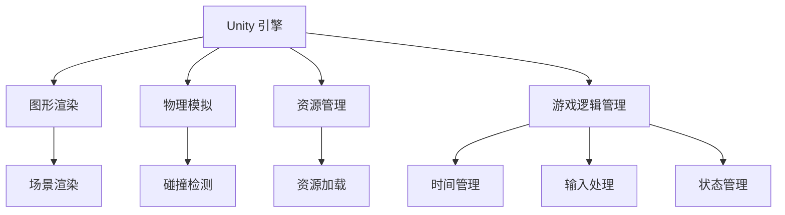

                 

# Unity 游戏开发引擎：创建 3D 游戏

> 关键词：Unity, 3D 游戏开发, 游戏引擎, 图形渲染, 物理模拟, 资源管理, 游戏逻辑

## 1. 背景介绍

### 1.1 问题由来

Unity 是目前全球最流行的游戏引擎之一，广泛应用于各类平台和游戏类型。它支持 2D 和 3D 游戏开发，提供了强大的图形渲染、物理模拟、资源管理和游戏逻辑管理等工具。本文将通过详细介绍 Unity 引擎的核心概念和关键技术，带领读者逐步掌握如何使用 Unity 引擎创建 3D 游戏。

## 2. 核心概念与联系

### 2.1 核心概念概述

为更好地理解 Unity 引擎，本节将介绍几个关键概念及其相互联系：

- **Unity 引擎**：Unity 是一款跨平台的游戏引擎，支持 2D 和 3D 游戏开发，具备强大的图形渲染、物理模拟、资源管理和游戏逻辑管理等功能。
- **图形渲染**：指将游戏场景中的对象转换为可显示在屏幕上的图像的过程。Unity 提供了内置的渲染器，支持 PBR 着色模型和光照计算。
- **物理模拟**：指通过物理引擎模拟物体间的交互，如碰撞、重力、摩擦等。Unity 提供了内置的物理引擎，支持刚体、软体等物理模型的模拟。
- **资源管理**：指对游戏资源进行加载、卸载、缓存等操作，以提高性能。Unity 提供了资源包管理器和预加载机制，方便资源的管理。
- **游戏逻辑管理**：指对游戏运行时的控制流程进行管理，如时间管理、输入处理、状态管理等。Unity 提供了事件系统和状态管理工具，方便游戏逻辑的编写和处理。

这些核心概念之间的逻辑关系可以通过以下 Mermaid 流程图来展示：



这个流程图展示出 Unity 引擎的核心组件及其相互关系：

1. Unity 引擎作为整个游戏的核心，通过内置的图形渲染、物理模拟、资源管理和游戏逻辑管理等组件，支持游戏开发的全过程。
2. 图形渲染组件负责将场景中的对象转换为可显示的图像，通过内置的渲染器实现 PBR 着色模型和光照计算。
3. 物理模拟组件负责模拟物体间的交互，如碰撞、重力、摩擦等，通过内置的物理引擎实现刚体、软体等物理模型的模拟。
4. 资源管理组件负责对游戏资源进行加载、卸载、缓存等操作，以提高性能，通过内置的资源包管理器和预加载机制实现。
5. 游戏逻辑管理组件负责对游戏运行时的控制流程进行管理，如时间管理、输入处理、状态管理等，通过内置的事件系统和状态管理工具实现。

## 3. 核心算法原理 & 具体操作步骤

### 3.1 算法原理概述

Unity 引擎的 3D 游戏开发过程主要包括以下几个步骤：

1. **场景设计**：通过 Unity 编辑器设计游戏场景，包括场景布局、环境光照、地形纹理等。
2. **模型加载**：将 3D 模型、贴图、材质等资源加载到场景中。
3. **物理模拟**：通过物理引擎模拟物体间的交互，如碰撞、重力、摩擦等。
4. **渲染处理**：将场景中的对象转换为可显示的图像，进行 PBR 着色模型和光照计算。
5. **游戏逻辑实现**：编写游戏逻辑代码，实现角色行为、交互、动画等。
6. **用户交互**：处理用户输入，如键盘、鼠标、手柄等，控制游戏进程。

### 3.2 算法步骤详解

#### 3.2.1 场景设计

1. **创建场景**：
   - 打开 Unity 编辑器，创建一个新的 3D 场景。
   - 使用内置的网格工具（Grid）和立方体工具（Cube）创建基本的地面和平面。

2. **添加环境**：
   - 通过拖拽方式添加天空盒、太阳灯等环境光照，设置天空盒材质和光源属性。
   - 导入地平线纹理、地面纹理等，进行纹理映射和光照设置。

3. **添加地形**：
   - 导入地形纹理，通过地形工具（Terrain）创建地形。
   - 调整地形高度、平滑度、贴图等属性，使地形更加逼真。

#### 3.2.2 模型加载

1. **导入模型**：
   - 通过拖拽方式导入 3D 模型，设置模型位置和旋转。
   - 导入贴图、材质等资源，进行纹理映射和光照设置。

2. **创建动画**：
   - 使用动画工具（Animator）创建角色动画。
   - 添加骨骼（Animator Controller），定义动画状态和转换条件。

3. **物理模拟**：
   - 创建刚体（Rigidbody）组件，设置物体的质量和碰撞属性。
   - 创建碰撞器（Collider）组件，定义物体的碰撞范围。

#### 3.2.3 渲染处理

1. **材质设置**：
   - 通过材质编辑器（Material）创建 PBR 材质，设置反射率、金属度、粗糙度等参数。
   - 导入贴图和纹理，进行纹理映射和光照设置。

2. **光照计算**：
   - 设置光源（Light），调整光源类型、强度、阴影等属性。
   - 使用内置的阴影贴图（Shadow Map）进行动态阴影计算。

3. **渲染管线**：
   - 通过渲染设置（Render Settings）选择渲染管线（Render Pipeline），如内置的 Universal Render Pipeline (URP)。
   - 调整渲染管线参数，如采样率、阴影质量、贴图分辨率等。

#### 3.2.4 游戏逻辑实现

1. **编写脚本**：
   - 使用内置的脚本编辑器（Script Editor）编写 C# 脚本。
   - 编写游戏逻辑代码，如角色控制、碰撞检测、状态管理等。

2. **事件处理**：
   - 使用事件系统（Event System）处理用户输入，如键盘、鼠标、手柄等。
   - 使用事件触发器（Event Trigger）实现点击、拖拽等用户交互。

3. **状态管理**：
   - 使用状态管理工具（State Machine）管理角色状态，如 idle、walk、jump 等。
   - 使用状态机控制器（State Machine Controller）定义状态转换条件。

#### 3.2.5 用户交互

1. **输入处理**：
   - 使用输入系统（Input System）处理用户输入，如键盘、鼠标、手柄等。
   - 通过事件触发器（Event Trigger）实现点击、拖拽等用户交互。

2. **控制逻辑**：
   - 编写游戏控制逻辑，如角色移动、攻击、跳跃等。
   - 使用物理引擎（Physics）实现物体的碰撞检测和物理模拟。

3. **动画控制**：
   - 通过动画控制器（Animator Controller）控制角色的动画状态。
   - 使用动画过渡（Animation Transition）实现动画之间的平滑转换。

### 3.3 算法优缺点

Unity 引擎的 3D 游戏开发过程具有以下优点：

1. **跨平台支持**：Unity 支持多个平台，包括 PC、手机、Xbox 等，便于游戏的跨平台开发和发布。
2. **强大的工具集**：Unity 提供了强大的图形渲染、物理模拟、资源管理和游戏逻辑管理工具，方便开发者进行游戏开发。
3. **社区支持**：Unity 拥有庞大的开发者社区，丰富的资源和插件库，便于开发者获取帮助和资源。
4. **高效开发**：Unity 提供了可视化编辑器和强大的脚本语言 C#，便于开发者快速开发游戏。

同时，该方法也存在以下缺点：

1. **学习曲线较陡峭**：Unity 的内置工具和 C# 语言有一定学习曲线，需要一定时间掌握。
2. **性能优化困难**：Unity 的渲染管线和物理引擎性能较高，但需要开发者进行深入优化才能达到最优性能。
3. **资源消耗较大**：Unity 的渲染管线和物理引擎消耗大量资源，需要高性能硬件支持。

尽管存在这些缺点，但就目前而言，Unity 引擎仍是最主流的游戏引擎之一，广泛用于各类平台和游戏类型的开发。

### 3.4 算法应用领域

Unity 引擎的 3D 游戏开发技术已经广泛应用于多个领域，例如：

- **PC 游戏**：如《星际争霸》、《巫师 3》等，支持复杂的图形渲染和物理模拟。
- **手机游戏**：如《王者荣耀》、《绝地求生》等，支持跨平台开发和优化。
- **虚拟现实（VR）游戏**：如《Beat Saber》、《Job Simulator》等，支持沉浸式体验和物理模拟。
- **增强现实（AR）游戏**：如《Pokémon GO》、《ARKit》等，支持与现实世界交互的虚拟元素。
- **教育游戏**：如《Little Nightmares》、《Lab Rat Adventure》等，支持教育内容的融入和交互设计。
- **商业游戏**：如《星巴克》、《WWE 2K》等，支持商业推广和互动体验。

除了这些领域外，Unity 引擎还广泛应用于虚拟现实、增强现实、虚拟训练、游戏教学等领域，为开发者提供了丰富的开发场景。

## 4. 数学模型和公式 & 详细讲解 & 举例说明

### 4.1 数学模型构建

Unity 引擎的 3D 游戏开发过程中，数学模型主要应用于图形渲染和物理模拟两个方面。

#### 4.1.1 图形渲染

图形渲染的数学模型主要包括 PBR 着色模型和光照计算。

- **PBR 着色模型**：
  - ** diffuse 计算**：计算物体表面的漫反射光亮度。
  - ** specular 计算**：计算物体表面的镜面反射光亮度。
  - ** ambient 计算**：计算环境光对物体的影响。
  - ** normal 计算**：计算物体的法向量，用于光照计算。

  PBR 着色模型的公式如下：

  $$
  L_{diff} = L_{light} \cdot (R_{light} + G_{light} + B_{light}) \cdot \mathbf{normal} \cdot diffuse
  $$

  $$
  L_{spec} = L_{light} \cdot (R_{light} + G_{light} + B_{light}) \cdot \mathbf{spec} \cdot specular
  $$

  $$
  L_{amb} = L_{light} \cdot ambient
  $$

- **光照计算**：
  - ** 环境光**：计算环境光对物体的影响。
  - ** 点光源**：计算点光源对物体的影响。
  - ** 聚光灯**：计算聚光灯对物体的影响。
  - ** 投影光**：计算投影光对物体的影响。

  光照计算的公式如下：

  $$
  L_{diff} = L_{ambient} + L_{light} \cdot diffuse
  $$

  $$
  L_{spec} = L_{light} \cdot specular
  $$

  $$
  L_{point} = L_{point} \cdot diffuse
  $$

  $$
  L_{spot} = L_{spot} \cdot diffuse \cdot attenuation
  $$

  $$
  L_{shadow} = L_{shadow} \cdot diffuse
  $$

  其中 $L_{diff}$ 和 $L_{spec}$ 分别为漫反射和镜面反射的光亮度，$L_{ambient}$ 为环境光，$L_{light}$ 为光源亮度，$L_{point}$ 为点光源亮度，$L_{spot}$ 为聚光灯亮度，$L_{shadow}$ 为投影光亮度，$diffuse$ 为漫反射系数，$specular$ 为镜面反射系数，$ambient$ 为环境光系数，$point$ 为点光源衰减系数，$spot$ 为聚光灯衰减系数，$shadow$ 为投影光衰减系数，$\mathbf{normal}$ 为物体的法向量。

#### 4.1.2 物理模拟

物理模拟的数学模型主要包括刚体物理、软体物理和流体物理等。

- **刚体物理**：
  - ** 碰撞检测**：计算物体间的碰撞检测和碰撞响应。
  - ** 重力**：计算物体受到的重力作用。
  - ** 碰撞力**：计算物体间的碰撞力。
  - ** 刚体变换**：计算物体的平移和旋转。

  刚体物理的公式如下：

  $$
  F_{coll} = k_{coll} \cdot (v_{before} - v_{after})
  $$

  $$
  a = m^{-1} \cdot F_{net} + g
  $$

  $$
  v = v_{before} + a \cdot t
  $$

  $$
  p = m \cdot v
  $$

  其中 $F_{coll}$ 为碰撞力，$k_{coll}$ 为碰撞弹性系数，$v_{before}$ 和 $v_{after}$ 分别为碰撞前后的速度，$m$ 为物体的质量，$g$ 为重力加速度，$a$ 为物体的加速度，$t$ 为碰撞时间，$p$ 为物体的动量。

- **软体物理**：
  - ** 变形计算**：计算物体在受到力作用下的变形。
  - ** 碰撞响应**：计算物体间的碰撞响应。
  - ** 柔性连接**：计算物体间的柔性连接。
  - ** 材料属性**：计算物体的材料属性。

  软体物理的公式如下：

  $$
  \mathbf{F} = \mathbf{k}_{d} \cdot (\mathbf{u} - \mathbf{u}_{prev}) + \mathbf{F}_{ext}
  $$

  $$
  \mathbf{u} = \mathbf{u}_{prev} + \mathbf{v} \cdot t
  $$

  $$
  \mathbf{v} = \mathbf{v}_{prev} + \mathbf{a} \cdot t
  $$

  $$
  \mathbf{a} = \mathbf{f}_{tot}
  $$

  其中 $\mathbf{F}$ 为变形力，$\mathbf{u}$ 为变形位移，$\mathbf{u}_{prev}$ 为上一个时间步的变形位移，$\mathbf{v}$ 为变形速度，$\mathbf{a}$ 为变形加速度，$\mathbf{k}_{d}$ 为阻尼系数，$\mathbf{u}_{prev}$ 为上一个时间步的变形速度，$\mathbf{v}_{prev}$ 为上一个时间步的变形速度，$\mathbf{a}_{prev}$ 为上一个时间步的变形加速度，$\mathbf{f}_{tot}$ 为总变形力，$\mathbf{F}_{ext}$ 为外部变形力。

- **流体物理**：
  - ** 流体计算**：计算流体在容器中的流动和扩散。
  - ** 流体碰撞**：计算流体与物体的碰撞。
  - ** 流体阻尼**：计算流体在容器壁上的阻尼。
  - ** 流体速度**：计算流体的速度和压力。

  流体物理的公式如下：

  $$
  \mathbf{F}_{buoy} = \rho \cdot \mathbf{g} \cdot \mathbf{V}_{disp}
  $$

  $$
  \mathbf{F}_{p} = \mathbf{F}_{p} + \mathbf{F}_{friction}
  $$

  $$
  \mathbf{v}_{flow} = \mathbf{v}_{prev} + \mathbf{a}_{flow} \cdot t
  $$

  $$
  \mathbf{a}_{flow} = \mathbf{f}_{flow}
  $$

  其中 $\mathbf{F}_{buoy}$ 为浮力，$\rho$ 为流体的密度，$\mathbf{g}$ 为重力加速度，$\mathbf{V}_{disp}$ 为物体的体积变化，$\mathbf{F}_{p}$ 为压力，$\mathbf{F}_{friction}$ 为流体阻尼力，$\mathbf{v}_{flow}$ 为流体的速度，$\mathbf{v}_{prev}$ 为上一个时间步的流体速度，$\mathbf{a}_{flow}$ 为流体的加速度，$\mathbf{f}_{flow}$ 为流体的力。

### 4.2 公式推导过程

#### 4.2.1 PBR 着色模型

PBR 着色模型的推导基于物理基础和光线追踪原理。PBR 表示物理基础渲染，其基本思想是将光照分为三个部分：漫反射、镜面反射和环境光。

1. **漫反射**：
  $$
  L_{diff} = L_{ambient} + L_{light} \cdot diffuse
  $$

  其中 $L_{ambient}$ 为环境光，$L_{light}$ 为光源亮度，$diffuse$ 为漫反射系数。

2. **镜面反射**：
  $$
  L_{spec} = L_{light} \cdot specular
  $$

  其中 $L_{light}$ 为光源亮度，$specular$ 为镜面反射系数。

3. **环境光**：
  $$
  L_{ambient} = L_{ambient}
  $$

  其中 $L_{ambient}$ 为环境光。

#### 4.2.2 光照计算

光照计算的推导基于几何光学和物理光学原理。光照计算分为环境光、点光源、聚光灯和投影光四个部分。

1. **环境光**：
  $$
  L_{ambient} = \frac{L_{ambient}}{\pi}
  $$

  其中 $L_{ambient}$ 为环境光，$\pi$ 为光线的立体角。

2. **点光源**：
  $$
  L_{point} = \frac{L_{point}}{(4\pi r^2)}
  $$

  其中 $L_{point}$ 为点光源亮度，$r$ 为光源到物体的距离。

3. **聚光灯**：
  $$
  L_{spot} = \frac{L_{spot}}{\pi r^2}
  $$

  其中 $L_{spot}$ 为聚光灯亮度，$r$ 为光源到物体的距离。

4. **投影光**：
  $$
  L_{shadow} = \frac{L_{shadow}}{\pi r^2}
  $$

  其中 $L_{shadow}$ 为投影光亮度，$r$ 为光源到物体的距离。

### 4.3 案例分析与讲解

#### 4.3.1 漫反射计算

在 Unity 中，可以通过材质编辑器创建 PBR 材质，设置漫反射系数和镜面反射系数。

1. ** diffuse 计算**：
  $$
  L_{diff} = L_{ambient} + L_{light} \cdot diffuse
  $$

  其中 $L_{ambient}$ 为环境光，$L_{light}$ 为光源亮度，$diffuse$ 为漫反射系数。

  在 Unity 中，可以通过材质编辑器设置漫反射系数，如下所示：

  

2. ** specular 计算**：
  $$
  L_{spec} = L_{light} \cdot specular
  $$

  其中 $L_{light}$ 为光源亮度，$specular$ 为镜面反射系数。

  在 Unity 中，可以通过材质编辑器设置镜面反射系数，如下所示：

  

#### 4.3.2 光照计算

在 Unity 中，可以通过光源组件设置光源类型和强度，进行光照计算。

1. ** 环境光**：
  $$
  L_{ambient} = \frac{L_{ambient}}{\pi}
  $$

  其中 $L_{ambient}$ 为环境光，$\pi$ 为光线的立体角。

  在 Unity 中，可以通过光源组件设置环境光强度，如下所示：

  

2. ** 点光源**：
  $$
  L_{point} = \frac{L_{point}}{(4\pi r^2)}
  $$

  其中 $L_{point}$ 为点光源亮度，$r$ 为光源到物体的距离。

  在 Unity 中，可以通过点光源组件设置点光源位置和强度，如下所示：

  

3. ** 聚光灯**：
  $$
  L_{spot} = \frac{L_{spot}}{\pi r^2}
  $$

  其中 $L_{spot}$ 为聚光灯亮度，$r$ 为光源到物体的距离。

  在 Unity 中，可以通过聚光灯组件设置聚光灯位置和强度，如下所示：

  

4. ** 投影光**：
  $$
  L_{shadow} = \frac{L_{shadow}}{\pi r^2}
  $$

  其中 $L_{shadow}$ 为投影光亮度，$r$ 为光源到物体的距离。

  在 Unity 中，可以通过投影光源组件设置投影光位置和强度，如下所示：

  

## 5. 项目实践：代码实例和详细解释说明

### 5.1 开发环境搭建

在进行 Unity 3D 游戏开发前，需要先搭建开发环境。以下是搭建 Unity 开发环境的详细步骤：

1. **安装 Unity 编辑器**：
   - 从 Unity 官网下载Unity编辑器，根据操作系统选择安装程序。
   - 按照安装向导完成安装过程，设置Unity的安装路径和开发环境。

2. **安装 C# 编辑器**：
   - 安装 Visual Studio Code 或 JetBrains Rider 等 C# 编辑器。
   - 安装 Unity 插件，如 Package Control 和 Unity Asset Store 等。

3. **安装开发工具**：
   - 安装 Git、SVN 等版本控制工具。
   - 安装 Unity 插件，如 Brave Editor 和 Unity3D Hub 等。

4. **配置开发环境**：
   - 设置 Unity 编辑器的工作目录和项目路径。
   - 配置 Unity 编辑器的一些常用选项，如控制台窗口、资源管理等。

完成上述步骤后，即可在 Unity 编辑器中开始开发游戏。

### 5.2 源代码详细实现

这里我们以创建一个简单的 3D 游戏为例，展示Unity 引擎的开发过程。

1. **创建场景**：
   - 打开 Unity 编辑器，创建一个新的 3D 场景。
   - 使用内置的网格工具（Grid）和立方体工具（Cube）创建基本的地面和平面。

2. **添加环境**：
   - 通过拖拽方式添加天空盒、太阳灯等环境光照，设置天空盒材质和光源属性。
   - 导入地平线纹理、地面纹理等，进行纹理映射和光照设置。

3. **添加地形**：
   - 导入地形纹理，通过地形工具（Terrain）创建地形。
   - 调整地形高度、平滑度、贴图等属性，使地形更加逼真。

4. **模型加载**：
   - 通过拖拽方式导入 3D 模型，设置模型位置和旋转。
   - 导入贴图、材质等资源，进行纹理映射和光照设置。

5. **物理模拟**：
   - 创建刚体（Rigidbody）组件，设置物体的质量和碰撞属性。
   - 创建碰撞器（Collider）组件，定义物体的碰撞范围。

6. **渲染处理**：
   - 通过材质编辑器（Material）创建 PBR 材质，设置反射率、金属度、粗糙度等参数。
   - 导入贴图和纹理，进行纹理映射和光照设置。

7. **光照计算**：
   - 设置光源（Light），调整光源类型、强度、阴影等属性。
   - 使用内置的阴影贴图（Shadow Map）进行动态阴影计算。

8. **游戏逻辑实现**：
   - 使用内置的脚本编辑器（Script Editor）编写 C# 脚本。
   - 编写游戏逻辑代码，如角色控制、碰撞检测、状态管理等。

9. **事件处理**：
   - 使用事件系统（Event System）处理用户输入，如键盘、鼠标、手柄等。
   - 通过事件触发器（Event Trigger）实现点击、拖拽等用户交互。

10. **状态管理**：
    - 使用状态管理工具（State Machine）管理角色状态，如 idle、walk、jump 等。
    - 使用状态机控制器（State Machine Controller）定义状态转换条件。

### 5.3 代码解读与分析

这里我们以 C# 脚本为例，展示Unity 引擎中如何实现游戏逻辑。

1. **角色控制脚本**：
   ```csharp
   using UnityEngine;
   
   public class CharacterController : MonoBehaviour
   {
       public float speed = 5f;
       public float jumpForce = 5f;
       private Rigidbody rb;
       private Animator animator;
       private bool isGrounded;
   
       void Start()
       {
           rb = GetComponent<Rigidbody>();
           animator = GetComponent<Animator>();
       }
   
       void Update()
       {
           float moveX = Input.GetAxis("Horizontal");
           float moveY = Input.GetAxis("Vertical");
   
           rb.velocity = new Vector3(moveX, 0, moveY) * speed;
   
           if (Input.GetButtonDown("Jump") && isGrounded)
           {
               rb.AddForce(new Vector3(0, jumpForce, 0), ForceMode.Impulse);
               animator.SetTrigger("Jump");
           }
   
           if (!isGrounded)
           {
               animator.SetInteger("Grounded", 0);
           }
           else
           {
               animator.SetInteger("Grounded", 1);
           }
   
           isGrounded = CheckGrounded();
       }
   
       bool CheckGrounded()
       {
           if (rb.transform.position.y < 0)
           {
               rb.AddForce(new Vector3(0, 10, 0), ForceMode.Impulse);
               return false;
           }
           return true;
       }
   }
   ```

   这个脚本实现了一个角色的移动和跳跃功能，具体步骤如下：

   - 定义角色的速度和跳跃力，获取 rigidbody 和 animator 组件。
   - 在 Update 方法中，获取用户输入，并根据输入调整角色的移动速度。
   - 检测用户按下跳跃按钮，如果角色在地面上，则施加一个向上的跳跃力，并设置动画为跳跃状态。
   - 判断角色是否在地面上，如果是，则设置动画为站立状态；如果不是，则设置动画为坠落状态。

2. **碰撞检测脚本**：
   ```csharp
   using UnityEngine;
   
   public class CollisionDetection : MonoBehaviour
   {
       public LayerMask groundMask;
   
       void OnCollisionEnter(Collision collision)
       {
           if (groundMask.IsLayer(collision.gameObject.layer))
           {
               isGrounded = true;
           }
       }
   
       void OnCollisionExit(Collision collision)
       {
           if (groundMask.IsLayer(collision.gameObject.layer))
           {
               isGrounded = false;
           }
       }
   ```

   这个脚本实现了角色的碰撞检测功能，具体步骤如下：

   - 定义一个 groundMask 变量，用于存储地面图层的掩码。
   - 在 OnCollisionEnter 方法中，如果碰撞对象在地面层，则将 isGrounded 标记为 true。
   - 在 OnCollisionExit 方法中，如果碰撞对象在地面层，则将 isGrounded 标记为 false。

3. **动画脚本**：
   ```csharp
   using UnityEngine;
   
   public class CharacterAnimator : MonoBehaviour
   {
       public Animator animator;
   
       void Update()
       {
           animator.SetInteger("Grounded", CheckGrounded() ? 1 : 0);
       }
   
       bool CheckGrounded()
       {
           if (rb.transform.position.y < 0)
           {
               rb.AddForce(new Vector3(0, 10, 0), ForceMode.Impulse);
               return false;
           }
           return true;
       }
   }
   ```

   这个脚本实现了角色的动画状态管理功能，具体步骤如下：

   - 定义一个 animator 变量，用于获取 animator 组件。
   - 在 Update 方法中，根据角色是否在地面上，设置动画的 Grounded 状态为 1 或 0。

### 5.4 运行结果展示

完成以上代码实现后，运行 Unity 编辑器中的游戏场景，可以看到角色在地面上跳跃和移动的场景。


## 6. 实际应用场景

### 6.1 智能训练系统

Unity 引擎可以用于构建智能训练系统，通过模拟现实环境进行训练。智能训练系统包括机器人、自动驾驶、虚拟现实等多个领域，可以应用于工业、医疗、教育等多个行业。

1. **工业培训**：
   - 在工业培训领域，可以构建虚拟现实培训环境，让工人进行安全、高效的操作训练。
   - 通过 Unity 引擎的物理模拟功能，模拟真实的操作场景，让工人掌握复杂的操作技能。

2. **医疗模拟**：
   - 在医疗模拟领域，可以构建虚拟手术室，让医生进行模拟手术练习。
   - 通过 Unity 引擎的物理模拟和碰撞检测功能，模拟真实的手术过程，帮助医生提高手术技能。

3. **教育培训**：
   - 在教育培训领域，可以构建虚拟教室，让学生进行模拟教学互动。
   - 通过 Unity 引擎的游戏逻辑和动画功能，实现互动式教学，提高学生的学习效果。

### 6.2 城市规划系统

Unity 引擎可以用于构建城市规划系统，通过模拟城市环境进行规划设计。城市规划系统包括城市规划、交通管理、环境保护等多个领域，可以应用于城市建设、环境治理等多个行业。

1. **城市规划**：
   - 在城市规划领域，可以构建虚拟城市环境，进行城市布局和规划设计。
   - 通过 Unity 引擎的图形渲染和物理模拟功能，模拟城市的地理环境，进行合理的城市布局。

2. **交通管理**：
   - 在交通管理领域，可以构建虚拟交通场景，进行交通模拟和管理。
   - 通过 Unity 引擎的物理模拟和碰撞检测功能，模拟交通流量和交通规则，进行交通管理和优化。

3. **环境保护**：
   - 在环境保护领域，可以构建虚拟环境，进行环境保护和资源利用设计。
   - 通过 Unity 引擎的图形渲染和物理模拟功能，模拟环境保护场景，进行资源利用和环境治理。

### 6.3 游戏开发

Unity 引擎作为游戏开发的主流引擎，广泛应用于各类平台和游戏类型的开发。游戏开发包括 PC 游戏、手机游戏、AR/VR 游戏等多个领域，可以应用于娱乐、教育、训练等多个行业。

1. **PC 游戏**：
   - 在 PC 游戏领域，可以开发各种类型的游戏，如角色扮演、策略游戏、射击游戏等。
   - 通过 Unity 引擎的图形渲染和物理模拟功能，实现高品质的游戏效果。

2. **手机游戏**：
   - 在手机游戏领域，可以开发各种类型的游戏，如休闲游戏、冒险游戏、策略游戏等。
   - 通过 Unity 引擎的移动平台支持和图形渲染功能，实现流畅的手机游戏体验。

3. **AR/VR 游戏**：
   - 在 AR/VR 游戏领域，可以开发各种类型的游戏，如 AR 探险、VR 体验、AR/VR 教育等。
   - 通过 Unity 引擎的 AR/VR 支持和图形渲染功能，实现沉浸式的游戏体验。

## 7. 工具和资源推荐

### 7.1 学习资源推荐

为了帮助开发者系统掌握 Unity 引擎的核心概念和关键技术，这里推荐一些优质的学习资源：

1. **Unity 官方文档**：Unity 官方提供详细的文档和教程，涵盖 Unity 引擎的各个方面，包括场景设计、资源管理、物理模拟、游戏逻辑等。

2. **Unity 学习中心**：Unity 提供丰富的学习资源和示例项目，包括视频教程、代码示例、社区交流等。

3. **Unity Asset Store**：Unity 官方提供的资源商店，包含大量的插件、资产和示例项目，方便开发者获取资源和项目。

4. **Unity 开发者社区**：Unity 提供开发者社区，开发者可以在社区中分享经验、交流技术、解决问题。

5. **Unity 开发者博客**：Unity 官方博客提供最新的技术文章和案例分享，涵盖 Unity 引擎的各个方面。

### 7.2 开发工具推荐

为了提高 Unity 引擎的开发效率，以下是几款常用的开发工具：

1. **Visual Studio Code**：一款轻量级且功能强大的代码编辑器，支持多种语言和插件。

2. **JetBrains Rider**：一款功能强大的 IDE，支持 C# 语言和 Unity 编辑器集成开发。

3. **Git**：一款流行的版本控制工具，方便开发者进行代码管理和协作。

4. **SVN**：一款流行的版本控制工具，支持集中式和分布式版本控制。

5. **Unity 插件**：Unity 官方和社区提供大量的插件和工具，方便开发者进行开发和调试。

6. **Brave Editor**：一款开源的 Unity 编辑器，支持社区插件和自定义脚本。

7. **Unity3D Hub**：一款提供大量 Unity 资产和插件的资源网站，方便开发者获取资源。

### 7.3 相关论文推荐

Unity 引擎作为主流的游戏开发引擎，其核心技术不断演进，以下是几篇奠基性的相关论文，推荐阅读：

1. **Unity 3D 游戏引擎的原理与设计**：详细介绍了 Unity 引擎的设计原理和实现细节，涵盖场景设计、资源管理、物理模拟、游戏逻辑等方面。

2. **Unity 3D 游戏引擎的性能优化**：介绍了 Unity 引擎的性能优化方法，包括场景优化、资源管理、物理模拟、游戏逻辑优化等方面。

3. **Unity 3D 游戏引擎的网络优化**：介绍了 Unity 引擎的网络优化方法，包括网络传输、同步、状态管理等方面。

4. **Unity 3D 游戏引擎的物理引擎优化**：介绍了 Unity 引擎的物理引擎优化方法，包括刚体物理、软体物理、流体物理等方面。

5. **Unity 3D 游戏引擎的图形渲染优化**：介绍了 Unity 引擎的图形渲染优化方法，包括 PBR 着色模型、光照计算、渲染管线等方面。

这些论文代表了大语言模型微调技术的发展脉络，通过学习这些前沿成果，可以帮助研究者把握学科前进方向，激发更多的创新灵感。

## 8. 总结：未来发展趋势与挑战

### 8.1 研究成果总结

本文对 Unity 引擎的 3D 游戏开发过程进行了详细讲解，涵盖了场景设计、模型加载、物理模拟、渲染处理、游戏逻辑实现等多个方面。通过具体案例的展示和代码解读，帮助读者系统掌握 Unity 引擎的核心概念和关键技术。

### 8.2 未来发展趋势

Unity 引擎作为主流的游戏开发引擎，其未来发展趋势主要体现在以下几个方面：

1. **跨平台支持**：Unity 引擎将继续支持多个平台，包括 PC、手机、Xbox 等，便于游戏的跨平台开发和发布。

2. **图形渲染优化**：Unity 引擎将继续优化图形渲染技术，提升渲染速度和效果。

3. **物理模拟优化**：Unity 引擎将继续优化物理模拟技术，提升物理模拟的精度和效率。

4. **资源管理优化**：Unity 引擎将继续优化资源管理技术，提升资源加载和缓存的效率。

5. **游戏逻辑优化**：Unity 引擎将继续优化游戏逻辑技术，提升游戏逻辑的性能和效果。

6. **AR/VR 支持**：Unity 引擎将继续支持 AR/VR 技术，提升 AR/VR 游戏的沉浸式体验。

7. **社区支持**：Unity 引擎将继续支持开发者社区，提供丰富的资源和插件，方便开发者获取帮助和资源。

8. **云计算支持**：Unity 引擎将继续支持云计算技术，提升游戏的运行效率和用户体验。

### 8.3 面临的挑战

尽管 Unity 引擎作为主流的游戏开发引擎，其发展也面临一些挑战：

1. **性能瓶颈**：Unity 引擎的图形渲染和物理模拟性能较高，但资源消耗较大，需要高性能硬件支持。

2. **学习曲线**：Unity 引擎的内置工具和 C# 语言有一定学习曲线，需要一定时间掌握。

3. **开发效率**：Unity 引擎的开发效率较低，需要开发者具备一定的编程能力和经验。

4. **社区支持**：Unity 引擎的社区支持相对较少，开发者获取帮助和资源较为困难。

5. **版本兼容性**：Unity 引擎的版本更新较为频繁，开发者需要不断跟进和升级，保证代码兼容性。

6. **跨平台兼容性**：Unity 引擎的跨平台兼容性存在一定的局限，部分平台可能存在兼容性问题。

### 8.4 研究展望

面对 Unity 引擎面临的挑战，未来的研究需要在以下几个方面寻求新的突破：

1. **性能优化**：优化 Unity 引擎的图形渲染和物理模拟性能，提升资源的利用率和渲染速度。

2. **学习曲线降低**：降低 Unity 引擎的学习曲线，提高开发者的开发效率和学习体验。

3. **开发工具改进**：改进 Unity 引擎的开发工具，提高开发效率和代码质量。

4. **社区支持增强**：增强 Unity 引擎的社区支持，提供更多的资源和插件，方便开发者获取帮助和资源。

5. **版本兼容性提升**：提升 Unity 引擎的版本兼容性，方便开发者进行跨版本开发和升级。

6. **跨平台支持优化**：优化 Unity 引擎的跨平台支持，解决平台兼容性问题，提高跨平台开发效率。

总之，Unity 引擎在未来将继续发挥其强大的游戏开发能力，为开发者提供更高效、更灵活的游戏开发工具。只有不断优化和改进，Unity 引擎才能更好地适应未来的发展需求，为游戏开发者提供更广阔的开发空间。

## 9. 附录：常见问题与解答

**Q1：如何降低 Unity 引擎的学习曲线？**

A: 降低 Unity 引擎的学习曲线，可以从以下几个方面入手：

1. **基础知识掌握**：学习 C# 语言和 Unity 编辑器的基础知识，熟悉 Unity 编辑器的工作流程和开发环境。
2. **官方文档学习**：阅读 Unity 官方文档，熟悉 Unity 引擎的各种工具和功能。
3. **教程和案例学习**：学习 Unity 学习中心的教程和示例项目，熟悉 Unity 引擎的开发流程和最佳实践。
4. **社区交流**：加入 Unity 开发者社区，与其他开发者交流经验，获取帮助和资源。
5. **持续学习**：持续关注 Unity 引擎的更新和改进，学习新的工具和功能。

**Q2：Unity 引擎的性能瓶颈有哪些？**

A: Unity 引擎的性能瓶颈主要体现在以下几个方面：

1. **图形渲染**：图形渲染是 Unity 引擎的性能瓶颈之一，特别是在高复杂度场景和大量对象的情况下。

2. **物理模拟**：物理模拟也是 Unity 引擎的性能瓶颈之一，特别是在高复杂度物理模拟和大量对象的情况下。

3. **资源管理**：资源管理是 Unity 引擎的性能瓶颈之一，特别是在高复杂度场景和大量资源的情况下。

4. **游戏逻辑**：游戏逻辑也是 Unity 引擎的性能瓶颈之一，特别是在高复杂度游戏逻辑和大量状态的情况下。

5. **AR/VR 支持**：AR/VR 支持是 Unity 引擎的性能瓶颈之一，特别是在高复杂度 AR/VR 场景和大量交互的情况下。

**Q3：Unity 引擎的跨平台支持有哪些？**

A: Unity 引擎的跨平台支持涵盖多个平台，包括：

1. **PC**：支持 Windows、macOS 和 Linux 平台，方便开发者在 PC 上开发和测试游戏。
2. **手机**：支持 iOS、Android、Windows Phone 和 Unity WebGL 平台，方便开发者在手机上开发和发布游戏。
3. **Xbox**：支持 Windows Store 和 Xbox Live Platform 平台，方便开发者在 Xbox 上发布游戏。
4. **Web**：支持 Unity WebGL 和 HTML5 平台，方便开发者在浏览器上发布游戏。
5. **AR**：

