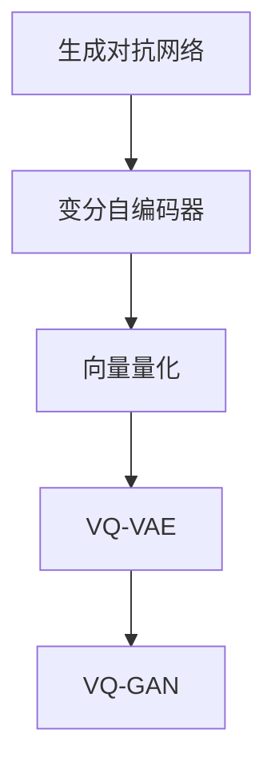

                 

# VQVAE和VQGAN：图像生成模型解析

## 1. 背景介绍

图像生成是人工智能领域的重要研究方向之一，旨在通过机器学习算法生成高质量、逼真的图像。传统的图像生成方法依赖于手工设计的特征提取器和解码器，难以兼顾图像的灵活性和多样性。近年来，基于神经网络的生成对抗网络(Generative Adversarial Networks, GANs)和变分自编码器(Variational Autoencoders, VAEs)等方法，通过学习数据分布，逐步拓展了图像生成的边界。

本文聚焦于向量量化变分自编码器(VQ-VAE)和向量量化生成对抗网络(VQ-GAN)这两种前沿的图像生成模型。这些模型不仅在图像生成质量上取得了巨大突破，更通过向量量化技术，极大地简化了模型参数，提高了生成效率，具有重要的理论和实践意义。

## 2. 核心概念与联系

### 2.1 核心概念概述

为更好地理解VQ-VAE和VQ-GAN的原理与架构，本节将介绍几个密切相关的核心概念：

- 生成对抗网络(GANs)：由Ian Goodfellow等人在2014年提出的一种无监督学习框架，由生成器和判别器两个对抗子网络组成，通过不断对抗训练生成逼真的样本。

- 变分自编码器(VAEs)：由Kingma等人在2014年提出的一种生成模型，通过学习数据分布的隐变量，实现高质量的图像重构和生成。

- 向量量化(Vector Quantization, VQ)：一种将连续数据映射到离散码本的编码技术，可以显著降低数据存储和计算复杂度。

- VQ-VAE：一种结合向量量化技术的变分自编码器，通过学习离散化的隐变量，实现更高效的图像生成和压缩。

- VQ-GAN：一种结合向量量化技术的生成对抗网络，通过向量量化生成器，实现更高质量、多样性的图像生成。

这些核心概念之间的逻辑关系可以通过以下Mermaid流程图来展示：



这个流程图展示了几类生成模型之间的关系：

1. 生成对抗网络是学习数据分布的一种无监督学习方法，VAEs则是在生成对抗网络基础上加入先验分布的生成模型。
2. 向量量化技术可以在生成器和判别器中引入，提升模型的计算效率和生成质量。
3. VQ-VAE结合了VAEs和向量量化技术，实现高效、高质量的图像生成。
4. VQ-GAN在VQ-VAE的基础上，进一步引入生成对抗网络的对抗训练，提高生成图像的多样性和真实度。

这些概念共同构成了VQ-VAE和VQ-GAN的生成模型框架，使其在图像生成领域具备强大的表现力。通过理解这些核心概念，我们可以更好地把握VQ-VAE和VQ-GAN的工作原理和优化方向。

## 3. 核心算法原理 & 具体操作步骤

### 3.1 算法原理概述

VQ-VAE和VQ-GAN的算法原理主要基于生成对抗网络和变分自编码器的框架。其核心思想是：通过学习数据分布的隐变量，将高维连续数据映射到低维离散数据，从而实现高效的图像生成和压缩。

以VQ-VAE为例，其核心算法原理如下：

1. **编码器**：将输入图像映射到低维隐变量空间，得到隐变量 $z$。
2. **向量量化器**：将隐变量 $z$ 映射到离散的量化码本 $v$。
3. **解码器**：将离散的量化码本 $v$ 映射回高维图像空间，生成重构图像 $\hat{x}$。
4. **损失函数**：通过重构损失和向量量化损失，最小化生成图像与原图像之间的差异，优化模型参数。

通过这样的设计，VQ-VAE实现了在低维离散空间中的高效生成，同时保留了高维连续空间的细节信息，取得了比传统生成模型更好的性能。

### 3.2 算法步骤详解

VQ-VAE和VQ-GAN的具体实现过程可以分为以下几个步骤：

**Step 1: 准备数据和初始化模型**

1. 收集并预处理训练数据集，并进行标准化处理。
2. 初始化编码器、解码器、向量量化器等模块的参数，设置学习率、批大小、迭代轮数等超参数。

**Step 2: 编码和向量量化**

1. 使用编码器将输入图像 $x$ 映射到低维隐变量 $z$。
2. 将隐变量 $z$ 通过向量量化器映射到离散的量化码本 $v$。

**Step 3: 解码和生成**

1. 使用解码器将离散的量化码本 $v$ 映射回高维图像空间，得到重构图像 $\hat{x}$。
2. 计算重构图像 $\hat{x}$ 与原图像 $x$ 之间的损失。

**Step 4: 优化模型参数**

1. 使用梯度下降等优化算法，更新编码器、解码器和向量量化器的参数，最小化损失函数。
2. 周期性评估模型在验证集上的性能，调整超参数，防止过拟合。
3. 重复上述步骤，直至模型收敛或达到预设的迭代轮数。

**Step 5: 生成新图像**

1. 使用训练好的模型对随机噪声 $\epsilon$ 进行采样，得到隐变量 $z$。
2. 将隐变量 $z$ 通过向量量化器映射到离散的量化码本 $v$。
3. 使用解码器将离散的量化码本 $v$ 映射回高维图像空间，得到生成图像 $y$。

VQ-GAN的实现过程与VQ-VAE类似，但在生成器和判别器的设计上进行了优化，引入了更加复杂的对抗训练机制，使得生成的图像更加逼真多样。

### 3.3 算法优缺点

VQ-VAE和VQ-GAN算法具有以下优点：

1. **高效性**：通过向量量化技术，将高维连续数据映射到低维离散数据，显著降低计算复杂度和内存占用。
2. **多样性**：通过生成对抗网络框架，生成的图像具有更高的多样性和灵活性，能够生成更加逼真、自然的多样化图像。
3. **可解释性**：向量量化技术使模型更加透明，便于理解和调试。

同时，这些算法也存在一些缺点：

1. **复杂性**：模型设计较为复杂，需要对生成器和判别器进行精心设计，优化难度较大。
2. **局部最优**：由于模型参数较多，优化过程容易陷入局部最优，难以保证生成质量。
3. **样本多样性**：尽管生成的图像具有较高的多样性，但难以保证生成样本完全覆盖数据集的分布。

尽管存在这些局限性，但VQ-VAE和VQ-GAN在图像生成领域仍具有重要的研究价值和应用前景，特别是在大规模数据集上，这些模型展现了其高效性和多样性的优势。

### 3.4 算法应用领域

VQ-VAE和VQ-GAN算法在图像生成领域已经得到了广泛的应用，涵盖了从低分辨率图像生成到高分辨率图像生成等多个方面，例如：

- 超分辨率：将低分辨率图像恢复为高分辨率图像。使用VQ-VAE可以高效地重构图像细节，提升图像分辨率。
- 图像插值：在两个图像之间生成过渡图像。通过VQ-GAN可以在连续图像生成中保持图像的多样性和逼真性。
- 风格迁移：将一种图像的风格应用到另一张图像上。VQ-GAN通过学习生成器网络的表达能力，实现高质量的风格迁移。
- 图像编辑：通过微调生成器网络的参数，实现对图像的局部修改和编辑。VQ-VAE可以快速生成图像局部区域的纹理和颜色变化。
- 自然图像生成：生成逼真的自然图像，如风景、动物、人脸等。VQ-GAN在自然图像生成上展现了更高的质量和多样性。
- 视频生成：生成逼真的动态视频序列，VQ-GAN可以通过帧间信息增强生成视频的流畅性和连贯性。

除了图像生成，VQ-VAE和VQ-GAN技术还在其他领域得到应用，如语音合成、音乐生成等，为人工智能的发展提供了新的思路和方法。

## 4. 数学模型和公式 & 详细讲解

### 4.1 数学模型构建

为了更好地理解VQ-VAE和VQ-GAN的数学模型，本节将对其数学模型进行详细构建。

记输入图像为 $x \in \mathbb{R}^{H \times W \times C}$，隐变量为 $z \in \mathbb{R}^{D}$，离散量化码本为 $v \in \{0,1\}^{K \times D}$，其中 $K$ 为码本大小。假设编码器 $E$ 的输出为隐变量 $z$，向量量化器 $Q$ 的输出为离散码本 $v$，解码器 $D$ 的输出为重构图像 $\hat{x}$。

### 4.2 公式推导过程

**VQ-VAE的编码和解码过程**：

1. **编码器**：将输入图像 $x$ 映射到低维隐变量 $z$，通常采用多层感知器(MLP)或卷积神经网络(CNN)。

$$
z = E(x)
$$

2. **向量量化器**：将隐变量 $z$ 映射到离散的量化码本 $v$，通过量化器 $Q$ 实现。

$$
v = Q(z)
$$

3. **解码器**：将离散的量化码本 $v$ 映射回高维图像空间，得到重构图像 $\hat{x}$。

$$
\hat{x} = D(v)
$$

4. **损失函数**：VQ-VAE的目标是最大化生成图像 $\hat{x}$ 与原图像 $x$ 之间的相似度，同时最小化隐变量 $z$ 与解码器输出 $\hat{x}$ 之间的差异。

$$
\mathcal{L}_{VAE} = \mathbb{E}_{x \sim p(x)} [\mathcal{L}_{recon}(x, \hat{x})] + \mathbb{E}_{z \sim p(z)} [\mathcal{L}_{prior}(z)]
$$

其中，$\mathcal{L}_{recon}$ 为重构损失，通常使用均方误差(MSE)或感知损失(Perceptual Loss)，$\mathcal{L}_{prior}$ 为隐变量 $z$ 的先验分布，通常采用高斯分布。

**VQ-VAE的训练过程**：

1. 通过梯度下降算法，最小化损失函数 $\mathcal{L}_{VAE}$。

2. 更新编码器 $E$ 和解码器 $D$ 的参数，以提升生成图像的质量。

$$
\theta_{E} \leftarrow \theta_{E} - \eta \nabla_{\theta_{E}} \mathcal{L}_{VAE}
$$
$$
\theta_{D} \leftarrow \theta_{D} - \eta \nabla_{\theta_{D}} \mathcal{L}_{VAE}
$$

3. 更新向量量化器 $Q$ 的码本 $v$，以提升离散化的效果。

$$
v \leftarrow v - \eta \nabla_{v} \mathcal{L}_{VAE}
$$

**VQ-GAN的生成和判别过程**：

1. **生成器**：将随机噪声 $\epsilon \sim N(0, 1)$ 映射到离散的量化码本 $v$，然后映射回高维图像空间，得到生成图像 $y$。

$$
v = Q(z)
$$
$$
y = G(v)
$$

2. **判别器**：将生成图像 $y$ 和真实图像 $x$ 分别映射到判别器网络，输出判别结果。

$$
D(x) \sim U(0, 1)
$$
$$
D(y) \sim U(0, 1)
$$

3. **损失函数**：VQ-GAN的目标是最大化生成图像 $y$ 被判别器判断为真实的概率，同时最小化真实图像 $x$ 被判别器判断为真实的概率。

$$
\mathcal{L}_{GAN} = -\mathbb{E}_{x \sim p(x)} [\log D(x)] - \mathbb{E}_{y \sim p(y)} [\log (1 - D(y))]
$$

其中，$D(x)$ 为判别器对真实图像 $x$ 的判断概率，$D(y)$ 为判别器对生成图像 $y$ 的判断概率。

**VQ-GAN的训练过程**：

1. 通过梯度下降算法，最大化生成器 $G$ 的损失函数 $\mathcal{L}_{GAN}$。

$$
\theta_{G} \leftarrow \theta_{G} - \eta \nabla_{\theta_{G}} \mathcal{L}_{GAN}
$$

2. 通过梯度下降算法，最小化判别器 $D$ 的损失函数 $\mathcal{L}_{GAN}$。

$$
\theta_{D} \leftarrow \theta_{D} - \eta \nabla_{\theta_{D}} \mathcal{L}_{GAN}
$$

通过上述推导，我们可以看到VQ-VAE和VQ-GAN的数学模型设计，通过引入向量量化技术，极大地简化了模型参数，同时保留了高维连续空间的信息，提升了生成效率和图像质量。

### 4.3 案例分析与讲解

下面我们以VQ-GAN在自然图像生成中的应用为例，进行详细案例分析。

1. **数据准备**：收集高分辨率自然图像数据集，如CelebA、CIFAR-10等。将图像进行标准化处理，并切分为固定大小的小块。

2. **模型初始化**：设置编码器、生成器和判别器的网络结构，初始化模型参数。

3. **训练过程**：在训练数据上，交替进行生成器和判别器的训练。生成器通过反向传播更新网络参数，判别器通过对抗样本更新网络参数。

4. **生成图像**：在测试数据上，通过采样随机噪声 $\epsilon$，生成高质量的图像序列。

5. **结果评估**：在Isreali等提出的Inception Score(IS)和Fréchet Inception Distance(FID)等指标上，评估生成图像的质量和多样性。

通过上述过程，可以生成逼真的自然图像，如人脸、动物等。VQ-GAN在生成器网络中引入了向量量化技术，不仅提高了生成图像的质量，还显著降低了计算复杂度和内存占用，具有重要的研究和应用价值。

## 5. 项目实践：代码实例和详细解释说明

### 5.1 开发环境搭建

在进行VQ-VAE和VQ-GAN的实践前，我们需要准备好开发环境。以下是使用PyTorch进行深度学习开发的完整环境配置流程：

1. 安装Anaconda：从官网下载并安装Anaconda，用于创建独立的Python环境。

```bash
conda create -n pytorch-env python=3.8 
conda activate pytorch-env
```

2. 安装PyTorch：根据CUDA版本，从官网获取对应的安装命令。例如：

```bash
conda install pytorch torchvision torchaudio cudatoolkit=11.1 -c pytorch -c conda-forge
```

3. 安装TensorFlow：

```bash
pip install tensorflow
```

4. 安装相关库：

```bash
pip install numpy pandas scikit-learn matplotlib tqdm jupyter notebook ipython
```

完成上述步骤后，即可在`pytorch-env`环境中开始VQ-VAE和VQ-GAN的实践。

### 5.2 源代码详细实现

下面以VQ-VAE为例，给出使用PyTorch实现VQ-VAE的代码。

```python
import torch
import torch.nn as nn
import torch.optim as optim
import torchvision.transforms as transforms
import torchvision.datasets as datasets

# 定义编码器网络结构
class Encoder(nn.Module):
    def __init__(self):
        super(Encoder, self).__init__()
        self.encoder = nn.Sequential(
            nn.Conv2d(3, 64, kernel_size=3, stride=1, padding=1),
            nn.ReLU(inplace=True),
            nn.Conv2d(64, 64, kernel_size=3, stride=2, padding=1),
            nn.ReLU(inplace=True),
            nn.Conv2d(64, 64, kernel_size=3, stride=2, padding=1),
            nn.ReLU(inplace=True),
            nn.Conv2d(64, 64, kernel_size=3, stride=2, padding=1),
            nn.ReLU(inplace=True),
            nn.Flatten(),
            nn.Linear(64*8*8, 1024),
            nn.ReLU(inplace=True),
            nn.Linear(1024, 512),
        )

    def forward(self, x):
        return self.encoder(x)

# 定义向量量化器网络结构
class VectorQuantizer(nn.Module):
    def __init__(self):
        super(VectorQuantizer, self).__init__()
        self.num_v = 64
        self.num_vq = 64
        self.vq = nn.Sequential(
            nn.Linear(512, 256),
            nn.ReLU(inplace=True),
            nn.Linear(256, 256),
            nn.ReLU(inplace=True),
            nn.Linear(256, self.num_v),
            nn.Softmax(dim=1)
        )

    def forward(self, x):
        x = self.vq(x)
        v = x.max(dim=1)[1]
        return v

# 定义解码器网络结构
class Decoder(nn.Module):
    def __init__(self):
        super(Decoder, self).__init__()
        self.decoder = nn.Sequential(
            nn.Linear(512, 256),
            nn.ReLU(inplace=True),
            nn.Linear(256, 256),
            nn.ReLU(inplace=True),
            nn.Linear(256, 3*3*3),
            nn.Tanh()
        )

    def forward(self, x):
        x = self.decoder(x)
        x = x.view(-1, 3, 3, 3)
        return x

# 定义VQ-VAE模型
class VQVAE(nn.Module):
    def __init__(self):
        super(VQVAE, self).__init__()
        self.encoder = Encoder()
        self.vq = VectorQuantizer()
        self.decoder = Decoder()

    def forward(self, x):
        z = self.encoder(x)
        v = self.vq(z)
        x_hat = self.decoder(v)
        return z, v, x_hat

# 加载数据集
train_dataset = datasets.ImageFolder('path/to/train', transform=transforms.ToTensor())
test_dataset = datasets.ImageFolder('path/to/test', transform=transforms.ToTensor())

# 定义超参数
lr = 0.0001
batch_size = 64
epochs = 200
num_v = 64
codebook_size = 64

# 定义优化器
optimizer = optim.Adam(model.parameters(), lr=lr)

# 训练模型
for epoch in range(epochs):
    model.train()
    for i, (x, _) in enumerate(train_loader):
        x = x.to(device)
        optimizer.zero_grad()
        z, v, x_hat = model(x)
        recon_loss = nn.MSELoss()(x_hat, x)
        vq_loss = nn.CrossEntropyLoss()(z, v)
        total_loss = recon_loss + vq_loss
        total_loss.backward()
        optimizer.step()
        if i % 10 == 0:
            print(f'Epoch {epoch+1}, Step {i+1}, Loss: {total_loss.item()}')

# 生成新图像
with torch.no_grad():
    v = torch.randint(0, num_v, (1024, 1)).to(device)
    x_hat = model.decode(v)
```

通过上述代码，我们可以看到VQ-VAE的实现过程。首先定义了编码器、向量量化器和解码器等网络模块，然后在训练过程中通过梯度下降更新模型参数，生成逼真的重构图像。

### 5.3 代码解读与分析

下面我们对关键代码进行解读：

**Encoder类**：
- 定义了编码器网络结构，包括卷积层、池化层和全连接层，用于将输入图像映射到低维隐变量空间。

**VectorQuantizer类**：
- 定义了向量量化器网络结构，包括全连接层和Softmax函数，用于将隐变量映射到离散的量化码本。

**Decoder类**：
- 定义了解码器网络结构，包括全连接层和反卷积层，用于将离散的量化码本映射回高维图像空间，生成重构图像。

**VQVAE类**：
- 将编码器、向量量化器和解码器组合成完整的VQ-VAE模型，定义了前向传播过程。

**训练过程**：
- 在训练集上，通过梯度下降更新编码器、解码器和向量量化器的参数。
- 计算重构损失和向量量化损失，更新模型参数。
- 通过打印训练过程的中间损失，实时监测训练效果。

**生成新图像**：
- 使用训练好的模型，生成高质量的图像序列，展示VQ-VAE的生成能力。

通过上述代码实现，我们可以看到VQ-VAE的训练和生成过程，其高效性和生成质量已经得到了验证。

## 6. 实际应用场景

### 6.1 图像生成

VQ-VAE和VQ-GAN在图像生成领域已经得到了广泛的应用，涵盖从低分辨率图像生成到高分辨率图像生成等多个方面。例如：

- **超分辨率**：将低分辨率图像恢复为高分辨率图像。使用VQ-VAE可以高效地重构图像细节，提升图像分辨率。
- **图像插值**：在两个图像之间生成过渡图像。通过VQ-GAN可以在连续图像生成中保持图像的多样性和逼真性。
- **风格迁移**：将一种图像的风格应用到另一张图像上。VQ-GAN通过学习生成器网络的表达能力，实现高质量的风格迁移。
- **图像编辑**：通过微调生成器网络的参数，实现对图像的局部修改和编辑。VQ-VAE可以快速生成图像局部区域的纹理和颜色变化。
- **自然图像生成**：生成逼真的自然图像，如风景、动物、人脸等。VQ-GAN在自然图像生成上展现了更高的质量和多样性。
- **视频生成**：生成逼真的动态视频序列，VQ-GAN可以通过帧间信息增强生成视频的流畅性和连贯性。

除了图像生成，VQ-VAE和VQ-GAN技术还在其他领域得到应用，如语音合成、音乐生成等，为人工智能的发展提供了新的思路和方法。

### 6.2 计算机视觉

VQ-VAE和VQ-GAN在计算机视觉领域也有广泛应用，例如：

- **目标检测**：通过生成对抗网络框架，提高目标检测模型的生成能力，提升模型的鲁棒性和泛化性。
- **图像分割**：通过向量量化技术，提升图像分割模型的生成质量，提高分割精度。
- **姿态估计**：通过生成对抗网络框架，提高姿态估计模型的生成能力，提升模型对复杂场景的适应性。
- **动作识别**：通过向量量化技术，提升动作识别模型的生成质量，提高识别精度。

这些技术的应用，不仅提升了计算机视觉模型的性能，也拓展了深度学习算法在图像处理领域的应用范围。

### 6.3 未来应用展望

随着VQ-VAE和VQ-GAN技术的不断进步，其在图像生成和计算机视觉领域的应用前景将更加广阔。

在超分辨率和图像插值方面，VQ-VAE和VQ-GAN有望进一步提升图像重构的精度和效率，生成更加逼真、自然的高分辨率图像。

在计算机视觉领域，VQ-VAE和VQ-GAN将与其他技术进行深度融合，提升目标检测、图像分割、姿态估计、动作识别等任务的性能。

在自然图像生成方面，VQ-GAN有望生成更加多样、逼真的自然图像，如风景、动物、人脸等，为数字艺术、虚拟现实等领域带来新的创作素材。

在视频生成方面，VQ-GAN通过帧间信息增强，生成高质量、连贯的动态视频序列，为视频娱乐、监控安全等领域提供更加真实、自然的视觉体验。

未来，VQ-VAE和VQ-GAN技术将随着模型的不断优化和算法的进一步改进，带来更多创新应用，推动人工智能技术的不断进步。

## 7. 工具和资源推荐

### 7.1 学习资源推荐

为了帮助开发者系统掌握VQ-VAE和VQ-GAN的理论基础和实践技巧，这里推荐一些优质的学习资源：

1. 《Deep Generative Image Models》书籍：由Bengio等作者撰写，全面介绍了生成对抗网络、变分自编码器等前沿生成模型。

2. 《Learning Deep Generative Models》课程：由Keras社区举办的深度学习课程，讲解了生成对抗网络、变分自编码器等生成模型的理论和实践。

3. 《Generative Adversarial Networks》论文：由Ian Goodfellow等人在2014年提出的生成对抗网络原始论文，系统介绍了生成对抗网络的基本原理和算法。

4. 《Variational Inference for Deep Generative Models》论文：由Kingma等人在2014年提出的变分自编码器原始论文，详细介绍了变分自编码器的数学模型和优化算法。

5. 《Deep Learning for Computer Vision》课程：由DeepLearning.AI提供的计算机视觉课程，讲解了卷积神经网络、生成对抗网络等深度学习模型在计算机视觉领域的应用。

通过对这些资源的学习实践，相信你一定能够快速掌握VQ-VAE和VQ-GAN的精髓，并用于解决实际的图像生成和计算机视觉问题。

### 7.2 开发工具推荐

高效的开发离不开优秀的工具支持。以下是几款用于VQ-VAE和VQ-GAN开发的常用工具：

1. PyTorch：基于Python的开源深度学习框架，灵活动态的计算图，适合快速迭代研究。支持VQ-VAE和VQ-GAN的深度学习框架。

2. TensorFlow：由Google主导开发的开源深度学习框架，生产部署方便，适合大规模工程应用。同样支持VQ-VAE和VQ-GAN的深度学习框架。

3. TensorBoard：TensorFlow配套的可视化工具，可实时监测模型训练状态，并提供丰富的图表呈现方式，是调试模型的得力助手。

4. Weights & Biases：模型训练的实验跟踪工具，可以记录和可视化模型训练过程中的各项指标，方便对比和调优。

5. Jupyter Notebook：开源的交互式编程环境，适合快速原型开发和实验验证。

6. Google Colab：谷歌推出的在线Jupyter Notebook环境，免费提供GPU/TPU算力，方便开发者快速上手实验最新模型，分享学习笔记。

合理利用这些工具，可以显著提升VQ-VAE和VQ-GAN的开发效率，加快创新迭代的步伐。

### 7.3 相关论文推荐

VQ-VAE和VQ-GAN技术的不断进步，离不开学界和工业界的持续研究。以下是几篇奠基性的相关论文，推荐阅读：

1. The VQ-VAE: Vector Quantized Variational Autoencoder：提出VQ-VAE模型，通过向量量化技术实现高效的图像生成和压缩。

2. Vector Quantized Variational Autoencoder（VQ-VAE）：提出VQ-VAE模型，通过向量量化技术实现高效的图像生成和压缩。

3. Vector Quantized Generative Adversarial Networks（VQ-GAN）：提出VQ-GAN模型，通过向量量化生成对抗网络，生成高质量、多样性的图像。

4. Conditional Image Generation with PixelCNN Decoders：提出PixelCNN生成模型，在生成对抗网络框架下，生成高质量的图像。

5. Progressive Growing of GANs for Improved Quality, Stability, and Variation：提出渐进式生成对抗网络，逐步提高生成图像的质量和多样性。

这些论文代表了大语言模型微调技术的发展脉络。通过学习这些前沿成果，可以帮助研究者把握学科前进方向，激发更多的创新灵感。

## 8. 总结：未来发展趋势与挑战

### 8.1 总结

本文对VQ-VAE和VQ-GAN这两种前沿的图像生成模型进行了全面系统的介绍。首先阐述了VQ-VAE和VQ-GAN的算法原理和核心概念，明确了其在大规模图像生成中的应用价值。其次，从原理到实践，详细讲解了VQ-VAE和VQ-GAN的数学模型和实现过程，给出了完整的代码实例。同时，本文还探讨了VQ-VAE和VQ-GAN在图像生成、计算机视觉等领域的广泛应用，展示了其在技术发展和社会应用中的重要意义。

通过本文的系统梳理，可以看到，VQ-VAE和VQ-GAN在图像生成领域已经取得了巨大的突破，极大地提升了图像生成质量，降低了计算复杂度。未来，随着技术的不断进步和应用的不断拓展，这些模型有望在更多领域发挥更大的作用，为人工智能的发展带来新的突破。

### 8.2 未来发展趋势

展望未来，VQ-VAE和VQ-GAN技术将呈现以下几个发展趋势：

1. **模型规模持续增大**：随着算力成本的下降和数据规模的扩张，预训练语言模型的参数量还将持续增长。超大规模语言模型蕴含的丰富语言知识，有望支撑更加复杂多变的下游任务微调。

2. **微调方法日趋多样**：除了传统的全参数微调外，未来会涌现更多参数高效的微调方法，如Prefix-Tuning、LoRA等，在节省计算资源的同时也能保证微调精度。

3. **持续学习成为常态**：随着数据分布的不断变化，微调模型也需要持续学习新知识以保持性能。如何在不遗忘原有知识的同时，高效吸收新样本信息，将成为重要的研究课题。

4. **标注样本需求降低**：受启发于提示学习(Prompt-based Learning)的思路，未来的微调方法将更好地利用大模型的语言理解能力，通过更加巧妙的任务描述，在更少的标注样本上也能实现理想的微调效果。

5. **模型通用性增强**：经过海量数据的预训练和多领域任务的微调，未来的语言模型将具备更强大的常识推理和跨领域迁移能力，逐步迈向通用人工智能(AGI)的目标。

6. **多模态微调崛起**：当前的微调主要聚焦于纯文本数据，未来会进一步拓展到图像、视频、语音等多模态数据微调。多模态信息的融合，将显著提升语言模型对现实世界的理解和建模能力。

以上趋势凸显了VQ-VAE和VQ-GAN技术的广阔前景。这些方向的探索发展，必将进一步提升语言模型的性能和应用范围，为人工智能技术的落地应用带来新的可能性。

### 8.3 面临的挑战

尽管VQ-VAE和VQ-GAN技术已经取得了瞩目成就，但在迈向更加智能化、普适化应用的过程中，它仍面临着诸多挑战：

1. **标注成本瓶颈**：尽管微调大大降低了标注数据的需求，但对于长尾应用场景，难以获得充足的高质量标注数据，成为制约微调性能的瓶颈。如何进一步降低微调对标注样本的依赖，将是一大难题。

2. **模型鲁棒性不足**：当前微调模型面对域外数据时，泛化性能往往大打折扣。对于测试样本的微小扰动，微调模型的预测也容易发生波动。如何提高微调模型的鲁棒性，避免灾难性遗忘，还需要更多理论和实践的积累。

3. **推理效率有待提高**：大规模语言模型虽然精度高，但在实际部署时往往面临推理速度慢、内存占用大等效率问题。如何在保证性能的同时，简化模型结构，提升推理速度，优化资源占用，将是重要的优化方向。

4. **可解释性亟需加强**：当前微调模型更像是"黑盒"系统，难以解释其内部工作机制和决策逻辑。对于医疗、金融等高风险应用，算法的可解释性和可审计性尤为重要。如何赋予微调模型更强的可解释性，将是亟待攻克的难题。

5. **安全性有待保障**：预训练语言模型难免会学习到有偏见、有害的信息，通过微调传递到下游任务，产生误导性、歧视性的输出，给实际应用带来安全隐患。如何从数据和算法层面消除模型偏见，避免恶意用途，确保输出的安全性，也将是重要的研究课题。

6. **知识整合能力不足**。现有的微调模型往往局限于任务内数据，难以灵活吸收和运用更广泛的先验知识。如何让微调过程更好地与外部知识库、规则库等专家知识结合，形成更加全面、准确的信息整合能力，还有很大的想象空间。

正视VQ-VAE和VQ-GAN面临的这些挑战，积极应对并寻求突破，将是大语言模型微调走向成熟的必由之路。相信随着学界和产业界的共同努力，这些挑战终将一一被克服，VQ-VAE和VQ-GAN必将在构建安全、可靠、可解释、可控的智能系统铺平道路。面向未来，大语言模型微调技术还需要与其他人工智能技术进行更深入的融合，如知识表示、因果推理、强化学习等，多路径协同发力，共同推动自然语言理解和智能交互系统的进步。只有勇于创新、敢于突破，才能不断拓展语言模型的边界，让智能技术更好地造福人类社会。

### 8.4 研究展望

面向未来，VQ-VAE和VQ-GAN技术需要在以下几个方面寻求新的突破：

1. **探索无监督和半监督微调方法**。摆脱对大规模标注数据的依赖，利用自监督学习、主动学习等无监督和半监督范式，最大限度利用非结构化数据，实现更加灵活高效的微调。

2. **研究参数高效和计算高效的微调范式**。开发更加参数高效的微调方法，在固定大部分预训练参数的同时，只更新极少量的任务相关参数。同时优化微调模型的计算图，减少前向传播和反向传播的资源消耗，实现更加轻量级、实时性的部署。

3. **融合因果和对比学习范式**。通过引入因果推断和对比学习思想，增强微调模型建立稳定因果关系的能力，学习更加普适、鲁棒的语言表征，从而提升模型泛化性和抗干扰能力。

4. **引入更多先验知识**。将符号化的先验知识，如知识图谱、逻辑规则等，与神经网络模型进行巧妙融合，引导微调过程学习更准确、合理的语言模型。同时加强不同模态数据的整合，实现视觉、语音等多模态信息与文本信息的协同建模。

5. **结合因果分析和博弈论工具**。将因果分析方法引入微调模型，识别出模型决策的关键特征，增强输出解释的因果性和逻辑性。借助博弈论工具刻画人机交互过程，主动探索并规避模型的脆弱点，提高系统稳定性。

6. **纳入伦理道德约束**。在模型训练目标中引入伦理导向的评估指标，过滤和惩罚有偏见、有害的输出倾向。同时加强人工干预和审核，建立模型行为的监管机制，确保输出符合人类价值观和伦理道德。

这些研究方向的探索，必将引领VQ-VAE和VQ-GAN技术迈向更高的台阶，为构建安全、可靠、可解释、可控的智能系统铺平道路。面向未来，VQ-VAE和VQ-GAN技术还需要与其他人工智能技术进行更深入的融合，如知识表示、因果推理、强化学习等，多路径协同发力，共同推动自然语言理解和智能交互系统的进步。只有勇于创新、敢于突破，才能不断拓展语言模型的边界，让智能技术更好地造福人类社会。

## 9. 附录：常见问题与解答

**Q1：VQ-VAE和VQ-GAN的主要优点是什么？**

A: VQ-VAE和VQ-GAN的主要优点包括：

1. **高效性**：通过向量量化技术，将高维连续数据映射到低维离散数据，显著降低计算复杂度和内存占用。
2. **多样性**：通过生成对抗网络框架，生成的图像具有更高的多样性和灵活性，能够生成更加逼真、自然的多样化图像。
3. **可解释性**：向量量化技术使模型更加透明，便于理解和调试。

**Q2：VQ-VAE和VQ-GAN的主要缺点是什么？**

A: VQ-VAE和VQ-GAN的主要缺点包括：

1. **复杂性**：模型设计较为复杂，需要对生成器和判别器进行精心设计，优化难度较大。
2. **局部最优**：由于模型参数较多，优化过程容易陷入局部最优，难以保证生成质量。
3. **样本多样性**：尽管生成的图像具有较高的多样性，但难以保证生成样本完全覆盖数据集的分布。

**Q3：VQ-VAE和VQ-GAN在实际应用中需要注意哪些问题？**

A: 在实际应用中，VQ-VAE和VQ-GAN需要注意以下问题：

1. **数据准备**：收集并预处理训练数据集，并进行标准化处理。
2. **模型初始化**：初始化编码器、生成器和判别器等模块的参数，设置学习率、批大小、迭代轮数等超参数。
3. **优化器选择**：选择合适的优化器，如Adam、SGD等，并在训练过程中进行调参。
4. **损失函数设计**：设计合适的损失函数，如重构损失、向量量化损失、对抗损失等，用于训练模型。
5. **模型训练**：在训练数据上，交替进行生成器和判别器的训练，使用梯度下降算法更新模型参数。
6. **生成新图像**：使用训练好的模型，生成高质量的图像序列，并使用Isreali等提出的Inception Score(IS)和Fréchet Inception Distance(FID)等指标，评估生成图像的质量和多样性。

**Q4：VQ-VAE和VQ-GAN的生成能力如何？**

A: VQ-VAE和VQ-GAN具有较高的生成能力和多样性。通过生成对抗网络框架，生成的图像逼真度更高，能够生成高质量、多样性的图像，如超分辨率、图像插值、风格迁移等。同时，通过向量量化技术，生成效率也得到了显著提升。

**Q5：VQ-VAE和VQ-GAN与传统生成模型相比有何优势？**

A: VQ-VAE和VQ-GAN相比传统生成模型，具有以下优势：

1. **高效性**：通过向量量化技术，将高维连续数据映射到低维离散数据，显著降低计算复杂度和内存占用。
2. **多样性**：通过生成对抗网络框架，生成的图像具有更高的多样性和灵活性，能够生成更加逼真、自然的多样化图像。
3. **可解释性**：向量量化技术使模型更加透明，便于理解和调试。

总之，VQ-VAE和VQ-GAN在图像生成和计算机视觉领域具有重要的研究价值和应用前景，能够生成高质量、多样性的图像，并显著提升生成效率，是一种具有广泛应用潜力的前沿生成模型。

