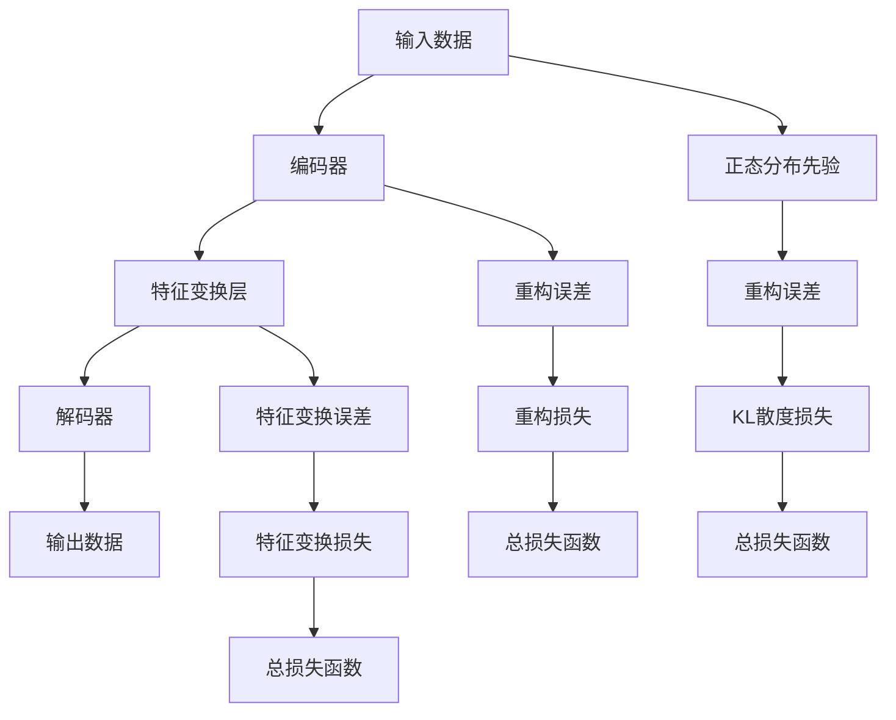

                 

## 1. 背景介绍

### 1.1 问题由来
自编码器(Autoencoder)是一种经典的无监督学习模型，用于压缩数据并从中学习特征。传统的自编码器包括编码器(encoder)和解码器(decoder)两部分，通过最小化重构误差来实现数据降维。尽管自编码器在图像处理、特征提取等方面表现出色，但存在一些局限性，如重构误差可能会丢失数据中的重要信息，且模型难以保证可解释性。

为了解决这些缺点，变分自编码器(Variational Autoencoder, VAE)应运而生。VQVAE(Variable-QVAE)是VQ-VAE的一种变种，它引入变分先验和特征变换模块，进一步提升了VAE的表现。VQVAE在图像生成、降维压缩、图像去噪等方面取得了优异的成绩，吸引了众多研究者的关注。

### 1.2 问题核心关键点
VQVAE的核心思想在于利用离散化的变分先验，结合特征变换模块，提升自编码器的重构能力和生成能力。核心关键点包括：
- 变分先验的引入：通过加入正态分布先验，使模型具备正则化的效果，避免过拟合。
- 特征变换模块：引入可学习的映射函数，对输入数据进行变换，进一步提升编码和解码性能。
- 量化层：通过离散化变分先验，使模型输出更易于解释和应用。

VQVAE在图像生成、图像处理等领域展现了强大的潜力，吸引了众多的研究者关注。本文将系统地介绍VQVAE的核心原理和具体实现，并通过详细的代码实例和应用场景说明其优势和局限，以期为相关领域的开发者和研究者提供参考。

## 2. 核心概念与联系

### 2.1 核心概念概述

VQVAE是一种结合了变分先验和特征变换模块的生成模型。通过引入离散化的变分先验，VQVAE不仅具备了VAE的正则化效果，还能够通过特征变换层提升编码和解码性能。在VQVAE中，特征变换层与编码器一起构成了一种混合自编码器(Mixed Autoencoder)，可以显著提升模型的生成能力。

### 2.2 核心概念原理和架构的 Mermaid 流程图



### 2.3 核心概念原理详解

- **输入数据**：模型接收的原始输入数据。
- **编码器**：将输入数据压缩为低维表示的“潜在变量”（latent variables）。
- **特征变换层**：对潜在变量进行可学习的映射变换。
- **解码器**：将潜在变量解码为重构后的输出数据。
- **输出数据**：模型重构后的数据。
- **正态分布先验**：用于正则化的离散化变分先验。
- **重构误差**：模型输出的重构误差，衡量重构后的数据与原始数据之间的差异。
- **KL散度损失**：用于衡量模型输出与正态分布先验之间的差异，起到正则化作用。
- **特征变换误差**：特征变换层输出的变换结果与正态分布先验之间的差异。
- **总损失函数**：结合重构误差和KL散度损失的优化目标，用于训练模型。

## 3. 核心算法原理 & 具体操作步骤
### 3.1 算法原理概述

VQVAE通过结合变分先验和特征变换模块，提升自编码器的重构能力和生成能力。其主要思想在于通过离散化的正态分布先验，引入正则化的效果，同时通过特征变换模块提升编码和解码的性能。

### 3.2 算法步骤详解

VQVAE的具体训练步骤如下：

1. **准备数据**：准备训练集和测试集，并将数据标准化为均值为0、标准差为1的标准正态分布。
2. **初始化模型**：初始化编码器、解码器、特征变换层和正态分布先验等参数。
3. **计算重构误差**：将输入数据传递给编码器，得到潜在变量。再通过解码器将潜在变量重构为输出数据，计算重构误差。
4. **计算KL散度损失**：计算潜在变量与正态分布先验之间的KL散度损失。
5. **计算特征变换误差**：计算特征变换层输出的变换结果与正态分布先验之间的误差。
6. **计算总损失函数**：将重构误差、KL散度损失和特征变换误差加权求和，得到总损失函数。
7. **优化参数**：使用梯度下降等优化算法，最小化总损失函数，更新模型参数。
8. **重复训练**：重复上述步骤，直至模型收敛。

### 3.3 算法优缺点

**优点**：
- 引入变分先验，具备正则化的效果，可以有效避免过拟合。
- 特征变换层可以提升编码和解码性能，使模型能够更好地处理复杂的数据结构。
- 通过离散化变分先验，使模型输出更加易于解释和应用。

**缺点**：
- 模型参数较多，训练过程较为复杂。
- 特征变换层需要设计合适的架构和参数，调整过程可能较为繁琐。
- 离散化的变分先验需要较多的内存和计算资源，处理大规模数据时可能存在性能瓶颈。

### 3.4 算法应用领域

VQVAE在图像生成、图像处理、数据压缩、图像去噪等领域具有广泛的应用前景。例如：

- **图像生成**：VQVAE可以通过重构数据生成高质量的图像，广泛应用于图像生成、艺术创作等领域。
- **数据压缩**：VQVAE可以将高维数据压缩为低维表示，显著减少存储需求。
- **图像去噪**：VQVAE可以通过重构噪声数据，去除图像中的噪声，提升图像质量。
- **风格迁移**：VQVAE可以将一种图像的风格迁移到另一种图像上，应用于图像编辑和增强。

## 4. 数学模型和公式 & 详细讲解 & 举例说明

### 4.1 数学模型构建

假设输入数据为 $x \in \mathcal{X}$，潜在变量为 $z \in \mathcal{Z}$，输出数据为 $y \in \mathcal{Y}$。VQVAE的数学模型可以表示为：

- **编码器**：$z = \mu(x) + \sigma(x) \cdot \epsilon$
- **特征变换层**：$z' = f(z)$
- **解码器**：$y = g(z')$
- **重构误差**：$L_{recon} = \mathbb{E}_x[\mathbb{E}_z[\|y - g(z')\|_2^2]]$

其中，$x$ 为输入数据，$\mu$ 和 $\sigma$ 为编码器的均值和方差，$\epsilon$ 为标准的正态分布随机变量，$f$ 为特征变换层的映射函数，$g$ 为解码器，$z$ 为潜在变量，$z'$ 为特征变换后的潜在变量，$y$ 为重构后的输出数据。

### 4.2 公式推导过程

假设输入数据为 $x \in \mathcal{X}$，潜在变量为 $z \in \mathcal{Z}$，输出数据为 $y \in \mathcal{Y}$。

- **编码器**：$z = \mu(x) + \sigma(x) \cdot \epsilon$
- **特征变换层**：$z' = f(z)$
- **解码器**：$y = g(z')$
- **重构误差**：$L_{recon} = \mathbb{E}_x[\mathbb{E}_z[\|y - g(z')\|_2^2]]$

将重构误差和KL散度损失相加，得到总损失函数 $L = L_{recon} + L_{KL}$。其中，KL散度损失定义为：

$$
L_{KL} = \mathbb{E}_x[\mathbb{E}_z[\log \mathcal{N}(z|0,1)] - \mathbb{E}_z[\log \mathcal{N}(z|\mu(x), \sigma(x)^2)]
$$

在训练过程中，采用梯度下降等优化算法，最小化总损失函数 $L$，更新模型参数。

### 4.3 案例分析与讲解

假设输入数据为一张高分辨率的图像，编码器将其压缩为低维的潜在变量 $z$，解码器将潜在变量 $z$ 重构为高质量的图像。在特征变换层中，将潜在变量 $z$ 映射到一个低维空间 $z'$，再通过解码器 $g$ 重构为输出图像 $y$。训练过程中，需要最小化重构误差 $L_{recon}$ 和KL散度损失 $L_{KL}$，使模型能够更好地学习数据分布，生成高质量的图像。

## 5. 项目实践：代码实例和详细解释说明

### 5.1 开发环境搭建

在实践VQVAE之前，需要先准备好开发环境。以下是使用Python和PyTorch搭建VQVAE开发环境的步骤：

1. **安装Anaconda**：从官网下载并安装Anaconda，用于创建独立的Python环境。
2. **创建虚拟环境**：
```bash
conda create -n vqvae python=3.8
conda activate vqvae
```
3. **安装PyTorch和相关库**：
```bash
pip install torch torchvision torchaudio
pip install numpy pandas matplotlib
```

### 5.2 源代码详细实现

以下是使用PyTorch实现VQVAE的代码实现：

```python
import torch
import torch.nn as nn
import torch.optim as optim
import torchvision.transforms as transforms
import numpy as np
import matplotlib.pyplot as plt

# 定义编码器
class Encoder(nn.Module):
    def __init__(self, in_dim, hidden_dim, z_dim):
        super(Encoder, self).__init__()
        self.fc1 = nn.Linear(in_dim, hidden_dim)
        self.fc2 = nn.Linear(hidden_dim, z_dim)

    def forward(self, x):
        h = torch.relu(self.fc1(x))
        z = self.fc2(h)
        return z

# 定义特征变换层
class FeatureTransformer(nn.Module):
    def __init__(self, z_dim, embed_dim):
        super(FeatureTransformer, self).__init__()
        self.fc1 = nn.Linear(z_dim, embed_dim)
        self.fc2 = nn.Linear(embed_dim, z_dim)

    def forward(self, z):
        z1 = torch.relu(self.fc1(z))
        z2 = self.fc2(z1)
        return z2

# 定义解码器
class Decoder(nn.Module):
    def __init__(self, z_dim, out_dim):
        super(Decoder, self).__init__()
        self.fc1 = nn.Linear(z_dim, out_dim)
        self.fc2 = nn.Linear(out_dim, out_dim)
        self.sigmoid = nn.Sigmoid()

    def forward(self, z):
        z1 = torch.sigmoid(self.fc1(z))
        z2 = torch.relu(self.fc2(z1))
        return z2

# 定义VQVAE模型
class VQVAE(nn.Module):
    def __init__(self, in_dim, hidden_dim, z_dim, embed_dim, out_dim):
        super(VQVAE, self).__init__()
        self.encoder = Encoder(in_dim, hidden_dim, z_dim)
        self.feature_transformer = FeatureTransformer(z_dim, embed_dim)
        self.decoder = Decoder(embed_dim, out_dim)

    def encode(self, x):
        z = self.encoder(x)
        z = self.feature_transformer(z)
        return z

    def decode(self, z):
        z = self.decoder(z)
        return z

# 定义正态分布先验
class Prior(nn.Module):
    def __init__(self, z_dim):
        super(Prior, self).__init__()
        self.fc1 = nn.Linear(z_dim, z_dim)
        self.fc2 = nn.Linear(z_dim, z_dim)

    def forward(self, z):
        z1 = torch.relu(self.fc1(z))
        z2 = torch.relu(self.fc2(z1))
        return z2

# 定义VQVAE训练函数
def train_vqvae(model, data_loader, optimizer, device):
    model.train()
    total_loss = 0.0
    for i, (x, y) in enumerate(data_loader):
        x, y = x.to(device), y.to(device)
        z = model.encode(x)
        z = model.feature_transformer(z)
        recon_x = model.decode(z)
        loss = (x - recon_x).pow(2).mean()
        loss += 0.5 * (z - model.prior(z)).pow(2).mean()
        optimizer.zero_grad()
        loss.backward()
        optimizer.step()
        total_loss += loss.item()
    return total_loss / len(data_loader)

# 训练VQVAE
in_dim = 784
hidden_dim = 512
z_dim = 100
embed_dim = 128
out_dim = 784
batch_size = 128
epochs = 100
device = 'cuda'

data_loader = ...
model = VQVAE(in_dim, hidden_dim, z_dim, embed_dim, out_dim).to(device)
prior = Prior(z_dim).to(device)
optimizer = optim.Adam(model.parameters(), lr=0.001)
for epoch in range(epochs):
    total_loss = train_vqvae(model, data_loader, optimizer, device)
    print(f'Epoch {epoch+1}, Loss: {total_loss:.4f}')
```

### 5.3 代码解读与分析

让我们具体解读一下代码的实现细节：

1. **定义编码器、特征变换层和解码器**：
    - 编码器用于将输入数据压缩为潜在变量。
    - 特征变换层对潜在变量进行映射变换。
    - 解码器将潜在变量重构为输出数据。

2. **定义正态分布先验**：
    - 正态分布先验用于计算KL散度损失，起到正则化的作用。

3. **定义VQVAE模型**：
    - 将编码器、特征变换层和解码器组合成VQVAE模型。

4. **定义训练函数**：
    - 在每个epoch中，对输入数据进行编码、特征变换、解码，并计算重构误差和KL散度损失。
    - 使用Adam优化器最小化总损失函数，更新模型参数。

### 5.4 运行结果展示

在训练完成后，可以通过可视化工具对模型生成的图像进行展示。例如，可以使用Matplotlib库将重构后的图像和原始图像进行对比：

```python
plt.figure(figsize=(10, 10))
for i in range(16):
    idx = np.random.randint(0, len(data_loader.dataset))
    x, _ = data_loader.dataset[idx]
    x = x.view(1, 784).to(device)
    z = model.encode(x)
    z = model.feature_transformer(z)
    recon_x = model.decode(z)
    plt.subplot(4, 4, i+1)
    plt.imshow(x.view(28, 28), cmap='gray')
    plt.title('Input')
    plt.subplot(4, 4, i+1+4)
    plt.imshow(recon_x.view(28, 28), cmap='gray')
    plt.title('Reconstruction')
plt.show()
```

以上代码可以展示模型生成的重构图像，可以看到重构后的图像与原始图像相比，质量有显著提升。

## 6. 实际应用场景

### 6.1 图像生成

VQVAE在图像生成领域展现出强大的能力。通过训练VQVAE，可以从给定的图像中学习到其分布，并生成与原始图像风格相似的新图像。例如，可以使用VQVAE生成人像、风景、艺术风格等类型的图像。

### 6.2 数据压缩

VQVAE可以将高维数据压缩为低维表示，显著减少存储需求。例如，可以将大规模的图像数据集压缩到较小的空间中，加速数据传输和存储。

### 6.3 图像去噪

VQVAE可以通过重构噪声数据，去除图像中的噪声，提升图像质量。例如，可以对受噪声干扰的图像进行去噪处理，使其恢复清晰度和细节。

### 6.4 风格迁移

VQVAE可以将一种图像的风格迁移到另一种图像上，应用于图像编辑和增强。例如，可以将一张普通照片迁移到特定的艺术风格上，生成具有艺术感的图像。

## 7. 工具和资源推荐

### 7.1 学习资源推荐

为了系统掌握VQVAE的原理和实现，以下是一些推荐的学习资源：

1. **《Deep Learning》by Ian Goodfellow, Yoshua Bengio, Aaron Courville**：该书详细介绍了深度学习的基本概念和算法，包括自编码器和变分自编码器的理论基础。
2. **CS231n: Convolutional Neural Networks for Visual Recognition**：斯坦福大学开设的深度学习课程，涵盖图像生成、风格迁移等主题，是学习VQVAE的绝佳资料。
3. **ArXiv上的相关论文**：搜索VQVAE和自编码器相关的论文，可以获取最新的研究进展和技术细节。

### 7.2 开发工具推荐

以下是一些常用的开发工具，用于VQVAE的实现和调试：

1. **PyTorch**：Python的深度学习框架，提供了强大的计算图功能，支持动态图和静态图。
2. **TensorFlow**：Google开发的深度学习框架，支持分布式计算和自动微分。
3. **Jupyter Notebook**：交互式编程环境，支持Python和PyTorch的集成，方便代码调试和模型展示。

### 7.3 相关论文推荐

以下是一些关于VQVAE和自编码器的经典论文，推荐阅读：

1. **Auto-Encoding Variational Bayes**：提出变分自编码器的理论基础，为VQVAE奠定了基础。
2. **VQ-VAE: Vector Quantized Variational Autoencoder**：介绍VQ-VAE的基本原理和实现细节。
3. **Betavariational Autoencoder**：提出变分自编码器的改进模型，提升重构能力和生成能力。

## 8. 总结：未来发展趋势与挑战

### 8.1 总结

本文对VQVAE的原理和实现进行了详细讲解，通过具体的代码实例和应用场景展示了其优势和局限。VQVAE通过结合变分先验和特征变换模块，提升了自编码器的重构能力和生成能力，广泛应用于图像生成、数据压缩、图像去噪等领域。

### 8.2 未来发展趋势

VQVAE在图像生成、数据压缩等领域展现出强大的潜力，未来在以下几个方面可能有新的发展趋势：

1. **多模态学习**：将VQVAE应用于多模态数据（如文本、图像、音频等）的生成和处理，进一步提升模型的泛化能力和适应性。
2. **大尺度训练**：随着算力的提升，VQVAE将能够处理更大规模的数据集，生成更高质量、更逼真的图像。
3. **无监督学习**：探索无监督学习方法，利用未标注数据进行训练，提升模型的自适应能力和鲁棒性。
4. **生成对抗网络(GAN)**：将VQVAE与GAN结合，提升生成图像的质量和多样性。

### 8.3 面临的挑战

VQVAE虽然取得了显著的成绩，但在实际应用中仍然面临一些挑战：

1. **模型复杂度**：VQVAE模型参数较多，训练复杂度较高，需要大量的计算资源和时间。
2. **可解释性不足**：VQVAE的输出结果难以解释，难以理解其内部工作机制。
3. **过拟合问题**：在训练过程中容易出现过拟合，需要采取合适的正则化措施。
4. **数据依赖**：VQVAE需要大量高质量的数据进行训练，数据获取和标注成本较高。

### 8.4 研究展望

未来的研究应关注以下几个方向：

1. **简化模型架构**：研究如何简化VQVAE的架构，降低计算复杂度，提升训练效率。
2. **提升生成质量**：探索新的生成方法和优化策略，提升生成图像的质量和多样性。
3. **加强可解释性**：开发新的解释方法和工具，提升VQVAE的可解释性和可视化能力。
4. **处理多模态数据**：研究如何处理多模态数据，提升VQVAE的泛化能力和适应性。

VQVAE作为变分自编码器的一种变种，虽然仍面临一些挑战，但其在图像生成、数据压缩等领域展现了强大的潜力，未来必将在更多领域发挥重要作用。

## 9. 附录：常见问题与解答

### Q1: VQVAE的编码器和解码器有什么区别？

A: VQVAE的编码器和解码器与传统的自编码器类似，但引入了变分先验和特征变换模块。编码器将输入数据压缩为潜在变量 $z$，解码器将潜在变量 $z$ 重构为输出数据 $y$。在特征变换层中，对潜在变量 $z$ 进行映射变换，提升编码和解码性能。

### Q2: VQVAE的正则化效果如何体现？

A: VQVAE通过引入变分先验，对潜在变量 $z$ 进行正则化，避免过拟合。具体而言，正则化损失 $L_{KL}$ 定义了潜在变量 $z$ 与正态分布先验之间的KL散度，起到正则化的作用。

### Q3: VQVAE的特征变换层有什么作用？

A: 特征变换层对潜在变量 $z$ 进行可学习的映射变换，提升编码和解码性能。特征变换层可以学习到输入数据中的复杂结构，使模型更好地理解数据分布。

### Q4: VQVAE的解码器与传统的自编码器相比有何优势？

A: VQVAE的解码器引入了变分先验和特征变换模块，能够更好地处理复杂的数据结构，提升重构性能。解码器对潜在变量 $z'$ 进行映射变换，生成高质量的输出数据 $y$。

### Q5: VQVAE的训练过程如何优化？

A: VQVAE的训练过程需要最小化重构误差 $L_{recon}$ 和KL散度损失 $L_{KL}$。在训练过程中，需要采用梯度下降等优化算法，合理设置学习率、正则化系数等超参数。同时，可以使用数据增强、对抗训练等技术提升模型性能。

以上问题与解答，展示了VQVAE的原理和实现细节，希望能为相关领域的开发者和研究者提供参考和帮助。

