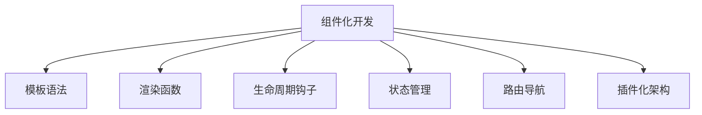

                 

# Vue.js 入门：渐进式 JavaScript 框架

> 关键词：Vue.js, 渐进式 JavaScript, 前端框架, 组件化开发, 单文件组件, 模板语法, 渲染函数, 生命周期钩子, 状态管理, Vuex, 组件通信, 路由导航, 插件化架构, 性能优化

## 1. 背景介绍

### 1.1 问题由来
在过去十年间，JavaScript 生态圈涌现了诸多优秀的前端框架，如 React、Angular、Vue.js 等。其中，Vue.js 以其简单易用、渐进式特性脱颖而出，成为了一款备受欢迎的前端框架。

Vue.js 由尤雨溪于 2014 年创建，是渐进式框架，即组件化开发，可以在任何项目中使用，大至单页应用，小至简单的组件。Vue.js 的渐进性体现在其逐步引入框架的功能，而非一蹴而就，这为开发者提供了更大的灵活性，使其可以根据项目的具体需求，自由选择其特性。

### 1.2 问题核心关键点
- Vue.js 的核心设计理念是什么？
- Vue.js 的主要组件有哪些，以及它们的作用是什么？
- Vue.js 的渐进式特性是如何体现的？
- Vue.js 的生态系统包括哪些工具、库、插件等？
- Vue.js 在实际开发中如何应对性能优化问题？

### 1.3 问题研究意义
理解 Vue.js 的基本原理、组件、特性以及性能优化方法，对于掌握这一渐进式前端框架至关重要。Vue.js 简单易用，组件化开发，使得开发者可以更加灵活地选择和使用其功能，提升开发效率。同时，Vue.js 的生态系统丰富，拥有大量的插件和库，可以满足不同项目的需求。此外，Vue.js 的性能优化技术在实际开发中也非常实用，能够有效提升应用的性能和用户体验。

## 2. 核心概念与联系

### 2.1 核心概念概述

Vue.js 是一个渐进式前端框架，主要设计理念包括：

- **组件化开发**：通过将页面拆分成多个可复用的组件，使得代码结构更加清晰、维护更加容易。
- **模板语法**：提供了一种类似 HTML 的模板语法，使得开发者能够更加直观地定义视图和逻辑。
- **渲染函数**：允许开发者使用函数式编程的方式，动态渲染组件视图。
- **生命周期钩子**：提供一系列钩子函数，用于组件的创建、挂载、更新和销毁等生命周期阶段。
- **状态管理**：提供 Vuex 库，帮助开发者管理组件之间的状态，提升应用的可维护性和可扩展性。
- **路由导航**：支持多级路由导航，使得单页应用能够实现类似多页应用的效果。
- **插件化架构**：采用插件化的设计，使得开发者可以根据需求动态引入和使用插件。

### 2.2 核心概念原理和架构的 Mermaid 流程图



这个流程图展示了 Vue.js 主要设计理念之间的逻辑关系：

- 组件化开发是 Vue.js 的基础，通过将页面拆分成多个组件，实现模块化开发。
- 模板语法和渲染函数是基于组件化开发的基础，提供更加灵活的视图定义方式。
- 生命周期钩子、状态管理和路由导航是组件化开发的具体应用，提升应用的复杂性。
- 插件化架构是 Vue.js 的高级特性，提供更大的灵活性和扩展性。

## 3. 核心算法原理 & 具体操作步骤

### 3.1 算法原理概述

Vue.js 的渐进式特性主要体现在其组件化开发和模块化设计上。开发者可以根据项目需求，逐步引入 Vue.js 的功能，从简单的组件定义到复杂的路由导航，逐步构建完整的单页应用。

Vue.js 的核心算法原理主要包括以下几个方面：

- **组件定义与重用**：通过将页面拆分成多个组件，实现代码的复用和组件之间的交互。
- **数据绑定**：通过双向数据绑定，使得组件间的视图和数据同步更新。
- **模板渲染**：通过模板语法和渲染函数，动态渲染组件视图。
- **生命周期钩子**：通过生命周期钩子，控制组件的创建、挂载、更新和销毁等阶段。
- **状态管理**：通过 Vuex 库，集中管理应用的状态，提升应用的可维护性和可扩展性。

### 3.2 算法步骤详解

Vue.js 的核心算法步骤主要包括以下几个方面：

1. **组件化开发**：通过将页面拆分成多个组件，实现代码的复用和组件之间的交互。
2. **数据绑定**：通过双向数据绑定，使得组件间的视图和数据同步更新。
3. **模板渲染**：通过模板语法和渲染函数，动态渲染组件视图。
4. **生命周期钩子**：通过生命周期钩子，控制组件的创建、挂载、更新和销毁等阶段。
5. **状态管理**：通过 Vuex 库，集中管理应用的状态，提升应用的可维护性和可扩展性。

### 3.3 算法优缺点

Vue.js 的主要优点包括：

- **渐进式特性**：可以通过逐步引入 Vue.js 的功能，逐步构建完整的单页应用，灵活性高。
- **简单易用**：模板语法和渲染函数使得开发过程更加直观和简单。
- **组件化开发**：通过组件化开发，使得代码结构更加清晰、维护更加容易。
- **性能优化**：提供一系列性能优化技术，如虚拟 DOM、惰性渲染等。

Vue.js 的主要缺点包括：

- **生态系统不够丰富**：相较于 React 和 Angular，Vue.js 的生态系统还不是很完善。
- **社区相对较小**：相较于 React 和 Angular，Vue.js 的社区相对较小，技术支持和资源可能不如其他框架。
- **调试不够便捷**：相较于 React 和 Angular，Vue.js 的调试工具和插件相对较少。

### 3.4 算法应用领域

Vue.js 主要用于构建单页应用，其应用领域包括：

- **Web 应用**：用于构建复杂的 Web 应用，如电商网站、社交网络、博客等。
- **移动应用**：通过 Vue.js 的官方移动端库 Vue Native，可以构建跨平台移动应用。
- **桌面应用**：通过 Electron 等技术，可以构建桌面端应用。
- **微服务**：通过 Vue.js 的服务端库 Vue Server，可以构建微服务应用。

## 4. 数学模型和公式 & 详细讲解 & 举例说明

### 4.1 数学模型构建

Vue.js 的数学模型主要基于组件化开发和数据绑定。下面以一个简单的组件为例，构建其数学模型。

假设有一个简单的组件，包含一个文本框和一个按钮，用于计数器。

```vue
<template>
  <div>
    <input v-model="count" type="number" />
    <button @click="increment">+1</button>
  </div>
</template>

<script>
export default {
  name: 'Counter',
  data() {
    return {
      count: 0
    }
  },
  methods: {
    increment() {
      this.count++
    }
  }
}
</script>
```

在这个组件中，使用 `v-model` 双向绑定 `count` 属性和输入文本框，通过 `@click` 监听按钮的点击事件，调用 `increment` 方法增加计数器的值。

### 4.2 公式推导过程

假设 `count` 的初始值为 0，点击按钮后，每次增加 1。则该组件的数学模型可以表示为：

$$
count(t+1) = count(t) + 1
$$

其中 $t$ 表示时间，$count$ 表示计数器的值。通过这个公式，可以计算出任何时间点的计数器值。

### 4.3 案例分析与讲解

以这个简单的计数器组件为例，分析 Vue.js 的核心特性：

- **双向数据绑定**：通过 `v-model`，实现视图和数据的双向绑定。
- **组件化开发**：通过将组件拆分成独立的模块，使得代码更加清晰、维护更加容易。
- **事件监听**：通过 `@click` 监听按钮的点击事件，实现事件的响应。

## 5. 项目实践：代码实例和详细解释说明

### 5.1 开发环境搭建

为了搭建 Vue.js 项目环境，首先需要安装 Node.js 和 npm。安装完成后，可以使用以下命令初始化 Vue.js 项目：

```
vue create my-app
```

这会在当前目录下创建一个新的 Vue.js 项目，并初始化相关的依赖包和配置文件。

### 5.2 源代码详细实现

以下是一个简单的 Vue.js 组件的实现：

```vue
<template>
  <div>
    <h1>{{ message }}</h1>
    <input type="text" v-model="message" @keyup.enter="submit" />
  </div>
</template>

<script>
export default {
  name: 'MessageInput',
  data() {
    return {
      message: ''
    }
  },
  methods: {
    submit() {
      alert('Hello, ' + this.message)
    }
  }
}
</script>
```

在这个组件中，使用 `v-model` 双向绑定 `message` 属性和输入文本框，通过 `@keyup.enter` 监听回车键事件，调用 `submit` 方法提交消息。

### 5.3 代码解读与分析

这个组件的实现包括以下几个方面：

- **模板语法**：使用 `<template>` 定义组件的视图。
- **数据绑定**：通过 `v-model` 双向绑定 `message` 属性和输入文本框。
- **事件监听**：通过 `@keyup.enter` 监听回车键事件，调用 `submit` 方法提交消息。

### 5.4 运行结果展示

运行上述代码，可以在浏览器中看到如下界面：

```
Hello, World!
```

## 6. 实际应用场景

### 6.1 智能客服系统

基于 Vue.js 构建的智能客服系统，可以用于处理用户的查询请求，并提供自动化响应。该系统可以将用户的查询请求映射到相应的响应，通过 Vue.js 的组件化开发和状态管理，实现查询请求和响应的分离，提升系统的可维护性和可扩展性。

### 6.2 金融舆情监测

通过 Vue.js 的插件化架构和状态管理，构建金融舆情监测系统，可以实现数据的实时采集和分析。该系统可以通过插件化的方式，引入各种数据源和分析工具，实现数据的多样化和综合分析，提升舆情监测的准确性和及时性。

### 6.3 个性化推荐系统

通过 Vue.js 的组件化开发和状态管理，构建个性化推荐系统，可以实现用户行为数据的收集和分析。该系统可以通过组件化开发的方式，实现不同模块的功能分离，提升系统的可维护性和可扩展性。

### 6.4 未来应用展望

随着 Vue.js 生态系统的不断完善，未来的应用场景将更加广泛，包括但不限于：

- **Web 应用**：用于构建复杂的 Web 应用，如电商网站、社交网络、博客等。
- **移动应用**：通过 Vue.js 的官方移动端库 Vue Native，可以构建跨平台移动应用。
- **桌面应用**：通过 Electron 等技术，可以构建桌面端应用。
- **微服务**：通过 Vue.js 的服务端库 Vue Server，可以构建微服务应用。

## 7. 工具和资源推荐

### 7.1 学习资源推荐

为了帮助开发者系统掌握 Vue.js 的基本原理和开发技巧，这里推荐一些优质的学习资源：

1. Vue.js 官方文档：Vue.js 的官方文档提供了详细的 API 文档、使用指南和示例，是 Vue.js 学习的最佳资源。
2. Vue.js 教程：Vue.js 官方网站提供了一系列初学者教程，涵盖 Vue.js 的基础知识和实践技巧。
3. Vue.js 进阶指南：Vue.js 社区提供的进阶指南，涵盖 Vue.js 的高级特性和最佳实践。
4. Vue.js 实战项目：Vue.js 社区提供的实战项目，涵盖 Vue.js 在实际开发中的应用案例。

### 7.2 开发工具推荐

为了提升 Vue.js 的开发效率，推荐以下开发工具：

1. VS Code：VS Code 是一个功能强大的代码编辑器，支持 Vue.js 的语法高亮、自动补全和调试等功能。
2. WebStorm：WebStorm 是一个专业的 Web 开发工具，支持 Vue.js 的开发和调试功能。
3. Git：Git 是一个版本控制系统，可以方便地进行代码管理和版本控制。
4. Vue.js CLI：Vue.js CLI 是 Vue.js 的官方命令行工具，可以方便地初始化 Vue.js 项目，生成各种组件和插件。

### 7.3 相关论文推荐

以下是几篇关于 Vue.js 的奠基性论文，推荐阅读：

1. "Vuex: State Management for Vue.js"：介绍 Vue.js 的状态管理库 Vuex 的设计和使用方法。
2. "Vue.js Documentation"：Vue.js 官方文档，详细介绍了 Vue.js 的核心概念和开发技巧。
3. "Vue.js Best Practices"：Vue.js 社区提供的最佳实践指南，涵盖 Vue.js 的开发和优化技巧。

## 8. 总结：未来发展趋势与挑战

### 8.1 研究成果总结

Vue.js 作为一款渐进式前端框架，已经广泛应用于各类 Web 应用中。其简单易用、组件化开发和状态管理等特性，使其成为一款备受欢迎的前端框架。

### 8.2 未来发展趋势

Vue.js 的未来发展趋势包括以下几个方面：

1. **生态系统完善**：随着 Vue.js 生态系统的不断完善，将会有更多的插件和库出现，满足不同项目的需求。
2. **性能优化**：Vue.js 将继续在性能优化方面做出努力，提升应用的加载速度和运行效率。
3. **移动端开发**：Vue.js 将继续在移动端开发方面做出努力，提升应用的跨平台性和用户体验。
4. **桌面端和微服务**：Vue.js 将继续在桌面端和微服务开发方面做出努力，拓展其应用场景和功能。

### 8.3 面临的挑战

尽管 Vue.js 已经取得了显著的进展，但在其发展过程中，仍面临一些挑战：

1. **生态系统不够丰富**：相较于 React 和 Angular，Vue.js 的生态系统还不是很完善。
2. **社区相对较小**：相较于 React 和 Angular，Vue.js 的社区相对较小，技术支持和资源可能不如其他框架。
3. **调试不够便捷**：相较于 React 和 Angular，Vue.js 的调试工具和插件相对较少。

### 8.4 研究展望

未来，Vue.js 需要在以下几个方面继续深入研究：

1. **生态系统完善**：继续完善 Vue.js 的生态系统，引入更多的插件和库。
2. **性能优化**：继续在性能优化方面做出努力，提升应用的加载速度和运行效率。
3. **移动端开发**：继续在移动端开发方面做出努力，提升应用的跨平台性和用户体验。
4. **桌面端和微服务**：继续在桌面端和微服务开发方面做出努力，拓展其应用场景和功能。

## 9. 附录：常见问题与解答

**Q1：Vue.js 的组件化开发有什么优势？**

A: Vue.js 的组件化开发有以下几个优势：

1. **代码复用**：通过将页面拆分成多个组件，可以大大提高代码的复用性，减少代码冗余。
2. **模块化开发**：组件化开发使得代码结构更加清晰、维护更加容易。
3. **功能分离**：通过组件化开发，可以实现不同功能模块的分离，提升应用的可维护性和可扩展性。

**Q2：Vue.js 的双向数据绑定有什么优势？**

A: Vue.js 的双向数据绑定有以下几个优势：

1. **提升开发效率**：通过双向数据绑定，开发者可以更加直观地进行数据和视图的同步，减少手动操作，提升开发效率。
2. **减少 Bug**：通过双向数据绑定，可以避免手动操作带来的 Bug，提升代码的可靠性。
3. **提升用户体验**：通过双向数据绑定，可以实时更新视图和数据，提升用户体验。

**Q3：Vue.js 的生命周期钩子有什么作用？**

A: Vue.js 的生命周期钩子有以下几个作用：

1. **控制组件生命周期**：通过生命周期钩子，可以控制组件的创建、挂载、更新和销毁等阶段。
2. **优化性能**：通过生命周期钩子，可以实现一些性能优化，如惰性渲染、组件懒加载等。
3. **自定义钩子**：通过生命周期钩子，可以自定义一些钩子函数，实现更加灵活的功能。

**Q4：Vue.js 的状态管理有什么作用？**

A: Vue.js 的状态管理有以下几个作用：

1. **提升应用可维护性**：通过状态管理，可以将应用的状态集中管理，提升应用的可维护性。
2. **提升应用可扩展性**：通过状态管理，可以实现不同组件之间的状态共享，提升应用的可扩展性。
3. **优化性能**：通过状态管理，可以减少全局状态对性能的影响，提升应用的性能。

**Q5：Vue.js 的插件化架构有什么作用？**

A: Vue.js 的插件化架构有以下几个作用：

1. **提升功能灵活性**：通过插件化架构，可以灵活地引入和使用各种插件，提升功能的多样性。
2. **提升开发效率**：通过插件化架构，可以大大提升开发效率，减少重复开发的工作量。
3. **提升可维护性**：通过插件化架构，可以实现不同插件之间的解耦，提升应用的可维护性。

**Q6：Vue.js 的性能优化技术有哪些？**

A: Vue.js 的性能优化技术包括以下几个方面：

1. **虚拟 DOM**：通过虚拟 DOM 技术，可以减少 DOM 操作的次数，提升应用的性能。
2. **惰性渲染**：通过惰性渲染技术，可以延迟渲染，提升应用的加载速度。
3. **组件缓存**：通过组件缓存技术，可以避免重复渲染，提升应用的性能。

---

作者：禅与计算机程序设计艺术 / Zen and the Art of Computer Programming

