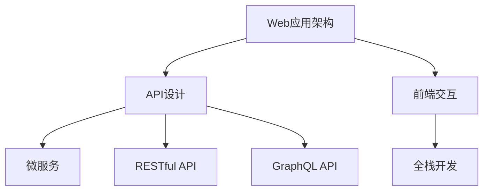

                 

# Web应用架构：从后端API到前端交互

> 关键词：Web应用架构,API设计,前端交互,全栈开发,微服务,RESTful API,DevOps,DevSecOps

## 1. 背景介绍

随着互联网技术的快速发展和普及，Web应用架构已经成为了现代软件开发的重要组成部分。传统的Web应用架构往往将后端逻辑和前端页面分别独立开发，中间通过简单的接口进行通信，难以支持复杂业务场景和高度自动化的流程。现代的Web应用架构则强调前后端融合、全栈开发和自动化流程，以实现更高的效率、更好的用户体验和更强的系统稳定性。

### 1.1 问题由来

Web应用的演进大致可以分为以下几个阶段：

- **单体应用架构**：早期的Web应用大多基于单体架构，即前后端逻辑全部集中在同一服务器上。这种方式简单快速，但随着应用复杂度提高，维护难度也随之增加。
- **分层架构**：为了解决单体应用的扩展性问题，开发者开始采用分层架构，将应用分为逻辑层、展示层和数据层，分别运行在不同的服务器上。这种架构提高了扩展性，但增加了系统复杂度。
- **微服务架构**：随着应用规模的进一步扩大，传统分层架构也难以应对高并发的业务需求。微服务架构应运而生，将应用划分为多个独立的小服务，每个服务独立运行，通过轻量级通信协议进行协作。这种架构提升了系统的灵活性和可扩展性，但同时也带来了管理和协调上的挑战。
- **前后端分离**：随着前端技术的演进，特别是Node.js和JavaScript生态的成熟，前后端分离成为了一种趋势。前后端分别独立开发，通过RESTful API进行通信，提高了系统的可维护性和可扩展性。
- **全栈开发**：随着框架如React、Vue等的发展，前端技术逐渐具备了后端的功能，前后端开发趋向融合，全栈开发成为新的热点。

本文将从后端API和前端交互两个方面，系统阐述Web应用架构的核心概念、实现原理和优化策略，为读者提供全面的技术指引。

## 2. 核心概念与联系

### 2.1 核心概念概述

为了更好地理解Web应用架构，本节将介绍几个密切相关的核心概念：

- **Web应用架构**：指通过合理设计后端服务、前端页面和中间件，实现前后端通信、数据交互和用户体验的架构体系。Web应用架构是现代软件开发的基础，涵盖从前端界面到后端逻辑的各个层面。
- **API设计**：指设计符合RESTful、GraphQL等规范的API接口，实现前后端数据交互和功能集成。API设计是Web应用架构的关键环节，直接影响系统性能和用户体验。
- **前端交互**：指在前端页面中通过JavaScript等技术实现与后端API的通信和数据渲染，提供用户友好的交互体验。前端交互是Web应用架构的重要组成部分，直接决定用户体验的好坏。
- **全栈开发**：指由前端和后端开发人员共同合作，从需求分析到产品部署的全流程开发方式。全栈开发可以提升开发效率，降低沟通成本，但也需要开发者具备更全面的技术能力。
- **微服务架构**：指将应用拆分为多个独立的服务，每个服务运行在独立的进程中，通过轻量级通信协议（如HTTP、gRPC）进行通信的架构风格。微服务架构能够提高系统的可扩展性和容错性，但管理和协调难度较大。
- **RESTful API**：指符合REST原则的API设计风格，通过标准HTTP方法（如GET、POST、PUT、DELETE）和URL路径实现资源的CRUD操作。RESTful API具有良好的扩展性和可维护性，是现代Web应用架构的主流选择。
- **GraphQL API**：指一种以数据为中心的查询语言，通过一次性请求获取所有需要的数据。GraphQL API能够减少前后端之间的数据传输量，提升系统性能，但学习成本较高。

这些核心概念之间的逻辑关系可以通过以下Mermaid流程图来展示：



这个流程图展示了几大核心概念的相互关系：

1. Web应用架构是连接前后端的基础，涵盖API设计、前端交互、全栈开发等多个层面。
2. API设计是Web应用架构的关键环节，分为RESTful和GraphQL等不同风格。
3. 前端交互是Web应用架构的重要组成部分，通过JavaScript等技术实现与API的通信和数据渲染。
4. 全栈开发是现代Web应用架构的趋势，前后端共同合作，提升开发效率和系统稳定性。
5. 微服务架构是一种模块化、可扩展的架构风格，通过服务划分提升系统灵活性。
6. RESTful API和GraphQL API是API设计的两种主要风格，各自有优缺点，需根据实际需求选择。

## 3. 核心算法原理 & 具体操作步骤
### 3.1 算法原理概述

Web应用架构的核心原理是前后端解耦、模块化和自动化。其核心思想是：将应用拆分为多个独立的服务模块，通过标准化的接口实现前后端通信，通过自动化工具提升开发效率，通过持续集成和部署提升系统稳定性和可靠性。

### 3.2 算法步骤详解

Web应用架构的实现步骤如下：

**Step 1: 设计服务模块**
- 分析应用需求，设计前后端模块。
- 将业务逻辑、数据存储、展示层分别独立成服务模块。
- 考虑服务模块之间的依赖关系，设计合理的数据流动路径。

**Step 2: 设计API接口**
- 确定服务模块间的通信协议，如RESTful或GraphQL。
- 定义API接口的请求和响应格式，符合标准规范。
- 设计API的权限控制策略，确保数据安全和系统稳定。

**Step 3: 实现服务模块**
- 独立开发前后端服务模块，遵循设计规范。
- 前后端协同开发，确保接口一致性和性能。
- 应用容器技术如Docker，实现服务的快速部署和扩展。

**Step 4: 集成API接口**
- 将前后端服务模块集成在一起，通过API接口实现通信。
- 配置中间件，实现API的负载均衡、缓存和错误处理。
- 应用消息队列等技术，实现异步通信和数据解耦。

**Step 5: 自动化流程**
- 应用持续集成和部署工具，如Jenkins、Travis CI等，实现代码的自动化构建和测试。
- 应用持续监控工具，如Prometheus、Grafana等，实时监控系统性能和健康状态。
- 应用自动化测试工具，如Selenium、Jest等，确保代码质量和安全。

**Step 6: 持续优化**
- 收集用户反馈，持续优化前后端服务模块。
- 应用A/B测试、灰度发布等技术，提升用户体验和系统稳定性。
- 应用DevSecOps理念，将安全、运维和开发集成在一起，提升系统安全性和可靠性。

### 3.3 算法优缺点

Web应用架构的优点在于：
- 前后端解耦：前后端服务模块独立开发，降低维护难度，提升系统稳定性。
- 模块化设计：服务模块独立运行，支持快速扩展和功能复用。
- 自动化流程：通过自动化工具提升开发效率和系统可靠性。
- 用户体验优化：前后端协同开发，提升用户体验和系统性能。

Web应用架构的缺点在于：
- 管理和协调难度较大：服务模块之间的协同需要协调管理。
- 技术和沟通成本高：前后端协同开发需要跨领域沟通。
- 资源消耗较大：服务模块数量多，资源消耗大。
- 学习曲线较陡：涉及前后端多个技术栈，学习成本较高。

尽管存在这些缺点，但Web应用架构仍是现代软件开发的主流范式，广泛应用于复杂业务场景和自动化流程中。通过合理设计服务模块、API接口和自动化流程，Web应用架构能够显著提升系统的灵活性、稳定性和可扩展性。

### 3.4 算法应用领域

Web应用架构在各种应用场景中都有广泛的应用，例如：

- **电商系统**：通过微服务架构实现商品管理、订单处理、用户登录等功能模块，通过RESTful API实现前后端通信。
- **金融系统**：通过前后端分离，实现交易处理、风险控制、客户服务等功能模块，通过GraphQL API实现数据整合和展示。
- **SaaS应用**：通过全栈开发，实现云平台、应用接口、用户界面等功能模块，通过RESTful API实现统一数据接入。
- **企业门户**：通过前后端协同开发，实现内部文档、邮件、审批等功能模块，通过GraphQL API实现实时数据更新。
- **游戏平台**：通过微服务架构实现游戏逻辑、数据存储、用户界面等功能模块，通过RESTful API实现实时数据传输。

## 4. 数学模型和公式 & 详细讲解  
### 4.1 数学模型构建

Web应用架构的数学模型可以抽象为：

- **输入**：用户请求和系统环境数据。
- **输出**：用户响应和系统状态更新。
- **中间环节**：前后端通信、数据处理和状态维护。

Web应用架构的实现过程可以用以下公式来描述：

$$
Y=f(X)
$$

其中 $X$ 为输入数据，$Y$ 为输出结果，$f$ 为中间环节的计算过程。

### 4.2 公式推导过程

以RESTful API为例，其请求和响应过程可以表示为：

- **请求**：用户发起HTTP请求，请求参数和URL路径作为输入数据。
- **中间环节**：后端服务模块接收请求，解析请求参数，调用业务逻辑处理数据，返回数据结果。
- **响应**：后端服务模块将结果数据打包成HTTP响应，返回给用户。

该过程可以用以下伪代码来描述：

```python
# 请求处理函数
def handle_request(request):
    # 解析请求参数和URL路径
    params, path = request.parse()
    # 调用业务逻辑处理数据
    result = business_logic.process(params, path)
    # 返回响应数据
    return result

# 业务逻辑处理函数
def process(params, path):
    # 处理请求数据
    # ...
    return result
```

通过这个伪代码，可以看出RESTful API的请求和响应过程涉及多个中间环节，包括请求解析、业务逻辑处理、数据打包等。这些环节的计算过程可以用数学公式表示为：

$$
Y=f(X, P)
$$

其中 $X$ 为输入数据，$P$ 为系统环境参数（如配置信息、缓存数据等），$f$ 为计算过程。

### 4.3 案例分析与讲解

以电商平台为例，分析其前后端通信和数据渲染过程。

**Step 1: 设计服务模块**
- 商品管理模块：负责商品信息管理、库存更新等业务逻辑。
- 订单处理模块：负责订单生成、支付处理等业务逻辑。
- 用户登录模块：负责用户认证、权限管理等业务逻辑。
- 展示层模块：负责商品展示、订单页面等界面呈现。

**Step 2: 设计API接口**
- 定义RESTful API的请求和响应格式，如JSON。
- 设计API接口的权限控制策略，确保用户数据安全。
- 实现API接口的负载均衡和缓存策略，提升系统性能。

**Step 3: 实现服务模块**
- 独立开发前后端服务模块，遵循设计规范。
- 前后端协同开发，确保接口一致性和性能。
- 应用容器技术如Docker，实现服务的快速部署和扩展。

**Step 4: 集成API接口**
- 将前后端服务模块集成在一起，通过API接口实现通信。
- 配置中间件，实现API的负载均衡、缓存和错误处理。
- 应用消息队列等技术，实现异步通信和数据解耦。

**Step 5: 自动化流程**
- 应用持续集成和部署工具，如Jenkins、Travis CI等，实现代码的自动化构建和测试。
- 应用持续监控工具，如Prometheus、Grafana等，实时监控系统性能和健康状态。
- 应用自动化测试工具，如Selenium、Jest等，确保代码质量和安全。

## 5. 项目实践：代码实例和详细解释说明
### 5.1 开发环境搭建

在进行Web应用架构的实践前，我们需要准备好开发环境。以下是使用Node.js和Express框架搭建Web应用的基本流程：

1. 安装Node.js：从官网下载并安装Node.js，创建开发环境。
2. 创建项目目录：
```bash
mkdir web-app
cd web-app
npm init -y
```
3. 安装Express框架：
```bash
npm install express body-parser cors
```
4. 创建后端服务模块：
```bash
npm init -y
npm install express body-parser cors
```
5. 创建前端界面：
```bash
npm init -y
npm install react react-dom react-router-dom
```

完成上述步骤后，即可在开发环境中开始Web应用架构的实践。

### 5.2 源代码详细实现

这里我们以电商平台为例，展示如何实现商品管理模块的RESTful API接口。

首先，创建商品管理模块的后端服务代码：

```javascript
const express = require('express');
const bodyParser = require('body-parser');
const cors = require('cors');

const app = express();
app.use(bodyParser.json());
app.use(cors());

let products = [];

// 获取商品列表
app.get('/api/products', (req, res) => {
    res.json(products);
});

// 获取单个商品信息
app.get('/api/products/:id', (req, res) => {
    const id = parseInt(req.params.id);
    const product = products.find(p => p.id === id);
    res.json(product);
});

// 添加商品
app.post('/api/products', (req, res) => {
    const product = req.body;
    product.id = products.length + 1;
    products.push(product);
    res.json(product);
});

// 更新商品
app.put('/api/products/:id', (req, res) => {
    const id = parseInt(req.params.id);
    const product = products.find(p => p.id === id);
    product.name = req.body.name;
    product.price = req.body.price;
    res.json(product);
});

// 删除商品
app.delete('/api/products/:id', (req, res) => {
    const id = parseInt(req.params.id);
    const index = products.findIndex(p => p.id === id);
    products.splice(index, 1);
    res.json({ success: true });
});

app.listen(3000, () => {
    console.log('Server started on port 3000');
});
```

然后，创建前端界面代码：

```javascript
import React from 'react';
import ReactDOM from 'react-dom';
import { BrowserRouter as Router, Route, Link } from 'react-router-dom';

class ProductList extends React.Component {
    state = {
        products: [],
    }

    componentDidMount() {
        fetch('/api/products')
            .then(response => response.json())
            .then(data => this.setState({ products: data }))
            .catch(error => console.error(error));
    }

    render() {
        const { products } = this.state;
        return (
            <div>
                <h1>Product List</h1>
                <ul>
                    {products.map(product => (
                        <li key={product.id}>
                            <Link to={`/api/products/${product.id}`}>{product.name}</Link>
                        </li>
                    ))}
                </ul>
            </div>
        );
    }
}

class ProductDetail extends React.Component {
    state = {
        product: null,
    }

    componentDidMount() {
        const id = this.props.match.params.id;
        fetch(`/api/products/${id}`)
            .then(response => response.json())
            .then(data => this.setState({ product: data }))
            .catch(error => console.error(error));
    }

    render() {
        const { product } = this.state;
        return (
            <div>
                <h1>{product && product.name}</h1>
                <p>{product && product.price}</p>
            </div>
        );
    }
}

ReactDOM.render(
    <Router>
        <Route exact path="/" component={ProductList} />
        <Route path="/products/:id" component={ProductDetail} />
    </Router>,
    document.getElementById('root')
);
```

最后，启动Web应用：

```bash
node app.js
```

在浏览器中访问`http://localhost:3000`，即可看到商品管理模块的前端界面和后端接口。

### 5.3 代码解读与分析

让我们再详细解读一下关键代码的实现细节：

**后端服务代码**：
- 创建Express应用，引入`body-parser`和`cors`中间件，用于解析请求参数和跨域处理。
- 定义商品列表数组`products`，作为数据存储。
- 实现`/api/products`接口，用于获取商品列表。
- 实现`/api/products/:id`接口，用于获取单个商品信息。
- 实现`/api/products`接口，用于添加商品。
- 实现`/api/products/:id`接口，用于更新商品。
- 实现`/api/products/:id`接口，用于删除商品。

**前端界面代码**：
- 创建`ProductList`组件，用于渲染商品列表。
- 创建`ProductDetail`组件，用于渲染单个商品信息。
- 使用`React Router`实现前后端通信，通过`Route`组件映射不同的URL路径到不同的组件。
- 通过`fetch`函数调用后端API接口，获取和渲染商品数据。

以上代码展示了使用Node.js和Express框架实现Web应用架构的基本流程。通过前后端分离，代码实现相对简单，易于维护和扩展。

## 6. 实际应用场景
### 6.1 智能客服系统

智能客服系统是Web应用架构的重要应用场景之一。通过前后端分离和微服务架构，可以实现智能客服的自动化处理。

在智能客服系统中，前后端协同开发可以提升系统响应速度和用户体验。前端界面通过WebSocket协议与后端API实时通信，实现用户的即时反馈。后端API通过NLP技术分析用户问题，调用知识库和业务逻辑生成回答，再将回答返回前端界面。

**应用场景**：
- **自动回复**：通过NLP技术分析用户问题，调用知识库生成自动回复。
- **智能路由**：根据用户问题智能选择路由，调用不同后端服务模块。
- **数据分析**：通过后端API收集用户行为数据，进行数据分析和业务优化。

### 6.2 金融系统

金融系统是Web应用架构的典型应用之一。通过前后端分离和微服务架构，可以实现金融系统的高度自动化和复杂业务处理。

在金融系统中，前后端协同开发可以提升系统处理速度和稳定性。前端界面通过API调用后端服务模块，实现金融数据的实时渲染和用户交互。后端服务模块通过消息队列和缓存技术，提升系统性能和可靠性。

**应用场景**：
- **交易处理**：通过前后端分离，实现交易数据的实时处理和渲染。
- **风险控制**：通过微服务架构，实现风险控制的实时分析和处理。
- **用户认证**：通过微服务架构，实现用户认证的快速和稳定。

### 6.3 电商系统

电商系统是Web应用架构的另一大应用场景。通过前后端分离和微服务架构，可以实现电商系统的高度自动化和复杂业务处理。

在电商系统中，前后端协同开发可以提升系统处理速度和用户体验。前端界面通过API调用后端服务模块，实现商品数据的实时渲染和用户交互。后端服务模块通过缓存和消息队列技术，提升系统性能和可靠性。

**应用场景**：
- **商品管理**：通过前后端分离，实现商品数据的实时处理和渲染。
- **订单处理**：通过微服务架构，实现订单数据的实时分析和处理。
- **用户推荐**：通过微服务架构，实现用户推荐的实时分析和处理。

## 7. 工具和资源推荐
### 7.1 学习资源推荐

为了帮助开发者系统掌握Web应用架构的理论基础和实践技巧，这里推荐一些优质的学习资源：

1. **《深入浅出 Node.js》**：全面介绍了Node.js和Express框架的基础知识和实际应用，适合初学者入门。
2. **《RESTful Web服务》**：介绍了RESTful API的设计原则和实现技巧，适合进阶学习。
3. **《JavaScript高级程序设计》**：深入讲解JavaScript语言特性和开发实践，适合Web前端开发。
4. **《Web应用架构实战》**：通过实战项目，讲解Web应用架构的实现过程，适合实战练习。
5. **《Web应用性能优化实战》**：讲解Web应用性能优化的各种技巧和方法，适合性能优化实践。

通过对这些资源的学习实践，相信你一定能够快速掌握Web应用架构的核心概念和实践技巧，并应用于实际项目中。

### 7.2 开发工具推荐

高效的开发离不开优秀的工具支持。以下是几款用于Web应用架构开发的常用工具：

1. **Node.js**：轻量级的JavaScript运行环境，适合前后端分离的开发。
2. **Express框架**：基于Node.js的Web应用框架，提供路由、中间件、模板引擎等基础功能。
3. **React框架**：流行的JavaScript库，用于构建前端界面。
4. **React Router**：用于实现前端路由的组件库，支持RESTful API和GraphQL API。
5. **Docker容器**：轻量级的容器化解决方案，方便前后端服务的快速部署和扩展。
6. **Jenkins**：持续集成和持续部署工具，用于自动化构建和测试。
7. **Prometheus和Grafana**：实时监控和可视化工具，用于监控系统性能和健康状态。
8. **Selenium和Jest**：自动化测试工具，用于确保代码质量和安全性。

合理利用这些工具，可以显著提升Web应用架构的开发效率，加快创新迭代的步伐。

### 7.3 相关论文推荐

Web应用架构的研究源于学界的持续探索。以下是几篇奠基性的相关论文，推荐阅读：

1. **《Web应用架构基础》**：介绍了Web应用架构的基本概念和设计原则。
2. **《微服务架构：原理与实践》**：讲解了微服务架构的实现方法和最佳实践。
3. **《RESTful API设计指南》**：介绍了RESTful API的设计原则和实现技巧。
4. **《DevSecOps：开发、安全与运维一体化》**：介绍了DevSecOps理念和实践方法。
5. **《全栈开发：前后端协同开发的新趋势》**：介绍了全栈开发的实现方法和实际应用。

这些论文代表了大语言模型微调技术的发展脉络。通过学习这些前沿成果，可以帮助研究者把握学科前进方向，激发更多的创新灵感。

## 8. 总结：未来发展趋势与挑战

### 8.1 总结

本文对Web应用架构进行了全面系统的介绍。首先阐述了Web应用架构的演进过程和核心概念，明确了Web应用架构的核心思想和实现原则。其次，从后端API和前端交互两个方面，详细讲解了Web应用架构的实现步骤和关键技巧。同时，本文还探讨了Web应用架构在智能客服、金融系统、电商系统等多个行业领域的应用前景，展示了Web应用架构的广阔前景。最后，本文推荐了几款优质的学习资源、开发工具和相关论文，力求为读者提供全方位的技术指引。

通过本文的系统梳理，可以看到，Web应用架构是现代软件开发的重要基础，涵盖前后端通信、数据处理和系统监控等多个层面。通过前后端分离和微服务架构，Web应用架构能够显著提升系统的灵活性、稳定性和可扩展性，满足复杂业务场景和自动化流程的需求。

### 8.2 未来发展趋势

展望未来，Web应用架构将呈现以下几个发展趋势：

1. **全栈开发**：随着前端技术的演进，全栈开发将成为主流趋势，前后端协同开发提升开发效率和系统稳定性。
2. **微服务架构**：微服务架构在复杂业务场景中的应用将更加广泛，提升系统灵活性和容错性。
3. **实时通信**：Web实时通信技术如WebSocket、Server-Sent Events等将更加普及，提升用户体验和系统响应速度。
4. **无状态架构**：无状态架构将更加流行，通过缓存和消息队列技术提升系统性能和可扩展性。
5. **DevSecOps**：DevSecOps理念将进一步推广，实现开发、安全和运维一体化，提升系统稳定性和安全性。
6. **自动化工具**：持续集成和持续部署工具、实时监控工具等将更加普及，提升开发效率和系统可靠性。
7. **前端框架**：新的前端框架和技术将不断涌现，提升Web应用的性能和用户体验。

这些趋势凸显了Web应用架构的广阔前景。通过合理设计服务模块、API接口和自动化流程，Web应用架构能够显著提升系统的灵活性、稳定性和可扩展性。

### 8.3 面临的挑战

尽管Web应用架构已经取得了瞩目成就，但在迈向更加智能化、普适化应用的过程中，它仍面临诸多挑战：

1. **管理和协调难度较大**：服务模块之间的协同需要协调管理，技术栈复杂，沟通成本高。
2. **技术和沟通成本高**：前后端协同开发需要跨领域沟通，技术栈多样，学习成本较高。
3. **资源消耗较大**：服务模块数量多，资源消耗大，需要合理优化资源配置。
4. **学习曲线较陡**：涉及前后端多个技术栈，学习成本较高，需要综合提升技术能力。
5. **系统复杂性高**：微服务架构和前后端分离增加了系统复杂性，需要合理设计系统结构。
6. **安全性问题**：前后端通信存在安全隐患，需要加强数据加密和权限控制。

尽管存在这些挑战，但Web应用架构仍是现代软件开发的主流范式，广泛应用于复杂业务场景和自动化流程中。通过合理设计服务模块、API接口和自动化流程，Web应用架构能够显著提升系统的灵活性、稳定性和可扩展性。

### 8.4 研究展望

面对Web应用架构所面临的种种挑战，未来的研究需要在以下几个方面寻求新的突破：

1. **前后端融合**：通过前后端协同开发，提升开发效率和系统稳定性，降低沟通成本。
2. **微服务优化**：优化微服务架构，提升系统灵活性和可扩展性，降低管理和协调难度。
3. **实时通信优化**：优化实时通信技术，提升系统响应速度和用户体验。
4. **无状态架构优化**：优化无状态架构，提升系统性能和可扩展性，降低缓存和消息队列的依赖。
5. **DevSecOps实践**：推广DevSecOps理念，实现开发、安全和运维一体化，提升系统稳定性和安全性。
6. **自动化工具优化**：优化自动化工具，提升开发效率和系统可靠性，降低技术复杂性。
7. **前端框架优化**：优化前端框架和技术，提升Web应用的性能和用户体验。

这些研究方向将推动Web应用架构的持续演进，提升系统的灵活性、稳定性和可扩展性，为Web应用的创新和应用提供更多可能性。

## 9. 附录：常见问题与解答

**Q1：Web应用架构和前后端分离有什么区别？**

A: Web应用架构是一种系统化的架构设计方法，涵盖前后端通信、数据处理和系统监控等多个层面。前后端分离则是Web应用架构的一个组成部分，主要指前后端代码分别独立开发，通过API接口进行通信。

**Q2：微服务架构和RESTful API有什么区别？**

A: 微服务架构是一种模块化、可扩展的架构风格，通过服务划分提升系统灵活性。RESTful API是一种符合REST原则的API接口设计风格，通过标准HTTP方法实现资源的CRUD操作。微服务架构关注系统模块化和可扩展性，而RESTful API关注接口设计和数据交互。

**Q3：DevSecOps和DevOps有什么区别？**

A: DevOps是一种文化和技术实践，旨在提升软件开发和运维的效率和质量。DevSecOps则是在DevOps基础上，引入了安全性理念，实现开发、安全和运维的一体化。DevSecOps强调系统安全性和可靠性，DevOps则更注重效率和协作。

**Q4：实时通信和WebSocket有什么区别？**

A: 实时通信是一种实现前后端数据实时交互的技术，包括WebSocket、Server-Sent Events等。WebSocket是一种基于TCP协议的全双工通信协议，可以实现双向实时通信。Server-Sent Events是一种基于HTTP协议的实时通信技术，适用于单向数据传输。

**Q5：Web应用架构的实现难点有哪些？**

A: Web应用架构的实现难点在于：前后端协同开发、服务模块划分、API接口设计、系统监控和优化等。前后端协同开发需要跨领域沟通，服务模块划分需要合理设计，API接口设计需要考虑接口一致性和性能，系统监控和优化需要综合考虑性能、安全和稳定性。

通过对这些问题的回答，希望能够帮助读者更好地理解Web应用架构的核心概念和实现技巧，快速上手Web应用架构的实践。

---

作者：禅与计算机程序设计艺术 / Zen and the Art of Computer Programming

