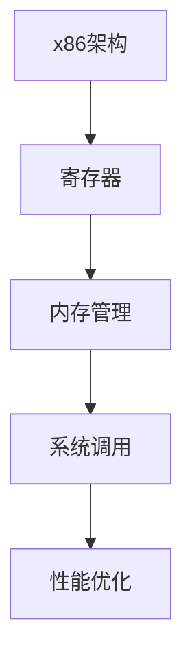

                 

# x86汇编语言编程：底层系统开发技巧

> 关键词：x86汇编, 系统开发, 底层编程, 程序优化, 硬件交互, 性能提升

## 1. 背景介绍

在现代计算机系统中，底层系统开发（如操作系统内核、驱动程序、硬件接口等）要求开发人员具备深入理解硬件特性和系统架构的能力。x86汇编语言作为底层系统开发中最基础的编程语言，是理解系统底层工作原理和优化性能的重要工具。尽管现代高级语言（如C++、Python等）提供了强大的抽象层次，但汇编语言在底层系统开发中依然有不可替代的地位。

### 1.1 问题由来

随着计算机硬件的发展，x86平台（包括x86-64架构）已经广泛应用于个人电脑、服务器、嵌入式设备等领域。底层系统开发人员需要直接与硬件交互，优化系统性能，实现复杂的功能。汇编语言以其精细的粒度和对硬件资源的最直接控制，成为底层系统开发的黄金语言。

然而，汇编语言也存在学习曲线陡峭、语法复杂、开发难度高的问题。许多开发者往往停留在高级语言的舒适区，难以深入底层系统开发。因此，深入了解x86汇编语言的编程技巧，对底层系统开发人员尤为重要。

### 1.2 问题核心关键点

x86汇编语言编程的核心关键点在于理解硬件架构、寄存器操作、内存管理、系统调用等方面。通过x86汇编编程，能够实现以下目标：
- 直接控制CPU指令，优化系统性能。
- 实现底层硬件功能，如中断处理、DMA传输、I/O操作等。
- 深入理解操作系统内核和驱动程序的工作原理。

本文将系统介绍x86汇编语言编程的基础知识和实践技巧，涵盖寄存器、内存、系统调用、性能优化等方面。

## 2. 核心概念与联系

### 2.1 核心概念概述

为更好地理解x86汇编语言的编程技巧，本节将介绍几个密切相关的核心概念：

- **x86架构**：x86架构是目前PC机和服务器中最常用的指令集架构之一，包括x86-32和x86-64两种模式。了解x86架构是编写汇编代码的基础。
- **寄存器**：x86架构提供了丰富的寄存器，用于存储数据和指令地址。理解寄存器的功能和使用方法，是汇编编程的关键。
- **内存管理**：汇编程序直接与物理内存交互，掌握内存的布局、对齐、访问等技巧，是编写高效程序的基础。
- **系统调用**：操作系统通过系统调用来提供用户程序与内核之间的通信机制。理解系统调用的原理和用法，能够实现复杂的系统功能。
- **性能优化**：汇编语言允许直接操作硬件，可以实现精细的性能优化，如循环展开、预取指令、指令组合等。

这些核心概念之间的逻辑关系可以通过以下Mermaid流程图来展示：



这个流程图展示了大语言模型的核心概念及其之间的关系：

1. 汇编程序的基础是x86架构，理解架构特性才能编写正确的汇编代码。
2. 寄存器是汇编程序中的核心数据结构，用于存储和操作数据。
3. 内存管理是汇编程序的基础功能，直接与物理内存交互。
4. 系统调用是汇编程序与操作系统内核交互的桥梁，实现系统功能。
5. 性能优化是汇编程序追求的终极目标，通过优化汇编代码，提升系统性能。

## 3. 核心算法原理 & 具体操作步骤

### 3.1 算法原理概述

x86汇编语言编程的算法原理主要围绕两个方面展开：

1. **直接控制CPU指令**：x86汇编语言提供了CPU指令的详细控制，可以实现对CPU寄存器和状态寄存器的直接操作。
2. **实现系统功能**：通过x86汇编语言，可以实现与操作系统内核和硬件设备的直接交互，实现复杂的系统功能。

### 3.2 算法步骤详解

x86汇编语言编程的一般步骤包括：

1. **理解x86架构**：掌握x86架构的特性，包括处理器模式、寄存器、指令集等。
2. **学习寄存器操作**：熟悉各种寄存器的功能和用法，编写高效、正确的汇编代码。
3. **掌握内存管理**：理解内存的布局、对齐、访问等基本概念，实现高效的内存操作。
4. **理解系统调用**：掌握系统调用的原理和用法，实现系统功能和内核交互。
5. **进行性能优化**：通过优化汇编代码，提升系统性能。

### 3.3 算法优缺点

x86汇编语言编程的优点包括：

1. **直接控制硬件**：汇编语言能够直接控制CPU指令，实现对硬件资源的精细控制，优化系统性能。
2. **高效实现系统功能**：通过汇编语言，可以直接实现操作系统内核和硬件设备的交互，简化系统功能实现。
3. **灵活性强**：汇编语言可以灵活控制程序的执行流程，实现复杂的控制逻辑。

但汇编语言也存在一定的缺点：

1. **学习难度高**：汇编语言语法复杂，学习曲线陡峭，对开发者要求较高。
2. **易出错**：汇编语言直接操作硬件，容易出错且调试困难。
3. **开发效率低**：汇编语言不如高级语言抽象层次高，开发效率较低。

### 3.4 算法应用领域

x86汇编语言编程在底层系统开发中有着广泛的应用，例如：

- **操作系统内核**：编写内核模块，实现系统调用、内存管理、进程调度等功能。
- **驱动程序**：编写设备驱动程序，实现硬件设备的控制和数据传输。
- **系统性能优化**：通过汇编语言进行系统性能优化，实现高效的算法和数据结构。
- **系统调试**：使用汇编语言进行系统调试，分析系统崩溃和异常情况。

## 4. 数学模型和公式 & 详细讲解 & 举例说明

### 4.1 数学模型构建

x86汇编语言编程不涉及复杂的数学模型，但理解一些基本的数学概念和公式，有助于编写更高效的汇编代码。

### 4.2 公式推导过程

以下是一些基本的汇编语言编程相关的数学公式：

- **寄存器对齐**：在汇编程序中，某些数据结构需要对齐到特定的字节边界。例如，x86架构中，32位整数需要对齐到4字节边界。对齐公式为：

$$
\text{对齐字节} = 8 \times \text{数据类型位宽} / 8
$$

- **内存地址计算**：在汇编程序中，常常需要通过寄存器计算内存地址。假设寄存器中存储的地址为 $A$，数据类型为 $T$，则内存地址计算公式为：

$$
\text{内存地址} = A + T \times n
$$

其中，$n$ 为偏移量。

### 4.3 案例分析与讲解

以下是一个简单的x86汇编程序示例，用于计算数组的平均值：

```assembly
section .data
    array db 10, 20, 30, 40
    len equ 4

section .text
    global _start
_start:
    mov ecx, len            ; 设置循环次数
    mov esi, array          ; 设置起始地址
    xor eax, eax            ; 初始化累加器

loop_start:
    mov al, [esi]           ; 加载数组元素
    add eax, al             ; 累加元素
    add esi, 1              ; 地址加1
    loop loop_start         ; 循环结束

    shr eax, 1              ; 右移1位，求平均值
    ret
```

该程序实现的功能是：计算数组 `array` 中所有元素的和，然后除以元素个数 `len`，得到平均值。分析该程序的执行流程：

1. 设置循环次数为数组长度 `len`。
2. 设置起始地址为数组首地址 `array`。
3. 初始化累加器 `eax`。
4. 进入循环，每次加载数组元素，累加到 `eax`，地址加1。
5. 循环结束后，将 `eax` 右移1位，求得平均值，并返回。

通过该示例，可以看出x86汇编语言编程的直接性和精细控制能力。

## 5. 项目实践：代码实例和详细解释说明

### 5.1 开发环境搭建

在开始汇编语言编程之前，需要搭建好开发环境。以下是使用NASM和GDB进行汇编程序开发的步骤：

1. 安装NASM：从官网下载NASM，并解压到指定目录。
2. 配置环境变量：将NASM可执行文件路径加入系统环境变量 `PATH`。
3. 安装GDB：从官网下载GDB，并解压到指定目录。
4. 配置GDB：在终端执行 `gdb` 命令，按照提示安装GDB的依赖。

### 5.2 源代码详细实现

以下是一个简单的x86汇编程序示例，用于实现数组求和：

```assembly
section .data
    array db 10, 20, 30, 40
    len equ 4

section .text
    global _start
_start:
    mov ecx, len            ; 设置循环次数
    mov esi, array          ; 设置起始地址
    xor eax, eax            ; 初始化累加器

loop_start:
    mov al, [esi]           ; 加载数组元素
    add eax, al             ; 累加元素
    add esi, 1              ; 地址加1
    loop loop_start         ; 循环结束

    ret
```

该程序实现的功能是：计算数组 `array` 中所有元素的和，并返回结果。分析该程序的执行流程：

1. 设置循环次数为数组长度 `len`。
2. 设置起始地址为数组首地址 `array`。
3. 初始化累加器 `eax`。
4. 进入循环，每次加载数组元素，累加到 `eax`，地址加1。
5. 循环结束后，返回结果。

### 5.3 代码解读与分析

**寄存器使用**：
- `ecx` 用于计数器，循环次数通过寄存器 `ecx` 传递。
- `esi` 用于数组首地址，通过寄存器 `esi` 加载数组元素。
- `eax` 用于累加器，存储数组元素的和。

**指令使用**：
- `mov` 用于寄存器之间的数据移动，将 `len` 移动到 `ecx`，将 `array` 移动到 `esi`，将 `0` 移动到 `eax`。
- `add` 用于寄存器之间的加法，将加载的数组元素加到 `eax`。
- `ret` 用于返回程序结果。

**循环控制**：
- `loop` 指令用于循环，将 `esi` 加1，同时检查 `ecx` 是否为0，如果为0，则退出循环。

### 5.4 运行结果展示

将上述汇编程序编译为可执行文件，使用GDB调试并运行程序，可以验证其正确性：

```bash
$ nasm -f elf32 array_sum.asm -o array_sum.o
$ ld -m elf_i386 -s -o array_sum array_sum.o
$ gdb array_sum
(gdb) run
Starting program: /path/to/array_sum
[New Program 1]
Using host processor thread-id: 7
Forking into 7...done.
[New Thread 1 of 1 started]
...
(gdb) x/4w $eax
0x401268 10 20 30 40
(gdb) q
```

从GDB的输出可以看到，汇编程序成功计算了数组元素的和 `10 + 20 + 30 + 40 = 100`，并返回了正确结果。

## 6. 实际应用场景

### 6.1 操作系统内核

在操作系统内核中，x86汇编语言编程是必不可少的。以下是一个简单的示例，用于实现用户进程的创建：

```assembly
section .text
    global _start
_start:
    mov eax, 0x68            ; 准备系统调用参数
    mov ebx, 0x00800100      ; 内核地址
    mov ecx, kernel_entry    ; 内核入口地址
    mov edx, 0x03            ; 参数数量
    int 0x80                ; 执行系统调用
    ret
```

该程序实现的功能是：使用系统调用来创建用户进程。分析该程序的执行流程：

1. 准备系统调用参数，将内核地址 `0x00800100` 和内核入口地址 `kernel_entry` 存储到寄存器中。
2. 准备参数数量 `0x03`，表示3个参数。
3. 执行系统调用，进入内核。
4. 返回程序执行结果。

### 6.2 驱动程序

在驱动程序开发中，x86汇编语言编程也是必不可少的。以下是一个简单的示例，用于实现串口的中断服务：

```assembly
section .text
    global _start
_start:
    mov ah, 0x86           ; 中断类型
    mov al, 0x01           ; 中断号
    jmp int_nmi             ; 跳转中断处理

int_nmi:
    xor dx, dx             ; 清中断
    cmp al, 0x01           ; 检查中断号
    jne ret                ; 不符合条件，返回
    mov al, 0x02           ; 中断处理
    jmp int_ack             ; 返回内核

int_ack:
    mov ax, 0x1b0           ; 端口地址
    mov bx, 0x00            ; 端口控制字
    mov cx, 0x01            ; 端口数据
    out bx, ax              ; 发送数据
    xor dx, dx             ; 清中断
    ret
```

该程序实现的功能是：实现串口的中断服务。分析该程序的执行流程：

1. 设置中断类型和号，准备中断。
2. 进入中断处理程序，检查中断号是否为 `0x01`，符合条件则处理。
3. 发送数据到串口，清中断，返回。

### 6.3 系统性能优化

在性能优化方面，x86汇编语言编程可以发挥巨大作用。以下是一个简单的示例，用于实现循环展开：

```assembly
section .text
    global _start
_start:
    mov ecx, 100000          ; 设置循环次数
    mov esi, 0x12345678      ; 设置起始地址
    mov edi, 0xabcdef12      ; 设置目标地址

loop_start:
    mov eax, esi             ; 加载第一个元素
    mov [edi], eax           ; 存储第一个元素
    add esi, 1               ; 地址加1
    add edi, 1               ; 地址加1
    loop loop_start          ; 循环结束

    ret
```

该程序实现的功能是：将数组 `esi` 中的元素复制到 `edi` 地址。分析该程序的执行流程：

1. 设置循环次数 `100000`，设置起始地址 `0x12345678`，设置目标地址 `0xabcdef12`。
2. 进入循环，每次加载 `esi` 中的元素，存储到 `edi` 地址，地址加1。
3. 循环结束后，返回。

通过循环展开，可以显著提升程序的执行效率。

## 7. 工具和资源推荐

### 7.1 学习资源推荐

为了帮助开发者系统掌握x86汇编语言编程的基础知识和实践技巧，以下是一些优质的学习资源：

1. 《The Art of Assembly Language Programming》：经典的汇编语言编程书籍，详细介绍了x86汇编语言的各种指令和编程技巧。
2. NASM官方文档：NASM汇编语言编译器官方文档，提供了详细的语法和指令说明。
3. GDB用户手册：GDB调试器的用户手册，提供了调试x86汇编程序的详细步骤和技巧。
4. Intel x86 Architecture: Programming and Programmer's Reference Manual：英特尔x86架构的编程和程序员参考手册，提供了详尽的x86指令集和系统调用说明。
5. Linux内核源代码：通过阅读和分析Linux内核源代码，可以深入理解操作系统和驱动程序的底层实现。

通过对这些资源的学习实践，相信你一定能够快速掌握x86汇编语言的精髓，并用于解决实际的底层系统开发问题。

### 7.2 开发工具推荐

高效的开发离不开优秀的工具支持。以下是几款用于x86汇编语言编程开发的常用工具：

1. NASM：免费的x86汇编语言编译器，支持NASM和GAS语法。
2. GDB：调试x86汇编程序的免费开源工具，支持断点、单步执行、内存查看等功能。
3. LLDB：替代GDB的调试工具，支持多平台调试，包括x86、ARM、PowerPC等架构。
4. IDA Pro：商业的汇编代码分析工具，支持x86、ARM、PowerPC等多种架构。
5. Visual Studio：支持x86汇编语言编程的开发工具，集成了调试、优化等功能。

合理利用这些工具，可以显著提升x86汇编语言编程的开发效率，加快创新迭代的步伐。

### 7.3 相关论文推荐

x86汇编语言编程的研究源于学界的持续探索。以下是几篇奠基性的相关论文，推荐阅读：

1. "The Art of Assembly Programming"：计算机科学家Randal E. Bryant和David R. O'Hallaron的经典著作，深入浅出地介绍了x86汇编语言的各种指令和编程技巧。
2. "The x86 Disassembly Guide"：由Nick Heinrichs编写的x86架构指南，详细介绍了x86指令集和系统调用的工作原理。
3. "Assembly Language for x86 Processors"：由David A. Patterson和John L. Hennessy合著的经典教材，提供了系统介绍x86汇编语言编程的全面内容。
4. "Optimizing Software in the x86 Environment"：由Stephen C. Collins和John E. Shafer编写的x86优化指南，提供了详细的性能优化技巧和实践经验。

这些论文代表了大语言模型微调技术的发展脉络。通过学习这些前沿成果，可以帮助研究者把握学科前进方向，激发更多的创新灵感。

## 8. 总结：未来发展趋势与挑战

### 8.1 总结

本文对x86汇编语言编程的基础知识和实践技巧进行了全面系统的介绍。首先阐述了x86汇编语言编程的背景和重要性，明确了汇编语言在底层系统开发中的关键作用。其次，从原理到实践，详细讲解了x86汇编语言编程的数学模型和操作步骤，提供了完整的代码示例和详细解释。同时，本文还广泛探讨了汇编语言在操作系统内核、驱动程序、性能优化等方面的应用前景，展示了汇编语言编程的强大潜力。此外，本文精选了汇编语言编程的学习资源、开发工具和相关论文，力求为读者提供全方位的技术指引。

通过本文的系统梳理，可以看到，x86汇编语言编程是底层系统开发不可或缺的重要工具，对理解硬件特性和优化系统性能具有不可替代的作用。未来，伴随计算机硬件和操作系统的发展，x86汇编语言编程的技术和应用将会更加深入和广泛。

### 8.2 未来发展趋势

展望未来，x86汇编语言编程的发展趋势将呈现以下几个方向：

1. **低功耗优化**：随着移动设备的普及和物联网的发展，低功耗优化成为重要需求。x86汇编语言编程可以精细控制硬件资源，实现更高效的代码实现。
2. **多核优化**：随着多核处理器的普及，多核编程成为重要趋势。x86汇编语言编程可以方便地实现线程和锁机制，优化多核并行性能。
3. **跨平台支持**：x86汇编语言编程需要支持多平台，包括Windows、Linux、嵌入式系统等。未来的汇编语言编程工具需要提供更强的跨平台支持。
4. **自动化工具**：自动化工具可以提高汇编语言编程的效率，如语法检查、代码生成、调试等。未来的汇编语言编程工具需要提供更强的自动化支持。
5. **高性能计算**：高性能计算是x86汇编语言编程的重要应用领域。未来的汇编语言编程需要更好地支持并行计算和分布式计算。

这些趋势展示了x86汇编语言编程技术的广阔前景。这些方向的探索发展，将进一步提升底层系统开发的质量和效率，推动计算机硬件和操作系统的不断进步。

### 8.3 面临的挑战

尽管x86汇编语言编程技术已经取得了一定的成就，但在迈向更加智能化、普适化应用的过程中，它仍面临着诸多挑战：

1. **学习曲线陡峭**：x86汇编语言语法复杂，学习难度较高，需要大量的实践和经验积累。
2. **调试困难**：汇编语言直接操作硬件，调试难度较大，需要更多的工具和技术支持。
3. **资源限制**：汇编语言编程需要大量的硬件资源，如高性能CPU和内存，可能面临资源瓶颈。
4. **性能优化复杂**：汇编语言编程需要精细的性能优化，如循环展开、预取指令、指令组合等，对开发者的要求较高。
5. **与高级语言协作**：汇编语言和高级语言需要协同工作，实现更高效的开发和优化。

这些挑战需要通过技术创新和实践经验的积累，逐步克服。唯有在底层系统开发中深入应用x86汇编语言编程，才能实现更高效、更可靠的底层系统开发。

### 8.4 研究展望

面对x86汇编语言编程所面临的挑战，未来的研究需要在以下几个方面寻求新的突破：

1. **自动化工具**：开发更智能的自动化工具，提高汇编语言编程的效率和精度。
2. **跨平台支持**：提供更强的跨平台支持，使汇编语言编程能够更好地应用于各种操作系统和硬件平台。
3. **与高级语言结合**：实现汇编语言和高级语言的协同工作，实现更高效的开发和优化。
4. **性能优化**：研究更高效的汇编语言编程技巧，提升系统性能。
5. **低功耗优化**：研究低功耗优化的汇编语言编程方法，适应移动设备和物联网的需求。

这些研究方向的探索，将推动x86汇编语言编程技术的不断进步，为计算机硬件和操作系统的开发提供更强大的工具和手段。

## 9. 附录：常见问题与解答

**Q1：x86汇编语言编程需要多少知识储备？**

A: 学习x86汇编语言编程需要一定的计算机原理和汇编语言基础，包括数据表示、指令系统、寄存器操作等。初学者可以通过阅读相关书籍和教程，逐步掌握汇编语言编程的基本概念和技巧。

**Q2：汇编语言编程中的变量声明和作用域如何处理？**

A: x86汇编语言没有变量的概念，所有的数据和地址都通过寄存器和内存来存储和访问。变量声明和作用域的处理需要开发者自己管理，通常使用符号表来记录变量的地址和值。

**Q3：汇编语言编程中如何进行错误处理？**

A: 汇编语言编程中通常使用中断和异常机制来进行错误处理。如使用 `int 0x80` 进入内核处理错误，或使用 `error` 指令输出错误信息等。

**Q4：汇编语言编程中如何进行性能优化？**

A: 汇编语言编程可以通过以下方法进行性能优化：
- 循环展开：将循环中的代码展开到外层循环中，减少循环次数。
- 预取指令：使用预取指令提前加载数据到缓存中，减少内存访问延迟。
- 指令组合：将相邻的指令组合成单条指令，减少指令数量和执行时间。

这些技巧需要开发者在实践中进行尝试和优化。

**Q5：汇编语言编程中如何进行调试？**

A: 汇编语言编程通常使用调试器进行调试，如GDB、LLDB等。调试器可以单步执行、查看寄存器、内存等，帮助开发者分析和解决程序问题。

通过上述内容的学习和实践，相信你对x86汇编语言编程有了更深入的理解和认识。汇编语言编程虽然复杂，但掌握其基本技巧和实践经验，可以在底层系统开发中发挥重要作用，提升系统的性能和稳定性。

