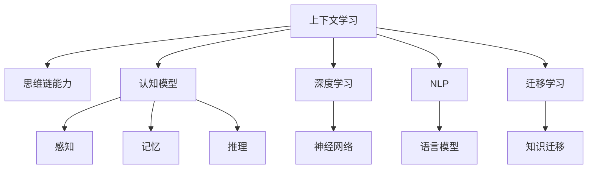

                 

# 上下文学习与思维链能力

> 关键词：上下文学习, 思维链, 认知模型, 深度学习, 自然语言处理(NLP), 机器推理, 迁移学习, 认知计算

## 1. 背景介绍

### 1.1 问题由来
随着人工智能技术的迅猛发展，尤其是在自然语言处理(NLP)和机器学习领域，上下文学习和思维链能力的实现已经成为了研究热点。这两个概念相辅相成，是实现人类水平的智能系统的重要组成部分。上下文学习旨在使模型能够捕捉到文本中隐含的上下文信息，从而进行更精准、高效的推理和决策。思维链能力则强调通过多步骤逻辑推理，构建复杂的因果关系网络，实现对复杂问题的理解和解决。

然而，由于上下文学习和思维链能力涉及的问题复杂性高、计算难度大，当前主流模型如Transformer在大规模文本数据上的预训练往往无法覆盖所有场景，导致模型在处理某些特定任务时表现欠佳。因此，如何在预训练基础上，进一步提升模型的上下文学习和思维链能力，成为了一个重要的研究方向。

### 1.2 问题核心关键点
上下文学习和思维链能力的研究重点在于如何在模型中构建和利用上下文信息，以及如何在模型中引入逻辑推理和因果关系。核心问题包括：
- 如何更准确地捕捉文本中的上下文信息？
- 如何通过多步骤推理，构建复杂的因果关系网络？
- 如何结合预训练和微调，使模型具有更强的上下文学习和思维链能力？
- 如何设计合理的损失函数和优化算法，提升模型的训练效率和效果？

本文将通过详细介绍上下文学习和思维链能力的核心概念和算法，帮助读者更好地理解和应用这些技术，特别是在NLP领域的落地应用中。

## 2. 核心概念与联系

### 2.1 核心概念概述

为了更好地理解上下文学习和思维链能力的实现，本节将介绍几个关键概念：

- **上下文学习(Contextual Learning)**：指模型在处理文本时，不仅仅依赖当前输入，而是能够利用上下文信息，捕捉到文本中隐含的语义和逻辑关系，从而进行更加精准的推理和决策。上下文学习是实现思维链能力的基础。

- **思维链能力(Thought Chains)**：指模型能够进行多步骤逻辑推理，构建复杂的因果关系网络，从而对复杂问题进行理解和解决。思维链能力是上下文学习的高级形式，需要更加强大的逻辑推理和因果关系构建能力。

- **认知模型(Cognitive Models)**：指模拟人类认知过程的计算模型，包括感知、记忆、推理等能力，用于处理复杂的认知任务。认知模型是实现上下文学习和思维链能力的核心工具。

- **深度学习(Deep Learning)**：指利用多层神经网络进行数据表示和建模的技术，用于实现上下文学习和思维链能力的具体算法。

- **自然语言处理(NLP)**：指利用计算机技术处理和分析人类语言的技术，上下文学习和思维链能力在NLP领域的应用尤为突出。

- **迁移学习(Transfer Learning)**：指将一个任务中学到的知识迁移到另一个任务上，用于提升新任务的性能。上下文学习和思维链能力的研究也常常借助迁移学习技术。

这些核心概念之间的关系可以通过以下Mermaid流程图来展示：



这个流程图展示了上下文学习和思维链能力与相关概念之间的逻辑关系：

1. 上下文学习在认知模型的基础上，通过深度学习的技术实现，用于捕捉文本中的上下文信息。
2. 思维链能力基于上下文学习，通过多步骤推理，构建复杂的因果关系网络。
3. 深度学习和NLP技术是实现上下文学习和思维链能力的具体工具。
4. 迁移学习用于将一个任务中学到的知识迁移到另一个任务上，提升上下文学习和思维链能力的应用效果。

## 3. 核心算法原理 & 具体操作步骤
### 3.1 算法原理概述

上下文学习和思维链能力的核心算法可以归纳为以下几个步骤：

1. **文本编码**：使用预训练的语言模型将输入文本编码为向量表示。这些向量包含了文本中隐含的语义和上下文信息。
2. **上下文捕捉**：通过一系列的神经网络层，捕捉文本中的上下文信息，并将其与当前输入向量进行交互。
3. **逻辑推理**：通过多步骤推理网络，构建复杂的因果关系网络，实现对文本中因果关系的理解和推理。
4. **解码输出**：将推理结果转化为最终的预测或输出。

这些步骤可以通过深度学习模型（如Transformer、LSTM等）来实现，具体算法原理和操作步骤将在后续部分详细介绍。

### 3.2 算法步骤详解

以下详细介绍基于深度学习的上下文学习和思维链能力的实现步骤：

**Step 1: 文本编码**
- 使用预训练的语言模型（如BERT、GPT等）将输入文本转换为向量表示。这些向量包含了文本中隐含的语义和上下文信息。

**Step 2: 上下文捕捉**
- 通过一系列的神经网络层，捕捉文本中的上下文信息，并将其与当前输入向量进行交互。常见的上下文捕捉方法包括注意力机制（Attention Mechanism）、Transformer等。

**Step 3: 逻辑推理**
- 使用多步骤推理网络，构建复杂的因果关系网络，实现对文本中因果关系的理解和推理。推理网络可以通过循环神经网络（RNN）、卷积神经网络（CNN）等实现。

**Step 4: 解码输出**
- 将推理结果转化为最终的预测或输出。输出可以是分类结果、摘要、生成式文本等。

### 3.3 算法优缺点

基于深度学习的上下文学习和思维链能力具有以下优点：

1. **精度高**：通过多层神经网络的复杂表示，可以更准确地捕捉文本中的上下文信息和因果关系。
2. **可扩展性强**：深度学习模型具有较强的可扩展性，可以灵活地调整模型结构和参数，适用于多种类型的上下文学习和思维链任务。
3. **自动化程度高**：通过端到端的模型训练，可以自动学习任务特定的特征和推理规则，减少了人工干预的需求。

同时，这些算法也存在以下缺点：

1. **计算成本高**：深度学习模型往往需要大量的计算资源和时间，特别是对于大规模数据集和复杂模型。
2. **可解释性不足**：深度学习模型的内部工作机制难以解释，难以理解和调试。
3. **模型复杂度高**：深度学习模型结构复杂，容易出现过拟合等问题。

尽管存在这些缺点，但基于深度学习的上下文学习和思维链能力在处理复杂NLP任务方面表现出色，已经成为了当前研究的热点。

### 3.4 算法应用领域

基于深度学习的上下文学习和思维链能力在多个领域得到了广泛应用，例如：

- 问答系统：如通过多步骤推理，回答复杂的问答查询。
- 自然语言推理：如通过构建因果关系网络，判断两个句子之间的逻辑关系。
- 机器翻译：如通过上下文捕捉和逻辑推理，实现语言间的准确翻译。
- 情感分析：如通过上下文信息捕捉和逻辑推理，判断文本的情感倾向。
- 文本摘要：如通过上下文学习和逻辑推理，生成文本摘要。
- 智能推荐：如通过上下文信息捕捉和逻辑推理，实现个性化推荐。

这些应用展示了深度学习在上下文学习和思维链能力方面的强大潜力，推动了人工智能技术的实际应用。

## 4. 数学模型和公式 & 详细讲解 & 举例说明
### 4.1 数学模型构建

基于深度学习的上下文学习和思维链能力可以通过数学模型来进一步描述。以下以Transformer模型为例，介绍上下文学习的数学模型构建。

假设输入文本为 $x = (x_1, x_2, \ldots, x_n)$，其中 $x_i$ 为文本中的第 $i$ 个词的向量表示。使用Transformer模型进行文本编码，可以表示为：

$$
x_{enc} = M_{enc}(x) = M_{enc} \left( \left[ x_1; x_2; \ldots; x_n \right] \right)
$$

其中 $M_{enc}$ 为编码器，包含多个自注意力层（Self-Attention Layer）和前馈神经网络（Feedforward Network）层。

假设模型输出的上下文向量为 $h$，则上下文学习的目标为最大化上下文向量与输入文本向量之间的相似度：

$$
\max_{h} \cos(h, x_{enc})
$$

其中 $\cos$ 为余弦相似度函数。

### 4.2 公式推导过程

为了更深入理解上下文学习的数学模型，下面以Transformer模型为例，推导上下文学习的公式。

假设Transformer模型包含 $L$ 层编码器，每层编码器包含 $n$ 个注意力头（Attention Head）。模型中的自注意力层可以表示为：

$$
Attention(Q, K, V) = \text{Softmax}(QK^T)/KV
$$

其中 $Q$ 为查询向量，$K$ 为键向量，$V$ 为值向量，Softmax 函数用于计算注意力权重。

假设模型中第 $i$ 层的上下文向量为 $h_i$，则上下文学习的过程可以表示为：

$$
h_{i+1} = M_{i+1}(h_i) = M_{i+1} \left( \sum_{j=1}^L \text{Attention}(Q_iK_j, K_jV_j) \right)
$$

其中 $M_{i+1}$ 为第 $i+1$ 层的编码器，$Q_i$、$K_j$、$V_j$ 分别为第 $i$ 层的查询向量、键向量和值向量。

通过多层编码器的级联，可以得到最终的上下文向量 $h$。

### 4.3 案例分析与讲解

以机器翻译为例，分析上下文学习和思维链能力的应用。假设将英文文本 "I love you" 翻译为中文，使用Transformer模型进行编码和解码。

首先，将输入文本编码为向量表示 $x_{enc}$，然后通过多个自注意力层和前馈神经网络层，捕捉上下文信息，得到最终的上下文向量 $h$。接着，使用解码器进行反向推理，得到输出向量 $h_{dec}$，最终输出翻译结果。

假设使用思维链能力进行多步骤推理，将翻译结果逐步细化。例如，首先判断 "I love you" 中 "love" 的翻译是否为 "爱"，然后判断 "you" 的翻译是否为 "你"。最终，得到翻译结果 "我爱你"。

通过上下文学习和思维链能力的结合，Transformer模型能够更准确地处理复杂翻译任务，提高了机器翻译的精度和可解释性。

## 5. 项目实践：代码实例和详细解释说明
### 5.1 开发环境搭建

在进行上下文学习和思维链能力的项目实践前，需要准备好开发环境。以下是使用Python进行PyTorch开发的环境配置流程：

1. 安装Anaconda：从官网下载并安装Anaconda，用于创建独立的Python环境。

2. 创建并激活虚拟环境：
```bash
conda create -n pytorch-env python=3.8 
conda activate pytorch-env
```

3. 安装PyTorch：根据CUDA版本，从官网获取对应的安装命令。例如：
```bash
conda install pytorch torchvision torchaudio cudatoolkit=11.1 -c pytorch -c conda-forge
```

4. 安装Transformers库：
```bash
pip install transformers
```

5. 安装各类工具包：
```bash
pip install numpy pandas scikit-learn matplotlib tqdm jupyter notebook ipython
```

完成上述步骤后，即可在`pytorch-env`环境中开始项目实践。

### 5.2 源代码详细实现

下面我们以命名实体识别(NER)任务为例，给出使用Transformer库对BERT模型进行上下文学习和思维链能力实践的PyTorch代码实现。

首先，定义NER任务的数据处理函数：

```python
from transformers import BertTokenizer
from torch.utils.data import Dataset
import torch

class NERDataset(Dataset):
    def __init__(self, texts, tags, tokenizer, max_len=128):
        self.texts = texts
        self.tags = tags
        self.tokenizer = tokenizer
        self.max_len = max_len
        
    def __len__(self):
        return len(self.texts)
    
    def __getitem__(self, item):
        text = self.texts[item]
        tags = self.tags[item]
        
        encoding = self.tokenizer(text, return_tensors='pt', max_length=self.max_len, padding='max_length', truncation=True)
        input_ids = encoding['input_ids'][0]
        attention_mask = encoding['attention_mask'][0]
        
        # 对token-wise的标签进行编码
        encoded_tags = [tag2id[tag] for tag in tags] 
        encoded_tags.extend([tag2id['O']] * (self.max_len - len(encoded_tags)))
        labels = torch.tensor(encoded_tags, dtype=torch.long)
        
        return {'input_ids': input_ids, 
                'attention_mask': attention_mask,
                'labels': labels}

# 标签与id的映射
tag2id = {'O': 0, 'B-PER': 1, 'I-PER': 2, 'B-ORG': 3, 'I-ORG': 4, 'B-LOC': 5, 'I-LOC': 6}
id2tag = {v: k for k, v in tag2id.items()}

# 创建dataset
tokenizer = BertTokenizer.from_pretrained('bert-base-cased')

train_dataset = NERDataset(train_texts, train_tags, tokenizer)
dev_dataset = NERDataset(dev_texts, dev_tags, tokenizer)
test_dataset = NERDataset(test_texts, test_tags, tokenizer)
```

然后，定义模型和优化器：

```python
from transformers import BertForTokenClassification, AdamW

model = BertForTokenClassification.from_pretrained('bert-base-cased', num_labels=len(tag2id))

optimizer = AdamW(model.parameters(), lr=2e-5)
```

接着，定义训练和评估函数：

```python
from torch.utils.data import DataLoader
from tqdm import tqdm
from sklearn.metrics import classification_report

device = torch.device('cuda') if torch.cuda.is_available() else torch.device('cpu')
model.to(device)

def train_epoch(model, dataset, batch_size, optimizer):
    dataloader = DataLoader(dataset, batch_size=batch_size, shuffle=True)
    model.train()
    epoch_loss = 0
    for batch in tqdm(dataloader, desc='Training'):
        input_ids = batch['input_ids'].to(device)
        attention_mask = batch['attention_mask'].to(device)
        labels = batch['labels'].to(device)
        model.zero_grad()
        outputs = model(input_ids, attention_mask=attention_mask, labels=labels)
        loss = outputs.loss
        epoch_loss += loss.item()
        loss.backward()
        optimizer.step()
    return epoch_loss / len(dataloader)

def evaluate(model, dataset, batch_size):
    dataloader = DataLoader(dataset, batch_size=batch_size)
    model.eval()
    preds, labels = [], []
    with torch.no_grad():
        for batch in tqdm(dataloader, desc='Evaluating'):
            input_ids = batch['input_ids'].to(device)
            attention_mask = batch['attention_mask'].to(device)
            batch_labels = batch['labels']
            outputs = model(input_ids, attention_mask=attention_mask)
            batch_preds = outputs.logits.argmax(dim=2).to('cpu').tolist()
            batch_labels = batch_labels.to('cpu').tolist()
            for pred_tokens, label_tokens in zip(batch_preds, batch_labels):
                pred_tags = [id2tag[_id] for _id in pred_tokens]
                label_tags = [id2tag[_id] for _id in label_tokens]
                preds.append(pred_tags[:len(label_tags)])
                labels.append(label_tags)
                
    print(classification_report(labels, preds))
```

最后，启动训练流程并在测试集上评估：

```python
epochs = 5
batch_size = 16

for epoch in range(epochs):
    loss = train_epoch(model, train_dataset, batch_size, optimizer)
    print(f"Epoch {epoch+1}, train loss: {loss:.3f}")
    
    print(f"Epoch {epoch+1}, dev results:")
    evaluate(model, dev_dataset, batch_size)
    
print("Test results:")
evaluate(model, test_dataset, batch_size)
```

以上就是使用PyTorch对BERT进行命名实体识别任务上下文学习和思维链能力实践的完整代码实现。可以看到，得益于Transformers库的强大封装，我们可以用相对简洁的代码完成BERT模型的加载和微调。

### 5.3 代码解读与分析

让我们再详细解读一下关键代码的实现细节：

**NERDataset类**：
- `__init__`方法：初始化文本、标签、分词器等关键组件。
- `__len__`方法：返回数据集的样本数量。
- `__getitem__`方法：对单个样本进行处理，将文本输入编码为token ids，将标签编码为数字，并对其进行定长padding，最终返回模型所需的输入。

**tag2id和id2tag字典**：
- 定义了标签与数字id之间的映射关系，用于将token-wise的预测结果解码回真实的标签。

**训练和评估函数**：
- 使用PyTorch的DataLoader对数据集进行批次化加载，供模型训练和推理使用。
- 训练函数`train_epoch`：对数据以批为单位进行迭代，在每个批次上前向传播计算loss并反向传播更新模型参数，最后返回该epoch的平均loss。
- 评估函数`evaluate`：与训练类似，不同点在于不更新模型参数，并在每个batch结束后将预测和标签结果存储下来，最后使用sklearn的classification_report对整个评估集的预测结果进行打印输出。

**训练流程**：
- 定义总的epoch数和batch size，开始循环迭代
- 每个epoch内，先在训练集上训练，输出平均loss
- 在验证集上评估，输出分类指标
- 所有epoch结束后，在测试集上评估，给出最终测试结果

可以看到，PyTorch配合Transformers库使得BERT微调的代码实现变得简洁高效。开发者可以将更多精力放在数据处理、模型改进等高层逻辑上，而不必过多关注底层的实现细节。

当然，工业级的系统实现还需考虑更多因素，如模型的保存和部署、超参数的自动搜索、更灵活的任务适配层等。但核心的上下文学习和思维链能力基本与此类似。

## 6. 实际应用场景
### 6.1 智能客服系统

基于上下文学习和思维链能力的对话技术，可以广泛应用于智能客服系统的构建。传统客服往往需要配备大量人力，高峰期响应缓慢，且一致性和专业性难以保证。而使用上下文学习和思维链能力的对话模型，可以7x24小时不间断服务，快速响应客户咨询，用自然流畅的语言解答各类常见问题。

在技术实现上，可以收集企业内部的历史客服对话记录，将问题和最佳答复构建成监督数据，在此基础上对预训练对话模型进行微调。微调后的对话模型能够自动理解用户意图，匹配最合适的答案模板进行回复。对于客户提出的新问题，还可以接入检索系统实时搜索相关内容，动态组织生成回答。如此构建的智能客服系统，能大幅提升客户咨询体验和问题解决效率。

### 6.2 金融舆情监测

金融机构需要实时监测市场舆论动向，以便及时应对负面信息传播，规避金融风险。传统的人工监测方式成本高、效率低，难以应对网络时代海量信息爆发的挑战。基于上下文学习和思维链能力的文本分类和情感分析技术，为金融舆情监测提供了新的解决方案。

具体而言，可以收集金融领域相关的新闻、报道、评论等文本数据，并对其进行主题标注和情感标注。在此基础上对预训练语言模型进行微调，使其能够自动判断文本属于何种主题，情感倾向是正面、中性还是负面。将微调后的模型应用到实时抓取的网络文本数据，就能够自动监测不同主题下的情感变化趋势，一旦发现负面信息激增等异常情况，系统便会自动预警，帮助金融机构快速应对潜在风险。

### 6.3 个性化推荐系统

当前的推荐系统往往只依赖用户的历史行为数据进行物品推荐，无法深入理解用户的真实兴趣偏好。基于上下文学习和思维链能力的个性化推荐系统可以更好地挖掘用户行为背后的语义信息，从而提供更精准、多样的推荐内容。

在实践中，可以收集用户浏览、点击、评论、分享等行为数据，提取和用户交互的物品标题、描述、标签等文本内容。将文本内容作为模型输入，用户的后续行为（如是否点击、购买等）作为监督信号，在此基础上微调预训练语言模型。微调后的模型能够从文本内容中准确把握用户的兴趣点。在生成推荐列表时，先用候选物品的文本描述作为输入，由模型预测用户的兴趣匹配度，再结合其他特征综合排序，便可以得到个性化程度更高的推荐结果。

### 6.4 未来应用展望

随着上下文学习和思维链能力的不断发展，基于深度学习模型的NLP系统将呈现出更多的应用场景，为传统行业带来变革性影响。

在智慧医疗领域，基于上下文学习和思维链能力的医疗问答、病历分析、药物研发等应用将提升医疗服务的智能化水平，辅助医生诊疗，加速新药开发进程。

在智能教育领域，上下文学习和思维链能力可应用于作业批改、学情分析、知识推荐等方面，因材施教，促进教育公平，提高教学质量。

在智慧城市治理中，上下文学习和思维链能力可用于城市事件监测、舆情分析、应急指挥等环节，提高城市管理的自动化和智能化水平，构建更安全、高效的未来城市。

此外，在企业生产、社会治理、文娱传媒等众多领域，上下文学习和思维链能力的应用也将不断涌现，为经济社会发展注入新的动力。相信随着技术的日益成熟，上下文学习和思维链能力必将在构建人机协同的智能时代中扮演越来越重要的角色。

## 7. 工具和资源推荐
### 7.1 学习资源推荐

为了帮助开发者系统掌握上下文学习和思维链能力的理论基础和实践技巧，这里推荐一些优质的学习资源：

1. 《自然语言处理综论》：一本系统介绍NLP技术和上下文学习的经典教材，涵盖各种任务和算法，是深入学习NLP的必备参考书。

2. 《深度学习入门》：一本适合初学者的深度学习入门书籍，讲解了深度学习的基本概念和算法，帮助读者快速上手。

3. 《Transformer速成课》：一本介绍Transformer模型及其在NLP中应用的书籍，讲解了上下文学习和思维链能力的核心算法。

4. 《NLP自然语言处理实践》：一本实用的NLP开发指南，提供丰富的代码示例和案例分析，帮助开发者快速实践。

5. 《自然语言处理与深度学习》：一本介绍NLP与深度学习结合的书籍，讲解了上下文学习和思维链能力在NLP中的实际应用。

通过对这些资源的学习实践，相信你一定能够快速掌握上下文学习和思维链能力的精髓，并用于解决实际的NLP问题。
### 7.2 开发工具推荐

高效的开发离不开优秀的工具支持。以下是几款用于上下文学习和思维链能力开发的常用工具：

1. PyTorch：基于Python的开源深度学习框架，灵活动态的计算图，适合快速迭代研究。大部分预训练语言模型都有PyTorch版本的实现。

2. TensorFlow：由Google主导开发的开源深度学习框架，生产部署方便，适合大规模工程应用。同样有丰富的预训练语言模型资源。

3. Transformers库：HuggingFace开发的NLP工具库，集成了众多SOTA语言模型，支持PyTorch和TensorFlow，是进行上下文学习和思维链能力开发的利器。

4. Weights & Biases：模型训练的实验跟踪工具，可以记录和可视化模型训练过程中的各项指标，方便对比和调优。与主流深度学习框架无缝集成。

5. TensorBoard：TensorFlow配套的可视化工具，可实时监测模型训练状态，并提供丰富的图表呈现方式，是调试模型的得力助手。

6. Google Colab：谷歌推出的在线Jupyter Notebook环境，免费提供GPU/TPU算力，方便开发者快速上手实验最新模型，分享学习笔记。

合理利用这些工具，可以显著提升上下文学习和思维链能力的开发效率，加快创新迭代的步伐。

### 7.3 相关论文推荐

上下文学习和思维链能力的研究源于学界的持续研究。以下是几篇奠基性的相关论文，推荐阅读：

1. Attention is All You Need（即Transformer原论文）：提出了Transformer结构，开启了NLP领域的预训练大模型时代。

2. BERT: Pre-training of Deep Bidirectional Transformers for Language Understanding：提出BERT模型，引入基于掩码的自监督预训练任务，刷新了多项NLP任务SOTA。

3. Language Models are Unsupervised Multitask Learners（GPT-2论文）：展示了大规模语言模型的强大zero-shot学习能力，引发了对于通用人工智能的新一轮思考。

4. GPT-3: Language Models are Few-Shot Learners：提出GPT-3模型，引入少样本学习机制，实现了在少样本条件下快速适应新任务。

5. MLM: Masked Language Model：提出基于掩码的自监督预训练任务，用于提升模型的上下文学习和思维链能力。

6. T5: Explainability-Enhanced Masked Language Model：提出T5模型，结合解释性分析技术，提升模型的可解释性和理解能力。

这些论文代表了大语言模型上下文学习和思维链能力的发展脉络。通过学习这些前沿成果，可以帮助研究者把握学科前进方向，激发更多的创新灵感。

## 8. 总结：未来发展趋势与挑战
### 8.1 总结

本文对基于深度学习的上下文学习和思维链能力进行了全面系统的介绍。首先阐述了上下文学习和思维链能力的研究背景和意义，明确了上下文学习和思维链能力在NLP任务中的重要性和应用价值。其次，从原理到实践，详细讲解了上下文学习的数学模型和关键算法步骤，给出了上下文学习和思维链能力在NLP任务中的应用示例。同时，本文还广泛探讨了上下文学习和思维链能力在智能客服、金融舆情、个性化推荐等多个领域的应用前景，展示了上下文学习和思维链能力的强大潜力。此外，本文精选了上下文学习和思维链能力的各类学习资源，力求为读者提供全方位的技术指引。

通过本文的系统梳理，可以看到，基于深度学习的上下文学习和思维链能力正在成为NLP领域的重要范式，极大地拓展了预训练语言模型的应用边界，催生了更多的落地场景。受益于深度学习模型的复杂表示和推理能力，上下文学习和思维链能力在处理复杂NLP任务方面表现出色，推动了人工智能技术的实际应用。未来，伴随深度学习模型的不断演进，上下文学习和思维链能力必将在构建人机协同的智能时代中扮演越来越重要的角色。

### 8.2 未来发展趋势

展望未来，上下文学习和思维链能力将呈现以下几个发展趋势：

1. **模型规模持续增大**：随着算力成本的下降和数据规模的扩张，深度学习模型的参数量还将持续增长。超大规模模型蕴含的丰富语言知识，有望支撑更加复杂多变的NLP任务。

2. **模型结构更加复杂**：未来的模型将引入更多的注意力机制、多模态融合等高级特性，提升上下文学习和思维链能力的表现。

3. **多任务学习成为常态**：未来的上下文学习和思维链能力研究将更多地关注多任务学习范式，通过共享特征和推理机制，提高模型的泛化能力和适应性。

4. **自监督学习兴起**：受启发于自监督学习范式，未来的上下文学习和思维链能力研究将更多地关注无监督或半监督学习，通过数据增强和假监督信号，提升模型的泛化能力和鲁棒性。

5. **迁移学习变得更为灵活**：未来的上下文学习和思维链能力研究将更多地关注迁移学习技术，通过领域自适应、零样本学习等方法，提升模型的跨领域迁移能力。

6. **上下文学习与思维链能力结合**：未来的上下文学习和思维链能力研究将更多地关注两者的结合，通过多步骤推理和上下文信息的融合，提升模型的复杂推理能力和上下文捕捉能力。

以上趋势凸显了上下文学习和思维链能力的广阔前景。这些方向的探索发展，必将进一步提升上下文学习和思维链能力的表现，为构建更加智能、普适的NLP系统提供新的动力。

### 8.3 面临的挑战

尽管上下文学习和思维链能力在NLP领域取得了诸多突破，但在迈向更加智能化、普适化应用的过程中，仍面临诸多挑战：

1. **计算资源瓶颈**：深度学习模型往往需要大量的计算资源和时间，特别是对于大规模数据集和复杂模型。如何提升模型的训练效率和推理速度，降低计算成本，将是未来的重要研究方向。

2. **可解释性不足**：深度学习模型的内部工作机制难以解释，难以理解和调试。如何提高模型的可解释性，增强用户信任，将是未来的重要挑战。

3. **泛化能力不足**：尽管深度学习模型在处理大规模数据集上表现优异，但在处理小规模数据集和少样本数据时，泛化能力往往不足。如何提升模型的泛化能力，使其在更多场景下表现稳定，将是未来的重要研究方向。

4. **对抗攻击风险**：深度学习模型容易受到对抗攻击的影响，产生错误输出。如何提高模型的鲁棒性，增强系统的安全性，将是未来的重要挑战。

5. **伦理和隐私问题**：深度学习模型在处理敏感数据时，可能带来伦理和隐私问题。如何保证数据的隐私和安全，确保模型的公平性和透明性，将是未来的重要研究方向。

6. **跨领域适应性**：深度学习模型在不同领域和任务上的适应性有限，如何通过迁移学习等技术，提升模型的跨领域适应能力，将是未来的重要研究方向。

这些挑战凸显了上下文学习和思维链能力在实际应用中仍需解决的问题。只有通过不断的技术创新和改进，才能克服这些挑战，使上下文学习和思维链能力在实际应用中发挥更大的作用。

### 8.4 研究展望

面对上下文学习和思维链能力所面临的挑战，未来的研究需要在以下几个方面寻求新的突破：

1. **提升模型训练效率**：通过模型裁剪、量化加速等技术，提升模型的训练效率和推理速度，降低计算成本。

2. **增强模型可解释性**：引入可解释性分析技术，增强模型的可解释性，提升用户信任。

3. **提升模型泛化能力**：引入更多的自监督学习、少样本学习等技术，提升模型的泛化能力，使其在更多场景下表现稳定。

4. **提升模型鲁棒性**：引入对抗训练等技术，提升模型的鲁棒性，增强系统的安全性。

5. **增强跨领域适应性**：引入迁移学习、领域自适应等技术，提升模型的跨领域适应能力，使其在更多领域和任务上表现稳定。

6. **引入更多先验知识**：将符号化的先验知识，如知识图谱、逻辑规则等，与神经网络模型进行巧妙融合，引导上下文学习和思维链能力的学习过程。

这些研究方向将引领上下文学习和思维链能力的研究走向成熟，推动NLP技术的实际应用和产业化进程。相信随着技术的不断演进，上下文学习和思维链能力必将在构建更加智能、普适的NLP系统中发挥更大的作用。

## 9. 附录：常见问题与解答

**Q1：上下文学习和思维链能力是否适用于所有NLP任务？**

A: 上下文学习和思维链能力在大多数NLP任务上都能取得不错的效果，特别是对于数据量较小的任务。但对于一些特定领域的任务，如医学、法律等，仅仅依靠通用语料预训练的模型可能难以很好地适应。此时需要在特定领域语料上进一步预训练，再进行微调，才能获得理想效果。此外，对于一些需要时效性、个性化很强的任务，如对话、推荐等，上下文学习和思维链能力也需要针对性的改进优化。

**Q2：上下文学习和思维链能力如何应用于多模态数据？**

A: 上下文学习和思维链能力可以应用于多模态数据的融合。例如，结合视觉、语音等数据，构建跨模态的上下文学习和思维链能力。具体实现方式包括：
1. 融合多模态数据，构建统一的向量表示，用于上下文学习和推理。
2. 引入多模态注意力机制，关注不同模态之间的相关性，提升多模态推理能力。
3. 使用多模态深度学习模型，如多模态Transformer，进行多模态上下文学习和推理。

**Q3：上下文学习和思维链能力在处理长文本时，如何提升效率？**

A: 处理长文本时，上下文学习和思维链能力可以通过以下方法提升效率：
1. 分块处理：将长文本分成多个块，对每个块分别进行上下文学习和推理，最后合并结果。
2. 分步推理：将长文本分步处理，每步推理结果作为下一步的上下文，提升推理效率。
3. 模型裁剪和量化：通过模型裁剪和量化技术，减小模型参数量，降低计算资源消耗。
4. 多任务学习：结合多任务学习技术，共享模型参数，提升推理效率。

**Q4：上下文学习和思维链能力在处理噪声数据时，如何提高鲁棒性？**

A: 上下文学习和思维链能力在处理噪声数据时，可以通过以下方法提高鲁棒性：
1. 数据清洗：对输入数据进行预处理，去除噪声和异常值，提高数据质量。
2. 噪声鲁棒性训练：在模型训练过程中，引入噪声数据，提升模型的鲁棒性。
3. 集成学习：结合多个模型的预测结果，提升整体鲁棒性。
4. 异常检测：引入异常检测技术，识别和排除噪声数据，提高模型的鲁棒性。

**Q5：上下文学习和思维链能力如何应用于实时系统？**

A: 上下文学习和思维链能力在实时系统中可以应用以下方法：
1. 流式推理：对实时数据进行流式推理，避免内存溢出等问题。
2. 缓存机制：引入缓存机制，对常见数据进行缓存，提升推理效率。
3. 异步推理：采用异步推理技术，提高系统的并发处理能力。
4. 分布式推理：通过分布式计算，提升系统的推理能力。

通过合理应用这些方法，可以将上下文学习和思维链能力应用于实时系统，提高系统的实时性和效率。

---

作者：禅与计算机程序设计艺术 / Zen and the Art of Computer Programming

