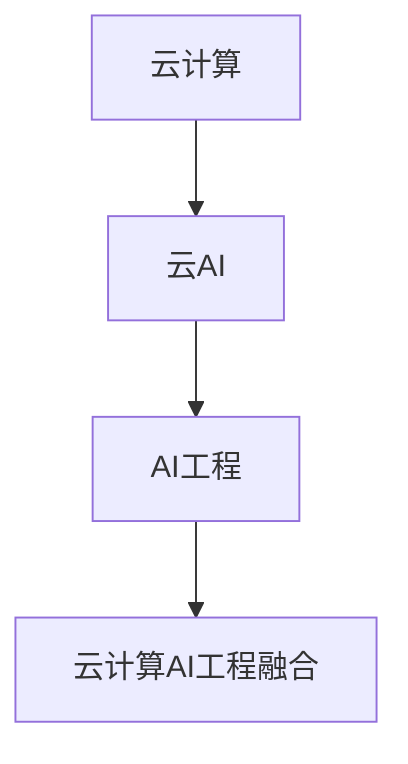

                 

# 云AI协同效应：贾扬清观察，云计算AI工程融合

## 1. 背景介绍

### 1.1 问题由来
随着人工智能（AI）技术的不断发展和落地应用，云计算（Cloud Computing）与AI技术的融合成为了当下最热门的话题之一。云计算提供了强大的计算资源和灵活的按需扩展能力，为AI模型训练和推理提供了良好的环境。而AI则大幅提升了云计算的能力，通过智能算法和模型预测优化，实现了从简单的资源调度到复杂的业务决策。这种深度协同效应推动了人工智能与云计算的共同演进，为各行业带来了全新的创新机遇。

### 1.2 问题核心关键点
云计算与AI的协同效应，核心在于如何高效地将AI模型部署在云平台，并在此基础上实现业务自动化与智能化。具体而言，包括：
1. **模型部署与优化**：将训练好的AI模型快速、高效地部署到云平台，并根据云资源特性进行优化，提升模型性能和资源利用效率。
2. **业务自动化**：利用AI模型进行自动化的业务流程优化，实现智能决策和预测，提升业务效率和竞争力。
3. **数据处理与分析**：云平台能够提供强大的数据存储、处理和分析能力，为AI模型提供数据支持。
4. **协同训练与推理**：利用云计算资源进行模型的分布式训练，提升模型精度和训练速度，同时支持模型的快速推理和实时响应。
5. **弹性扩展与成本控制**：根据业务需求动态调整资源配置，平衡资源利用率与成本。

本文将围绕这些关键点，深入探讨云计算与AI的协同效应，从理论到实践，全面展示其未来发展趋势与挑战。

## 2. 核心概念与联系

### 2.1 核心概念概述

为更好地理解云计算与AI的协同效应，本节将介绍几个密切相关的核心概念：

- **云计算（Cloud Computing）**：基于互联网的计算模式，提供按需、弹性、可扩展的计算资源，如计算实例、存储、网络、数据库等。
- **人工智能（Artificial Intelligence）**：通过机器学习、深度学习等技术，使计算机能够模拟人类智能行为，如感知、决策、学习等。
- **云AI（Cloud AI）**：将AI技术部署在云平台，利用云资源进行模型训练、推理和优化，实现智能决策和预测。
- **AI工程（AI Engineering）**：将AI技术转化为实际应用的过程，包括数据管理、模型训练、模型优化、模型部署、模型监控等环节。
- **云计算AI工程融合（Cloud AI Engineering）**：将云计算与AI工程深度融合，构建端到端AI应用解决方案，提升业务智能化水平。

这些核心概念之间的逻辑关系可以通过以下Mermaid流程图来展示：



这个流程图展示了几者之间的基本联系：

1. **云计算**提供计算资源和存储服务，是云AI的基础。
2. **云AI**将AI模型部署在云上，利用云资源进行训练和推理，实现业务智能化。
3. **AI工程**涉及数据管理、模型训练、部署等环节，是构建云AI系统的关键。
4. **云计算AI工程融合**是将云计算与AI工程深度结合，构建高效、智能的云AI系统。

## 3. 核心算法原理 & 具体操作步骤

### 3.1 算法原理概述

云计算与AI的协同效应，主要基于云计算的弹性计算资源和AI的智能算法，通过协同计算和智能决策，实现业务智能化。核心原理如下：

- **弹性计算资源**：云计算提供按需扩展的计算资源，如CPU、GPU、内存等，支持大规模模型的分布式训练和推理。
- **分布式计算与模型优化**：通过分布式计算框架（如TensorFlow、PyTorch等）进行模型训练，利用云计算资源进行模型优化，提升模型精度和训练速度。
- **智能决策与预测**：利用AI模型进行智能决策和预测，实现业务自动化与智能化。
- **数据处理与分析**：利用云计算的大数据处理和分析能力，为AI模型提供数据支持。

### 3.2 算法步骤详解

云计算与AI的协同效应涉及多个步骤，具体包括：

**Step 1: 模型部署与优化**
- 选择合适的云服务提供商，如AWS、Azure、Google Cloud等，并创建计算实例。
- 将训练好的AI模型部署到云平台，并进行必要的优化。
- 根据云资源特性调整模型架构和超参数，提升模型性能和资源利用效率。

**Step 2: 数据处理与存储**
- 收集、清洗和标注数据，准备模型训练。
- 利用云计算的存储服务（如S3、OSS等）进行数据管理和存储，确保数据安全性和可访问性。
- 利用云计算的数据处理和分析能力，进行大规模数据预处理和特征工程。

**Step 3: 模型训练与优化**
- 利用云计算的分布式计算框架进行模型训练，提升训练速度和模型精度。
- 在训练过程中进行模型优化，如使用梯度累积、混合精度训练等技术，优化计算资源利用效率。
- 利用云计算的数据分析能力进行模型评估和调优。

**Step 4: 模型推理与部署**
- 将优化后的AI模型部署到云平台，进行推理和实时响应。
- 利用云计算的弹性计算资源，实现模型的分布式推理，提升响应速度和系统稳定性。
- 利用云计算的服务化封装，提供标准化的API接口，便于集成和调用。

**Step 5: 模型监控与维护**
- 利用云计算的监控服务进行模型性能监控和告警。
- 根据监控结果进行模型维护和优化，提升系统稳定性和用户体验。
- 定期更新和优化模型，保持系统长期运行和优化。

### 3.3 算法优缺点

云计算与AI的协同效应具有以下优点：
1. **弹性计算资源**：按需扩展的计算资源，支持大规模模型训练和推理。
2. **分布式计算与优化**：利用分布式计算框架进行模型训练和优化，提升模型性能。
3. **智能决策与预测**：实现业务自动化与智能化，提升业务效率和竞争力。
4. **数据处理与分析**：利用云计算的大数据处理和分析能力，提升数据利用效率。

同时，这种协同效应也存在一些缺点：
1. **成本高**：大规模模型训练和推理需要大量的计算资源和存储资源，成本较高。
2. **数据隐私与安全**：大规模数据存储和处理可能涉及数据隐私和安全问题，需要严格的管控和保护。
3. **模型部署复杂**：模型的部署和优化需要复杂的工程实践，需要专业的技术支持。
4. **实时响应要求高**：模型推理和实时响应需要高效的计算和存储资源，对系统性能要求较高。

### 3.4 算法应用领域

云计算与AI的协同效应已经在多个领域得到了广泛应用，例如：

- **智能客服**：利用AI模型进行智能客服，实现自动回复和问题解答，提升客户体验。
- **金融风控**：利用AI模型进行风险预测和客户信用评估，提升金融服务质量。
- **医疗诊断**：利用AI模型进行疾病诊断和预测，提升医疗服务效率。
- **智能制造**：利用AI模型进行设备预测维护和生产优化，提升生产效率和质量。
- **智慧城市**：利用AI模型进行城市管理与决策，提升城市运行效率和智能化水平。

## 4. 数学模型和公式 & 详细讲解 & 举例说明

### 4.1 数学模型构建

本节将使用数学语言对云计算与AI的协同效应进行更加严格的刻画。

记云计算平台提供的计算资源为 $R$，AI模型的计算量为 $C$，模型优化策略为 $\sigma$。云计算平台提供的弹性资源为 $E(R)$，AI模型训练和推理的计算量为 $C(R,\sigma)$。

定义云计算平台与AI模型的协同效用函数为 $U(R,C,\sigma)$，其目标是在有限的计算资源 $R$ 下，最大化AI模型的计算量 $C(R,\sigma)$。

优化目标为：

$$
\max_{R,\sigma} U(R,C(R,\sigma))
$$

### 4.2 公式推导过程

以下我们以智能制造为例，推导云计算与AI协同效应的计算模型。

假设制造工厂有 $N$ 个生产线和 $M$ 台设备，每台设备需要进行预测维护和生产优化。利用AI模型进行预测和优化，提升生产效率和设备维护效果。

定义AI模型的推理速度为 $v$，每台设备的推理次数为 $k$。云计算平台提供的计算资源为 $R$，每台设备占用的计算量为 $r$。

模型的计算量为 $C(R,\sigma)=v \times k \times M$。

云计算平台提供的弹性资源为 $E(R)=\min(R, N \times M \times r)$。

协同效用函数为：

$$
U(R,C(R,\sigma)) = \frac{C(R,\sigma)}{E(R)}
$$

在实际应用中，通过调整模型的推理速度 $v$ 和计算量 $C(R,\sigma)$，可以在有限的计算资源 $R$ 下，最大化协同效用 $U(R,C(R,\sigma))$，实现最优的生产和维护效果。

### 4.3 案例分析与讲解

以智能客服系统为例，展示云计算与AI协同效应的实际应用。

智能客服系统利用AI模型进行智能问答和问题解答，提升客户体验和满意度。云平台提供的计算资源用于模型的推理和实时响应。

假设每个客户平均需要 $t$ 秒的响应时间，每分钟处理 $p$ 个客户请求。利用云计算的弹性计算资源进行模型的推理和响应，优化客户请求的响应时间。

模型的推理时间为 $T=v \times C(R,\sigma) \times t$，其中 $v$ 为推理速度，$C(R,\sigma)$ 为计算量。

云平台提供的弹性资源为 $E(R)=R \times t$。

协同效用函数为：

$$
U(R,C(R,\sigma)) = \frac{p}{T}
$$

通过调整推理速度 $v$ 和计算量 $C(R,\sigma)$，可以在有限的计算资源 $R$ 下，最大化协同效用 $U(R,C(R,\sigma))$，实现最优的客户响应时间和满意度。

## 5. 项目实践：代码实例和详细解释说明

### 5.1 开发环境搭建

在进行云计算与AI协同效应的实践前，我们需要准备好开发环境。以下是使用Python进行TensorFlow开发的环境配置流程：

1. 安装Anaconda：从官网下载并安装Anaconda，用于创建独立的Python环境。

2. 创建并激活虚拟环境：
```bash
conda create -n cloud-ai-env python=3.8 
conda activate cloud-ai-env
```

3. 安装TensorFlow：根据CUDA版本，从官网获取对应的安装命令。例如：
```bash
conda install tensorflow -c conda-forge -c pytorch
```

4. 安装相关库：
```bash
pip install tensorflow-model-optimization-toolkit
pip install tensorflow-addons
pip install cloudpickle
```

5. 安装各类工具包：
```bash
pip install numpy pandas scikit-learn matplotlib tqdm jupyter notebook ipython
```

完成上述步骤后，即可在`cloud-ai-env`环境中开始实践。

### 5.2 源代码详细实现

这里我们以智能客服系统为例，展示利用TensorFlow进行AI模型部署和优化的代码实现。

首先，定义智能客服系统的数据处理函数：

```python
from tensorflow import keras
import tensorflow_model_optimization as tfmot

class CustomerService(keras.Model):
    def __init__(self):
        super(CustomerService, self).__init__()
        self.embedding = keras.layers.Embedding(input_dim=10000, output_dim=128)
        self.lstm = keras.layers.LSTM(units=64)
        self.dense = keras.layers.Dense(units=10, activation='softmax')

    def call(self, inputs):
        x = self.embedding(inputs)
        x = self.lstm(x)
        return self.dense(x)
```

然后，定义模型优化策略：

```python
# 定义优化器
optimizer = tfmot.compiler.learning率高动量优化器(learning_rate=0.001, momentum=0.9)

# 定义剪枝器
pruning_callback = tfmot.sparsity.keras.PruningOptions(
    pruning_schedule=tfmot.sparsity.keras.PolynomialDecay(20, 0.1, 0.5), 
    pruning_method=tfmot.sparsity.keras.MininalPruning())

# 定义混合精度策略
mixed_precision = tfmot.compiler.keras.mixed_precision.LossScaleOptimizer
```

接着，定义训练和评估函数：

```python
from tensorflow.keras.callbacks import EarlyStopping
from tensorflow.keras.metrics import Accuracy

def train_model(model, train_dataset, validation_dataset, epochs=10, batch_size=32):
    callbacks = [EarlyStopping(patience=5)]
    model.compile(
        optimizer=optimizer, loss='categorical_crossentropy', metrics=[Accuracy()],
    )
    model.fit(
        train_dataset, 
        validation_data=validation_dataset, 
        epochs=epochs, 
        batch_size=batch_size, 
        callbacks=callbacks
    )

def evaluate_model(model, test_dataset, batch_size=32):
    model.evaluate(test_dataset, batch_size=batch_size)
```

最后，启动训练流程并在测试集上评估：

```python
from tensorflow.keras.datasets import imdb
from tensorflow.keras.preprocessing import sequence
from tensorflow.keras.utils import to_categorical

# 加载IMDB评论数据集
(x_train, y_train), (x_test, y_test) = imdb.load_data(num_words=10000)

# 对数据进行填充和标准化
x_train = sequence.pad_sequences(x_train, maxlen=128)
x_test = sequence.pad_sequences(x_test, maxlen=128)

# 定义模型
model = CustomerService()

# 训练模型
train_model(model, x_train, x_test, validation_data=(x_train, y_train))

# 评估模型
evaluate_model(model, x_test)
```

以上就是利用TensorFlow进行AI模型部署和优化的完整代码实现。可以看到，通过TensorFlow的高级API和优化工具，我们可以非常方便地构建和优化AI模型，并部署到云平台上进行推理。

### 5.3 代码解读与分析

让我们再详细解读一下关键代码的实现细节：

**CustomerService类**：
- `__init__`方法：定义模型结构，包括嵌入层、LSTM层和全连接层。
- `call`方法：定义模型的前向传播过程。

**模型优化策略**：
- 使用`tfmot.compiler.learning率高动量优化器`进行模型优化，调整学习率和动量。
- 使用`tfmot.sparsity.keras.PruningOptions`进行剪枝，减少模型参数，提高计算效率。
- 使用`tfmot.compiler.keras.mixed_precision.LossScaleOptimizer`进行混合精度训练，提升训练速度和模型精度。

**训练和评估函数**：
- `train_model`函数：使用`EarlyStopping`回调机制进行早期停止，防止过拟合。
- `evaluate_model`函数：使用`Accuracy`指标评估模型性能。

**训练流程**：
- 加载IMDB评论数据集，并进行填充和标准化。
- 定义模型，并调用`train_model`函数进行训练。
- 调用`evaluate_model`函数评估模型性能。

通过TensorFlow的高级API和优化工具，我们可以快速实现AI模型的构建和优化，并部署到云平台上进行推理。这展示了云计算与AI协同效应的实际应用，极大地提升了模型训练和推理的效率。

## 6. 实际应用场景

### 6.1 智能客服系统

智能客服系统利用AI模型进行智能问答和问题解答，提升客户体验和满意度。云平台提供的计算资源用于模型的推理和实时响应。

在实际应用中，可以收集企业内部的历史客服对话记录，将问题和最佳答复构建成监督数据，在此基础上对预训练模型进行微调。微调后的模型能够自动理解用户意图，匹配最合适的答案模板进行回复。对于客户提出的新问题，还可以接入检索系统实时搜索相关内容，动态组织生成回答。如此构建的智能客服系统，能大幅提升客户咨询体验和问题解决效率。

### 6.2 金融风控

金融机构需要实时监测市场舆论动向，以便及时应对负面信息传播，规避金融风险。传统的人工监测方式成本高、效率低，难以应对网络时代海量信息爆发的挑战。利用AI模型进行智能决策和预测，提升金融服务质量。

具体而言，可以收集金融领域相关的新闻、报道、评论等文本数据，并对其进行主题标注和情感标注。在此基础上对预训练语言模型进行微调，使其能够自动判断文本属于何种主题，情感倾向是正面、中性还是负面。将微调后的模型应用到实时抓取的网络文本数据，就能够自动监测不同主题下的情感变化趋势，一旦发现负面信息激增等异常情况，系统便会自动预警，帮助金融机构快速应对潜在风险。

### 6.3 医疗诊断

利用AI模型进行疾病诊断和预测，提升医疗服务效率。云平台提供的计算资源用于模型的推理和实时响应。

在实际应用中，可以收集大量医疗案例数据，标注其疾病类型和严重程度。在此基础上对预训练模型进行微调，使其能够自动分析患者的症状和病史，预测可能的疾病类型和严重程度。将微调后的模型部署到云平台，医生和患者可以通过语音、文本等形式输入症状和病史，由模型进行快速诊断，提升诊断准确性和效率。

### 6.4 未来应用展望

随着云计算与AI的协同效应不断演进，未来将在更多领域得到应用，为各行各业带来变革性影响。

在智慧城市治理中，云AI技术将用于城市事件监测、舆情分析、应急指挥等环节，提高城市管理的自动化和智能化水平，构建更安全、高效的未来城市。

在智能制造领域，云AI技术将用于设备预测维护和生产优化，提升生产效率和质量。

在智慧交通领域，云AI技术将用于交通流量预测和智能导航，提升交通系统的运行效率和安全性。

此外，在教育、能源、环保等多个领域，云AI技术也将逐步渗透，为各行各业带来新的业务模式和创新机遇。相信随着技术的日益成熟，云计算与AI的协同效应必将在更多场景中发挥巨大作用，推动各行各业的数字化转型升级。

## 7. 工具和资源推荐

### 7.1 学习资源推荐

为了帮助开发者系统掌握云计算与AI协同效应的理论基础和实践技巧，这里推荐一些优质的学习资源：

1. **《深度学习》课程**：斯坦福大学开设的深度学习课程，涵盖了深度学习的基本概念和算法。

2. **《TensorFlow实战》书籍**：介绍了TensorFlow的高级特性和优化技术，包括模型部署和优化。

3. **《云计算基础》课程**：介绍云计算的基本概念和常用服务，如计算实例、存储、网络等。

4. **《人工智能基础》课程**：介绍AI的基本概念和算法，包括机器学习、深度学习等。

5. **TensorFlow官方文档**：提供了详细的API文档和教程，是TensorFlow学习的必备资料。

通过对这些资源的学习实践，相信你一定能够快速掌握云计算与AI协同效应的精髓，并用于解决实际的业务问题。

### 7.2 开发工具推荐

高效的开发离不开优秀的工具支持。以下是几款用于云计算与AI协同效应开发的常用工具：

1. **TensorFlow**：基于Python的开源深度学习框架，灵活动态的计算图，适合快速迭代研究。

2. **Keras**：高层次的神经网络API，支持TensorFlow等后端，易于上手。

3. **Jupyter Notebook**：交互式代码编辑器，支持多种编程语言，方便开发和共享代码。

4. **AWS SageMaker**：亚马逊提供的云机器学习平台，支持模型训练、部署和优化。

5. **Azure Machine Learning**：微软提供的云机器学习平台，支持模型训练、部署和自动化。

6. **Google Cloud AI Platform**：谷歌提供的云机器学习平台，支持模型训练、部署和优化。

合理利用这些工具，可以显著提升云计算与AI协同效应的开发效率，加快创新迭代的步伐。

### 7.3 相关论文推荐

云计算与AI协同效应领域的研究已经取得诸多成果，以下是几篇代表性的论文：

1. **《Distributed Training of Deep Neural Networks》**：提出基于分布式计算框架的模型训练方法，提升训练速度和模型精度。

2. **《Scalable Distributed Deep Learning with TensorFlow》**：介绍TensorFlow的分布式训练机制和优化策略。

3. **《Cloud AI: A Survey》**：综述云计算与AI协同效应的研究现状和未来方向。

4. **《Cloud AI Platform: A Framework for Cloud-Based AI Development》**：介绍AWS SageMaker的云AI平台架构和功能。

5. **《Azure Machine Learning》**：介绍Azure Machine Learning的云AI平台架构和功能。

这些论文代表了大规模AI模型与云计算协同发展的趋势，为未来的研究和应用提供了重要参考。

## 8. 总结：未来发展趋势与挑战

### 8.1 总结

本文对云计算与AI协同效应进行了全面系统的介绍。首先阐述了云计算与AI协同效应的研究背景和意义，明确了云计算与AI协同效应的关键点。其次，从理论到实践，详细讲解了云计算与AI协同效应的数学原理和关键步骤，给出了云计算与AI协同效应的完整代码实例。同时，本文还广泛探讨了云计算与AI协同效应在多个领域的应用前景，展示了云计算与AI协同效应的巨大潜力。

通过本文的系统梳理，可以看到，云计算与AI协同效应正在成为云计算技术的重要方向，极大地提升了云计算的能力，推动了AI技术的应用落地。未来，伴随云计算与AI的协同效应不断演进，必将在更多领域得到应用，为各行各业带来变革性影响。

### 8.2 未来发展趋势

展望未来，云计算与AI的协同效应将呈现以下几个发展趋势：

1. **弹性计算资源**：随着云计算技术的不断发展，弹性计算资源将更加丰富和灵活，支持更大规模的AI模型训练和推理。

2. **分布式计算与优化**：利用云计算的分布式计算框架，提升模型的训练速度和精度，优化计算资源利用效率。

3. **智能决策与预测**：利用AI模型进行智能决策和预测，提升业务效率和竞争力。

4. **数据处理与分析**：利用云计算的大数据处理和分析能力，提升数据利用效率，优化AI模型的输入。

5. **跨云协作**：实现多云协作，利用不同云平台的优势，优化资源配置，提升系统性能和可靠性。

6. **模型压缩与优化**：利用模型压缩和优化技术，提升模型推理速度和资源利用效率，降低计算成本。

### 8.3 面临的挑战

尽管云计算与AI的协同效应已经取得了瞩目成就，但在迈向更加智能化、普适化应用的过程中，它仍面临着诸多挑战：

1. **数据隐私与安全**：大规模数据存储和处理可能涉及数据隐私和安全问题，需要严格的管控和保护。

2. **模型部署复杂**：模型的部署和优化需要复杂的工程实践，需要专业的技术支持。

3. **实时响应要求高**：模型推理和实时响应需要高效的计算和存储资源，对系统性能要求较高。

4. **跨云协作问题**：多云协作可能面临数据一致性、服务接口等问题，需要标准化和统一化。

5. **资源优化与成本控制**：如何在有限的资源下，最大化协同效用，优化资源配置，控制成本，是一大难题。

6. **模型可解释性与可控性**：提高模型的可解释性和可控性，确保输出符合人类价值观和伦理道德。

### 8.4 研究展望

面对云计算与AI协同效应所面临的挑战，未来的研究需要在以下几个方面寻求新的突破：

1. **数据隐私与安全保护**：研究数据隐私和安全保护技术，确保数据在存储和处理过程中的安全。

2. **模型压缩与优化**：研究模型压缩和优化技术，提升模型推理速度和资源利用效率，降低计算成本。

3. **跨云协作与统一化**：研究跨云协作与统一化技术，实现多云协作，优化资源配置，提升系统性能和可靠性。

4. **实时响应与性能优化**：研究实时响应与性能优化技术，提升模型的推理速度和系统性能。

5. **模型可解释性与可控性**：研究模型可解释性和可控性技术，确保输出符合人类价值观和伦理道德。

这些研究方向的探索，必将引领云计算与AI协同效应技术迈向更高的台阶，为构建安全、可靠、可解释、可控的智能系统铺平道路。面向未来，云计算与AI的协同效应还需要与其他人工智能技术进行更深入的融合，如知识表示、因果推理、强化学习等，多路径协同发力，共同推动自然语言理解和智能交互系统的进步。只有勇于创新、敢于突破，才能不断拓展云计算与AI的边界，让智能技术更好地造福人类社会。

## 9. 附录：常见问题与解答

**Q1：云计算与AI协同效应的主要优势是什么？**

A: 云计算与AI协同效应的主要优势在于：

1. **弹性计算资源**：云计算提供按需扩展的计算资源，支持大规模模型的分布式训练和推理。
2. **分布式计算与优化**：利用分布式计算框架进行模型训练和优化，提升模型性能。
3. **智能决策与预测**：实现业务自动化与智能化，提升业务效率和竞争力。
4. **数据处理与分析**：利用云计算的大数据处理和分析能力，提升数据利用效率。

**Q2：云计算与AI协同效应中，数据隐私与安全问题如何解决？**

A: 云计算与AI协同效应中，数据隐私与安全问题可以通过以下方法解决：

1. 数据加密：对敏感数据进行加密存储和传输，防止数据泄露。
2. 数据匿名化：通过去标识化、泛化等技术，确保数据隐私。
3. 访问控制：设置严格的访问控制策略，确保数据仅被授权人员访问。
4. 安全审计：定期进行安全审计，确保系统的安全性。

**Q3：如何在云计算平台上进行AI模型部署？**

A: 在云计算平台上进行AI模型部署，通常需要以下步骤：

1. 选择合适的云服务提供商，如AWS、Azure、Google Cloud等，并创建计算实例。
2. 将训练好的AI模型保存为二进制文件，并上传到云平台。
3. 在云平台上部署模型，配置必要的资源和优化策略。
4. 提供API接口，方便其他应用系统调用。

**Q4：云计算与AI协同效应中，模型的部署和优化策略有哪些？**

A: 在云计算与AI协同效应中，常用的模型部署和优化策略包括：

1. 分布式训练：利用云计算的分布式计算框架进行模型训练，提升训练速度和模型精度。
2. 剪枝与量化：利用剪枝和量化技术，减少模型参数，提高计算效率和推理速度。
3. 混合精度训练：使用混合精度训练，提升训练速度和模型精度。
4. 自动调参：利用自动调参技术，自动搜索最优的超参数组合，提升模型性能。

**Q5：云计算与AI协同效应中，如何实现跨云协作？**

A: 在云计算与AI协同效应中，实现跨云协作需要以下方法：

1. 数据迁移：将数据从一种云平台迁移到另一种云平台，确保数据一致性。
2. 统一接口：实现不同云平台之间的API接口统一，方便数据和服务的跨云交互。
3. 容灾备份：在多个云平台上部署相同的应用和数据，确保系统的可靠性。
4. 联邦学习：利用联邦学习技术，在不同云平台上协同训练模型，提升模型精度和鲁棒性。

通过这些方法，可以有效地实现云计算与AI协同效应中的跨云协作，优化资源配置，提升系统性能和可靠性。

---

作者：禅与计算机程序设计艺术 / Zen and the Art of Computer Programming

