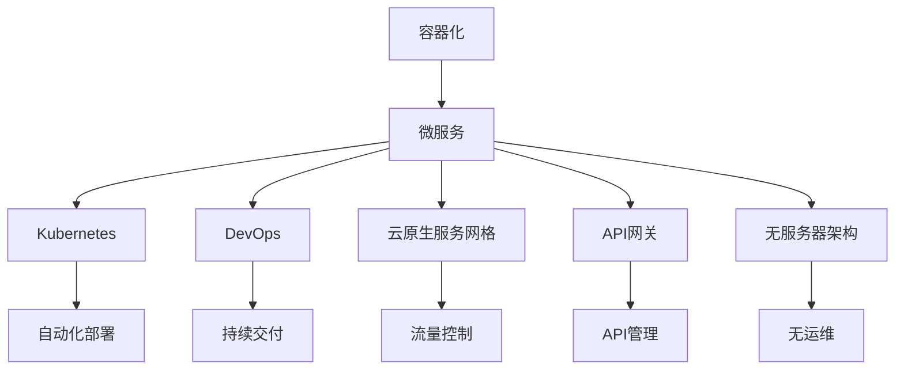

                 

# 云原生架构设计：构建可扩展的云端应用

## 1. 背景介绍

### 1.1 问题由来

随着云计算和容器技术的发展，云原生架构已经成为现代应用开发的主流范式。云原生架构设计的核心思想是将应用程序构建在云平台上，并利用容器、微服务、DevOps等技术，实现应用的自动化部署、快速迭代和弹性扩展。这种架构设计可以显著提升应用的运行效率、降低运维成本，并提高业务的响应速度和稳定性。

然而，云原生架构设计并不是一成不变的。随着业务需求的不断变化和新技术的不断涌现，云原生架构也需要不断地进行调整和优化。如何在不断变化的环境中，构建一个既符合当前业务需求，又具备长远可扩展性的云原生应用架构，成为了一个重要的问题。

### 1.2 问题核心关键点

构建可扩展的云原生应用架构，需要关注以下几个关键点：

1. 容器化与微服务化：容器技术可以显著提升应用的可移植性和运维效率，而微服务架构则可以实现应用的快速迭代和弹性扩展。
2. 自动化部署与持续交付：自动化部署和持续交付是云原生架构的基石，可以大幅提升应用的开发和运维效率。
3. 可扩展性与弹性设计：云原生架构需要具备高度的可扩展性和弹性设计，以应对业务规模的变化和突发流量。
4. 持续监控与自动化运维：持续监控和自动化运维是保障应用稳定性和可扩展性的重要手段。

### 1.3 问题研究意义

构建可扩展的云原生应用架构，对于提升应用的性能、降低运维成本、提高业务的响应速度和稳定性具有重要意义：

1. 提升性能：云原生架构可以实现应用的自动化部署和弹性扩展，确保应用在各种负载情况下都能保持良好的性能。
2. 降低成本：自动化部署和持续交付可以减少人力成本，自动化运维可以减少运维成本。
3. 提高响应速度：容器化和微服务化设计可以加速应用的迭代和发布，快速响应市场变化。
4. 保障稳定性：持续监控和自动化运维可以及时发现和解决系统问题，保障应用的稳定性和可用性。

## 2. 核心概念与联系

### 2.1 核心概念概述

为了更好地理解云原生架构设计的核心思想，本节将介绍几个密切相关的核心概念：

- **容器化**：将应用程序打包在容器中，使得应用程序能够在不依赖具体操作系统和环境的情况下，在不同的平台上运行。
- **微服务**：将大型应用程序拆分成多个小服务，每个服务负责处理特定业务逻辑，并通过轻量级的通信机制进行交互。
- **Kubernetes**：一个开源容器编排系统，用于管理容器化应用程序的部署、扩展和运维。
- **DevOps**：一种结合软件开发和运维的持续交付实践，通过自动化和持续监控，提高软件的交付速度和质量。
- **云原生服务网格**：如Istio，用于实现微服务间的通信、监控和流量控制。
- **API网关**：如Kong，用于处理API请求、流量控制和数据拦截。
- **无服务器架构**：如AWS Lambda，使得开发人员无需关心基础设施，可以专注于应用开发。

这些核心概念之间的逻辑关系可以通过以下Mermaid流程图来展示：



这个流程图展示了一些核心概念及其之间的关系：

1. 容器化是微服务化、Kubernetes、DevOps等的基础。
2. Kubernetes管理微服务，DevOps实现自动化部署和持续交付。
3. 云原生服务网格、API网关、无服务器架构等扩展了微服务化的应用场景，提供了更丰富、灵活的运维手段。
4. 自动化部署、持续交付、流量控制、API管理、无运维等都是云原生架构设计的关键组成部分。

这些概念共同构成了云原生架构设计的核心框架，使得应用能够具备高度的可扩展性和弹性设计。

## 3. 核心算法原理 & 具体操作步骤

### 3.1 算法原理概述

云原生架构设计的核心算法原理主要包括容器化、微服务化、自动化部署和持续交付等。

**容器化**：将应用程序打包在容器中，使得应用程序能够在不依赖具体操作系统和环境的情况下，在不同的平台上运行。容器化技术主要包括Docker、Kubernetes等。

**微服务化**：将大型应用程序拆分成多个小服务，每个服务负责处理特定业务逻辑，并通过轻量级的通信机制进行交互。微服务化技术主要包括Spring Cloud、Dubbo等。

**自动化部署**：通过自动化工具，如Jenkins、GitLab CI/CD等，实现代码的持续集成、测试和部署，从而提升开发效率和应用稳定性。

**持续交付**：通过自动化测试、持续集成和持续部署等手段，实现应用的快速迭代和发布，从而提升业务响应速度和市场竞争力。

### 3.2 算法步骤详解

云原生架构设计的具体步骤包括以下几个关键环节：

**Step 1: 容器化开发**

1. 将应用程序代码打包成Docker镜像。
2. 编写Dockerfile文件，指定应用程序的依赖关系和运行环境。
3. 将Docker镜像上传到Docker Hub或Kubernetes仓库。

**Step 2: 微服务拆分**

1. 将应用程序按照业务逻辑拆分成多个小服务，每个服务负责特定功能。
2. 为每个微服务编写独立的代码库和测试脚本。
3. 使用Spring Cloud或Dubbo等微服务框架，实现微服务之间的通信和协调。

**Step 3: Kubernetes部署**

1. 在Kubernetes集群上创建命名空间（Namespace），用于隔离不同的环境。
2. 编写Kubernetes Deployment、Service和Ingress等配置文件，定义微服务的部署和访问规则。
3. 使用kubectl命令行工具或Kubernetes UI进行部署和监控。

**Step 4: 自动化部署和持续交付**

1. 使用Jenkins、GitLab CI/CD等自动化工具，实现代码的持续集成和自动化部署。
2. 编写自动化测试脚本，确保代码质量。
3. 配置CI/CD流水线，实现从代码提交到部署的自动化流程。

**Step 5: 持续监控与自动化运维**

1. 使用Prometheus、Grafana等监控工具，实时监控应用性能和资源使用情况。
2. 配置Kubernetes自动扩展策略，根据负载自动调整资源。
3. 使用ELK Stack等日志管理工具，收集和分析日志信息。

### 3.3 算法优缺点

云原生架构设计具有以下优点：

1. 提高开发效率：通过容器化和微服务化，可以加速应用的开发和迭代。
2. 提升运维效率：自动化部署和持续交付可以大幅降低运维成本和复杂度。
3. 增强扩展性：微服务化设计可以实现应用的弹性扩展，适应业务变化。

但云原生架构设计也存在一些缺点：

1. 学习成本高：容器化、微服务化等新技术需要一定的学习成本。
2. 复杂度高：架构设计复杂，需要综合考虑性能、可用性、扩展性等多个因素。
3. 运维复杂：自动化运维需要配置和监控多个组件，可能增加运维复杂度。

### 3.4 算法应用领域

云原生架构设计已经在诸多领域得到了广泛应用，以下是一些典型的应用场景：

1. **电商系统**：电商平台通过微服务化设计和自动化部署，实现应用的快速迭代和弹性扩展，提升用户体验和业务响应速度。
2. **金融系统**：金融系统通过容器化和无服务器架构，实现应用的稳定性和高可用性，保障用户数据和交易的安全。
3. **电信系统**：电信系统通过云原生服务网格和API网关，实现微服务之间的通信和管理，提升系统的可靠性和可维护性。
4. **物流系统**：物流系统通过自动化部署和持续监控，实现应用的快速迭代和高效运维，提升物流效率和服务质量。
5. **医疗系统**：医疗系统通过容器化和微服务化设计，实现应用的弹性和扩展，提高医疗服务的响应速度和稳定性。

除了上述这些应用场景外，云原生架构设计还在智能制造、智慧城市、智能家居等多个领域得到了广泛应用，推动了各行各业的数字化转型。

## 4. 数学模型和公式 & 详细讲解 & 举例说明（备注：数学公式请使用latex格式，latex嵌入文中独立段落使用 $$，段落内使用 $)
### 4.1 数学模型构建

云原生架构设计的数学模型主要涉及容器化、微服务化、自动化部署和持续交付等几个关键环节。

**容器化模型**

容器化技术可以通过Docker等工具实现，其核心思想是将应用程序和其依赖打包在一个独立的容器中，确保应用程序在不同环境中的一致性和可移植性。Docker容器可以描述为：

$$
C = \{C_1, C_2, \dots, C_n\}
$$

其中 $C_i$ 表示第 $i$ 个容器，包括其镜像、依赖和配置等信息。

**微服务模型**

微服务架构可以描述为一个有向无环图（DAG），其中每个节点表示一个微服务，边表示它们之间的通信关系。微服务模型的形式化描述如下：

$$
G = (V, E)
$$

其中 $V$ 表示微服务的集合，$E$ 表示微服务之间的通信关系。

**自动化部署模型**

自动化部署可以通过Jenkins、GitLab CI/CD等工具实现，其核心思想是实现代码的持续集成和自动化部署。自动化部署模型的形式化描述如下：

$$
A = (C, R, M)
$$

其中 $C$ 表示代码库，$R$ 表示构建和测试脚本，$M$ 表示部署和监控工具。

**持续交付模型**

持续交付可以通过CI/CD流水线实现，其核心思想是实现代码的持续集成和自动化部署。持续交付模型的形式化描述如下：

$$
D = (C, R, M, T)
$$

其中 $C$ 表示代码库，$R$ 表示构建和测试脚本，$M$ 表示部署和监控工具，$T$ 表示测试用例和测试结果。

### 4.2 公式推导过程

以下是云原生架构设计的几个关键公式及其推导过程：

**容器化公式**

Docker容器的体积可以表示为：

$$
V_{C} = \sum_{i=1}^n V_{C_i}
$$

其中 $V_{C_i}$ 表示第 $i$ 个容器的体积。

**微服务公式**

微服务之间的通信关系可以表示为：

$$
E = \{(i, j) \mid C_i \rightarrow C_j\}
$$

其中 $i, j$ 表示微服务的编号，$C_i \rightarrow C_j$ 表示 $C_i$ 可以调用 $C_j$。

**自动化部署公式**

自动化部署的流程可以表示为：

$$
A = (C \rightarrow R \rightarrow M)
$$

其中 $C \rightarrow R$ 表示代码从库 $C$ 到构建和测试脚本 $R$ 的映射，$R \rightarrow M$ 表示构建和测试结果到部署和监控工具 $M$ 的映射。

**持续交付公式**

持续交付的流程可以表示为：

$$
D = (C \rightarrow R \rightarrow M \rightarrow T)
$$

其中 $C \rightarrow R$ 表示代码从库 $C$ 到构建和测试脚本 $R$ 的映射，$R \rightarrow M$ 表示构建和测试结果到部署和监控工具 $M$ 的映射，$M \rightarrow T$ 表示部署和监控结果到测试用例和测试结果 $T$ 的映射。

### 4.3 案例分析与讲解

**案例1: 电商系统**

电商系统通过微服务化设计和容器化部署，实现了应用的快速迭代和弹性扩展。具体实现步骤如下：

1. 将电商系统的各个模块拆分成多个微服务，每个服务负责特定业务逻辑。
2. 将每个微服务打包成Docker镜像，并上传到Kubernetes仓库。
3. 使用Jenkins和GitLab CI/CD等工具，实现代码的持续集成和自动化部署。
4. 配置Kubernetes自动扩展策略，根据负载自动调整资源。
5. 使用Prometheus和Grafana等监控工具，实时监控应用性能和资源使用情况。

**案例2: 金融系统**

金融系统通过容器化和无服务器架构，实现了应用的稳定性和高可用性。具体实现步骤如下：

1. 将金融系统的各个模块拆分成多个微服务，每个服务负责特定业务逻辑。
2. 将每个微服务打包成Docker镜像，并上传到Kubernetes仓库。
3. 使用Jenkins和GitLab CI/CD等工具，实现代码的持续集成和自动化部署。
4. 使用AWS Lambda等无服务器架构，实现应用的快速迭代和弹性扩展。
5. 使用ELK Stack等日志管理工具，收集和分析日志信息。

## 5. 项目实践：代码实例和详细解释说明

### 5.1 开发环境搭建

在进行云原生架构实践前，我们需要准备好开发环境。以下是使用Python进行Kubernetes和Docker开发的环境配置流程：

1. 安装Docker：从官网下载并安装Docker，用于容器化开发。
2. 安装Kubernetes：使用Kubernetes官方文档或第三方工具进行安装，如Minikube。
3. 安装Jenkins：使用Jenkins官方文档或第三方工具进行安装。
4. 安装GitLab CI/CD：使用GitLab官方文档或第三方工具进行安装。

完成上述步骤后，即可在Kubernetes集群上搭建云原生应用。

### 5.2 源代码详细实现

这里我们以电商系统为例，给出使用Kubernetes和Docker进行微服务化设计和容器化部署的PyTorch代码实现。

**Dockerfile**

```Dockerfile
FROM ubuntu:18.04

RUN apt-get update && apt-get install -y \
    apt-transport-https \
    ca-certificates \
    curl \
    software-properties-common

RUN curl -fsSL https://download.docker.com/linux/debian/gpg | apt-key add -

RUN add-apt-repository "deb [arch=amd64] https://download.docker.com/linux/debian $(lsb_release -cs) stable"

RUN apt-get update && apt-get install -y \
    docker-ce docker-ce-cli containerd.io

CMD ["/bin/bash"]
```

**Kubernetes Deployment**

```yaml
apiVersion: v1
kind: Deployment
metadata:
  name: ecommerce-deployment
spec:
  replicas: 3
  selector:
    matchLabels:
      app: ecommerce
  template:
    metadata:
      labels:
        app: ecommerce
    spec:
      containers:
      - name: ecommerce-app
        image: ecommerce:1.0.0
        ports:
        - containerPort: 8080
```

**Kubernetes Service**

```yaml
apiVersion: v1
kind: Service
metadata:
  name: ecommerce-service
spec:
  selector:
    app: ecommerce
  ports:
    - protocol: TCP
      port: 80
      targetPort: 8080
```

**Kubernetes Ingress**

```yaml
apiVersion: v1
kind: Ingress
metadata:
  name: ecommerce-ingress
spec:
  rules:
    - host: ecommerce.example.com
      http:
        paths:
          - path: /
            backend:
              serviceName: ecommerce-service
              servicePort: 80
```

**Jenkins Pipeline**

```groovy
pipeline {
    agent any
    stages {
        stage('Build') {
            steps {
                sh 'docker build -t ecommerce:1.0.0 -f Dockerfile .'
            }
        }
        stage('Deploy') {
            steps {
                sh 'kubectl apply -f ecommerce-deployment.yaml'
                sh 'kubectl apply -f ecommerce-service.yaml'
                sh 'kubectl apply -f ecommerce-ingress.yaml'
            }
        }
    }
}
```

**GitLab CI/CD**

```yaml
stages:
  - build
  - deploy
build:
  stage: build
  script:
    - docker build -t ecommerce:1.0.0 -f Dockerfile .
  artifacts:
    reports:
      junit: 'target/**/*.xml'
deploy:
  stage: deploy
  script:
    - kubectl apply -f ecommerce-deployment.yaml
    - kubectl apply -f ecommerce-service.yaml
    - kubectl apply -f ecommerce-ingress.yaml
  only:
    - master
```

以上代码展示了电商系统的容器化设计和微服务化部署的完整流程。可以看到，通过Docker和Kubernetes，电商系统能够实现应用的快速迭代和弹性扩展，同时通过Jenkins和GitLab CI/CD，实现代码的持续集成和自动化部署。

### 5.3 代码解读与分析

让我们再详细解读一下关键代码的实现细节：

**Dockerfile**

- 定义了Docker镜像的基础环境，包括Ubuntu系统和Docker安装。
- 从Docker Hub下载预定义的Docker镜像，并将其命名为 `ecommerce`。
- 将 `ecommerce` 镜像部署到Kubernetes集群。

**Kubernetes Deployment**

- 定义了一个 `Deployment` 对象，指定了应用的副本数量、选择器、模板和容器配置。
- 容器配置指定了应用名称、Docker镜像、端口映射等参数。

**Kubernetes Service**

- 定义了一个 `Service` 对象，指定了服务的标签选择器、端口映射和协议等参数。

**Kubernetes Ingress**

- 定义了一个 `Ingress` 对象，指定了服务的域名和路径映射规则。

**Jenkins Pipeline**

- 定义了一个 Jenkins Pipeline，包括构建和部署两个阶段。
- 构建阶段使用 `docker build` 命令构建Docker镜像。
- 部署阶段使用 `kubectl apply` 命令部署Kubernetes对象。

**GitLab CI/CD**

- 定义了一个 GitLab CI/CD，包括构建和部署两个阶段。
- 构建阶段使用 `docker build` 命令构建Docker镜像。
- 部署阶段使用 `kubectl apply` 命令部署Kubernetes对象。

可以看到，通过Docker和Kubernetes，电商系统能够实现应用的快速迭代和弹性扩展，同时通过Jenkins和GitLab CI/CD，实现代码的持续集成和自动化部署。

当然，工业级的系统实现还需考虑更多因素，如日志、监控、告警等。但核心的云原生架构设计基本与此类似。

## 6. 实际应用场景

### 6.1 智能制造

基于云原生架构设计的智能制造系统，可以实现实时生产监控、设备状态管理、供应链优化等功能，提升制造效率和生产质量。具体应用场景包括：

- **实时生产监控**：通过物联网设备和传感器采集生产数据，实时监控生产线的运行状态和性能指标。
- **设备状态管理**：通过云端平台对设备进行统一管理，实现设备的健康监测和维护调度。
- **供应链优化**：通过云端平台对供应链数据进行实时分析和优化，提高供应链的协同性和效率。

### 6.2 智慧城市

基于云原生架构设计的智慧城市系统，可以实现城市运行状态的实时监控、资源调度、智能管理等功能，提升城市治理水平和居民生活质量。具体应用场景包括：

- **实时监控**：通过摄像头、传感器等设备，实时监控城市运行状态和交通流量。
- **资源调度**：通过云计算平台，实现城市资源的高效调度和管理，如交通信号灯、公共服务设施等。
- **智能管理**：通过云端平台，实现城市数据的智能化分析和管理，如智慧停车、智慧环保等。

### 6.3 智慧医疗

基于云原生架构设计的智慧医疗系统，可以实现患者数据管理、远程医疗、智慧诊断等功能，提升医疗服务的质量和效率。具体应用场景包括：

- **患者数据管理**：通过云端平台对患者数据进行统一管理和存储，确保数据的安全性和隐私性。
- **远程医疗**：通过视频通话、远程监控等技术，实现远程医疗和健康监测。
- **智慧诊断**：通过云端平台对医疗数据进行智能分析，辅助医生进行诊断和治疗决策。

## 7. 工具和资源推荐

### 7.1 学习资源推荐

为了帮助开发者系统掌握云原生架构设计的理论基础和实践技巧，这里推荐一些优质的学习资源：

1. **Kubernetes官方文档**：Kubernetes官方文档是学习云原生架构设计的最佳入门资源，提供了详细的Kubernetes API和命令参考。
2. **Docker官方文档**：Docker官方文档介绍了Docker的基本概念、安装和使用步骤，是了解容器化技术的必要参考。
3. **Spring Cloud官方文档**：Spring Cloud官方文档介绍了微服务架构的基本概念和实现方式，提供了丰富的示例和配置指南。
4. **DevOps实践指南**：DevOps实践指南介绍了DevOps的基本概念、工具和实践方法，是提升软件开发和运维效率的重要参考。
5. **《云原生架构设计》书籍**：本书系统介绍了云原生架构设计的理论基础和实践技巧，适合深入学习和实践。

通过对这些资源的学习实践，相信你一定能够快速掌握云原生架构设计的精髓，并用于解决实际的业务问题。

### 7.2 开发工具推荐

高效的开发离不开优秀的工具支持。以下是几款用于云原生架构设计的常用工具：

1. **Kubernetes**：一个开源容器编排系统，用于管理容器化应用程序的部署、扩展和运维。
2. **Docker**：一个开源容器化平台，用于构建、分发和运行应用程序。
3. **Jenkins**：一个开源自动化服务器，用于实现持续集成和持续部署。
4. **GitLab CI/CD**：一个开源持续集成和持续部署平台，支持多语言和多平台的应用开发。
5. **Prometheus**：一个开源监控系统，用于实时监控和告警。
6. **Grafana**：一个开源数据可视化平台，用于生成和分享实时监控数据。
7. **ELK Stack**：一个开源日志管理平台，用于收集、分析和处理日志信息。

合理利用这些工具，可以显著提升云原生架构设计的开发效率，加快创新迭代的步伐。

### 7.3 相关论文推荐

云原生架构设计的理论研究在不断进步，以下是几篇奠基性的相关论文，推荐阅读：

1. **《Cloud-Native Computing Foundation's White Paper》**：介绍云原生架构设计的核心概念和最佳实践，是理解云原生架构设计的重要基础。
2. **《Kubernetes: Open Source Platform for Distributed Systems》**：Kubernetes官方论文，介绍了Kubernetes的基本原理和设计思想。
3. **《Docker: The Platform for Developers》**：Docker官方论文，介绍了Docker的基本概念和设计思想。
4. **《Spring Cloud: Microservices in Java》**：Spring Cloud官方论文，介绍了微服务架构的基本概念和实现方式。
5. **《DevOps: The Philosophy and Culture of Declarative IT》**：DevOps实践指南，介绍了DevOps的基本概念和实践方法。

这些论文代表了大数据、云计算和大数据架构设计的理论发展脉络。通过学习这些前沿成果，可以帮助研究者把握学科前进方向，激发更多的创新灵感。

## 8. 总结：未来发展趋势与挑战

### 8.1 总结

本文对云原生架构设计的核心思想和实践方法进行了全面系统的介绍。首先阐述了云原生架构设计的核心思想和重要性，明确了容器化、微服务化、自动化部署和持续交付等关键概念。其次，从原理到实践，详细讲解了云原生架构设计的数学模型和具体实现步骤，给出了云原生架构设计的完整代码实例。同时，本文还广泛探讨了云原生架构设计在智能制造、智慧城市、智慧医疗等多个领域的应用前景，展示了云原生架构设计的广阔应用空间。

通过本文的系统梳理，可以看到，云原生架构设计已经成为现代应用开发的主流范式，极大地提升了应用的开发效率和运维水平，推动了业务的数字化转型。未来，云原生架构设计还需要与其他新兴技术，如函数计算、无服务器架构等进行更深入的融合，共同推动云计算和人工智能技术的发展。

### 8.2 未来发展趋势

展望未来，云原生架构设计将呈现以下几个发展趋势：

1. **容器化技术普及化**：容器化技术将继续普及，成为云原生架构设计的基础设施。更多传统应用也将通过容器化技术实现自动化部署和弹性扩展。
2. **微服务架构成熟化**：微服务架构将进一步成熟，成为云原生架构设计的重要组成部分。更多复杂应用也将采用微服务架构，提升应用的稳定性和可维护性。
3. **自动化部署和持续交付普及化**：自动化部署和持续交付将继续普及，成为云原生架构设计的标配。更多开发者和运维人员也将采用自动化工具，提升开发效率和应用稳定性。
4. **云原生服务网格普及化**：云原生服务网格将进一步普及，成为云原生架构设计的重要组成部分。更多微服务系统也将采用云原生服务网格，提升微服务之间的通信和协调。
5. **自动化运维普及化**：自动化运维将继续普及，成为云原生架构设计的标配。更多运维人员也将采用自动化运维工具，提升运维效率和应用稳定性。

### 8.3 面临的挑战

尽管云原生架构设计已经取得了显著成果，但在迈向更加智能化、普适化应用的过程中，它仍面临以下挑战：

1. **学习成本高**：容器化、微服务化等新技术需要一定的学习成本。如何降低学习成本，让更多开发者和运维人员掌握云原生架构设计，是一个重要问题。
2. **复杂度高**：云原生架构设计涉及多个环节和组件，如何实现各环节的协同工作，是一个挑战。
3. **运维复杂**：云原生架构设计需要配置和监控多个组件，如何降低运维复杂度，提高系统的可维护性，是一个重要课题。
4. **性能问题**：容器化和微服务化设计可能带来一定的性能损失，如何优化性能，提高系统的响应速度，是一个挑战。
5. **成本问题**：云原生架构设计需要较高的资源投入，如何平衡成本和性能，是一个重要问题。

### 8.4 研究展望

面对云原生架构设计所面临的挑战，未来的研究需要在以下几个方面寻求新的突破：

1. **容器化技术优化**：优化Docker等容器化工具，提高容器启动速度和资源利用率，降低容器化成本。
2. **微服务架构优化**：优化微服务架构，降低服务间通信开销，提高微服务系统的可扩展性和稳定性。
3. **自动化部署和持续交付优化**：优化Jenkins、GitLab CI/CD等自动化工具，提高自动化部署和持续交付的效率和稳定性。
4. **自动化运维优化**：优化Prometheus、Grafana等监控工具，提高自动化运维的效率和精度。
5. **云原生服务网格优化**：优化云原生服务网格，提高微服务系统的高可用性和可维护性。
6. **无服务器架构普及**：推广无服务器架构，提高应用的弹性和扩展性，降低运维成本。

这些研究方向的探索，必将引领云原生架构设计技术迈向更高的台阶，为构建安全、可靠、可扩展的云原生应用提供新的思路和方法。

## 9. 附录：常见问题与解答

**Q1：云原生架构设计是否适用于所有应用程序？**

A: 云原生架构设计适用于大多数应用程序，特别是需要高可用性、高扩展性和高稳定性的应用程序。但对于一些实时性要求极高的应用，如金融交易系统，可能需要考虑其他架构设计。

**Q2：如何选择合适的云原生服务网格？**

A: 选择合适的云原生服务网格需要考虑以下几个因素：
1. 功能完备性：选择功能完备的云原生服务网格，支持微服务间的通信、监控和流量控制。
2. 社区活跃度：选择社区活跃的云原生服务网格，获得更多的技术支持和用户反馈。
3. 兼容性：选择与现有技术栈兼容的云原生服务网格，减少集成成本。
4. 性能和扩展性：选择性能优异、扩展性强的云原生服务网格，确保系统的稳定性和可用性。

**Q3：如何优化云原生架构设计的性能？**

A: 优化云原生架构设计的性能可以从以下几个方面入手：
1. 容器化优化：优化Docker镜像，减小容器体积，提高容器启动速度。
2. 微服务优化：优化微服务设计，减少服务间通信开销，提高微服务系统的性能。
3. 自动化部署和持续交付优化：优化自动化部署工具，提高自动化部署的效率和稳定性。
4. 自动化运维优化：优化监控工具，提高自动化运维的效率和精度。

**Q4：如何降低云原生架构设计的运维成本？**

A: 降低云原生架构设计的运维成本可以从以下几个方面入手：
1. 容器化优化：优化Docker镜像，减小容器体积，降低存储和计算成本。
2. 微服务优化：优化微服务设计，减少服务间通信开销，降低网络流量。
3. 自动化部署和持续交付优化：优化自动化部署工具，提高自动化部署的效率和稳定性。
4. 自动化运维优化：优化自动化运维工具，提高自动化运维的效率和精度。

**Q5：云原生架构设计如何应对高并发场景？**

A: 云原生架构设计可以通过以下措施应对高并发场景：
1. 容器化优化：优化Docker镜像，提高容器启动速度和资源利用率，支持大规模容器集群。
2. 微服务优化：优化微服务设计，支持水平扩展，提高微服务系统的并发处理能力。
3. 自动化部署和持续交付优化：优化自动化部署工具，支持大规模自动化部署，提高部署效率。
4. 自动化运维优化：优化自动化运维工具，实时监控和调整系统资源，确保系统稳定运行。

**Q6：如何优化云原生架构设计的资源利用率？**

A: 优化云原生架构设计的资源利用率可以从以下几个方面入手：
1. 容器化优化：优化Docker镜像，减小容器体积，提高容器启动速度，降低容器化成本。
2. 微服务优化：优化微服务设计，减少服务间通信开销，提高微服务系统的资源利用率。
3. 自动化部署和持续交付优化：优化自动化部署工具，提高自动化部署的效率和稳定性，减少资源浪费。
4. 自动化运维优化：优化自动化运维工具，实时监控和调整系统资源，确保系统稳定运行，提高资源利用率。

通过上述措施，可以显著提升云原生架构设计的性能和资源利用率，降低运维成本，提高系统的可扩展性和稳定性。

**Q7：如何优化云原生架构设计的可扩展性？**

A: 优化云原生架构设计的可扩展性可以从以下几个方面入手：
1. 容器化优化：优化Docker镜像，提高容器启动速度和资源利用率，支持大规模容器集群。
2. 微服务优化：优化微服务设计，支持水平扩展，提高微服务系统的可扩展性。
3. 自动化部署和持续交付优化：优化自动化部署工具，支持大规模自动化部署，提高部署效率，支持弹性扩展。
4. 自动化运维优化：优化自动化运维工具，实时监控和调整系统资源，确保系统稳定运行，支持弹性扩展。

通过上述措施，可以显著提升云原生架构设计的可扩展性，满足业务快速变化和扩展的需求。

---

作者：禅与计算机程序设计艺术 / Zen and the Art of Computer Programming

