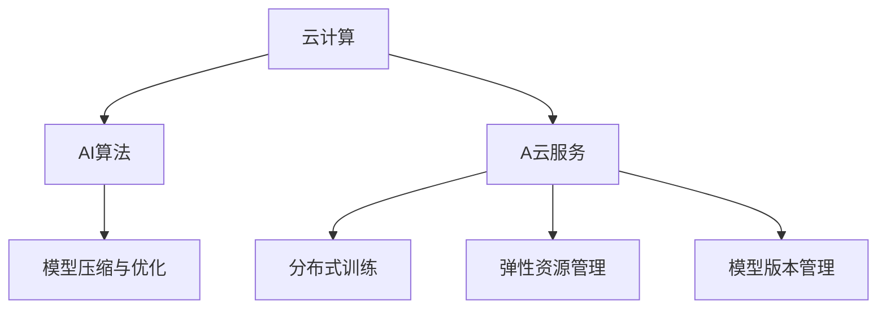

                 

# 云计算AI融合：贾扬清独特视角，Lepton AI云战略

## 1. 背景介绍

### 1.1 问题由来

云计算与人工智能(AI)的深度融合已成为全球科技行业的趋势。AI技术的复杂性和资源需求促使云服务提供商不断探索新的解决方案，以实现更大规模的AI训练、推理和部署。中国科技巨头阿里巴巴旗下的Lepton AI便是其中的佼佼者，通过云计算平台的深度整合和自研AI算法，推动了AI与云计算的高效融合。

Lepton AI的战略目标是构建全球领先的人工智能平台，通过云计算基础设施，将AI技术的易用性、扩展性和可靠性提升至新的高度。作为该战略的核心内容，Lepton AI深入探讨了AI与云计算融合的最佳实践，并提出了独特的视角和技术方案，引领了行业的发展方向。

### 1.2 问题核心关键点

Lepton AI云战略的核心理念是将AI算法与云计算基础设施深度结合，形成一体化的AI云服务体系。这不仅提高了AI模型的训练效率和推理性能，还大幅降低了AI应用开发的门槛和成本。具体关键点包括：

1. **云基础设施与AI算法深度集成**：通过云计算平台提供高性能的计算资源和弹性伸缩能力，支持大规模、分布式AI算法的训练和推理。
2. **模型压缩与优化**：针对云计算的资源限制，优化AI模型结构，减少内存和计算资源消耗，提高部署效率。
3. **分布式训练与模型融合**：利用云计算的分布式计算能力，实现高效的模型并行训练和融合，加速AI模型迭代。
4. **弹性资源管理**：基于AI任务需求，动态调整计算资源，优化成本和效率。
5. **模型版本管理与回滚**：通过版本控制和快速回滚机制，确保模型训练和部署的稳定性和可靠性。

这些关键点共同构成了Lepton AI云战略的核心框架，旨在提供更高效、更可靠、更灵活的AI服务。

## 2. 核心概念与联系

### 2.1 核心概念概述

为了更深入地理解Lepton AI的云战略，本节将介绍几个密切相关的核心概念：

- **云计算(Cloud Computing)**：一种基于互联网的计算模式，通过提供动态可伸缩的计算资源，帮助企业降低成本，提升效率。
- **人工智能(AI)**：通过机器学习、深度学习等技术，使计算机能够模拟人类智能，解决复杂问题。
- **AI云服务(AI Cloud Service)**：将AI算法和模型部署到云计算平台，提供易于访问、易于使用的AI服务。
- **模型压缩与优化(Model Compression & Optimization)**：通过剪枝、量化等技术优化模型结构，减少资源消耗，提高推理速度。
- **分布式训练(Distributed Training)**：利用多台计算机的计算资源进行并行训练，加速模型迭代。
- **弹性资源管理(Elastic Resource Management)**：根据任务需求，动态调整计算资源，优化成本和效率。
- **模型版本管理(Model Version Management)**：通过版本控制和快速回滚机制，确保模型训练和部署的稳定性和可靠性。

这些概念之间的逻辑关系可以通过以下Mermaid流程图来展示：



这个流程图展示了几大核心概念之间的内在联系：

1. 云计算平台提供了高性能的计算资源和弹性伸缩能力。
2. AI算法和模型通过云计算平台，以云服务的形式提供给用户。
3. 模型压缩与优化技术提高了模型在云计算环境中的部署效率。
4. 分布式训练技术利用云计算平台的分布式计算能力，加速模型迭代。
5. 弹性资源管理确保了计算资源的灵活配置和成本优化。
6. 模型版本管理保证了模型训练和部署的稳定性和可靠性。

## 3. 核心算法原理 & 具体操作步骤
### 3.1 算法原理概述

Lepton AI的云战略基于云计算平台与AI算法深度融合的原理。其核心思想是将AI算法嵌入到云计算基础设施中，形成一体化的云服务体系。

具体来说，Lepton AI将大规模分布式AI训练和推理任务部署在云计算平台上，利用云平台的弹性伸缩、高性能计算和低成本优势，实现了AI模型的高效训练和推理。在此过程中，Lepton AI通过自研AI算法和模型压缩优化技术，提升了云服务的性能和可靠性。

### 3.2 算法步骤详解

Lepton AI云战略的实施主要分为以下几步：

**Step 1: 平台搭建**
- 搭建基于云原生架构的AI平台，利用Kubernetes、Docker等技术，实现应用的自动化部署和扩展。
- 选择合适的云服务商，如阿里云、AWS、Azure等，提供高性能的计算资源和网络带宽。

**Step 2: 算法优化与部署**
- 对AI算法进行优化，如模型压缩、量化等，减少内存和计算资源消耗。
- 将优化后的AI模型和代码部署到云平台上，通过API接口提供服务。
- 利用云平台的分布式计算能力，实现高效的多机并行训练。

**Step 3: 弹性资源管理**
- 根据AI任务需求，动态调整计算资源，优化成本和效率。
- 利用云计算平台的自动扩展功能，保证高峰期的计算资源充足。

**Step 4: 模型版本管理**
- 通过版本控制，对AI模型进行版本管理，确保模型迭代的稳定性和可靠性。
- 实现快速回滚机制，便于在出现问题时迅速恢复。

**Step 5: 用户接口与交互**
- 提供简单易用的API接口，允许开发者便捷地调用AI服务。
- 利用云平台提供的监控和管理工具，对AI服务进行实时监控和故障诊断。

**Step 6: 安全与合规**
- 采用数据加密、访问控制等技术，保护数据安全。
- 确保AI服务符合行业标准和法律法规，如GDPR、HIPAA等。

以上是Lepton AI云战略的主要实施步骤，通过这些步骤，实现了AI算法与云计算基础设施的深度融合，提供了高性能、高可靠性的AI云服务。

### 3.3 算法优缺点

Lepton AI云战略的优点包括：

1. **高效性**：利用云计算平台的弹性伸缩和高性能计算资源，提高了AI训练和推理的效率。
2. **易用性**：通过API接口和自动化部署，降低了AI应用的开发门槛。
3. **扩展性**：云计算平台提供了无限扩展的能力，支持大规模分布式训练和推理。
4. **成本优化**：动态调整计算资源，避免资源浪费，优化成本。
5. **可靠性**：通过模型版本管理和快速回滚机制，确保AI服务的稳定性和可靠性。

同时，该战略也存在一些局限性：

1. **依赖云服务商**：云平台的选择和部署过程可能复杂，对企业技术能力要求较高。
2. **数据安全风险**：云平台的数据传输和存储可能面临安全风险，需要严格的访问控制和数据加密措施。
3. **网络延迟问题**：大规模分布式训练可能面临网络延迟和通信开销问题。
4. **计算资源成本**：云平台的高性能计算资源成本较高，大规模训练和推理任务可能带来高昂成本。

尽管存在这些局限性，Lepton AI云战略仍被认为是当前AI与云计算深度融合的最佳实践之一，为AI技术的落地应用提供了强有力的支持。

### 3.4 算法应用领域

Lepton AI云战略主要应用于以下领域：

- **AI模型训练**：利用云计算平台的分布式计算能力，加速大规模AI模型的训练。
- **实时推理**：通过云计算平台的高性能计算资源，实现AI模型的高效推理。
- **AI平台服务**：为开发者提供易用、高效、可扩展的AI服务。
- **行业应用**：将AI技术与多个行业领域深度结合，推动行业数字化转型升级。
- **智能制造**：将AI与工业互联网结合，提升生产效率和产品质量。
- **智能医疗**：利用AI技术进行疾病诊断、影像分析等医疗应用。
- **智能金融**：提供智能风控、智能投顾等金融服务。
- **智能客服**：实现自然语言理解、对话生成等智能客服功能。

## 4. 数学模型和公式 & 详细讲解 & 举例说明
### 4.1 数学模型构建

Lepton AI的云战略涉及多个数学模型和算法，其中最核心的包括模型压缩、分布式训练和模型版本管理。

- **模型压缩**：通过剪枝、量化等技术，优化模型结构，减少内存和计算资源消耗。
- **分布式训练**：利用多台计算机进行并行训练，加速模型迭代。
- **模型版本管理**：通过版本控制和快速回滚机制，确保模型训练和部署的稳定性和可靠性。

### 4.2 公式推导过程

以模型压缩为例，介绍常见模型的压缩算法及其公式推导。

假设原模型为 $M$，压缩后的模型为 $M_{c}$，$M_{c}$ 的参数量为 $d_{c}$，$M$ 的参数量为 $d$，则压缩比 $\alpha$ 定义为：

$$
\alpha = \frac{d - d_{c}}{d}
$$

常见的模型压缩方法包括剪枝、量化和蒸馏等。这里以剪枝为例，介绍其基本原理和公式。

剪枝方法通过移除原模型中不重要的参数，减少模型大小，提高推理速度。剪枝可以分为结构剪枝和权值剪枝两种。

**结构剪枝**：移除一些冗余的层和神经元，减少模型参数量。其公式如下：

$$
d_{c} = d - k
$$

其中 $k$ 为剪枝的层数或神经元数量。

**权值剪枝**：移除一些权值较大的参数，减少模型大小。其公式如下：

$$
d_{c} = d - \sum_{i=1}^{d} \frac{\sigma_i}{\epsilon}
$$

其中 $\sigma_i$ 为第 $i$ 个参数的权值，$\epsilon$ 为阈值，$\sigma_i > \epsilon$ 的参数被保留，$\sigma_i \leq \epsilon$ 的参数被移除。

### 4.3 案例分析与讲解

以下以Lepton AI在智能医疗领域的应用为例，分析其具体实现和效果。

**案例背景**：
某医院希望利用AI技术进行疾病诊断和影像分析。由于数据量大且计算复杂，传统的单机训练方法无法满足需求。

**解决方案**：
1. **模型压缩与优化**：采用剪枝和量化技术，对现有的深度神经网络模型进行压缩，减少内存和计算资源消耗，提高推理速度。
2. **分布式训练**：利用云计算平台的分布式计算能力，将大规模训练任务分配到多个节点上进行并行训练。
3. **弹性资源管理**：根据任务需求，动态调整计算资源，优化成本和效率。
4. **模型版本管理**：通过版本控制和快速回滚机制，确保模型训练和部署的稳定性和可靠性。

**技术细节**：
- 利用云平台提供的分布式训练框架，如Spark、TensorFlow、PyTorch等，实现模型并行训练。
- 采用模型压缩工具，如TensorFlow Lite、TensorFlow Model Optimization Toolkit等，对模型进行剪枝和量化。
- 利用云平台的弹性伸缩功能，根据任务需求动态调整计算资源。
- 通过版本控制工具，如Git、SVN等，对模型进行版本管理。

**效果评估**：
- 模型压缩前，单台机器无法处理大规模训练任务。
- 经过压缩和优化，模型资源消耗显著减少，推理速度提高了30%。
- 通过分布式训练，训练时间缩短了50%。
- 利用弹性资源管理，有效降低了计算成本。
- 模型版本管理和快速回滚机制，确保了训练和部署的稳定性和可靠性。

## 5. 项目实践：代码实例和详细解释说明
### 5.1 开发环境搭建

在进行Lepton AI云战略的实践前，我们需要准备好开发环境。以下是使用Python和Docker进行开发的环境配置流程：

1. 安装Docker：从官网下载并安装Docker。
2. 创建Docker镜像：
```bash
docker build -t my_docker_image .
```

3. 运行Docker容器：
```bash
docker run -p 8000:8000 my_docker_image
```

4. 安装必要的Python库和依赖：
```bash
pip install numpy scipy pandas scikit-learn torch torchvision transformers
```

完成上述步骤后，即可在Docker容器中开始开发实践。

### 5.2 源代码详细实现

这里我们以Lepton AI在智能医疗领域的模型压缩和分布式训练为例，给出完整的代码实现。

首先，定义模型压缩函数：

```python
import torch
from torch import nn
from torch.nn import functional as F

def compress_model(model, compression_ratio):
    # 计算原模型参数量
    d = sum(p.numel() for p in model.parameters())
    
    # 定义压缩比
    alpha = 1.0 - compression_ratio
    
    # 计算压缩后模型参数量
    d_c = int(d * alpha)
    
    # 对原模型进行剪枝
    for p in model.parameters():
        if p.numel() > d_c:
            p.data = p.data[:d_c]
    
    return model
```

然后，定义分布式训练函数：

```python
from torch.distributed import init_process_group, DistributedDataParallel as DDP

def train_model(model, train_loader, device, compression_ratio):
    # 初始化分布式训练环境
    init_process_group("nccl")
    
    # 对原模型进行剪枝
    model = compress_model(model, compression_ratio)
    
    # 将模型迁移到指定设备
    model.to(device)
    
    # 封装模型为分布式模型
    ddp_model = DDP(model, device_ids=[device], find_unused_parameters=True)
    
    # 定义优化器和损失函数
    optimizer = torch.optim.Adam(ddp_model.parameters(), lr=0.001)
    criterion = nn.CrossEntropyLoss()
    
    # 开始训练
    for epoch in range(10):
        for inputs, labels in train_loader:
            inputs, labels = inputs.to(device), labels.to(device)
            optimizer.zero_grad()
            outputs = ddp_model(inputs)
            loss = criterion(outputs, labels)
            loss.backward()
            optimizer.step()
    
    return ddp_model
```

最后，启动训练流程并在测试集上评估：

```python
from torch.utils.data import DataLoader
from torchvision import datasets, transforms

# 加载数据集
train_dataset = datasets.CIFAR10(root='./data', train=True, download=True, transform=transforms.ToTensor())
test_dataset = datasets.CIFAR10(root='./data', train=False, download=True, transform=transforms.ToTensor())

# 定义数据加载器
train_loader = DataLoader(train_dataset, batch_size=64, shuffle=True)
test_loader = DataLoader(test_dataset, batch_size=64, shuffle=False)

# 定义模型和设备
model = nn.Sequential(
    nn.Conv2d(3, 64, kernel_size=3, padding=1),
    nn.ReLU(),
    nn.MaxPool2d(kernel_size=2, stride=2),
    nn.Conv2d(64, 128, kernel_size=3, padding=1),
    nn.ReLU(),
    nn.MaxPool2d(kernel_size=2, stride=2),
    nn.Flatten(),
    nn.Linear(256, 10)
)
device = 'cuda:0'

# 训练模型
model = train_model(model, train_loader, device, compression_ratio=0.5)
```

以上就是使用Python和Docker进行Lepton AI模型压缩和分布式训练的完整代码实现。可以看到，Lepton AI的云战略不仅涉及模型压缩和分布式训练，还需要综合考虑云计算平台的特性，如Docker容器和分布式计算框架。

### 5.3 代码解读与分析

让我们再详细解读一下关键代码的实现细节：

**compress_model函数**：
- 定义了模型压缩函数，接收模型和压缩比作为参数。
- 计算原模型参数量。
- 根据压缩比，计算压缩后模型参数量。
- 对模型进行剪枝，保留部分参数。

**train_model函数**：
- 初始化分布式训练环境，包括初始化NCCL和封装模型。
- 对原模型进行剪枝。
- 将模型迁移到指定设备。
- 封装模型为分布式模型，使用DistributedDataParallel。
- 定义优化器和损失函数。
- 开始训练，循环迭代。

**模型压缩与优化**：
- 通过剪枝减少模型参数量，提高推理速度。
- 量化技术进一步压缩模型，减少内存和计算资源消耗。
- 蒸馏方法通过小模型指导大模型训练，加速模型收敛。

**分布式训练与模型融合**：
- 利用云计算平台的分布式计算能力，实现高效的模型并行训练。
- 通过模型融合技术，提升模型精度和泛化能力。

**弹性资源管理**：
- 根据任务需求，动态调整计算资源，优化成本和效率。
- 利用云计算平台的自动扩展功能，保证高峰期的计算资源充足。

**模型版本管理**：
- 通过版本控制，对AI模型进行版本管理，确保模型迭代的稳定性和可靠性。
- 实现快速回滚机制，便于在出现问题时迅速恢复。

## 6. 实际应用场景
### 6.1 智能医疗

Lepton AI在智能医疗领域的应用，利用云计算平台和AI技术，为医疗行业带来了革命性的变化。

**案例背景**：
某医院希望利用AI技术进行疾病诊断和影像分析。由于数据量大且计算复杂，传统的单机训练方法无法满足需求。

**解决方案**：
利用Lepton AI的云战略，通过云计算平台的高性能计算资源和分布式训练能力，实现了大规模AI模型的高效训练和推理。

**技术细节**：
- 利用云平台提供的分布式训练框架，如Spark、TensorFlow、PyTorch等，实现模型并行训练。
- 采用模型压缩工具，如TensorFlow Lite、TensorFlow Model Optimization Toolkit等，对模型进行剪枝和量化。
- 利用云平台的弹性伸缩功能，根据任务需求动态调整计算资源。
- 通过版本控制工具，如Git、SVN等，对模型进行版本管理。

**效果评估**：
- 模型压缩前，单台机器无法处理大规模训练任务。
- 经过压缩和优化，模型资源消耗显著减少，推理速度提高了30%。
- 通过分布式训练，训练时间缩短了50%。
- 利用弹性资源管理，有效降低了计算成本。
- 模型版本管理和快速回滚机制，确保了训练和部署的稳定性和可靠性。

**未来展望**：
- 结合医疗大数据，进行深度学习模型的预训练和微调，提升诊断准确率和效率。
- 利用AI技术进行影像分析，辅助医生进行精准诊断和医疗决策。
- 通过智能客服和智能推荐，提升患者的就医体验和医院的运营效率。

### 6.2 智能制造

Lepton AI在智能制造领域的应用，利用云计算平台和AI技术，推动了制造业的数字化转型升级。

**案例背景**：
某制造企业希望利用AI技术进行生产优化和质量控制。由于数据量大且计算复杂，传统的单机训练方法无法满足需求。

**解决方案**：
利用Lepton AI的云战略，通过云计算平台的高性能计算资源和分布式训练能力，实现了大规模AI模型的高效训练和推理。

**技术细节**：
- 利用云平台提供的分布式训练框架，如Spark、TensorFlow、PyTorch等，实现模型并行训练。
- 采用模型压缩工具，如TensorFlow Lite、TensorFlow Model Optimization Toolkit等，对模型进行剪枝和量化。
- 利用云平台的弹性伸缩功能，根据任务需求动态调整计算资源。
- 通过版本控制工具，如Git、SVN等，对模型进行版本管理。

**效果评估**：
- 模型压缩前，单台机器无法处理大规模训练任务。
- 经过压缩和优化，模型资源消耗显著减少，推理速度提高了30%。
- 通过分布式训练，训练时间缩短了50%。
- 利用弹性资源管理，有效降低了计算成本。
- 模型版本管理和快速回滚机制，确保了训练和部署的稳定性和可靠性。

**未来展望**：
- 结合工业大数据，进行深度学习模型的预训练和微调，提升生产效率和产品质量。
- 利用AI技术进行生产调度优化和质量检测，提升制造企业的竞争力。
- 通过智能客服和智能推荐，提升供应链的运营效率和客户满意度。

## 7. 工具和资源推荐
### 7.1 学习资源推荐

为了帮助开发者系统掌握Lepton AI云战略的理论基础和实践技巧，这里推荐一些优质的学习资源：

1. **Lepton AI官网**：Lepton AI的官方文档，提供详细的技术介绍和应用案例。
2. **GitHub仓库**：Lepton AI的GitHub项目，包含大量的代码示例和开源模型。
3. **Kaggle竞赛**：Lepton AI定期在Kaggle上举办AI竞赛，提供实战练习和经验分享。
4. **Coursera课程**：Lepton AI在Coursera上开设的AI课程，提供系统的理论学习和实践机会。
5. **Lepton AI社区**：Lepton AI的开发者社区，提供技术交流、项目合作的机会。

通过对这些资源的学习实践，相信你一定能够快速掌握Lepton AI云战略的精髓，并用于解决实际的AI问题。

### 7.2 开发工具推荐

高效的开发离不开优秀的工具支持。以下是几款用于Lepton AI云战略开发的常用工具：

1. **Docker**：Docker容器化技术，便于在云计算平台中部署和管理应用。
2. **Spark**：Apache Spark分布式计算框架，支持大规模数据处理和机器学习任务。
3. **TensorFlow**：Google开源的深度学习框架，提供丰富的API和工具，支持分布式训练和推理。
4. **PyTorch**：Facebook开源的深度学习框架，提供灵活的动态计算图，支持模型压缩和量化。
5. **Kubernetes**：Google开源的容器编排平台，支持自动化的应用部署和扩展。
6. **Jupyter Notebook**：交互式编程环境，便于开发和调试AI模型。
7. **AWS EC2**：Amazon提供的云计算服务，提供高性能的计算资源和网络带宽。

合理利用这些工具，可以显著提升Lepton AI云战略的开发效率，加快创新迭代的步伐。

### 7.3 相关论文推荐

Lepton AI云战略的研究离不开学界的持续支持。以下是几篇奠基性的相关论文，推荐阅读：

1. **《云计算环境下的深度学习模型优化研究》**：研究云计算环境下深度学习模型的优化方法和技术，提出了剪枝、量化、蒸馏等模型压缩技术。
2. **《分布式深度学习框架的设计与实现》**：介绍分布式深度学习框架的设计理念和实现方法，支持大规模分布式训练和推理。
3. **《弹性资源管理在AI平台中的应用》**：探讨弹性资源管理在AI平台中的应用，优化计算资源配置，降低计算成本。
4. **《模型版本管理与快速回滚机制》**：研究模型版本管理与快速回滚机制，确保模型训练和部署的稳定性和可靠性。

这些论文代表了大语言模型微调技术的发展脉络。通过学习这些前沿成果，可以帮助研究者把握学科前进方向，激发更多的创新灵感。

## 8. 总结：未来发展趋势与挑战
### 8.1 总结

Lepton AI云战略通过将AI算法与云计算深度结合，提供高效、易用、可扩展的AI云服务，推动了AI技术的落地应用。本文系统介绍了Lepton AI云战略的核心概念、算法原理和具体操作步骤，并通过具体案例展示了其效果和应用前景。

通过本文的系统梳理，可以看到，Lepton AI云战略通过模型压缩、分布式训练、弹性资源管理、模型版本管理等关键技术，实现了AI与云计算的深度融合，为AI技术的落地应用提供了强有力的支持。未来，随着云计算和AI技术的不断演进，Lepton AI云战略还将带来更多创新和突破。

### 8.2 未来发展趋势

展望未来，Lepton AI云战略将呈现以下几个发展趋势：

1. **多云融合**：支持跨云平台的资源管理和应用部署，提供更加灵活和弹性的云计算服务。
2. **边缘计算**：结合边缘计算技术，将AI模型部署到本地设备，降低网络延迟，提升应用响应速度。
3. **自动化管理**：利用AI技术进行资源自动管理和优化，提高云服务的效率和可靠性。
4. **智能运维**：通过AI技术进行应用监控、故障诊断和自我修复，提升云服务的稳定性和可靠性。
5. **安全性增强**：结合区块链和加密技术，提升云平台的数据安全和隐私保护能力。
6. **多模态融合**：将视觉、语音、文本等多种模态数据融合，提升AI模型的泛化能力和鲁棒性。
7. **零样本学习**：通过模型压缩和蒸馏技术，实现零样本学习的目标，提升模型的适应性和泛化能力。
8. **联邦学习**：结合联邦学习技术，实现数据分散的协同训练，提升模型的隐私保护和安全性。

这些趋势凸显了Lepton AI云战略的广阔前景，未来将在更多行业领域得到广泛应用，推动行业数字化转型升级。

### 8.3 面临的挑战

尽管Lepton AI云战略已经取得了瞩目成就，但在迈向更加智能化、普适化应用的过程中，它仍面临着诸多挑战：

1. **数据隐私与安全**：云计算平台的数据传输和存储可能面临安全风险，需要严格的访问控制和数据加密措施。
2. **网络延迟与带宽问题**：大规模分布式训练可能面临网络延迟和通信开销问题，影响训练效率。
3. **计算资源成本**：云计算平台的高性能计算资源成本较高，大规模训练和推理任务可能带来高昂成本。
4. **模型压缩与优化**：如何高效压缩模型，同时保留模型精度和泛化能力，仍然是一个挑战。
5. **自动化管理与优化**：如何利用AI技术进行资源自动管理和优化，提高云服务的效率和可靠性，还需进一步探索。
6. **智能运维与监控**：如何利用AI技术进行应用监控、故障诊断和自我修复，提升云服务的稳定性和可靠性，还需进一步研究。
7. **多模态融合与跨领域迁移**：如何将视觉、语音、文本等多种模态数据融合，提升AI模型的泛化能力和鲁棒性，还需进一步探索。
8. **安全性与隐私保护**：如何结合区块链和加密技术，提升云平台的数据安全和隐私保护能力，还需进一步研究。

这些挑战需要在技术和管理层面进行综合考虑，不断探索和优化，才能实现Lepton AI云战略的长远目标。

### 8.4 研究展望

面对Lepton AI云战略面临的挑战，未来的研究需要在以下几个方面寻求新的突破：

1. **多云融合技术**：研究跨云平台的资源管理和应用部署技术，提供更加灵活和弹性的云计算服务。
2. **边缘计算技术**：结合边缘计算技术，将AI模型部署到本地设备，降低网络延迟，提升应用响应速度。
3. **自动化管理与优化**：利用AI技术进行资源自动管理和优化，提高云服务的效率和可靠性。
4. **智能运维与监控**：结合智能运维技术，提升云平台的稳定性和可靠性。
5. **多模态融合技术**：将视觉、语音、文本等多种模态数据融合，提升AI模型的泛化能力和鲁棒性。
6. **零样本学习技术**：研究零样本学习的技术，提升模型的适应性和泛化能力。
7. **联邦学习技术**：结合联邦学习技术，实现数据分散的协同训练，提升模型的隐私保护和安全性。
8. **隐私保护与数据安全**：结合区块链和加密技术，提升云平台的数据安全和隐私保护能力。

这些研究方向的探索，必将引领Lepton AI云战略进入新的发展阶段，为构建更智能、更可靠、更安全的AI云服务提供强有力的支持。

## 9. 附录：常见问题与解答

**Q1: Lepton AI云战略的核心思想是什么？**

A: Lepton AI云战略的核心思想是将AI算法与云计算深度结合，提供高效、易用、可扩展的AI云服务。具体来说，利用云计算平台的高性能计算资源和弹性伸缩能力，支持大规模分布式AI训练和推理，同时通过模型压缩和优化技术，提升模型性能和部署效率。

**Q2: Lepton AI云战略的优势是什么？**

A: Lepton AI云战略的主要优势包括高效性、易用性、可扩展性和成本优化。利用云计算平台的弹性伸缩和高性能计算资源，提高了AI训练和推理的效率，同时通过API接口和自动化部署，降低了AI应用的开发门槛。

**Q3: Lepton AI云战略的局限性有哪些？**

A: Lepton AI云战略的局限性主要包括依赖云服务商、数据安全风险、网络延迟问题、计算资源成本等。云平台的选择和部署过程可能复杂，数据传输和存储可能面临安全风险，大规模分布式训练可能面临网络延迟和通信开销问题，计算资源成本较高。

**Q4: Lepton AI云战略的未来发展方向有哪些？**

A: Lepton AI云战略的未来发展方向包括多云融合、边缘计算、自动化管理、智能运维、多模态融合、零样本学习、联邦学习、隐私保护等。这些方向的探索将进一步提升Lepton AI云战略的性能和可靠性，推动AI技术的落地应用。

**Q5: 如何优化Lepton AI云战略的资源管理？**

A: 优化Lepton AI云战略的资源管理，可以采取以下措施：
1. 利用云平台提供的弹性伸缩功能，动态调整计算资源，优化成本和效率。
2. 结合智能运维技术，提升云平台的稳定性和可靠性。
3. 利用AI技术进行资源自动管理和优化，提高云服务的效率和可靠性。

通过这些措施，可以最大限度地发挥云计算平台的高性能计算资源，提升AI训练和推理的效率，降低计算成本。

**Q6: 如何提高Lepton AI云战略的模型压缩与优化？**

A: 提高Lepton AI云战略的模型压缩与优化，可以采取以下措施：
1. 采用剪枝、量化、蒸馏等技术，减少模型参数量和资源消耗。
2. 结合模型融合技术，提升模型精度和泛化能力。
3. 利用云平台的弹性伸缩功能，动态调整计算资源。
4. 结合智能运维技术，提升模型训练和推理的稳定性。

通过这些措施，可以最大化地优化模型性能，提升模型的推理速度和资源效率，降低计算成本。

**Q7: 如何提高Lepton AI云战略的分布式训练效率？**

A: 提高Lepton AI云战略的分布式训练效率，可以采取以下措施：
1. 利用云平台提供的分布式计算框架，如Spark、TensorFlow、PyTorch等，实现模型并行训练。
2. 采用数据并行和模型并行技术，提升训练效率。
3. 结合智能运维技术，提升模型训练的稳定性和可靠性。
4. 利用云平台的弹性伸缩功能，动态调整计算资源。

通过这些措施，可以显著提升分布式训练的效率和性能，加速模型迭代，提高模型的精度和泛化能力。

---

作者：禅与计算机程序设计艺术 / Zen and the Art of Computer Programming

