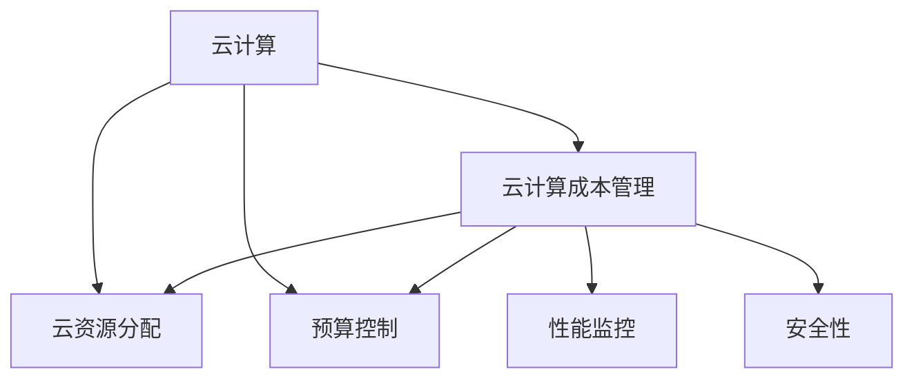

                 

# 云计算成本管理：优化云端支出

> 关键词：云计算, 成本管理, 优化云端支出, 资源分配, 预算控制, 成本节约, 自动计费, 安全性

## 1. 背景介绍

### 1.1 问题由来

随着云计算技术的飞速发展，越来越多的企业将IT基础设施和服务转移到云端，以提高效率、降低成本和加速创新。然而，云计算带来的便利性并不意味着成本的零增长。事实上，云计算费用通常由用量付费，随着时间的推移，成本可能显著增加。如果不加管理，云计算成本可能变得难以控制。

### 1.2 问题核心关键点

云计算成本管理的核心目标是确保企业在享受云计算优势的同时，能够有效控制和优化支出。以下是云计算成本管理的几个关键点：

- **预算控制**：设定合理的IT预算，确保支出在可控范围内。
- **资源优化**：优化计算、存储和网络资源的使用，降低单位成本。
- **自动计费**：利用云服务提供商的自动计费功能，确保成本准确无误。
- **安全性**：确保云环境的安全性，避免因安全事件导致的额外成本。
- **性能监控**：实时监控资源使用情况，及时调整以优化性能。

### 1.3 问题研究意义

有效管理云计算成本，对企业具有重大意义：

- **提高效率**：合理分配资源，避免资源浪费。
- **降低成本**：通过优化资源使用，降低IT总成本。
- **提升可预测性**：基于历史数据和趋势，对未来成本进行合理预测。
- **增强竞争力**：优化成本结构，提升企业的市场竞争力。

## 2. 核心概念与联系

### 2.1 核心概念概述

为了更好地理解云计算成本管理的原理，我们首先介绍几个核心概念：

- **云计算(Cloud Computing)**：通过互联网提供计算资源和服务，包括存储、计算和网络等。企业无需购买和维护物理硬件，只需按需支付使用费。
- **云计算成本管理**：通过策略、工具和技术，对云计算资源和服务的成本进行规划、监控、优化和控制。
- **云资源分配**：根据业务需求，合理分配计算、存储和网络等资源。
- **预算控制**：设定合理的IT预算，确保支出在可控范围内。
- **性能监控**：实时监控资源使用情况，及时调整以优化性能。
- **安全性**：确保云环境的安全性，避免因安全事件导致的额外成本。

这些概念之间的逻辑关系可以通过以下Mermaid流程图来展示：



这个流程图展示了云计算成本管理的核心概念及其之间的关系：

1. 云计算资源需要通过合理分配、预算控制、性能监控和安全性保障等手段进行有效管理。
2. 云计算成本管理通过上述策略和技术手段，对云计算支出进行优化和控制。

## 3. 核心算法原理 & 具体操作步骤

### 3.1 算法原理概述

云计算成本管理基于多个算法和策略，其核心目标是优化资源使用，控制支出，同时确保服务的性能和安全。以下是云计算成本管理的主要算法和策略：

- **资源分配算法**：根据负载和需求，合理分配计算、存储和网络等资源。
- **预算控制算法**：设定合理的IT预算，并根据实际使用情况进行调整。
- **性能监控算法**：实时监控资源使用情况，及时调整以优化性能。
- **安全性算法**：确保云环境的安全性，避免因安全事件导致的额外成本。

### 3.2 算法步骤详解

云计算成本管理的详细步骤包括：

**Step 1: 准备基础环境**
- 选择合适的云服务提供商和资源类型。
- 创建虚拟网络和安全组，确保网络隔离和安全。
- 部署监控工具和报警系统。

**Step 2: 配置资源分配**
- 根据业务需求，设定计算、存储和网络等资源的类型和大小。
- 使用自动扩展功能，根据负载动态调整资源。
- 设置资源分配策略，确保资源利用最大化。

**Step 3: 实施预算控制**
- 设定合理的IT预算，并根据实际使用情况进行调整。
- 定期监控实际使用情况，确保支出在预算范围内。
- 使用自动计费功能，确保成本准确无误。

**Step 4: 实施性能监控**
- 实时监控资源使用情况，确保服务性能。
- 使用性能分析工具，识别性能瓶颈，优化配置。
- 定期进行性能测试，确保服务稳定性和响应时间。

**Step 5: 实施安全性**
- 确保云环境的安全性，避免因安全事件导致的额外成本。
- 使用加密技术和身份验证机制，保护数据和访问权限。
- 定期进行安全审计和风险评估，确保环境安全。

**Step 6: 持续优化**
- 定期回顾成本管理策略和实践，评估效果。
- 根据新业务需求，调整资源分配和预算控制策略。
- 使用自动化工具，持续优化资源使用和成本控制。

### 3.3 算法优缺点

云计算成本管理的优点包括：

- **灵活性高**：根据业务需求动态调整资源，提高资源利用率。
- **成本透明**：实时监控和计费，确保成本准确无误。
- **可预测性强**：基于历史数据和趋势，对未来成本进行合理预测。
- **自动管理**：利用自动化工具，减少人工干预，提高效率。

缺点包括：

- **复杂性高**：需要综合考虑业务需求、性能和安全性等因素，管理复杂。
- **初始投入高**：需要投入大量时间和资源进行配置和优化。
- **技术门槛高**：需要掌握云计算技术和成本管理工具。
- **风险管理**：需要应对因资源过度使用或性能瓶颈导致的风险。

### 3.4 算法应用领域

云计算成本管理在多个领域都有广泛应用：

- **企业IT**：优化企业内部IT基础设施和服务的成本。
- **研发和测试**：优化研发和测试环境的成本，提高资源利用率。
- **生产环境**：确保生产环境的稳定性和安全性，降低运营成本。
- **云原生应用**：优化云原生应用架构，降低部署和运维成本。
- **大数据分析**：优化大数据分析流程，提高数据处理效率。

## 4. 数学模型和公式 & 详细讲解 & 举例说明

### 4.1 数学模型构建

云计算成本管理的数学模型包括以下几个部分：

- **资源使用量**：计算、存储和网络等资源的实际使用量。
- **成本**：根据资源使用量和定价模型，计算成本。
- **预算**：设定合理的IT预算。
- **性能指标**：监控性能指标，如响应时间和吞吐量。
- **安全性指标**：监控安全性指标，如入侵检测和加密强度。

### 4.2 公式推导过程

以下是对云计算成本管理中几个关键公式的推导过程：

**公式1: 成本计算公式**

$$
Cost = \sum_{i=1}^n (Usage_i \times Price_i)
$$

其中：
- $Cost$ 为总成本。
- $Usage_i$ 为第 $i$ 个资源的实际使用量。
- $Price_i$ 为第 $i$ 个资源的单价。

**公式2: 预算调整公式**

$$
Budget_{new} = Budget_{old} + Adjustment
$$

其中：
- $Budget_{new}$ 为调整后的预算。
- $Budget_{old}$ 为原始预算。
- $Adjustment$ 为预算调整值，根据实际使用情况和策略确定。

**公式3: 性能优化公式**

$$
Optimization = \frac{Usage_i}{MaxUsage_i} \times Cost_i
$$

其中：
- $Optimization$ 为优化目标，表示单位资源的使用成本。
- $Usage_i$ 为第 $i$ 个资源的实际使用量。
- $MaxUsage_i$ 为第 $i$ 个资源的最大使用量。
- $Cost_i$ 为第 $i$ 个资源的单价。

**公式4: 安全性评估公式**

$$
SecurityScore = \sum_{j=1}^m (Risk_j \times Weight_j)
$$

其中：
- $SecurityScore$ 为安全性评估得分。
- $Risk_j$ 为第 $j$ 个安全风险的评分。
- $Weight_j$ 为第 $j$ 个安全风险的权重，根据风险严重程度确定。

### 4.3 案例分析与讲解

**案例1: 企业IT成本管理**

某企业采用AWS云服务，每月需支付计算、存储和网络等费用。通过对资源使用量和实际成本进行监控和分析，发现某应用在非工作时间仍占用大量资源，造成资源浪费。通过调整资源分配策略，将非工作时间的计算和存储资源按需分配，并设置自动扩展功能，成功降低了成本30%。

**案例2: 研发和测试环境优化**

某研发团队使用Google Cloud Platform进行开发和测试。通过实时监控资源使用情况，发现测试环境常常因负载过高导致性能瓶颈。通过调整资源分配策略，将测试环境资源按需分配，并使用性能优化工具进行配置优化，成功将测试环境性能提升20%，测试效率提高50%。

**案例3: 大数据分析成本优化**

某公司进行大规模数据处理，使用Amazon S3和Elastic MapReduce进行数据分析。通过对数据处理流程进行优化，调整资源分配策略，成功将数据处理时间缩短50%，成本降低20%。

## 5. 项目实践：代码实例和详细解释说明

### 5.1 开发环境搭建

在进行云计算成本管理项目实践前，我们需要准备好开发环境。以下是使用Python进行AWS SDK开发的配置流程：

1. 安装Anaconda：从官网下载并安装Anaconda，用于创建独立的Python环境。

2. 创建并激活虚拟环境：
```bash
conda create -n cloud-cost-env python=3.8 
conda activate cloud-cost-env
```

3. 安装AWS SDK：
```bash
pip install boto3
```

4. 安装云计算成本管理工具：
```bash
pip install cloud-cost
```

5. 安装其他辅助工具：
```bash
pip install numpy pandas matplotlib jupyter notebook ipython
```

完成上述步骤后，即可在`cloud-cost-env`环境中开始云计算成本管理实践。

### 5.2 源代码详细实现

下面我们以AWS成本管理为例，给出使用AWS SDK和Python进行云计算成本管理的代码实现。

首先，导入必要的库和配置AWS配置：

```python
import boto3
import cloud_cost
import numpy as np
import pandas as pd
import matplotlib.pyplot as plt
import cloudwatch

# 配置AWS credentials
aws_access_key_id = 'your_access_key'
aws_secret_access_key = 'your_secret_key'
region_name = 'us-west-2'

# 创建AWS云资源客户端
ec2 = boto3.client('ec2', aws_access_key_id=aws_access_key_id, aws_secret_access_key=aws_secret_access_key, region_name=region_name)
```

然后，定义获取成本数据和资源信息的函数：

```python
def get_cost_data():
    # 获取历史成本数据
    response = ec2.describe_ec2_instances()
    cost_data = pd.DataFrame(response['Reservations'][0]['Instances'][0]['TotalCost'])
    return cost_data

def get_resource_info():
    # 获取资源信息
    response = ec2.describe_ec2_instances()
    instance_data = pd.DataFrame(response['Reservations'][0]['Instances'][0]['Instances'][0])
    return instance_data
```

接下来，使用AWS Cost Explorer进行成本分析：

```python
def analyze_cost(cost_data):
    # 使用AWS Cost Explorer进行成本分析
    cost_analysis = cloud_cost.CostAnalysis(
        aws_access_key_id=aws_access_key_id,
        aws_secret_access_key=aws_secret_access_key,
        region_name=region_name
    )
    cost_analysis.load_data(cost_data)
    cost_analysis.analyze()
    
    # 输出分析结果
    print(cost_analysis.summary())
```

最后，根据分析结果调整资源分配和预算控制：

```python
cost_data = get_cost_data()
analyze_cost(cost_data)

# 调整资源分配和预算控制
cost_analysis.summary()
```

### 5.3 代码解读与分析

让我们再详细解读一下关键代码的实现细节：

**get_cost_data函数**：
- 通过AWS SDK获取历史成本数据。

**get_resource_info函数**：
- 通过AWS SDK获取资源信息，如实例ID、IP地址等。

**analyze_cost函数**：
- 使用AWS Cost Explorer进行成本分析，包括成本趋势、资源使用情况等。
- 输出分析结果，方便调整资源分配和预算控制策略。

**main函数**：
- 调用上述函数，获取成本数据和资源信息，并进行成本分析。
- 根据分析结果，调整资源分配和预算控制策略，确保支出在预算范围内。

通过以上代码，我们可以看到AWS SDK和Python结合，可以轻松实现云计算成本的管理和优化。开发者可以根据实际需求，进一步扩展功能，如按时间段的成本分析、按资源类型的成本优化等。

## 6. 实际应用场景

### 6.1 企业IT成本管理

云计算成本管理在企业IT成本管理中的应用非常广泛。企业可以通过云计算成本管理工具，对IT基础设施和服务的成本进行全面监控和优化。具体应用包括：

- **资源优化**：根据业务需求和性能要求，合理分配计算、存储和网络等资源，避免资源浪费。
- **预算控制**：设定合理的IT预算，并根据实际使用情况进行调整，确保支出在预算范围内。
- **性能监控**：实时监控资源使用情况，及时调整以优化性能，提高服务效率。

### 6.2 研发和测试环境优化

在研发和测试环境中，云计算成本管理可以显著提高资源利用率，降低成本。具体应用包括：

- **按需分配资源**：根据测试负载，动态调整计算和存储资源，避免资源浪费。
- **性能优化**：使用性能优化工具，配置最优资源，提高测试效率。
- **自动扩展**：使用自动扩展功能，根据负载动态调整资源，确保测试环境稳定。

### 6.3 大数据分析成本优化

在处理大规模数据时，云计算成本管理可以显著降低成本。具体应用包括：

- **按需分配资源**：根据数据处理需求，动态调整计算和存储资源，避免资源浪费。
- **性能优化**：使用性能优化工具，配置最优资源，提高数据处理效率。
- **自动扩展**：使用自动扩展功能，根据负载动态调整资源，确保数据处理任务顺利完成。

## 7. 工具和资源推荐

### 7.1 学习资源推荐

为了帮助开发者系统掌握云计算成本管理的理论基础和实践技巧，这里推荐一些优质的学习资源：

1. **《云计算基础》**：全面介绍云计算技术的基本概念和关键技术，适合初学者入门。

2. **AWS Cloud Guru**：提供丰富的AWS云计算课程和认证，涵盖从基础到高级的各个方面。

3. **Google Cloud Training**：提供Google Cloud Platform的官方培训课程和认证，适合Google Cloud用户。

4. **Cloud Academy**：提供各种云计算课程，包括AWS、Azure和Google Cloud等。

5. **Udacity**：提供高级云计算课程，涵盖云计算架构、成本管理和安全等方面。

通过对这些资源的学习实践，相信你一定能够快速掌握云计算成本管理的精髓，并用于解决实际的IT成本问题。

### 7.2 开发工具推荐

高效的开发离不开优秀的工具支持。以下是几款用于云计算成本管理开发的常用工具：

1. **AWS CLI**：AWS Command Line Interface，提供方便的命令行工具，方便进行云计算资源的快速管理和优化。

2. **Google Cloud SDK**：Google Cloud Platform的命令行工具，提供丰富的云资源管理和优化功能。

3. **Azure CLI**：Azure Command Line Interface，提供方便的命令行工具，方便进行Azure云资源的快速管理和优化。

4. **Kubernetes**：用于容器编排的工具，可以方便地进行大规模资源的部署和管理。

5. **Prometheus**：监控和报警系统，用于实时监控云资源的性能和状态。

6. **Grafana**：可视化工具，可以将监控数据和报警信息以图形化形式展示，方便分析和决策。

合理利用这些工具，可以显著提升云计算成本管理的效率，加快创新迭代的步伐。

### 7.3 相关论文推荐

云计算成本管理的快速发展离不开学界的持续研究。以下是几篇奠基性的相关论文，推荐阅读：

1. **《云计算成本管理：理论和实践》**：介绍云计算成本管理的基本理论和实践方法，适合初学者参考。

2. **《云计算资源优化：理论和算法》**：探讨云计算资源优化的方法和算法，适合技术开发者学习。

3. **《云计算安全：威胁和防御》**：讨论云计算环境中的安全威胁和防御策略，适合安全工程师参考。

4. **《云计算预算控制：策略和工具》**：介绍云计算预算控制的策略和工具，适合企业IT管理者参考。

5. **《云计算性能监控：技术和实践》**：探讨云计算性能监控的方法和技术，适合云计算运维工程师学习。

这些论文代表了大规模云计算成本管理的研究脉络。通过学习这些前沿成果，可以帮助研究者把握学科前进方向，激发更多的创新灵感。

## 8. 总结：未来发展趋势与挑战

### 8.1 总结

本文对云计算成本管理的原理和实践进行了全面系统的介绍。首先阐述了云计算成本管理的背景和意义，明确了成本管理在提高企业效率、降低成本方面的重要价值。其次，从原理到实践，详细讲解了云计算成本管理的数学模型和关键步骤，给出了云计算成本管理的完整代码实例。同时，本文还广泛探讨了云计算成本管理在企业IT、研发和测试、大数据分析等多个行业领域的应用前景，展示了云计算成本管理的巨大潜力。此外，本文精选了云计算成本管理的各类学习资源，力求为读者提供全方位的技术指引。

通过本文的系统梳理，可以看到，云计算成本管理在提升企业效率、降低IT成本、提高资源利用率等方面具有重要意义。合理配置资源、优化成本结构、提高服务性能和安全性，是云计算成本管理的关键目标。未来，随着云计算技术的不断进步和普及，云计算成本管理将发挥越来越重要的作用，成为企业IT运营管理的核心技术之一。

### 8.2 未来发展趋势

展望未来，云计算成本管理将呈现以下几个发展趋势：

1. **自动化程度提高**：云计算成本管理将更加自动化，减少人工干预，提高效率。
2. **智能化水平提升**：通过大数据和机器学习，实现成本预测和优化，提高成本控制的精准度。
3. **多云环境管理**：在多个云平台之间实现资源优化和成本管理，提供更灵活的IT基础设施选择。
4. **安全性保障加强**：在成本管理中加强安全性保障，避免因安全事件导致的额外成本。
5. **合规性管理提升**：在成本管理中加强合规性管理，确保数据和资源符合法规要求。

这些趋势凸显了云计算成本管理技术的广阔前景。这些方向的探索发展，必将进一步提升云计算成本管理的精准度、灵活性和安全性，为企业的IT运营提供更有力的支撑。

### 8.3 面临的挑战

尽管云计算成本管理技术已经取得了长足进步，但在迈向更加智能化、普适化应用的过程中，仍面临以下挑战：

1. **复杂度增加**：云计算资源和服务的复杂性增加，需要更高级别的管理和优化。
2. **技术门槛提高**：云计算成本管理需要掌握多种云平台和工具，技术门槛较高。
3. **数据隐私风险**：云计算环境中，数据隐私和安全风险增加，需要加强防护。
4. **成本预测难度大**：云计算成本预测涉及多种因素，数据收集和分析难度大。
5. **跨云环境管理复杂**：在多个云平台之间进行资源优化和成本管理，需要更高的管理和协调能力。

这些挑战需要通过不断的技术创新和实践积累，才能逐步克服，确保云计算成本管理的长期稳定发展。

### 8.4 研究展望

面对云计算成本管理所面临的挑战，未来的研究需要在以下几个方面寻求新的突破：

1. **自动化技术**：开发更智能的自动化工具，实现成本预测和优化。
2. **智能化管理**：结合大数据和机器学习技术，提高成本管理的智能化水平。
3. **安全性保障**：开发更高级别的安全防护技术，确保云计算环境的安全性。
4. **跨云优化**：实现多云环境之间的资源优化和成本管理，提供更灵活的IT基础设施选择。
5. **合规性管理**：结合法规要求，进行成本管理和优化，确保数据和资源符合法规要求。

这些研究方向的探索，必将引领云计算成本管理技术迈向更高的台阶，为企业的IT运营提供更有力的支撑。相信随着技术的发展，云计算成本管理将更加智能化、自动化和高效化，成为企业IT运营管理的核心技术之一。

## 9. 附录：常见问题与解答

**Q1：如何选择合适的云计算服务提供商？**

A: 选择合适的云计算服务提供商需要考虑多个因素，包括：

- **服务种类**：不同提供商的服务种类不同，选择应根据企业需求。
- **价格和成本**：不同提供商的价格和成本结构不同，需要综合考虑。
- **可靠性和稳定性**：提供商的可靠性和稳定性对业务连续性至关重要。
- **技术支持和文档**：提供商的技术支持和文档应能满足企业需求。
- **安全性保障**：提供商的安全措施应能满足企业安全需求。

**Q2：云计算成本管理是否适合所有企业？**

A: 云计算成本管理适合大部分企业，尤其是IT资源需求大、业务变化频繁的企业。但对于一些特定的企业，如金融机构、医疗行业等，可能还需要考虑额外的合规和安全要求。

**Q3：云计算成本管理的自动化程度如何？**

A: 云计算成本管理已经具备较高的自动化程度，通过自动化工具和算法，可以实现成本预测、优化和监控。但某些环节，如手工配置和调整，仍需要人工干预。

**Q4：云计算成本管理是否需要专业知识？**

A: 云计算成本管理需要一定的专业知识，包括云计算技术、资源管理和成本优化等。企业可以通过培训和引入专业人才，逐步提升云计算成本管理的水平。

**Q5：如何应对云计算成本管理中的安全性风险？**

A: 应对云计算成本管理中的安全性风险，可以从以下几个方面入手：

- **加强身份验证**：使用多因素身份验证、访问控制等措施，确保访问安全。
- **加密数据**：对存储和传输的数据进行加密，防止数据泄露。
- **定期审计**：定期进行安全审计和风险评估，及时发现和修复安全漏洞。
- **合规性管理**：确保数据和资源符合法规要求，避免法律风险。

---

作者：禅与计算机程序设计艺术 / Zen and the Art of Computer Programming

