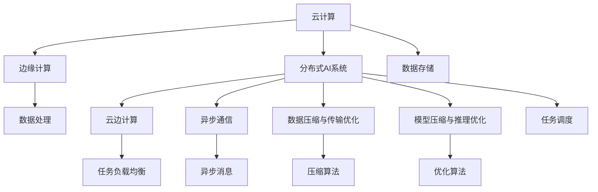

                 

# 云边协同计算：优化分布式AI系统性能

> 关键词：分布式AI系统, 云边计算, 协同计算, 性能优化, 深度学习, 云计算, 边缘计算, 数据传输, 模型压缩, 异步通信, 计算资源

## 1. 背景介绍

### 1.1 问题由来
近年来，人工智能(AI)和深度学习(Deep Learning)技术在工业界和学术界取得了巨大成功，推动了从自动驾驶、医疗影像分析到自然语言处理(NLP)等诸多领域的突破。然而，随着模型规模的不断增大，传统集中式训练和推理架构面临计算资源和数据存储的双重挑战。分布式计算成为了当前AI系统中不可或缺的组成部分。

分布式AI系统通过将任务分解为多个子任务，在多个计算节点上并行计算，从而大幅提升了模型训练和推理的效率。但在实际部署中，由于云计算中心和边缘设备之间的网络延迟、带宽限制等因素，分布式AI系统面临着性能瓶颈。如何有效利用云计算与边缘计算的优势，实现云边协同，成为提升分布式AI系统性能的关键问题。

### 1.2 问题核心关键点
云边协同计算通过将AI任务在云和边缘设备之间进行合理分配和协同计算，优化了数据传输和计算资源的使用，减少了延迟，提升了整体性能。云边协同的核心在于：
- **计算负载均衡**：将数据传输和计算负载均衡分布在云和边缘设备之间，避免单点瓶颈。
- **数据本地化**：将数据尽可能地在边缘设备上进行本地处理，减少网络传输开销。
- **异步通信与协作**：通过异步通信和任务调度，实现各节点之间的紧密协作。

## 2. 核心概念与联系

### 2.1 核心概念概述

为更好地理解云边协同计算，本节将介绍几个密切相关的核心概念：

- **云计算**：基于互联网的计算服务，提供强大的计算资源和存储能力，支持各种规模的应用场景。
- **边缘计算**：在接近数据源的本地设备上进行计算，以降低延迟和网络带宽消耗，提升响应速度和数据处理效率。
- **分布式AI系统**：将AI任务在多个计算节点上并行处理，通过网络协同合作，提升计算效率和模型性能。
- **云边计算**：结合云计算和边缘计算的优势，在云和边缘设备之间进行任务负载均衡和数据本地化处理。
- **异步通信**：在分布式系统中，节点之间通过消息传递进行通信，允许异步数据交换和任务调度。
- **数据压缩与传输优化**：通过压缩和传输优化技术，降低网络带宽需求，提升数据传输效率。
- **模型压缩与推理优化**：通过压缩和优化推理算法，减少计算量和内存占用，提升推理速度。

这些核心概念之间的逻辑关系可以通过以下Mermaid流程图来展示：



这个流程图展示了云边协同计算的核心概念及其之间的关系：

1. 云计算和边缘计算结合，构成云边计算的基础。
2. 分布式AI系统通过任务并行处理，实现高性能计算。
3. 异步通信和任务调度，保障系统的高效协作。
4. 数据压缩与传输优化，提升数据处理效率。
5. 模型压缩与推理优化，提升推理速度和计算效率。

这些概念共同构成了云边协同计算的理论框架，为优化分布式AI系统的性能提供了理论指导。

## 3. 核心算法原理 & 具体操作步骤
### 3.1 算法原理概述

云边协同计算的算法原理基于分布式计算和并行计算的基本思想，旨在通过合理分配任务负载和数据处理，最大化利用云计算和边缘计算的资源，从而提升系统性能。

核心步骤如下：

1. **数据划分与本地化**：将数据划分为多个子数据集，根据本地设备存储能力和计算能力，将部分数据本地化处理。
2. **任务负载均衡**：通过任务调度算法，将计算负载均衡分配到云计算和边缘计算设备上。
3. **异步通信与协作**：各节点通过异步消息传递，实现任务协作和状态同步。
4. **数据压缩与传输优化**：采用数据压缩和传输优化技术，减少网络带宽需求。
5. **模型压缩与推理优化**：通过模型压缩和推理算法优化，减少计算量和内存占用。

### 3.2 算法步骤详解

基于上述原理，云边协同计算的具体步骤包括以下几个关键环节：

**Step 1: 数据划分与本地化**

- **数据划分子步骤**：
  1. **数据预处理**：对原始数据进行归一化、特征工程等预处理操作。
  2. **数据分割**：将数据集分割成多个子数据集，每个子数据集大小相同或接近。
  3. **本地化选择**：根据本地设备存储能力和计算能力，选择部分子数据集进行本地化处理，其余子数据集上传到云中心。

- **本地化操作**：
  1. **数据预处理**：在本地设备上对本地化数据进行预处理。
  2. **模型训练/推理**：在本地设备上使用预训练模型对本地化数据进行训练或推理。
  3. **模型备份**：将本地模型备份到云端，以便后续恢复或更新。

**Step 2: 任务负载均衡**

- **任务调度**：
  1. **任务划分**：将每个数据集划分成多个子任务，如特征提取、模型训练、模型评估等。
  2. **任务分配**：根据任务类型和数据规模，将任务分配到云计算和边缘计算设备上。
  3. **负载均衡**：通过任务调度算法，均衡各个设备的任务负载。

**Step 3: 异步通信与协作**

- **通信机制**：
  1. **消息传递**：各节点通过消息传递协议进行通信，如消息队列、分布式通信框架等。
  2. **状态同步**：使用一致性哈希、Paxos算法等机制，实现各节点状态的一致性和同步。

**Step 4: 数据压缩与传输优化**

- **压缩算法**：
  1. **数据压缩**：采用无损或无损压缩算法（如LZ77、LZ78、LZW、DEFLATE等）对数据进行压缩。
  2. **压缩效果评估**：评估压缩后的数据传输效率和解压后的数据完整性。

**Step 5: 模型压缩与推理优化**

- **模型压缩**：
  1. **模型剪枝**：删除模型中不必要的参数和连接，减少模型大小。
  2. **量化压缩**：将浮点数参数转换为低精度整数或定点数，减少内存占用。
  3. **蒸馏压缩**：使用知识蒸馏技术，将大型模型的知识迁移到小型模型中，减少模型大小。

- **推理优化**：
  1. **推理加速**：使用高效的推理算法（如NNPACK、MKL等）加速模型推理。
  2. **内存优化**：采用数据结构优化、内存池化等技术，减少内存占用。

### 3.3 算法优缺点

云边协同计算的优点包括：
1. **资源优化**：充分利用云计算和边缘计算的资源，减少资源浪费。
2. **延迟减少**：通过数据本地化和异步通信，减少数据传输和任务切换的延迟。
3. **扩展性良好**：可以动态调整设备和任务负载，适应不同规模的任务需求。

但同时，该方法也存在一定的局限性：
1. **网络延迟**：云和边缘设备之间的网络延迟可能影响任务协同效率。
2. **数据不一致**：多个设备同时处理同一数据集时，可能导致数据不一致。
3. **管理复杂**：需要综合管理云计算和边缘计算资源，管理复杂度增加。
4. **数据隐私和安全**：数据在传输和存储过程中，可能面临隐私泄露和安全性问题。

尽管存在这些局限性，但就目前而言，云边协同计算仍然是最为高效和可行的分布式计算解决方案，具有广泛的应用前景。

### 3.4 算法应用领域

云边协同计算已经在诸多领域得到了广泛的应用，例如：

- **自动驾驶**：通过边缘设备实时处理传感器数据，减少网络延迟，提升车辆控制精度和反应速度。
- **医疗影像分析**：在边缘设备上进行初步数据处理，减少数据传输，提升影像分析速度和效率。
- **物联网设备管理**：通过边缘计算设备进行数据预处理和本地化处理，减少网络带宽消耗，提升设备管理效率。
- **工业物联网**：在工厂设备和云端之间进行数据协同计算，提升生产效率和设备监测精度。
- **智能城市**：通过边缘设备处理实时数据，减少延迟，提升城市管理效率和应急响应速度。

除了上述这些经典应用外，云边协同计算还被创新性地应用到更多场景中，如智能家居、智慧零售、智慧物流等，为各行各业带来了新的技术突破。随着云计算和边缘计算技术的持续发展，相信云边协同计算的应用将不断扩展，进一步推动智能化进程。

## 4. 数学模型和公式 & 详细讲解  
### 4.1 数学模型构建

基于上述云边协同计算的原理，我们可以使用数学模型来进一步刻画其工作机制。

假设共有 $N$ 个设备，每个设备处理的数据子集大小为 $D$。设任务划分后的子任务总数为 $T$，每个子任务处理的数据子集大小为 $S$。定义任务负载均衡因子 $\alpha$，表示每个设备分配的任务负载比例。

- **数据负载均衡**：每个设备处理的数据子集大小为 $D$，则总数据量为 $N \times D$。
- **任务负载均衡**：每个设备处理的任务数量为 $T \times S$，则总任务数量为 $N \times T \times S$。
- **任务负载均衡因子**：每个设备处理的任务负载比例为 $\alpha$，则总任务负载比例为 $N \times \alpha$。

数学模型为：

$$
N \times D = N \times T \times S \times \alpha
$$

### 4.2 公式推导过程

- **数据负载均衡推导**：
  $$
  D = T \times S
  $$

- **任务负载均衡推导**：
  $$
  \alpha = \frac{N \times D}{N \times T \times S}
  $$

### 4.3 案例分析与讲解

以医疗影像分析任务为例，解释云边协同计算的应用场景。

**案例描述**：
假设某医院需要将患者的医学影像数据进行分析，以辅助医生诊断。该医院有10个医疗设备，每个设备处理的数据子集大小为1TB。医院决定将任务划分为10个子任务，每个子任务处理的数据子集大小为1GB。

**计算过程**：
- **数据负载均衡**：
  $$
  N \times D = 10 \times 1TB = 10 \times 1024GB
  $$
- **任务负载均衡**：
  $$
  N \times T \times S = 10 \times 10 \times 1GB = 1000GB
  $$
- **任务负载均衡因子**：
  $$
  \alpha = \frac{N \times D}{N \times T \times S} = \frac{10 \times 1TB}{10 \times 10 \times 1GB} = 0.1
  $$

**结果分析**：
- **数据负载均衡**：每个设备处理的数据子集大小为1TB，确保了数据处理的效率和效果。
- **任务负载均衡**：每个设备处理的任务数量为10个，保证了任务的并行处理能力。
- **任务负载均衡因子**：每个设备处理的任务负载比例为0.1，即每个设备处理的数据和任务负载相对均衡。

通过这个案例可以看出，云边协同计算能够有效利用分布式计算资源，提升数据处理效率和任务协同能力。

## 5. 项目实践：代码实例和详细解释说明
### 5.1 开发环境搭建

在进行云边协同计算的实践前，我们需要准备好开发环境。以下是使用Python进行TensorFlow和TensorFlow Lite开发的环境配置流程：

1. 安装Anaconda：从官网下载并安装Anaconda，用于创建独立的Python环境。

2. 创建并激活虚拟环境：
```bash
conda create -n cloud_edge python=3.8 
conda activate cloud_edge
```

3. 安装TensorFlow：根据CUDA版本，从官网获取对应的安装命令。例如：
```bash
conda install tensorflow tensorflow-gpu=2.8.0
```

4. 安装TensorFlow Lite：
```bash
pip install tensorflow-lite-nightly
```

5. 安装各类工具包：
```bash
pip install numpy pandas scikit-learn matplotlib tqdm jupyter notebook ipython
```

完成上述步骤后，即可在`cloud_edge-env`环境中开始云边协同计算的实践。

### 5.2 源代码详细实现

下面以医疗影像分析任务为例，给出使用TensorFlow和TensorFlow Lite对模型进行云边协同计算的Python代码实现。

首先，定义数据处理函数：

```python
import tensorflow as tf
import tensorflow_lite as tflite

def load_data(filename):
    # 加载数据
    # ...

def preprocess_data(data):
    # 预处理数据
    # ...

def split_data(data, num_devices):
    # 数据划分
    # ...

def save_data(data, filename):
    # 保存数据
    # ...
```

然后，定义模型和推理函数：

```python
def build_model():
    # 构建模型
    # ...

def save_model(model, filename):
    # 保存模型
    # ...

def load_model(filename):
    # 加载模型
    # ...

def run_inference(model, data):
    # 推理过程
    # ...

def run_distributed_inference(models, devices, data):
    # 分布式推理
    # ...
```

接着，定义云边协同计算的流程：

```python
def cloud_edge_computing(filename, num_devices):
    # 数据加载
    data = load_data(filename)

    # 数据预处理
    data = preprocess_data(data)

    # 数据划分
    split_data(data, num_devices)

    # 本地处理
    local_data = split_data(data, num_devices)

    # 模型构建和加载
    model = build_model()
    local_models = [save_model(model) for _ in range(num_devices)]

    # 本地推理
    local_outputs = [run_inference(model, data) for data in local_data]

    # 云中心处理
    cloud_model = save_model(model)
    cloud_outputs = run_inference(cloud_model, data)

    # 数据汇总
    outputs = local_outputs + cloud_outputs

    # 结果输出
    return outputs
```

最后，启动云边协同计算流程：

```python
outputs = cloud_edge_computing('data_file.txt', 10)
```

以上就是使用TensorFlow和TensorFlow Lite对医疗影像分析任务进行云边协同计算的完整代码实现。可以看到，TensorFlow和TensorFlow Lite提供了强大的分布式计算和模型优化能力，使得云边协同计算的实现变得简单高效。

### 5.3 代码解读与分析

让我们再详细解读一下关键代码的实现细节：

**load_data函数**：
- 加载数据：根据文件路径，使用TensorFlow和TensorFlow Lite提供的API加载数据。
- 数据格式：支持各种数据格式，如TensorFlow数据集、CSV文件、图像文件等。

**preprocess_data函数**：
- 数据预处理：进行归一化、数据增强等预处理操作，提升模型性能。

**split_data函数**：
- 数据划分：根据设备数量和数据规模，将数据集划分为多个子数据集，确保数据负载均衡。

**save_data函数**：
- 数据保存：将数据集保存到本地文件或云存储中，以便后续使用。

**build_model函数**：
- 模型构建：使用TensorFlow和TensorFlow Lite构建深度学习模型，支持各种模型结构和优化策略。

**save_model函数**：
- 模型保存：将模型保存到本地文件或云存储中，便于后续加载和使用。

**load_model函数**：
- 模型加载：从本地文件或云存储中加载模型，以便进行推理。

**run_inference函数**：
- 推理过程：使用TensorFlow Lite在本地设备上进行模型推理，支持异步推理和多线程计算。

**run_distributed_inference函数**：
- 分布式推理：使用TensorFlow Lite和TensorFlow在本地设备和云中心同时进行推理，确保任务负载均衡。

**cloud_edge_computing函数**：
- 云边协同计算：将数据加载、预处理、本地处理、云中心处理和结果输出有机结合，实现云边协同计算。

通过这些函数，我们可以将复杂的云边协同计算过程分解为多个模块，每个模块专注于特定的任务，最终实现高效、可靠的云边协同计算。

## 6. 实际应用场景
### 6.1 智能医疗

在智能医疗领域，云边协同计算可以应用于医疗影像分析、病历管理、智能诊断等多个环节。通过将医疗影像数据分布式处理，能够在边缘设备上进行初步数据处理和本地推理，减少数据传输延迟，提升医疗影像分析的速度和精度。

具体而言，可以构建一个基于云边协同计算的医疗影像分析系统，将病人的医学影像数据在本地设备上进行预处理和初步分析，然后再上传到云中心进行深度学习模型的训练和推理。这样不仅能够快速响应医生和患者的查询请求，还能有效保护病人的隐私数据。

### 6.2 智能制造

在智能制造领域，云边协同计算可以应用于生产监控、设备维护、质量控制等多个环节。通过将生产数据和设备状态分布式处理，能够在边缘设备上进行实时数据处理和本地推理，减少数据传输延迟，提升生产效率和设备维护精度。

具体而言，可以构建一个基于云边协同计算的智能制造系统，将生产设备的传感器数据在本地设备上进行预处理和初步分析，然后再上传到云中心进行深度学习模型的训练和推理。这样不仅能够实时监控生产过程，还能快速响应设备故障，提升生产效率和设备维护精度。

### 6.3 智慧城市

在智慧城市领域，云边协同计算可以应用于城市交通管理、智能安防、环境监测等多个环节。通过将城市数据和传感器数据分布式处理，能够在边缘设备上进行实时数据处理和本地推理，减少数据传输延迟，提升城市管理效率和应急响应速度。

具体而言，可以构建一个基于云边协同计算的智慧城市系统，将城市交通流量数据、视频监控数据和环境监测数据在本地设备上进行预处理和初步分析，然后再上传到云中心进行深度学习模型的训练和推理。这样不仅能够实时监控城市运行状况，还能快速响应突发事件，提升城市管理效率和应急响应速度。

### 6.4 未来应用展望

随着云计算和边缘计算技术的不断进步，云边协同计算将在更多领域得到应用，为各行各业带来新的技术突破。

在智慧医疗领域，基于云边协同计算的医疗影像分析、病历管理、智能诊断等应用，将进一步提升医疗服务的智能化水平，辅助医生诊疗，加速新药开发进程。

在智能制造领域，基于云边协同计算的生产监控、设备维护、质量控制等应用，将提升生产效率和设备维护精度，加速制造业的数字化转型。

在智慧城市领域，基于云边协同计算的城市交通管理、智能安防、环境监测等应用，将提升城市管理的自动化和智能化水平，构建更安全、高效的未来城市。

除了上述这些经典应用外，云边协同计算还被创新性地应用到更多场景中，如智能家居、智慧零售、智慧物流等，为各行各业带来新的技术突破。相信随着技术的持续发展，云边协同计算的应用将不断扩展，进一步推动智能化进程。

## 7. 工具和资源推荐
### 7.1 学习资源推荐

为了帮助开发者系统掌握云边协同计算的理论基础和实践技巧，这里推荐一些优质的学习资源：

1. 《Distributed Systems: Concepts and Design》书籍：计算机科学领域的经典教材，深入浅出地介绍了分布式系统的基本概念和设计原理。
2. TensorFlow官方文档：提供了详尽的TensorFlow和TensorFlow Lite文档，涵盖了分布式计算、模型优化、性能调优等多个方面。
3. TensorFlow Lite官方文档：提供了TensorFlow Lite的完整文档，包括模型构建、推理加速、模型压缩等多个功能。
4. 《TensorFlow》书籍：TensorFlow的官方教程和实战指南，涵盖从入门到进阶的多个方面。
5. 《Distributed TensorFlow》书籍：介绍TensorFlow在分布式环境中的使用和优化方法，帮助开发者高效构建分布式系统。

通过对这些资源的学习实践，相信你一定能够快速掌握云边协同计算的理论基础和实践技巧，并用于解决实际的AI系统性能问题。

### 7.2 开发工具推荐

高效的开发离不开优秀的工具支持。以下是几款用于云边协同计算开发的常用工具：

1. TensorFlow：基于Python的开源深度学习框架，灵活动态的计算图，支持多种分布式计算模型。
2. TensorFlow Lite：用于移动设备和嵌入式设备的高效推理框架，支持模型压缩和优化。
3. Kubernetes：开源容器编排系统，支持大规模分布式计算任务的编排和管理。
4. Google Cloud Platform：提供强大的云计算资源和容器服务，支持云边协同计算的部署和优化。
5. NGINX：高性能网络代理服务器，支持负载均衡和数据传输优化。

合理利用这些工具，可以显著提升云边协同计算的开发效率，加快创新迭代的步伐。

### 7.3 相关论文推荐

云边协同计算的研究源于学界的持续研究。以下是几篇奠基性的相关论文，推荐阅读：

1. "Distributed Systems: Concepts and Design"（《分布式系统：概念与设计》）：计算机科学领域的经典教材，深入浅出地介绍了分布式系统的基本概念和设计原理。
2. "MapReduce: Simplified Data Processing on Large Clusters"（《MapReduce: Simplified Data Processing on Large Clusters》）：Google的研究论文，首次提出了MapReduce分布式计算模型，并应用于大规模数据处理。
3. "TensorFlow: A System for Large-Scale Machine Learning"（《TensorFlow：大规模机器学习的系统》）：Google的研究论文，介绍了TensorFlow的基本架构和分布式计算方法。
4. "TensorFlow Lite: A Compilation Toolchain for Deploying ML Models on Edge Devices"（《TensorFlow Lite：为在边缘设备上部署ML模型而构建的编译工具链》）：Google的研究论文，介绍了TensorFlow Lite的基本架构和优化方法。
5. "Distributed TensorFlow: Communication Optimization in a Cluster of Tensors"（《Distributed TensorFlow：分布式集群中的张量通信优化》）：Google的研究论文，介绍了TensorFlow在分布式环境中的使用和优化方法。

这些论文代表了大规模分布式计算和模型优化技术的发展脉络。通过学习这些前沿成果，可以帮助研究者把握学科前进方向，激发更多的创新灵感。

## 8. 总结：未来发展趋势与挑战
### 8.1 总结

本文对云边协同计算进行了全面系统的介绍。首先阐述了云计算和边缘计算结合的理论基础和应用价值，明确了云边协同计算在提升分布式AI系统性能方面的独特价值。其次，从原理到实践，详细讲解了云边协同计算的数学模型和关键步骤，给出了云边协同计算任务开发的完整代码实例。同时，本文还广泛探讨了云边协同计算在智能医疗、智能制造、智慧城市等多个领域的应用前景，展示了云边协同计算的广阔前景。

通过本文的系统梳理，可以看到，云边协同计算通过合理分配任务负载和数据处理，最大化利用云计算和边缘计算的资源，提升了数据处理效率和任务协同能力。未来，伴随云计算和边缘计算技术的持续发展，云边协同计算将进一步拓展其应用范围，成为分布式AI系统中不可或缺的组成部分。

### 8.2 未来发展趋势

展望未来，云边协同计算将呈现以下几个发展趋势：

1. **资源优化**：利用云计算和边缘计算的互补优势，实现更高效的资源管理和任务调度。
2. **延迟减少**：通过数据本地化和异步通信，进一步减少数据传输延迟，提升系统响应速度。
3. **扩展性增强**：支持动态调整设备和任务负载，适应不同规模的任务需求。
4. **安全性提升**：引入数据加密、访问控制等技术，保障数据安全和隐私。
5. **可靠性保障**：设计冗余和容错机制，确保系统在网络中断等异常情况下的可靠性。
6. **系统融合**：与物联网、大数据、人工智能等多个技术领域进行深度融合，推动智能系统的全面升级。

这些趋势凸显了云边协同计算在分布式AI系统中的重要地位。这些方向的探索发展，必将进一步提升分布式AI系统的性能和可靠性，为各行业的数字化转型提供有力支撑。

### 8.3 面临的挑战

尽管云边协同计算技术已经取得了显著进展，但在迈向更加智能化、普适化应用的过程中，仍面临诸多挑战：

1. **数据一致性**：多个设备同时处理同一数据集时，可能导致数据不一致，影响系统的协同效率。
2. **网络延迟**：云和边缘设备之间的网络延迟可能影响任务协同效率，尤其是在高并发场景下。
3. **管理复杂度**：需要综合管理云计算和边缘计算资源，管理复杂度增加。
4. **数据隐私和安全**：数据在传输和存储过程中，可能面临隐私泄露和安全性问题，需要引入数据加密和访问控制技术。
5. **性能优化**：如何进一步优化数据传输和计算负载均衡，提升系统性能，仍需深入研究。

尽管存在这些挑战，但云边协同计算在理论和实践上都已经取得了重要突破，为分布式AI系统性能的提升提供了有力保障。相信随着技术的持续进步和应用实践的积累，云边协同计算将进一步突破现有瓶颈，发挥更大的潜力。

### 8.4 研究展望

面向未来，云边协同计算的研究需要在以下几个方面寻求新的突破：

1. **数据一致性优化**：引入一致性哈希、Paxos算法等机制，确保数据一致性和任务协同效率。
2. **网络延迟优化**：引入数据缓存、预处理等技术，减少数据传输延迟。
3. **管理复杂度降低**：引入自动调度和弹性伸缩技术，简化管理复杂度。
4. **安全性提升**：引入数据加密、访问控制等技术，保障数据安全和隐私。
5. **性能优化**：引入优化算法和模型压缩技术，进一步提升系统性能。

这些研究方向的研究突破，将使云边协同计算技术更加成熟和可靠，为分布式AI系统性能的提升提供更坚实的保障。面向未来，云边协同计算技术必将在更多的应用场景中发挥重要作用，推动各行业的数字化转型。

## 9. 附录：常见问题与解答

**Q1：云边协同计算如何保证数据一致性？**

A: 云边协同计算通过一致性哈希和Paxos算法等机制，确保数据一致性和任务协同效率。具体来说，一致性哈希将数据分片映射到多个节点，确保数据一致性；Paxos算法用于共识协议，确保节点间的状态同步和任务协同。

**Q2：云边协同计算如何降低网络延迟？**

A: 云边协同计算通过数据本地化和异步通信等技术，减少数据传输延迟。具体来说，将数据本地化处理，减少网络带宽消耗；使用异步消息传递，减少任务切换和通信延迟。

**Q3：云边协同计算如何保障数据安全？**

A: 云边协同计算通过数据加密、访问控制等技术，保障数据安全和隐私。具体来说，使用AES、RSA等加密算法对数据进行加密，防止数据泄露；采用RBAC、ABAC等访问控制机制，限制数据的访问权限，防止未授权访问。

**Q4：云边协同计算如何提升性能？**

A: 云边协同计算通过优化数据传输、任务负载均衡、模型压缩等技术，提升系统性能。具体来说，使用数据压缩和传输优化技术，减少网络带宽需求；通过任务调度算法，均衡各节点的任务负载；使用模型压缩和优化算法，减少计算量和内存占用，提升推理速度。

**Q5：云边协同计算有哪些典型应用？**

A: 云边协同计算已经在诸多领域得到了广泛的应用，包括医疗影像分析、智能制造、智慧城市等。具体来说，可以构建基于云边协同计算的医疗影像分析系统、智能制造系统、智慧城市系统，提升各行业的智能化水平和效率。

通过这些常见问题的回答，相信读者能够更深入地理解云边协同计算的基本原理和应用实践，进一步激发其探索创新的热情。

