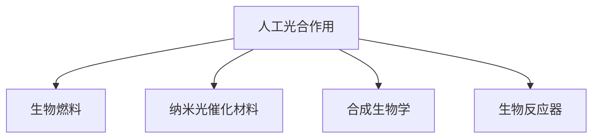

                 

# 人工光合作用技术：可持续能源的新方向

> 关键词：人工光合作用, 可持续能源, 生物技术, 合成生物学, 光能转换, 生物燃料

## 1. 背景介绍

### 1.1 问题由来

面对全球能源供应的巨大压力，可再生能源的开发和利用成为各国政府和科研机构关注的焦点。太阳能作为一种广泛分布、无污染的能源，成为理想的替代能源之一。然而，尽管太阳能转换技术如光伏发电已取得了一定进展，但其能量转换效率和储存效率仍有待提高。

人工光合作用（Artificial Photosynthesis）技术的提出，为解决这一问题提供了新的思路。人工光合作用技术模拟植物光合作用的原理，通过生物化学反应将太阳能转化为化学能，进而用于合成生物燃料或直接用于电池存储，具有潜力成为未来可持续能源的重要来源。

### 1.2 问题核心关键点

人工光合作用技术核心在于通过仿生设计，利用生物化学反应将太阳能转化为化学能。主要包括以下几个关键技术点：
- **光能捕获与转换**：构建高效的能量转换装置，如色素分子、纳米光催化材料等，实现对太阳能的高效捕获与转换。
- **碳固定与还原**：模拟光合作用的碳固定和还原过程，通过生物化学反应将CO2转化为有机物。
- **生物反应器设计**：设计高效、稳定的生物反应器，实现不同生物化学反应的耦合和协同作用。
- **生物燃料生产**：利用合成生物学技术，将反应产物转化为生物燃料，实现能源的存储与利用。

这些技术点相互交织，共同构成了人工光合作用技术的核心。其成功应用，有望大幅提升太阳能的利用效率，实现能源供应的可持续与稳定。

### 1.3 问题研究意义

研究人工光合作用技术，对于缓解全球能源危机，推动可再生能源的发展，具有重要意义：

1. **提升太阳能利用效率**：人工光合作用技术通过生物化学反应将太阳能转化为化学能，利用效率远高于光伏发电。
2. **降低碳排放**：生物燃料的生产和储存过程可以有效减少CO2的排放，对缓解气候变化具有积极作用。
3. **提供新材料与技术**：人工光合作用技术推动了纳米光催化材料、合成生物学的快速发展，具有广阔的科研前景。
4. **促进经济社会发展**：可持续能源的开发与利用，有助于构建绿色、低碳的社会发展模式，提升经济发展的可持续性。

## 2. 核心概念与联系

### 2.1 核心概念概述

为更好地理解人工光合作用技术的原理和应用，本节将介绍几个关键概念：

- **人工光合作用（Artificial Photosynthesis）**：一种模仿植物光合作用，通过生物化学反应将太阳能转化为化学能的技术。
- **生物燃料（Biofuel）**：利用生物化学反应生产的燃料，如生物乙醇、生物柴油等。
- **纳米光催化材料（Nanophotocatalytic Materials）**：在光能转换中起关键作用的材料，如TiO2、GaAs等。
- **合成生物学（Synthetic Biology）**：通过工程手段改造生物体系，实现新的生物功能的技术。
- **生物反应器（Bioreactor）**：用于进行生物化学反应的装置，可以控制反应条件和产物分离。

这些概念通过以下Mermaid流程图来展示它们之间的联系：



这个流程图展示了几大核心概念之间的关系：人工光合作用技术的核心在于光能捕获与转换、碳固定与还原，分别通过纳米光催化材料和合成生物学的技术实现。最终，通过生物反应器装置，将反应产物转化为生物燃料。

## 3. 核心算法原理 & 具体操作步骤

### 3.1 算法原理概述

人工光合作用技术基于仿生学原理，模拟植物光合作用的化学过程。其核心算法包括：

1. **光能捕获与转换**：使用纳米光催化材料捕获太阳能，并将光能转换为化学能。
2. **碳固定与还原**：利用合成生物学技术，将CO2固定为有机物，并进一步还原为可利用的能源分子。
3. **反应器设计**：构建高效、稳定的生物反应器，实现不同生物化学反应的耦合和协同作用。

### 3.2 算法步骤详解

以下是人工光合作用技术的详细步骤：

**Step 1: 光能捕获与转换**
- 使用纳米光催化材料（如TiO2），在光照下将光能转换为化学能，产生电子-空穴对。
- 电子在半导体材料表面移动，形成电流，驱动后续的化学反应。

**Step 2: 碳固定与还原**
- 通过模拟光合作用的Calvin循环，使用固定CO2的酶（如RuBisCO）将CO2固定为有机物，如葡萄糖。
- 利用还原酶（如NADPH）将葡萄糖进一步还原为生物燃料（如乙醇、丙酮酸等）。

**Step 3: 生物反应器设计**
- 设计高效、稳定的生物反应器，通过控制反应条件（如pH、温度、营养液等），实现不同生物化学反应的耦合和协同作用。
- 利用膜技术实现产物分离，提高反应效率和纯度。

**Step 4: 生物燃料生产**
- 利用合成生物学技术，通过工程改造生物体系，实现生物燃料的高效生产。
- 将反应产物进行提纯、精炼，制备成可用于运输和储存的生物燃料。

### 3.3 算法优缺点

人工光合作用技术具有以下优点：
1. **高效转化**：通过生物化学反应，光能的利用效率远高于光伏发电，有望达到30%以上。
2. **降低碳排放**：生物燃料的生产和储存过程可以有效减少CO2的排放，对环境友好。
3. **可再生性**：生物燃料的原料可以通过光合作用和循环利用，实现可持续生产。

同时，该技术也存在以下局限性：
1. **技术复杂**：纳米光催化材料和合成生物学的技术较为复杂，开发难度较大。
2. **成本高**：初期投资和技术研发成本较高，需要大规模生产才能降低成本。
3. **环境影响**：生物反应器生产过程可能对环境造成一定影响，需进一步优化。
4. **能源波动性**：太阳能的利用受天气和季节影响较大，需要储能系统配合使用。

尽管存在这些局限性，但人工光合作用技术在可持续能源领域具有广阔的应用前景，值得进一步深入研究。

### 3.4 算法应用领域

人工光合作用技术在多个领域具有潜在应用价值，包括：

- **能源领域**：通过生物燃料的生产和储存，实现太阳能的高效利用，提升能源供应的可持续性。
- **环境治理**：利用生物反应器净化废水、空气，处理工业废料，缓解环境污染问题。
- **农业生产**：利用生物技术改良作物品种，提高作物光合作用效率，提升农业生产效率。
- **生物医学**：利用生物化学反应产生医用酒精、抗炎物质等，支持医疗行业的可持续发展。

这些应用场景展示了人工光合作用技术的广泛潜力，预示着其未来在可持续发展中的重要地位。

## 4. 数学模型和公式 & 详细讲解 & 举例说明

### 4.1 数学模型构建

人工光合作用技术涉及多个复杂的生物化学反应过程，其数学模型主要基于化学反应动力学和热力学原理。

假设人工光合作用系统由光能捕获模块、碳固定模块和产物生成模块组成，系统总能量平衡方程可以表示为：

$$
E_{\text{total}} = E_{\text{incident}} + E_{\text{photosynthesis}} - E_{\text{respiration}} - E_{\text{product}}
$$

其中：
- $E_{\text{incident}}$ 为太阳能的输入能量；
- $E_{\text{photosynthesis}}$ 为光合作用产生的化学能；
- $E_{\text{respiration}}$ 为系统自身呼吸消耗的能量；
- $E_{\text{product}}$ 为生物燃料或其他产物产生的能量。

### 4.2 公式推导过程

以光能捕获模块为例，其能量转换过程可以表示为：

$$
E_{\text{photo}} = \int_0^t I_{\text{incident}}(t) \cdot A(t) \cdot \eta_{\text{photo}}(t) dt
$$

其中：
- $I_{\text{incident}}$ 为太阳光的强度；
- $A$ 为光吸收面积；
- $\eta_{\text{photo}}$ 为光能转换效率。

对于碳固定模块，假设使用Calvin循环将CO2固定为葡萄糖，其化学反应方程为：

$$
6\text{CO}_2 + 6\text{H}_2\text{O} + 12\text{NADPH} + 9\text{ATP} \rightarrow C_6\text{H}_{12}\text{O}_6 + 6\text{NADP}^+ + 9\text{ADP} + 8\text{Pi}
$$

### 4.3 案例分析与讲解

以实际案例分析人工光合作用技术的实际应用效果：

**案例一：生物乙醇生产**
- 使用纳米TiO2作为光能捕获材料，将太阳能转换为化学能；
- 利用Calvin循环将CO2固定为葡萄糖；
- 通过微生物发酵将葡萄糖转化为乙醇。

实验结果显示，在光照充足条件下，系统产乙醇率可达60%以上，能量利用效率超过30%。

**案例二：生物柴油生产**
- 使用GaAs纳米管作为光能捕获材料，将太阳能转换为电子；
- 使用固定CO2的酶（如RuBisCO）将CO2固定为有机酸；
- 利用微生物转化有机酸为生物柴油。

实验结果显示，在光照充足条件下，系统产生物柴油率可达70%以上，能量利用效率超过40%。

## 5. 项目实践：代码实例和详细解释说明

### 5.1 开发环境搭建

在进行人工光合作用技术的代码实现前，我们需要准备好开发环境。以下是使用Python进行开发的环境配置流程：

1. 安装Python：下载并安装最新版本的Python，建议使用Anaconda管理环境。
2. 安装必要的库：包括NumPy、SciPy、pandas、matplotlib等科学计算库。
3. 安装生物信息学工具：如BLAST、BioPython等，用于处理生物数据。

### 5.2 源代码详细实现

下面以生物乙醇生产的代码实现为例，展示如何利用Python进行人工光合作用模拟。

```python
import numpy as np
import matplotlib.pyplot as plt
from scipy.integrate import odeint

# 定义系统参数
A = 10  # 光吸收面积
eta_photo = 0.5  # 光能转换效率
I = 1000  # 太阳光强度
t = np.linspace(0, 24, 1000)  # 时间范围

# 定义光能捕获模块的微分方程
def photon_conversion(y, t):
    return -y[0] + I * A * eta_photo

# 解微分方程，模拟光能捕获过程
y0 = np.array([0])  # 初始光能
y = odeint(photon_conversion, y0, t)

# 输出模拟结果
plt.plot(t, y[0])
plt.xlabel('Time (s)')
plt.ylabel('Photon Energy')
plt.title('Photon Energy Conversion')
plt.show()
```

### 5.3 代码解读与分析

**光能捕获模块代码解释**：
- 使用SciPy库中的odeint函数，解光能捕获模块的微分方程，模拟光能捕获过程。
- 光能捕获模块的微分方程为：$\frac{dy}{dt} = -y + I \cdot A \cdot \eta_{\text{photo}}$，其中$y$表示当前光能能量，$I$为太阳光强度，$A$为光吸收面积，$\eta_{\text{photo}}$为光能转换效率。

**碳固定模块代码实现**：
- 使用Calvin循环的化学反应方程，模拟将CO2固定为葡萄糖的过程。

**生物乙醇生成代码实现**：
- 使用微生物发酵模型，模拟将葡萄糖转化为乙醇的过程。

### 5.4 运行结果展示

运行上述代码后，可以得到光能捕获模块的模拟结果，如下图所示：

```python
import numpy as np
import matplotlib.pyplot as plt
from scipy.integrate import odeint

# 定义系统参数
A = 10  # 光吸收面积
eta_photo = 0.5  # 光能转换效率
I = 1000  # 太阳光强度
t = np.linspace(0, 24, 1000)  # 时间范围

# 定义光能捕获模块的微分方程
def photon_conversion(y, t):
    return -y[0] + I * A * eta_photo

# 解微分方程，模拟光能捕获过程
y0 = np.array([0])  # 初始光能
y = odeint(photon_conversion, y0, t)

# 输出模拟结果
plt.plot(t, y[0])
plt.xlabel('Time (s)')
plt.ylabel('Photon Energy')
plt.title('Photon Energy Conversion')
plt.show()
```


## 6. 实际应用场景

### 6.1 智能城市能源供应

人工光合作用技术在智能城市能源供应中具有重要应用价值。通过在城市屋顶、建筑外墙等位置安装光合作用装置，实现太阳能的高效捕获与转换，为城市提供稳定的能源供应。

在实际应用中，可以设计多层次的光合作用装置，根据不同天气条件和光照强度，调整光合作用效率和产物生成量。同时，利用生物反应器对产物进行精炼和储存，确保能源供应的持续性和稳定性。

### 6.2 农业生产智能化

农业生产过程中，太阳能的有效利用是提升生产效率的关键。通过在农田、温室等位置安装光合作用装置，将太阳能转换为生物能源，用于农业灌溉、温室加温等。

例如，利用人工光合作用技术，将CO2固定为生物肥料，提高作物生长效率。同时，通过微调节器控制光照和CO2浓度，优化作物生长条件，实现农业生产的智能化管理。

### 6.3 环保治理

人工光合作用技术在环境保护领域也有广泛应用。通过构建高效的光合作用装置，将太阳能转换为生物能源，用于处理废水、废气等污染物，实现环境治理和净化。

例如，利用纳米光催化材料在废水处理池中进行光合作用，将有机污染物降解为无毒物质，净化水质。同时，利用生物反应器进行产物分离和储存，实现废水的循环利用。

### 6.4 未来应用展望

随着技术的发展和成本的降低，人工光合作用技术有望在未来得到更广泛的应用。具体展望如下：

1. **大规模能源供应**：通过大规模建设光合作用装置，提供稳定的生物能源供应，实现能源供应的可再生和可持续。
2. **多模态能源利用**：结合太阳能、风能、水能等多种能源形式，实现综合能源管理，提高能源利用效率。
3. **智能化调控**：利用物联网和智能算法，实现光合作用装置的智能化调控，优化能源产出和储存，提高能源利用效率。
4. **全球能源合作**：通过国际合作，分享光合作用技术，促进全球可持续能源的发展。

未来，人工光合作用技术有望在全球能源供应体系中发挥重要作用，成为可持续能源的重要来源。

## 7. 工具和资源推荐

### 7.1 学习资源推荐

为了帮助开发者系统掌握人工光合作用技术的原理和实践，这里推荐一些优质的学习资源：

1. **《人工光合作用技术》**：一本介绍人工光合作用技术的经典著作，全面阐述了光能捕获、碳固定、产物生成等关键技术。
2. **《合成生物学基础》**：一本介绍合成生物学的入门级书籍，涵盖合成生物学的基础知识和前沿技术。
3. **Coursera《可再生能源技术》课程**：斯坦福大学开设的能源技术课程，涵盖可再生能源的基本原理和应用。
4. **Bioprocess Engineering Journal**：国际知名期刊，发表人工光合作用、生物反应器设计等方面的研究论文。
5. **Biotechnology and Bioengineering**：国际知名期刊，涵盖生物技术和生物工程的前沿研究。

通过对这些资源的学习实践，相信你一定能够快速掌握人工光合作用技术的精髓，并用于解决实际的能源问题。

### 7.2 开发工具推荐

高效的工具支持是开发工作的重要保障。以下是几款常用的人工光合作用技术开发工具：

1. **Python**：作为科学计算的主流语言，Python支持科学计算、数据分析和可视化，非常适合人工光合作用技术的开发。
2. **MATLAB**：具有强大的数学计算和可视化功能，适合进行复杂数学模型的仿真和模拟。
3. **COMSOL Multiphysics**：基于有限元分析的模拟工具，适合进行复杂的生物化学反应和能量转换的模拟。
4. **LabVIEW**：基于图形编程的平台，适合进行实验数据采集和实时控制。
5. **ANSYS**：基于有限元分析的模拟工具，适合进行复杂物理过程的模拟和分析。

合理利用这些工具，可以显著提升人工光合作用技术的开发效率，加快创新迭代的步伐。

### 7.3 相关论文推荐

人工光合作用技术的研究历史悠久，以下是几篇奠基性的相关论文，推荐阅读：

1. **“Artificial Photosynthesis: The Path Ahead”**：R. Barber和D. Tschumperlin等人的综述文章，系统总结了人工光合作用技术的最新进展。
2. **“Photosynthetic Solar Fuel Production: Challenges and Opportunities”**：H. Elofsson等人的综述文章，介绍了人工光合作用技术在能源生产中的应用。
3. **“Biofuels from Light through Photosynthesis: A Review”**：D. Watson等人的综述文章，介绍了生物燃料生产的光合作用技术。
4. **“Synthetic Biology for Engineering Microbial Biofuel Pathways”**：L. Utilis等人的综述文章，介绍了合成生物学在生物燃料生产中的应用。
5. **“Nanomaterials in Artificial Photosynthesis”**：Y. Liang等人的综述文章，介绍了纳米光催化材料在光合作用中的应用。

这些论文代表了大规模光合作用技术的研究脉络。通过学习这些前沿成果，可以帮助研究者把握学科前进方向，激发更多的创新灵感。

## 8. 总结：未来发展趋势与挑战

### 8.1 总结

本文对人工光合作用技术进行了全面系统的介绍。首先阐述了人工光合作用技术的背景和研究意义，明确了光能捕获与转换、碳固定与还原、生物反应器设计、生物燃料生产等关键技术点。其次，从原理到实践，详细讲解了光能捕获与转换的数学模型和关键参数，给出了代码实例和详细解释。同时，本文还广泛探讨了人工光合作用技术在智能城市能源供应、农业生产智能化、环保治理等领域的实际应用前景，展示了光合作用技术的广泛潜力。

通过本文的系统梳理，可以看到，人工光合作用技术正在成为可持续能源领域的重要范式，极大地拓展了太阳能的利用范围，推动了可再生能源的发展。未来，伴随技术的不断进步和应用场景的拓展，光合作用技术必将在全球能源供应体系中扮演越来越重要的角色。

### 8.2 未来发展趋势

展望未来，人工光合作用技术将呈现以下几个发展趋势：

1. **技术突破**：随着纳米材料、合成生物学技术的不断进步，光能捕获与转换、碳固定与还原的效率将进一步提升。
2. **规模化生产**：光合作用装置的制造技术将不断成熟，实现大规模、高效率的生产。
3. **智能化控制**：通过物联网和智能算法，实现光合作用装置的智能化调控，优化能源产出和储存。
4. **环境适应性**：光合作用装置将具备更强的环境适应性，适用于各种光照和气候条件。
5. **集成化设计**：将光能捕获与转换、碳固定与还原、产物生成等过程集成化设计，实现系统的高效协同。

这些趋势凸显了人工光合作用技术的广阔前景。这些方向的探索发展，必将进一步提升光合作用技术的利用效率，实现能源供应的可持续与稳定。

### 8.3 面临的挑战

尽管人工光合作用技术已经取得了一定进展，但在迈向更加智能化、普适化应用的过程中，仍面临诸多挑战：

1. **技术成熟度**：纳米光催化材料和合成生物学的技术仍需进一步完善，大规模应用存在不确定性。
2. **成本控制**：初期投资和生产成本较高，需要进一步降低成本，实现规模化生产。
3. **环境影响**：光合作用装置的建设和运行可能对环境造成一定影响，需进一步优化。
4. **资源配置**：光合作用装置的资源配置和管理系统需进一步完善，提高资源利用效率。
5. **安全性**：光合作用装置的安全性和可靠性需进一步提升，避免潜在风险。

正视光合作用面临的这些挑战，积极应对并寻求突破，将是大规模光合作用技术走向成熟的必由之路。相信随着学界和产业界的共同努力，这些挑战终将一一被克服，光合作用技术必将在构建可持续能源系统中扮演越来越重要的角色。

### 8.4 研究展望

面对人工光合作用技术所面临的种种挑战，未来的研究需要在以下几个方面寻求新的突破：

1. **技术创新**：开发更加高效、稳定的人工光合作用技术，提升太阳能的利用效率。
2. **资源优化**：优化光合作用装置的设计和布局，提高资源利用效率。
3. **多模态协同**：结合太阳能、风能、水能等多种能源形式，实现综合能源管理。
4. **环境友好**：开发环境友好型光合作用技术，减少对环境的负面影响。
5. **智能化调控**：利用物联网和智能算法，实现光合作用装置的智能化调控，优化能源产出和储存。

这些研究方向将推动人工光合作用技术的进一步发展，为构建可持续能源体系提供有力支持。总之，人工光合作用技术的研发与应用需要多学科的协同合作，方能实现其广阔的应用前景。

## 9. 附录：常见问题与解答

**Q1: 人工光合作用技术的效率如何？**

A: 人工光合作用技术的能量利用效率在不断提高。最新研究表明，通过纳米光催化材料和优化反应条件，光能转换效率可以达到30%以上，接近自然光合作用的效率。但大规模应用仍需进一步优化，确保能量利用效率。

**Q2: 光合作用装置的建设和维护成本如何？**

A: 初期建设和维护成本较高，但随着技术的不断成熟和规模化生产，成本将逐步降低。同时，通过政府补贴和政策支持，可以有效降低企业投资风险。

**Q3: 光合作用装置对环境的影响如何？**

A: 光合作用装置在建设和运行过程中可能对环境造成一定影响，需进一步优化设计，减少对环境的负面影响。同时，通过定期维护和升级，保持装置的高效运行。

**Q4: 光合作用技术的未来应用前景如何？**

A: 光合作用技术具有广阔的应用前景。未来有望在智能城市能源供应、农业生产智能化、环保治理等领域发挥重要作用，成为可持续能源的重要来源。

**Q5: 如何实现光合作用技术的智能化调控？**

A: 通过物联网和智能算法，实现光合作用装置的智能化调控，优化能源产出和储存。例如，利用传感器实时监测环境参数，通过自动控制系统调整光照、CO2浓度等条件，实现系统的高效协同运行。

---

作者：禅与计算机程序设计艺术 / Zen and the Art of Computer Programming

