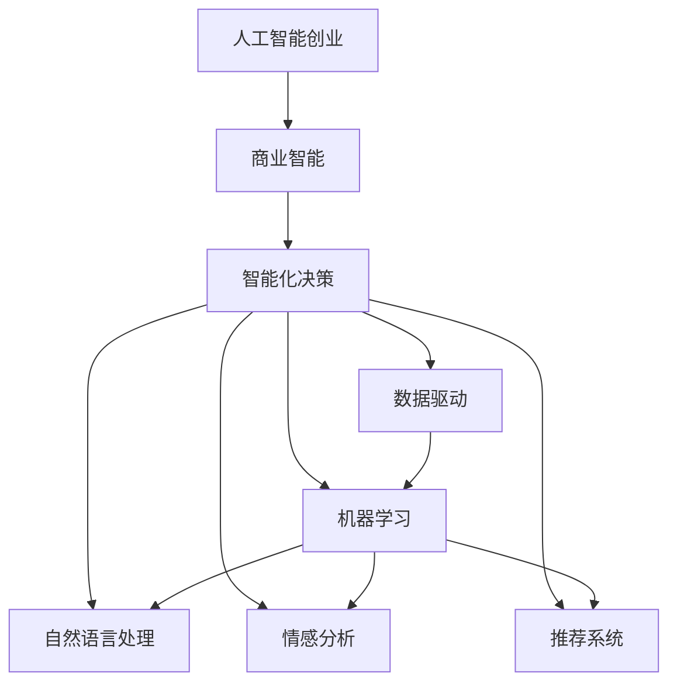

                 

# 人工智能创业：智能化决策的商业应用

> 关键词：人工智能创业, 商业智能, 智能化决策, 数据驱动, 机器学习, 自然语言处理, 情感分析, 推荐系统

## 1. 背景介绍

### 1.1 问题由来

在过去的十年中，人工智能(AI)技术已经从学术研究走向产业应用，正在深刻改变各行各业的生产方式和商业运营模式。尤其是在商业智能(BI)领域，AI和机器学习算法已经逐步成为决策支持的骨干力量，帮助企业更高效、更智能地进行数据分析和决策制定。

人工智能创业公司，从初创期到上市，从传统行业的智能化改造到新兴应用的探索，展示了AI技术在商业应用中的巨大潜力和实际价值。无论是零售、金融、医疗、教育还是制造等行业，AI正被广泛应用以提升效率、优化流程、增强客户体验，以及创造新的商业模式。

### 1.2 问题核心关键点

人工智能创业的核心在于如何利用先进的AI技术，为商业场景提供智能化决策支持。这一过程涉及数据驱动、模型构建、算法选择、模型训练、模型部署等多个环节。如何在保证商业价值最大化的同时，实现AI模型的高效率、高精度和高可靠性，是人工智能创业成功的关键。

### 1.3 问题研究意义

研究人工智能在商业智能决策中的应用，对于提升企业决策的科学性和效率，促进产业数字化转型，具有重要意义：

1. **提升决策科学性**：AI和数据科学可以提供更加精准、全面的商业洞察，帮助企业基于数据进行更科学的决策。
2. **增强运营效率**：通过自动化、预测和优化，AI可以提升企业内部流程和供应链管理，减少人力和物资浪费。
3. **提升客户体验**：AI技术能够通过个性化推荐和智能客服，显著提升客户满意度和忠诚度。
4. **开拓新市场**：AI技术能够帮助企业进入新兴市场，开发新的业务模式，发现新的增长点。
5. **增强竞争力**：通过智能分析，AI可以帮助企业在激烈的市场竞争中占据优势，提升整体市场竞争力。

## 2. 核心概念与联系

### 2.1 核心概念概述

在探讨人工智能创业的智能化决策应用时，需理解以下几个核心概念：

- **人工智能创业**：利用AI技术创建的新型企业，旨在通过算法和数据分析为企业提供决策支持。
- **商业智能(BI)**：通过数据收集、处理和分析，为企业提供经营决策支持的管理技术。
- **智能化决策**：利用AI算法对复杂数据进行处理和分析，辅助决策者做出更科学、更高效的决策。
- **数据驱动**：基于大量数据进行分析和决策，而非传统依靠经验和直觉。
- **机器学习**：一种利用算法让机器从数据中学习并自动改进决策的技术。
- **自然语言处理(NLP)**：让计算机理解、解释和生成人类语言的技术。
- **情感分析**：通过文本分析识别情感，评估产品或服务的受欢迎程度。
- **推荐系统**：根据用户历史行为和偏好，推荐个性化产品或内容。

这些核心概念之间的联系可以通过以下Mermaid流程图来展示：



这个流程图展示了人工智能创业与商业智能、智能化决策之间的关系：

1. 人工智能创业通过商业智能(BI)来收集和分析数据，为智能化决策提供支持。
2. 智能化决策基于数据驱动和机器学习算法，利用NLP、情感分析和推荐系统等技术，提供全面、精准的分析结果。
3. 数据驱动、机器学习和各类AI技术相辅相成，共同推动企业决策智能化。

## 3. 核心算法原理 & 具体操作步骤
### 3.1 算法原理概述

人工智能创业中的智能化决策过程，主要涉及数据预处理、特征工程、模型训练和模型部署等多个环节。核心算法原理可以归纳为以下几点：

1. **数据预处理**：清洗、标准化和转换原始数据，使其适合输入到机器学习模型中。
2. **特征工程**：通过选择、提取和变换特征，提升模型的表现力。
3. **模型训练**：利用标注数据，训练机器学习模型，优化模型参数。
4. **模型部署**：将训练好的模型部署到生产环境中，提供决策支持。

### 3.2 算法步骤详解

以下详细介绍人工智能创业中智能化决策的算法步骤：

**Step 1: 数据准备**
- 收集和清洗业务数据，包括交易记录、客户行为数据、用户反馈等。
- 数据预处理，如去除噪声、处理缺失值、特征标准化等。
- 将数据分为训练集和测试集，确保模型在未知数据上的泛化能力。

**Step 2: 特征工程**
- 选择与业务目标相关的特征，如销售量、客户年龄、购买频率等。
- 提取特征，如统计特征、时间特征、文本特征等。
- 变换特征，如归一化、降维等。
- 利用领域知识和数据探索，优化特征选择和提取。

**Step 3: 模型训练**
- 选择合适的机器学习算法，如决策树、随机森林、神经网络等。
- 设置模型参数，如学习率、迭代次数等。
- 利用训练集进行模型训练，最小化损失函数。
- 使用验证集评估模型性能，调整参数。

**Step 4: 模型部署**
- 将训练好的模型封装为API或服务，便于调用。
- 集成到企业现有的业务系统中，实时提供决策支持。
- 定期更新模型，以适应业务变化和数据更新。

**Step 5: 监控与优化**
- 实时监控模型性能，如准确率、召回率等。
- 定期评估模型，检查模型漂移和性能退化。
- 根据业务反馈，不断优化模型和算法。

### 3.3 算法优缺点

人工智能创业中智能化决策的算法具有以下优点：

1. **高效性**：利用机器学习算法，可以快速处理和分析大量数据，提供实时决策支持。
2. **精准性**：通过数据驱动和高级算法，能够发现数据中的复杂模式和关联，提升决策精准度。
3. **可扩展性**：可以应用于各种业务场景，从销售预测到客户流失预测，从市场细分到个性化推荐。
4. **自适应性**：通过不断学习新数据，模型可以适应业务环境的变化，保持高效性能。

同时，该算法也存在以下局限性：

1. **数据质量依赖**：算法的输出依赖于输入数据的质量，数据清洗和预处理环节尤为重要。
2. **算法复杂度**：复杂的算法可能带来计算资源的消耗，特别是在大规模数据集上。
3. **模型解释性**：黑箱模型（如深度学习）可能难以解释其决策过程，影响业务理解和接受度。
4. **过拟合风险**：模型容易在训练集上过拟合，导致在新数据上泛化能力不足。
5. **数据隐私问题**：在处理客户数据时，需考虑数据隐私和合规性问题。

### 3.4 算法应用领域

人工智能创业中的智能化决策算法，广泛应用于以下多个领域：

- **零售业**：通过销售数据分析，预测销售趋势，优化库存管理，提升客户购买体验。
- **金融业**：通过交易数据和客户行为，进行风险评估，制定个性化金融产品，提升客户满意度。
- **制造业**：通过生产数据和供应链分析，优化生产计划和物流，提升生产效率和质量。
- **医疗保健**：通过病历数据和患者行为，进行疾病预测和个性化治疗，提升医疗服务质量。
- **教育**：通过学生数据和教学行为，进行课程推荐和个性化辅导，提升学习效果。

除了上述领域，智能化决策算法还被创新性地应用于更多场景中，如智能客服、智能安防、智能交通等，为各个行业的数字化转型提供了强有力的技术支持。

## 4. 数学模型和公式 & 详细讲解 & 举例说明
### 4.1 数学模型构建

人工智能创业中的智能化决策算法，通常基于以下数学模型构建：

- **监督学习模型**：如线性回归、逻辑回归、决策树、随机森林等，利用标注数据进行训练。
- **非监督学习模型**：如聚类、降维等，无监督地对数据进行分析和特征提取。
- **深度学习模型**：如卷积神经网络(CNN)、循环神经网络(RNN)、长短时记忆网络(LSTM)等，用于处理复杂数据和进行高级分析。

### 4.2 公式推导过程

以线性回归模型为例，其基本公式为：

$$
y = \beta_0 + \sum_{i=1}^n \beta_i x_i + \epsilon
$$

其中，$y$为输出变量，$\beta_0$为截距，$\beta_i$为权重，$x_i$为特征，$\epsilon$为误差项。

线性回归的优化目标是最小化损失函数：

$$
\mathcal{L}(\theta) = \frac{1}{2} \sum_{i=1}^N (y_i - \hat{y}_i)^2
$$

其中，$\theta$为模型参数，$y_i$为真实值，$\hat{y}_i$为预测值。

线性回归的梯度下降更新公式为：

$$
\theta \leftarrow \theta - \eta \nabla_{\theta}\mathcal{L}(\theta)
$$

其中，$\eta$为学习率。

### 4.3 案例分析与讲解

假设某零售公司需要预测下季度各产品的销售量，以进行库存管理和订单调度。

1. **数据准备**：收集历史销售数据，包括产品名称、销售日期、销售量等。
2. **特征工程**：选择日期、季节、促销活动等特征，进行标准化处理。
3. **模型训练**：使用线性回归模型，利用历史销售数据进行训练。
4. **模型评估**：在验证集上评估模型，调整模型参数。
5. **模型部署**：将训练好的模型集成到生产环境中，实时预测销售量。

通过这一过程，公司可以及时调整库存和订单，减少浪费，提升客户满意度。

## 5. 项目实践：代码实例和详细解释说明
### 5.1 开发环境搭建

在进行智能化决策项目开发前，需要准备好开发环境。以下是使用Python进行PyTorch开发的环境配置流程：

1. 安装Anaconda：从官网下载并安装Anaconda，用于创建独立的Python环境。

2. 创建并激活虚拟环境：
```bash
conda create -n pytorch-env python=3.8 
conda activate pytorch-env
```

3. 安装PyTorch：根据CUDA版本，从官网获取对应的安装命令。例如：
```bash
conda install pytorch torchvision torchaudio cudatoolkit=11.1 -c pytorch -c conda-forge
```

4. 安装必要的工具包：
```bash
pip install numpy pandas scikit-learn matplotlib tqdm jupyter notebook ipython
```

完成上述步骤后，即可在`pytorch-env`环境中开始项目开发。

### 5.2 源代码详细实现

这里以零售行业为例，给出使用PyTorch进行销售预测的完整代码实现。

首先，定义数据处理函数：

```python
import pandas as pd
from sklearn.preprocessing import StandardScaler
from sklearn.model_selection import train_test_split

def load_data(file_path):
    data = pd.read_csv(file_path)
    # 数据清洗和预处理
    data = data.dropna()
    data['date'] = pd.to_datetime(data['date'])
    data['weekday'] = data['date'].dt.dayofweek
    data['hour'] = data['date'].dt.hour
    data = data.drop(columns=['date', 'product_id'])
    # 特征工程
    scaler = StandardScaler()
    data['weekday'] = scaler.fit_transform(data[['weekday']])
    data['hour'] = scaler.fit_transform(data[['hour']])
    return data

def split_data(data):
    train_data, test_data = train_test_split(data, test_size=0.2, random_state=42)
    return train_data, test_data
```

然后，定义模型和优化器：

```python
import torch
from torch import nn
from torch.nn import Linear, ReLU

class SalesPredictor(nn.Module):
    def __init__(self, in_features, out_features):
        super(SalesPredictor, self).__init__()
        self.linear = Linear(in_features, out_features)
        self.relu = ReLU()
        
    def forward(self, x):
        return self.relu(self.linear(x))

# 设置模型和优化器
in_features = 3
out_features = 1
model = SalesPredictor(in_features, out_features)
optimizer = torch.optim.SGD(model.parameters(), lr=0.01)
```

接着，定义训练和评估函数：

```python
from torch.utils.data import DataLoader
from sklearn.metrics import mean_squared_error

def train_epoch(model, data_loader, optimizer):
    model.train()
    epoch_loss = 0
    for batch in data_loader:
        inputs = batch['inputs']
        labels = batch['labels']
        optimizer.zero_grad()
        outputs = model(inputs)
        loss = torch.mean((outputs - labels) ** 2)
        epoch_loss += loss.item()
        loss.backward()
        optimizer.step()
    return epoch_loss / len(data_loader)

def evaluate(model, data_loader):
    model.eval()
    mse = 0
    for batch in data_loader:
        inputs = batch['inputs']
        labels = batch['labels']
        outputs = model(inputs)
        mse += mean_squared_error(outputs, labels)
    return mse / len(data_loader)

# 训练和评估模型
train_data, test_data = split_data(load_data('sales_data.csv'))
train_loader = DataLoader(train_data, batch_size=32)
test_loader = DataLoader(test_data, batch_size=32)
epochs = 10

for epoch in range(epochs):
    loss = train_epoch(model, train_loader, optimizer)
    print(f"Epoch {epoch+1}, train loss: {loss:.3f}")
    
    print(f"Epoch {epoch+1}, test MSE: {evaluate(model, test_loader):.3f}")
    
print("Test MSE:", evaluate(model, test_loader))
```

以上就是使用PyTorch对销售预测模型进行开发的完整代码实现。可以看到，得益于PyTorch的强大封装，代码实现变得简洁高效。

### 5.3 代码解读与分析

让我们再详细解读一下关键代码的实现细节：

**load_data函数**：
- 读取数据文件，并进行数据清洗和预处理，如去除NaN值、转换日期、标准化特征等。

**split_data函数**：
- 将数据集分为训练集和测试集，设置20%的数据作为测试集。

**SalesPredictor类**：
- 定义一个线性回归模型，包含一个线性层和一个ReLU激活函数。

**train_epoch函数**：
- 对数据以批为单位进行迭代，在每个批次上前向传播计算损失并反向传播更新模型参数。

**evaluate函数**：
- 与训练类似，不同点在于不更新模型参数，仅计算测试集上的均方误差。

**训练流程**：
- 定义总的epoch数，开始循环迭代
- 每个epoch内，先在训练集上训练，输出平均loss
- 在测试集上评估，输出均方误差

可以看到，PyTorch配合强大的工具包，使得模型开发变得简洁高效。开发者可以将更多精力放在数据处理、模型改进等高层逻辑上，而不必过多关注底层的实现细节。

## 6. 实际应用场景
### 6.1 零售业

在零售行业中，智能化决策能够帮助企业优化库存管理，提升销售预测的准确性，从而减少库存积压和缺货风险。具体应用包括：

1. **库存优化**：通过预测未来销售量，优化库存水平，避免库存过多或过少。
2. **促销活动**：根据历史销售数据和当前市场趋势，制定合理的促销策略。
3. **价格调整**：分析竞争对手价格策略，制定更具竞争力的定价方案。

### 6.2 金融业

在金融领域，智能化决策能够帮助银行和金融机构进行风险评估、客户关系管理和产品推荐。具体应用包括：

1. **风险评估**：通过分析历史交易数据和客户行为，评估贷款申请者的信用风险。
2. **客户关系管理**：利用客户行为数据，制定个性化营销策略，提升客户满意度和忠诚度。
3. **产品推荐**：基于客户历史交易和偏好，推荐适合的产品或服务。

### 6.3 制造业

在制造业中，智能化决策能够帮助企业优化生产计划和供应链管理，提升生产效率和质量。具体应用包括：

1. **生产调度**：通过预测设备运行状态和生产需求，优化生产计划和调度。
2. **质量控制**：分析历史生产数据，预测产品缺陷率，提前进行质量控制。
3. **供应链优化**：通过预测市场需求和库存情况，优化供应链管理和物流。

### 6.4 未来应用展望

随着人工智能技术的不断进步，智能化决策将在更多领域得到应用，带来更深远的变革：

1. **智慧城市**：通过智能分析，优化城市交通、环境监测和公共安全。
2. **健康医疗**：通过数据分析，提高疾病诊断和治疗效果，优化医疗资源配置。
3. **教育培训**：通过智能分析，个性化推荐课程和学习内容，提升学习效果。
4. **智能家居**：通过数据分析，优化家居控制和用户行为，提升生活品质。
5. **能源管理**：通过数据分析，优化能源使用和调度，提升能源利用效率。

## 7. 工具和资源推荐
### 7.1 学习资源推荐

为了帮助开发者系统掌握智能化决策的理论基础和实践技巧，这里推荐一些优质的学习资源：

1. **《Python机器学习》书籍**：斯坦福大学教授写的入门级书籍，涵盖机器学习基础和实战案例。
2. **Kaggle平台**：数据科学和机器学习的竞赛平台，可以学习和实践各种机器学习算法。
3. **Coursera课程**：由世界顶尖大学和公司提供的在线课程，涵盖机器学习、深度学习、商业智能等。
4. **Medium文章**：技术博客平台，分享机器学习和人工智能领域的最新进展和实战经验。
5. **GitHub代码库**：开放源码平台，提供大量高质量的机器学习和智能化决策项目代码。

通过对这些资源的学习实践，相信你一定能够快速掌握智能化决策的核心技能，并应用于实际项目中。

### 7.2 开发工具推荐

高效的开发离不开优秀的工具支持。以下是几款用于智能化决策开发的常用工具：

1. **PyTorch**：基于Python的开源深度学习框架，灵活动态的计算图，适合快速迭代研究。
2. **TensorFlow**：由Google主导开发的开源深度学习框架，生产部署方便，适合大规模工程应用。
3. **Scikit-learn**：Python机器学习库，提供了丰富的机器学习算法和工具。
4. **Keras**：高层神经网络API，方便快速搭建和训练神经网络模型。
5. **Jupyter Notebook**：开源的交互式开发环境，支持Python代码的编写、调试和共享。
6. **H2O.ai**：企业级开源机器学习平台，提供了简单易用的机器学习工具和算法。

合理利用这些工具，可以显著提升智能化决策任务的开发效率，加快创新迭代的步伐。

### 7.3 相关论文推荐

智能化决策的研究源于学界的持续研究。以下是几篇奠基性的相关论文，推荐阅读：

1. **《Deep Learning》书籍**：Ian Goodfellow等著，深度学习领域的经典教材。
2. **《Pattern Recognition and Machine Learning》书籍**：Christopher Bishop著，机器学习领域的经典教材。
3. **《The Elements of Statistical Learning》书籍**：Peter Bühlmann等著，统计学习领域的经典教材。
4. **《Machine Learning Yearning》书籍**：Andrew Ng著，深度学习领域的实战指南。
5. **《Advances in Neural Information Processing Systems (NeurIPS)》会议论文**：顶级学术会议，汇集了机器学习和人工智能领域的最新研究成果。

这些论文代表了大数据和智能化决策研究的发展脉络。通过学习这些前沿成果，可以帮助研究者把握学科前进方向，激发更多的创新灵感。

## 8. 总结：未来发展趋势与挑战
### 8.1 总结

本文对人工智能创业中的智能化决策应用进行了全面系统的介绍。首先阐述了智能化决策在提升企业决策科学性和效率方面的重要性，明确了其商业价值和应用场景。其次，从原理到实践，详细讲解了智能化决策的核心算法原理和具体操作步骤，给出了机器学习模型的代码实现。同时，本文还广泛探讨了智能化决策在零售、金融、制造等多个行业领域的应用前景，展示了其巨大的应用潜力。此外，本文精选了智能化决策的相关学习资源和开发工具，力求为读者提供全方位的技术指引。

通过本文的系统梳理，可以看到，智能化决策在大数据和人工智能技术的推动下，已经成为提升企业竞争力和运营效率的重要手段。未来，伴随技术的不断进步和应用的广泛推广，智能化决策必将在更多领域得到应用，带来更深的变革性影响。

### 8.2 未来发展趋势

展望未来，智能化决策技术将呈现以下几个发展趋势：

1. **自动化水平提升**：随着自动化技术的发展，智能化决策将变得更加智能和自主。
2. **模型可解释性增强**：未来模型将更加注重可解释性，便于业务理解和接受。
3. **跨领域知识融合**：智能化决策将更多地融合不同领域的知识，提升决策的全面性和准确性。
4. **多模态信息整合**：利用图像、语音、文本等多模态数据，提升决策的全面性和鲁棒性。
5. **实时决策支持**：实时数据分析和决策支持将更加普及，提升业务响应速度。
6. **隐私保护和合规性**：数据隐私和安全将受到更多关注，合规性要求也将越来越高。

以上趋势凸显了智能化决策技术的广阔前景。这些方向的探索发展，必将进一步提升智能化决策模型的性能和应用范围，为各个行业的数字化转型提供强有力的技术支持。

### 8.3 面临的挑战

尽管智能化决策技术已经取得了显著成就，但在迈向更加智能化、普适化应用的过程中，仍面临诸多挑战：

1. **数据质量和多样性**：数据的质量和多样性直接影响模型的性能，获取高质量、多模态数据是一个重要挑战。
2. **模型复杂度**：模型复杂度带来计算资源的消耗，特别是在大规模数据集上。
3. **模型可解释性**：复杂模型的决策过程难以解释，影响业务理解和接受度。
4. **隐私和安全问题**：数据隐私和安全问题，尤其是在处理敏感数据时，需要更多保护措施。
5. **数据孤岛问题**：不同部门和系统之间的数据孤岛问题，影响数据的整合和利用。

### 8.4 研究展望

面对智能化决策所面临的挑战，未来的研究需要在以下几个方面寻求新的突破：

1. **数据清洗和预处理**：开发更高效的数据清洗和预处理算法，提升数据质量。
2. **模型简化和压缩**：研究模型简化和压缩技术，提升模型效率和可解释性。
3. **多模态数据整合**：开发更高效的多模态数据整合算法，提升决策的全面性和鲁棒性。
4. **隐私保护技术**：开发隐私保护技术，确保数据安全和合规性。
5. **自动化技术**：开发自动化技术，提升智能化决策的自主性和可操作性。
6. **跨领域知识融合**：开发跨领域知识融合技术，提升决策的全面性和准确性。

这些研究方向的探索，必将引领智能化决策技术迈向更高的台阶，为各个行业的数字化转型提供强有力的技术支持。面向未来，智能化决策技术还需要与其他人工智能技术进行更深入的融合，如知识表示、因果推理、强化学习等，多路径协同发力，共同推动智能化决策系统的进步。只有勇于创新、敢于突破，才能不断拓展决策模型的边界，让智能化决策系统更好地服务于企业决策，提升业务效率和竞争力。

## 9. 附录：常见问题与解答
**Q1：智能化决策中的数据质量和多样性如何保证？**

A: 数据质量和多样性是智能化决策的关键，具体措施包括：

1. **数据清洗**：去除噪声、缺失值和异常值，确保数据的一致性和完整性。
2. **数据采集**：通过多渠道采集数据，如交易记录、客户反馈、传感器数据等，确保数据的多样性。
3. **数据标注**：进行数据标注，确保数据标注的一致性和准确性。
4. **数据验证**：通过交叉验证、抽样检验等方式，确保数据的可靠性和代表性。
5. **数据治理**：建立数据治理机制，确保数据的规范化和标准化。

**Q2：如何在智能化决策中提升模型的可解释性？**

A: 提升模型的可解释性，可以从以下几个方面入手：

1. **模型简化**：使用更简单的模型结构，降低模型的复杂度，便于解释。
2. **特征重要性分析**：使用特征重要性分析方法，如SHAP、LIME等，解释模型的决策过程。
3. **局部可解释性**：使用局部可解释性方法，如LIME、SHAP等，解释模型在特定输入下的决策。
4. **透明算法**：使用透明算法，如线性回归、决策树等，便于解释和理解。
5. **模型监控**：实时监控模型的输出，及时发现和修正异常情况。

**Q3：如何处理智能化决策中的数据隐私和安全问题？**

A: 处理数据隐私和安全问题，可以从以下几个方面入手：

1. **数据匿名化**：对数据进行匿名化处理，确保数据隐私。
2. **数据加密**：对数据进行加密处理，确保数据传输和存储的安全性。
3. **访问控制**：实施严格的访问控制，确保数据访问的合法性和安全性。
4. **隐私保护算法**：使用隐私保护算法，如差分隐私、联邦学习等，保护数据隐私。
5. **合规性审查**：定期进行合规性审查，确保数据处理符合法律法规。

**Q4：智能化决策中的模型过拟合问题如何缓解？**

A: 缓解模型过拟合问题，可以从以下几个方面入手：

1. **数据增强**：通过数据增强技术，扩充训练集，增加数据多样性。
2. **正则化技术**：使用正则化技术，如L2正则、Dropout等，避免模型过拟合。
3. **早停策略**：设置早停策略，避免模型在训练集上过拟合。
4. **模型简化**：使用更简单的模型结构，降低模型的复杂度，避免过拟合。
5. **交叉验证**：通过交叉验证，评估模型在新数据上的泛化能力，调整模型参数。

这些策略往往需要根据具体任务和数据特点进行灵活组合。只有在数据、模型、训练、推理等各环节进行全面优化，才能最大限度地发挥智能化决策模型的威力。

**Q5：智能化决策中的模型部署和优化如何实现？**

A: 将智能化决策模型部署到实际应用中，需要考虑以下几个方面：

1. **模型裁剪**：去除不必要的层和参数，减小模型尺寸，加快推理速度。
2. **量化加速**：将浮点模型转为定点模型，压缩存储空间，提高计算效率。
3. **服务化封装**：将模型封装为标准化服务接口，便于调用。
4. **弹性伸缩**：根据请求流量动态调整资源配置，平衡服务质量和成本。
5. **监控告警**：实时采集系统指标，设置异常告警阈值，确保服务稳定性。

以上措施可以显著提升模型的部署效率和应用效果，确保模型在实际应用中的稳定性和可靠性。

**Q6：智能化决策中的模型优化有哪些关键策略？**

A: 智能化决策中的模型优化策略包括：

1. **超参数调优**：通过网格搜索、随机搜索等方式，找到最优的模型参数。
2. **模型压缩**：使用模型压缩技术，如剪枝、量化等，减小模型尺寸，提升推理速度。
3. **模型融合**：通过模型融合技术，提升模型的鲁棒性和泛化能力。
4. **模型集成**：集成多个模型，取平均输出或加权输出，提升模型的稳定性和准确性。
5. **模型迭代**：定期更新模型，适应业务变化和数据更新。

通过这些策略，可以不断优化模型，提升其在实际应用中的表现和效果。

---

作者：禅与计算机程序设计艺术 / Zen and the Art of Computer Programming

