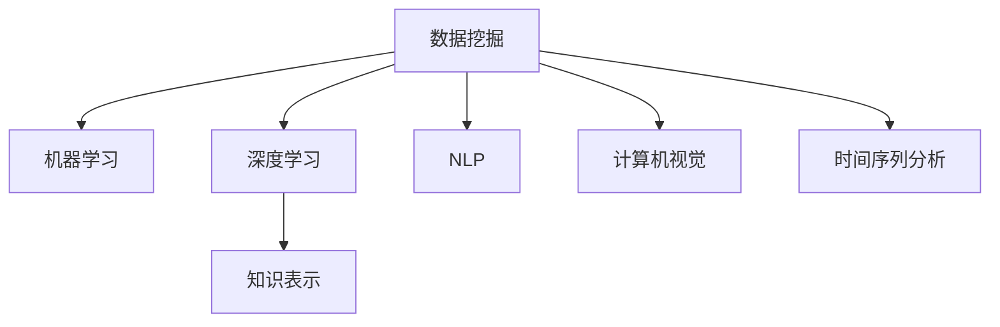

                 

# 人工智能在知识发现中的应用

> 关键词：人工智能,知识发现,数据挖掘,机器学习,深度学习,数据科学,数据分析

## 1. 背景介绍

### 1.1 问题由来

在信息爆炸的时代，数据已经成为最为宝贵的资源之一。然而，大量的数据往往以复杂、无序的形式存在，难以被直接利用。如何从数据中挖掘出有用的知识，成为当前研究的热点。传统的统计学方法虽然有效，但对于复杂的非线性关系难以建模。近年来，人工智能(AI)在数据挖掘和知识发现领域取得显著进展，通过机器学习和深度学习技术，能够更高效、更智能地从数据中发现规律和模式。

人工智能在知识发现中的应用，主要体现在以下几个方面：

1. **数据挖掘**：利用机器学习算法自动分析数据，发现数据之间的内在联系，从而提取有价值的信息。
2. **模式识别**：使用深度学习模型，对数据进行分类、聚类和关联分析，挖掘出数据的深层次模式。
3. **自然语言处理**：通过NLP技术，从文本数据中提取知识，如实体识别、情感分析、主题建模等。
4. **图像识别**：利用计算机视觉技术，从图像数据中识别出物体、场景等关键信息。
5. **时间序列分析**：通过对时间序列数据进行分析，发现时间变化中的规律和趋势。

人工智能在知识发现中的应用，正在改变我们的工作和生活方式，为各行各业提供数据驱动的决策支持，推动社会的智能化发展。

### 1.2 问题核心关键点

人工智能在知识发现中的应用，核心在于如何利用先进的数据分析和机器学习算法，从大量数据中自动提取和发现知识。具体来说，主要包括以下几个关键点：

1. **数据预处理**：包括数据清洗、特征提取、归一化等，确保数据质量，为后续建模奠定基础。
2. **算法选择**：根据数据特点和任务需求，选择合适的机器学习或深度学习算法，如分类、回归、聚类、神经网络等。
3. **模型训练**：使用历史数据训练模型，调整模型参数，使其能够准确预测新数据。
4. **模型评估**：通过测试集评估模型性能，确定模型是否过拟合或欠拟合，进行必要的调参优化。
5. **知识提取**：将模型输出的结果转换为可解释的知识，如分类结果、预测结果、聚类结果等。
6. **应用部署**：将模型集成到实际应用系统，进行实时预测和决策支持。

这些关键点共同构成了一个完整的知识发现流程，涵盖了数据预处理、模型训练、模型评估、知识提取和应用部署等环节。

## 2. 核心概念与联系

### 2.1 核心概念概述

为了更好地理解人工智能在知识发现中的应用，本节将介绍几个密切相关的核心概念：

1. **数据挖掘(Data Mining)**：从大量数据中自动发现有用信息和知识的过程。数据挖掘通常包括数据预处理、数据建模和模型评估等步骤。

2. **机器学习(Machine Learning)**：利用算法让机器自动学习数据中的模式和规律，从而进行预测和决策。机器学习分为监督学习、无监督学习和半监督学习等几种主要类型。

3. **深度学习(Deep Learning)**：一种基于神经网络的机器学习方法，通过多层次的特征提取，实现对复杂非线性关系的建模。深度学习在图像识别、语音识别、自然语言处理等领域取得了显著成果。

4. **知识表示(Knowledge Representation)**：将知识以结构化或非结构化的形式进行表示，便于存储、检索和应用。常见的知识表示方法包括RDF、OWL、本体等。

5. **自然语言处理(Natural Language Processing, NLP)**：使用计算机技术处理和理解人类语言，包括文本分析、语言生成、情感分析等。NLP是知识发现中最重要的技术之一，广泛应用于文本挖掘、智能客服、机器翻译等领域。

6. **计算机视觉(Computer Vision)**：使用计算机技术分析和理解图像和视频，包括物体识别、场景理解、动作识别等。计算机视觉是知识发现中的重要技术，广泛应用于智能监控、自动驾驶、医学影像分析等领域。

7. **时间序列分析(Time Series Analysis)**：对时间序列数据进行建模和分析，以发现其中的规律和趋势。时间序列分析广泛应用于金融、气象、交通等领域。

这些核心概念之间的逻辑关系可以通过以下Mermaid流程图来展示：



这个流程图展示了数据挖掘与其他核心概念之间的关系：数据挖掘利用机器学习和深度学习技术进行建模和分析，同时支持自然语言处理、计算机视觉和时间序列分析等多种技术，为知识发现提供了强大的工具和方法。

## 3. 核心算法原理 & 具体操作步骤

### 3.1 算法原理概述

人工智能在知识发现中的应用，主要基于机器学习和深度学习算法，对数据进行建模和分析。常见的算法包括分类算法、聚类算法、回归算法、神经网络等。

以分类算法为例，其核心思想是将数据分为不同的类别，通过训练模型来识别新的数据属于哪个类别。分类算法在知识发现中的应用，主要体现在以下几个方面：

1. **监督学习(Supervised Learning)**：利用已标注的数据集训练分类器，使得模型能够对新数据进行分类。常见的监督学习算法包括决策树、支持向量机(SVM)、朴素贝叶斯、神经网络等。
2. **无监督学习(Unsupervised Learning)**：使用未标注的数据集，通过聚类、降维等技术发现数据中的内在规律。常见的无监督学习算法包括K-Means、PCA、LDA等。
3. **半监督学习(Semi-Supervised Learning)**：结合已标注和未标注数据，通过半监督学习算法提高模型的泛化能力。常见的半监督学习算法包括自训练、标签传播等。

### 3.2 算法步骤详解

下面以K-Means聚类算法为例，详细介绍其实现步骤：

**Step 1: 准备数据**

- 准备数据集 $D=\{(x_1, y_1), (x_2, y_2), ..., (x_n, y_n)\}$，其中 $x_i$ 为数据点，$y_i$ 为标签。
- 选择聚类数量 $K$，一般为数据集的维数 $d$ 的整数倍。

**Step 2: 初始化聚类中心**

- 随机选择 $K$ 个数据点作为初始聚类中心 $\mu_1, \mu_2, ..., \mu_K$。

**Step 3: 分配数据点**

- 对于每个数据点 $x_i$，计算其到每个聚类中心的距离 $d(x_i, \mu_j)$，分配给距离最近的聚类中心 $\mu_j$。

**Step 4: 更新聚类中心**

- 对于每个聚类 $j$，计算其内部数据点的均值 $\mu_j = \frac{1}{n_j} \sum_{i \in C_j} x_i$，其中 $C_j$ 为聚类 $j$ 中的数据点集合，$n_j$ 为聚类 $j$ 中的数据点数量。

**Step 5: 重复步骤3和4，直到收敛**

- 重复步骤3和4，直到聚类中心不再变化或达到预设的迭代次数。

通过上述步骤，K-Means算法能够将数据集划分为 $K$ 个聚类，每个聚类内部的数据点相似度高，不同聚类之间的数据点相似度低。

### 3.3 算法优缺点

K-Means算法的优点包括：

1. 算法简单，易于实现。
2. 聚类结果易于解释，每个聚类对应一个均值向量。
3. 适用于大规模数据集。

其缺点包括：

1. 聚类结果依赖于初始聚类中心的选择。
2. 对于非球形的聚类，聚类效果不佳。
3. 需要预先指定聚类数量 $K$，可能影响聚类结果。

### 3.4 算法应用领域

K-Means算法在知识发现中的应用非常广泛，主要包括以下几个领域：

1. **市场细分**：对客户数据进行聚类，发现不同客户群体的特征和需求，进行个性化营销。
2. **图像分割**：对图像数据进行聚类，发现图像中的不同区域，如前景和背景。
3. **自然语言处理**：对文本数据进行聚类，发现文本中的不同主题，如情感分析、话题建模等。
4. **生物信息学**：对基因序列数据进行聚类，发现不同基因簇，研究基因功能。
5. **金融分析**：对金融数据进行聚类，发现不同市场群体的特征和行为，进行风险管理和投资策略优化。
6. **社交网络分析**：对社交网络数据进行聚类，发现不同社交群体和社区，研究社交网络结构和关系。

## 4. 数学模型和公式 & 详细讲解 & 举例说明

### 4.1 数学模型构建

在知识发现中，数学模型是必不可少的工具。以回归分析为例，其数学模型可以表示为：

$$ y = \beta_0 + \beta_1 x_1 + \beta_2 x_2 + ... + \beta_n x_n + \epsilon $$

其中 $y$ 为因变量，$x_1, x_2, ..., x_n$ 为自变量，$\beta_0, \beta_1, \beta_2, ..., \beta_n$ 为回归系数，$\epsilon$ 为误差项。

### 4.2 公式推导过程

对于回归分析，我们可以使用最小二乘法来求解回归系数。最小二乘法的目标是最小化误差项的平方和：

$$ \sum_{i=1}^N (y_i - \hat{y}_i)^2 $$

其中 $\hat{y}_i = \beta_0 + \beta_1 x_{1i} + \beta_2 x_{2i} + ... + \beta_n x_{ni}$ 为回归模型的预测值。

最小二乘法的求解过程如下：

1. 将数据集 $D=\{(x_i, y_i)\}_{i=1}^N$ 中的自变量和因变量分别记为 $\mathbf{X}$ 和 $\mathbf{y}$，其中 $\mathbf{X} = \begin{bmatrix} x_1 & x_2 & ... & x_n \end{bmatrix}^T$，$\mathbf{y} = \begin{bmatrix} y_1 & y_2 & ... & y_n \end{bmatrix}^T$。
2. 求解线性回归模型 $\mathbf{y} = \mathbf{X} \mathbf{\beta} + \mathbf{\epsilon}$，其中 $\mathbf{\beta} = \begin{bmatrix} \beta_0 & \beta_1 & ... & \beta_n \end{bmatrix}^T$。
3. 求解 $\mathbf{\beta}$ 使得 $\sum_{i=1}^N (y_i - \hat{y}_i)^2$ 最小化，即求解 $\mathbf{\beta} = (\mathbf{X}^T \mathbf{X})^{-1} \mathbf{X}^T \mathbf{y}$。

### 4.3 案例分析与讲解

以房价预测为例，我们选取一个包含房屋特征和房价的数据集，使用线性回归模型进行预测。具体步骤如下：

1. 收集数据：从房地产网站或公开数据集中获取房屋特征（如面积、位置、房间数等）和房价。
2. 数据预处理：对数据进行清洗、归一化等处理，确保数据质量。
3. 模型训练：使用历史数据训练线性回归模型，求解回归系数 $\beta_0, \beta_1, ..., \beta_n$。
4. 模型评估：在测试集上评估模型性能，计算均方误差等指标。
5. 应用部署：将模型集成到实际应用系统，进行实时预测。

## 5. 项目实践：代码实例和详细解释说明

### 5.1 开发环境搭建

在项目实践前，我们需要准备好开发环境。以下是使用Python进行Scikit-learn开发的环境配置流程：

1. 安装Anaconda：从官网下载并安装Anaconda，用于创建独立的Python环境。

2. 创建并激活虚拟环境：
```bash
conda create -n sklearn-env python=3.8 
conda activate sklearn-env
```

3. 安装Scikit-learn：
```bash
pip install -U scikit-learn
```

4. 安装NumPy、Pandas、Matplotlib等依赖库：
```bash
pip install numpy pandas matplotlib seaborn scikit-learn
```

5. 安装Jupyter Notebook：
```bash
pip install jupyter notebook
```

完成上述步骤后，即可在`sklearn-env`环境中开始项目实践。

### 5.2 源代码详细实现

下面我们以房价预测为例，给出使用Scikit-learn进行线性回归的Python代码实现。

```python
import numpy as np
from sklearn.linear_model import LinearRegression
from sklearn.model_selection import train_test_split
from sklearn.metrics import mean_squared_error

# 准备数据
X = np.array([[1000, 3], [1200, 4], [1300, 5], [1600, 6], [2000, 7], [2400, 8], [2800, 9], [3200, 10], [3800, 12], [4000, 13]])
y = np.array([300000, 350000, 400000, 450000, 550000, 650000, 750000, 850000, 950000, 1000000])

# 数据拆分
X_train, X_test, y_train, y_test = train_test_split(X, y, test_size=0.3, random_state=0)

# 模型训练
model = LinearRegression()
model.fit(X_train, y_train)

# 模型评估
y_pred = model.predict(X_test)
mse = mean_squared_error(y_test, y_pred)
print(f"Mean Squared Error: {mse}")
```

### 5.3 代码解读与分析

让我们再详细解读一下关键代码的实现细节：

**线性回归模型**：
- 使用Scikit-learn的`LinearRegression`类定义线性回归模型。
- 在`fit`方法中使用训练数据拟合模型，求解回归系数。

**模型评估**：
- 使用`predict`方法在测试集上进行预测。
- 使用`mean_squared_error`函数计算预测值与真实值之间的均方误差。

通过上述代码，我们完成了线性回归模型的训练和评估。可以看到，Scikit-learn提供了一个方便易用的接口，可以轻松实现复杂的机器学习模型。

## 6. 实际应用场景

### 6.1 智能推荐系统

智能推荐系统是人工智能在知识发现中最重要的应用之一。通过分析用户的兴趣和行为，智能推荐系统能够向用户推荐个性化的商品、内容和服务，提升用户体验和满意度。

在智能推荐系统中，K-Means算法可以用于用户分群和商品聚类。具体来说，可以收集用户的历史行为数据和商品的属性特征，使用K-Means算法将用户和商品分别聚类，发现用户和商品之间的相似度，从而进行推荐。

### 6.2 金融风控系统

金融风控系统是金融机构在风险管理中必不可少的工具。通过分析用户的信用记录、消费行为等数据，金融风控系统能够评估用户的信用风险，进行贷款审批和额度调整。

在金融风控系统中，机器学习算法可以用于信用评分和欺诈检测。具体来说，可以收集用户的个人信息和行为数据，使用分类算法对用户进行信用评分和欺诈检测，预测用户的信用风险和欺诈行为。

### 6.3 医疗诊断系统

医疗诊断系统是人工智能在医学领域的重要应用之一。通过分析患者的症状、病历和基因数据，医疗诊断系统能够辅助医生进行诊断和治疗，提高医疗服务的质量和效率。

在医疗诊断系统中，深度学习算法可以用于图像识别和自然语言处理。具体来说，可以收集患者的医学影像数据和病历文本，使用卷积神经网络(CNN)进行图像识别，使用自然语言处理(NLP)进行病历分析和文本分类，发现患者的病情和诊断结果。

### 6.4 未来应用展望

随着人工智能技术的不断发展，知识发现将迎来更多的应用场景。以下是对未来应用的展望：

1. **自动驾驶**：通过计算机视觉和深度学习技术，自动驾驶系统可以识别和理解交通环境，实现自主驾驶。
2. **智能家居**：通过物联网和自然语言处理技术，智能家居系统可以实现智能控制和交互，提升家居生活的便捷性。
3. **工业智能**：通过数据分析和机器学习技术，工业智能系统可以实现预测性维护和优化生产，提升工业生产的效率和质量。
4. **智慧城市**：通过数据挖掘和智能算法，智慧城市系统可以实现交通管理、能源管理、环境监测等功能，提升城市运行的效率和安全性。
5. **农业智能**：通过传感器和机器学习技术，农业智能系统可以实现精准农业和智能决策，提升农业生产的效率和可持续性。
6. **教育智能**：通过数据分析和自然语言处理技术，教育智能系统可以实现个性化学习和智能辅导，提升教育质量和学习效果。

## 7. 工具和资源推荐

### 7.1 学习资源推荐

为了帮助开发者系统掌握人工智能在知识发现中的应用，这里推荐一些优质的学习资源：

1. 《Python数据科学手册》：深入浅出地介绍了Python在数据科学中的应用，包括数据预处理、特征工程、模型训练和模型评估等。
2. 《机器学习实战》：基于Scikit-learn库，介绍了机器学习算法的实现方法和应用场景，适合初学者入门。
3. 《深度学习》：由深度学习领域的大师级专家撰写，全面介绍了深度学习的基本概念和实现方法，适合进阶学习。
4. Coursera的《机器学习》课程：由斯坦福大学教授Andrew Ng主讲，涵盖了机器学习的基本概念和算法，适合系统学习。
5. Kaggle的机器学习竞赛：通过实际竞赛数据集，训练和验证机器学习模型，提升实战能力。

通过对这些资源的学习实践，相信你一定能够系统掌握人工智能在知识发现中的应用，并用于解决实际的NLP问题。

### 7.2 开发工具推荐

高效的开发离不开优秀的工具支持。以下是几款用于人工智能项目开发的常用工具：

1. Jupyter Notebook：基于Web的交互式编程环境，适合数据科学和机器学习项目开发。
2. Anaconda：基于Python的数据科学平台，提供数据分析、机器学习和深度学习等工具。
3. Scikit-learn：基于Python的机器学习库，提供简单易用的接口，支持多种机器学习算法。
4. TensorFlow：由Google主导的开源深度学习框架，支持分布式训练和部署，适合大规模模型开发。
5. PyTorch：由Facebook主导的开源深度学习框架，支持动态计算图和GPU加速，适合研究和实验。
6. Keras：基于Python的深度学习库，提供高层API，方便快速实现深度学习模型。

合理利用这些工具，可以显著提升人工智能项目开发效率，加速创新迭代。

### 7.3 相关论文推荐

人工智能在知识发现中的应用，得益于学界的持续研究。以下是几篇奠基性的相关论文，推荐阅读：

1. "An Introduction to Statistical Learning"：由Gareth James等作者撰写，介绍了统计学习的基本概念和算法，适合入门学习。
2. "Pattern Recognition and Machine Learning"：由Christopher Bishop撰写，介绍了机器学习和模式识别的基础知识，适合进阶学习。
3. "Deep Learning"：由Ian Goodfellow等作者撰写，全面介绍了深度学习的基本概念和实现方法，适合深入学习。
4. "Hands-On Machine Learning with Scikit-Learn, Keras, and TensorFlow"：由Aurélien Géron撰写，介绍了机器学习和深度学习的实现方法和应用场景，适合实战应用。

这些论文代表了大数据挖掘和人工智能发展的最新进展，通过学习这些前沿成果，可以帮助研究者把握学科前进方向，激发更多的创新灵感。

## 8. 总结：未来发展趋势与挑战

### 8.1 总结

本文对人工智能在知识发现中的应用进行了全面系统的介绍。首先阐述了知识发现的重要性和意义，明确了机器学习和深度学习在其中的关键作用。其次，从原理到实践，详细讲解了机器学习算法的实现步骤和应用场景，给出了项目实践的完整代码实例。同时，本文还广泛探讨了知识发现技术在各个领域的应用前景，展示了人工智能技术的广阔应用潜力。

通过本文的系统梳理，可以看到，人工智能在知识发现中的应用正在深刻改变我们的生活和工作方式，为各行各业提供了数据驱动的决策支持。未来，伴随人工智能技术的不断演进，知识发现技术必将在更多领域大放异彩，为社会的智能化发展带来深远影响。

### 8.2 未来发展趋势

展望未来，人工智能在知识发现中的应用将呈现以下几个发展趋势：

1. **算法自动化**：未来的机器学习算法将更加自动化，能够自动选择模型、自动调参、自动优化，减少人工干预。
2. **数据增强**：随着数据量的不断增长，数据增强技术将得到更广泛应用，通过生成新的数据来提升模型的泛化能力。
3. **多模态融合**：未来的知识发现将更多地融合视觉、语音、文本等多模态数据，提升系统的感知能力和决策能力。
4. **深度学习普及**：深度学习技术将在知识发现中得到更广泛应用，提升模型的表达能力和准确性。
5. **模型解释性**：未来的知识发现模型将更加注重可解释性，通过可视化和交互式界面，增强模型的透明性和可信度。
6. **联邦学习**：未来的知识发现将更多地采用联邦学习技术，通过分布式协同训练，提升模型的隐私保护和安全性能。

这些趋势凸显了人工智能在知识发现中的潜力和前景，未来的研究需要更多地关注算法的自动化、数据增强、多模态融合、深度学习普及、模型解释性和联邦学习等方向，才能不断推动知识发现技术的发展。

### 8.3 面临的挑战

尽管人工智能在知识发现中的应用已经取得了显著进展，但在迈向更加智能化、普适化应用的过程中，它仍面临着诸多挑战：

1. **数据隐私和安全**：大规模数据集的收集和存储涉及隐私和安全问题，如何保护用户隐私、确保数据安全，是未来需要重点关注的方向。
2. **模型复杂度**：深度学习模型的复杂度不断增加，如何降低模型的计算复杂度，提升模型的实时性和可解释性，是未来需要解决的问题。
3. **模型鲁棒性**：深度学习模型往往对输入数据和噪声敏感，如何提高模型的鲁棒性和泛化能力，是未来需要重点关注的方向。
4. **模型公平性**：深度学习模型可能存在偏见和歧视，如何保证模型的公平性和公正性，是未来需要重点关注的方向。
5. **模型可解释性**：深度学习模型通常被视为"黑盒"系统，如何增强模型的可解释性，提升用户信任，是未来需要解决的问题。
6. **模型更新和维护**：深度学习模型需要定期更新和维护，如何保持模型的时效性和准确性，是未来需要重点关注的方向。

这些挑战凸显了人工智能在知识发现中的复杂性和局限性，未来的研究需要在数据隐私和安全、模型复杂度、模型鲁棒性、模型公平性、模型可解释性和模型更新和维护等方面进行深入研究，才能不断推动知识发现技术的发展。

### 8.4 研究展望

面对人工智能在知识发现中面临的挑战，未来的研究需要在以下几个方面寻求新的突破：

1. **模型自动化**：研究更加自动化的机器学习算法，能够自动选择模型、自动调参、自动优化，减少人工干预。
2. **数据增强技术**：研究更加有效的数据增强技术，通过生成新的数据来提升模型的泛化能力。
3. **多模态融合方法**：研究更加高效的多模态融合方法，通过融合视觉、语音、文本等多模态数据，提升系统的感知能力和决策能力。
4. **深度学习优化**：研究更加高效和轻量级的深度学习模型，提升模型的实时性和可解释性。
5. **模型公平性研究**：研究更加公平和公正的深度学习模型，消除偏见和歧视，提升模型的公平性。
6. **模型解释性技术**：研究更加可解释的深度学习模型，通过可视化和交互式界面，增强模型的透明性和可信度。
7. **联邦学习技术**：研究更加高效的联邦学习技术，通过分布式协同训练，提升模型的隐私保护和安全性能。

这些研究方向将推动人工智能在知识发现中的进一步发展，为构建更加智能化、普适化的知识发现系统奠定基础。未来，人工智能必将在更多领域发挥重要作用，推动社会的智能化发展。

## 9. 附录：常见问题与解答

**Q1：什么是数据挖掘？**

A: 数据挖掘是从大量数据中自动发现有用信息和知识的过程。数据挖掘通常包括数据预处理、数据建模和模型评估等步骤。

**Q2：数据预处理包括哪些步骤？**

A: 数据预处理包括数据清洗、特征提取、归一化等步骤，确保数据质量，为后续建模奠定基础。

**Q3：如何选择合适的机器学习算法？**

A: 选择合适的机器学习算法需要考虑数据类型、任务需求和数据量等因素。一般而言，分类问题适合使用决策树、SVM、神经网络等算法；聚类问题适合使用K-Means、PCA等算法；回归问题适合使用线性回归、支持向量回归等算法。

**Q4：如何评估机器学习模型的性能？**

A: 常用的模型评估指标包括均方误差、准确率、召回率、F1-score等。这些指标可以反映模型的预测能力和泛化能力。

**Q5：什么是深度学习？**

A: 深度学习是一种基于神经网络的机器学习方法，通过多层次的特征提取，实现对复杂非线性关系的建模。深度学习在图像识别、语音识别、自然语言处理等领域取得了显著成果。

通过以上附录，我们再次强调了人工智能在知识发现中的重要性和挑战，希望读者能够深入理解这些概念和算法，并应用于实际项目中。

