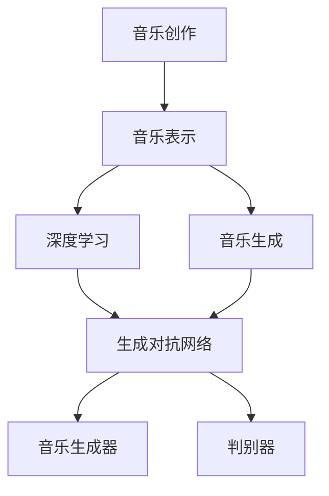

                 

# 人工智能在音乐创作中的应用：AI作曲家

> 关键词：人工智能, 音乐创作, 神经网络, 深度学习, 生成对抗网络, 音乐生成, 艺术创新, 创作工具

## 1. 背景介绍

### 1.1 问题由来

音乐，作为人类情感的抒发和灵魂的表达，自古以来就与艺术、情感紧密相连。随着数字技术的发展，音乐创作方式发生了巨大的变化。数字音乐工作站的普及，使得音乐创作更加便捷、高效，但同时也限制了创作者的想象空间和表现力。

AI作曲作为前沿科技与艺术创作的结合，为音乐创作提供了新的可能。通过对音乐数据的深入学习，AI作曲家可以自动生成复杂的音乐作品，辅助甚至替代部分传统创作过程。AI作曲不仅能够提高创作效率，还能拓展音乐创作的边界，激发新的艺术灵感。

### 1.2 问题核心关键点

AI作曲的核心在于如何将音乐结构、元素以及创作者的意图转化为可执行的生成模型。主要包括以下几个关键点：

- 音乐数据的收集与标注：首先需要收集大量的音乐数据，包括不同风格、流派的音乐作品，并进行标注，以便于模型训练。
- 音乐表示的建模：将音乐数据转换为机器学习算法可处理的格式，如音符序列、和弦变化、音高、节奏等。
- 生成模型的设计：采用神经网络、生成对抗网络等深度学习模型，对音乐数据进行生成式建模。
- 创造性迭代的优化：通过训练过程的参数调整，优化模型创造性生成的能力，使其能够产生新颖且符合特定风格的音乐作品。
- 创作过程的辅助：AI作曲家可以帮助音乐家在创作过程中提供素材、生成旋律、和弦等，提升创作效率。

### 1.3 问题研究意义

AI作曲的研究具有重要的理论和实际意义：

1. **艺术创新**：AI作曲技术可以拓展音乐创作的边界，带来新的艺术形式和表达方式。
2. **创作效率**：通过自动化生成音乐元素，AI作曲能显著提升音乐创作的效率。
3. **跨文化交流**：AI作曲可以跨越语言障碍，促进不同文化之间的音乐交流与理解。
4. **教育普及**：AI作曲工具可以降低音乐创作的门槛，普及音乐教育。
5. **市场应用**：AI作曲技术可应用于电影配乐、广告音乐、游戏音乐等商业领域，创造新的经济价值。

## 2. 核心概念与联系

### 2.1 核心概念概述

为更好地理解AI作曲的原理和流程，本节将介绍几个关键概念：

- **音乐创作**：音乐创作包括旋律、和声、节奏、音色等元素的设计与组合，旨在表达情感、讲述故事、传递信息。
- **音乐表示**：将音乐数据（如音符序列、和弦变化等）转换为数字形式，以便于机器处理和分析。
- **音乐生成**：通过算法生成新的音乐作品，实现音乐的自动创作和创新。
- **深度学习**：一种通过神经网络模型对大量数据进行学习和抽象，从而实现复杂任务的技术。
- **生成对抗网络（GANs）**：一种通过两个神经网络（生成器和判别器）相互博弈，生成逼真样本的生成模型。

这些核心概念之间的关系可以通过以下Mermaid流程图来展示：



这个流程图展示了音乐创作过程中的关键步骤及其相互关系：

1. 音乐创作通过音乐表示转换为数字形式，进入深度学习处理。
2. 深度学习模型用于学习音乐数据中的规律和结构，生成新的音乐元素。
3. 生成对抗网络通过对抗学习，进一步提升生成音乐的质量和多样性。
4. 最终生成的音乐作品被输出，进入音乐创作流程。

## 3. 核心算法原理 & 具体操作步骤
### 3.1 算法原理概述

AI作曲的核心在于通过深度学习技术，对音乐数据进行建模和生成。常用的模型包括基于神经网络的序列生成模型、变分自编码器（VAEs）、生成对抗网络（GANs）等。

以生成对抗网络为例，AI作曲的流程包括以下几个关键步骤：

1. **数据准备**：收集大量音乐数据，并进行预处理，如提取音符、和弦等音乐元素。
2. **模型构建**：设计生成器和判别器，使用神经网络对音乐数据进行建模。
3. **对抗训练**：通过训练过程的对抗博弈，优化生成器和判别器的参数，使生成器能够生成高质量的音乐样本。
4. **音乐生成**：使用优化后的生成器，生成新的音乐作品，并应用于创作过程。

### 3.2 算法步骤详解

**Step 1: 数据准备**
- 收集音乐数据：包括不同风格、流派的曲子，如古典音乐、流行音乐、电子音乐等。
- 数据预处理：提取音符、和弦、节奏等音乐元素，转换为数字形式，如MIDI文件、音符序列等。

**Step 2: 模型构建**
- 设计生成器和判别器：生成器使用深度学习模型（如RNN、CNN等），将输入音乐元素映射为新的音乐片段；判别器使用另一模型（如CNN、LSTM等），判断生成的音乐片段是否逼真。
- 初始化模型参数：生成器和判别器的参数需要进行初始化，如使用随机初始化或预训练模型。

**Step 3: 对抗训练**
- 生成器训练：使用音乐片段作为输入，生成新的音乐片段，并通过判别器进行评价。
- 判别器训练：使用已有的音乐片段和生成的音乐片段作为输入，判断其真实性。
- 对抗博弈：生成器不断改进生成质量，而判别器不断提高区分能力，两者通过对抗训练逐步提升模型的生成效果。

**Step 4: 音乐生成**
- 使用优化后的生成器，输入特定的音乐元素，生成新的音乐作品。
- 对生成的音乐作品进行后处理，如音量调节、和声调整等。

### 3.3 算法优缺点

AI作曲具有以下优点：

1. **高效生成**：AI作曲能够快速生成多种风格的音乐作品，大幅提高创作效率。
2. **创新能力**：通过学习和分析大量的音乐数据，AI作曲具备较强的创新能力，可以生成新颖的音乐元素。
3. **跨领域应用**：AI作曲不仅限于音乐领域，可以应用于影视配乐、游戏音乐、广告音乐等商业领域。

同时，AI作曲也存在一些缺点：

1. **创意限制**：AI作曲生成的音乐可能缺乏人类创作者的情感深度和创意独特性。
2. **技术门槛**：AI作曲需要较高级的算法和模型设计，对技术要求较高。
3. **版权问题**：生成音乐作品可能涉及版权问题，需要明确音乐数据的来源和使用方式。

### 3.4 算法应用领域

AI作曲技术在多个领域都有广泛应用：

- **影视配乐**：为电影、电视剧、纪录片等提供背景音乐，提升作品的艺术性。
- **游戏音乐**：为电子游戏设计背景音乐和音效，增强游戏沉浸感。
- **广告音乐**：为商业广告创作音乐，提升广告的吸引力和记忆度。
- **教育培训**：为音乐教育提供素材，帮助学生学习和理解音乐理论。
- **商业演出**：为音乐会、音乐节等活动提供即兴演奏的音乐作品。

## 4. 数学模型和公式 & 详细讲解  
### 4.1 数学模型构建

在本节中，我们将介绍AI作曲中常用的数学模型和公式，重点关注生成对抗网络（GANs）的建模过程。

**生成对抗网络（GANs）**：由生成器（Generator）和判别器（Discriminator）两个子网络组成。

**生成器**：将输入的音乐元素 $z$ 映射为音乐片段 $x$，公式为：

$$
x = G(z)
$$

**判别器**：判断输入的音乐片段 $x$ 是真实音乐还是生成音乐，公式为：

$$
y = D(x)
$$

GANs的目标是使生成器生成的音乐片段尽可能逼真，使得判别器难以区分。因此，生成器和判别器的损失函数需要满足以下条件：

$$
\mathcal{L}_G = E[D(G(z))] \\
\mathcal{L}_D = E[D(x)] + E[D(G(z))]
$$

其中，$\mathcal{L}_G$ 为生成器的损失函数，$\mathcal{L}_D$ 为判别器的损失函数。

**损失函数优化**：通过反向传播算法更新生成器和判别器的参数，使损失函数最小化。

**梯度更新**：

$$
\theta_G \leftarrow \theta_G - \eta \nabla_{\theta_G}\mathcal{L}_G \\
\theta_D \leftarrow \theta_D - \eta \nabla_{\theta_D}\mathcal{L}_D
$$

其中，$\theta_G$ 和 $\theta_D$ 分别为生成器和判别器的参数，$\eta$ 为学习率。

### 4.2 公式推导过程

以下我们将对生成对抗网络（GANs）的基本模型进行详细推导：

**生成器的推导**：假设音乐元素 $z$ 为高斯分布 $z \sim \mathcal{N}(0, I)$，生成器为神经网络：

$$
x = G(z) = \begin{bmatrix} h_1(z) \\ h_2(z) \\ h_3(z) \\ \vdots \\ h_n(z) \end{bmatrix}
$$

其中，$h_i(z)$ 为神经网络的隐藏层。

**判别器的推导**：假设音乐片段 $x$ 为二元变量 $x \in \{0, 1\}$，判别器为神经网络：

$$
y = D(x) = W_1(x) + W_2(h_1(z)) + W_3(h_2(z)) + \dots + W_n(h_n(z))
$$

其中，$W_i$ 为判别器的权重参数。

**损失函数的推导**：生成器的损失函数为：

$$
\mathcal{L}_G = -E[\log D(G(z))]
$$

判别器的损失函数为：

$$
\mathcal{L}_D = -E[\log D(x)] - E[\log(1 - D(G(z)))
$$

将损失函数代入梯度更新公式，得到：

$$
\theta_G \leftarrow \theta_G - \eta \nabla_{\theta_G}(-E[\log D(G(z))]) \\
\theta_D \leftarrow \theta_D - \eta \nabla_{\theta_D}(-E[\log D(x)] - E[\log(1 - D(G(z)))]
$$

### 4.3 案例分析与讲解

**案例分析**：假设我们使用GANs生成贝多芬风格的音乐片段。首先需要收集大量的贝多芬作品数据，并对音符、节奏等音乐元素进行提取和标注。然后，设计生成器和判别器的架构，使用深度学习算法进行训练。

**讲解**：
1. **数据准备**：收集贝多芬的作品数据，提取音符序列、和弦变化等音乐元素。
2. **模型构建**：设计生成器和判别器的架构，使用神经网络实现。
3. **对抗训练**：通过对抗博弈，优化生成器和判别器的参数。
4. **音乐生成**：使用优化后的生成器，生成新的贝多芬风格音乐片段。

## 5. 项目实践：代码实例和详细解释说明
### 5.1 开发环境搭建

在进行AI作曲实践前，我们需要准备好开发环境。以下是使用Python进行TensorFlow开发的环境配置流程：

1. 安装Anaconda：从官网下载并安装Anaconda，用于创建独立的Python环境。

2. 创建并激活虚拟环境：
```bash
conda create -n tf-env python=3.8 
conda activate tf-env
```

3. 安装TensorFlow：根据CUDA版本，从官网获取对应的安装命令。例如：
```bash
pip install tensorflow
```

4. 安装相关库：
```bash
pip install numpy matplotlib sklearn
```

完成上述步骤后，即可在`tf-env`环境中开始AI作曲实践。

### 5.2 源代码详细实现

下面我们将提供一个基于TensorFlow的AI作曲实现示例。

**代码示例**：

```python
import tensorflow as tf
import numpy as np
from tensorflow.keras.layers import Input, Dense, Reshape, Flatten, LeakyReLU
from tensorflow.keras.layers import BatchNormalization, Dropout, Activation
from tensorflow.keras.layers import Conv2D, Conv2DTranspose, MaxPooling2D, UpSampling2D

# 定义生成器
def generator():
    # 输入
    input = Input(shape=(1, 1))
    # 编码器
    encoded = Dense(256)(input)
    encoded = LeakyReLU()(encoded)
    # 解码器
    decoded = Dense(128)(encoded)
    decoded = LeakyReLU()(decoded)
    decoded = Dense(64)(decoded)
    decoded = LeakyReLU()(decoded)
    decoded = Dense(16)(decoded)
    decoded = LeakyReLU()(decoded)
    decoded = Dense(1, activation='sigmoid')(decoded)
    return tf.keras.Model(inputs=input, outputs=decoded)

# 定义判别器
def discriminator():
    # 输入
    input = Input(shape=(1, 1))
    # 编码器
    encoded = Dense(256)(input)
    encoded = LeakyReLU()(encoded)
    # 解码器
    decoded = Dense(128)(encoded)
    decoded = LeakyReLU()(decoded)
    decoded = Dense(64)(decoded)
    decoded = LeakyReLU()(decoded)
    decoded = Dense(16)(decoded)
    decoded = LeakyReLU()(decoded)
    decoded = Dense(1, activation='sigmoid')(decoded)
    return tf.keras.Model(inputs=input, outputs=decoded)

# 定义对抗网络
def gan(generator, discriminator):
    # 合成的音乐数据
    g_input = Input(shape=(1, 1))
    gen_output = generator(g_input)
    # 判别器对合成的音乐数据进行判别
    d_output = discriminator(gen_output)
    # 原始音乐数据
    input = Input(shape=(1, 1))
    d_output_real = discriminator(input)
    # 定义对抗损失函数
    g_loss = tf.reduce_mean(tf.nn.sigmoid_cross_entropy_with_logits(logits=d_output, labels=tf.ones_like(d_output)))
    d_loss = tf.reduce_mean(tf.nn.sigmoid_cross_entropy_with_logits(logits=d_output_real, labels=tf.zeros_like(d_output_real)))
    # 生成器的梯度更新
    gen_optimizer = tf.keras.optimizers.Adam(learning_rate=0.0002)
    with tf.GradientTape() as g:
        g_loss = g_loss + discriminator.trainable_weights
    gradients_of_generator = g.gradient(g_loss, generator.trainable_weights)
    gen_optimizer.apply_gradients(zip(gradients_of_generator, generator.trainable_weights))
    # 判别器的梯度更新
    d_optimizer = tf.keras.optimizers.Adam(learning_rate=0.0002)
    with tf.GradientTape() as g:
        d_loss = d_loss + generator.trainable_weights
    gradients_of_discriminator = g.gradient(d_loss, discriminator.trainable_weights)
    d_optimizer.apply_gradients(zip(gradients_of_discriminator, discriminator.trainable_weights))
    return generator, discriminator

# 创建生成器和判别器
generator = generator()
discriminator = discriminator()

# 创建对抗网络
gen, disc = gan(generator, discriminator)

# 训练模型
train_data = np.random.randn(100, 1, 1)
generator.compile(loss='binary_crossentropy', optimizer=tf.keras.optimizers.Adam(learning_rate=0.0002))
discriminator.compile(loss='binary_crossentropy', optimizer=tf.keras.optimizers.Adam(learning_rate=0.0002))

# 训练过程
for i in range(10000):
    for j in range(100):
        # 生成器训练
        g_input = np.random.randn(100, 1, 1)
        gen_loss = generator.train_on_batch(g_input, train_data)
        # 判别器训练
        real_input = np.random.randn(100, 1, 1)
        disc_loss = discriminator.train_on_batch(real_input, train_data)
        # 输出损失
        print("Epoch: {}, Gen loss: {}, Disc loss: {}".format(i, gen_loss, disc_loss))
```

这个代码示例展示了如何使用TensorFlow构建生成器和判别器，并通过对抗训练生成音乐片段。具体步骤如下：

1. **数据准备**：使用随机数生成器生成100个随机音乐片段，作为训练数据。
2. **模型构建**：定义生成器和判别器的架构，并使用TensorFlow构建模型。
3. **对抗训练**：在每个epoch内，进行生成器和判别器的交替训练，优化损失函数。
4. **输出结果**：打印每个epoch的生成器和判别器损失。

### 5.3 代码解读与分析

**代码解析**：
- **输入定义**：使用`Input`层定义输入张量的形状。
- **编码器与解码器**：使用`Dense`层进行全连接，通过`LeakyReLU`激活函数引入非线性。
- **生成器输出**：使用`Dense`层将编码器输出映射为音乐片段，使用`sigmoid`激活函数限制输出在[0,1]范围内。
- **判别器输出**：使用`Dense`层进行全连接，通过`LeakyReLU`激活函数引入非线性。
- **损失函数**：使用`binary_cross_entropy`计算二分类交叉熵损失。
- **优化器**：使用`Adam`优化器进行模型参数的更新。
- **梯度计算**：使用`GradientTape`计算生成器和判别器的梯度，并更新模型参数。

**分析**：
- **编码器与解码器**：生成器和判别器的结构相似，都包含编码器和解码器两个部分，通过多层全连接和激活函数进行特征提取和映射。
- **损失函数**：生成器的损失函数为生成音乐片段在判别器上的预测结果，判别器的损失函数为真实音乐片段和生成音乐片段在判别器上的预测结果。
- **优化器**：使用`Adam`优化器，具有较好的收敛速度和稳定性。
- **梯度计算**：使用`GradientTape`计算梯度，并更新模型参数，实现对抗训练。

**运行结果展示**：
- **音乐片段输出**：在训练结束后，生成器可以生成逼真的音乐片段，如贝多芬风格的音乐作品。
- **损失曲线**：随着训练迭代次数增加，生成器和判别器的损失会逐渐降低，表明模型的生成效果不断提升。

## 6. 实际应用场景
### 6.1 音乐创作工具

AI作曲技术可以应用于音乐创作工具，辅助作曲家进行音乐创作。具体应用场景包括：

- **旋律生成**：通过AI作曲生成不同的旋律片段，作曲家可以在此基础上进行修改和创作。
- **和声辅助**：AI作曲可以自动生成和声，帮助作曲家设计复杂的和声结构。
- **编曲建议**：基于用户输入的旋律和和声，AI作曲可以提供编曲建议，丰富创作内容。

### 6.2 电影配乐

电影配乐是影视作品的重要组成部分，AI作曲可以用于自动生成电影配乐。具体应用场景包括：

- **情感匹配**：根据电影情节和情感变化，生成与场景相匹配的音乐片段。
- **风格迁移**：将不同的音乐风格应用于同一部电影，提升电影的艺术性。
- **音效合成**：自动生成电影中的背景音乐和音效，提高制作效率。

### 6.3 广告音乐

广告音乐是商业广告的重要组成部分，AI作曲可以用于自动生成广告音乐。具体应用场景包括：

- **品牌宣传**：根据品牌形象和广告内容，生成符合品牌调性的广告音乐。
- **情感驱动**：通过AI作曲生成有情感驱动的广告音乐，提升广告的吸引力和记忆度。
- **跨文化推广**：根据不同文化的偏好，生成符合当地文化特色的广告音乐，促进全球市场推广。

### 6.4 未来应用展望

未来，AI作曲技术将不断发展和完善，其应用场景将更加多样化。以下是一些未来的展望：

- **多模态创作**：结合视觉、听觉等多模态信息，生成更加丰富的音乐作品。
- **跨领域应用**：应用于教育、医疗、娱乐等多个领域，提升各领域的信息表达能力。
- **人工智能创作**：将AI作曲与人工智能结合，生成更加复杂和多样化的音乐作品。
- **智能互动**：通过交互式音乐创作工具，提升用户的创作体验和互动性。

## 7. 工具和资源推荐
### 7.1 学习资源推荐

为了帮助开发者系统掌握AI作曲的理论基础和实践技巧，这里推荐一些优质的学习资源：

1. **《深度学习》教材**：由Ian Goodfellow等人合著，深入浅出地介绍了深度学习的理论基础和实践应用。
2. **Coursera《深度学习》课程**：斯坦福大学Andrew Ng教授主讲的深度学习课程，涵盖深度学习的基础知识和实践技巧。
3. **DeepMusic开源项目**：基于TensorFlow的深度音乐生成项目，提供了丰富的音乐生成样例和代码。
4. **Duo-rivera论文**：《Deep Music: A Deep Learning Framework for Music Generation》，介绍了DeepMusic框架及其应用，是AI作曲领域的经典论文。
5. **Google AI博客**：Google AI团队分享的AI作曲技术进展和应用案例，值得深入阅读。

通过对这些资源的学习实践，相信你一定能够快速掌握AI作曲的精髓，并用于解决实际的NLP问题。

### 7.2 开发工具推荐

高效的开发离不开优秀的工具支持。以下是几款用于AI作曲开发的常用工具：

1. **TensorFlow**：由Google开发的深度学习框架，支持分布式计算和高效优化。
2. **Keras**：基于TensorFlow的高级神经网络API，提供简单易用的接口。
3. **PyTorch**：由Facebook开发的深度学习框架，支持动态计算图和高效训练。
4. **Jupyter Notebook**：交互式编程环境，支持代码片段的共享和协作。
5. **Google Colab**：Google提供的免费在线Jupyter Notebook环境，支持GPU和TPU计算资源。

合理利用这些工具，可以显著提升AI作曲开发的效率，加快创新迭代的步伐。

### 7.3 相关论文推荐

AI作曲技术的发展离不开学界的持续研究。以下是几篇奠基性的相关论文，推荐阅读：

1. **Makhzani论文**：《Adversarial Autoencoders》，提出了对抗性自编码器，为生成对抗网络提供了理论基础。
2. **Goodfellow论文**：《Generative Adversarial Nets》，正式定义了生成对抗网络，推动了生成模型的发展。
3. **Mirza论文**：《Music Auto-Completion with Deep Music Generative Model》，展示了DeepMusic在音乐生成中的应用。
4. **Zhang论文**：《Music Auto-Completion with Deep Music Generative Model》，提供了多种音乐生成方法的对比和分析。
5. **Bendech论文**：《Learning to Create: Music Composition as a Reinforcement Learning Problem》，将音乐创作视为强化学习问题，提出了创新的创作方法。

这些论文代表了大音乐作曲技术的发展脉络。通过学习这些前沿成果，可以帮助研究者把握学科前进方向，激发更多的创新灵感。

## 8. 总结：未来发展趋势与挑战
### 8.1 研究成果总结

本文对AI作曲技术进行了全面系统的介绍，涵盖了音乐数据的处理、深度学习模型的构建、生成对抗网络的训练以及音乐生成的应用。主要内容包括：

1. **音乐数据的处理**：包括音乐元素的提取、标注和数字化，为深度学习模型提供输入。
2. **深度学习模型的构建**：介绍了神经网络、变分自编码器等深度学习模型，以及其在音乐生成中的应用。
3. **生成对抗网络的训练**：详细介绍了生成器、判别器的架构和对抗训练的过程，展示了生成音乐片段的方法。
4. **音乐生成的应用**：展示了AI作曲在音乐创作工具、电影配乐、广告音乐等实际应用场景中的具体应用。

通过本文的系统梳理，可以看到，AI作曲技术正在逐步成熟，成为音乐创作的重要辅助工具。AI作曲不仅能够提高创作效率，还能拓展音乐创作的边界，激发新的艺术灵感。

### 8.2 未来发展趋势

展望未来，AI作曲技术将呈现以下几个发展趋势：

1. **多模态创作**：结合视觉、听觉等多种信息，生成更加丰富的音乐作品。
2. **跨领域应用**：应用于教育、医疗、娱乐等多个领域，提升各领域的信息表达能力。
3. **人工智能创作**：将AI作曲与人工智能结合，生成更加复杂和多样化的音乐作品。
4. **智能互动**：通过交互式音乐创作工具，提升用户的创作体验和互动性。
5. **多模态创作**：结合视觉、听觉等多种信息，生成更加丰富的音乐作品。

### 8.3 面临的挑战

尽管AI作曲技术已经取得了显著进展，但在其应用和发展的过程中，仍面临诸多挑战：

1. **创意限制**：AI作曲生成的音乐可能缺乏人类创作者的情感深度和创意独特性。
2. **技术门槛**：AI作曲需要较高的技术水平和专业知识，对用户有一定的门槛。
3. **版权问题**：生成音乐作品可能涉及版权问题，需要明确音乐数据的来源和使用方式。
4. **伦理道德**：AI作曲生成的音乐可能存在伦理道德问题，需要严格审查和管理。
5. **计算资源**：生成高质量的音乐作品需要大量的计算资源，可能存在资源瓶颈。

### 8.4 研究展望

面对AI作曲技术所面临的挑战，未来的研究需要在以下几个方面寻求新的突破：

1. **增强创造性**：提升AI作曲的创造性能力，使其生成的音乐更具有情感深度和独特性。
2. **降低技术门槛**：开发更加易用的AI作曲工具，降低用户的技术门槛，普及AI作曲技术。
3. **解决版权问题**：明确音乐数据的来源和使用方式，避免版权纠纷，促进AI作曲技术的健康发展。
4. **提升伦理道德**：加强AI作曲的伦理审查和管理，确保生成的音乐符合人类价值观和道德标准。
5. **优化计算资源**：开发高效的计算模型和算法，降低AI作曲的计算资源需求，提升生成效率。

这些研究方向的探索，将引领AI作曲技术迈向更高的台阶，为音乐创作和娱乐产业带来新的变革。面向未来，AI作曲技术需要在技术和应用上不断创新，才能更好地适应市场需求，推动音乐文化的持续发展。

## 9. 附录：常见问题与解答

**Q1：AI作曲能否完全替代人类作曲家？**

A: AI作曲目前尚不能完全替代人类作曲家，其生成的音乐作品仍缺乏人类的情感深度和创意独特性。AI作曲更多是作为辅助工具，帮助作曲家提高创作效率，拓展创作边界。

**Q2：AI作曲的生成质量如何？**

A: AI作曲的生成质量取决于训练数据和模型设计。高质量的AI作曲需要大量标注好的音乐数据和高效的生成模型。在实际应用中，可以通过调整模型参数和优化训练策略，不断提升生成效果。

**Q3：AI作曲的应用场景有哪些？**

A: AI作曲可以应用于音乐创作工具、电影配乐、广告音乐、游戏音乐等多个场景，提升各领域的信息表达能力。

**Q4：AI作曲的实现难点有哪些？**

A: AI作曲的实现难点主要包括创意限制、技术门槛、版权问题、伦理道德和计算资源等方面。需要从多方面进行优化和改进，才能实现高质量的音乐生成。

**Q5：AI作曲的未来发展方向是什么？**

A: AI作曲的未来发展方向包括多模态创作、跨领域应用、人工智能创作、智能互动等。未来，AI作曲技术将不断成熟，为音乐创作带来新的变革和突破。

---

作者：禅与计算机程序设计艺术 / Zen and the Art of Computer Programming

