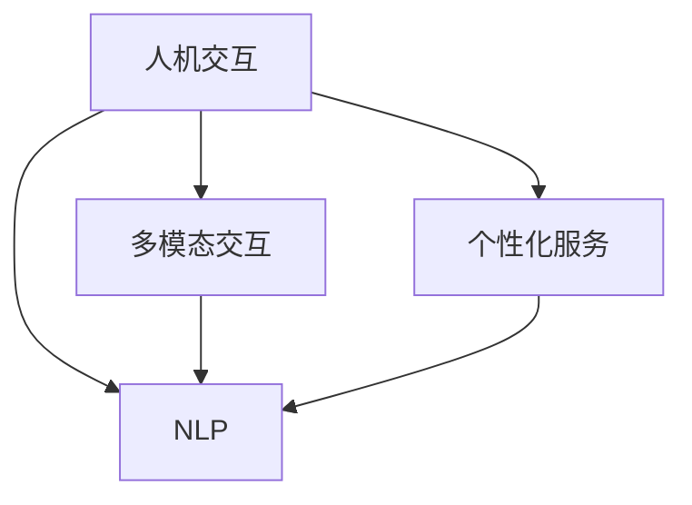

                 

# 人机交互：打造高效便捷的人类计算平台

## 1. 背景介绍

### 1.1 问题由来
随着科技的飞速发展，人类已进入数字化时代，各类信息如雨后春笋般涌现。面对海量数据和复杂任务的挑战，传统的人机交互方式逐渐无法满足需求，迫切需要更加高效便捷的计算平台。然而，尽管现有的计算机和软件系统已经非常强大，但与人类的自然交互方式仍有较大差距，信息获取、任务执行等操作仍需用户花费大量时间和精力。

为了解决这一问题，近年来，人机交互技术不断进步，尤其在大数据、人工智能等领域取得突破。本论文将深入探讨人机交互的原理和实现方法，力图通过构建高效便捷的计算平台，提升人类的信息处理能力，释放更大的潜力。

### 1.2 问题核心关键点
1. **人机交互的本质**：
   - **自然语言处理（NLP）**：使机器能够理解和处理人类语言，实现真正的自然交互。
   - **多模态交互**：结合语音、图像、手势等多种输入方式，提升交互的灵活性和便利性。
   - **个性化服务**：根据用户行为和偏好，提供量身定制的服务和推荐，提升用户体验。

2. **核心技术**：
   - **机器学习**：通过大量数据训练模型，使其能够自动学习和适应不同用户需求。
   - **人机界面设计（HCI）**：设计直观、易用的用户界面，提升交互的友好度和效率。
   - **数据可视化**：通过图表、图形等形式，直观展示复杂数据，方便用户理解和操作。

3. **应用场景**：
   - **智能家居**：实现语音控制、自动调节环境温度等，提升生活便利性。
   - **健康医疗**：通过智能穿戴设备采集健康数据，提供个性化的健康建议。
   - **教育培训**：根据学习进度和偏好，推荐个性化学习内容和资源，提高学习效率。

## 2. 核心概念与联系

### 2.1 核心概念概述

为更好地理解人机交互技术，本节将介绍几个核心概念：

- **人机交互（Human-Computer Interaction, HCI）**：指人与计算机之间的信息交换方式，涵盖各种输入、输出方式，包括自然语言处理、多模态交互、数据可视化等。
- **自然语言处理（NLP）**：使计算机能够理解和生成人类语言的技术，涵盖语音识别、文本分类、情感分析等子领域。
- **多模态交互（Multimodal Interaction）**：结合多种输入方式，如语音、图像、手势等，提升交互的自然性和便利性。
- **个性化服务（Personalized Service）**：根据用户行为和偏好，提供定制化的服务，提升用户体验和满意度。

这些核心概念之间的逻辑关系可以通过以下Mermaid流程图来展示：



这个流程图展示了我为人机交互的核心概念及其之间的关系：

1. 人机交互是整体概念，包括自然语言处理、多模态交互和个性化服务等多个方面。
2. 自然语言处理是交互的核心，使计算机能够理解和生成自然语言。
3. 多模态交互提升了交互的自然性和多样性。
4. 个性化服务根据用户需求提供定制化的服务，提升用户体验。

## 3. 核心算法原理 & 具体操作步骤
### 3.1 算法原理概述

人机交互的核心算法原理是利用人工智能技术，通过多模态输入和自然语言处理，实现与用户的自然交互。主要包括以下几个步骤：

1. **数据收集与预处理**：收集用户的行为数据和反馈，进行清洗、标注等预处理，为后续模型训练提供基础。
2. **模型训练**：通过机器学习算法，训练多模态交互模型和NLP模型，提升其理解和处理自然语言的能力。
3. **交互设计**：设计直观、易用的用户界面，提升用户体验，简化操作流程。
4. **应用部署**：将训练好的模型和交互设计部署到实际应用中，实现高效便捷的交互服务。

### 3.2 算法步骤详解

以下详细介绍人机交互的核心算法步骤：

**Step 1: 数据收集与预处理**

- 收集用户行为数据，如点击、输入、语音指令等。
- 对数据进行清洗，去除噪声和无用信息。
- 对数据进行标注，标注用户的意图和需求。
- 对文本数据进行分词、去停用词等预处理操作。

**Step 2: 模型训练**

- 选择适合的机器学习算法，如深度学习、强化学习等。
- 将标注数据输入模型，训练多模态交互模型和NLP模型。
- 使用交叉验证等方法，评估模型性能。
- 根据评估结果，调整模型参数，优化模型性能。

**Step 3: 交互设计**

- 设计直观、易用的用户界面，如图形界面、语音界面等。
- 使用设计工具，如Sketch、Adobe XD等，绘制交互原型。
- 根据用户体验反馈，不断优化交互界面和流程。

**Step 4: 应用部署**

- 将训练好的模型和交互设计部署到实际应用中，如智能手机、智能家居等。
- 监控应用性能，收集用户反馈，不断优化和改进。

### 3.3 算法优缺点

人机交互技术的主要优点包括：

1. **提升效率**：通过自然语言处理和多模态交互，用户可以更快速地完成复杂任务。
2. **提升体验**：设计直观、易用的交互界面，提升用户的满意度和使用体验。
3. **个性化服务**：根据用户行为和偏好，提供定制化的服务，满足不同用户的需求。

然而，该技术也存在一些缺点：

1. **数据隐私问题**：用户行为数据的收集和处理可能涉及隐私问题，需要严格保护用户数据。
2. **技术复杂性**：人机交互技术涉及多学科知识，包括计算机科学、心理学、工程学等，开发和部署难度较大。
3. **语言障碍**：不同地区、不同语言的用户可能需要不同版本的交互界面，增加了技术复杂性。

## 4. 数学模型和公式 & 详细讲解

### 4.1 数学模型构建

人机交互的核心模型包括多模态交互模型和NLP模型。这里以NLP中的情感分析模型为例，进行详细讲解。

假设输入文本为 $x$，输出情感为 $y$，模型参数为 $\theta$。情感分析模型可以使用逻辑回归或支持向量机等算法，其数学模型可以表示为：

$$
P(y|x;\theta) = \sigma(\theta^T\phi(x))
$$

其中，$\sigma$ 为sigmoid函数，$\phi$ 为特征提取函数，$x$ 为输入文本，$y$ 为情感标签，$\theta$ 为模型参数。

### 4.2 公式推导过程

情感分析模型的预测公式为：

$$
\hat{y} = \mathop{\arg\max}_{y} P(y|x;\theta)
$$

通过最大化预测概率，可以判断输入文本的情感极性。

对于多模态交互模型，可以使用深度学习模型，如卷积神经网络（CNN）、循环神经网络（RNN）等，其数学模型可以表示为：

$$
P(y|x_1, x_2, ..., x_n;\theta) = \prod_{i=1}^n P(x_i|y;\theta)
$$

其中，$x_i$ 为多模态输入，$y$ 为交互结果，$\theta$ 为模型参数。

### 4.3 案例分析与讲解

以情感分析模型为例，详细讲解其推导和应用过程。

假设输入文本为 "I love this product!"，输出情感为积极。使用逻辑回归模型进行情感分析，其特征提取函数 $\phi$ 可以使用词袋模型（Bag-of-Words），将文本转换为向量：

$$
\phi(x) = [a_1, a_2, ..., a_n]
$$

其中，$a_i$ 为第 $i$ 个单词的出现次数。

将特征向量输入模型，计算预测概率：

$$
P(积极|x;\theta) = \sigma(\theta^T\phi(x))
$$

通过sigmoid函数将预测概率转化为情感极性，即可得出输入文本的情感极性。

## 5. 项目实践：代码实例和详细解释说明

### 5.1 开发环境搭建

在进行人机交互项目开发前，需要准备好开发环境。以下是使用Python进行开发的环境配置流程：

1. 安装Python：从官网下载并安装Python，推荐使用Python 3.7或以上版本。
2. 安装Pip：在命令行中输入 `python -m ensurepip --default-pip` 安装Pip，用于安装第三方库。
3. 安装Jupyter Notebook：在命令行中输入 `pip install jupyter notebook` 安装Jupyter Notebook，用于编写和运行代码。
4. 安装TensorFlow：在命令行中输入 `pip install tensorflow` 安装TensorFlow，用于构建多模态交互模型。
5. 安装NLTK：在命令行中输入 `pip install nltk` 安装Natural Language Toolkit，用于文本处理和情感分析。

完成上述步骤后，即可在Jupyter Notebook中开始项目开发。

### 5.2 源代码详细实现

以下是一个使用TensorFlow和NLTK库进行情感分析的Python代码实现：

```python
import tensorflow as tf
import nltk
from nltk.corpus import movie_reviews
from sklearn.feature_extraction.text import CountVectorizer
from sklearn.model_selection import train_test_split
from tensorflow.keras.preprocessing.text import Tokenizer
from tensorflow.keras.preprocessing.sequence import pad_sequences
from tensorflow.keras.layers import Embedding, LSTM, Dense, Dropout
from tensorflow.keras.models import Sequential

# 数据预处理
nltk.download('movie_reviews')
data = movie_reviews.fileids()
reviews = {}
for fileid in data:
    text = movie_reviews.raw(fileid)
    sentiment = 'neg' if fileid.startswith('neg') else 'pos'
    reviews[fileid] = (text, sentiment)

# 特征提取
vectorizer = CountVectorizer(stop_words='english')
X_train = vectorizer.fit_transform([review[0] for review in reviews])
y_train = [1 if review[1] == 'pos' else 0 for review in reviews]
X_train, X_test, y_train, y_test = train_test_split(X_train, y_train, test_size=0.2)

# 模型构建
model = Sequential([
    Embedding(input_dim=len(vectorizer.vocabulary_), output_dim=128, input_length=X_train.shape[1]),
    LSTM(128),
    Dropout(0.2),
    Dense(1, activation='sigmoid')
])
model.compile(loss='binary_crossentropy', optimizer='adam', metrics=['accuracy'])

# 模型训练
model.fit(X_train, y_train, validation_data=(X_test, y_test), epochs=10, batch_size=64)

# 模型评估
loss, accuracy = model.evaluate(X_test, y_test)
print(f'测试集损失：{loss:.4f}, 准确率：{accuracy:.4f}')
```

### 5.3 代码解读与分析

让我们再详细解读一下关键代码的实现细节：

**数据预处理**：
- 使用Natural Language Toolkit下载电影评论数据集。
- 将数据集分为训练集和测试集，并进行特征提取和标签化。

**模型构建**：
- 使用TensorFlow构建一个包含嵌入层、LSTM层、dropout层和输出层的神经网络模型。
- 设置损失函数为二元交叉熵，优化器为Adam，评价指标为准确率。

**模型训练和评估**：
- 使用训练集对模型进行训练，并在测试集上进行评估。
- 输出测试集损失和准确率，评估模型性能。

## 6. 实际应用场景

### 6.1 智能家居

智能家居系统通过多模态交互技术，实现语音控制、自动调节环境温度等，提升生活便利性。例如，通过语音助手（如Amazon Alexa、Google Assistant），用户可以轻松控制家中的灯光、空调、电视等设备，实现全天候智能家居管理。

### 6.2 健康医疗

通过智能穿戴设备采集健康数据，如心率、步数、睡眠质量等，结合NLP技术进行情感分析，提供个性化的健康建议。例如，通过智能手表监测用户心率，并根据其情绪状态提供心理疏导建议，提升用户心理健康。

### 6.3 教育培训

根据学习进度和偏好，提供个性化的学习内容和资源，提高学习效率。例如，通过智能学习平台，根据学生的学习行为和表现，推荐个性化的学习材料和练习题，实现精准教学。

### 6.4 未来应用展望

随着技术的发展，人机交互将进一步扩展其应用范围，提升人类的生产力和生活品质。

1. **多语言支持**：开发多语言版本的交互界面，支持不同语言的用户，提升全球化的用户体验。
2. **跨平台兼容性**：实现跨平台、跨设备的无缝交互，提升用户使用的便捷性。
3. **情感识别**：通过深度学习模型，提升情感识别的准确性和鲁棒性，增强人机交互的自然性。
4. **虚拟现实（VR）与增强现实（AR）**：结合VR和AR技术，提供更加沉浸式、交互式的用户体验，如虚拟教室、虚拟助手等。
5. **人机协作**：开发协作型AI，与人类共同完成复杂任务，提升工作效率和质量。

## 7. 工具和资源推荐

### 7.1 学习资源推荐

为了帮助开发者掌握人机交互技术，这里推荐一些优质的学习资源：

1. **《人机交互设计基础》课程**：Coursera上斯坦福大学开设的HCI基础课程，涵盖交互设计的基本原理和实践方法。
2. **《多模态人机交互》书籍**：详细讲解了多模态交互技术的应用和发展，提供了大量的实例和案例。
3. **NLP 101**：自然语言处理基础课程，由斯坦福大学自然语言处理课程组提供，涵盖NLP的基本概念和常用技术。
4. **TensorFlow官方文档**：提供详细的TensorFlow使用指南和代码示例，适合初学者和进阶用户。
5. **NLTK官方文档**：提供Natural Language Toolkit的使用指南和代码示例，适合NLP初学者。

### 7.2 开发工具推荐

高效的开发离不开优秀的工具支持。以下是几款用于人机交互开发的常用工具：

1. **Jupyter Notebook**：轻量级的交互式编程环境，适合编写和运行Python代码。
2. **Sketch**：流行的设计工具，适合设计直观、易用的用户界面。
3. **Adobe XD**：流行的设计工具，支持高保真原型设计，适合设计多模态交互界面。
4. **Google Colab**：谷歌推出的在线Jupyter Notebook环境，免费提供GPU/TPU算力，适合快速实验新模型。

### 7.3 相关论文推荐

人机交互技术的发展得益于学界的持续研究。以下是几篇奠基性的相关论文，推荐阅读：

1. **《Speech and Language Processing》书籍**：详细讲解了自然语言处理的基本概念和技术，涵盖语音识别、文本分类、情感分析等子领域。
2. **《Human-Computer Interaction》期刊**：涵盖人机交互领域的前沿研究和最新进展，适合深入学习。
3. **《Multimodal Interaction: A Survey》论文**：详细综述了多模态交互技术的应用和发展，提供丰富的参考文献和实例。

## 8. 总结：未来发展趋势与挑战

### 8.1 总结

本文详细探讨了人机交互技术的基本原理和实现方法，介绍了NLP和多模态交互的核心概念和技术。通过具体的情感分析模型和代码实例，展示了人机交互的实际应用。同时，本文还探讨了人机交互技术在智能家居、健康医疗、教育培训等领域的应用前景，展望了未来发展的趋势和挑战。

通过本文的系统梳理，可以看到，人机交互技术已经成为现代信息技术的重要组成部分，正在深刻改变人类的生产和生活方式。未来，随着技术的不断进步，人机交互将进一步提升人类的信息处理能力和生活品质。

### 8.2 未来发展趋势

展望未来，人机交互技术将呈现以下几个发展趋势：

1. **多模态融合**：结合语音、图像、手势等多种输入方式，提升交互的自然性和多样性。
2. **情感识别**：通过深度学习模型，提升情感识别的准确性和鲁棒性，增强人机交互的自然性。
3. **个性化服务**：根据用户行为和偏好，提供定制化的服务，提升用户体验和满意度。
4. **跨平台兼容性**：实现跨平台、跨设备的无缝交互，提升用户使用的便捷性。
5. **虚拟现实（VR）与增强现实（AR）**：结合VR和AR技术，提供更加沉浸式、交互式的用户体验。

### 8.3 面临的挑战

尽管人机交互技术已经取得了显著进展，但在迈向更加智能化、普适化应用的过程中，它仍面临诸多挑战：

1. **数据隐私问题**：用户行为数据的收集和处理可能涉及隐私问题，需要严格保护用户数据。
2. **技术复杂性**：人机交互技术涉及多学科知识，包括计算机科学、心理学、工程学等，开发和部署难度较大。
3. **语言障碍**：不同地区、不同语言的用户可能需要不同版本的交互界面，增加了技术复杂性。

### 8.4 研究展望

面对人机交互技术所面临的挑战，未来的研究需要在以下几个方面寻求新的突破：

1. **隐私保护**：开发隐私保护技术，如差分隐私、联邦学习等，确保用户数据的安全和隐私。
2. **多语言支持**：开发多语言版本的交互界面，支持不同语言的用户，提升全球化的用户体验。
3. **跨平台兼容性**：实现跨平台、跨设备的无缝交互，提升用户使用的便捷性。
4. **情感识别**：通过深度学习模型，提升情感识别的准确性和鲁棒性，增强人机交互的自然性。
5. **用户界面设计**：设计直观、易用的用户界面，提升用户体验和满意度。

这些研究方向的探索，必将引领人机交互技术迈向更高的台阶，为构建智能、便捷的计算平台提供坚实的理论和技术基础。

## 9. 附录：常见问题与解答

**Q1：人机交互的本质是什么？**

A: 人机交互的本质是使计算机能够理解和处理人类语言，实现与用户的自然交互。这包括自然语言处理（NLP）和多模态交互（Multimodal Interaction），使计算机能够理解用户的意图和需求，并提供相应的服务。

**Q2：人机交互的核心技术有哪些？**

A: 人机交互的核心技术包括：
1. 自然语言处理（NLP）：使计算机能够理解和生成人类语言。
2. 多模态交互（Multimodal Interaction）：结合语音、图像、手势等多种输入方式，提升交互的自然性和便利性。
3. 个性化服务（Personalized Service）：根据用户行为和偏好，提供定制化的服务，提升用户体验和满意度。

**Q3：人机交互技术在实际应用中面临哪些挑战？**

A: 人机交互技术在实际应用中面临以下挑战：
1. 数据隐私问题：用户行为数据的收集和处理可能涉及隐私问题，需要严格保护用户数据。
2. 技术复杂性：人机交互技术涉及多学科知识，包括计算机科学、心理学、工程学等，开发和部署难度较大。
3. 语言障碍：不同地区、不同语言的用户可能需要不同版本的交互界面，增加了技术复杂性。

**Q4：如何提升人机交互的自然性？**

A: 提升人机交互的自然性需要结合以下技术：
1. 自然语言处理（NLP）：使计算机能够理解和生成人类语言，提升交互的自然性。
2. 多模态交互（Multimodal Interaction）：结合语音、图像、手势等多种输入方式，提升交互的自然性和便利性。
3. 个性化服务（Personalized Service）：根据用户行为和偏好，提供定制化的服务，提升用户体验和满意度。

**Q5：如何实现多模态交互？**

A: 实现多模态交互需要以下技术：
1. 语音识别：通过语音识别技术，将用户的语音指令转换为文本。
2. 图像识别：通过图像识别技术，将用户的图像输入转换为文本。
3. 手势识别：通过手势识别技术，将用户的手势输入转换为文本。
4. 结合以上技术，设计直观、易用的多模态交互界面，提升用户体验。

**Q6：人机交互技术在未来的发展方向是什么？**

A: 人机交互技术的未来发展方向包括：
1. 多模态融合：结合语音、图像、手势等多种输入方式，提升交互的自然性和多样性。
2. 情感识别：通过深度学习模型，提升情感识别的准确性和鲁棒性，增强人机交互的自然性。
3. 个性化服务：根据用户行为和偏好，提供定制化的服务，提升用户体验和满意度。
4. 跨平台兼容性：实现跨平台、跨设备的无缝交互，提升用户使用的便捷性。
5. 虚拟现实（VR）与增强现实（AR）：结合VR和AR技术，提供更加沉浸式、交互式的用户体验。

---

作者：禅与计算机程序设计艺术 / Zen and the Art of Computer Programming

