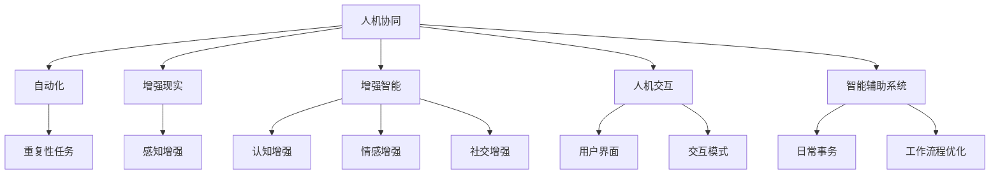

                 

# 人机协同：未来工作的核心驱动力

## 1. 背景介绍

### 1.1 问题由来
近年来，随着人工智能技术的飞速发展，尤其是机器学习和大数据技术的普及，人机协同已成为未来工作的核心驱动力。机器智能化程度的提升，使得它们能够执行越来越复杂的任务，从而与人类工作者形成更加紧密的合作关系。这种人机协作的新范式，正在重塑各行各业的生产和工作方式，带来前所未有的变革。

### 1.2 问题核心关键点
人机协同的本质在于机器辅助人类完成工作任务，提高工作效率和质量，同时让人类能够专注于更有创造性和战略性的工作。这种协同关系，需要充分理解人类工作者的认知、情感和社交需求，以及机器在执行逻辑、记忆存储、自动化程度等方面的优势和局限。

### 1.3 问题研究意义
研究人机协同的机制和应用，对于推动人工智能技术在实际工作场景中的应用，提升工作效率，优化工作流程，减少人类工作者的体力和脑力负担，以及实现智慧化生产和管理，具有重要意义。通过深入理解人机协同的原理和实践方法，可以更好地设计和部署智能系统，提升各行各业的智能化水平，促进社会的数字化转型和可持续发展。

## 2. 核心概念与联系

### 2.1 核心概念概述

为更好地理解人机协同的概念和实践方法，本节将介绍几个关键概念：

- **人机协同(Human-Machine Collaboration, HMC)**：指人类工作者与人工智能系统在特定任务上的共同工作，充分利用各自优势，实现更高效、更高质量的工作成果。
- **自动化(Automation)**：指机器自动执行重复性高、低价值的任务，从而将人类工作者从这些任务中解放出来，专注于更具创造性和战略性的工作。
- **增强现实(Augmented Reality, AR)**：通过计算机视觉、传感器等技术，增强人类对现实世界的感知能力，使人类和机器系统更紧密协作。
- **增强智能(Enhanced Intelligence)**：通过机器学习等技术，增强人类工作者的认知、情感和社交能力，提升其工作效率和质量。
- **人机交互(Human-Computer Interaction, HCI)**：指人类与计算机之间的交互方式，包括用户界面设计、交互模式选择等，旨在提高人机协同的效率和体验。
- **智能辅助系统(Intelligent Assistant Systems)**：指集成了人工智能技术的辅助工具，如智能助理、语音助手等，帮助人类工作者处理日常事务，优化工作流程。

这些核心概念之间的逻辑关系可以通过以下Mermaid流程图来展示：



这个流程图展示了人机协同的核心概念及其之间的关系：

1. 人机协同充分利用了自动化、增强现实、增强智能等技术手段，提升了工作效率和质量。
2. 自动化技术处理重复性任务，增强现实技术增强感知能力，增强智能技术增强认知、情感和社交能力。
3. 人机交互设计优化了用户界面和交互模式，智能辅助系统提供了日常事务处理和工作流程优化。

这些概念共同构成了人机协同的工作框架，使得人机协作能够更好地实现。

## 3. 核心算法原理 & 具体操作步骤
### 3.1 算法原理概述

人机协同的算法原理主要基于人类工作者与人工智能系统在特定任务上的协同工作机制，利用各自的优势，优化工作流程，提高工作效率。其核心思想是将人工智能系统视作一个辅助工具，通过精心的设计和使用，最大化地提升人类工作者的工作效率和质量。

### 3.2 算法步骤详解

基于人机协同的算法步骤，一般包括以下几个关键步骤：

**Step 1: 任务分析与建模**
- 分析任务需求，明确任务目标和关键指标。
- 构建任务模型，确定任务流程和关键节点。

**Step 2: 系统设计**
- 选择合适的智能辅助系统，如智能助理、自动化工具等。
- 设计任务适配模块，将系统集成到具体的工作流程中。

**Step 3: 协同工作流程设计**
- 设计人机协同的工作流程，明确各自职责和任务分工。
- 设计交互界面和交互模式，优化人机协同体验。

**Step 4: 系统训练与优化**
- 使用历史数据和标注样本，训练智能辅助系统。
- 进行系统优化，提高模型精度和泛化能力。

**Step 5: 系统部署与评估**
- 将系统部署到实际工作环境中，监控系统性能。
- 定期评估系统效果，收集反馈意见，进行系统迭代。

**Step 6: 持续改进与优化**
- 基于反馈和评估结果，持续改进系统设计和算法。
- 引入新技术和新工具，提升人机协同效率。

### 3.3 算法优缺点

基于人机协同的算法具有以下优点：
1. 提高工作效率。通过自动化和智能辅助，减轻人类工作者的负担，提高工作效率。
2. 优化工作流程。通过人机协同，可以优化工作流程，减少重复性任务，提升工作质量。
3. 降低人力成本。自动化的工具可以减少人力需求，降低人力成本。
4. 提高工作体验。通过增强现实和智能交互设计，提升人类工作者的工作体验。

同时，该算法也存在一定的局限性：
1. 依赖数据质量。智能系统的训练和优化需要高质量的数据，数据的获取和处理成本较高。
2. 系统复杂度高。系统的设计和集成较为复杂，需要跨学科的知识和技能。
3. 系统鲁棒性不足。系统的适应性需要不断优化，特别是在不同的工作环境和任务类型中。
4. 可能增加依赖性。过度依赖智能系统，可能削弱人类工作者的自主性和创造性。
5. 数据隐私和安全问题。智能系统需要大量的数据，涉及隐私保护和数据安全问题。

尽管存在这些局限性，但就目前而言，人机协同算法仍是最主流的人机合作方式。未来相关研究的重点在于如何进一步降低数据获取成本，提高系统的鲁棒性和可解释性，同时兼顾数据隐私和安全因素。

### 3.4 算法应用领域

基于人机协同的算法，在多个领域都得到了广泛应用，例如：

- **制造业**：机器人自动化生产线，智能监控和维护，提高生产效率和产品质量。
- **医疗保健**：智能诊断系统，手术辅助机器人，提升诊疗效果和手术精度。
- **金融服务**：智能投顾，自动化交易，提升金融服务质量和效率。
- **教育培训**：智能助教，个性化学习，优化教学效果和学生体验。
- **物流运输**：智能调度系统，无人驾驶车辆，提高运输效率和安全性。
- **客户服务**：智能客服系统，客户数据分析，提升客户满意度和服务质量。

除了上述这些经典应用外，人机协同还被创新性地应用到更多场景中，如智能驾驶、智能家居、智能制造等，为人机合作提供了新的可能性。

## 4. 数学模型和公式 & 详细讲解 & 举例说明

### 4.1 数学模型构建

人机协同的数学模型通常包括以下几个关键部分：

- **任务目标函数**：用于衡量人机协同的效果，如任务完成时间、工作质量、成本等。
- **人类工作者模型**：描述人类工作者的认知、情感、社交等能力。
- **人工智能系统模型**：描述人工智能系统的执行能力、学习能力和交互能力。

### 4.2 公式推导过程

假设任务目标为最小化任务完成时间 $T$，即：

$$
\min_{H, M} T = \sum_{i=1}^n T_i^H + \sum_{i=1}^n T_i^M
$$

其中 $T_i^H$ 为人类工作者完成第 $i$ 项任务所需的时间，$T_i^M$ 为人工智能系统完成第 $i$ 项任务所需的时间。

对于人类工作者，其完成某项任务的时间可以用以下公式表示：

$$
T_i^H = \frac{C_i^H + M_i^H}{E_i^H} + D_i^H
$$

其中 $C_i^H$ 为认知时间，$M_i^H$ 为机器辅助时间，$E_i^H$ 为认知效率，$D_i^H$ 为不确定性时间。

对于人工智能系统，其完成某项任务的时间可以用以下公式表示：

$$
T_i^M = \frac{C_i^M + M_i^M}{E_i^M} + D_i^M
$$

其中 $C_i^M$ 为执行时间，$M_i^M$ 为机器辅助时间，$E_i^M$ 为执行效率，$D_i^M$ 为不确定性时间。

### 4.3 案例分析与讲解

以制造业中的智能生产线为例，分析人机协同的数学模型应用。

假设生产线上的某项任务为焊接，其时间分解如下：

- 认知时间 $C_i^H = 10s$
- 机器辅助时间 $M_i^H = 5s$
- 认知效率 $E_i^H = 0.8$
- 不确定性时间 $D_i^H = 2s$

- 执行时间 $C_i^M = 20s$
- 机器辅助时间 $M_i^M = 5s$
- 执行效率 $E_i^M = 0.9$
- 不确定性时间 $D_i^M = 1s$

则任务完成时间为：

$$
T_i^H = \frac{10 + 5}{0.8} + 2 = 25s
$$

$$
T_i^M = \frac{20 + 5}{0.9} + 1 = 30s
$$

总的完成时间为 $T = 25s + 30s = 55s$。

在实际应用中，可以通过调整机器辅助时间和执行效率，优化人机协同的效果。例如，如果机器辅助时间缩短为3s，执行效率提升为1.0，则新的任务完成时间为：

$$
T_i^H = \frac{10 + 3}{0.8} + 2 = 17s
$$

$$
T_i^M = \frac{20 + 3}{1.0} + 1 = 24s
$$

总的完成时间为 $T = 17s + 24s = 41s$，比之前节省了14s的时间。

## 5. 项目实践：代码实例和详细解释说明

### 5.1 开发环境搭建

在进行人机协同的实践前，我们需要准备好开发环境。以下是使用Python进行PyTorch开发的环境配置流程：

1. 安装Anaconda：从官网下载并安装Anaconda，用于创建独立的Python环境。

2. 创建并激活虚拟环境：
```bash
conda create -n pytorch-env python=3.8 
conda activate pytorch-env
```

3. 安装PyTorch：根据CUDA版本，从官网获取对应的安装命令。例如：
```bash
conda install pytorch torchvision torchaudio cudatoolkit=11.1 -c pytorch -c conda-forge
```

4. 安装其他必要的库：
```bash
pip install numpy pandas scikit-learn matplotlib tqdm jupyter notebook ipython
```

完成上述步骤后，即可在`pytorch-env`环境中开始人机协同的实践。

### 5.2 源代码详细实现

下面我们以智能客服系统为例，给出使用Transformers库对BERT模型进行协同训练的PyTorch代码实现。

首先，定义智能客服系统的数据处理函数：

```python
from transformers import BertTokenizer
from torch.utils.data import Dataset
import torch

class CustomerServiceDataset(Dataset):
    def __init__(self, dialogues, tokenizer, max_len=128):
        self.dialogues = dialogues
        self.tokenizer = tokenizer
        self.max_len = max_len
        
    def __len__(self):
        return len(self.dialogues)
    
    def __getitem__(self, item):
        dialogue = self.dialogues[item]
        
        texts, labels = [], []
        for user, agent in dialogue:
            texts.append(user + "|||"
                         + agent + "|||"
                         + user + "|||"
                         + agent)
            labels.append(1)
        
        encoding = self.tokenizer(texts, return_tensors='pt', max_length=self.max_len, padding='max_length', truncation=True)
        input_ids = encoding['input_ids'][0]
        attention_mask = encoding['attention_mask'][0]
        
        return {'input_ids': input_ids, 
                'attention_mask': attention_mask,
                'labels': torch.tensor(labels, dtype=torch.long)}
```

然后，定义模型和优化器：

```python
from transformers import BertForTokenClassification, AdamW

model = BertForTokenClassification.from_pretrained('bert-base-cased', num_labels=2)

optimizer = AdamW(model.parameters(), lr=2e-5)
```

接着，定义训练和评估函数：

```python
from torch.utils.data import DataLoader
from tqdm import tqdm
from sklearn.metrics import classification_report

device = torch.device('cuda') if torch.cuda.is_available() else torch.device('cpu')
model.to(device)

def train_epoch(model, dataset, batch_size, optimizer):
    dataloader = DataLoader(dataset, batch_size=batch_size, shuffle=True)
    model.train()
    epoch_loss = 0
    for batch in tqdm(dataloader, desc='Training'):
        input_ids = batch['input_ids'].to(device)
        attention_mask = batch['attention_mask'].to(device)
        labels = batch['labels'].to(device)
        model.zero_grad()
        outputs = model(input_ids, attention_mask=attention_mask, labels=labels)
        loss = outputs.loss
        epoch_loss += loss.item()
        loss.backward()
        optimizer.step()
    return epoch_loss / len(dataloader)

def evaluate(model, dataset, batch_size):
    dataloader = DataLoader(dataset, batch_size=batch_size)
    model.eval()
    preds, labels = [], []
    with torch.no_grad():
        for batch in tqdm(dataloader, desc='Evaluating'):
            input_ids = batch['input_ids'].to(device)
            attention_mask = batch['attention_mask'].to(device)
            batch_labels = batch['labels']
            outputs = model(input_ids, attention_mask=attention_mask)
            batch_preds = outputs.logits.argmax(dim=2).to('cpu').tolist()
            batch_labels = batch_labels.to('cpu').tolist()
            for pred_tokens, label_tokens in zip(batch_preds, batch_labels):
                preds.append(pred_tokens[:len(label_tokens)])
                labels.append(label_tokens)
                
    print(classification_report(labels, preds))
```

最后，启动训练流程并在测试集上评估：

```python
epochs = 5
batch_size = 16

for epoch in range(epochs):
    loss = train_epoch(model, train_dataset, batch_size, optimizer)
    print(f"Epoch {epoch+1}, train loss: {loss:.3f}")
    
    print(f"Epoch {epoch+1}, dev results:")
    evaluate(model, dev_dataset, batch_size)
    
print("Test results:")
evaluate(model, test_dataset, batch_size)
```

以上就是使用PyTorch对BERT进行智能客服系统训练的完整代码实现。可以看到，通过合理选择预训练模型和微调方法，我们可以快速实现基于大模型的智能客服系统。

### 5.3 代码解读与分析

让我们再详细解读一下关键代码的实现细节：

**CustomerServiceDataset类**：
- `__init__`方法：初始化对话数据和分词器。
- `__len__`方法：返回对话数据的数量。
- `__getitem__`方法：对单个对话进行处理，将对话中的用户和机器回应拼接成文本，并进行分词和编码。

**模型和优化器**：
- 使用BertForTokenClassification作为模型的基础架构，并设置优化器。

**训练和评估函数**：
- 使用PyTorch的DataLoader对数据集进行批次化加载，供模型训练和推理使用。
- 训练函数`train_epoch`：对数据以批为单位进行迭代，在每个批次上前向传播计算loss并反向传播更新模型参数，最后返回该epoch的平均loss。
- 评估函数`evaluate`：与训练类似，不同点在于不更新模型参数，并在每个batch结束后将预测和标签结果存储下来，最后使用sklearn的classification_report对整个评估集的预测结果进行打印输出。

**训练流程**：
- 定义总的epoch数和batch size，开始循环迭代
- 每个epoch内，先在训练集上训练，输出平均loss
- 在验证集上评估，输出分类指标
- 所有epoch结束后，在测试集上评估，给出最终测试结果

可以看到，PyTorch配合Transformers库使得智能客服系统的开发变得简洁高效。开发者可以将更多精力放在数据处理、模型改进等高层逻辑上，而不必过多关注底层的实现细节。

当然，工业级的系统实现还需考虑更多因素，如模型的保存和部署、超参数的自动搜索、更灵活的任务适配层等。但核心的协同训练过程基本与此类似。

## 6. 实际应用场景
### 6.1 智能客服系统

基于人机协同的智能客服系统，可以广泛应用于智能客服场景。传统的客服系统需要配备大量人工客服，高峰期响应缓慢，且质量难以保证。而使用智能客服系统，可以通过自然语言处理和大模型微调技术，实现快速、高效、准确的回答用户咨询，提升用户体验。

在技术实现上，可以收集企业的历史客服对话记录，将问题和最佳答复构建成监督数据，在此基础上对预训练模型进行微调。微调后的模型能够自动理解用户意图，匹配最合适的答复模板进行回复。对于用户提出的新问题，还可以接入检索系统实时搜索相关内容，动态组织生成回答。如此构建的智能客服系统，能大幅提升客户咨询体验和问题解决效率。

### 6.2 金融舆情监测

金融机构需要实时监测市场舆论动向，以便及时应对负面信息传播，规避金融风险。传统的舆情监测方式需要大量人力和资源，难以应对网络时代海量信息爆发的挑战。基于人机协同的文本分类和情感分析技术，为金融舆情监测提供了新的解决方案。

具体而言，可以收集金融领域相关的新闻、报道、评论等文本数据，并对其进行主题标注和情感标注。在此基础上对预训练语言模型进行微调，使其能够自动判断文本属于何种主题，情感倾向是正面、中性还是负面。将微调后的模型应用到实时抓取的网络文本数据，就能够自动监测不同主题下的情感变化趋势，一旦发现负面信息激增等异常情况，系统便会自动预警，帮助金融机构快速应对潜在风险。

### 6.3 个性化推荐系统

当前的推荐系统往往只依赖用户的历史行为数据进行物品推荐，无法深入理解用户的真实兴趣偏好。基于人机协同的个性化推荐系统，可以更好地挖掘用户行为背后的语义信息，从而提供更精准、多样的推荐内容。

在实践中，可以收集用户浏览、点击、评论、分享等行为数据，提取和用户交互的物品标题、描述、标签等文本内容。将文本内容作为模型输入，用户的后续行为（如是否点击、购买等）作为监督信号，在此基础上微调预训练语言模型。微调后的模型能够从文本内容中准确把握用户的兴趣点。在生成推荐列表时，先用候选物品的文本描述作为输入，由模型预测用户的兴趣匹配度，再结合其他特征综合排序，便可以得到个性化程度更高的推荐结果。

### 6.4 未来应用展望

随着人工智能技术的发展，基于人机协同的应用场景将更加丰富，未来应用前景广阔：

- **智慧医疗**：基于人机协同的医疗诊断系统，可以提升诊疗效率和精准度，帮助医生进行辅助决策。
- **智能制造**：智能机器人和自动化系统与人类工作者协同工作，提高生产效率和产品质量。
- **智能驾驶**：人机协同的智能驾驶系统，可以提升行车安全性和舒适度，减少交通事故。
- **智慧教育**：基于人机协同的智能助教，可以提供个性化的学习支持，提升学生的学习效果。
- **智能物流**：智能调度系统和无人驾驶车辆，可以提高物流运输效率，降低成本。
- **智慧城市**：智能监控和管理系统，可以提高城市治理的智能化水平，提升居民的生活质量。

这些应用场景展示了人机协同的广泛应用价值，为人机合作提供了更多可能性。

## 7. 工具和资源推荐
### 7.1 学习资源推荐

为了帮助开发者系统掌握人机协同的技术基础和实践技巧，这里推荐一些优质的学习资源：

1. **《人工智能导论》**：介绍了人工智能的基本概念、发展历程和应用领域，适合初学者系统入门。
2. **《深度学习》**：讲解了深度学习的基本原理和算法，包括卷积神经网络、循环神经网络、生成对抗网络等。
3. **《人机协同的理论与实践》**：详细介绍了人机协同的理论基础和应用案例，适合进一步深入学习。
4. **Coursera和edX的AI课程**：提供大量关于人工智能和深度学习的在线课程，涵盖入门到高级内容，适合不同层次的学习者。
5. **GitHub上的开源项目**：搜索并学习相关的人机协同项目代码，了解实际应用中的技术细节和优化策略。

通过对这些资源的学习实践，相信你一定能够快速掌握人机协同的精髓，并用于解决实际的AI问题。

### 7.2 开发工具推荐

高效的开发离不开优秀的工具支持。以下是几款用于人机协同开发的常用工具：

1. **Python**：Python语言简单易学，生态系统完善，适合开发复杂的人工智能应用。
2. **PyTorch**：基于Python的开源深度学习框架，灵活动态的计算图，适合快速迭代研究。
3. **TensorFlow**：由Google主导开发的开源深度学习框架，生产部署方便，适合大规模工程应用。
4. **Transformers库**：HuggingFace开发的NLP工具库，集成了众多预训练语言模型，支持PyTorch和TensorFlow，是进行协同训练任务的开发利器。
5. **Jupyter Notebook**：支持交互式编程和数据可视化，适合快速原型开发和实验。
6. **Git**：版本控制系统，支持协作开发和代码版本管理。

合理利用这些工具，可以显著提升人机协同任务的开发效率，加快创新迭代的步伐。

### 7.3 相关论文推荐

人机协同技术的发展源于学界的持续研究。以下是几篇奠基性的相关论文，推荐阅读：

1. **《人机协同的理论与实践》**：详细介绍了人机协同的理论基础和应用案例。
2. **《深度学习在人工智能中的应用》**：讲解了深度学习在人工智能中的广泛应用，包括人机协同。
3. **《智能机器人和人机协同系统》**：介绍了智能机器人的发展历程和应用场景，强调了人机协同的重要性。
4. **《人机协同的挑战与未来》**：探讨了人机协同面临的挑战和未来发展方向。
5. **《人机协同系统中的知识整合与融合》**：介绍了人机协同系统中的知识整合和融合技术，强调了人机协同系统的智能性和适应性。

这些论文代表了大规模人机协同技术的发展脉络，通过学习这些前沿成果，可以帮助研究者把握学科前进方向，激发更多的创新灵感。

## 8. 总结：未来发展趋势与挑战

### 8.1 总结

本文对基于人机协同的智能系统进行了全面系统的介绍。首先阐述了人机协同的本质和应用意义，明确了协同工作机制在提升工作效率和质量方面的独特价值。其次，从原理到实践，详细讲解了协同训练的数学模型和关键步骤，给出了协同训练任务开发的完整代码实例。同时，本文还广泛探讨了协同训练方法在智能客服、金融舆情、个性化推荐等多个行业领域的应用前景，展示了协同训练范式的巨大潜力。此外，本文精选了协同训练技术的各类学习资源，力求为读者提供全方位的技术指引。

通过本文的系统梳理，可以看到，基于人机协同的智能系统正在成为各行各业的核心驱动力，极大地提升了工作自动化和智能化水平。未来，随着人工智能技术的进一步发展，基于协同训练的智能系统将在更多领域得到应用，为人机合作提供更多的可能性。

### 8.2 未来发展趋势

展望未来，人机协同技术将呈现以下几个发展趋势：

1. **智能化水平提升**：随着深度学习和知识图谱等技术的进步，人机协同系统将更加智能化，能够更准确地理解人类工作者的意图和情感，提供更个性化的支持。
2. **多模态协同增强**：人机协同将不再局限于单一模态，而是将语音、视觉、触觉等多模态信息融合，实现更全面的人机交互。
3. **跨领域应用扩展**：人机协同技术将从传统的制造业、服务业等垂直行业扩展到更多领域，如教育、医疗、娱乐等，为各行各业带来智能化变革。
4. **边缘计算普及**：随着物联网的发展，边缘计算将使智能系统更加实时响应，提升协同效率。
5. **可信和安全增强**：人机协同系统需要具备更高的可信度和安全性，避免因数据泄露或攻击带来的风险。
6. **伦理道德约束**：人机协同技术需要遵守伦理道德规范，确保系统的公正性和透明度。

以上趋势凸显了人机协同技术的广阔前景，这些方向的探索发展，必将进一步提升协同系统的智能化水平，为人机合作提供更广泛的应用场景。

### 8.3 面临的挑战

尽管人机协同技术已经取得了显著进展，但在实现大规模应用的过程中，仍面临诸多挑战：

1. **数据隐私和伦理问题**：智能系统需要大量的数据进行训练和优化，数据隐私保护和伦理审查是关键问题。
2. **系统鲁棒性和可靠性**：智能系统的适应性和可靠性需要不断优化，特别是在不同工作环境和任务类型中。
3. **计算资源和成本**：大规模人机协同系统需要大量的计算资源，成本较高。
4. **模型复杂度和可解释性**：智能模型的复杂度较高，难以解释其内部工作机制和决策逻辑。
5. **人机交互界面设计**：用户界面和交互模式需要更加自然和友好，提升用户体验。
6. **跨学科知识整合**：人机协同涉及计算机科学、心理学、社会学等多个学科，跨学科知识的整合和应用是关键。

这些挑战需要研究人员和工程师共同努力，不断创新和优化，才能让人机协同技术在实际应用中发挥更大的价值。

### 8.4 研究展望

面向未来，人机协同技术需要在以下几个方面寻求新的突破：

1. **知识图谱与语义网络**：引入知识图谱和语义网络技术，增强智能系统的理解和推理能力，提升协同系统的智能化水平。
2. **多模态协同学习**：结合语音、视觉、触觉等多种模态信息，实现更加全面的人机交互。
3. **人机交互设计**：设计更加自然、友好、高效的交互界面和交互模式，提升用户体验。
4. **伦理和道德约束**：在模型训练和应用过程中，引入伦理和道德约束，确保系统的公正性和透明度。
5. **边缘计算和实时响应**：利用边缘计算技术，实现更快速、更实时的人机协同系统。
6. **可解释性和透明性**：开发可解释性强的智能模型，提高系统的透明性和可信度。

这些研究方向的探索，必将引领人机协同技术迈向更高的台阶，为人机合作提供更全面的支持。面向未来，人机协同技术需要更多跨学科的合作，共同推动智能化进程，实现人与机器的和谐共生。

## 9. 附录：常见问题与解答

**Q1：人机协同技术是否适用于所有行业？**

A: 人机协同技术在大多数行业中都有广泛的应用前景，特别适合于劳动强度大、重复性高、数据丰富的场景。但某些行业如艺术创作、创新研发等，其核心价值在于人类工作者的创造力和想象力，可能并不适合使用人机协同技术。因此，需要根据具体行业特点进行评估和选择。

**Q2：人机协同系统如何实现自动化与人工辅助的平衡？**

A: 实现自动化与人工辅助的平衡，需要考虑以下几点：
1. 自动化处理简单、重复、标准化的任务，减少人工负担。
2. 人工处理复杂、非标准化、需要创造力的任务，提升工作效率和质量。
3. 设计智能辅助系统，根据任务难度自动切换自动化和人工辅助模式。
4. 通过持续学习和适应性优化，使系统能够更好地理解任务需求，优化人机协同效果。

**Q3：人机协同系统如何保证数据隐私和安全？**

A: 保证数据隐私和安全，需要采取以下措施：
1. 数据加密和匿名化处理，防止数据泄露。
2. 严格的访问控制和权限管理，确保只有授权人员可以访问数据。
3. 数据审计和监控，及时发现和应对数据泄露和违规行为。
4. 遵守相关法律法规和标准，如GDPR等，确保数据处理符合伦理道德规范。

**Q4：人机协同系统如何提高系统鲁棒性和可靠性？**

A: 提高系统鲁棒性和可靠性，需要采取以下措施：
1. 数据多样化和丰富性，确保模型泛化能力强。
2. 多模型融合和备份机制，提高系统的鲁棒性和容错能力。
3. 持续学习和适应性优化，使系统能够适应新数据和新任务。
4. 对抗训练和鲁棒性测试，提升系统的鲁棒性和安全性。

**Q5：人机协同系统如何设计更友好、高效的交互界面？**

A: 设计更友好、高效的交互界面，需要考虑以下几点：
1. 界面简洁直观，降低用户学习成本。
2. 交互模式自然友好，符合用户习惯。
3. 反馈及时准确，提升用户体验。
4. 交互界面多模态融合，支持语音、触屏、手势等多种交互方式。

这些问题的答案展示了人机协同技术的复杂性和多样性，需要综合考虑技术、业务、用户等多个因素，才能实现高效、安全、友好的人机协同系统。

---

作者：禅与计算机程序设计艺术 / Zen and the Art of Computer Programming

