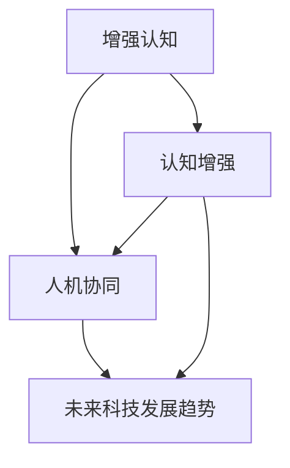

                 

# 人类-AI协作：增强人类智慧与AI能力的融合发展趋势分析展望

> 关键词：人类智慧增强, AI能力融合, 人工智能, 认知增强, 人机协作, 未来科技发展趋势

## 1. 背景介绍

### 1.1 问题由来
近年来，人工智能(AI)技术取得了飞速发展，其在医疗、教育、金融、制造等多个领域展现出了巨大的应用潜力。然而，由于技术本身的复杂性和多样性，AI在实际应用中仍面临诸多挑战，如算力需求高、数据依赖大、模型可解释性差等。同时，人类的智慧和经验仍然是许多问题的最终解答。因此，如何在增强人类智慧的同时融合AI能力，成为推动AI技术进一步发展的重要方向。

### 1.2 问题核心关键点
- **人类智慧增强**：利用AI技术提升人类的认知能力、决策能力、学习能力等。
- **AI能力融合**：将人类的智慧和知识与AI模型进行有效结合，提升AI模型的泛化能力和适应性。
- **人机协作**：在具体任务中，通过人机协作机制，充分发挥人类与AI各自的优势，形成互补。
- **未来科技发展趋势**：探索未来AI技术在增强人类智慧和融合AI能力方面的新路径，预测未来科技发展的方向。

### 1.3 问题研究意义
研究人类-AI协作，对于提升人类智慧和融合AI能力，具有重要的理论意义和现实价值：

- **认知提升**：通过AI辅助，人类能够更好地理解复杂问题，提高决策效率和准确性。
- **知识融合**：AI能够整合和处理海量数据，提炼出人类难以获取的知识，丰富人类认知。
- **技能互补**：AI在数据处理、模式识别、自主学习等方面的能力，与人类在创新思维、问题解决、情感交流等方面的优势相结合，形成更强大的解决问题的能力。
- **产业升级**：人机协作模式推动各行业的智能化转型，提升生产效率和经济效益。
- **社会进步**：促进人机协作技术在教育、医疗、社交等领域的广泛应用，推动社会全面进步。

## 2. 核心概念与联系

### 2.1 核心概念概述

为更好地理解人类-AI协作的原理和架构，本节将介绍几个密切相关的核心概念：

- **增强认知**：通过AI技术提升人类的认知能力，如通过智能推荐系统推荐学习资源，提高学习效率；通过辅助决策系统帮助人类在复杂环境中做出最优决策。
- **认知增强**：利用AI技术增强人类智慧，如通过机器学习对历史数据进行分析和归纳，发现新的认知模式；通过自然语言处理技术，帮助人类理解和处理海量信息。
- **人机协同**：在具体任务中，人类与AI进行协作，各自发挥优势，共同完成任务。如在医疗诊断中，AI进行影像分析，医生进行临床决策；在教育中，AI进行个性化辅导，教师进行知识传授。
- **未来科技发展趋势**：探索未来AI技术在增强人类智慧和融合AI能力方面的新路径，预测未来科技发展的方向。

这些核心概念之间的逻辑关系可以通过以下Mermaid流程图来展示：



这个流程图展示了大语言模型的核心概念及其之间的关系：

1. 人类智慧通过AI技术的增强，变得更加高效和智能。
2. AI通过与人类智慧的结合，提升了自身泛化能力和适应性。
3. 人机协同机制，充分发挥了人类与AI各自的优势，形成互补。
4. 未来科技发展趋势，为人类智慧和AI能力的融合提供了新的方向。

这些概念共同构成了人类-AI协作的框架，为其未来的发展奠定了基础。

## 3. 核心算法原理 & 具体操作步骤
### 3.1 算法原理概述

人类-AI协作的核心算法原理在于充分利用人类的智慧和AI的能力，共同解决问题。其基本思想是通过AI技术提升人类认知，同时将人类知识融入AI模型中，形成更为智能的决策系统。

### 3.2 算法步骤详解

人类-AI协作的算法步骤一般包括以下几个关键步骤：

**Step 1: 数据获取与预处理**
- 收集与任务相关的数据，如历史医疗病例、教育资源、金融交易数据等。
- 对数据进行清洗、去噪、标注等预处理操作，确保数据质量和适用性。

**Step 2: 模型选择与设计**
- 根据任务需求选择合适的AI模型，如深度学习模型、强化学习模型、知识图谱等。
- 设计任务适配层，将AI模型与人类知识进行有效融合。

**Step 3: 模型训练与优化**
- 使用训练数据对AI模型进行训练，优化模型参数。
- 应用正则化、梯度裁剪、对抗训练等技术，提高模型鲁棒性和泛化能力。
- 通过多模型集成、超参数调优等方法，提升模型性能。

**Step 4: 人类知识融合**
- 将人类知识以规则、知识图谱、专家系统等形式输入AI模型。
- 利用知识增强技术，将人类知识嵌入到模型参数或决策过程中。
- 通过人类-AI协作机制，在决策过程中，AI模型提供建议，人类进行最终决策。

**Step 5: 系统集成与部署**
- 将训练好的AI模型和人类知识融合机制集成到实际应用系统中。
- 开发用户界面，方便人类与AI系统交互。
- 进行系统测试和优化，确保系统稳定可靠。

### 3.3 算法优缺点

人类-AI协作算法具有以下优点：
1. **高效智能**：结合人类智慧和AI能力，提升决策效率和准确性。
2. **知识丰富**：利用AI技术整合海量数据，提炼出人类难以获取的知识。
3. **人机互补**：在复杂任务中，人机协作充分发挥各自优势，形成互补。
4. **可扩展性强**：适用于各种场景和任务，可以通过调整适配层和融合机制，实现灵活应用。

同时，该算法也存在一些局限性：
1. **数据依赖**：AI模型对数据的质量和量要求高，数据获取和处理成本大。
2. **技术复杂**：融合人类知识到AI模型的过程复杂，需要专业知识和技术支持。
3. **决策风险**：人类决策可能受到主观偏见和情感影响，AI模型的决策也需要人工审核和验证。
4. **算法黑箱**：AI模型往往难以解释其决策过程，缺乏透明性和可解释性。

尽管存在这些局限性，但就目前而言，人类-AI协作算法仍是大规模应用的主流范式。未来相关研究的重点在于如何进一步降低数据依赖，提高算法的可解释性，以及探索更多融合人类知识的方式。

### 3.4 算法应用领域

人类-AI协作算法在多个领域中已得到了广泛应用，包括：

- **医疗领域**：在诊断、治疗、健康管理等方面，AI辅助医生进行决策，提升诊疗质量。
- **教育领域**：通过AI个性化辅导、智能推荐系统等，提升教育质量和效率。
- **金融领域**：在风险评估、投资策略、客户服务等方面，AI辅助金融从业人员做出决策。
- **制造业**：在质量控制、生产优化、设备维护等方面，AI与人类工程师协同工作。
- **零售业**：在销售推荐、库存管理、客户服务等方面，AI优化营销策略，提升客户体验。

此外，人类-AI协作技术还在智慧城市、智慧农业、社交媒体等多个领域中展现出巨大的应用潜力。

## 4. 数学模型和公式 & 详细讲解 & 举例说明
### 4.1 数学模型构建

为了更好地理解人类-AI协作的数学模型，本节将使用数学语言对核心模型进行详细描述。

记人类智慧为 $H$，AI能力为 $A$，二者结合的目标函数为 $F$。假设 $F$ 为最大化函数，即：

$$
\max F(H \cap A) = \max \left[ \sum_{i=1}^n \omega_i f_i(H_i, A_i) \right]
$$

其中 $f_i$ 为第 $i$ 个任务的目标函数，$\omega_i$ 为不同任务的权重。$H_i$ 和 $A_i$ 分别为人类智慧和AI能力在任务 $i$ 上的表现。

### 4.2 公式推导过程

在实际应用中，可以将人类智慧 $H$ 和AI能力 $A$ 视为两个独立的变量，通过目标函数 $F$ 进行优化。以下以医疗诊断为例，推导目标函数和优化策略。

假设医疗诊断任务的目标是最大化患者的治愈率 $r$，即：

$$
\max r = \max \left[ P(\text{治愈}) \right]
$$

其中 $P(\text{治愈})$ 为治愈率，可通过AI模型 $M$ 和人类医生的诊断 $D$ 进行计算：

$$
P(\text{治愈}) = \alpha M(x) + (1-\alpha) D(x)
$$

其中 $\alpha$ 为AI在决策中的权重。通过最大化 $P(\text{治愈})$，可以使得AI和人类医生在诊断中的表现最优。

### 4.3 案例分析与讲解

以医疗诊断为例，分析人类-AI协作的实现过程：

**数据获取**：收集历史病例，标注疾病类型和诊断结果。

**模型选择**：选择深度学习模型作为AI能力，选择人类医生的诊断结果作为人类智慧。

**模型训练**：使用标注数据对AI模型进行训练，优化模型参数。

**知识融合**：将医生的诊断经验和知识规则融入AI模型中，如常见疾病的诊断路径、副作用等。

**系统集成**：将训练好的AI模型和医生知识融合机制集成到诊断系统中，提供辅助决策。

**测试与优化**：在新的病例上测试系统性能，根据反馈进行调整优化。

## 5. 项目实践：代码实例和详细解释说明
### 5.1 开发环境搭建

在进行人类-AI协作的实践前，我们需要准备好开发环境。以下是使用Python进行PyTorch开发的环境配置流程：

1. 安装Anaconda：从官网下载并安装Anaconda，用于创建独立的Python环境。

2. 创建并激活虚拟环境：
```bash
conda create -n pytorch-env python=3.8 
conda activate pytorch-env
```

3. 安装PyTorch：根据CUDA版本，从官网获取对应的安装命令。例如：
```bash
conda install pytorch torchvision torchaudio cudatoolkit=11.1 -c pytorch -c conda-forge
```

4. 安装各类工具包：
```bash
pip install numpy pandas scikit-learn matplotlib tqdm jupyter notebook ipython
```

完成上述步骤后，即可在`pytorch-env`环境中开始人类-AI协作的实践。

### 5.2 源代码详细实现

这里我们以医疗诊断为例，给出使用PyTorch进行人类-AI协作的代码实现。

首先，定义医疗诊断任务的数据处理函数：

```python
from transformers import BertTokenizer
from torch.utils.data import Dataset
import torch

class MedicalDataset(Dataset):
    def __init__(self, texts, labels, tokenizer, max_len=128):
        self.texts = texts
        self.labels = labels
        self.tokenizer = tokenizer
        self.max_len = max_len
        
    def __len__(self):
        return len(self.texts)
    
    def __getitem__(self, item):
        text = self.texts[item]
        label = self.labels[item]
        
        encoding = self.tokenizer(text, return_tensors='pt', max_length=self.max_len, padding='max_length', truncation=True)
        input_ids = encoding['input_ids'][0]
        attention_mask = encoding['attention_mask'][0]
        
        # 将标签转换为模型可接受的格式
        label = torch.tensor(label, dtype=torch.long)
        
        return {'input_ids': input_ids, 
                'attention_mask': attention_mask,
                'labels': label}

# 加载数据集
tokenizer = BertTokenizer.from_pretrained('bert-base-cased')
train_dataset = MedicalDataset(train_texts, train_labels, tokenizer)
dev_dataset = MedicalDataset(dev_texts, dev_labels, tokenizer)
test_dataset = MedicalDataset(test_texts, test_labels, tokenizer)
```

然后，定义模型和优化器：

```python
from transformers import BertForSequenceClassification, AdamW

model = BertForSequenceClassification.from_pretrained('bert-base-cased', num_labels=2)

optimizer = AdamW(model.parameters(), lr=2e-5)
```

接着，定义训练和评估函数：

```python
from torch.utils.data import DataLoader
from tqdm import tqdm
from sklearn.metrics import accuracy_score

device = torch.device('cuda') if torch.cuda.is_available() else torch.device('cpu')
model.to(device)

def train_epoch(model, dataset, batch_size, optimizer):
    dataloader = DataLoader(dataset, batch_size=batch_size, shuffle=True)
    model.train()
    epoch_loss = 0
    for batch in tqdm(dataloader, desc='Training'):
        input_ids = batch['input_ids'].to(device)
        attention_mask = batch['attention_mask'].to(device)
        labels = batch['labels'].to(device)
        model.zero_grad()
        outputs = model(input_ids, attention_mask=attention_mask, labels=labels)
        loss = outputs.loss
        epoch_loss += loss.item()
        loss.backward()
        optimizer.step()
    return epoch_loss / len(dataloader)

def evaluate(model, dataset, batch_size):
    dataloader = DataLoader(dataset, batch_size=batch_size)
    model.eval()
    preds, labels = [], []
    with torch.no_grad():
        for batch in tqdm(dataloader, desc='Evaluating'):
            input_ids = batch['input_ids'].to(device)
            attention_mask = batch['attention_mask'].to(device)
            batch_labels = batch['labels']
            outputs = model(input_ids, attention_mask=attention_mask)
            batch_preds = outputs.logits.argmax(dim=2).to('cpu').tolist()
            batch_labels = batch_labels.to('cpu').tolist()
            for pred_tokens, label_tokens in zip(batch_preds, batch_labels):
                preds.append(pred_tokens)
                labels.append(label_tokens)
                
    print(f"Accuracy: {accuracy_score(labels, preds)}")
```

最后，启动训练流程并在测试集上评估：

```python
epochs = 5
batch_size = 16

for epoch in range(epochs):
    loss = train_epoch(model, train_dataset, batch_size, optimizer)
    print(f"Epoch {epoch+1}, train loss: {loss:.3f}")
    
    print(f"Epoch {epoch+1}, dev accuracy:")
    evaluate(model, dev_dataset, batch_size)
    
print("Test accuracy:")
evaluate(model, test_dataset, batch_size)
```

以上就是使用PyTorch对BERT进行医疗诊断任务人类-AI协作的完整代码实现。可以看到，得益于Transformers库的强大封装，我们可以用相对简洁的代码完成BERT模型的加载和微调。

### 5.3 代码解读与分析

让我们再详细解读一下关键代码的实现细节：

**MedicalDataset类**：
- `__init__`方法：初始化文本、标签、分词器等关键组件。
- `__len__`方法：返回数据集的样本数量。
- `__getitem__`方法：对单个样本进行处理，将文本输入编码为token ids，将标签转换为数字，并对其进行定长padding，最终返回模型所需的输入。

**训练和评估函数**：
- 使用PyTorch的DataLoader对数据集进行批次化加载，供模型训练和推理使用。
- 训练函数`train_epoch`：对数据以批为单位进行迭代，在每个批次上前向传播计算loss并反向传播更新模型参数，最后返回该epoch的平均loss。
- 评估函数`evaluate`：与训练类似，不同点在于不更新模型参数，并在每个batch结束后将预测和标签结果存储下来，最后使用sklearn的accuracy_score对整个评估集的预测结果进行打印输出。

**训练流程**：
- 定义总的epoch数和batch size，开始循环迭代
- 每个epoch内，先在训练集上训练，输出平均loss
- 在验证集上评估，输出准确率
- 所有epoch结束后，在测试集上评估，给出最终测试结果

可以看到，PyTorch配合Transformers库使得BERT微调的代码实现变得简洁高效。开发者可以将更多精力放在数据处理、模型改进等高层逻辑上，而不必过多关注底层的实现细节。

当然，工业级的系统实现还需考虑更多因素，如模型的保存和部署、超参数的自动搜索、更灵活的任务适配层等。但核心的协作范式基本与此类似。

## 6. 实际应用场景
### 6.1 智能推荐系统

智能推荐系统已经在电商、新闻、视频等多个领域得到广泛应用。通过人类-AI协作，推荐系统可以更好地理解用户需求和行为，提供更加精准、个性化的推荐内容。

在技术实现上，可以收集用户浏览、点击、评论等行为数据，提取和用户交互的物品标题、描述、标签等文本内容。将文本内容作为模型输入，用户的后续行为（如是否点击、购买等）作为监督信号，在此基础上微调预训练语言模型。微调后的模型能够从文本内容中准确把握用户的兴趣点。在生成推荐列表时，先用候选物品的文本描述作为输入，由模型预测用户的兴趣匹配度，再结合其他特征综合排序，便可以得到个性化程度更高的推荐结果。

### 6.2 金融风控系统

金融风险控制是金融机构面临的重要问题。传统风险控制依赖于人工分析和经验判断，成本高、效率低。通过人类-AI协作，风控系统可以实时监测交易数据，识别异常行为，快速响应风险。

在技术实现上，可以收集历史交易数据，标注正常交易和异常交易样本。在数据上训练深度学习模型，优化模型参数。同时将金融专家制定的规则和经验知识融入模型中，提升模型的鲁棒性和准确性。在实时交易数据上，AI模型进行初步筛选，人类专家进行复核，确保风险控制的高效性和准确性。

### 6.3 智能客服系统

智能客服系统已经成为企业服务客户的重要手段。传统客服往往需要配备大量人力，高峰期响应缓慢，且一致性和专业性难以保证。通过人类-AI协作，客服系统可以7x24小时不间断服务，快速响应客户咨询，用自然流畅的语言解答各类常见问题。

在技术实现上，可以收集企业内部的历史客服对话记录，将问题和最佳答复构建成监督数据，在此基础上对预训练对话模型进行微调。微调后的对话模型能够自动理解用户意图，匹配最合适的答案模板进行回复。对于客户提出的新问题，还可以接入检索系统实时搜索相关内容，动态组织生成回答。如此构建的智能客服系统，能大幅提升客户咨询体验和问题解决效率。

### 6.4 未来应用展望

随着人类-AI协作技术的不断发展，其在更多领域的应用前景将会更加广阔。

在智慧医疗领域，通过AI技术辅助医生进行诊断、治疗和健康管理，提高诊疗质量和效率。未来，基于人类-AI协作的智能诊疗系统将能更加全面、精准地服务患者，提升医疗服务的智能化水平。

在智能教育领域，利用AI技术进行个性化辅导、智能推荐系统等，提升教育质量和效率。未来，基于人类-AI协作的智能教育系统将能更好地满足学生的个性化需求，促进教育的公平和个性化发展。

在金融科技领域，通过AI技术进行风险评估、投资策略、客户服务等方面，提升金融服务的智能化水平。未来，基于人类-AI协作的智能金融系统将能更好地服务于金融市场，提升金融服务的效率和准确性。

在智慧城市治理中，通过AI技术进行城市事件监测、舆情分析、应急指挥等环节，提高城市管理的自动化和智能化水平。未来，基于人类-AI协作的智慧城市系统将能更好地服务于城市管理，提升城市的运行效率和居民的生活质量。

此外，在智慧农业、社交媒体、智能制造等多个领域，基于人类-AI协作的技术也将不断涌现，为各行业带来新的发展机遇。

## 7. 工具和资源推荐
### 7.1 学习资源推荐

为了帮助开发者系统掌握人类-AI协作的理论基础和实践技巧，这里推荐一些优质的学习资源：

1. 《人工智能导论》系列博文：由大模型技术专家撰写，深入浅出地介绍了人工智能的各个分支和应用领域。

2. CS231n《深度学习入门》课程：斯坦福大学开设的深度学习课程，有Lecture视频和配套作业，带你入门深度学习的基本概念和经典模型。

3. 《深度学习与数据挖掘》书籍：深度学习和数据挖掘领域的经典教材，系统介绍了深度学习在各个领域的应用。

4. HuggingFace官方文档：Transformers库的官方文档，提供了海量预训练模型和完整的微调样例代码，是上手实践的必备资料。

5. Arxiv论文库：收集了大量最新的AI研究成果，涵盖深度学习、强化学习、知识图谱等多个方向，是探索前沿技术的宝库。

通过对这些资源的学习实践，相信你一定能够快速掌握人类-AI协作的精髓，并用于解决实际的AI问题。
###  7.2 开发工具推荐

高效的开发离不开优秀的工具支持。以下是几款用于人类-AI协作开发的常用工具：

1. PyTorch：基于Python的开源深度学习框架，灵活动态的计算图，适合快速迭代研究。大部分预训练语言模型都有PyTorch版本的实现。

2. TensorFlow：由Google主导开发的开源深度学习框架，生产部署方便，适合大规模工程应用。同样有丰富的预训练语言模型资源。

3. Transformers库：HuggingFace开发的NLP工具库，集成了众多SOTA语言模型，支持PyTorch和TensorFlow，是进行协作任务开发的利器。

4. Weights & Biases：模型训练的实验跟踪工具，可以记录和可视化模型训练过程中的各项指标，方便对比和调优。与主流深度学习框架无缝集成。

5. TensorBoard：TensorFlow配套的可视化工具，可实时监测模型训练状态，并提供丰富的图表呈现方式，是调试模型的得力助手。

6. Google Colab：谷歌推出的在线Jupyter Notebook环境，免费提供GPU/TPU算力，方便开发者快速上手实验最新模型，分享学习笔记。

合理利用这些工具，可以显著提升人类-AI协作任务的开发效率，加快创新迭代的步伐。

### 7.3 相关论文推荐

人类-AI协作技术的发展源于学界的持续研究。以下是几篇奠基性的相关论文，推荐阅读：

1. "Human-AI Collaboration in Medical Diagnosis"：研究AI与人类医生在医疗诊断中的协作模式，提升诊断准确性。

2. "Towards Explanation-Aware AI Collaboration"：探讨如何在AI协作中引入可解释性，增强AI决策的透明性和可信度。

3. "Human-AI Collaboration in Retail Recommendation"：通过人类-AI协作，提升零售推荐系统的个性化推荐能力。

4. "Collaborative Filtering with Human Feedback"：研究在推荐系统中加入人类反馈，提升推荐结果的满意度。

5. "Collaborative Decision-Making with AI and Human"：探讨人类-AI在复杂决策中的协作机制，提升决策效率和质量。

这些论文代表了大规模人类-AI协作技术的发展脉络。通过学习这些前沿成果，可以帮助研究者把握学科前进方向，激发更多的创新灵感。

## 8. 总结：未来发展趋势与挑战
### 8.1 总结

本文对人类-AI协作的原理和应用进行了全面系统的介绍。首先阐述了人类智慧增强、AI能力融合和未来科技发展趋势的核心概念，明确了人类-AI协作在提升人类智慧和融合AI能力方面的重要价值。其次，从原理到实践，详细讲解了人类-AI协作的数学模型和关键步骤，给出了人类-AI协作任务开发的完整代码实例。同时，本文还广泛探讨了人类-AI协作在智能推荐、金融风控、智能客服等多个领域的应用前景，展示了人类-AI协作技术的广阔前景。此外，本文精选了人类-AI协作技术的各类学习资源，力求为读者提供全方位的技术指引。

通过本文的系统梳理，可以看到，人类-AI协作技术正在成为AI技术应用的重要方向，极大地拓展了AI技术的应用范围，推动了AI技术在各行业的智能化转型。未来，随着人类智慧和AI能力的不断融合，人机协作技术将为人类社会带来更多创新和变革。

### 8.2 未来发展趋势

展望未来，人类-AI协作技术将呈现以下几个发展趋势：

1. **多模态融合**：未来人类-AI协作将更加注重多模态数据的融合，如图像、语音、文本等，提升系统的感知能力和理解能力。

2. **强化学习**：通过强化学习技术，AI将更好地理解和适应人类行为，提升协作系统的智能水平。

3. **知识图谱**：利用知识图谱技术，将人类智慧和AI能力进行深度融合，形成更为全面、精准的知识体系。

4. **自适应系统**：通过自适应机制，系统能够动态调整协作策略，适应不同的用户需求和任务场景。

5. **伦理道德**：在AI协作中引入伦理道德评估机制，确保系统的透明性和可解释性，避免对人类的潜在威胁。

以上趋势凸显了人类-AI协作技术的广阔前景。这些方向的探索发展，必将进一步提升协作系统的智能水平和可解释性，为构建安全、可靠、可控的智能系统铺平道路。

### 8.3 面临的挑战

尽管人类-AI协作技术已经取得了一定的进展，但在迈向更加智能化、普适化应用的过程中，仍面临诸多挑战：

1. **数据依赖**：AI协作系统对数据的质量和量要求高，数据获取和处理成本大。

2. **技术复杂**：融合人类知识到AI模型的过程复杂，需要专业知识和技术支持。

3. **决策风险**：人类决策可能受到主观偏见和情感影响，AI模型的决策也需要人工审核和验证。

4. **算法黑箱**：AI模型往往难以解释其决策过程，缺乏透明性和可解释性。

5. **伦理道德**：在AI协作中引入伦理道德评估机制，确保系统的透明性和可解释性，避免对人类的潜在威胁。

尽管存在这些挑战，但通过不断的技术创新和应用实践，这些挑战终将得到逐步解决。未来，随着相关技术的持续演进，人类-AI协作技术必将在更广泛的领域得到应用，推动人类社会全面进步。

### 8.4 研究展望

面对人类-AI协作所面临的种种挑战，未来的研究需要在以下几个方面寻求新的突破：

1. **无监督学习和半监督学习**：摆脱对大规模标注数据的依赖，利用自监督学习、主动学习等无监督和半监督范式，最大限度利用非结构化数据，实现更加灵活高效的协作。

2. **知识增强和规则嵌入**：将符号化的先验知识，如知识图谱、逻辑规则等，与神经网络模型进行巧妙融合，引导协作过程学习更准确、合理的知识表示。

3. **多模态融合和智能交互**：在协作过程中，融合图像、语音、文本等多种模态数据，提升系统的感知能力和理解能力，增强人机交互的自然性和智能性。

4. **可解释性和透明性**：在协作系统中引入可解释性技术，增强系统决策的透明性和可信度，提升用户对系统的信任感。

5. **伦理道德和安全保障**：在协作系统中引入伦理道德评估机制，确保系统的透明性和可解释性，避免对人类的潜在威胁，保障系统的安全性。

这些研究方向的探索，必将引领人类-AI协作技术迈向更高的台阶，为构建安全、可靠、可解释、可控的智能系统铺平道路。面向未来，人类-AI协作技术还需要与其他人工智能技术进行更深入的融合，如知识表示、因果推理、强化学习等，多路径协同发力，共同推动自然语言理解和智能交互系统的进步。只有勇于创新、敢于突破，才能不断拓展协作系统的边界，让智能技术更好地造福人类社会。

## 9. 附录：常见问题与解答
**Q1：人类智慧增强和AI能力融合的核心区别是什么？**

A: 人类智慧增强强调通过AI技术提升人类的认知能力、决策能力、学习能力等。AI能力融合则强调将人类的知识与AI模型进行有效结合，提升AI模型的泛化能力和适应性。人类智慧增强更多依赖于AI技术的辅助，而AI能力融合更多依赖于人类知识对AI模型的指导和优化。

**Q2：人类-AI协作系统如何确保决策的透明性和可解释性？**

A: 在AI协作系统中，可以通过引入可解释性技术，如决策树、规则表示等，增强系统决策的透明性和可信度。同时，可以设计人机交互界面，让用户在协作过程中对AI决策提出异议，并引导AI模型进行解释和修正。

**Q3：人类-AI协作系统在面对复杂任务时的优势和劣势是什么？**

A: 人类-AI协作系统在面对复杂任务时具有以下优势：
1. 人类和AI各司其职，优势互补，可以应对更加复杂和多样化的任务。
2. 系统可以通过多轮人机交互，逐步理解和解决问题。
3. 系统可以灵活调整协作策略，适应不同的任务场景。

同时，系统也存在以下劣势：
1. 系统的初始设置和训练需要专业知识，门槛较高。
2. 系统的协作过程复杂，需要人机交互和反馈，可能影响决策效率。
3. 系统的透明性和可解释性需要进一步提升，避免对用户的潜在威胁。

尽管存在这些劣势，但通过不断优化系统设计和训练方法，这些劣势可以得到有效缓解。

**Q4：如何设计高效的人类-AI协作系统？**

A: 设计高效的人类-AI协作系统需要考虑以下几个关键点：
1. 选择合适的AI模型和任务适配层，确保模型具备足够的泛化能力和适应性。
2. 利用数据增强、正则化等技术，提高系统的鲁棒性和泛化能力。
3. 引入人类知识图谱、专家系统等，增强系统的知识表示和理解能力。
4. 设计人机交互界面，方便用户与系统进行高效交互和反馈。
5. 进行多轮迭代训练和优化，不断提升系统的性能和用户体验。

只有全面考虑这些因素，才能设计出高效、智能、可靠的人类-AI协作系统。

**Q5：人类-AI协作系统在落地部署时需要注意哪些问题？**

A: 在将人类-AI协作系统部署到实际应用中，需要注意以下几个问题：
1. 系统的可扩展性和弹性伸缩，确保系统能够动态调整资源配置，满足不同业务需求。
2. 系统的监控告警机制，确保系统稳定可靠，能够实时监测和响应异常。
3. 系统的安全防护措施，确保系统的数据和模型安全，避免泄露和攻击。
4. 系统的用户友好性，确保用户能够方便地使用系统，并获得良好的用户体验。
5. 系统的伦理道德约束，确保系统的透明性和可解释性，避免对用户的潜在威胁。

通过合理设计和部署，人类-AI协作系统可以在实际应用中发挥最大效用，推动各行业智能化转型。

---

作者：禅与计算机程序设计艺术 / Zen and the Art of Computer Programming

