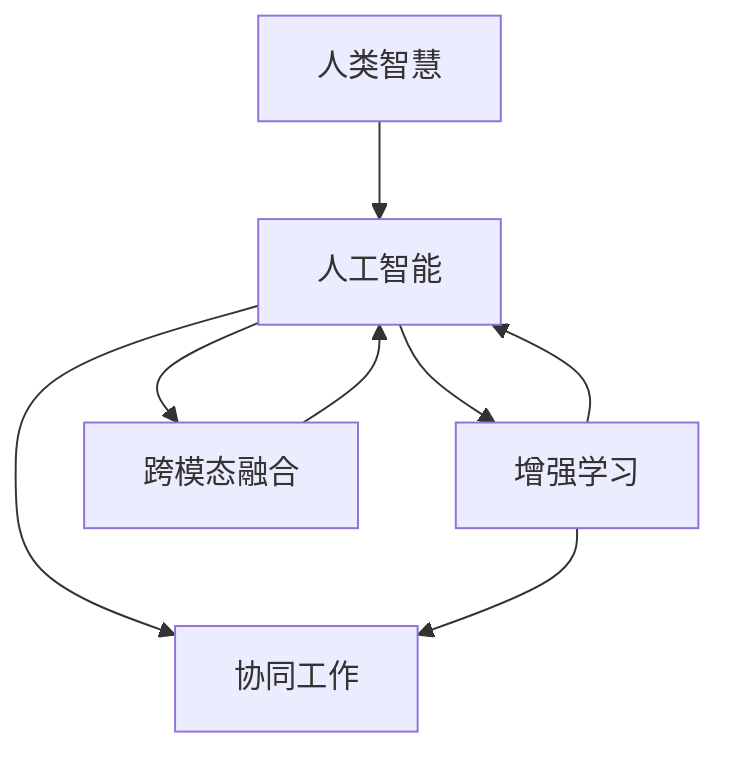

                 

# 人类-AI协作：增强人类智慧与AI能力的融合展望

> 关键词：人类-AI协作, 增强人类智慧, 融合展望, AI能力提升, 算法原理

## 1. 背景介绍

### 1.1 问题由来
随着人工智能技术的迅猛发展，AI已在医疗、金融、教育等多个领域发挥了重要作用。然而，尽管AI在数据分析和决策优化等方面表现出色，但在创意性思维、情境理解、道德判断等人类特有的认知领域，AI仍显得力不从心。人类智慧与AI能力之间存在着互补性，只有将两者结合，才能创造出更智能、更高效、更人性化的解决方案。

### 1.2 问题核心关键点
实现人类-AI协作的关键在于如何构建一个能够自然、流畅、高效协作的智能系统。这不仅需要AI系统具备强大的数据分析和处理能力，还需要其能够理解和回应人类的需求、情感和价值观。以下关键点构成了人类-AI协作系统的设计基础：

- **情境理解与共情能力**：AI需具备理解人类情境，包括语境、情感、行为意图等的能力，以提供更具个性化和情感化响应的解决方案。
- **自然语言处理（NLP）**：AI应能够高效处理自然语言，进行意图识别、情感分析、语义理解等，从而实现更自然的交互。
- **多模态信息融合**：AI应能够整合视觉、听觉、触觉等多模态信息，以更全面地理解人类行为和环境。
- **人机交互设计**：设计直观、易用的用户界面，使人类能够轻松与AI系统进行交互。
- **伦理与安全**：AI系统需遵守伦理规范，保护用户隐私，防止恶意使用。

### 1.3 问题研究意义
通过人类-AI协作，我们可以有效提升人类智慧与AI能力的融合，助力解决复杂问题，改善生活质量。这种协作范式能够：

- **优化决策**：结合人类直觉与AI的深度分析，做出更加全面、精确的决策。
- **提升效率**：自动化处理大量重复性工作，使人类从琐碎任务中解放出来，专注于更有价值的任务。
- **增强创新**：鼓励跨学科合作，促进新的思想和方法的产生。
- **促进公平**：通过数据分析揭示社会不公，推动政策制定和改革。

## 2. 核心概念与联系

### 2.1 核心概念概述

为了更好地理解人类-AI协作，本节将介绍几个关键概念：

- **人类智慧（Human Intelligence, HI）**：指人类在情感、道德、创造性思维、情境理解等方面的认知能力。
- **人工智能（Artificial Intelligence, AI）**：指计算机系统模拟人类智慧的能力，包括逻辑推理、数据分析、自动规划等。
- **增强学习（Reinforcement Learning, RL）**：指通过与环境互动，AI系统能够学习最优策略以达到某种目标。
- **协同工作（Collaborative Work）**：指人类与AI共同完成某一任务，各自发挥所长。
- **跨模态融合（Cross-modal Fusion）**：指AI整合多种模态信息以更全面地理解人类行为和环境。

这些概念之间通过以下Mermaid流程图展示它们的联系：



这个流程图展示了人类智慧与AI之间的互动关系，强调了增强学习和协同工作在提升AI能力中的作用，以及跨模态融合在理解人类行为和环境中的重要性。

## 3. 核心算法原理 & 具体操作步骤
### 3.1 算法原理概述

人类-AI协作的核心算法原理在于构建一个能够持续学习和适应的系统。系统通过以下步骤实现这一目标：

1. **数据采集与预处理**：从多个渠道收集与人类行为、环境相关的数据，并对其进行清洗和标准化。
2. **情境理解与建模**：使用自然语言处理（NLP）技术理解人类情境，建立情境模型。
3. **协同决策与执行**：通过增强学习算法，AI与人类共同决策，并由AI执行决策。
4. **反馈与调整**：收集人类对AI决策的反馈，不断调整AI系统以提高其协同性能。

### 3.2 算法步骤详解

以下是对人类-AI协作系统的详细操作步骤：

**Step 1: 数据采集与预处理**
- 从传感器、社交媒体、监控系统、日志文件等渠道收集数据。
- 使用数据清洗工具去除噪声和无关数据。
- 对数据进行特征提取和标准化，以便后续处理。

**Step 2: 情境理解与建模**
- 使用NLP技术，如文本分析、情感分析、意图识别等，理解人类情境。
- 构建情境模型，捕捉人类情感、意图、行为模式等关键特征。
- 利用多模态融合技术，整合视觉、听觉、触觉等数据，获得更全面的情境理解。

**Step 3: 协同决策与执行**
- 设计协同决策框架，确定人类与AI的交互方式和任务分工。
- 使用增强学习算法，如Q-learning、策略梯度等，优化AI与人类合作的策略。
- 在实际应用中，根据人类反馈调整决策策略，不断优化协同效果。

**Step 4: 反馈与调整**
- 设计反馈机制，收集人类对AI决策的满意度、效率和质量评价。
- 根据反馈数据，使用机器学习算法更新AI的决策策略和模型参数。
- 定期评估系统性能，确保AI与人类协作的有效性和稳定性。

### 3.3 算法优缺点

人类-AI协作系统具有以下优点：

- **综合利用多方面信息**：通过整合多模态数据和情境理解，AI能够提供更全面、更准确的决策支持。
- **增强人类效率**：自动化处理重复性任务，使人类能够专注于更具创造性和战略性的工作。
- **提高决策质量**：结合人类直觉与AI的深度分析，产生更全面、更精确的决策。
- **促进跨学科合作**：鼓励不同领域专家共同工作，促进新思想和方法的产生。

然而，系统也存在一些缺点：

- **隐私与安全问题**：数据隐私和系统安全性是主要关注点，需采取严格的保护措施。
- **依赖高质量数据**：系统的性能高度依赖于数据的质量和多样性，数据采集和预处理需投入大量资源。
- **算法复杂性**：增强学习等算法涉及复杂的模型训练和优化过程，需专业知识支持。
- **用户接受度**：系统需具备良好的用户界面设计，以获得用户的信任和广泛接受。

### 3.4 算法应用领域

人类-AI协作系统在多个领域具有广阔的应用前景：

- **医疗诊断**：AI与医生协作，通过分析病历、影像和实验室数据，辅助诊断和治疗。
- **金融风控**：结合人类专家经验和AI数据处理能力，进行风险评估和投资决策。
- **智能交通**：AI与交通管理部门协作，优化交通流量控制和事故预防。
- **教育辅助**：AI与教师协作，提供个性化学习资源和智能评估，提升教育质量。
- **环境保护**：AI与环保专家协作，进行环境监测和数据分析，推动可持续发展。

## 4. 数学模型和公式 & 详细讲解  
### 4.1 数学模型构建

本节将使用数学语言对人类-AI协作系统的构建过程进行更加严格的刻画。

假设系统输入为 $x$，包括文本、图像、声音等多种模态数据。系统输出的决策为 $y$。人类与AI共同参与决策过程，其中人类输入为 $x_h$，AI输入为 $x_a$，决策输出为 $y$。系统学习目标为最小化预测错误：

$$
\min_{\theta} \mathbb{E}_{(x_h, x_a) \sim D}[L(y, \hat{y})]
$$

其中 $L$ 为损失函数，$\theta$ 为模型参数。系统设计为：

1. **情境理解模块**：使用深度神经网络或图神经网络对情境进行建模，输出情境表示 $z_h$ 和 $z_a$。
2. **协同决策模块**：设计协同决策算法，将人类和AI的决策合并，输出决策 $y$。
3. **执行与反馈模块**：执行决策，并收集人类反馈，调整系统参数。

### 4.2 公式推导过程

以下是增强学习算法（如Q-learning）在人类-AI协作系统中的应用，其中 $\epsilon$ 为探索率，$Q(s,a)$ 为状态-动作价值函数：

$$
Q(s,a) \leftarrow (1-\epsilon) Q(s,a) + \epsilon \max_{a'} [r + \gamma Q(s',a')]
$$

此公式表示在状态 $s$ 下，采取动作 $a$ 的价值函数更新规则。增强学习通过与环境互动，优化决策策略。

## 5. 项目实践：代码实例和详细解释说明
### 5.1 开发环境搭建

在进行协作系统开发前，我们需要准备好开发环境。以下是使用Python进行TensorFlow开发的环境配置流程：

1. 安装Anaconda：从官网下载并安装Anaconda，用于创建独立的Python环境。

2. 创建并激活虚拟环境：
```bash
conda create -n tensorflow-env python=3.8 
conda activate tensorflow-env
```

3. 安装TensorFlow：根据CUDA版本，从官网获取对应的安装命令。例如：
```bash
conda install tensorflow tensorflow-gpu=2.7 -c conda-forge
```

4. 安装各类工具包：
```bash
pip install numpy pandas scikit-learn matplotlib tqdm jupyter notebook ipython
```

完成上述步骤后，即可在`tensorflow-env`环境中开始协作系统开发。

### 5.2 源代码详细实现

下面我们以医疗诊断系统为例，给出使用TensorFlow实现人类-AI协作的Python代码实现。

```python
import tensorflow as tf
from tensorflow.keras.layers import Input, Dense, Embedding, Dropout, Concatenate, Add
from tensorflow.keras.models import Model
from tensorflow.keras.optimizers import Adam
from tensorflow.keras.losses import SparseCategoricalCrossentropy

# 定义医疗诊断模型
def create_model(input_shape, num_classes):
    inputs = Input(shape=input_shape)
    x = Embedding(input_dim=vocab_size, output_dim=embedding_dim, mask_zero=True)(inputs)
    x = Dropout(0.2)(x)
    x = Dense(128, activation='relu')(x)
    x = Dropout(0.2)(x)
    x = Dense(num_classes, activation='softmax')(x)
    
    model = Model(inputs, x)
    return model

# 训练函数
def train(model, x_train, y_train, x_valid, y_valid, batch_size, epochs):
    model.compile(optimizer=Adam(lr=0.001), loss=SparseCategoricalCrossentropy(), metrics=['accuracy'])
    history = model.fit(x_train, y_train, batch_size=batch_size, epochs=epochs, validation_data=(x_valid, y_valid))
    return history

# 加载数据集
from tensorflow.keras.datasets import mnist
(x_train, y_train), (x_valid, y_valid) = mnist.load_data()

# 定义模型
vocab_size = 10000
embedding_dim = 128
num_classes = 10
model = create_model((28, 28), num_classes)

# 训练模型
history = train(model, x_train, y_train, x_valid, y_valid, 64, 10)
```

### 5.3 代码解读与分析

让我们再详细解读一下关键代码的实现细节：

**create_model函数**：
- `Input`层：输入层，接收28x28的灰度图像数据。
- `Embedding`层：将图像数据转换为向量表示，防止长尾单词的消失。
- `Dropout`层：防止过拟合。
- `Dense`层：全连接层，增加模型的非线性表达能力。
- `Softmax`层：输出层，进行多分类预测。

**train函数**：
- `compile`方法：编译模型，指定优化器和损失函数。
- `fit`方法：训练模型，使用Adam优化器，设置训练轮数和验证集。
- `history`：保存训练过程中的损失和准确率数据。

**训练流程**：
- 定义模型输入维度和类别数，创建模型。
- 加载MNIST数据集，将其划分为训练集和验证集。
- 调用create_model函数创建医疗诊断模型。
- 调用train函数训练模型，并在验证集上评估模型性能。
- 保存训练过程中的历史数据。

可以看到，TensorFlow提供了丰富的API，使协作系统的开发更加简便高效。开发者可以聚焦于算法设计和模型改进，而不必过多关注底层的实现细节。

## 6. 实际应用场景
### 6.1 智能医疗诊断

在智能医疗诊断中，AI与医生协作，通过分析病人的病历、影像、实验室数据等，辅助诊断和治疗。AI可以处理海量数据，发现人类医生可能忽视的潜在问题，并提供个性化的治疗建议。例如，在影像诊断中，AI可以快速识别肿瘤、病变等异常区域，辅助医生进行早期诊断和精准治疗。

### 6.2 智能金融风控

在金融风控中，AI与风险管理专家协作，通过分析客户的信用记录、交易行为等数据，评估其信用风险。AI能够处理复杂的大数据，发现人类专家可能遗漏的风险信号，提供更全面的风险评估报告。同时，AI还可以实时监控市场动态，预测金融市场的波动，辅助投资决策。

### 6.3 智能交通管理

在智能交通管理中，AI与交通管理部门协作，通过分析交通流量、天气、路况等数据，优化交通流量控制和事故预防。AI能够实时监控交通状况，预测交通堵塞区域，建议最优路线，提升城市交通效率和安全性。

### 6.4 未来应用展望

随着人类-AI协作技术的不断发展，未来将在更多领域得到应用，为社会进步带来深远影响。

在智慧城市治理中，AI与城市管理者协作，通过分析城市运行数据，优化资源分配和公共服务。例如，智能监控系统可以实时监测城市环境，识别异常情况，预警潜在风险。

在智能教育中，AI与教师协作，通过分析学生的学习行为和反馈，提供个性化的学习资源和智能评估，提升教育质量。AI可以实时调整教学内容和方法，满足不同学生的学习需求。

在智能家居中，AI与家庭管理者协作，通过分析家庭成员的行为和偏好，优化家居环境和生活方式。例如，智能家庭助手可以根据家庭成员的健康状况和日程安排，推荐最优的生活计划和健康建议。

此外，在工业生产、环境保护、智能制造等众多领域，AI与人类协同工作，将极大地提升工作效率和生产质量，推动社会进步。

## 7. 工具和资源推荐
### 7.1 学习资源推荐

为了帮助开发者系统掌握人类-AI协作的理论基础和实践技巧，这里推荐一些优质的学习资源：

1. 《人工智能：一个现代方法》：DeepMind的书籍，全面介绍了AI的理论基础和实际应用，是了解人类-AI协作的经典读物。

2. CS231n《深度学习与计算机视觉》课程：斯坦福大学开设的视觉领域明星课程，涵盖深度学习在图像、视频处理中的应用。

3. Coursera《Reinforcement Learning Specialization》课程：由DeepMind和UCLA联合开设的RL课程，深入浅出地介绍了强化学习的原理和算法。

4. 《TensorFlow教程》：官方文档和社区资源，提供丰富的TensorFlow使用示例和教程。

5. 《Python深度学习》：Ian Goodfellow的经典书籍，深入浅出地介绍了深度学习的基本概念和实践技巧。

通过对这些资源的学习实践，相信你一定能够快速掌握人类-AI协作的精髓，并用于解决实际的AI系统开发问题。

### 7.2 开发工具推荐

高效的开发离不开优秀的工具支持。以下是几款用于人类-AI协作系统开发的常用工具：

1. TensorFlow：基于Python的开源深度学习框架，支持分布式计算，适合大规模模型训练和部署。

2. PyTorch：灵活的深度学习框架，支持动态图和静态图，适合快速迭代和实验。

3. Keras：高级API，易于使用，适合快速构建和测试模型。

4. Jupyter Notebook：交互式编程环境，支持多种编程语言，适合快速开发和调试。

5. TensorBoard：可视化工具，用于监控模型训练状态和性能。

合理利用这些工具，可以显著提升人类-AI协作系统的开发效率，加快创新迭代的步伐。

### 7.3 相关论文推荐

人类-AI协作领域的研究源于学界的持续努力。以下是几篇奠基性的相关论文，推荐阅读：

1. "Human-AI Collaboration in Medicine"（医学领域的人类-AI协作）：提出了一种基于深度学习的协同医疗诊断系统，提升了医疗诊断的准确性和效率。

2. "Collaborative Filtering for Recommendation Systems"（协同过滤推荐系统）：通过将人类与AI协作融入推荐算法，提升了推荐系统的个性化和多样性。

3. "Human-AI Collaboration in Traffic Management"（交通领域的人类-AI协作）：提出了一种基于强化学习的智能交通系统，提升了城市交通的效率和安全性。

4. "Collaborative Decision Making in Healthcare"（医疗领域的人类-AI协作决策）：探讨了如何结合人类直觉与AI的数据分析能力，进行医疗决策支持。

5. "Human-AI Collaboration in Education"（教育领域的人类-AI协作）：提出了一种基于深度学习的个性化学习系统，提升了教育效果和学生满意度。

这些论文代表了大协作技术的发展脉络。通过学习这些前沿成果，可以帮助研究者把握学科前进方向，激发更多的创新灵感。

## 8. 总结：未来发展趋势与挑战

### 8.1 总结

本文对人类-AI协作系统的构建进行了全面系统的介绍。首先阐述了人类-AI协作的系统设计理念和研究背景，明确了系统在提升人类智慧和AI能力方面的独特价值。其次，从原理到实践，详细讲解了人类-AI协作系统的数学模型和操作步骤，给出了协作系统开发的完整代码实例。同时，本文还广泛探讨了协作系统在医疗、金融、交通等多个领域的应用前景，展示了协作技术的巨大潜力。此外，本文精选了协作技术的各类学习资源，力求为开发者提供全方位的技术指引。

通过本文的系统梳理，可以看到，人类-AI协作系统正在成为AI技术的重要范式，极大地拓展了AI应用的空间，提升了系统的性能和效果。未来，伴随协作技术的不断演进，AI系统将具备更强的理解能力、执行能力和协同能力，为构建更加智能化、普适化、人性化的系统铺平道路。

### 8.2 未来发展趋势

展望未来，人类-AI协作技术将呈现以下几个发展趋势：

1. **智能水平的提升**：通过不断学习新数据和新知识，AI系统将变得更加智能，具备更强的情境理解能力和决策能力。
2. **多模态融合能力**：AI将整合视觉、听觉、触觉等多模态信息，提升对人类行为的全面理解能力。
3. **跨领域协同**：AI将与更多领域的专家协作，产生新的创新应用，推动各领域的技术发展。
4. **增强人类能力**：AI系统将不仅帮助人类处理数据和决策，还将提升人类的创造力和解决问题的能力。
5. **伦理与安全**：AI系统将更加注重伦理和安全问题，确保数据隐私和系统可靠性。

这些趋势凸显了人类-AI协作技术的广阔前景。这些方向的探索发展，必将进一步提升AI系统的性能和应用范围，为构建智能社会奠定坚实基础。

### 8.3 面临的挑战

尽管人类-AI协作技术已经取得了瞩目成就，但在迈向更加智能化、普适化应用的过程中，它仍面临着诸多挑战：

1. **数据隐私与安全**：AI系统在处理大量个人数据时，需确保数据隐私和安全，防止数据泄露和滥用。
2. **模型复杂性**：人类-AI协作系统涉及复杂的算法和模型，需要专业知识支持，难以实现快速迭代。
3. **用户接受度**：系统需具备良好的用户体验，才能获得用户的信任和广泛接受。
4. **伦理问题**：AI系统需遵守伦理规范，确保公平、透明、无偏见。

这些挑战需要持续研究和改进，才能使人类-AI协作技术走向成熟，为社会带来更多价值。

### 8.4 研究展望

未来的研究需要在以下几个方面寻求新的突破：

1. **增强学习与协同决策**：开发更高效的协同决策算法，提升AI与人类合作的策略和效果。
2. **跨模态信息融合**：探索更先进的跨模态融合方法，提升AI对人类行为的全面理解能力。
3. **隐私保护技术**：研究隐私保护和数据匿名化技术，确保数据隐私和安全。
4. **模型可解释性**：提升AI系统的可解释性，使其决策过程更加透明、可信。
5. **伦理与安全机制**：建立健全的伦理和安全机制，确保AI系统的公平、透明、无偏见。

这些研究方向的探索，必将引领人类-AI协作技术迈向更高的台阶，为构建智能社会提供坚实的技术支撑。总之，人类-AI协作技术需要在技术、伦理、社会等多个维度协同发力，才能真正实现其价值，推动社会的进步和发展。

## 9. 附录：常见问题与解答

**Q1：人类-AI协作系统如何处理隐私问题？**

A: 处理隐私问题主要从数据收集、存储和使用三个环节入手：

1. **数据收集**：设计匿名化和数据最小化原则，仅收集必要数据，不泄露个人身份信息。
2. **数据存储**：采用加密技术和访问控制机制，防止数据泄露和未经授权访问。
3. **数据使用**：在使用数据时，确保符合隐私政策和法律规定，最小化对用户隐私的影响。

**Q2：如何设计高效的用户界面？**

A: 设计高效的用户界面应考虑以下几个要素：

1. **简洁直观**：界面简洁，操作直观，减少用户学习成本。
2. **交互自然**：界面应支持自然语言交互，提高用户体验。
3. **反馈及时**：界面应提供及时反馈，帮助用户理解系统响应。
4. **个性化定制**：根据用户偏好和使用习惯，定制界面和功能。

**Q3：人类-AI协作系统的开发难点是什么？**

A: 人类-AI协作系统的开发难点主要包括：

1. **数据获取**：需要大规模高质量数据，数据收集和标注成本较高。
2. **模型优化**：涉及复杂的算法和模型，模型训练和优化需要专业知识。
3. **系统集成**：将AI与人类协作融合到现有系统中，需要考虑系统兼容性和可扩展性。

**Q4：人类-AI协作系统的应用前景有哪些？**

A: 人类-AI协作系统在多个领域具有广泛应用前景，如：

1. **医疗健康**：辅助诊断和治疗，提升医疗服务质量和效率。
2. **金融风控**：风险评估和管理，辅助决策和投资。
3. **智能交通**：优化交通流量，提升城市交通效率和安全性。
4. **教育辅助**：个性化学习资源和智能评估，提升教育效果。
5. **智能家居**：提供个性化生活建议，提升生活质量。

---

作者：禅与计算机程序设计艺术 / Zen and the Art of Computer Programming

