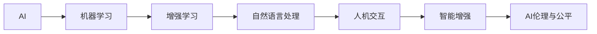

                 

## 1. 背景介绍

### 1.1 问题由来

近年来，人工智能(AI)技术的迅猛发展，在诸多领域展现出了颠覆性的变革能力。随着AlphaGo、DALL-E、ChatGPT等里程碑式应用的出现，AI的智能化水平不断攀升，逐步超越人类的认知边界。尽管如此，AI技术并非取代人类，而是通过增强人类潜能，提升协作效率，为人类生活、工作和生产带来了前所未有的便利与可能性。

### 1.2 问题核心关键点

AI与人类协作的关键在于如何使AI技术与人类知识、经验、智慧进行深度融合，以实现互补增强。AI不仅能在信息处理、模式识别、决策支持等方面提供强大支持，还能协助人类进行创意创作、复杂问题解决、多任务并行处理等。如何使AI更加智能、灵活、人性化，成为当前研究的热点。

### 1.3 问题研究意义

探讨AI与人类协作的话题，对于理解AI技术发展的未来趋势、推动AI应用深度融入各行各业、构建智能共生社会具有重要意义：

1. **提升效率与生产力**：AI可以自动化执行重复性、高强度的工作，解放人类精力，专注于创新和创造。
2. **拓展知识边界**：AI能够处理海量数据，挖掘隐藏在数据中的模式和洞见，扩展人类的知识视野。
3. **增强决策能力**：AI在数据分析、模式识别等方面的优势，能够辅助人类做出更加科学、准确的决策。
4. **促进创新**：AI与人类协作，能够激发新的创意和思维方式，推动技术进步和社会变革。
5. **实现普惠**：AI技术可以帮助边缘地区、弱势群体获得更好的服务和生活条件，缩小数字鸿沟。

## 2. 核心概念与联系

### 2.1 核心概念概述

为更好地理解AI与人类协作，本节将介绍几个密切相关的核心概念：

- **人工智能(AI)**：旨在模拟人类智能的计算系统，包括感知、理解、推理、学习和决策等多个方面。
- **机器学习(ML)**：通过数据驱动的学习过程，使机器具备识别、预测和决策的能力。
- **增强学习(RL)**：一种通过与环境互动，优化决策策略的学习方法。
- **自然语言处理(NLP)**：使计算机理解、处理和生成自然语言的技术。
- **人机交互(HCI)**：研究人类与计算机之间有效交流的科学和技术。
- **智能增强(IEA)**：通过AI技术提升人类在决策、认知、创造等方面的能力。
- **AI伦理与公平**：研究AI技术的伦理问题、社会影响及如何确保技术公平使用。

这些核心概念共同构成了AI与人类协作的理论基础，展示了AI如何通过增强、辅助、延伸人类的智能，实现协作共生。

### 2.2 核心概念原理和架构的 Mermaid 流程图



这个流程图展示了核心概念之间的逻辑关系：

1. **AI**作为基础，涵盖机器学习、增强学习等多种技术。
2. **机器学习**通过数据驱动的学习，使AI具备预测、分类等基本能力。
3. **增强学习**通过与环境互动，优化决策策略，进一步提升AI的智能水平。
4. **自然语言处理**使AI具备理解、处理和生成自然语言的能力。
5. **人机交互**研究如何使人类与计算机有效沟通，提升协作体验。
6. **智能增强**通过AI技术提升人类在决策、认知、创造等方面的能力。
7. **AI伦理与公平**关注AI技术的伦理问题、社会影响及公平使用。

这些概念相互关联，共同支撑着AI与人类协作的广泛应用。

## 3. 核心算法原理 & 具体操作步骤

### 3.1 算法原理概述

AI与人类协作的核心算法原理主要包括以下几个方面：

1. **数据驱动学习**：通过大量标注数据，训练AI模型，使其具备识别、预测和分类等基本能力。
2. **迁移学习**：将一个领域的知识迁移到另一个领域，提高AI模型在新任务上的表现。
3. **增强学习**：通过与环境的互动，优化决策策略，增强AI模型在复杂环境中的适应能力。
4. **自然语言处理**：使AI模型能够理解、处理和生成自然语言，实现人机自然交流。
5. **智能增强**：利用AI技术提升人类在决策、认知、创造等方面的能力，实现协作共生。

这些原理构成了AI与人类协作的基础，通过具体的算法步骤实现协作增强。

### 3.2 算法步骤详解

AI与人类协作的算法步骤主要分为以下几个阶段：

1. **需求分析与定义**：明确协作目标和需求，确定AI需要具备的能力和功能。
2. **数据准备与预处理**：收集、整理和预处理所需的数据，包括数据标注、清洗和归一化等。
3. **模型训练与优化**：使用机器学习、增强学习等算法训练AI模型，并通过超参数调优和模型评估，提升模型性能。
4. **人机交互设计**：设计用户界面、交互流程和反馈机制，提升用户体验和协作效率。
5. **智能增强应用**：将AI模型应用于实际业务场景，提升工作效率、决策质量、创新能力等。
6. **模型监控与维护**：持续监控AI模型的性能和表现，及时调整和维护，确保其稳定运行。

### 3.3 算法优缺点

AI与人类协作的算法具有以下优点：

1. **高效性**：AI能够自动化处理大量数据和复杂任务，大大提升工作效率。
2. **准确性**：AI通过数据驱动的学习，能够提供科学、准确的预测和建议。
3. **智能性**：AI具备自我学习和适应能力，能够不断提升自身性能。
4. **协作性**：AI能够与人类紧密协作，互补优势，实现共生共荣。

同时，这些算法也存在一定的局限性：

1. **数据依赖**：AI模型的性能依赖于高质量、大规模的数据，获取数据成本较高。
2. **透明性不足**：AI模型决策过程复杂，难以解释和调试，缺乏透明性。
3. **依赖人类监督**：AI模型需要人类进行监督和引导，才能发挥最大效用。
4. **伦理挑战**：AI应用可能带来隐私、公平和伦理问题，需要严格监管和引导。

### 3.4 算法应用领域

AI与人类协作的算法广泛应用于多个领域，包括但不限于：

1. **医疗健康**：利用AI进行疾病诊断、治疗方案推荐、个性化健康管理等。
2. **金融服务**：通过AI进行风险评估、欺诈检测、投资策略优化等。
3. **智能制造**：利用AI进行生产调度、质量检测、设备维护等，提升生产效率和质量。
4. **智能交通**：通过AI进行交通流量分析、智能导航、事故预防等，提升交通管理水平。
5. **教育培训**：利用AI进行个性化学习推荐、智能辅导、情感识别等，提升教育效果和体验。
6. **娱乐媒体**：通过AI进行内容推荐、情感分析、智能创作等，丰富用户体验。
7. **社会治理**：利用AI进行公共安全、环境监测、舆情分析等，提升社会治理能力。

## 4. 数学模型和公式 & 详细讲解 & 举例说明

### 4.1 数学模型构建

为更好地理解AI与人类协作，本节将使用数学语言对核心算法进行严格刻画。

记AI模型为 $M(x, \theta)$，其中 $x$ 为输入数据，$\theta$ 为模型参数。假设模型在数据集 $D=\{(x_i, y_i)\}_{i=1}^N$ 上的损失函数为 $\mathcal{L}(M, D)$。

AI模型的目标是通过优化损失函数，提升模型性能：

$$
\theta^* = \mathop{\arg\min}_{\theta} \mathcal{L}(M, D)
$$

在实际应用中，通常使用基于梯度的优化算法（如SGD、Adam等）来求解上述最优化问题。设 $\eta$ 为学习率，则参数的更新公式为：

$$
\theta \leftarrow \theta - \eta \nabla_{\theta}\mathcal{L}(\theta)
$$

其中 $\nabla_{\theta}\mathcal{L}(\theta)$ 为损失函数对参数 $\theta$ 的梯度，可通过反向传播算法高效计算。

### 4.2 公式推导过程

以下我们以分类任务为例，推导模型训练的损失函数及其梯度计算公式。

假设模型 $M(x, \theta)$ 在输入 $x$ 上的输出为 $\hat{y}=M(x, \theta)$，表示样本属于正类的概率。真实标签 $y \in \{0,1\}$。则二分类交叉熵损失函数定义为：

$$
\ell(M(x, \theta), y) = -[y\log \hat{y} + (1-y)\log (1-\hat{y})]
$$

将其代入损失函数，得：

$$
\mathcal{L}(M, D) = -\frac{1}{N}\sum_{i=1}^N [y_i\log M(x_i, \theta)+(1-y_i)\log(1-M(x_i, \theta))]
$$

根据链式法则，损失函数对参数 $\theta_k$ 的梯度为：

$$
\frac{\partial \mathcal{L}(M, D)}{\partial \theta_k} = -\frac{1}{N}\sum_{i=1}^N (\frac{y_i}{M(x_i, \theta)}-\frac{1-y_i}{1-M(x_i, \theta)}) \frac{\partial M(x_i, \theta)}{\partial \theta_k}
$$

其中 $\frac{\partial M(x_i, \theta)}{\partial \theta_k}$ 可进一步递归展开，利用自动微分技术完成计算。

### 4.3 案例分析与讲解

以智能交通系统为例，分析AI与人类协作的数学模型构建和应用。

假设交通监控系统需要识别车辆类型，并将车辆信息上传至云端进行处理。系统包括传感器、AI模型和人类监控员三部分。传感器采集车辆图像数据，AI模型通过图像处理和分类识别，确定车辆类型，并将结果发送至云端。监控员审核AI模型结果，确认并更新车辆信息。

在数学模型构建方面，可以使用基于卷积神经网络的分类模型 $M(x, \theta)$，其中 $x$ 为车辆图像，$\theta$ 为模型参数。损失函数可以采用交叉熵损失：

$$
\mathcal{L}(M, D) = -\frac{1}{N}\sum_{i=1}^N [y_i\log M(x_i, \theta)+(1-y_i)\log(1-M(x_i, \theta))]
$$

在训练过程中，模型通过大量带标签的车辆图像数据进行训练，不断优化参数 $\theta$，使模型输出逼近真实标签 $y_i$。训练过程中，人类监控员负责监督和审核AI模型输出，确保结果准确性。最终，系统通过AI与人类协作，实现车辆类型识别和信息上传，提升交通管理效率。

## 5. 项目实践：代码实例和详细解释说明

### 5.1 开发环境搭建

在进行AI与人类协作的实践前，我们需要准备好开发环境。以下是使用Python进行TensorFlow开发的环境配置流程：

1. 安装Anaconda：从官网下载并安装Anaconda，用于创建独立的Python环境。

2. 创建并激活虚拟环境：
```bash
conda create -n tf-env python=3.8 
conda activate tf-env
```

3. 安装TensorFlow：根据CUDA版本，从官网获取对应的安装命令。例如：
```bash
conda install tensorflow tensorflow-gpu -c conda-forge
```

4. 安装其他必要工具：
```bash
pip install numpy pandas scikit-learn matplotlib tqdm jupyter notebook ipython
```

完成上述步骤后，即可在`tf-env`环境中开始协作实践。

### 5.2 源代码详细实现

这里我们以智能交通系统为例，给出使用TensorFlow进行AI模型开发的完整代码实现。

```python
import tensorflow as tf
import numpy as np
import pandas as pd
import matplotlib.pyplot as plt

# 读取数据集
data = pd.read_csv('traffic_data.csv')

# 数据预处理
features = data[['frame', 'x', 'y', 'z', 'speed']]
labels = data['vehicle_type']
features = features.values
labels = labels.values

# 划分训练集和测试集
train_size = int(len(features) * 0.8)
test_size = len(features) - train_size
train_features, test_features = features[:train_size], features[train_size:]
train_labels, test_labels = labels[:train_size], labels[train_size:]

# 定义模型
model = tf.keras.Sequential([
    tf.keras.layers.Conv2D(32, (3,3), activation='relu', input_shape=(image_size, image_size, 3)),
    tf.keras.layers.MaxPooling2D((2,2)),
    tf.keras.layers.Flatten(),
    tf.keras.layers.Dense(128, activation='relu'),
    tf.keras.layers.Dense(num_classes, activation='softmax')
])

# 定义损失函数和优化器
model.compile(optimizer=tf.keras.optimizers.Adam(learning_rate=0.001),
              loss='categorical_crossentropy',
              metrics=['accuracy'])

# 训练模型
history = model.fit(train_features, train_labels, epochs=10, batch_size=32, validation_data=(test_features, test_labels))

# 评估模型
test_loss, test_acc = model.evaluate(test_features, test_labels)
print('Test accuracy:', test_acc)
```

以上是使用TensorFlow进行AI模型开发的完整代码实现。可以看到，TensorFlow提供了丰富的模型定义、训练和评估工具，使得AI模型的开发和应用变得高效便捷。

### 5.3 代码解读与分析

让我们再详细解读一下关键代码的实现细节：

**数据预处理**：
- 使用Pandas读取交通数据集，并提取特征和标签。
- 将图像数据转化为TensorFlow可处理的格式。

**模型定义**：
- 使用TensorFlow定义卷积神经网络，包括卷积层、池化层、全连接层等。
- 最后一层使用softmax激活函数，输出概率分布，方便分类。

**模型编译**：
- 使用Adam优化器，设定学习率为0.001。
- 使用交叉熵损失函数，并定义评估指标为准确率。

**模型训练**：
- 使用fit方法进行模型训练，设定10个epoch，每个batch大小为32。
- 使用validation_data参数指定测试集，用于评估模型性能。

**模型评估**：
- 使用evaluate方法评估模型在测试集上的表现，输出准确率。

可以看出，TensorFlow提供了完整的模型构建、训练和评估流程，使得AI模型的开发变得简单易用。

## 6. 实际应用场景

### 6.1 智能交通系统

在智能交通系统中，AI与人类协作可以大幅提升交通管理的效率和安全性。交通监控系统通过摄像头采集车辆图像数据，AI模型通过图像处理和分类识别，确定车辆类型，并将结果发送至云端。监控员审核AI模型结果，确认并更新车辆信息。这种协作方式，能够实时监控交通状况，快速响应突发事件，提升交通管理水平。

### 6.2 医疗诊断系统

AI与人类在医疗诊断中的协作，可以显著提升诊断准确性和效率。AI模型通过分析医疗影像、病历等数据，初步诊断疾病。医生基于AI模型的建议，结合自身经验和专业知识，进行最终诊断和治疗。这种协作方式，能够快速识别疾病，优化治疗方案，提升医疗服务质量。

### 6.3 智能客服系统

智能客服系统通过AI与人类协作，能够提供全天候、个性化的客户服务。AI模型通过自然语言处理技术，理解客户问题，生成初步回答。客服人员基于AI模型的建议，进行进一步的沟通和解释，提供详细解答。这种协作方式，能够提升客服效率，提升客户满意度。

### 6.4 未来应用展望

随着AI技术的不断发展，未来AI与人类协作的应用将更加广泛和深入。以下是几个可能的未来应用方向：

1. **智能制造**：AI与机器人在生产过程中协作，提升生产效率和质量，实现智能制造。
2. **智能家居**：AI与家居设备协作，实现智能化控制和自动化管理，提升生活便利性。
3. **智能教育**：AI与教师协作，提供个性化学习推荐和智能辅导，提升教育效果。
4. **智能城市**：AI与城市管理系统协作，实现交通管理、环境监测、公共安全等智能治理。
5. **智能农业**：AI与农业设备协作，实现精准农业管理，提升农业生产效率。

这些应用方向，展示了AI与人类协作的广阔前景，预示着未来的智能化社会的到来。

## 7. 工具和资源推荐

### 7.1 学习资源推荐

为帮助开发者系统掌握AI与人类协作的理论基础和实践技巧，这里推荐一些优质的学习资源：

1. **《深度学习》课程**：斯坦福大学开设的深度学习课程，涵盖机器学习、深度学习、强化学习等多个方面，适合初学者系统学习。
2. **《TensorFlow官方文档》**：TensorFlow的官方文档，提供了丰富的教程和样例，适合深入学习TensorFlow。
3. **《动手学深度学习》**：李沐等人编写的深度学习教材，提供了丰富的代码实现，适合实践学习和项目开发。
4. **《机器学习实战》**：Peter Harrington编写的机器学习实战书籍，提供了大量的实战案例，适合应用开发。
5. **《人机协作：AI与人类共生共荣》**：探讨AI与人类协作的伦理、社会影响及未来趋势，适合思考未来应用。

通过这些资源的学习实践，相信你一定能够全面掌握AI与人类协作的理论基础和实践技巧，并用于解决实际的AI问题。

### 7.2 开发工具推荐

高效的开发离不开优秀的工具支持。以下是几款用于AI与人类协作开发的常用工具：

1. **Jupyter Notebook**：免费的交互式开发环境，支持Python、R等多种语言，适合进行快速原型开发和数据可视化。
2. **PyTorch**：基于Python的开源深度学习框架，灵活动态的计算图，适合快速迭代研究。
3. **TensorFlow**：由Google主导开发的开源深度学习框架，生产部署方便，适合大规模工程应用。
4. **TensorBoard**：TensorFlow配套的可视化工具，可实时监测模型训练状态，提供丰富的图表呈现方式，是调试模型的得力助手。
5. **Weights & Biases**：模型训练的实验跟踪工具，可以记录和可视化模型训练过程中的各项指标，方便对比和调优。

合理利用这些工具，可以显著提升AI与人类协作的开发效率，加快创新迭代的步伐。

### 7.3 相关论文推荐

AI与人类协作的研究源于学界的持续研究。以下是几篇奠基性的相关论文，推荐阅读：

1. **《智能增强：AI与人类的协作》**：探讨AI与人类的协作机制，提出智能增强的理论框架。
2. **《增强学习的未来》**：回顾增强学习的发展历程，展望未来趋势，讨论其在人类协作中的应用。
3. **《人机交互的未来》**：探讨人机交互的未来方向，提出智能交互的新思路。
4. **《AI伦理与公平》**：研究AI技术的伦理问题、社会影响及公平使用，提出解决方案。
5. **《自然语言处理与人类协作》**：探讨自然语言处理技术在协作中的应用，提出新方法。

这些论文代表了大语言模型微调技术的发展脉络。通过学习这些前沿成果，可以帮助研究者把握学科前进方向，激发更多的创新灵感。

## 8. 总结：未来发展趋势与挑战

### 8.1 总结

本文对AI与人类协作进行了全面系统的介绍。首先阐述了AI与人类协作的研究背景和意义，明确了协作在提升效率、增强智能、实现共生共荣等方面的独特价值。其次，从原理到实践，详细讲解了AI与人类协作的数学模型和操作步骤，给出了完整的代码实例。同时，本文还广泛探讨了AI与人类协作在交通、医疗、客服等众多领域的应用前景，展示了协作范式的巨大潜力。此外，本文精选了协作技术的各类学习资源，力求为读者提供全方位的技术指引。

通过本文的系统梳理，可以看到，AI与人类协作正成为推动智能化社会发展的关键力量。AI技术通过增强人类潜能，提升协作效率，为各行各业带来新的变革和机遇。未来，伴随AI与人类协作的不断深化，AI将更加深入地融入人类社会，构建更加智能、高效、公平的未来。

### 8.2 未来发展趋势

展望未来，AI与人类协作的技术将呈现以下几个发展趋势：

1. **更加智能化**：AI技术将不断提升，具备更加丰富的智能能力，能够更好地理解人类需求和意图，实现更深入的协作。
2. **更加人性化**：AI系统将更加注重用户体验和情感理解，提升人机交互的自然流畅性，实现更好的协作体验。
3. **更加普及化**：AI技术将更加普及，应用于更多行业和领域，带来更广泛的社会变革。
4. **更加协作化**：AI与人类协作将更加紧密，实现多模态信息融合，提升协作效率和效果。
5. **更加安全可靠**：AI技术将更加注重安全性和可靠性，避免伦理问题和恶意用途，确保系统稳定运行。

这些趋势凸显了AI与人类协作的广阔前景。这些方向的探索发展，必将进一步提升AI与人类协作的深度和广度，为构建智能共生社会铺平道路。

### 8.3 面临的挑战

尽管AI与人类协作技术已经取得了显著进展，但在迈向更加智能化、普适化应用的过程中，仍面临诸多挑战：

1. **数据质量与获取**：高质量、大规模数据的获取和标注成本较高，限制了AI模型的训练和应用。
2. **模型透明性与可解释性**：AI模型的决策过程复杂，难以解释和调试，缺乏透明性。
3. **公平性与伦理问题**：AI应用可能带来隐私、公平和伦理问题，需要严格监管和引导。
4. **协作机制与交互设计**：如何设计高效、友好的人机协作机制，提升用户体验和协作效率。
5. **安全与可靠性**：AI系统需要具备高度的安全性和可靠性，避免灾难性故障和恶意攻击。

这些挑战需要技术界和产业界共同努力，通过持续的研究和创新，逐步克服。

### 8.4 研究展望

面对AI与人类协作所面临的挑战，未来的研究需要在以下几个方面寻求新的突破：

1. **增强数据获取与处理**：开发更加高效、自动化的数据获取和处理技术，降低AI模型训练成本。
2. **提升模型透明性与可解释性**：引入可解释性技术，提升AI模型的透明性和可解释性，增强用户信任。
3. **加强公平性与伦理保障**：研究公平性算法，确保AI模型在不同群体中的公平性，避免伦理问题。
4. **优化协作机制与交互设计**：设计高效、友好的协作机制和交互界面，提升用户体验和协作效率。
5. **保障安全与可靠性**：研究安全防御技术，确保AI系统的高度安全性和可靠性。

这些研究方向将引领AI与人类协作技术的未来发展，为构建智能共生社会提供坚实基础。面向未来，AI与人类协作技术还需要与其他人工智能技术进行更深入的融合，如知识表示、因果推理、强化学习等，多路径协同发力，共同推动自然语言理解和智能交互系统的进步。只有勇于创新、敢于突破，才能不断拓展AI与人类协作的边界，让智能技术更好地造福人类社会。

## 9. 附录：常见问题与解答

**Q1：AI与人类协作是否会取代人类？**

A: 不会。AI与人类协作旨在提升人类潜能和智能，而非取代人类。AI可以自动化处理复杂、高强度的工作，解放人类精力，使其能够专注于更有创造性和战略性的任务。人类在情感理解、复杂决策等方面的独特优势，仍然是不可替代的。

**Q2：AI与人类协作的主要优势是什么？**

A: AI与人类协作的主要优势包括：
1. **提升效率与生产力**：AI可以自动化处理大量数据和复杂任务，提升工作效率。
2. **增强决策能力**：AI具备强大的数据处理和分析能力，能够提供科学、准确的预测和建议。
3. **实现智能增强**：AI与人类协作，能够互补优势，实现共生共荣。
4. **促进创新**：AI与人类协作，能够激发新的创意和思维方式，推动技术进步和社会变革。

**Q3：AI与人类协作的实际应用案例有哪些？**

A: AI与人类协作的实际应用案例包括：
1. **智能交通系统**：通过AI与人类协作，实现交通监控、事故预防、智能导航等功能。
2. **医疗诊断系统**：利用AI与人类协作，进行疾病诊断、治疗方案推荐、个性化健康管理等。
3. **智能客服系统**：通过AI与人类协作，提供全天候、个性化的客户服务。
4. **智能制造**：利用AI与机器人协作，提升生产效率和质量，实现智能制造。
5. **智能家居**：通过AI与家居设备协作，实现智能化控制和自动化管理。

这些案例展示了AI与人类协作的广泛应用，预示着未来智能社会的到来。

---

作者：禅与计算机程序设计艺术 / Zen and the Art of Computer Programming

