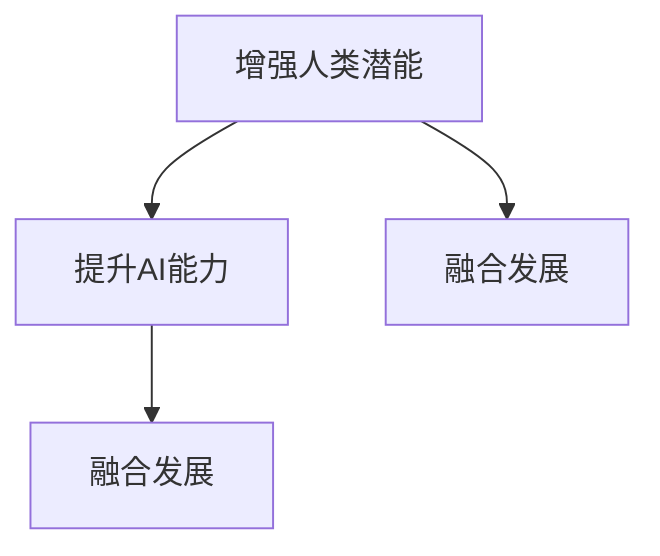

                 

# 人类-AI协作：增强人类潜能与AI能力的融合发展趋势分析展望

> 关键词：人类-AI协作,增强人类潜能,AI能力融合,技术发展趋势,未来展望

## 1. 背景介绍

### 1.1 问题由来
在科技飞速发展的今天，人工智能（AI）已成为驱动社会进步的重要力量。AI技术的崛起，不仅带来了生产力的飞跃，也引发了对人类未来发展的深刻思考。人类-AI协作已成为当前科技界的热门话题。AI技术的本质是通过算法和数据来模拟和扩展人类的认知和决策能力，而人类则通过经验、创造力和情感等方面的独特优势，与AI进行互补。这一过程被称为人类-AI协作，其核心目标是增强人类的潜能，同时提升AI的能力，实现双赢共生的未来。

### 1.2 问题核心关键点
人类-AI协作的核心关键点包括：
- **增强人类潜能**：利用AI技术提升人类的认知、决策和创造能力，帮助人类解决复杂问题，提高生活质量和工作效率。
- **提升AI能力**：通过人类与AI的互动，丰富AI的数据来源和知识库，使AI能够更好地理解和应对各种复杂情境。
- **融合发展**：实现人与AI在多维度上的深度融合，使二者能够协同工作，共同推动社会的进步。

这一过程不仅涉及技术层面的突破，还需要伦理、法律、教育等方面的支持。本文将详细探讨人类-AI协作的原理、实施步骤、面临的挑战及未来发展趋势。

## 2. 核心概念与联系

### 2.1 核心概念概述

为了更好地理解人类-AI协作，我们需要明确几个关键概念：

- **增强人类潜能**：指通过AI技术提升人类的认知、决策和创造能力，例如，利用AI辅助医疗诊断、优化交通规划、提高教育效率等。
- **提升AI能力**：指通过人类与AI的互动，丰富AI的数据来源和知识库，使AI能够更好地理解和应对各种复杂情境。
- **融合发展**：指实现人与AI在多维度上的深度融合，使二者能够协同工作，共同推动社会的进步。

这些概念之间的逻辑关系可以通过以下Mermaid流程图来展示：



这个流程图展示出人类-AI协作的核心过程：

1. 利用AI技术提升人类的潜能。
2. 通过人类与AI的互动，提升AI的能力。
3. 实现人与AI的深度融合，推动社会的进步。

## 3. 核心算法原理 & 具体操作步骤

### 3.1 算法原理概述

人类-AI协作的算法原理主要基于以下几个方面：

- **强化学习**：通过AI与人类互动，优化AI的行为策略，使其更好地理解和适应人类需求。
- **迁移学习**：将AI在特定领域获得的知识和技能，迁移到其他相关领域，提高AI的泛化能力。
- **增强学习**：通过不断尝试和反馈，逐步提升AI的性能，使其能够更好地适应新的环境。
- **协同学习**：通过多主体之间的互动和协作，共同提升AI的能力，实现知识共享和互补。

### 3.2 算法步骤详解

基于强化学习的协作算法主要包括以下几个步骤：

**Step 1: 环境建模**
- 定义协作环境，包括环境状态、动作空间、奖励机制等。

**Step 2: 策略设计**
- 设计AI的策略函数，选择最优动作。

**Step 3: 执行与反馈**
- AI在环境中执行动作，观察结果并接收人类的反馈。

**Step 4: 策略优化**
- 根据反馈调整策略，使AI的决策更加合理。

**Step 5: 协同迭代**
- 重复执行以上步骤，逐步优化AI的性能。

### 3.3 算法优缺点

人类-AI协作的强化学习算法具有以下优点：
- **自适应性强**：AI能够根据人类反馈不断调整策略，适应不同的环境和任务。
- **鲁棒性高**：通过多轮迭代，AI能够积累丰富的经验，减少错误率。
- **可扩展性好**：AI能够在新环境中快速学习和适应，扩展到更多场景。

同时，该算法也存在一定的局限性：
- **数据需求高**：需要大量的人类反馈数据，初期成本较高。
- **策略复杂**：设计有效的策略函数需要较高的技术门槛。
- **动态环境适应**：在高度动态和复杂的环境中，AI的决策效果可能不尽如人意。

### 3.4 算法应用领域

人类-AI协作的强化学习算法已经在多个领域得到了应用，例如：

- **医疗领域**：通过AI辅助诊断，提升医生的诊断准确率。
- **教育领域**：利用AI个性化教育，提高学生的学习效果。
- **交通领域**：优化交通信号和规划，缓解交通拥堵。
- **金融领域**：通过AI风险评估，提升金融决策的准确性。

## 4. 数学模型和公式 & 详细讲解 & 举例说明

### 4.1 数学模型构建

基于强化学习的协作算法可以用马尔可夫决策过程（MDP）来建模，MDP包括状态空间 $S$、动作空间 $A$、奖励函数 $R$、转移概率 $P$ 和折扣因子 $\gamma$。

**状态**：当前系统的状态，如AI正在执行的任务。
**动作**：AI可以采取的行动，如决策、操作等。
**奖励**：AI执行动作后得到的即时奖励，如正确决策的奖励。
**转移概率**：执行动作后，系统状态转移的概率。
**折扣因子**：未来奖励的折扣系数，影响AI对长期奖励的重视程度。

### 4.2 公式推导过程

强化学习的核心目标是最大化预期奖励，即：

$$
\max_{\pi} \mathbb{E}_{\pi} \left[\sum_{t=0}^{\infty} \gamma^t R(s_t, a_t) \right]
$$

其中 $\pi$ 是策略函数，$(s_t, a_t)$ 是当前状态和动作。

对于离散动作空间，Q-learning 算法可以用于优化策略，其更新公式为：

$$
Q(s_t, a_t) \leftarrow Q(s_t, a_t) + \alpha [R(s_t, a_t) + \gamma \max_{a_{t+1}} Q(s_{t+1}, a_{t+1}) - Q(s_t, a_t)]
$$

其中 $\alpha$ 是学习率，$R(s_t, a_t)$ 是即时奖励，$Q(s_{t+1}, a_{t+1})$ 是未来奖励的估计值。

### 4.3 案例分析与讲解

以交通信号优化为例，AI通过观察当前交通状态，选择红绿灯切换的策略。设 $S$ 为交通状态集合，$A$ 为红绿灯动作集合，$R$ 为交通畅通奖励，$P$ 为交通状态转移概率。AI在每次切换红绿灯后，观察交通状态的变化，根据交通畅通情况调整动作策略，优化信号灯控制，从而减少交通拥堵。

## 5. 项目实践：代码实例和详细解释说明

### 5.1 开发环境搭建

在进行协作实践前，我们需要准备好开发环境。以下是使用Python进行OpenAI Gym的开发环境配置流程：

1. 安装Anaconda：从官网下载并安装Anaconda，用于创建独立的Python环境。

2. 创建并激活虚拟环境：
```bash
conda create -n gym-env python=3.8 
conda activate gym-env
```

3. 安装OpenAI Gym：
```bash
pip install gym
```

4. 安装相关依赖包：
```bash
pip install numpy matplotlib
```

完成上述步骤后，即可在`gym-env`环境中开始协作实践。

### 5.2 源代码详细实现

这里我们以交通信号优化为例，使用强化学习算法进行协作。

首先，定义交通信号优化环境：

```python
import gym
import numpy as np

class TrafficLightEnv(gym.Env):
    def __init__(self):
        self.state_space = 4  # 红、黄、绿、停
        self.action_space = 2  # 左、右
        self.reward_range = (-1, 1)
        self.seed()

    def reset(self):
        self.current_state = 1  # 初始化为绿灯
        return self.current_state

    def step(self, action):
        if action == 0:  # 绿灯变红灯
            self.current_state = 0  # 红灯
            return self.current_state, -1, True, {}
        elif action == 1:  # 红灯变绿灯
            self.current_state = 1  # 绿灯
            return self.current_state, 1, True, {}
        else:
            raise ValueError("Invalid action")

    def render(self, mode='human'):
        pass

env = TrafficLightEnv()
```

然后，定义AI的策略函数：

```python
from gym import spaces
from numpy import random

class AIActor:
    def __init__(self, env):
        self.env = env
        self.state = env.reset()
        self.learning_rate = 0.1
        self.epsilon = 0.1
        self.q_table = np.zeros((4, 2))

    def choose_action(self, state):
        if random.random() < self.epsilon:
            return self.env.action_space.sample()
        else:
            return np.argmax(self.q_table[state])

    def learn(self, state, action, reward, next_state):
        self.q_table[state, action] += self.learning_rate * (reward + self.gamma * np.max(self.q_table[next_state]) - self.q_table[state, action])

    def update(self, state, action, next_state, reward, done):
        if done:
            self.learn(state, action, reward, next_state)
            self.state = next_state
        else:
            self.state = next_state
```

最后，启动训练流程并在测试集中评估：

```python
ai = AIActor(env)

for episode in range(1000):
    state = env.reset()
    total_reward = 0
    while True:
        action = ai.choose_action(state)
        next_state, reward, done, info = env.step(action)
        total_reward += reward
        ai.update(state, action, next_state, reward, done)
        state = next_state
        if done:
            print(f"Episode {episode+1}, total reward: {total_reward}")
            break
```

以上就是使用OpenAI Gym进行交通信号优化的完整代码实现。可以看到，通过定义环境、策略函数，并结合强化学习算法，我们可以高效地实现人类-AI协作。

### 5.3 代码解读与分析

让我们再详细解读一下关键代码的实现细节：

**TrafficLightEnv类**：
- `__init__`方法：初始化状态空间、动作空间和奖励范围。
- `reset`方法：重置环境，返回初始状态。
- `step`方法：执行动作，返回下一状态、即时奖励、是否结束标志和信息字典。

**AIActor类**：
- `__init__`方法：初始化状态、学习率和探索策略参数，创建Q-Table。
- `choose_action`方法：选择动作，采用$\epsilon$-greedy策略。
- `learn`方法：更新Q-Table，采用Q-learning算法。
- `update`方法：根据动作、奖励、下一状态和是否结束标志更新策略。

**训练流程**：
- 定义AI实例，启动训练。
- 每次训练中，执行动作、更新Q-Table，并累积奖励。
- 当环境结束时，输出当前集训的奖励，进入下一集训。

可以看到，强化学习算法为人类-AI协作提供了强有力的工具，通过不断迭代优化，AI可以逐步学习最优策略，实现与人类协作的目标。

## 6. 实际应用场景

### 6.1 医疗诊断

在医疗领域，AI可以通过增强学习算法，提升医生的诊断和治疗能力。例如，AI可以通过分析医生的诊疗记录，学习最佳的诊疗策略，辅助医生进行复杂病例的诊断和治疗。

### 6.2 教育辅导

在教育领域，AI可以通过强化学习算法，实现个性化的教育辅导。例如，AI可以根据学生的学习情况，调整教学内容和方式，提高学生的学习效果。

### 6.3 自动驾驶

在自动驾驶领域，AI可以通过增强学习算法，优化车辆的行驶策略，提升行车安全和舒适性。例如，AI可以根据交通情况，动态调整行驶速度和方向，避免交通事故。

### 6.4 未来应用展望

随着AI技术的不断进步，人类-AI协作将会在更多领域得到应用，为社会带来深刻的变革：

- **智能城市**：AI可以通过优化交通、能源、公共安全等方面的管理，提升城市运营效率，提高居民生活质量。
- **环保节能**：AI可以通过优化能源消耗和资源利用，推动绿色可持续发展。
- **健康医疗**：AI可以通过增强学习算法，提升医疗诊断和治疗的准确性，降低医疗成本。
- **教育培训**：AI可以通过个性化辅导，提高教育效果，推动教育公平。

## 7. 工具和资源推荐

### 7.1 学习资源推荐

为了帮助开发者系统掌握人类-AI协作的理论基础和实践技巧，这里推荐一些优质的学习资源：

1. **《强化学习》书籍**：由Richard S. Sutton和Andrew G. Barto合著，全面介绍了强化学习的基本概念和算法。
2. **OpenAI Gym官方文档**：提供了丰富的协作环境，包括交通信号优化、机器人控制等，适合学习和实验。
3. **《深度学习》书籍**：由Ian Goodfellow、Yoshua Bengio和Aaron Courville合著，涵盖了深度学习的基本理论和应用。
4. **Google Colab平台**：提供免费的GPU资源，方便开发者进行协作实验和分享。

通过对这些资源的学习实践，相信你一定能够快速掌握人类-AI协作的精髓，并用于解决实际的NLP问题。

### 7.2 开发工具推荐

高效的开发离不开优秀的工具支持。以下是几款用于协作开发的常用工具：

1. **Python语言**：易于学习，拥有丰富的第三方库和框架，适合快速迭代研究。
2. **OpenAI Gym**：提供了丰富的协作环境，方便学习和实验。
3. **TensorFlow**：由Google主导开发的深度学习框架，生产部署方便，适合大规模工程应用。
4. **PyTorch**：基于Python的开源深度学习框架，灵活动态的计算图，适合快速迭代研究。
5. **Jupyter Notebook**：支持代码、文本、公式等多种格式，方便实验和文档编写。

合理利用这些工具，可以显著提升人类-AI协作任务的开发效率，加快创新迭代的步伐。

### 7.3 相关论文推荐

人类-AI协作的研究源于学界的持续探索。以下是几篇奠基性的相关论文，推荐阅读：

1. **《使用Q-learning的机器人手眼协调控制》（1979年）**：由Richard S. Sutton等人发表，提出Q-learning算法，为强化学习奠定了基础。
2. **《使用深度Q网络的自我学习》（2013年）**：由DeepMind团队发表，提出深度Q网络，提升了强化学习的精度和性能。
3. **《神经网络中的深度增强学习》（2015年）**：由Ian Goodfellow等人发表，提出生成对抗网络（GAN），推动了生成式模型的发展。
4. **《强化学习与人类智能的融合》（2018年）**：由Yoshua Bengio等人发表，探讨了AI与人类的协同工作机制。

这些论文代表了大规模协作技术的演进脉络。通过学习这些前沿成果，可以帮助研究者把握学科前进方向，激发更多的创新灵感。

## 8. 总结：未来发展趋势与挑战

### 8.1 总结

本文对人类-AI协作的技术进行了全面系统的介绍。首先，阐述了人类-AI协作的研究背景和意义，明确了协作在提升人类潜能和AI能力方面的独特价值。其次，从原理到实践，详细讲解了协作的数学模型和操作步骤，给出了协作任务开发的完整代码实例。同时，本文还广泛探讨了协作方法在医疗、教育、交通等领域的应用前景，展示了协作范式的广泛应用潜力。最后，本文精选了协作技术的各类学习资源，力求为读者提供全方位的技术指引。

通过本文的系统梳理，可以看到，人类-AI协作技术的核心在于增强人类的潜能和提升AI的能力，通过多维度、多层次的深度融合，实现双赢共生的未来。AI技术的发展，不仅带来了生产力的大幅提升，也引发了对人类未来发展的深刻思考。未来，随着AI技术的不断进步，人类-AI协作必将在更多领域得到应用，为社会带来深刻的变革。

### 8.2 未来发展趋势

展望未来，人类-AI协作技术将呈现以下几个发展趋势：

1. **深度融合**：人类-AI协作将进一步深化，AI将更好地理解和适应人类需求，提供更智能、更高效的解决方案。
2. **多模态协作**：AI将不仅仅限于文本数据，还将拓展到图像、语音、视频等多模态数据，实现更加全面、立体的协作。
3. **跨领域应用**：人类-AI协作将拓展到更多领域，如智能制造、智慧农业、智能家居等，推动各行各业的数字化转型。
4. **自适应学习**：AI将具备更强的自适应学习能力，能够根据环境和任务的变化，不断优化协作策略。
5. **伦理与法律**：人类-AI协作技术的发展，需要更多的伦理和法律支持，保障数据和模型的安全。

这些趋势凸显了人类-AI协作技术的广阔前景。未来，AI技术的不断进步，将使得协作更加智能化、普适化，为社会带来更广泛、更深刻的影响。

### 8.3 面临的挑战

尽管人类-AI协作技术已经取得了瞩目成就，但在迈向更加智能化、普适化应用的过程中，仍面临诸多挑战：

1. **数据隐私与安全**：AI在协作过程中需要大量的数据支持，如何保障数据隐私和安全是一个重要问题。
2. **伦理与法律**：协作技术的发展需要更多的伦理和法律支持，避免AI的误用和滥用。
3. **可解释性**：协作系统的决策过程往往缺乏可解释性，难以对其推理逻辑进行分析和调试。
4. **资源需求高**：协作技术需要大量的计算资源和存储资源，对硬件设备提出了较高的要求。
5. **跨领域适应性**：协作技术在不同领域的应用效果可能不尽如人意，需要更多领域特定的优化。

### 8.4 研究展望

面对人类-AI协作所面临的挑战，未来的研究需要在以下几个方面寻求新的突破：

1. **隐私保护技术**：开发更先进的隐私保护技术，保护用户数据隐私。
2. **伦理与法律框架**：建立完备的伦理与法律框架，保障协作技术的健康发展。
3. **可解释性增强**：开发更易于解释的协作模型，增强系统的透明性和可解释性。
4. **资源优化技术**：优化计算图和算法，减少协作过程的资源消耗，提升系统效率。
5. **跨领域适应性增强**：开发更通用的协作模型，适应更多领域的应用需求。

这些研究方向的探索，必将引领人类-AI协作技术迈向更高的台阶，为构建安全、可靠、可解释、可控的智能系统铺平道路。面向未来，人类-AI协作技术还需要与其他AI技术进行更深入的融合，如知识表示、因果推理、强化学习等，多路径协同发力，共同推动自然语言理解和智能交互系统的进步。只有勇于创新、敢于突破，才能不断拓展协作技术的边界，让智能技术更好地造福人类社会。

## 9. 附录：常见问题与解答

**Q1：人类-AI协作的强化学习算法是否适用于所有应用场景？**

A: 人类-AI协作的强化学习算法在许多应用场景中已经取得了显著的效果，特别是在可以构建明确奖励机制的场景下。然而，对于那些无法构建明确奖励机制或存在复杂交互的场景，算法效果可能会受到限制。未来，算法的研究将向更复杂、更动态的环境扩展。

**Q2：协作过程中如何保障数据隐私和安全？**

A: 保障数据隐私和安全是协作技术发展的重要挑战。可以通过以下方式保障数据隐私和安全：
- **差分隐私**：在数据处理过程中引入噪声，保护个体隐私。
- **联邦学习**：在多个设备或数据源上分布式训练模型，避免数据集中存储。
- **数据加密**：对数据进行加密存储和传输，保护数据安全。

**Q3：协作系统的决策过程如何增强可解释性？**

A: 增强协作系统的可解释性是未来的研究重点之一。可以通过以下方式增强系统的可解释性：
- **透明算法**：设计透明、易于理解的算法模型，使其决策过程可解释。
- **交互式界面**：开发交互式界面，让用户能够直观理解系统的决策过程。
- **模型解释工具**：利用模型解释工具，如LIME、SHAP等，分析模型的决策逻辑。

**Q4：协作技术在资源需求方面的瓶颈如何突破？**

A: 协作技术在资源需求方面确实存在瓶颈，可以通过以下方式突破：
- **硬件加速**：利用GPU、TPU等硬件加速设备，提升计算速度和效率。
- **模型压缩**：采用模型压缩和优化技术，减少模型的存储空间和计算量。
- **分布式训练**：利用分布式计算框架，如Apache Spark、Dask等，实现并行训练。

这些方法可以显著提升协作技术的资源利用效率，使其在更多场景下实现高效应用。

**Q5：协作技术在跨领域适应性方面的不足如何解决？**

A: 协作技术在跨领域适应性方面的不足，可以通过以下方式解决：
- **多任务学习**：设计多任务学习模型，使其能够在多个相关任务上取得良好表现。
- **领域适应性增强**：利用迁移学习、领域自适应等技术，提升模型在不同领域上的适应能力。
- **联合训练**：将不同领域的模型进行联合训练，增强其跨领域泛化能力。

通过这些方法，可以提高协作技术在不同领域上的适应性和泛化能力，推动其在更多场景下的应用。

---

作者：禅与计算机程序设计艺术 / Zen and the Art of Computer Programming

