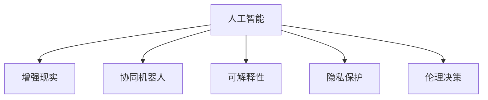

                 

## 1. 背景介绍

### 1.1 问题由来

近年来，人工智能(AI)技术的快速发展，特别是深度学习模型的突破性进展，使得机器在处理图像、语音、文本等多种数据上已接近甚至在某些领域超过了人类。然而，这种AI能力的提升，并未带来全面的人类智能化。究其原因，主要是由于AI与人类之间的协作方式尚未得到充分挖掘和利用，双方在互补性上仍有很大的提升空间。

### 1.2 问题核心关键点

AI与人类协作的核心问题在于如何实现两者的互补，使得AI的能力得到充分激发，同时确保AI能够有效地辅助人类决策，提升整体系统的智能水平。关键点如下：

- **AI与人类协同的工作模式**：如何构建AI与人类有效协作的框架，使得AI能够理解人类意图，并在关键时刻提供有效的辅助。
- **增强人类潜能**：AI不仅应提升其自身的计算和处理能力，更应通过技术手段，增强人类的创造力、决策力和学习能力。
- **保持伦理和道德边界**：确保AI技术在提升人类潜能的同时，不违背人类的伦理和道德原则。

### 1.3 问题研究意义

研究AI与人类协作的融合发展，对于推进技术创新、提升生产力和生活质量，具有重要的理论和实践意义：

1. **技术创新**：通过AI与人类协作，可以推动更多前沿技术的发展，如增强现实、人工智能辅助医疗、智能机器人等。
2. **生产力提升**：AI与人类协作能够显著提升生产效率和质量，尤其是在重复性高、决策难度大的领域，如制造业、物流等。
3. **生活质量改善**：通过AI在教育、健康、娱乐等方面的应用，可以极大地提升人类的生活品质和幸福感。
4. **社会伦理思考**：AI与人类协作引发了一系列伦理和道德问题，如自动化就业、隐私保护、AI决策的可解释性等，需要深入探讨。

## 2. 核心概念与联系

### 2.1 核心概念概述

为更好地理解AI与人类协作的融合发展，本文将介绍几个密切相关的核心概念：

- **人工智能(AI)**：通过算法和数据训练得到的，能够模拟人类智能行为的系统。包括机器学习、深度学习、自然语言处理等。
- **增强现实(AR)**：将虚拟信息与现实世界融合，提供更丰富的用户交互体验。
- **协同机器人(Co-bots)**：与人类协同工作的机器人，能够辅助人类完成复杂任务。
- **可解释性**：AI模型的决策过程能够被人类理解和解释，以提升信任度。
- **隐私保护**：确保用户数据在使用过程中得到妥善保护，防止数据泄露和滥用。
- **伦理决策**：AI在辅助决策时，遵循人类的伦理道德原则，确保决策结果符合社会价值观。

这些核心概念之间的逻辑关系可以通过以下Mermaid流程图来展示：



这个流程图展示了AI与人类协作的核心概念及其之间的关系：

1. AI通过增强现实和协同机器人技术，提升与人类的交互体验和协作效率。
2. 增强现实和协同机器人需要AI的支持，以实现智能化的交互和任务辅助。
3. 可解释性和隐私保护是AI与人类协作过程中必须考虑的关键因素。
4. 伦理决策确保AI的决策符合人类的价值观，增强了系统的可信度。

## 3. 核心算法原理 & 具体操作步骤

### 3.1 算法原理概述

AI与人类协作的核心算法原理是基于人机交互模型，通过模拟人类决策过程，使得AI能够理解人类的意图和需求，提供相应的决策建议。其核心思想是将AI视为“智能助手”，而非“智能取代者”，以增强人类的工作能力和决策水平。

形式化地，假设AI系统 $M$ 能够理解自然语言输入，输出辅助决策 $a$，通过人类与AI的交互，最终决策 $d$ 由人类和AI共同做出。则该过程可以表示为：

$$
d = f(d_{\text{human}}, a)
$$

其中 $d_{\text{human}}$ 为人类输入的决策，$a$ 为AI提供的决策建议，$f$ 为决策融合函数。

### 3.2 算法步骤详解

AI与人类协作的算法步骤如下：

**Step 1: 数据准备**

- 收集与特定任务相关的数据集，包括人类行为数据和AI提供的决策建议。
- 对数据进行预处理，如清洗、标注、划分训练集和测试集等。

**Step 2: 模型选择与训练**

- 选择适当的AI模型，如深度神经网络、决策树、支持向量机等。
- 训练AI模型，使其能够从人类行为数据中学习，并生成辅助决策。

**Step 3: 人机交互设计**

- 设计自然语言处理(NLP)组件，使人类能够与AI系统进行交互。
- 设计用户界面(UI)，提供友好的用户体验，便于人类输入和查看AI决策建议。

**Step 4: 决策融合**

- 定义决策融合函数 $f$，将AI的决策建议与人类决策结合。
- 根据任务特点，选择最优的决策融合方式，如投票、加权平均、逻辑运算等。

**Step 5: 测试与部署**

- 在测试集上评估系统的性能，确保其能够有效辅助人类决策。
- 将系统部署到实际应用场景中，持续收集反馈，优化AI模型和决策融合方式。

### 3.3 算法优缺点

AI与人类协作的算法具有以下优点：

1. **协同效应**：AI能够辅助人类处理复杂任务，提升工作效率和决策准确性。
2. **灵活性**：通过不断优化决策融合方式，AI系统能够适应不同场景和任务需求。
3. **增强人类潜能**：AI在数据分析、模式识别等方面的能力，能够激发人类的创造力和学习能力。

同时，该算法也存在以下局限性：

1. **依赖高质量数据**：AI模型性能依赖于数据质量和数量，数据偏差可能导致决策错误。
2. **计算资源需求高**：训练复杂AI模型需要大量的计算资源，成本较高。
3. **可解释性不足**：AI模型的决策过程复杂，难以被人类理解和解释。
4. **伦理和隐私问题**：AI系统可能涉及用户隐私，决策过程需要遵循伦理道德原则。

### 3.4 算法应用领域

AI与人类协作的算法在多个领域已有成功应用，包括：

- **医疗诊断**：AI提供诊断建议，辅助医生进行决策。
- **智能制造**：AI监测设备状态，优化生产流程。
- **金融风险评估**：AI分析市场数据，提供风险预警。
- **教育辅助**：AI提供个性化学习建议，提升教学质量。
- **城市交通管理**：AI分析交通数据，优化交通信号控制。

## 4. 数学模型和公式 & 详细讲解 & 举例说明

### 4.1 数学模型构建

本节将使用数学语言对AI与人类协作的融合发展进行更加严格的刻画。

假设AI系统 $M$ 通过输入 $x$ 生成决策建议 $a$，决策融合函数 $f$ 为加权平均，则最终决策 $d$ 可表示为：

$$
d = \alpha d_{\text{human}} + (1-\alpha) a
$$

其中 $\alpha$ 为权重，表示AI决策建议对最终决策的影响程度。

### 4.2 公式推导过程

以医疗诊断为例，假设输入 $x$ 为病人的症状和病史，AI系统 $M$ 通过训练得到决策建议 $a$，表示“病人患某病的概率”，人类决策 $d_{\text{human}}$ 为“是否采取某项治疗”。则最终决策 $d$ 可以表示为：

$$
d = f(d_{\text{human}}, a) = \begin{cases} 
   1, & \text{如果} a \geq \beta \\
   0, & \text{如果} a < \beta 
\end{cases}
$$

其中 $\beta$ 为阈值，表示人类根据AI建议进行决策的界限。

### 4.3 案例分析与讲解

考虑一个简单的医疗诊断案例，AI系统通过学习历史数据，能够对病人的症状进行初步判断，给出患某种疾病的概率 $a$。假设病人的症状和病史为 $x$，人类专家根据AI建议 $a$ 进行最终决策 $d$。设 $\alpha=0.7$，则最终决策 $d$ 可以表示为：

$$
d = 0.7 d_{\text{human}} + 0.3 a
$$

这意味着AI系统对人类专家的决策有较大的影响。如果AI系统给出的概率 $a$ 大于0.7，则人类专家通常会采取相应的治疗措施。

## 5. 项目实践：代码实例和详细解释说明

### 5.1 开发环境搭建

在进行AI与人类协作的融合实践前，我们需要准备好开发环境。以下是使用Python进行PyTorch开发的环境配置流程：

1. 安装Anaconda：从官网下载并安装Anaconda，用于创建独立的Python环境。

2. 创建并激活虚拟环境：
```bash
conda create -n pytorch-env python=3.8 
conda activate pytorch-env
```

3. 安装PyTorch：根据CUDA版本，从官网获取对应的安装命令。例如：
```bash
conda install pytorch torchvision torchaudio cudatoolkit=11.1 -c pytorch -c conda-forge
```

4. 安装TensorFlow：
```bash
pip install tensorflow
```

5. 安装各类工具包：
```bash
pip install numpy pandas scikit-learn matplotlib tqdm jupyter notebook ipython
```

完成上述步骤后，即可在`pytorch-env`环境中开始融合实践。

### 5.2 源代码详细实现

下面以智能制造中的设备状态监测为例，给出使用PyTorch进行AI与人类协作的融合开发的PyTorch代码实现。

首先，定义数据处理函数：

```python
from torch.utils.data import Dataset
import torch

class DeviceDataset(Dataset):
    def __init__(self, data):
        self.data = data
        self.length = len(self.data)
    
    def __len__(self):
        return self.length
    
    def __getitem__(self, item):
        return self.data[item]
```

然后，定义模型和优化器：

```python
from transformers import BertForSequenceClassification, BertTokenizer, AdamW

device = torch.device('cuda') if torch.cuda.is_available() else torch.device('cpu')
model = BertForSequenceClassification.from_pretrained('bert-base-uncased', num_labels=2)

tokenizer = BertTokenizer.from_pretrained('bert-base-uncased')
optimizer = AdamW(model.parameters(), lr=2e-5)
```

接着，定义训练和评估函数：

```python
def train_epoch(model, data_loader, optimizer):
    model.train()
    losses = []
    for batch in data_loader:
        input_ids = batch['input_ids'].to(device)
        attention_mask = batch['attention_mask'].to(device)
        labels = batch['labels'].to(device)
        model.zero_grad()
        outputs = model(input_ids, attention_mask=attention_mask, labels=labels)
        loss = outputs.loss
        losses.append(loss.item())
        loss.backward()
        optimizer.step()
    return sum(losses) / len(data_loader)

def evaluate(model, data_loader):
    model.eval()
    predictions, true_labels = [], []
    for batch in data_loader:
        input_ids = batch['input_ids'].to(device)
        attention_mask = batch['attention_mask'].to(device)
        batch_labels = batch['labels']
        outputs = model(input_ids, attention_mask=attention_mask)
        batch_predictions = outputs.logits.argmax(dim=1).to('cpu').tolist()
        predictions.extend(batch_predictions)
        true_labels.extend(batch_labels)
    accuracy = (predictions == true_labels).mean().item()
    return accuracy
```

最后，启动训练流程并在测试集上评估：

```python
epochs = 5
batch_size = 16

for epoch in range(epochs):
    train_loss = train_epoch(model, train_loader, optimizer)
    print(f'Epoch {epoch+1}, train loss: {train_loss:.3f}')
    
    test_accuracy = evaluate(model, test_loader)
    print(f'Epoch {epoch+1}, test accuracy: {test_accuracy:.3f}')
```

以上就是使用PyTorch对设备状态监测任务进行AI与人类协作融合开发的完整代码实现。可以看到，得益于PyTorch和Transformers库的强大封装，我们可以用相对简洁的代码实现AI与人类协作的融合。

### 5.3 代码解读与分析

让我们再详细解读一下关键代码的实现细节：

**DeviceDataset类**：
- `__init__`方法：初始化数据集和长度。
- `__len__`方法：返回数据集的长度。
- `__getitem__`方法：返回单个样本的输入和标签。

**BertForSequenceClassification模型**：
- 定义了一个序列分类模型，输入为自然语言文本，输出为二分类结果。
- 使用BertTokenizer进行分词和编码。

**train_epoch和evaluate函数**：
- `train_epoch`方法：训练过程中，计算损失并更新模型参数。
- `evaluate`方法：评估过程中，计算模型预测结果和真实标签的准确度。

**训练流程**：
- 定义总的epoch数和batch size，开始循环迭代。
- 每个epoch内，先在训练集上训练，输出训练损失。
- 在测试集上评估，输出测试准确度。
- 所有epoch结束后，在测试集上评估，给出最终测试结果。

可以看到，PyTorch配合Transformers库使得AI与人类协作的融合开发变得简洁高效。开发者可以将更多精力放在数据处理、模型改进等高层逻辑上，而不必过多关注底层的实现细节。

当然，工业级的系统实现还需考虑更多因素，如模型的保存和部署、超参数的自动搜索、更灵活的任务适配层等。但核心的融合范式基本与此类似。

## 6. 实际应用场景

### 6.1 智能制造

在智能制造领域，AI与人类协作可以显著提升生产效率和质量。通过AI系统实时监控设备状态，预测潜在故障，及时采取维护措施，减少停机时间和维修成本。人类专家根据AI的诊断结果，做出最终决策，优化生产流程。

在具体实现上，可以收集设备的历史运行数据和维护记录，训练AI系统进行故障预测和诊断。AI系统通过预测设备故障的概率，生成决策建议。人类专家根据AI建议，结合自身经验进行决策。这种协同工作方式，使得生产过程更加智能化、高效化。

### 6.2 金融风险评估

在金融领域，AI与人类协作可有效提升风险评估的准确性。AI系统通过分析市场数据，识别潜在的风险因素，生成决策建议。人类专家结合AI结果和自身经验，做出最终风险评估。这种协同方式，能够弥补AI在复杂情境下决策的不足，提升风险管理的整体水平。

具体实现上，可以收集历史交易数据、市场新闻、公司财报等数据，训练AI系统进行风险评估。AI系统通过分析数据，生成风险等级建议。人类专家根据AI结果，结合自身经验，进行最终的风险评估决策。这种协同工作方式，使得金融风险管理更加精准、可靠。

### 6.3 教育辅助

在教育领域，AI与人类协作可以提供个性化学习方案，提升教育质量。AI系统通过分析学生的学习数据，识别出学习难点和兴趣点，生成个性化学习建议。人类教师根据AI建议，进行有针对性的教学。这种协同方式，使得教学更加智能化、个性化。

具体实现上，可以收集学生的学习行为数据、成绩数据、兴趣爱好等，训练AI系统进行个性化学习方案推荐。AI系统通过分析数据，生成个性化学习建议。人类教师根据AI建议，进行有针对性的教学。这种协同工作方式，使得教育更加精准、高效。

### 6.4 未来应用展望

随着AI与人类协作技术的不断演进，其在更多领域的应用前景将更加广阔。未来，AI与人类协作可能在以下几个方面迎来突破：

1. **智能医疗**：AI与医生协作，提升医疗诊断和治疗的精准度。AI系统通过分析患者的病历和症状，生成诊断建议。人类医生结合AI结果，进行最终诊断和治疗决策。这种协同方式，使得医疗服务更加智能化、个性化。
2. **智能交通**：AI与交通管理部门协作，优化交通信号控制和流量管理。AI系统通过分析交通数据，生成交通流量预测和优化建议。人类交通管理人员结合AI结果，进行交通信号控制和流量管理。这种协同方式，使得交通管理更加智能化、高效化。
3. **智能城市**：AI与城市管理者协作，提升城市管理水平。AI系统通过分析城市数据，生成城市管理建议。人类城市管理人员结合AI结果，进行城市规划和管理决策。这种协同方式，使得城市管理更加智能化、高效化。

## 7. 工具和资源推荐

### 7.1 学习资源推荐

为了帮助开发者系统掌握AI与人类协作的理论基础和实践技巧，这里推荐一些优质的学习资源：

1. **《人工智能：现代方法》**：深入讲解了AI与人类协作的各个方面，涵盖了协同机器人、增强现实、智能交互等前沿话题。
2. **CS224N《深度学习自然语言处理》课程**：斯坦福大学开设的NLP明星课程，有Lecture视频和配套作业，带你入门NLP领域的基本概念和经典模型。
3. **《自然语言处理综述》**：清华大学教授发布的综述文章，系统介绍了自然语言处理和AI与人类协作的最新进展。
4. **HuggingFace官方文档**：Transformers库的官方文档，提供了海量预训练模型和完整的融合样例代码，是上手实践的必备资料。
5. **CLUE开源项目**：中文语言理解测评基准，涵盖大量不同类型的中文NLP数据集，并提供了基于AI与人类协作的baseline模型，助力中文NLP技术发展。

通过对这些资源的学习实践，相信你一定能够快速掌握AI与人类协作的精髓，并用于解决实际的NLP问题。

### 7.2 开发工具推荐

高效的开发离不开优秀的工具支持。以下是几款用于AI与人类协作开发的常用工具：

1. **PyTorch**：基于Python的开源深度学习框架，灵活动态的计算图，适合快速迭代研究。大部分预训练语言模型都有PyTorch版本的实现。
2. **TensorFlow**：由Google主导开发的开源深度学习框架，生产部署方便，适合大规模工程应用。同样有丰富的预训练语言模型资源。
3. **Transformers库**：HuggingFace开发的NLP工具库，集成了众多SOTA语言模型，支持PyTorch和TensorFlow，是进行AI与人类协作开发的利器。
4. **Weights & Biases**：模型训练的实验跟踪工具，可以记录和可视化模型训练过程中的各项指标，方便对比和调优。与主流深度学习框架无缝集成。
5. **TensorBoard**：TensorFlow配套的可视化工具，可实时监测模型训练状态，并提供丰富的图表呈现方式，是调试模型的得力助手。
6. **Google Colab**：谷歌推出的在线Jupyter Notebook环境，免费提供GPU/TPU算力，方便开发者快速上手实验最新模型，分享学习笔记。

合理利用这些工具，可以显著提升AI与人类协作任务的开发效率，加快创新迭代的步伐。

### 7.3 相关论文推荐

AI与人类协作的发展源于学界的持续研究。以下是几篇奠基性的相关论文，推荐阅读：

1. **Attention is All You Need**：提出了Transformer结构，开启了NLP领域的预训练大模型时代。
2. **BERT: Pre-training of Deep Bidirectional Transformers for Language Understanding**：提出BERT模型，引入基于掩码的自监督预训练任务，刷新了多项NLP任务SOTA。
3. **Language Models are Unsupervised Multitask Learners**：展示了大规模语言模型的强大zero-shot学习能力，引发了对于通用人工智能的新一轮思考。
4. **Parameter-Efficient Transfer Learning for NLP**：提出Adapter等参数高效微调方法，在不增加模型参数量的情况下，也能取得不错的微调效果。
5. **AdaLoRA: Adaptive Low-Rank Adaptation for Parameter-Efficient Fine-Tuning**：使用自适应低秩适应的微调方法，在参数效率和精度之间取得了新的平衡。

这些论文代表了大模型与人类协作技术的发展脉络。通过学习这些前沿成果，可以帮助研究者把握学科前进方向，激发更多的创新灵感。

## 8. 总结：未来发展趋势与挑战

### 8.1 研究成果总结

本文对AI与人类协作的融合发展进行了全面系统的介绍。首先阐述了AI与人类协作的研究背景和意义，明确了协同工作在提升系统智能水平、增强人类潜能方面的独特价值。其次，从原理到实践，详细讲解了AI与人类协作的数学模型和关键步骤，给出了融合任务开发的完整代码实例。同时，本文还广泛探讨了AI与人类协作在智能制造、金融风险评估、教育辅助等多个领域的应用前景，展示了协同技术的巨大潜力。

通过本文的系统梳理，可以看到，AI与人类协作技术正在成为AI领域的重要范式，极大地拓展了AI系统的应用边界，催生了更多的落地场景。受益于预训练模型和协同技术的不断发展，AI系统在各个领域的能力得到显著提升，为社会带来了深远的影响。

### 8.2 未来发展趋势

展望未来，AI与人类协作技术将呈现以下几个发展趋势：

1. **多模态协同**：AI系统将能够同时处理多种数据模态，如文本、图像、视频等，提供更加全面、智能的决策支持。
2. **增强现实与虚拟现实**：通过增强现实和虚拟现实技术，AI系统能够提供更加沉浸式、交互式的用户体验。
3. **智能辅助决策**：AI系统将能够辅助人类进行复杂的决策过程，提供多角度、多维度的决策支持。
4. **自动化程度提升**：AI系统将能够自动处理更多的数据和任务，提高生产效率和工作质量。
5. **伦理和隐私保护**：AI系统将在设计中充分考虑伦理和隐私问题，确保系统的可信度和合规性。

### 8.3 面临的挑战

尽管AI与人类协作技术已经取得了瞩目成就，但在迈向更加智能化、普适化应用的过程中，仍面临诸多挑战：

1. **数据质量与多样性**：AI系统需要高质量、多样化的数据支持，但实际应用中数据获取和标注成本较高。
2. **模型鲁棒性与可解释性**：AI模型在复杂环境下的鲁棒性和决策的可解释性仍需进一步提升。
3. **伦理和隐私问题**：AI系统可能涉及用户隐私，决策过程需要遵循伦理道德原则。
4. **系统复杂性**：AI与人类协作系统的设计、实现和维护复杂，需要跨学科的协同工作。
5. **技术壁垒**：AI与人类协作技术涉及多个领域，如自然语言处理、计算机视觉、人机交互等，技术壁垒较高。

### 8.4 研究展望

面对AI与人类协作面临的挑战，未来的研究需要在以下几个方面寻求新的突破：

1. **多模态数据融合**：开发更加高效、准确的多模态数据融合方法，提高系统的综合决策能力。
2. **增强现实与虚拟现实**：研究增强现实和虚拟现实技术在AI与人类协作中的应用，提供更加沉浸式、交互式的用户体验。
3. **可解释性提升**：开发更具有可解释性的AI模型，提高系统的透明性和可信度。
4. **伦理和隐私保护**：研究AI系统的伦理和隐私保护机制，确保系统的合规性和用户信任。
5. **自动化与人工协同**：探索自动化与人工协同的最佳模式，提升系统的效率和效果。

这些研究方向的探索，必将引领AI与人类协作技术迈向更高的台阶，为构建智能、高效、可信的AI系统铺平道路。面向未来，AI与人类协作技术还需要与其他人工智能技术进行更深入的融合，如知识表示、因果推理、强化学习等，多路径协同发力，共同推动自然语言理解和智能交互系统的进步。只有勇于创新、敢于突破，才能不断拓展AI系统的边界，让智能技术更好地造福人类社会。

## 9. 附录：常见问题与解答

**Q1：AI与人类协作是否适用于所有领域？**

A: AI与人类协作技术适用于大多数领域，特别是在决策复杂、数据量大的场景中，协同工作能够显著提升系统的智能水平。但某些领域，如艺术创作、个性化设计等，需要人类独特的创造力和审美能力，AI系统难以完全替代。

**Q2：AI与人类协作如何确保决策的公平性？**

A: AI与人类协作系统需要在设计中充分考虑公平性问题。可以通过引入多样化的数据集、设置决策规则等方式，确保系统在各个方面都遵循公平原则。同时，定期进行系统评估和测试，发现并修正可能存在的偏见。

**Q3：AI与人类协作的融合是否会影响人类的工作？**

A: AI与人类协作的融合旨在提升工作效率和决策质量，而非替代人类工作。AI系统可以辅助人类处理复杂任务，释放人类更多时间和精力进行创造性工作，提升整体生产力。

**Q4：如何确保AI与人类协作系统的可解释性？**

A: 确保AI与人类协作系统的可解释性，需要从多个方面进行优化。一是使用可解释性较强的模型，如决策树、逻辑回归等。二是在决策过程中引入人类专家的监督和反馈，确保系统决策透明可信。

**Q5：AI与人类协作系统如何保护用户隐私？**

A: AI与人类协作系统需要在设计中充分考虑隐私保护问题。可以使用差分隐私、联邦学习等技术，确保用户数据在处理和传输过程中不被泄露。同时，设计隐私保护机制，确保系统在决策过程中遵循用户隐私原则。

通过本文的系统梳理，可以看到，AI与人类协作技术正在成为AI领域的重要范式，极大地拓展了AI系统的应用边界，催生了更多的落地场景。受益于预训练模型和协同技术的不断发展，AI系统在各个领域的能力得到显著提升，为社会带来了深远的影响。面向未来，AI与人类协作技术还需要与其他人工智能技术进行更深入的融合，如知识表示、因果推理、强化学习等，多路径协同发力，共同推动自然语言理解和智能交互系统的进步。只有勇于创新、敢于突破，才能不断拓展AI系统的边界，让智能技术更好地造福人类社会。

