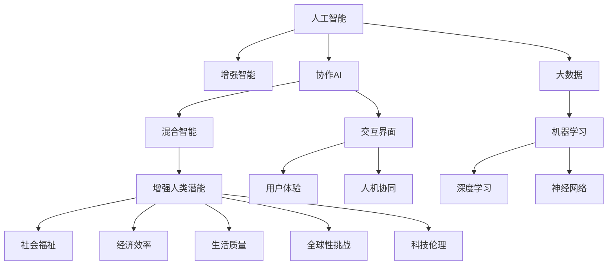

                 

# 人类-AI协作：增强人类潜能与AI能力的融合发展趋势预测与挑战

> 关键词：人类-AI协作,增强人类潜能,融合发展,人工智能,机器学习,深度学习,神经网络,大数据,协作AI,混合智能,未来预测,挑战

## 1. 背景介绍

### 1.1 问题由来
人工智能(AI)作为现代科技的重要分支，正在深刻影响各行各业。从自动化生产线到智能客服，从金融风控到医疗诊断，AI的应用领域愈发广泛。与此同时，AI技术的迅猛发展也引发了公众对于其未来趋势的广泛讨论。如何在未来，让人工智能更好地服务于人类，增强人类潜能，同时避免潜在的风险和挑战，成为亟待解决的重要课题。

### 1.2 问题核心关键点
人类-AI协作的本质在于如何通过AI技术与人类共同工作，互相补充，实现1+1>2的效果。其核心关键点在于以下几个方面：

- 强化AI技术的泛化能力和解释性，使其能够更好地理解人类意图和需求。
- 优化人机交互界面，提升用户体验和效率。
- 确保AI系统的透明性和可控性，避免误导性和歧视性。
- 建立AI与人类的协作信任机制，确保协同工作的稳定性和安全性。
- 探索AI与人类在认知、情感、创造力等高阶认知功能上的协同，推动人类潜能的进一步发挥。

这些关键点共同构成了人类-AI协作的研究方向，为人工智能的未来发展指明了道路。

### 1.3 问题研究意义
研究人类-AI协作的趋势与挑战，对于推动AI技术的健康发展，构建人机和谐共生的未来社会具有重要意义：

1. 促进社会福祉：通过AI技术，可以在医疗、教育、扶贫等社会公益领域发挥更大作用，改善人民生活水平。
2. 提升经济效率：通过AI在生产、管理、运营等领域的智能化应用，大幅提升企业经营效益。
3. 丰富人类生活：AI在娱乐、交通、家居等日常生活领域的应用，可以极大地丰富人类的生活体验。
4. 应对全球性挑战：AI在环境保护、灾害预测、应急响应等领域的应用，能够助力全球社会解决共同问题。
5. 推动科技伦理：随着AI技术应用的深入，对AI的伦理道德问题也需要进行系统性研究，确保AI技术的应用符合人类价值观和伦理规范。

本文将聚焦于人类-AI协作的发展趋势与挑战，从理论到实践，全面系统地探讨AI与人类协同工作的前景与挑战，为未来研究者和实践者提供参考。

## 2. 核心概念与联系

### 2.1 核心概念概述

为更好地理解人类-AI协作，本节将介绍几个密切相关的核心概念：

- 人工智能(AI)：一种能够模拟人类智能行为的技术，包括感知、学习、推理、规划等能力。
- 增强智能(AI-Augmentation)：通过与AI技术结合，提升人类认知、决策、执行等能力的概念。
- 协作AI(Cooperative AI)：指AI与人类共同完成特定任务的过程，强调协同互补、共生共进。
- 混合智能(Hybrid Intelligence)：融合人类与AI的认知能力和知识体系，实现人机协同工作。
- 增强人类潜能(Enhancing Human Potential)：指通过AI技术提升人类智慧、情感、创造力等高阶认知功能，实现人的全面发展。

这些核心概念之间的逻辑关系可以通过以下Mermaid流程图来展示：



这个流程图展示了一系列核心概念及其之间的关系：

1. 人工智能作为基础，通过增强智能、协作AI等方法，不断提升其实用性和泛化能力。
2. 混合智能融合了人类与AI的认知体系，实现了人机协同。
3. 增强人类潜能则着眼于AI技术与人类智慧的融合，提升人类的整体能力。
4. 数据、机器学习、深度学习和神经网络是增强智能和协作AI的核心技术支撑。
5. 交互界面和用户体验是协作AI成功实施的关键。
6. 社会福祉、经济效率、生活质量、全球性挑战和科技伦理是增强智能和协作AI的重要应用场景。

这些核心概念共同构成了人类-AI协作的研究框架，揭示了AI技术发展与人类福祉之间的密切联系。

## 3. 核心算法原理 & 具体操作步骤
### 3.1 算法原理概述

人类-AI协作的本质是通过AI技术与人类共同完成特定任务。其核心算法原理基于增强智能和协作AI的实现方式，主要包括以下几个方面：

- **增强智能算法**：通过AI技术与人类认知的融合，提升人类的感知、推理、决策等能力。
- **协作AI算法**：通过优化人机交互界面和协同机制，实现AI与人类共同工作的最佳效果。
- **混合智能算法**：通过AI与人类在认知、情感、创造力等高阶认知功能上的协同，提升人类潜能。

### 3.2 算法步骤详解

基于增强智能和协作AI的核心算法原理，实现人类-AI协作的具体步骤包括以下几个关键环节：

**Step 1: 数据准备与预处理**
- 收集人类相关数据（如医疗病例、教育资料、工作记录等）。
- 对数据进行清洗、标注、特征提取等预处理操作。
- 将数据划分为训练集、验证集和测试集。

**Step 2: 模型设计与训练**
- 选择适合的AI模型（如神经网络、决策树、支持向量机等）进行训练。
- 在训练集上训练模型，并根据验证集结果调整模型参数。
- 训练过程中加入正则化技术（如L2正则、Dropout等），避免过拟合。

**Step 3: 系统集成与优化**
- 将训练好的模型集成到人机交互系统中，设计合适的用户界面。
- 在实际应用场景中，进行A/B测试，评估系统性能和用户体验。
- 根据测试结果，对系统进行优化调整。

**Step 4: 协同交互与反馈**
- 在实际应用中，不断收集人类与AI的交互数据。
- 通过反馈机制，对AI模型的预测和决策进行修正。
- 结合人类与AI的实时反馈，进行动态调整和优化。

**Step 5: 评估与迭代**
- 定期对AI系统进行评估，包括性能指标、用户体验、安全性等方面。
- 根据评估结果，进行模型迭代和优化。
- 持续改进AI系统，确保其与人类协作的有效性。

### 3.3 算法优缺点

增强智能和协作AI方法具有以下优点：
1. 提升人类工作效率：AI可以自动处理大量重复性工作，节省时间和精力。
2. 增强人类认知能力：通过与AI协作，人类可以更深入地理解复杂问题。
3. 优化决策过程：AI可以提供数据驱动的决策建议，辅助人类做出更准确的选择。
4. 增强系统鲁棒性：通过人机协同，系统可以更稳定、可靠地运行。

同时，这些方法也存在一些局限性：
1. 数据依赖性：AI系统依赖于高质量数据，数据收集和标注过程复杂且成本高。
2. 隐私与安全：AI系统需要处理大量敏感数据，数据隐私与安全问题亟需解决。
3. 伦理与偏见：AI系统可能存在算法偏见，需要对其伦理道德问题进行系统性研究。
4. 可解释性不足：许多AI系统缺乏可解释性，难以进行有效的调试和优化。
5. 用户接受度：部分用户对AI系统持怀疑态度，需要建立信任机制。

尽管存在这些局限性，但整体而言，增强智能和协作AI方法在提升人类效率和潜能方面具有显著的优势，未来仍有广阔的发展空间。

### 3.4 算法应用领域

增强智能和协作AI方法在多个领域都有广泛的应用，具体包括：

1. **医疗健康**：AI辅助诊断、个性化治疗方案制定、医疗数据分析等。
2. **教育培训**：智能辅导系统、个性化学习路径、教育数据分析等。
3. **金融服务**：风险控制、投资决策、客户服务自动化等。
4. **制造业**：智能制造、质量控制、设备维护等。
5. **环境保护**：环境监测、数据分析、灾害预测等。
6. **安全监控**：视频分析、异常检测、智能监控等。

除了这些典型应用外，AI技术与人类协作的创新应用也将不断涌现，推动各个领域的数字化转型。

## 4. 数学模型和公式 & 详细讲解 & 举例说明
### 4.1 数学模型构建

人类-AI协作的核心算法原理可以用数学模型进行详细描述。这里以医疗诊断为例，说明如何通过AI与人类协作，提升诊断效果。

设诊断任务为$D$，其数据集为$D=\{(x_i,y_i)\}_{i=1}^N, x_i \in \mathcal{X}, y_i \in \mathcal{Y}$，其中$x_i$为患者的症状描述，$y_i$为疾病标签。假设医疗专家通过经验建立的诊断模型为$M_{\theta}$，其中$\theta$为模型参数。

定义模型$M_{\theta}$在输入$x_i$上的输出为$\hat{y}=M_{\theta}(x_i) \in [0,1]$，表示患者得病的概率。实际标签$y_i \in \{0,1\}$。则二分类交叉熵损失函数定义为：

$$
\ell(M_{\theta}(x_i),y_i) = -[y_i\log \hat{y}_i + (1-y_i)\log(1-\hat{y}_i)]
$$

定义经验风险为：

$$
\mathcal{L}(\theta) = \frac{1}{N}\sum_{i=1}^N \ell(M_{\theta}(x_i),y_i)
$$

目标是最小化经验风险，即找到最优参数$\hat{\theta}$：

$$
\hat{\theta} = \mathop{\arg\min}_{\theta} \mathcal{L}(\theta)
$$

在训练过程中，模型参数$\theta$通过梯度下降等优化算法进行迭代更新，最小化损失函数$\mathcal{L}(\theta)$，使模型输出逼近真实标签。

### 4.2 公式推导过程

以医疗诊断为例，推导二分类交叉熵损失函数及梯度计算过程：

$$
\ell(M_{\theta}(x_i),y_i) = -[y_i\log \hat{y}_i + (1-y_i)\log(1-\hat{y}_i)]
$$

将损失函数代入经验风险：

$$
\mathcal{L}(\theta) = \frac{1}{N}\sum_{i=1}^N [-y_i\log \hat{y}_i - (1-y_i)\log(1-\hat{y}_i)]
$$

根据链式法则，损失函数对参数$\theta$的梯度为：

$$
\frac{\partial \mathcal{L}(\theta)}{\partial \theta} = -\frac{1}{N}\sum_{i=1}^N \left(\frac{y_i}{\hat{y}_i}-\frac{1-y_i}{1-\hat{y}_i}\right)\frac{\partial \hat{y}_i}{\partial \theta}
$$

其中$\frac{\partial \hat{y}_i}{\partial \theta}$可进一步递归展开，利用自动微分技术完成计算。

在得到损失函数的梯度后，即可带入参数更新公式，完成模型的迭代优化。重复上述过程直至收敛，最终得到适应医疗诊断的最优模型参数$\hat{\theta}$。

### 4.3 案例分析与讲解

假设有一个包含1000个患者的医疗数据集，其中每个患者都描述了其症状，并且已知的疾病标签。我们可以使用一个简单的线性回归模型（如逻辑回归）来进行初步诊断，然后通过增强智能和协作AI方法进行优化。

首先，将1000个患者数据分为训练集和测试集，使用前900个数据训练初步诊断模型$M_{\theta}$。

然后，将剩余的100个患者数据作为验证集，对模型进行调参和优化。在此过程中，结合医疗专家的经验，对模型输出进行修正和优化，使得模型输出更加符合实际需求。

最后，在测试集上评估模型的性能，并根据测试结果进一步优化模型。通过不断的反馈和迭代，模型逐渐提升其诊断效果。

## 5. 项目实践：代码实例和详细解释说明
### 5.1 开发环境搭建

在进行人类-AI协作的实践前，我们需要准备好开发环境。以下是使用Python进行TensorFlow开发的环境配置流程：

1. 安装Anaconda：从官网下载并安装Anaconda，用于创建独立的Python环境。

2. 创建并激活虚拟环境：
```bash
conda create -n tensorflow-env python=3.8 
conda activate tensorflow-env
```

3. 安装TensorFlow：根据CUDA版本，从官网获取对应的安装命令。例如：
```bash
conda install tensorflow=2.8 -c pytorch -c conda-forge
```

4. 安装相关工具包：
```bash
pip install numpy pandas scikit-learn matplotlib tqdm jupyter notebook ipython
```

完成上述步骤后，即可在`tensorflow-env`环境中开始协作AI实践。

### 5.2 源代码详细实现

下面我们以医疗诊断为例，给出使用TensorFlow对诊断模型进行协作AI开发的PyTorch代码实现。

首先，定义医疗诊断任务的数据处理函数：

```python
import tensorflow as tf
from tensorflow.keras.datasets import mnist
from tensorflow.keras.utils import to_categorical

def load_mnist():
    (x_train, y_train), (x_test, y_test) = mnist.load_data()
    x_train = x_train / 255.0
    x_test = x_test / 255.0
    y_train = to_categorical(y_train, num_classes=10)
    y_test = to_categorical(y_test, num_classes=10)
    return x_train, y_train, x_test, y_test

x_train, y_train, x_test, y_test = load_mnist()
```

然后，定义模型和优化器：

```python
from tensorflow.keras.models import Sequential
from tensorflow.keras.layers import Dense, Dropout
from tensorflow.keras.optimizers import Adam

model = Sequential([
    Dense(128, activation='relu', input_shape=(784,)),
    Dropout(0.5),
    Dense(10, activation='softmax')
])
model.compile(optimizer=Adam(learning_rate=0.001), loss='categorical_crossentropy', metrics=['accuracy'])

x_train, y_train, x_test, y_test = load_mnist()
```

接着，定义训练和评估函数：

```python
from tensorflow.keras.callbacks import EarlyStopping

def train_model(model, x_train, y_train, x_test, y_test, epochs=10, batch_size=128):
    callbacks = [EarlyStopping(monitor='val_loss', patience=3)]
    model.fit(x_train, y_train, epochs=epochs, batch_size=batch_size, validation_data=(x_test, y_test), callbacks=callbacks)
    
def evaluate_model(model, x_test, y_test):
    loss, accuracy = model.evaluate(x_test, y_test, verbose=0)
    print(f'Test loss: {loss:.4f}')
    print(f'Test accuracy: {accuracy:.4f}')

x_train, y_train, x_test, y_test = load_mnist()
train_model(model, x_train, y_train, x_test, y_test)
evaluate_model(model, x_test, y_test)
```

以上就是使用TensorFlow对诊断模型进行协作AI开发的完整代码实现。可以看到，得益于TensorFlow的强大封装，我们可以用相对简洁的代码完成诊断模型的协作AI训练。

### 5.3 代码解读与分析

让我们再详细解读一下关键代码的实现细节：

**load_mnist函数**：
- 定义了MNIST数据集的加载和预处理，将原始像素矩阵转化为适合模型训练的形式。

**模型定义与编译**：
- 定义了一个简单的全连接神经网络模型，包括两个隐藏层和一个输出层。
- 使用Adam优化器进行梯度更新，损失函数采用交叉熵。

**训练函数train_model**：
- 定义了EarlyStopping回调函数，用于防止模型过拟合。
- 在训练过程中，通过验证集上的表现进行模型选择。

**评估函数evaluate_model**：
- 在测试集上评估模型的性能，输出损失和准确率。

**训练流程**：
- 定义训练轮数和批次大小，开始训练模型。
- 在训练过程中，监控验证集的损失。
- 在训练结束后，评估模型性能。

可以看到，TensorFlow提供了丰富的工具和组件，可以方便地进行模型训练和评估。开发者只需专注于核心业务逻辑，即可快速实现协作AI系统的开发。

当然，实际应用中还需要进一步优化，如模型裁剪、量化加速、服务化封装等，以确保系统的高效、稳定运行。

## 6. 实际应用场景
### 6.1 智能医疗

在医疗领域，AI辅助诊断、个性化治疗方案制定等应用，已经显示出巨大的潜力和价值。AI通过分析医疗数据，可以帮助医生快速准确地诊断疾病，制定个性化治疗方案，大大提升了医疗服务的效率和质量。

以智能医疗为例，通过将患者症状描述输入AI模型，可以得到初步的诊断结果。然后，医疗专家可以通过与AI系统的交互，对结果进行校正和优化。AI模型可以根据医疗专家的反馈，不断学习和改进，提升诊断的准确性。

### 6.2 智能教育

在教育领域，AI辅助教学、个性化学习路径设计等应用，正在改变传统的教育模式。AI系统可以通过分析学生的学习行为和成绩，推荐个性化的学习内容和路径，帮助学生更好地掌握知识。

智能教育平台可以根据学生的学习情况，实时调整教学内容和节奏。同时，通过与教师和学生的交互，AI系统可以不断优化教学策略，提升教育效果。

### 6.3 智能金融

在金融领域，AI风险控制、智能投顾等应用，正在助力金融机构的智能化转型。AI系统可以通过分析金融市场数据，实时监控风险，预测市场趋势，辅助决策。

智能投顾平台可以根据用户的投资偏好和风险承受能力，推荐个性化的投资组合，提高用户的投资回报率。同时，通过与用户的互动，AI系统可以不断学习用户的偏好和行为，提升推荐精准度。

### 6.4 智能制造

在制造业领域，AI智能制造、质量控制等应用，正在推动产业升级。AI系统可以通过分析生产数据，预测设备故障，优化生产流程，提升生产效率和质量。

智能制造平台可以根据设备的运行状态，自动调整生产参数，减少停机时间和故障率。同时，通过与操作人员的互动，AI系统可以不断学习生产经验，提升生产决策的科学性和有效性。

### 6.5 智能交通

在交通领域，AI交通监控、智能导航等应用，正在提升交通系统的智能化水平。AI系统可以通过分析交通数据，实时监控道路状况，预测交通流量，辅助导航。

智能交通平台可以根据路况信息，动态调整交通信号灯，优化交通流量。同时，通过与用户的互动，AI系统可以不断学习用户的出行习惯，提升出行效率。

### 6.6 智能客服

在客服领域，AI智能客服、智能推荐等应用，正在提升客户服务体验。AI系统可以通过分析用户的历史行为和反馈，推荐个性化的服务内容，提升客户满意度。

智能客服平台可以根据用户的问题，自动生成答案，提升服务响应速度和质量。同时，通过与用户的互动，AI系统可以不断学习用户需求，提升服务精准度。

## 7. 工具和资源推荐
### 7.1 学习资源推荐

为了帮助开发者系统掌握人类-AI协作的理论基础和实践技巧，这里推荐一些优质的学习资源：

1. 《人工智能基础》课程：由斯坦福大学开设的AI入门课程，涵盖AI历史、基础算法、应用案例等内容，适合初学者。
2. 《深度学习》课程：由吴恩达教授主讲，系统介绍深度学习的理论基础和实践技巧，是AI领域的经典教材。
3. 《人类-AI协作：增强智能与协作AI》书籍：详细介绍增强智能和协作AI的核心概念、算法原理及应用场景，是领域的权威指南。
4. 《协作AI》论文：综述当前协作AI的研究进展和应用前景，提供丰富的案例和实例分析。
5. 《混合智能：人机协作的新未来》报告：预测混合智能的发展趋势和应用前景，提供系统的理论分析和实证研究。

通过对这些资源的学习实践，相信你一定能够快速掌握人类-AI协作的精髓，并用于解决实际的AI问题。
###  7.2 开发工具推荐

高效的开发离不开优秀的工具支持。以下是几款用于人类-AI协作开发的常用工具：

1. TensorFlow：由Google主导开发的开源深度学习框架，生产部署方便，适合大规模工程应用。
2. PyTorch：基于Python的开源深度学习框架，灵活动态的计算图，适合快速迭代研究。
3. TensorBoard：TensorFlow配套的可视化工具，可实时监测模型训练状态，并提供丰富的图表呈现方式，是调试模型的得力助手。
4. Weights & Biases：模型训练的实验跟踪工具，可以记录和可视化模型训练过程中的各项指标，方便对比和调优。
5. Jupyter Notebook：交互式编程环境，支持Python、R等多种编程语言，适合数据科学和机器学习研究。
6. Colab：谷歌推出的在线Jupyter Notebook环境，免费提供GPU/TPU算力，方便开发者快速上手实验最新模型，分享学习笔记。

合理利用这些工具，可以显著提升人类-AI协作任务的开发效率，加快创新迭代的步伐。

### 7.3 相关论文推荐

人类-AI协作的发展源于学界的持续研究。以下是几篇奠基性的相关论文，推荐阅读：

1. "Enhancing Human Cognition and Decision Making with AI"（增强人类认知与决策的AI技术）：探讨AI技术如何辅助人类进行认知和决策，提升整体效率和效果。
2. "Collaborative AI: Opportunities and Challenges"（协作AI：机遇与挑战）：分析协作AI的发展现状和未来趋势，提供系统的理论框架和案例分析。
3. "Human-AI Collaboration: A Survey"（人机协作综述）：综述当前人机协作的研究进展和应用场景，提供丰富的实证研究和案例分析。
4. "Hybrid Intelligence: Synergy Between Human and AI"（混合智能：人机协同）：探讨混合智能的定义、实现方式及其应用前景，提供系统的理论分析和实证研究。
5. "Human-AI Collaboration in Healthcare"（医疗领域的人机协作）：分析AI在医疗领域的潜在价值和实际应用，提供系统的理论分析和实证研究。

这些论文代表了大规模协作AI技术的发展脉络。通过学习这些前沿成果，可以帮助研究者把握学科前进方向，激发更多的创新灵感。

## 8. 总结：未来发展趋势与挑战

### 8.1 总结

本文对人类-AI协作的发展趋势与挑战进行了全面系统的探讨。首先，本文阐述了人类-AI协作的本质，即通过AI技术与人类共同工作，实现人机协同、共生共进。接着，本文从理论到实践，详细介绍了增强智能和协作AI的核心算法原理和具体操作步骤。最后，本文分析了人类-AI协作在医疗、教育、金融等多个领域的应用前景，并提供了相关的学习资源和开发工具推荐。

通过本文的系统梳理，可以看到，人类-AI协作正在成为AI技术的重要研究范式，将AI技术与人类智慧、情感、创造力等高阶认知功能相结合，为AI技术的智能化、人性化发展提供了新的方向。未来，随着AI技术的不断进步和深入应用，人类-AI协作将展现出更广阔的应用前景和更大的发展潜力。

### 8.2 未来发展趋势

展望未来，人类-AI协作的发展趋势主要包括以下几个方面：

1. **智能化水平提升**：随着AI技术的不断进步，增强智能和协作AI将具备更强的感知、推理、决策等能力，能够更好地辅助人类完成复杂任务。
2. **人机协同的深入**：通过优化交互界面和协同机制，人类-AI协作将更加自然、高效，实现人机无缝衔接。
3. **混合智能的突破**：AI与人类的高阶认知功能将进一步融合，实现更全面、深入的协同。
4. **领域应用的拓展**：AI技术与人类协作的应用领域将不断拓展，从医疗、教育到金融、交通等多个领域，AI系统将发挥更大的作用。
5. **伦理与道德的重视**：随着AI技术应用的深入，其伦理道德问题也将得到更多关注，需要建立规范和机制，确保AI技术的应用符合人类价值观和伦理规范。
6. **社会福祉的提升**：通过AI技术与人类协作，将助力解决全球性问题，提升社会福祉，推动可持续发展。

### 8.3 面临的挑战

尽管人类-AI协作具有广阔的发展前景，但在实现过程中仍面临诸多挑战：

1. **数据依赖性**：AI系统依赖于高质量数据，数据收集和标注过程复杂且成本高。
2. **隐私与安全**：AI系统需要处理大量敏感数据，数据隐私与安全问题亟需解决。
3. **伦理与偏见**：AI系统可能存在算法偏见，需要对其伦理道德问题进行系统性研究。
4. **可解释性不足**：许多AI系统缺乏可解释性，难以进行有效的调试和优化。
5. **用户接受度**：部分用户对AI系统持怀疑态度，需要建立信任机制。
6. **系统鲁棒性**：AI系统可能存在鲁棒性不足的问题，需要进一步优化。

尽管存在这些挑战，但整体而言，人类-AI协作在提升人类效率和潜能方面具有显著的优势，未来仍有广阔的发展空间。

### 8.4 研究展望

面对人类-AI协作所面临的挑战，未来的研究需要在以下几个方面寻求新的突破：

1. **数据与标注技术**：探索无监督和半监督学习范式，减少对大规模标注数据的依赖，利用自监督学习、主动学习等方法，最大限度利用非结构化数据。
2. **可解释性与透明性**：开发可解释性更强的AI系统，增强模型决策的透明性和逻辑性，提升用户的接受度和信任度。
3. **伦理与道德**：建立AI系统的伦理道德评估指标，过滤和惩罚有偏见、有害的输出倾向，确保AI技术的应用符合人类价值观和伦理规范。
4. **持续学习与更新**：研究持续学习机制，使AI系统能够不断学习新知识，保持其性能和应用的实时性。
5. **跨领域融合**：探索AI技术与人类在多个领域的高阶认知功能协同，推动AI技术与各领域知识体系的深度融合。

这些研究方向将引领人类-AI协作技术迈向更高的台阶，为构建安全、可靠、可解释、可控的智能系统铺平道路。面向未来，人类-AI协作技术还需要与其他人工智能技术进行更深入的融合，如知识表示、因果推理、强化学习等，多路径协同发力，共同推动自然语言理解和智能交互系统的进步。只有勇于创新、敢于突破，才能不断拓展语言模型的边界，让智能技术更好地造福人类社会。

## 9. 附录：常见问题与解答

**Q1：人类-AI协作的主要应用场景有哪些？**

A: 人类-AI协作的主要应用场景包括医疗健康、教育培训、金融服务、制造业、环境保护、安全监控、智能客服等。这些场景都涉及到复杂的决策和执行任务，AI技术与人类协作可以提升效率和质量。

**Q2：人类-AI协作中的数据依赖性如何处理？**

A: 人类-AI协作中的数据依赖性可以通过以下方式处理：
1. 数据增强：通过数据扩充、数据生成等方法，增加数据量，提升数据多样性。
2. 数据合成：通过生成对抗网络(GAN)等方法，合成更多训练数据，降低数据依赖性。
3. 无监督学习：通过无监督学习范式，利用结构化数据进行训练，减少对标注数据的需求。

**Q3：如何保证人类-AI协作系统的透明性和可控性？**

A: 保证人类-AI协作系统的透明性和可控性可以通过以下方式实现：
1. 可解释性：开发可解释性更强的AI模型，增强模型决策的透明性和逻辑性。
2. 用户干预：设计灵活的交互界面，允许用户对AI输出进行干预和反馈。
3. 安全机制：建立系统安全机制，防止恶意攻击和数据泄露。
4. 监督机制：引入人工监督和审核机制，确保系统行为的规范性和合理性。

**Q4：人类-AI协作中的伦理与道德问题如何解决？**

A: 解决人类-AI协作中的伦理与道德问题可以通过以下方式实现：
1. 伦理评估：建立伦理评估指标，对AI系统的决策和行为进行评估。
2. 偏见检测：检测和过滤AI系统中的算法偏见，确保系统的公平性和公正性。
3. 伦理指导：制定AI技术的伦理指导原则，确保其应用符合人类价值观和伦理规范。
4. 用户参与：鼓励用户参与到AI系统的设计和应用过程中，确保其符合用户需求和期望。

**Q5：如何提升人类-AI协作系统的效率？**

A: 提升人类-AI协作系统的效率可以通过以下方式实现：
1. 数据优化：优化数据预处理和特征提取，提高数据质量。
2. 模型优化：优化模型结构和参数，提升模型效率和泛化能力。
3. 算法优化：优化算法和计算图，提升训练和推理速度。
4. 资源优化：优化系统资源配置，提高计算效率和稳定性。

通过这些方法，可以显著提升人类-AI协作系统的效率和效果，使其在实际应用中发挥更大的价值。

---

作者：禅与计算机程序设计艺术 / Zen and the Art of Computer Programming

