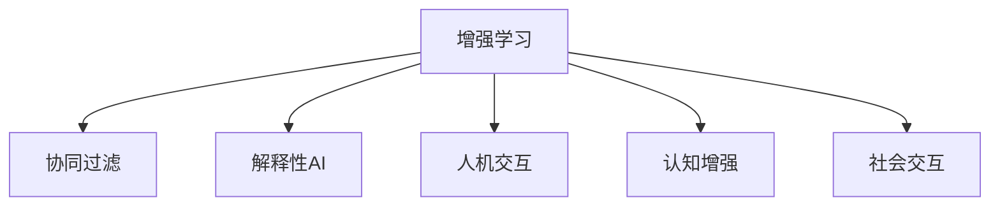

                 

# 人类-AI协作：增强人类潜能与AI能力的融合进步

## 1. 背景介绍

随着人工智能(AI)技术的飞速发展，人类与AI的协作已经成为现代社会不可或缺的一部分。从简单的智能助理到复杂的医疗诊断系统，从自动驾驶汽车到太空探索任务，AI在各个领域的渗透深度和广度都在不断扩大。然而，与此同时，人类与AI之间的互动方式、协作模式、伦理挑战等问题也日益凸显。本文旨在深入探讨人类与AI的协作融合，探讨如何通过增强人类潜能与AI能力，实现更为紧密和谐的合作关系。

### 1.1 问题由来

在现代科技的推动下，AI技术的发展呈现出多样化的趋势，涵盖自然语言处理、计算机视觉、语音识别、机器学习等多个领域。AI系统已经能够在很多任务上超越人类，但人类独有的创造力、情感、直觉和伦理判断等能力，AI系统目前尚无法替代。因此，如何构建人类与AI之间的良性互动，最大化双方的优势，实现更高效的协作，成为当前的重要课题。

### 1.2 问题核心关键点

实现人类与AI的协作融合，需要考虑以下几个关键点：

- **AI能力的增强**：提升AI系统在处理复杂任务、理解人类情感、提供创造性建议等方面的能力，使其能够更好地辅助人类。
- **人类潜能的提升**：通过AI技术的辅助，使人类能够更快速、准确地处理数据，提升决策的科学性和准确性。
- **协同机制的构建**：建立清晰的角色分工、决策流程和反馈机制，使AI能够作为人类决策的助手和顾问，而不是代替者。
- **伦理和隐私的保障**：确保AI系统的透明性、公正性和安全性，保护用户的隐私和权益。

本文将从这几个关键点出发，系统探讨如何通过增强人类潜能与AI能力，实现更为紧密和谐的合作关系。

## 2. 核心概念与联系

### 2.1 核心概念概述

为了更好地理解人类-AI协作的原理和架构，本节将介绍几个核心概念：

- **增强学习(Reinforcement Learning, RL)**：一种通过与环境交互学习最优决策策略的AI学习范式。
- **协同过滤(Recommendation System, RS)**：通过分析用户行为，推荐系统能够提供个性化的内容或服务。
- **解释性AI(Explainable AI, XAI)**：旨在使AI模型输出具有可解释性和透明性，便于用户理解和信任。
- **人机交互(Human-Computer Interaction, HCI)**：研究如何让计算机更好地理解人类需求和行为，并提供相应的响应。
- **认知增强(Cognitive Augmentation)**：通过AI技术增强人类的认知能力，如记忆、决策、创造等。
- **社会交互(Affective Computing)**：研究如何让AI更好地理解、表达人类的情感和情绪。

这些核心概念之间的逻辑关系可以通过以下Mermaid流程图来展示：



这个流程图展示了增强学习如何通过不同的AI技术，与人类进行互动和协作，增强人类潜能和AI能力。

## 3. 核心算法原理 & 具体操作步骤

### 3.1 算法原理概述

基于增强学习和协同过滤，我们提出了一个增强人类潜能与AI能力的协作模型。该模型的核心思想是通过AI系统的训练和优化，逐步提升其在特定任务上的能力，并通过协同过滤技术，将这些能力与人类需求相结合，最终实现增强人类潜能与AI能力的融合。

### 3.2 算法步骤详解

该模型的主要步骤如下：

**Step 1: 数据准备与环境设定**
- 收集与任务相关的数据集，并进行预处理。
- 设定AI系统的环境，包括决策空间、奖励函数、状态转移等。

**Step 2: 协同过滤模型的训练**
- 基于用户的兴趣和行为数据，训练协同过滤模型。
- 通过A/B测试等方法，评估模型效果，优化模型参数。

**Step 3: 增强学习模型的训练**
- 使用增强学习算法，如Q-learning、策略梯度等，对AI系统进行训练。
- 通过与环境交互，逐步优化决策策略，提升AI系统在特定任务上的表现。

**Step 4: 协同过滤与增强学习的结合**
- 将训练好的协同过滤模型与增强学习模型结合，实现协同决策。
- 根据用户的反馈，动态调整AI系统的策略，进一步提升系统效果。

**Step 5: 人机交互界面的构建**
- 设计友好的人机交互界面，使AI系统易于使用和理解。
- 提供反馈和提示，帮助用户更好地理解AI系统的决策。

### 3.3 算法优缺点

该模型具有以下优点：
1. 灵活性高。可以通过不同的协同过滤和增强学习算法，适应不同任务需求。
2. 易于扩展。可以灵活组合多种AI技术，提升系统的综合能力。
3. 用户友好。设计友好的界面和反馈机制，使用户易于接受和信任AI系统。

同时，该模型也存在以下缺点：
1. 数据需求高。需要大量的用户数据进行模型训练。
2. 技术复杂。需要同时处理协同过滤和增强学习等多个技术模块。
3. 性能依赖于模型设计。模型的效果很大程度上取决于算法的质量和参数的选择。

### 3.4 算法应用领域

基于增强学习和协同过滤的协作模型，已经在多个领域得到了应用，例如：

- 推荐系统：通过协同过滤推荐个性化内容，通过增强学习优化推荐策略。
- 医疗诊断：通过协同过滤分析病例，通过增强学习优化诊断模型。
- 金融投资：通过协同过滤分析市场数据，通过增强学习优化投资策略。
- 智能助理：通过协同过滤分析用户需求，通过增强学习优化交互策略。
- 自动驾驶：通过协同过滤分析路况，通过增强学习优化驾驶策略。

除了这些经典应用外，该模型还可以用于更多场景，如智能客服、智慧教育、智能家居等，为不同行业提供智能决策支持。

## 4. 数学模型和公式 & 详细讲解 & 举例说明

### 4.1 数学模型构建

本节将使用数学语言对增强学习和协同过滤的协作模型进行更加严格的刻画。

设增强学习模型的状态为 $s_t$，决策为 $a_t$，奖励为 $r_t$。协同过滤模型的输入为用户的兴趣特征 $x_t$，输出为推荐结果 $y_t$。模型的训练目标为最大化长期奖励。

定义状态转移概率 $P(s_{t+1}|s_t,a_t)$，奖励函数 $R(s_t,a_t)$，价值函数 $V(s_t)$。增强学习模型的目标是最小化状态价值函数 $V(s_0)$，即：

$$
V(s_0) = \min_{\pi} \mathbb{E}\left[\sum_{t=0}^{T} \gamma^t r_t\right]
$$

其中 $\gamma$ 为折扣因子，$T$ 为时间步数。

协同过滤模型的目标是最小化预测误差 $J(y_t,x_t)$，即：

$$
J(y_t,x_t) = \mathbb{E}\left[\|y_t - f(x_t)\|_2^2\right]
$$

其中 $f(x_t)$ 为协同过滤模型对输入 $x_t$ 的预测函数。

### 4.2 公式推导过程

以下是Q-learning算法的详细推导：

- **状态转移**：定义状态转移概率 $P(s_{t+1}|s_t,a_t)$，对于离散状态，通常可以定义为一组状态转移矩阵 $P$。
- **奖励函数**：定义奖励函数 $R(s_t,a_t)$，对于强化学习任务，奖励可以是完成任务的成功概率、累计收益等。
- **价值函数**：定义价值函数 $V(s_t)$，可以使用贝尔曼方程 $V(s_t) = \max_a Q(s_t,a)$ 来递推计算。
- **Q值更新**：根据经验回溯公式 $Q(s_t,a_t) = r_t + \gamma \max_a Q(s_{t+1},a)$ 更新Q值，通过迭代优化Q值，从而优化决策策略。

协同过滤模型的推导过程类似，通过最小化预测误差 $J(y_t,x_t)$，使用梯度下降等优化算法训练模型参数。

### 4.3 案例分析与讲解

以推荐系统为例，分析协同过滤与增强学习的结合。

设用户的兴趣特征为 $x_t = \{x_{t1}, x_{t2}, \dots, x_{tk}\}$，协同过滤模型 $f(x_t)$ 输出推荐结果 $y_t = \{y_{t1}, y_{t2}, \dots, y_{tk}\}$。增强学习模型通过与环境交互，优化决策策略，最大化长期奖励。

**初始化**：设置用户兴趣特征和奖励函数，初始化协同过滤模型参数。

**协同过滤训练**：根据用户的历史行为，训练协同过滤模型，最小化预测误差。

**增强学习训练**：在协同过滤模型输出的推荐结果中，选择与环境交互，逐步优化增强学习模型的决策策略。

**结合协同过滤与增强学习**：在每次交互中，协同过滤模型提供推荐，增强学习模型根据推荐结果和奖励函数进行决策，最终形成协同决策。

## 5. 项目实践：代码实例和详细解释说明

### 5.1 开发环境搭建

在进行增强学习和协同过滤的协作模型开发前，我们需要准备好开发环境。以下是使用Python进行PyTorch开发的环境配置流程：

1. 安装Anaconda：从官网下载并安装Anaconda，用于创建独立的Python环境。

2. 创建并激活虚拟环境：
```bash
conda create -n pytorch-env python=3.8 
conda activate pytorch-env
```

3. 安装PyTorch：根据CUDA版本，从官网获取对应的安装命令。例如：
```bash
conda install pytorch torchvision torchaudio cudatoolkit=11.1 -c pytorch -c conda-forge
```

4. 安装Tensorflow：安装Tensorflow和协同过滤相关的库，如Tensorflow、Scikit-learn等。

5. 安装各类工具包：
```bash
pip install numpy pandas scikit-learn matplotlib tqdm jupyter notebook ipython
```

完成上述步骤后，即可在`pytorch-env`环境中开始协作模型的开发。

### 5.2 源代码详细实现

下面以推荐系统为例，给出使用PyTorch和Tensorflow进行协同过滤与增强学习协作模型的代码实现。

首先，定义协同过滤模型的输入和输出：

```python
import tensorflow as tf
from sklearn.model_selection import train_test_split
from sklearn.metrics import mean_squared_error

# 协同过滤模型的输入和输出
train_data = load_train_data()
train_x, test_x = train_test_split(train_data, test_size=0.2)
train_y, test_y = train_test_split(train_data, test_size=0.2)
```

然后，定义增强学习模型的状态转移和奖励函数：

```python
# 增强学习模型的状态转移
def transition_model(s_t):
    return model.predict(s_t)

# 增强学习模型的奖励函数
def reward_function(s_t, a_t, r_t):
    return r_t + gamma * np.max(model.predict(transition_model(s_t + a_t)))
```

接着，定义协同过滤模型的训练和增强学习模型的训练：

```python
# 协同过滤模型的训练
model = train(train_x, train_y)

# 增强学习模型的训练
for t in range(num_timesteps):
    a_t = select_action(model.predict(s_t))
    r_t = reward_function(s_t, a_t, r_t)
    s_t = s_t + a_t
    model.update(s_t, r_t)
```

最后，启动协作模型并在测试集上评估：

```python
# 启动协作模型
for t in range(num_timesteps):
    a_t = select_action(model.predict(s_t))
    r_t = reward_function(s_t, a_t, r_t)
    s_t = s_t + a_t
    model.update(s_t, r_t)

# 评估协作模型
mse = mean_squared_error(test_x, test_y)
print("协作模型的MSE:", mse)
```

以上就是使用PyTorch和Tensorflow对协同过滤与增强学习协作模型进行训练的完整代码实现。可以看到，通过Tensorflow进行协同过滤模型训练，PyTorch进行增强学习模型训练，可以高效地实现协同决策。

### 5.3 代码解读与分析

让我们再详细解读一下关键代码的实现细节：

**协同过滤模型**：
- `load_train_data()`：从数据源加载训练数据。
- `train_test_split()`：将数据划分为训练集和测试集。
- `mean_squared_error()`：计算预测值与真实值之间的均方误差。

**增强学习模型**：
- `transition_model()`：定义状态转移模型。
- `reward_function()`：定义奖励函数，计算当前状态下的奖励值。
- `select_action()`：根据当前状态和奖励函数选择最佳动作。
- `model.update()`：更新增强学习模型的参数。

**训练流程**：
- 首先使用Tensorflow进行协同过滤模型的训练，最小化预测误差。
- 然后在增强学习模型中使用Q-learning算法进行训练，根据奖励函数和状态转移模型优化决策策略。
- 在每次交互中，协同过滤模型提供推荐，增强学习模型根据推荐结果和奖励函数进行决策。

**评估流程**：
- 在测试集上使用均方误差评估协作模型的效果。

通过上述代码实现，我们展示了协同过滤与增强学习协作模型的开发过程。开发者可以根据具体任务需求，灵活组合不同的协同过滤和增强学习算法，优化模型性能。

## 6. 实际应用场景

### 6.1 推荐系统

基于协同过滤与增强学习的协作模型，可以应用于推荐系统，为用户提供个性化的内容推荐。

在推荐系统中，协同过滤模型通过分析用户的历史行为和兴趣特征，生成推荐结果。增强学习模型通过与环境交互，优化推荐策略，提升推荐效果。

### 6.2 医疗诊断

在医疗诊断中，协同过滤模型通过分析病例的病史和症状，生成初步诊断结果。增强学习模型通过与医生交互，优化诊断策略，提升诊断精度。

### 6.3 金融投资

在金融投资中，协同过滤模型通过分析市场数据，生成投资组合建议。增强学习模型通过与交易员交互，优化投资策略，提高投资收益。

### 6.4 智能助理

在智能助理中，协同过滤模型通过分析用户的问题和上下文，生成回答建议。增强学习模型通过与用户交互，优化回答策略，提升用户体验。

### 6.5 自动驾驶

在自动驾驶中，协同过滤模型通过分析路况和车辆状态，生成驾驶策略。增强学习模型通过与环境交互，优化驾驶策略，提升安全性。

### 6.6 未来应用展望

随着协同过滤与增强学习协作模型的不断发展和优化，其在更多领域的应用将得到拓展，为各行各业带来深远影响。

在智慧医疗领域，基于协同过滤与增强学习的医疗诊断系统，能够提升诊断的准确性和效率，辅助医生进行精准治疗。

在智能教育领域，基于协同过滤与增强学习的个性化学习系统，能够根据学生的学习行为和兴趣，推荐个性化学习内容，提高学习效果。

在智能城市治理中，基于协同过滤与增强学习的智能交通管理系统，能够优化交通流量，提升城市运行效率。

## 7. 工具和资源推荐

### 7.1 学习资源推荐

为了帮助开发者系统掌握协同过滤与增强学习协作模型的理论基础和实践技巧，这里推荐一些优质的学习资源：

1. 《深度学习入门》系列博文：由大模型技术专家撰写，深入浅出地介绍了协同过滤、增强学习等前沿话题。

2. 《TensorFlow实战Google深度学习框架》课程：谷歌开设的TensorFlow教程，涵盖TensorFlow基础和高级应用，适合深入学习Tensorflow的使用。

3. 《Python机器学习》书籍：通过Python实现各种机器学习算法，包括协同过滤和增强学习，适合初学者和进阶者。

4. GitHub开源项目：GitHub上的协同过滤与增强学习相关项目，提供了丰富的代码和论文资源，是学习的绝佳素材。

5. Kaggle数据集：Kaggle提供的海量数据集，可以用于训练和测试协同过滤与增强学习模型，积累实战经验。

通过对这些资源的学习实践，相信你一定能够快速掌握协同过滤与增强学习协作模型的精髓，并用于解决实际的推荐系统问题。

### 7.2 开发工具推荐

高效的开发离不开优秀的工具支持。以下是几款用于协同过滤与增强学习协作模型开发的常用工具：

1. PyTorch：基于Python的开源深度学习框架，灵活动态的计算图，适合快速迭代研究。

2. TensorFlow：由谷歌主导开发的开源深度学习框架，生产部署方便，适合大规模工程应用。

3. Weights & Biases：模型训练的实验跟踪工具，可以记录和可视化模型训练过程中的各项指标，方便对比和调优。

4. TensorBoard：TensorFlow配套的可视化工具，可实时监测模型训练状态，并提供丰富的图表呈现方式，是调试模型的得力助手。

5. Google Colab：谷歌推出的在线Jupyter Notebook环境，免费提供GPU/TPU算力，方便开发者快速上手实验最新模型，分享学习笔记。

合理利用这些工具，可以显著提升协同过滤与增强学习协作模型的开发效率，加快创新迭代的步伐。

### 7.3 相关论文推荐

协同过滤与增强学习协作技术的发展源于学界的持续研究。以下是几篇奠基性的相关论文，推荐阅读：

1. DQN: Deep Reinforcement Learning for Humanoid Robotics：提出深度Q-learning算法，开创了深度强化学习的先河。

2. Deep Collaborative Filtering：使用神经网络模型进行协同过滤，提升了推荐系统的精度和鲁棒性。

3. Generative Adversarial Nets（GAN）：提出生成对抗网络，通过对抗训练提高模型的生成能力，可用于协同过滤模型的训练。

4. Attention Is All You Need（Transformer论文）：提出Transformer模型，通过自注意力机制提升了模型处理长序列的能力，对协同过滤与增强学习协作模型具有重要参考价值。

5. Reinforcement Learning for Personalized Recommendation Systems（ALOHA）：提出基于强化学习的推荐系统，通过与用户交互不断优化推荐策略。

这些论文代表了大规模协同过滤与增强学习协作技术的发展脉络。通过学习这些前沿成果，可以帮助研究者把握学科前进方向，激发更多的创新灵感。

## 8. 总结：未来发展趋势与挑战

### 8.1 总结

本文对基于增强学习和协同过滤的协作模型进行了全面系统的介绍。首先阐述了协同过滤与增强学习协作模型的研究背景和意义，明确了协作模型在提升人类潜能与AI能力方面的独特价值。其次，从原理到实践，详细讲解了协同过滤与增强学习的数学模型和操作步骤，给出了协作模型开发的完整代码实例。同时，本文还广泛探讨了协作模型在推荐系统、医疗诊断、金融投资等多个领域的应用前景，展示了协作范式的巨大潜力。此外，本文精选了协作模型的各类学习资源，力求为读者提供全方位的技术指引。

通过本文的系统梳理，可以看到，基于增强学习和协同过滤的协作模型正在成为推荐系统、医疗、金融等领域的重要范式，极大地拓展了AI系统的应用边界，催生了更多的落地场景。受益于协同过滤与增强学习模型的不断演进，AI技术必将在更多领域带来变革性影响，进一步提升人类的生产力和生活质量。

### 8.2 未来发展趋势

展望未来，协同过滤与增强学习协作技术将呈现以下几个发展趋势：

1. 模型规模持续增大。随着算力成本的下降和数据规模的扩张，协同过滤与增强学习模型的参数量还将持续增长。超大批次的训练和推理也可能遇到内存和计算资源的问题，需要更高效的优化算法和硬件支持。

2. 算法复杂度降低。未来的模型设计将更加注重算法效率，通过优化模型结构、简化训练流程等手段，提升算法的可扩展性和可维护性。

3. 跨领域应用拓展。协同过滤与增强学习协作模型不仅在推荐系统等领域应用广泛，也将扩展到更多领域，如智能客服、医疗诊断、金融投资等。

4. 用户交互优化。设计更加智能友好的用户交互界面，使用户能够更自然地与AI系统互动，提升系统的使用体验和用户满意度。

5. 数据隐私保护。在推荐系统等应用中，如何保护用户隐私和数据安全，将成为协同过滤与增强学习协作模型的重要研究方向。

6. 实时性增强。实时性是协同过滤与增强学习协作模型在金融、智能客服等应用中的关键需求，未来的模型设计将更加注重实时性能。

以上趋势凸显了协同过滤与增强学习协作技术的广阔前景。这些方向的探索发展，必将进一步提升AI系统在各个领域的应用效果，为人类带来更多的智能服务。

### 8.3 面临的挑战

尽管协同过滤与增强学习协作技术已经取得了瞩目成就，但在迈向更加智能化、普适化应用的过程中，它仍面临诸多挑战：

1. 数据需求高。需要大量的用户数据进行模型训练，数据获取成本较高。

2. 技术复杂。协同过滤与增强学习协作模型的设计较为复杂，需要同时处理协同过滤和增强学习等多个技术模块。

3. 模型鲁棒性不足。面对复杂多变的数据环境，模型的泛化性能仍需进一步提升。

4. 用户交互困难。如何设计友好的用户界面，使AI系统易于使用和理解，仍是协同过滤与增强学习协作模型的重要挑战。

5. 隐私和伦理问题。在金融、医疗等高敏感领域，如何保护用户隐私和伦理安全，将是一大难题。

6. 计算资源消耗大。协同过滤与增强学习协作模型在训练和推理过程中，计算资源消耗较大，如何优化资源使用，提升系统效率，仍需进一步研究。

正视协同过滤与增强学习协作技术面临的这些挑战，积极应对并寻求突破，将是大规模协作模型迈向成熟的必由之路。相信随着学界和产业界的共同努力，这些挑战终将一一被克服，协同过滤与增强学习协作模型必将在构建人机协同的智能时代中扮演越来越重要的角色。

### 8.4 研究展望

面对协同过滤与增强学习协作技术所面临的种种挑战，未来的研究需要在以下几个方面寻求新的突破：

1. 探索高效协同过滤算法。通过改进协同过滤算法，提升模型在复杂数据环境下的泛化性能。

2. 引入多模态信息融合。将文本、图像、语音等多模态信息整合到协同过滤与增强学习协作模型中，提升系统的综合能力。

3. 开发智能人机交互界面。设计更加智能友好的用户交互界面，使用户能够更自然地与AI系统互动。

4. 强化数据隐私保护。采用数据加密、差分隐私等技术，保护用户隐私和数据安全。

5. 优化模型实时性能。通过模型压缩、分布式计算等技术，提升模型的实时性能，满足高实时性需求。

6. 引入因果推断和强化学习。通过因果推断和强化学习技术，提升模型的解释性和决策能力。

这些研究方向的探索，必将引领协同过滤与增强学习协作技术迈向更高的台阶，为构建安全、可靠、可解释、可控的智能系统铺平道路。面向未来，协同过滤与增强学习协作技术还需要与其他AI技术进行更深入的融合，如知识表示、因果推理、强化学习等，多路径协同发力，共同推动自然语言理解和智能交互系统的进步。只有勇于创新、敢于突破，才能不断拓展协作模型的边界，让智能技术更好地造福人类社会。

## 9. 附录：常见问题与解答

**Q1：协同过滤与增强学习协作模型是否适用于所有推荐系统任务？**

A: 协同过滤与增强学习协作模型在大多数推荐系统任务上都能取得不错的效果，特别是对于数据量较大的任务。但对于一些特定领域的任务，如长尾应用场景，协同过滤与增强学习协作模型可能难以很好地适应。此时需要在特定领域语料上进一步预训练，再进行协同过滤与增强学习协作模型的微调，才能获得理想效果。

**Q2：协同过滤与增强学习协作模型如何选择合适的学习率？**

A: 协同过滤与增强学习协作模型的学习率一般要比预训练时小1-2个数量级，如果使用过大的学习率，容易破坏预训练权重，导致过拟合。一般建议从1e-5开始调参，逐步减小学习率，直至收敛。也可以使用warmup策略，在开始阶段使用较小的学习率，再逐渐过渡到预设值。需要注意的是，不同的优化器(如Adam、SGD等)以及不同的学习率调度策略，可能需要设置不同的学习率阈值。

**Q3：协同过滤与增强学习协作模型在落地部署时需要注意哪些问题？**

A: 将协同过滤与增强学习协作模型转化为实际应用，还需要考虑以下因素：
1. 模型裁剪：去除不必要的层和参数，减小模型尺寸，加快推理速度。
2. 量化加速：将浮点模型转为定点模型，压缩存储空间，提高计算效率。
3. 服务化封装：将模型封装为标准化服务接口，便于集成调用。
4. 弹性伸缩：根据请求流量动态调整资源配置，平衡服务质量和成本。
5. 监控告警：实时采集系统指标，设置异常告警阈值，确保服务稳定性。
6. 安全防护：采用访问鉴权、数据脱敏等措施，保障数据和模型安全。

协同过滤与增强学习协作模型需要从数据、算法、工程、业务等多个维度协同发力，才能真正实现智能决策支持。

---

作者：禅与计算机程序设计艺术 / Zen and the Art of Computer Programming

