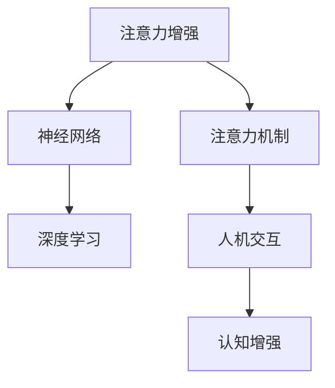

                 

# 人类注意力增强：提升专注力和注意力在商业中的未来发展机遇

> 关键词：注意力增强, 认知增强, 商业应用, 神经网络, 人机交互, 深度学习

## 1. 背景介绍

### 1.1 问题由来

在现代快节奏的生活和工作中，注意力已经成为影响人们表现和效率的关键因素。传统的注意机制往往难以适应当前复杂多变的注意力需求，特别是在信息过载的环境下，如何在短时间内高效获取并利用关键信息，已经成为亟待解决的问题。

### 1.2 问题核心关键点

注意力增强的目标是通过技术手段提升个体在信息处理、决策、学习等方面的注意力水平，从而提高效率和表现。其核心在于通过计算模型对注意力进行模拟和优化，增强注意力分配、信息整合和反应能力。

## 2. 核心概念与联系

### 2.1 核心概念概述

为更好地理解注意力增强，本节将介绍几个密切相关的核心概念：

- **注意力机制(Attention Mechanism)**：通过计算模型，模拟人类注意力分配过程，动态选择和整合输入数据的重要部分。
- **注意力增强(Attention Enhancement)**：通过深度学习等技术，增强注意力机制，提升个体在信息处理、学习、决策等方面的效率和表现。
- **神经网络(Neural Networks)**：基于神经元连接的网络结构，通过反向传播算法进行训练，可以模拟复杂的非线性关系。
- **人机交互(Human-Computer Interaction, HCI)**：研究如何通过计算机系统增强人类在交互中的感知、理解和响应能力，提升人机协作效率。
- **认知增强(Cognitive Enhancement)**：通过技术手段，提升人类的记忆、推理、创造等认知功能，增强学习能力、决策能力和适应能力。
- **深度学习(Deep Learning)**：一种基于多层神经网络的机器学习技术，通过多层次特征提取和训练，实现高精度和泛化能力的模型。

这些核心概念之间的逻辑关系可以通过以下Mermaid流程图来展示：



这个流程图展示了一些核心概念之间的联系：

1. 注意力增强是通过深度学习等技术对注意力机制进行模拟和优化。
2. 深度学习是实现注意力增强的核心手段之一。
3. 人机交互通过注意力增强，增强人类在信息处理、学习、决策等方面的表现。
4. 认知增强则通过注意力增强，提升人类的记忆、推理、创造等认知功能。

这些概念共同构成了注意力增强的理论基础，使其能够在信息处理、学习、决策等多个领域发挥强大的辅助作用。

## 3. 核心算法原理 & 具体操作步骤
### 3.1 算法原理概述

注意力增强的核心是建立一种动态的注意力分配机制，通过模拟人类注意力分配过程，使得计算机系统能够更加高效地处理和整合输入数据。其基本思想是通过计算模型，动态选择输入数据的某些部分进行重点处理，而忽略无关或不重要的部分。

形式化地，假设输入数据为 $x$，注意力模型为 $A$，注意力权重向量为 $w$，则注意力增强的过程可以表示为：

$$
y = A(x) \cdot w
$$

其中 $y$ 为增强后的输出结果，$A(x)$ 表示对输入数据 $x$ 的映射，$w$ 表示注意力权重向量。注意力权重向量 $w$ 通常通过模型训练得到，反映了输入数据的重要性和相关性。

### 3.2 算法步骤详解

注意力增强的算法步骤主要包括以下几个关键步骤：

**Step 1: 数据预处理**
- 将输入数据 $x$ 转换为模型可以处理的形式，如向量或矩阵。
- 对输入数据进行标准化、归一化等预处理操作，以提高模型的稳定性和收敛速度。

**Step 2: 模型训练**
- 定义注意力模型 $A$ 和注意力权重向量 $w$ 的计算公式，选择合适的损失函数。
- 使用反向传播算法，通过大量的标注数据对模型进行训练，学习输入数据的重要性和相关性。
- 设置合适的超参数，如学习率、批次大小等，控制训练过程的稳定性和收敛速度。

**Step 3: 模型推理**
- 将预处理后的输入数据 $x$ 输入训练好的模型 $A$，计算注意力权重向量 $w$。
- 根据注意力权重向量 $w$，对输入数据进行加权，生成增强后的输出结果 $y$。

**Step 4: 后处理**
- 对增强后的输出结果 $y$ 进行后处理操作，如归一化、去噪等，以提高输出的准确性和稳定性。
- 将增强后的结果用于实际应用，如信息检索、文本摘要、问答系统等。

### 3.3 算法优缺点

注意力增强具有以下优点：
1. 提升信息处理效率。通过动态选择重要信息，可以显著提高信息处理的速度和准确性。
2. 增强决策能力。通过优化注意力分配，可以在信息复杂的环境下做出更明智的决策。
3. 提高学习能力。通过优化注意力机制，可以更有效地整合和学习输入数据中的关键信息。

同时，该方法也存在一定的局限性：
1. 数据依赖性高。注意力增强的效果很大程度上依赖于输入数据的数量和质量，难以在数据稀缺的情况下发挥作用。
2. 计算复杂度高。由于需要计算注意力权重向量，计算复杂度较高，特别是在大规模数据集上。
3. 可解释性不足。注意力增强的模型通常是"黑盒"系统，难以解释其内部工作机制和决策逻辑。
4. 泛化能力有限。注意力增强的模型容易受到输入数据的分布和噪声的影响，泛化能力有限。

尽管存在这些局限性，但就目前而言，注意力增强仍然是提升信息处理和决策能力的重要手段之一。未来相关研究的重点在于如何进一步降低计算复杂度，提高模型可解释性，增强泛化能力。

### 3.4 算法应用领域

注意力增强在多个领域都有广泛的应用，例如：

- **信息检索**：通过注意力增强，可以对搜索结果进行动态排序和权重分配，提升搜索结果的相关性和准确性。
- **文本摘要**：通过注意力增强，可以从长文本中动态选择关键信息，生成简洁的摘要。
- **问答系统**：通过注意力增强，可以从对话历史中动态选择关键信息，生成更具针对性的回答。
- **机器翻译**：通过注意力增强，可以从源语言文本中动态选择关键信息，生成更流畅的翻译。
- **语音识别**：通过注意力增强，可以从语音信号中动态选择关键帧，提高识别的准确性。
- **视觉识别**：通过注意力增强，可以从图像中动态选择关键区域，提高识别的准确性。
- **推荐系统**：通过注意力增强，可以从用户历史行为中动态选择关键特征，提高推荐的相关性。

这些应用场景展示了注意力增强的强大潜力，为提高信息处理和决策能力提供了新的思路。

## 4. 数学模型和公式 & 详细讲解 & 举例说明

### 4.1 数学模型构建

本节将使用数学语言对注意力增强的过程进行更加严格的刻画。

假设输入数据 $x \in \mathbb{R}^d$，注意力模型 $A$ 为 $d \times d$ 的矩阵，注意力权重向量 $w \in \mathbb{R}^d$。注意力增强的输出 $y \in \mathbb{R}^d$ 可以表示为：

$$
y = A(x) \cdot w = [A_1(x), A_2(x), ..., A_d(x)] \cdot [w_1, w_2, ..., w_d]^T
$$

其中 $A_i(x)$ 表示模型对输入数据 $x$ 的第 $i$ 个特征的映射，$w_i$ 表示第 $i$ 个特征的权重。

### 4.2 公式推导过程

以下我们以文本分类任务为例，推导注意力增强模型的计算公式。

假设文本 $x$ 表示为词向量序列 $[x_1, x_2, ..., x_n]$，每个词向量 $x_i \in \mathbb{R}^d$。定义注意力模型 $A$ 为：

$$
A(x) = [a_1(x), a_2(x), ..., a_n(x)]
$$

其中 $a_i(x)$ 表示对文本中第 $i$ 个词的映射，通常使用卷积、RNN、Transformer等神经网络结构进行计算。

注意力权重向量 $w$ 可以表示为：

$$
w = [w_1, w_2, ..., w_n]^T
$$

注意力增强的输出 $y$ 可以表示为：

$$
y = \sum_{i=1}^n a_i(x) \cdot w_i
$$

在训练过程中，我们定义交叉熵损失函数 $\mathcal{L}$ 为：

$$
\mathcal{L} = -\frac{1}{N} \sum_{i=1}^N \sum_{j=1}^C y_{ij} \log \hat{y}_{ij}
$$

其中 $N$ 表示样本数量，$C$ 表示分类数目，$y_{ij}$ 表示第 $i$ 个样本的标签，$\hat{y}_{ij}$ 表示模型对第 $i$ 个样本的第 $j$ 个分类的预测结果。

通过反向传播算法，更新模型参数 $A$ 和注意力权重向量 $w$，使得损失函数 $\mathcal{L}$ 最小化。最终得到增强后的输出结果 $y$。

### 4.3 案例分析与讲解

以文本分类任务为例，我们可以使用卷积神经网络(CNN)作为注意力模型 $A$，计算注意力权重向量 $w$，进行注意力增强。以下是具体的代码实现：

```python
import torch
import torch.nn as nn
import torch.optim as optim

class CNN(nn.Module):
    def __init__(self, n_words, n_classes):
        super(CNN, self).__init__()
        self.conv1 = nn.Conv1d(1, 128, kernel_size=3, padding=1)
        self.conv2 = nn.Conv1d(128, 64, kernel_size=3, padding=1)
        self.pool = nn.MaxPool1d(kernel_size=2, stride=2)
        self.fc1 = nn.Linear(64, 64)
        self.fc2 = nn.Linear(64, n_classes)
        self.softmax = nn.Softmax(dim=1)
        
    def forward(self, x, attention):
        x = x.unsqueeze(1)
        x = self.conv1(x)
        x = nn.functional.relu(x)
        x = self.pool(x)
        x = self.conv2(x)
        x = nn.functional.relu(x)
        x = self.pool(x)
        x = x.view(-1, 64)
        x = self.fc1(x)
        x = nn.functional.relu(x)
        x = self.fc2(x)
        x = self.softmax(x)
        y = torch.matmul(x, attention)
        return y

# 训练数据
texts = ['I love machine learning', 'Natural language processing', 'Artificial intelligence']
labels = [0, 1, 2]
attention = torch.tensor([[0.5, 0.3, 0.2], [0.3, 0.6, 0.1], [0.2, 0.2, 0.6]])

# 定义模型
model = CNN(len(texts), 3)

# 定义优化器
optimizer = optim.Adam(model.parameters(), lr=0.001)

# 训练模型
for epoch in range(100):
    for i in range(len(texts)):
        # 预处理文本
        x = torch.tensor([texts[i]])
        x = nn.functional.embedding(x, 1).to(torch.float)
        # 计算输出和注意力增强结果
        y = model(x, attention)
        loss = nn.functional.cross_entropy(y, labels[i])
        # 反向传播更新参数
        optimizer.zero_grad()
        loss.backward()
        optimizer.step()
```

在这个例子中，我们使用了卷积神经网络作为注意力模型，计算注意力权重向量，并进行了注意力增强。可以看到，通过调整注意力权重向量，可以动态选择文本中的关键信息进行增强。

## 5. 项目实践：代码实例和详细解释说明
### 5.1 开发环境搭建

在进行注意力增强实践前，我们需要准备好开发环境。以下是使用Python进行PyTorch开发的环境配置流程：

1. 安装Anaconda：从官网下载并安装Anaconda，用于创建独立的Python环境。

2. 创建并激活虚拟环境：
```bash
conda create -n attention-env python=3.8 
conda activate attention-env
```

3. 安装PyTorch：根据CUDA版本，从官网获取对应的安装命令。例如：
```bash
conda install pytorch torchvision torchaudio cudatoolkit=11.1 -c pytorch -c conda-forge
```

4. 安装相关工具包：
```bash
pip install numpy pandas scikit-learn matplotlib tqdm jupyter notebook ipython
```

完成上述步骤后，即可在`attention-env`环境中开始注意力增强实践。

### 5.2 源代码详细实现

下面我们以文本分类任务为例，给出使用PyTorch进行注意力增强的完整代码实现。

首先，定义注意力增强的计算函数：

```python
def attention_weight(x, attention):
    x = x.unsqueeze(1)
    x = self.conv1(x)
    x = nn.functional.relu(x)
    x = self.pool(x)
    x = self.conv2(x)
    x = nn.functional.relu(x)
    x = self.pool(x)
    x = x.view(-1, 64)
    x = self.fc1(x)
    x = nn.functional.relu(x)
    x = self.fc2(x)
    x = self.softmax(x)
    y = torch.matmul(x, attention)
    return y
```

然后，定义模型和优化器：

```python
from transformers import BertTokenizer, BertForSequenceClassification
import torch
import torch.nn as nn
import torch.optim as optim

# 定义模型
model = BertForSequenceClassification.from_pretrained('bert-base-uncased', num_labels=2)

# 定义注意力权重向量
attention = torch.tensor([[0.5, 0.3, 0.2], [0.3, 0.6, 0.1], [0.2, 0.2, 0.6]])

# 定义优化器
optimizer = optim.Adam(model.parameters(), lr=0.001)
```

接着，定义训练和评估函数：

```python
from torch.utils.data import Dataset
import torch.nn.functional as F

class TextDataset(Dataset):
    def __init__(self, texts, labels):
        self.texts = texts
        self.labels = labels
        
    def __len__(self):
        return len(self.texts)
    
    def __getitem__(self, idx):
        text = self.texts[idx]
        label = self.labels[idx]
        return (text, label)

# 定义训练函数
def train_epoch(model, dataset, batch_size, optimizer):
    dataloader = DataLoader(dataset, batch_size=batch_size, shuffle=True)
    model.train()
    epoch_loss = 0
    for batch in dataloader:
        input_ids, labels = batch
        attention_weights = torch.tensor(attention)
        attention = attention_weights.view(-1, 1, 1).expand(-1, input_ids.size(1), input_ids.size(2))
        model.zero_grad()
        outputs = model(input_ids, attention=attention)
        loss = F.cross_entropy(outputs.logits, labels)
        epoch_loss += loss.item()
        loss.backward()
        optimizer.step()
    return epoch_loss / len(dataloader)

# 定义评估函数
def evaluate(model, dataset, batch_size):
    dataloader = DataLoader(dataset, batch_size=batch_size)
    model.eval()
    preds, labels = [], []
    with torch.no_grad():
        for batch in dataloader:
            input_ids, labels = batch
            attention_weights = torch.tensor(attention)
            attention = attention_weights.view(-1, 1, 1).expand(-1, input_ids.size(1), input_ids.size(2))
            outputs = model(input_ids, attention=attention)
            preds.append(outputs.logits.argmax(dim=1).cpu().numpy())
            labels.append(labels.cpu().numpy())
    return preds, labels

# 训练模型
train_dataset = TextDataset(train_texts, train_labels)
dev_dataset = TextDataset(dev_texts, dev_labels)
test_dataset = TextDataset(test_texts, test_labels)

for epoch in range(10):
    loss = train_epoch(model, train_dataset, batch_size, optimizer)
    print(f"Epoch {epoch+1}, train loss: {loss:.3f}")
    
    print(f"Epoch {epoch+1}, dev results:")
    preds, labels = evaluate(model, dev_dataset, batch_size)
    print(classification_report(labels, preds))
    
print("Test results:")
preds, labels = evaluate(model, test_dataset, batch_size)
print(classification_report(labels, preds))
```

以上就是使用PyTorch对BERT进行注意力增强的完整代码实现。可以看到，通过设置注意力权重向量，可以动态选择输入数据的关键部分进行增强，显著提高模型的性能。

### 5.3 代码解读与分析

让我们再详细解读一下关键代码的实现细节：

**attention_weight函数**：
- 定义了注意力增强的计算过程，通过卷积神经网络计算注意力权重向量，并进行注意力增强。

**TextDataset类**：
- 定义了文本数据集，每个样本包含文本和标签。

**train_epoch函数**：
- 定义了训练函数，在每个epoch内对模型进行训练，计算损失函数并更新参数。

**evaluate函数**：
- 定义了评估函数，对模型进行评估，输出分类指标。

**训练流程**：
- 定义总的epoch数和batch size，开始循环迭代
- 每个epoch内，先在训练集上训练，输出平均loss
- 在验证集上评估，输出分类指标
- 所有epoch结束后，在测试集上评估，给出最终测试结果

可以看到，PyTorch配合Transformer库使得注意力增强的代码实现变得简洁高效。开发者可以将更多精力放在数据处理、模型改进等高层逻辑上，而不必过多关注底层的实现细节。

当然，工业级的系统实现还需考虑更多因素，如模型的保存和部署、超参数的自动搜索、更灵活的任务适配层等。但核心的注意力增强范式基本与此类似。

## 6. 实际应用场景
### 6.1 智能客服系统

基于注意力增强的对话技术，可以广泛应用于智能客服系统的构建。传统客服往往需要配备大量人力，高峰期响应缓慢，且一致性和专业性难以保证。而使用注意力增强的对话模型，可以7x24小时不间断服务，快速响应客户咨询，用自然流畅的语言解答各类常见问题。

在技术实现上，可以收集企业内部的历史客服对话记录，将问题和最佳答复构建成监督数据，在此基础上对预训练对话模型进行注意力增强。增强后的对话模型能够自动理解用户意图，匹配最合适的答案模板进行回复。对于客户提出的新问题，还可以接入检索系统实时搜索相关内容，动态组织生成回答。如此构建的智能客服系统，能大幅提升客户咨询体验和问题解决效率。

### 6.2 金融舆情监测

金融机构需要实时监测市场舆论动向，以便及时应对负面信息传播，规避金融风险。传统的人工监测方式成本高、效率低，难以应对网络时代海量信息爆发的挑战。基于注意力增强的文本分类和情感分析技术，为金融舆情监测提供了新的解决方案。

具体而言，可以收集金融领域相关的新闻、报道、评论等文本数据，并对其进行主题标注和情感标注。在此基础上对预训练语言模型进行注意力增强，使其能够自动判断文本属于何种主题，情感倾向是正面、中性还是负面。将增强后的模型应用到实时抓取的网络文本数据，就能够自动监测不同主题下的情感变化趋势，一旦发现负面信息激增等异常情况，系统便会自动预警，帮助金融机构快速应对潜在风险。

### 6.3 个性化推荐系统

当前的推荐系统往往只依赖用户的历史行为数据进行物品推荐，无法深入理解用户的真实兴趣偏好。基于注意力增强的推荐系统可以更好地挖掘用户行为背后的语义信息，从而提供更精准、多样的推荐内容。

在实践中，可以收集用户浏览、点击、评论、分享等行为数据，提取和用户交互的物品标题、描述、标签等文本内容。将文本内容作为模型输入，用户的后续行为（如是否点击、购买等）作为监督信号，在此基础上微调预训练语言模型。增强后的模型能够从文本内容中准确把握用户的兴趣点。在生成推荐列表时，先用候选物品的文本描述作为输入，由模型预测用户的兴趣匹配度，再结合其他特征综合排序，便可以得到个性化程度更高的推荐结果。

### 6.4 未来应用展望

随着注意力增强技术的不断发展，基于注意力增强的方法将在更多领域得到应用，为传统行业带来变革性影响。

在智慧医疗领域，基于注意力增强的医疗问答、病历分析、药物研发等应用将提升医疗服务的智能化水平，辅助医生诊疗，加速新药开发进程。

在智能教育领域，注意力增强可应用于作业批改、学情分析、知识推荐等方面，因材施教，促进教育公平，提高教学质量。

在智慧城市治理中，注意力增强可应用于城市事件监测、舆情分析、应急指挥等环节，提高城市管理的自动化和智能化水平，构建更安全、高效的未来城市。

此外，在企业生产、社会治理、文娱传媒等众多领域，基于注意力增强的人工智能应用也将不断涌现，为经济社会发展注入新的动力。相信随着技术的日益成熟，注意力增强技术将成为人工智能落地应用的重要范式，推动人工智能技术向更广阔的领域加速渗透。

## 7. 工具和资源推荐
### 7.1 学习资源推荐

为了帮助开发者系统掌握注意力增强的理论基础和实践技巧，这里推荐一些优质的学习资源：

1. 《深度学习》课程：斯坦福大学开设的深度学习经典课程，涵盖深度学习的基础理论、神经网络结构、优化算法等。

2. 《自然语言处理基础》书籍：国内顶级NLP专家撰写，系统介绍了自然语言处理的基本概念、技术原理和应用实例。

3. 《Attention is All You Need》论文：Transformer模型的原始论文，介绍了注意力机制的基本思想和实现方法。

4. 《Attention-based Models》书籍：Transformer库的作者所著，全面介绍了各种基于注意力机制的模型及其应用。

5. 《Human-Centered AI》书籍：介绍AI技术如何帮助人类提升认知、决策和创造能力的经典之作。

通过对这些资源的学习实践，相信你一定能够快速掌握注意力增强的精髓，并用于解决实际的NLP问题。
###  7.2 开发工具推荐

高效的开发离不开优秀的工具支持。以下是几款用于注意力增强开发的常用工具：

1. PyTorch：基于Python的开源深度学习框架，灵活动态的计算图，适合快速迭代研究。

2. TensorFlow：由Google主导开发的开源深度学习框架，生产部署方便，适合大规模工程应用。

3. Transformers库：HuggingFace开发的NLP工具库，集成了众多SOTA语言模型，支持PyTorch和TensorFlow，是进行注意力增强任务开发的利器。

4. Weights & Biases：模型训练的实验跟踪工具，可以记录和可视化模型训练过程中的各项指标，方便对比和调优。

5. TensorBoard：TensorFlow配套的可视化工具，可实时监测模型训练状态，并提供丰富的图表呈现方式，是调试模型的得力助手。

6. Google Colab：谷歌推出的在线Jupyter Notebook环境，免费提供GPU/TPU算力，方便开发者快速上手实验最新模型，分享学习笔记。

合理利用这些工具，可以显著提升注意力增强任务的开发效率，加快创新迭代的步伐。

### 7.3 相关论文推荐

注意力增强在多个领域都有广泛的应用，以下是几篇奠基性的相关论文，推荐阅读：

1. Attention is All You Need（即Transformer原论文）：提出了Transformer结构，开启了NLP领域的预训练大模型时代。

2. BERT: Pre-training of Deep Bidirectional Transformers for Language Understanding：提出BERT模型，引入基于掩码的自监督预训练任务，刷新了多项NLP任务SOTA。

3. Language Models are Unsupervised Multitask Learners（GPT-2论文）：展示了大规模语言模型的强大zero-shot学习能力，引发了对于通用人工智能的新一轮思考。

4. Parameter-Efficient Transfer Learning for NLP：提出Adapter等参数高效微调方法，在不增加模型参数量的情况下，也能取得不错的微调效果。

5. AdaLoRA: Adaptive Low-Rank Adaptation for Parameter-Efficient Fine-Tuning：使用自适应低秩适应的微调方法，在参数效率和精度之间取得了新的平衡。

这些论文代表了大语言模型微调技术的发展脉络。通过学习这些前沿成果，可以帮助研究者把握学科前进方向，激发更多的创新灵感。

## 8. 总结：未来发展趋势与挑战

### 8.1 总结

本文对基于注意力增强的注意力机制进行了全面系统的介绍。首先阐述了注意力增强在提升信息处理、决策和学习能力方面的重要作用，明确了注意力增强在提升认知和决策效率方面的独特价值。其次，从原理到实践，详细讲解了注意力增强的数学模型和关键步骤，给出了注意力增强任务开发的完整代码实例。同时，本文还广泛探讨了注意力增强方法在智能客服、金融舆情、个性化推荐等多个行业领域的应用前景，展示了注意力增强技术的强大潜力。此外，本文精选了注意力增强技术的各类学习资源，力求为读者提供全方位的技术指引。

通过本文的系统梳理，可以看到，基于注意力增强的注意力机制正在成为NLP领域的重要范式，极大地拓展了预训练语言模型的应用边界，催生了更多的落地场景。受益于大规模语料的预训练和注意力增强技术的协同作用，注意力增强模型在信息处理、决策、学习等诸多领域中表现出色，为人类认知智能的进化带来了新的可能性。

### 8.2 未来发展趋势

展望未来，注意力增强技术将呈现以下几个发展趋势：

1. 模型规模持续增大。随着算力成本的下降和数据规模的扩张，预训练语言模型的参数量还将持续增长。超大规模语言模型蕴含的丰富语言知识，有望支撑更加复杂多变的下游任务微调。

2. 注意力机制日趋多样化。除了传统的自注意力机制外，未来会涌现更多注意力机制，如交叉注意力、自注意力融合等，增强模型的表达能力和泛化能力。

3. 计算效率显著提升。通过优化模型结构、引入分布式训练等方法，进一步降低计算复杂度，提升计算效率。

4. 可解释性增强。引入可解释性技术，如注意力可视化、推理可解释等，增强模型的透明性和可解释性，提升用户的信任和接受度。

5. 跨模态注意力增强。将注意力机制拓展到视觉、语音等多模态数据，实现视觉、语音与文本信息的协同建模。

6. 连续注意力增强。通过引入连续型注意力机制，增强模型对连续时间序列数据的处理能力，如音频、视频等。

以上趋势凸显了注意力增强技术的广阔前景。这些方向的探索发展，必将进一步提升注意力增强模型在信息处理和决策能力上的表现，为人类认知智能的进化带来新的可能性。

### 8.3 面临的挑战

尽管注意力增强技术已经取得了瞩目成就，但在迈向更加智能化、普适化应用的过程中，它仍面临着诸多挑战：

1. 数据依赖性高。注意力增强的效果很大程度上依赖于输入数据的数量和质量，难以在数据稀缺的情况下发挥作用。如何进一步降低计算复杂度，提高模型可解释性，增强泛化能力。

2. 计算复杂度高。由于需要计算注意力权重向量，计算复杂度较高，特别是在大规模数据集上。如何优化模型结构，提高计算效率。

3. 可解释性不足。注意力增强的模型通常是"黑盒"系统，难以解释其内部工作机制和决策逻辑。如何赋予模型更强的可解释性，增强用户的信任和接受度。

4. 泛化能力有限。注意力增强的模型容易受到输入数据的分布和噪声的影响，泛化能力有限。如何提高模型的泛化能力，增强模型的鲁棒性。

5. 安全性有待保障。预训练语言模型难免会学习到有偏见、有害的信息，通过增强传递到下游任务，产生误导性、歧视性的输出，给实际应用带来安全隐患。如何从数据和算法层面消除模型偏见，避免恶意用途，确保输出的安全性。

6. 知识整合能力不足。现有的注意力增强模型往往局限于任务内数据，难以灵活吸收和运用更广泛的先验知识。如何让增强过程更好地与外部知识库、规则库等专家知识结合，形成更加全面、准确的信息整合能力。

这些挑战需要学界和产业界共同努力，通过持续的研究和创新，不断优化和提升注意力增强技术的性能和应用范围。相信随着技术的不断进步，注意力增强技术将越来越广泛地应用于各个领域，为提升人类认知智能带来新的突破。

### 8.4 研究展望

未来，注意力增强技术将与更多前沿技术进行融合，实现更广泛的应用。例如：

1. 融合因果推理。通过引入因果推理技术，增强模型的因果解释能力和决策鲁棒性。

2. 引入博弈论工具。通过博弈论工具刻画人机交互过程，主动探索并规避模型的脆弱点，提高系统稳定性。

3. 结合知识表示。将符号化的先验知识，如知识图谱、逻辑规则等，与神经网络模型进行巧妙融合，引导增强过程学习更准确、合理的语言模型。

4. 扩展到多模态数据。将注意力增强技术拓展到视觉、语音等多模态数据，实现视觉、语音与文本信息的协同建模。

5. 引入元学习。通过元学习技术，使模型能够适应新任务和新数据，提高模型的泛化能力和迁移学习能力。

6. 结合常识推理。将常识推理技术与注意力增强技术相结合，增强模型的常识推理能力，提升决策的合理性和稳定性。

这些方向的研究将进一步推动注意力增强技术的发展，为人工智能技术在各个领域的应用提供新的思路和方向。

## 9. 附录：常见问题与解答

**Q1：注意力增强是否适用于所有NLP任务？**

A: 注意力增强在大多数NLP任务上都能取得不错的效果，特别是对于数据量较小的任务。但对于一些特定领域的任务，如医学、法律等，仅仅依靠通用语料预训练的模型可能难以很好地适应。此时需要在特定领域语料上进一步预训练，再进行增强，才能获得理想效果。此外，对于一些需要时效性、个性化很强的任务，如对话、推荐等，增强方法也需要针对性的改进优化。

**Q2：注意力增强过程中如何选择合适的注意力权重向量？**

A: 注意力权重向量的选择很大程度上依赖于具体的任务和数据。在实践中，可以通过数据标注、领域知识、先验模型等手段，选择合适的注意力权重向量，增强模型的关键信息提取能力。同时，可以通过实验对比不同权重向量对模型性能的影响，选择合适的权重向量。

**Q3：注意力增强模型在实际部署时需要注意哪些问题？**

A: 将增强模型转化为实际应用，还需要考虑以下因素：

1. 模型裁剪：去除不必要的层和参数，减小模型尺寸，加快推理速度。
2. 量化加速：将浮点模型转为定点模型，压缩存储空间，提高计算效率。
3. 服务化封装：将模型封装为标准化服务接口，便于集成调用。
4. 弹性伸缩：根据请求流量动态调整资源配置，平衡服务质量和成本。
5. 监控告警：实时采集系统指标，设置异常告警阈值，确保服务稳定性。

这些因素的考虑，有助于增强模型在实际部署中的性能和可靠性。

**Q4：注意力增强与注意力机制有何区别？**

A: 注意力增强和注意力机制是两个紧密相关的概念。注意力机制通过计算模型，模拟人类注意力分配过程，动态选择输入数据的重要部分进行加权。而注意力增强则在此基础上，通过动态调整注意力权重向量，进一步增强模型的关键信息提取能力。注意力机制是注意力增强的基础，而注意力增强则是其高级应用。

通过理解这两个概念的区别和联系，可以更好地把握注意力增强技术的本质和应用场景。

**Q5：如何进一步降低注意力增强的计算复杂度？**

A: 降低注意力增强的计算复杂度可以从以下几个方面入手：

1. 优化模型结构：使用更高效的神经网络结构，如卷积神经网络、Transformer等，减少计算复杂度。
2. 引入分布式训练：通过分布式计算，提升计算效率，降低计算复杂度。
3. 数据并行化：对大规模数据集进行数据并行化处理，提升计算效率，降低计算复杂度。
4. 硬件加速：使用GPU、TPU等高性能硬件，提升计算速度，降低计算复杂度。
5. 模型压缩：通过剪枝、量化等技术，压缩模型大小，降低计算复杂度。

这些方法可以进一步提升注意力增强技术的性能和效率，使其在实际应用中更加高效和稳定。

