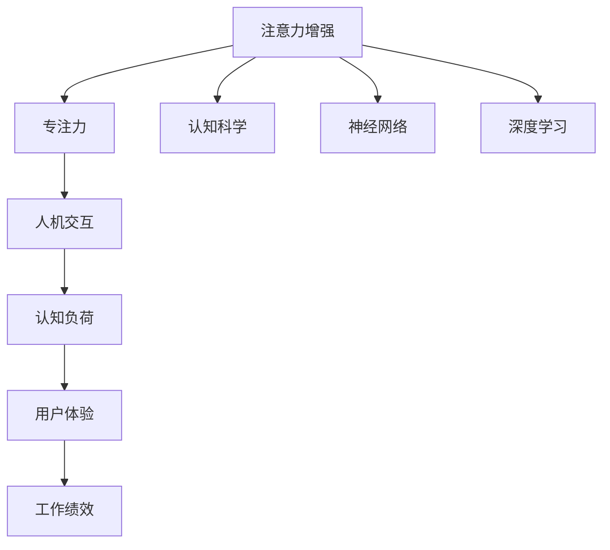
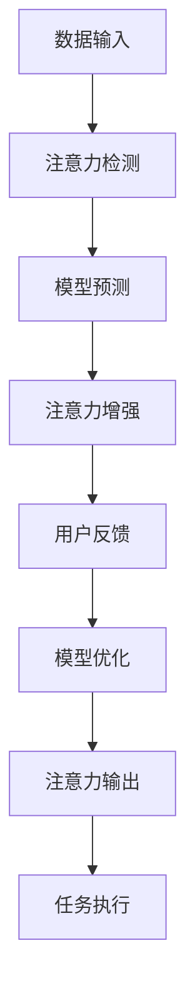

                 

# 人类注意力增强：提升专注力和注意力在商业中的未来趋势

> 关键词：注意力增强,专注力提升,商业应用,人机交互,认知科学,神经网络,深度学习,机器学习,算法优化,智能辅助

## 1. 背景介绍

在数字化信息时代，注意力成为一种稀缺资源。无论是个人还是企业，如何高效利用注意力，提升专注力和工作效率，已经成为一种竞争优势。人类注意力增强（Enhanced Attention）技术利用认知科学和机器学习手段，通过优化人机交互方式，帮助用户提升注意力，进而提升生产力和商业价值。本文旨在探讨这一前沿技术在商业中的应用潜力及其未来发展趋势。

## 2. 核心概念与联系

### 2.1 核心概念概述

- **注意力增强**：通过优化用户与设备的交互方式，提升用户对信息的注意力集中度和处理效率，从而提高工作效率和学习成果。
- **专注力**：指个体在特定任务上保持持续关注和深度投入的能力，是注意力增强技术的重要应用场景。
- **人机交互**：用户与设备之间的交互方式，通过界面设计、输入方式等手段，影响用户的注意力和行为。
- **认知科学**：研究人类认知过程及其计算模拟的学科，为设计有效的注意力增强方法提供理论基础。
- **神经网络与深度学习**：利用机器学习算法，通过大量数据训练出能够识别和增强用户注意力的模型。

这些概念之间的联系通过以下Mermaid流程图展示：



### 2.2 核心概念原理和架构的 Mermaid 流程图

以下是一个简单的 Mermaid 流程图，展示了注意力增强系统的工作原理：



## 3. 核心算法原理 & 具体操作步骤

### 3.1 算法原理概述

注意力增强的算法原理基于认知科学和神经网络理论。核心目标是通过分析用户行为数据，识别出影响注意力的关键因素，并设计相应的算法对这些因素进行调整，从而提升用户的注意力和专注力。

注意力增强可以分为两个主要步骤：注意力检测和注意力增强。

- **注意力检测**：通过分析用户的行为数据（如鼠标移动、眼动轨迹、键盘输入等），识别出用户对信息的注意力集中程度。这一步可以采用各种生理信号传感器（如眼动仪、脑电图等）收集数据，或者通过行为数据进行推断。
- **注意力增强**：根据注意力检测的结果，调整人机交互界面（如界面布局、字体大小、动画效果等），或者使用注意力训练方法，提升用户的专注力和注意力。

### 3.2 算法步骤详解

1. **数据收集**：通过传感器或行为追踪工具收集用户在使用设备时的各种数据，如鼠标移动轨迹、键盘敲击速度、眼动轨迹等。

2. **注意力检测**：利用机器学习算法（如卷积神经网络、循环神经网络等）对收集到的数据进行分析，识别出用户对不同信息的注意力集中程度。这一步可以采用监督学习方法，使用标注好的数据集进行训练；也可以使用无监督学习方法，如聚类分析、异常检测等。

3. **注意力增强**：根据注意力检测的结果，设计相应的算法调整用户界面或工作流程。例如，对于注意力集中的区域，可以增加信息的显示密度，或者使用颜色对比强烈的显示方式吸引用户注意；对于注意力分散的区域，可以减少信息的展示量，或者使用动态效果引导用户注意力。

4. **模型优化**：不断收集用户反馈，调整模型参数，优化注意力增强算法。例如，可以使用强化学习算法，根据用户的反馈行为调整界面设计，逐步提升用户的专注力。

### 3.3 算法优缺点

**优点**：

- **提升生产力**：通过优化注意力，用户可以更高效地完成任务，提高工作效率。
- **个性化定制**：不同用户对界面设计的反应不同，注意力增强算法可以根据用户的反馈不断优化，提供个性化的界面设计。
- **健康保护**：合理的注意力增强可以避免用户长时间面对屏幕产生的眼疲劳、颈椎问题等，有助于健康保护。

**缺点**：

- **隐私问题**：采集和分析用户数据可能会涉及隐私问题，需要严格遵守相关法律法规。
- **技术门槛高**：需要结合认知科学和机器学习知识，设计复杂的算法模型，技术门槛较高。
- **依赖设备性能**：算法的优化效果受限于设备的处理能力，对于低性能设备可能效果有限。

### 3.4 算法应用领域

注意力增强技术可以应用于多个领域，以下是几个典型的应用场景：

- **教育**：通过调整教学内容和界面设计，提升学生的注意力和学习效果。例如，使用动态效果引导学生注意力，减少课堂走神。
- **工作**：在办公自动化系统（如电子邮件、项目管理工具等）中，通过优化界面设计和交互方式，提升员工的工作效率和专注力。
- **游戏**：在游戏设计中，通过调整游戏界面和内容，引导玩家的注意力，提高游戏体验和完成度。
- **健康**：在医疗应用中，通过监测患者的注意力状态，及时调整治疗方案，提高治疗效果。
- **娱乐**：在流媒体平台中，通过推荐算法优化内容展示方式，提升用户的观看体验和留存率。

## 4. 数学模型和公式 & 详细讲解

### 4.1 数学模型构建

假设我们有一组用户的行为数据 $X=\{x_1, x_2, ..., x_n\}$，其中每个用户的数据表示为向量 $x_i \in \mathbb{R}^d$。我们的目标是构建一个数学模型，能够根据这些数据预测用户的注意力集中程度 $A_i \in [0,1]$。

我们可以使用以下线性回归模型：

$$
A_i = w_0 + \sum_{j=1}^d w_j x_{ij} + \epsilon_i
$$

其中 $w_0, w_j$ 为模型的参数，$\epsilon_i$ 为噪声项。

### 4.2 公式推导过程

对于线性回归模型，我们使用最小二乘法进行参数估计，即最小化损失函数：

$$
\min_{w_0, w_j} \sum_{i=1}^n (A_i - (w_0 + \sum_{j=1}^d w_j x_{ij}))^2
$$

对损失函数求导，得到：

$$
\frac{\partial \mathcal{L}}{\partial w_0} = -2 \sum_{i=1}^n (A_i - w_0 - \sum_{j=1}^d w_j x_{ij})
$$

$$
\frac{\partial \mathcal{L}}{\partial w_j} = -2 \sum_{i=1}^n (A_i - w_0 - \sum_{j=1}^d w_j x_{ij}) x_{ij}
$$

通过求解上述方程组，可以得到模型的参数 $w_0, w_j$。

### 4.3 案例分析与讲解

以电子邮件系统为例，我们可以通过分析用户对邮件的阅读速度、点击链接次数等行为数据，预测用户对邮件的注意力集中程度。然后根据注意力集中程度，调整邮件界面的显示方式，例如对于高注意力区域，增加邮件内容的显示密度，或者使用颜色对比强烈的显示方式吸引用户注意；对于低注意力区域，减少邮件内容的展示量，或者使用动态效果引导用户注意力。

## 5. 项目实践：代码实例和详细解释说明

### 5.1 开发环境搭建

1. **安装Python和必要的库**：
   - 安装Python 3.x
   - 安装必要的库，如NumPy、Pandas、Matplotlib、Scikit-Learn等

2. **数据收集和预处理**：
   - 收集用户的行为数据，如鼠标移动轨迹、键盘输入速度、眼动轨迹等
   - 对数据进行预处理，如去噪、归一化等

### 5.2 源代码详细实现

以下是一个简化的代码示例，用于预测用户的注意力集中程度：

```python
import numpy as np
from sklearn.linear_model import LinearRegression

# 假设我们有以下数据
X = np.array([[0.2, 0.5], [0.5, 0.3], [0.7, 0.8]])
A = np.array([0.6, 0.4, 0.9])

# 使用线性回归模型进行预测
model = LinearRegression()
model.fit(X, A)

# 预测新数据的注意力集中程度
X_new = np.array([[0.4, 0.6]])
A_new = model.predict(X_new)
print(A_new)
```

### 5.3 代码解读与分析

这段代码使用了Scikit-Learn库中的LinearRegression模型，通过训练数据集，预测新数据的注意力集中程度。其中，X为行为数据矩阵，A为目标变量（注意力集中程度）。通过模型训练，可以得到预测结果A_new。

## 6. 实际应用场景

### 6.1 智能教室

在智能教室中，注意力增强技术可以帮助教师实时监测学生的注意力状态，及时调整教学内容和方式，提升课堂效果。例如，通过眼动仪监测学生的注意力集中程度，自动调整投影仪的显示内容，或者调整学生的座位排列，减少他们的注意力分散。

### 6.2 远程工作

远程工作环境下，注意力增强技术可以帮助员工提升工作专注力。例如，通过监测员工在电脑上的操作行为，分析其注意力集中程度，自动调整工作界面的设计，使其更加符合员工的工作习惯，提升工作效率。

### 6.3 医疗康复

在医疗康复过程中，注意力增强技术可以帮助患者集中注意力，提高康复效果。例如，通过监测患者的注意力状态，调整康复训练的内容和方式，使其更加符合患者的认知能力，提高康复训练的效率和效果。

### 6.4 未来应用展望

随着技术的发展，注意力增强技术的应用将更加广泛和深入。以下是几个未来趋势：

1. **多模态融合**：结合视觉、听觉、触觉等多模态数据，提升注意力增强的效果。例如，通过结合眼动数据和语音信号，更加全面地监测用户的注意力状态。
2. **人工智能辅助**：利用人工智能算法，自动优化注意力增强方案，提升用户体验。例如，通过强化学习算法，根据用户的行为数据，不断优化界面设计和显示方式。
3. **跨设备协同**：在不同设备之间协同工作，实现跨设备的注意力增强。例如，在办公设备和个人设备之间，同步用户的注意力状态，实现无缝衔接。
4. **实时反馈机制**：建立实时反馈机制，根据用户的反馈数据，不断优化注意力增强算法。例如，通过用户的行为数据和反馈数据，自动调整界面设计和显示方式，提升用户体验。

## 7. 工具和资源推荐

### 7.1 学习资源推荐

1. **Coursera《机器学习》课程**：由斯坦福大学开设的机器学习课程，涵盖线性回归、神经网络、深度学习等基本概念和算法，是学习注意力增强技术的良好起点。
2. **《认知神经科学导论》**：介绍认知科学和神经网络的基本概念和应用，帮助理解注意力增强技术的基础理论。
3. **GitHub上的注意力增强项目**：浏览GitHub上的注意力增强项目，了解最新的研究和应用实践。
4. **Kaggle数据竞赛**：参加Kaggle上的注意力增强数据竞赛，提升实战能力。

### 7.2 开发工具推荐

1. **Python**：Python是注意力增强技术开发的主流语言，简单易学，有大量的库和工具支持。
2. **NumPy、Pandas、Scikit-Learn**：这些Python库提供了强大的数据处理和机器学习功能，是注意力增强技术开发的基础。
3. **Matplotlib、Seaborn**：这些Python库用于数据可视化和图表展示，帮助理解注意力增强模型的效果。
4. **TensorFlow、PyTorch**：这些深度学习框架提供了强大的模型训练功能，支持多种神经网络模型的实现。

### 7.3 相关论文推荐

1. **《多模态注意力增强》**：介绍多模态数据在注意力增强中的应用，提升用户注意力的监测和预测效果。
2. **《基于深度学习的注意力增强》**：探讨深度学习模型在注意力增强中的应用，提升注意力增强算法的精度和效率。
3. **《注意力增强系统的设计与实现》**：介绍注意力增强系统的设计和实现方法，提供实践指导。

## 8. 总结：未来发展趋势与挑战

### 8.1 研究成果总结

本文探讨了注意力增强技术在提升用户专注力和注意力的应用潜力，并介绍了几种典型的应用场景和未来趋势。通过认知科学和机器学习手段，注意力增强技术已经展示出显著的成效，为提升生产力、保护健康和优化用户体验提供了新的可能性。

### 8.2 未来发展趋势

随着技术的发展，注意力增强技术将变得更加智能和高效。未来的发展趋势包括：

1. **多模态融合**：结合视觉、听觉、触觉等多模态数据，提升注意力增强的效果。
2. **人工智能辅助**：利用人工智能算法，自动优化注意力增强方案，提升用户体验。
3. **跨设备协同**：在不同设备之间协同工作，实现跨设备的注意力增强。
4. **实时反馈机制**：建立实时反馈机制，根据用户的反馈数据，不断优化注意力增强算法。

### 8.3 面临的挑战

尽管注意力增强技术展示了巨大的应用潜力，但仍然面临一些挑战：

1. **隐私问题**：采集和分析用户数据可能会涉及隐私问题，需要严格遵守相关法律法规。
2. **技术门槛高**：需要结合认知科学和机器学习知识，设计复杂的算法模型，技术门槛较高。
3. **依赖设备性能**：算法的优化效果受限于设备的处理能力，对于低性能设备可能效果有限。

### 8.4 研究展望

未来的研究可以从以下几个方面进行探索：

1. **多模态数据融合**：结合视觉、听觉、触觉等多模态数据，提升注意力增强的效果。
2. **智能辅助设计**：利用人工智能算法，自动优化注意力增强方案，提升用户体验。
3. **跨设备协同**：在不同设备之间协同工作，实现跨设备的注意力增强。
4. **实时反馈机制**：建立实时反馈机制，根据用户的反馈数据，不断优化注意力增强算法。

总之，注意力增强技术将为人机交互带来革命性的变化，提升用户的专注力和注意力，从而提升生产力、保护健康和优化用户体验。未来，随着技术的发展和应用场景的拓展，注意力增强技术将发挥越来越重要的作用，为构建更加智能、高效、个性化的未来社会提供新的可能性。

## 9. 附录：常见问题与解答

**Q1: 注意力增强技术如何保护用户隐私？**

A: 为保护用户隐私，注意力增强技术应该遵守相关的法律法规，如GDPR等。此外，可以采取以下措施：

1. **数据匿名化**：对用户数据进行匿名化处理，确保数据无法关联到具体的个体。
2. **最小化数据收集**：只收集必要的数据，避免过度收集和存储。
3. **数据加密**：对用户数据进行加密存储和传输，防止数据泄露。
4. **透明隐私政策**：向用户明确隐私政策，告知数据收集和使用的目的。

**Q2: 注意力增强技术的技术门槛高吗？**

A: 是的，注意力增强技术的技术门槛较高，需要结合认知科学和机器学习知识。但随着技术的普及和应用场景的拓展，很多开发工具和开源项目已经降低了技术门槛，使得开发者能够更容易地应用注意力增强技术。

**Q3: 注意力增强技术对设备的性能要求高吗？**

A: 是的，注意力增强技术的优化效果受限于设备的处理能力。但对于现代的高性能设备，如高性能PC、移动设备等，注意力增强技术仍然可以发挥显著的效果。

**Q4: 注意力增强技术的应用场景有哪些？**

A: 注意力增强技术可以应用于多个领域，包括教育、工作、医疗、娱乐等。例如，在教育中，可以通过监测学生的注意力状态，调整教学内容和方式，提升课堂效果；在工作环境中，可以通过监测员工的行为数据，优化工作界面，提升工作效率。

**Q5: 注意力增强技术的未来发展方向是什么？**

A: 未来，注意力增强技术将向着多模态融合、人工智能辅助、跨设备协同和实时反馈机制等方向发展。这些方向将进一步提升注意力增强的效果和用户体验，推动人机交互技术的进步。

