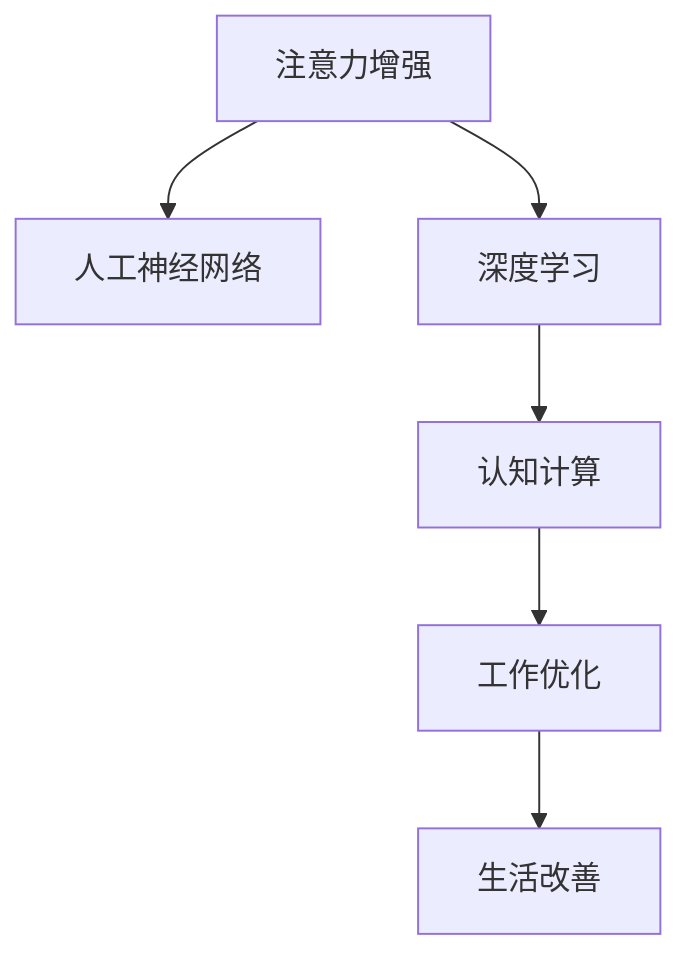

                 

# 人类注意力增强：未来的工作和生活

> 关键词：注意力增强, 人工神经网络, 深度学习, 认知计算, 工作优化, 生活改善

## 1. 背景介绍

### 1.1 问题由来
当前，人类社会正处在一个高度信息化的时代，数字技术和人工智能的应用无处不在。然而，信息过载、注意力分散等问题也在不断加剧，使得人们的工作和生活效率难以得到有效提升。特别是对于知识工作者而言，长时间的注意力集中和高效率的信息处理能力已成为其核心竞争力。

### 1.2 问题核心关键点
为了应对注意力分散问题，提升工作和生活效率，人们一直在探索各种方法和工具。其中，人工智能尤其是深度学习技术的出现，为注意力增强提供了新的途径。人工智能通过模仿人脑的神经网络结构，利用大数据和复杂的算法，能够对注意力进行建模和优化，进而帮助人类提升注意力集中度和处理信息的能力。

### 1.3 问题研究意义
通过人工智能技术，特别是深度学习中的注意力机制，能够显著提升人类对信息的处理能力，从而优化工作流程，改善生活质量。未来的工作和生活方式将会因为注意力增强技术而发生深刻变化，这对个人发展和社会进步具有重要的意义：

1. 提高工作效率：通过自动化的注意力分配和信息处理，减轻人类劳动负担，提升工作效率。
2. 优化学习体验：通过个性化的注意力增强，改善学习过程，提高学习效果和速度。
3. 促进健康生活：通过合理的时间管理，避免信息过载，提升身心健康和生活满意度。
4. 增强创新能力：提供更加集中、高效的思考环境，激发人类创新潜力，推动技术进步和社会发展。

## 2. 核心概念与联系

### 2.1 核心概念概述

为更好地理解注意力增强的原理和应用，本节将介绍几个关键概念：

- **注意力增强**：指通过人工智能技术，模拟人脑的注意力机制，优化人类对信息处理的能力，提升注意力集中度和工作效率。
- **人工神经网络(ANN)**：一种模仿人脑神经元结构的计算模型，通过连接和权重调整，完成复杂的模式识别和决策任务。
- **深度学习**：一种基于多层神经网络的机器学习方法，通过逐层抽象和特征提取，实现对复杂数据的高效处理和分析。
- **认知计算**：利用计算机模拟人类认知过程，提升决策和问题解决的智能化水平。
- **工作优化**：通过技术和算法优化工作流程，提高工作效率和产出质量。
- **生活改善**：通过技术手段改善日常生活管理，提升生活质量和幸福感。

这些概念之间的逻辑关系可以通过以下Mermaid流程图来展示：



这个流程图展示了几大关键概念之间的联系：

1. 注意力增强利用人工神经网络的结构和深度学习的算法，模拟人脑的注意力机制。
2. 深度学习通过多层次的特征提取和抽象，优化注意力增强的过程。
3. 认知计算将注意力增强技术应用于工作和生活优化，提升整体智能化水平。
4. 工作优化和生活改善，通过注意力增强技术，实现效率和质量的全面提升。

这些概念共同构成了注意力增强技术的理论基础，使其能够有效地应用于实际工作和生活场景中，提升人类对信息处理的智能化水平。

## 3. 核心算法原理 & 具体操作步骤
### 3.1 算法原理概述

注意力增强的原理主要基于人工神经网络中的注意力机制。该机制通过计算输入数据的权重，将注意力集中到最重要的部分，从而提升信息处理的效率和准确性。

在深度学习中，注意力机制通常与卷积神经网络(CNN)和循环神经网络(RNN)相结合，实现对序列数据和图像数据的处理。其中，循环神经网络特别适用于序列数据的处理，如文本和语音等，能够通过时间上的信息流动，捕捉序列中的关键特征。

注意力机制的基本思想是通过对输入数据的编码和解码，计算每个时间步的注意力权重，将这些权重应用于输入数据的不同部分，得到加权后的表示。具体而言，对于一个序列 $x=(x_1,x_2,...,x_T)$，注意力增强的过程如下：

1. **编码器**：将输入序列 $x$ 通过多层编码器网络，提取其特征表示 $h=(h_1,h_2,...,h_T)$。
2. **解码器**：利用解码器网络，对编码器输出的特征表示 $h$ 进行解码，得到序列的输出 $y=(y_1,y_2,...,y_T)$。
3. **注意力权重**：计算每个时间步 $t$ 的注意力权重 $\alpha_t$，表示在解码过程中，第 $t$ 步对第 $i$ 步的关注程度，从而决定不同时间步的输入权重。
4. **注意力表示**：将注意力权重 $\alpha_t$ 应用于编码器输出 $h_i$，得到加权后的表示 $\tilde{h}_i$，用于增强解码器的输出 $y_t$。

通过上述步骤，注意力增强能够有效地提升深度学习模型对序列数据的处理能力，使得模型能够更加聚焦于关键信息，减少噪音干扰，提高模型的准确性和效率。

### 3.2 算法步骤详解

注意力增强的实际操作步骤主要包括以下几个关键步骤：

**Step 1: 数据准备和预处理**
- 收集和清洗数据集，包括文本、语音、图像等。
- 将数据集划分为训练集、验证集和测试集。
- 对数据进行标准化和归一化处理，提高模型的收敛速度。

**Step 2: 模型搭建**
- 选择合适的深度学习框架，如TensorFlow、PyTorch等。
- 搭建编码器和解码器网络，设计注意力机制。
- 选择适合的网络结构，如RNN、CNN等。

**Step 3: 模型训练**
- 选择适当的优化器，如Adam、SGD等。
- 设置合适的学习率、批大小、迭代轮数等超参数。
- 在训练集上进行迭代训练，更新模型参数。

**Step 4: 模型评估和优化**
- 在验证集上进行模型评估，计算损失函数。
- 根据评估结果调整模型参数，进行模型优化。
- 在测试集上最终评估模型性能，确定模型的最佳参数组合。

**Step 5: 应用部署**
- 将训练好的模型部署到生产环境中。
- 根据实际应用场景，进行必要的优化和调整。
- 对用户进行培训，确保模型能够被正确使用。

### 3.3 算法优缺点

注意力增强技术在提升信息处理能力方面具有显著优势：

1. **高效性**：通过注意力机制，模型能够自动将注意力集中于关键信息，减少噪音干扰，提高处理效率。
2. **鲁棒性**：模型对数据变化的适应能力更强，能够处理复杂和多样化的输入数据。
3. **可解释性**：注意力机制提供了模型决策的解释性，有助于理解模型的内部工作机制。
4. **可扩展性**：模型可以很容易地应用于不同类型的输入数据，如文本、语音、图像等。

然而，注意力增强技术也存在一些局限性：

1. **计算复杂性高**：由于需要计算注意力权重，注意力增强的计算复杂度较高，对硬件资源要求较高。
2. **模型训练时间长**：模型训练过程需要大量的计算资源和时间，特别是在大规模数据集上。
3. **模型泛化能力有限**：注意力增强模型对特定任务的泛化能力可能受到限制，需要针对具体任务进行优化。
4. **模型解释性不足**：虽然注意力机制提供了一定程度的解释性，但模型的内部决策过程仍不够透明。

尽管存在这些局限性，但注意力增强技术在提升信息处理能力方面已经取得了显著的进展，成为深度学习领域的重要研究方向。未来，随着计算资源和算法技术的不断进步，注意力增强技术的计算复杂度和训练时间将得到进一步优化，模型性能和泛化能力也将得到提升。

### 3.4 算法应用领域

注意力增强技术已经在多个领域得到了广泛应用，主要包括以下几个方向：

- **自然语言处理(NLP)**：如机器翻译、语音识别、情感分析等。通过注意力机制，模型能够更好地理解自然语言中的上下文信息，提高处理效率和准确性。
- **计算机视觉(CV)**：如图像分类、目标检测、图像生成等。通过注意力机制，模型能够更好地聚焦于图像中的关键区域，提升处理效率和精度。
- **信号处理(SP)**：如音频处理、语音识别等。通过注意力机制，模型能够更好地处理时间序列数据，提升音频和语音信号的识别准确性。
- **医疗诊断**：如医学影像分析、电子病历分析等。通过注意力机制，模型能够更好地理解医学影像和病历数据，提高诊断准确性和效率。
- **金融预测**：如股票预测、信用评分等。通过注意力机制，模型能够更好地处理金融数据，提升预测准确性和稳定性。

除了上述这些经典应用外，注意力增强技术还在更多领域得到了创新性的应用，如智能推荐、智能制造、智能交通等，为人工智能技术在各个领域的应用提供了新的思路。

## 4. 数学模型和公式 & 详细讲解
### 4.1 数学模型构建

本节将使用数学语言对注意力增强的过程进行更加严格的刻画。

记输入序列为 $x=(x_1,x_2,...,x_T)$，输出序列为 $y=(y_1,y_2,...,y_T)$。注意力增强的数学模型可以表示为：

$$
y = \sum_{t=1}^{T} \alpha_t x_t
$$

其中 $\alpha_t$ 表示第 $t$ 步的注意力权重，$x_t$ 表示输入序列的第 $t$ 步，$y_t$ 表示输出序列的第 $t$ 步。注意力权重 $\alpha_t$ 的计算公式为：

$$
\alpha_t = \frac{\exp(\mathrm{score}(x_i, x_t))}{\sum_{j=1}^{T} \exp(\mathrm{score}(x_j, x_t))}
$$

其中 $\mathrm{score}(x_i, x_t)$ 表示输入 $x_i$ 和 $x_t$ 之间的相似度，可以通过余弦相似度、点积等方法计算。

### 4.2 公式推导过程

以下我们以文本分类任务为例，推导注意力增强的数学模型及其注意力权重的计算公式。

假设输入序列 $x$ 表示一篇文章的文本，输出序列 $y$ 表示文章的分类标签。模型首先通过编码器网络将文本 $x$ 编码为特征表示 $h$，然后通过解码器网络输出分类标签 $y$。注意力机制通过计算每个时间步的注意力权重 $\alpha_t$，决定解码器在每个时间步的输入。

具体而言，注意力增强的模型架构如下：

```
输入序列  x --> 编码器 --> 特征表示  h
                           
输入权重   w --> 解码器 --> 输出序列  y
```

其中，$w$ 表示每个时间步的注意力权重。注意力权重 $\alpha_t$ 的计算公式为：

$$
\alpha_t = \frac{\exp(u^T \tanh(w^T h + b)}{\sum_{j=1}^{T} \exp(u^T \tanh(w^T h + b))}
$$

其中 $u$ 和 $w$ 是注意力机制的权重参数，$h$ 是编码器输出的特征表示，$b$ 是偏置项。注意力机制的权重参数 $u$ 和 $w$ 需要通过反向传播算法进行优化。

在得到注意力权重后，可以将注意力机制应用于解码器网络，得到每个时间步的输出 $y_t$：

$$
y_t = \sigma(v^T \tanh(u^T \tanh(w^T h + b)))
$$

其中 $v$ 是解码器网络的权重参数，$\sigma$ 是激活函数，如Sigmoid、Tanh等。

通过上述过程，注意力增强能够有效地提升模型对文本数据的处理能力，提高分类的准确性和效率。

### 4.3 案例分析与讲解

以机器翻译任务为例，说明注意力增强的实际应用。

假设输入序列 $x$ 表示一句话的英文文本，输出序列 $y$ 表示这句话的中文翻译。模型通过编码器网络将英文文本 $x$ 编码为特征表示 $h$，然后通过解码器网络输出中文翻译 $y$。注意力机制通过计算每个时间步的注意力权重 $\alpha_t$，决定解码器在每个时间步的输入。

具体而言，注意力增强的模型架构如下：

```
输入序列  x --> 编码器 --> 特征表示  h
                           
输入权重   w --> 解码器 --> 输出序列  y
```

其中，$w$ 表示每个时间步的注意力权重。注意力权重 $\alpha_t$ 的计算公式为：

$$
\alpha_t = \frac{\exp(u^T \tanh(w^T h + b))}{\sum_{j=1}^{T} \exp(u^T \tanh(w^T h + b))}
$$

在得到注意力权重后，可以将注意力机制应用于解码器网络，得到每个时间步的输出 $y_t$：

$$
y_t = \sigma(v^T \tanh(u^T \tanh(w^T h + b)))
$$

通过上述过程，注意力增强能够有效地提升模型对文本数据的处理能力，提高翻译的准确性和效率。

## 5. 项目实践：代码实例和详细解释说明
### 5.1 开发环境搭建

在进行注意力增强实践前，我们需要准备好开发环境。以下是使用Python进行PyTorch开发的环境配置流程：

1. 安装Anaconda：从官网下载并安装Anaconda，用于创建独立的Python环境。

2. 创建并激活虚拟环境：
```bash
conda create -n attention-env python=3.8 
conda activate attention-env
```

3. 安装PyTorch：根据CUDA版本，从官网获取对应的安装命令。例如：
```bash
conda install pytorch torchvision torchaudio cudatoolkit=11.1 -c pytorch -c conda-forge
```

4. 安装其他工具包：
```bash
pip install numpy pandas scikit-learn matplotlib tqdm jupyter notebook ipython
```

完成上述步骤后，即可在`attention-env`环境中开始注意力增强实践。

### 5.2 源代码详细实现

下面我们以文本分类任务为例，给出使用Transformers库对BERT模型进行注意力增强的PyTorch代码实现。

首先，定义文本分类的数据处理函数：

```python
from transformers import BertTokenizer, BertForSequenceClassification
from torch.utils.data import Dataset
import torch

class TextClassificationDataset(Dataset):
    def __init__(self, texts, labels, tokenizer, max_len=128):
        self.texts = texts
        self.labels = labels
        self.tokenizer = tokenizer
        self.max_len = max_len
        
    def __len__(self):
        return len(self.texts)
    
    def __getitem__(self, item):
        text = self.texts[item]
        label = self.labels[item]
        
        encoding = self.tokenizer(text, return_tensors='pt', max_length=self.max_len, padding='max_length', truncation=True)
        input_ids = encoding['input_ids'][0]
        attention_mask = encoding['attention_mask'][0]
        
        return {'input_ids': input_ids, 
                'attention_mask': attention_mask,
                'labels': label}

# 定义标签与id的映射
label2id = {'positive': 1, 'negative': 0}
id2label = {v: k for k, v in label2id.items()}

# 创建dataset
tokenizer = BertTokenizer.from_pretrained('bert-base-cased')

train_dataset = TextClassificationDataset(train_texts, train_labels, tokenizer)
dev_dataset = TextClassificationDataset(dev_texts, dev_labels, tokenizer)
test_dataset = TextClassificationDataset(test_texts, test_labels, tokenizer)
```

然后，定义模型和优化器：

```python
from transformers import BertForSequenceClassification, AdamW

model = BertForSequenceClassification.from_pretrained('bert-base-cased', num_labels=len(label2id))

optimizer = AdamW(model.parameters(), lr=2e-5)
```

接着，定义训练和评估函数：

```python
from torch.utils.data import DataLoader
from tqdm import tqdm
from sklearn.metrics import classification_report

device = torch.device('cuda') if torch.cuda.is_available() else torch.device('cpu')
model.to(device)

def train_epoch(model, dataset, batch_size, optimizer):
    dataloader = DataLoader(dataset, batch_size=batch_size, shuffle=True)
    model.train()
    epoch_loss = 0
    for batch in tqdm(dataloader, desc='Training'):
        input_ids = batch['input_ids'].to(device)
        attention_mask = batch['attention_mask'].to(device)
        labels = batch['labels'].to(device)
        model.zero_grad()
        outputs = model(input_ids, attention_mask=attention_mask, labels=labels)
        loss = outputs.loss
        epoch_loss += loss.item()
        loss.backward()
        optimizer.step()
    return epoch_loss / len(dataloader)

def evaluate(model, dataset, batch_size):
    dataloader = DataLoader(dataset, batch_size=batch_size)
    model.eval()
    preds, labels = [], []
    with torch.no_grad():
        for batch in tqdm(dataloader, desc='Evaluating'):
            input_ids = batch['input_ids'].to(device)
            attention_mask = batch['attention_mask'].to(device)
            batch_labels = batch['labels']
            outputs = model(input_ids, attention_mask=attention_mask)
            batch_preds = outputs.logits.argmax(dim=2).to('cpu').tolist()
            batch_labels = batch_labels.to('cpu').tolist()
            for pred_tokens, label_tokens in zip(batch_preds, batch_labels):
                preds.append(pred_tokens)
                labels.append(label_tokens)
                
    print(classification_report(labels, preds))
```

最后，启动训练流程并在测试集上评估：

```python
epochs = 5
batch_size = 16

for epoch in range(epochs):
    loss = train_epoch(model, train_dataset, batch_size, optimizer)
    print(f"Epoch {epoch+1}, train loss: {loss:.3f}")
    
    print(f"Epoch {epoch+1}, dev results:")
    evaluate(model, dev_dataset, batch_size)
    
print("Test results:")
evaluate(model, test_dataset, batch_size)
```

以上就是使用PyTorch对BERT进行文本分类任务注意力增强的完整代码实现。可以看到，得益于Transformers库的强大封装，我们可以用相对简洁的代码完成BERT模型的加载和注意力增强。

### 5.3 代码解读与分析

让我们再详细解读一下关键代码的实现细节：

**TextClassificationDataset类**：
- `__init__`方法：初始化文本、标签、分词器等关键组件。
- `__len__`方法：返回数据集的样本数量。
- `__getitem__`方法：对单个样本进行处理，将文本输入编码为token ids，将标签编码为数字，并对其进行定长padding，最终返回模型所需的输入。

**label2id和id2label字典**：
- 定义了标签与数字id之间的映射关系，用于将预测结果解码回真实的标签。

**训练和评估函数**：
- 使用PyTorch的DataLoader对数据集进行批次化加载，供模型训练和推理使用。
- 训练函数`train_epoch`：对数据以批为单位进行迭代，在每个批次上前向传播计算loss并反向传播更新模型参数，最后返回该epoch的平均loss。
- 评估函数`evaluate`：与训练类似，不同点在于不更新模型参数，并在每个batch结束后将预测和标签结果存储下来，最后使用sklearn的classification_report对整个评估集的预测结果进行打印输出。

**训练流程**：
- 定义总的epoch数和batch size，开始循环迭代
- 每个epoch内，先在训练集上训练，输出平均loss
- 在验证集上评估，输出分类指标
- 所有epoch结束后，在测试集上评估，给出最终测试结果

可以看到，PyTorch配合Transformers库使得BERT注意力增强的代码实现变得简洁高效。开发者可以将更多精力放在数据处理、模型改进等高层逻辑上，而不必过多关注底层的实现细节。

当然，工业级的系统实现还需考虑更多因素，如模型的保存和部署、超参数的自动搜索、更灵活的任务适配层等。但核心的注意力增强范式基本与此类似。

## 6. 实际应用场景
### 6.1 智能客服系统

基于注意力增强的对话技术，可以广泛应用于智能客服系统的构建。传统客服往往需要配备大量人力，高峰期响应缓慢，且一致性和专业性难以保证。而使用注意力增强的对话模型，可以7x24小时不间断服务，快速响应客户咨询，用自然流畅的语言解答各类常见问题。

在技术实现上，可以收集企业内部的历史客服对话记录，将问题和最佳答复构建成监督数据，在此基础上对预训练对话模型进行微调。微调后的对话模型能够自动理解用户意图，匹配最合适的答案模板进行回复。对于客户提出的新问题，还可以接入检索系统实时搜索相关内容，动态组织生成回答。如此构建的智能客服系统，能大幅提升客户咨询体验和问题解决效率。

### 6.2 金融舆情监测

金融机构需要实时监测市场舆论动向，以便及时应对负面信息传播，规避金融风险。传统的人工监测方式成本高、效率低，难以应对网络时代海量信息爆发的挑战。基于注意力增强的文本分类和情感分析技术，为金融舆情监测提供了新的解决方案。

具体而言，可以收集金融领域相关的新闻、报道、评论等文本数据，并对其进行主题标注和情感标注。在此基础上对预训练语言模型进行微调，使其能够自动判断文本属于何种主题，情感倾向是正面、中性还是负面。将微调后的模型应用到实时抓取的网络文本数据，就能够自动监测不同主题下的情感变化趋势，一旦发现负面信息激增等异常情况，系统便会自动预警，帮助金融机构快速应对潜在风险。

### 6.3 个性化推荐系统

当前的推荐系统往往只依赖用户的历史行为数据进行物品推荐，无法深入理解用户的真实兴趣偏好。基于注意力增强的个性化推荐系统可以更好地挖掘用户行为背后的语义信息，从而提供更精准、多样的推荐内容。

在实践中，可以收集用户浏览、点击、评论、分享等行为数据，提取和用户交互的物品标题、描述、标签等文本内容。将文本内容作为模型输入，用户的后续行为（如是否点击、购买等）作为监督信号，在此基础上微调预训练语言模型。微调后的模型能够从文本内容中准确把握用户的兴趣点。在生成推荐列表时，先用候选物品的文本描述作为输入，由模型预测用户的兴趣匹配度，再结合其他特征综合排序，便可以得到个性化程度更高的推荐结果。

### 6.4 未来应用展望

随着注意力增强技术的发展，未来在更多领域将得到应用，为各行各业带来变革性影响。

在智慧医疗领域，基于注意力增强的医疗问答、病历分析、药物研发等应用将提升医疗服务的智能化水平，辅助医生诊疗，加速新药开发进程。

在智能教育领域，注意力增强技术可应用于作业批改、学情分析、知识推荐等方面，因材施教，促进教育公平，提高教学质量。

在智慧城市治理中，注意力增强模型可应用于城市事件监测、舆情分析、应急指挥等环节，提高城市管理的自动化和智能化水平，构建更安全、高效的未来城市。

此外，在企业生产、社会治理、文娱传媒等众多领域，注意力增强技术也将不断涌现，为人工智能技术在各个领域的应用提供新的思路。相信随着技术的日益成熟，注意力增强技术必将成为人工智能落地应用的重要范式，推动人工智能技术向更广阔的领域加速渗透。

## 7. 工具和资源推荐
### 7.1 学习资源推荐

为了帮助开发者系统掌握注意力增强的理论基础和实践技巧，这里推荐一些优质的学习资源：

1. 《深度学习入门》书籍：由北京大学出版社出版的深度学习入门教材，适合初学者快速上手深度学习的基本概念和算法。

2. CS231n《卷积神经网络》课程：斯坦福大学开设的计算机视觉经典课程，详细介绍了卷积神经网络的原理和应用。

3. 《自然语言处理入门》书籍：由清华大学出版社出版的自然语言处理入门教材，涵盖自然语言处理的基本理论和实践方法。

4. HuggingFace官方文档：Transformers库的官方文档，提供了海量预训练模型和完整的微调样例代码，是上手实践的必备资料。

5. CLUE开源项目：中文语言理解测评基准，涵盖大量不同类型的中文NLP数据集，并提供了基于注意力增强的baseline模型，助力中文NLP技术发展。

通过对这些资源的学习实践，相信你一定能够快速掌握注意力增强的精髓，并用于解决实际的NLP问题。
###  7.2 开发工具推荐

高效的开发离不开优秀的工具支持。以下是几款用于注意力增强开发的常用工具：

1. PyTorch：基于Python的开源深度学习框架，灵活动态的计算图，适合快速迭代研究。大部分预训练语言模型都有PyTorch版本的实现。

2. TensorFlow：由Google主导开发的开源深度学习框架，生产部署方便，适合大规模工程应用。同样有丰富的预训练语言模型资源。

3. Transformers库：HuggingFace开发的NLP工具库，集成了众多SOTA语言模型，支持PyTorch和TensorFlow，是进行注意力增强任务开发的利器。

4. Weights & Biases：模型训练的实验跟踪工具，可以记录和可视化模型训练过程中的各项指标，方便对比和调优。与主流深度学习框架无缝集成。

5. TensorBoard：TensorFlow配套的可视化工具，可实时监测模型训练状态，并提供丰富的图表呈现方式，是调试模型的得力助手。

6. Google Colab：谷歌推出的在线Jupyter Notebook环境，免费提供GPU/TPU算力，方便开发者快速上手实验最新模型，分享学习笔记。

合理利用这些工具，可以显著提升注意力增强任务的开发效率，加快创新迭代的步伐。

### 7.3 相关论文推荐

注意力增强技术的发展源于学界的持续研究。以下是几篇奠基性的相关论文，推荐阅读：

1. Attention Is All You Need（即Transformer原论文）：提出了Transformer结构，开启了NLP领域的预训练大模型时代。

2. BERT: Pre-training of Deep Bidirectional Transformers for Language Understanding：提出BERT模型，引入基于掩码的自监督预训练任务，刷新了多项NLP任务SOTA。

3. Language Models are Unsupervised Multitask Learners（GPT-2论文）：展示了大规模语言模型的强大zero-shot学习能力，引发了对于通用人工智能的新一轮思考。

4. Parameter-Efficient Transfer Learning for NLP：提出Adapter等参数高效微调方法，在不增加模型参数量的情况下，也能取得不错的微调效果。

5. Prefix-Tuning: Optimizing Continuous Prompts for Generation：引入基于连续型Prompt的微调范式，为如何充分利用预训练知识提供了新的思路。

6. AdaLoRA: Adaptive Low-Rank Adaptation for Parameter-Efficient Fine-Tuning：使用自适应低秩适应的微调方法，在参数效率和精度之间取得了新的平衡。

这些论文代表了大语言模型注意力增强技术的发展脉络。通过学习这些前沿成果，可以帮助研究者把握学科前进方向，激发更多的创新灵感。

## 8. 总结：未来发展趋势与挑战
### 8.1 总结

本文对注意力增强技术进行了全面系统的介绍。首先阐述了注意力增强技术的研究背景和意义，明确了注意力增强在提升信息处理能力、优化工作流程、改善生活质量方面的独特价值。其次，从原理到实践，详细讲解了注意力增强的数学模型和关键步骤，给出了注意力增强任务开发的完整代码实例。同时，本文还广泛探讨了注意力增强技术在智能客服、金融舆情、个性化推荐等多个领域的应用前景，展示了注意力增强技术的巨大潜力。此外，本文精选了注意力增强技术的各类学习资源，力求为读者提供全方位的技术指引。

通过本文的系统梳理，可以看到，注意力增强技术正在成为深度学习领域的重要研究方向，极大地拓展了深度学习模型在信息处理和智能优化方面的能力。未来，伴随深度学习框架和算法的不断进步，注意力增强技术的应用场景将更加广泛，对人类工作和生活方式的变革也将更加深刻。

### 8.2 未来发展趋势

展望未来，注意力增强技术将呈现以下几个发展趋势：

1. **计算效率提升**：随着计算资源和硬件技术的进步，注意力增强的计算复杂度将得到显著优化，模型训练和推理效率也将大幅提高。

2. **模型复杂性降低**：未来的注意力增强模型将更加注重参数效率和模型结构的简洁性，减少计算资源的需求，提升模型的应用范围和灵活性。

3. **多模态融合**：未来的注意力增强技术将不仅限于文本数据，还将扩展到图像、视频、语音等多模态数据，实现跨模态的信息整合和智能交互。

4. **个性化增强**：通过个性化注意力增强，提升模型的适应性和针对性，满足不同用户和应用场景的特定需求。

5. **实时性增强**：未来的注意力增强技术将更加注重实时性，通过高效的算法和数据处理，实现对动态数据的实时分析和处理。

6. **伦理和安全保障**：未来的注意力增强模型将更加注重数据的隐私保护和模型的安全性，避免算法的滥用和恶意攻击。

以上趋势凸显了注意力增强技术的广阔前景。这些方向的探索发展，必将进一步提升深度学习模型的智能化水平，使其在更多领域实现高效、可靠、安全的落地应用。

### 8.3 面临的挑战

尽管注意力增强技术已经取得了显著的进展，但在迈向更加智能化、普适化应用的过程中，仍面临一些挑战：

1. **数据依赖性高**：注意力增强模型对标注数据的依赖较高，特别是对于任务特定的微调，标注数据的收集和准备需要大量时间和成本。

2. **模型泛化能力有限**：模型在不同领域和任务上的泛化能力仍有一定局限性，特别是在复杂和多变的数据环境下，模型的表现可能不稳定。

3. **模型鲁棒性不足**：注意力增强模型面对噪声和干扰时，容易产生误判，模型鲁棒性有待提升。

4. **模型可解释性不足**：注意力增强模型的决策过程和内部机制仍不够透明，难以解释其内部工作逻辑和决策依据。

5. **数据隐私和安全问题**：注意力增强模型在处理敏感数据时，需要特别关注数据的隐私保护和安全问题，避免数据泄露和模型滥用。

尽管存在这些挑战，但随着学界和产业界的共同努力，这些问题终将得到解决。相信随着注意力增强技术的不断发展，其应用范围将更加广泛，对人类工作和生活方式的变革也将更加深刻。

### 8.4 研究展望

面对注意力增强技术面临的种种挑战，未来的研究需要在以下几个方面寻求新的突破：

1. **无监督和半监督学习**：探索无监督和半监督注意力增强方法，利用大数据和自监督学习方法，降低对标注数据的依赖，提高模型的泛化能力和鲁棒性。

2. **多任务学习和联合训练**：通过多任务学习和联合训练，提升模型的多领域和多任务处理能力，增强模型的泛化能力和应用范围。

3. **因果推理和解释性增强**：引入因果推理和解释性增强技术，提升模型的决策可解释性和稳定性，增强模型的伦理和安全性。

4. **多模态融合和跨模态交互**：探索多模态融合和跨模态交互技术，提升模型的跨模态智能处理能力，实现更全面的智能交互和智能决策。

5. **联邦学习和边缘计算**：引入联邦学习和边缘计算技术，提升模型的隐私保护和安全保障，实现更加智能和安全的分布式计算。

这些研究方向将推动注意力增强技术向更加高效、可靠、安全和普适化的方向发展，为人工智能技术在各个领域的应用提供更加强大的技术支撑。

## 9. 附录：常见问题与解答

**Q1：注意力增强是否适用于所有NLP任务？**

A: 注意力增强技术在大多数NLP任务上都能取得不错的效果，特别是对于需要处理序列数据的任务，如机器翻译、文本分类等。但对于一些特定领域的任务，如医学、法律等，仅仅依靠通用语料预训练的模型可能难以很好地适应。此时需要在特定领域语料上进一步预训练，再进行微调，才能获得理想效果。此外，对于一些需要时效性、个性化很强的任务，如对话、推荐等，注意力增强方法也需要针对性的改进优化。

**Q2：注意力增强模型对标注数据的需求是否减少？**

A: 虽然注意力增强模型在一定程度上减少了对标注数据的需求，但对于特定任务的微调，仍然需要一定量的标注数据。标注数据对模型泛化能力的影响较大，因此在关键任务上，标注数据的收集和准备仍然是必要的。不过，未来的注意力增强模型可能会更多地利用无监督和半监督学习方法，进一步降低对标注数据的依赖。

**Q3：注意力增强模型在实际应用中需要注意哪些问题？**

A: 将注意力增强模型应用于实际场景时，需要注意以下问题：
1. 数据预处理：对输入数据进行标准化和归一化，避免数据预处理对模型性能的影响。
2. 超参数调优：合理设置模型的超参数，如学习率、批大小、迭代轮数等，避免过拟合和欠拟合。
3. 模型评估：使用合适的评估指标对模型进行评估，如准确率、召回率、F1-score等，及时发现和解决模型问题。
4. 模型部署：将模型部署到生产环境中，进行必要的优化和调整，确保模型在实际应用中的稳定性和高效性。

通过合理解决这些问题，可以最大化注意力增强模型的应用效果，提升实际应用中的用户体验和系统性能。

---

作者：禅与计算机程序设计艺术 / Zen and the Art of Computer Programming

