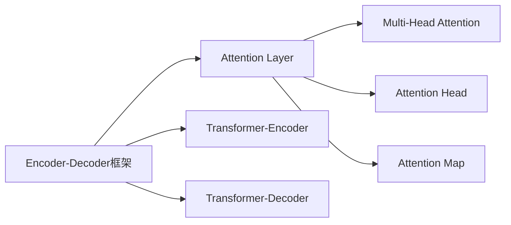

                 

# 人类注意力增强：未来的工作和生活

> 关键词：注意力增强,人类协作,智能系统,工作模式,生活质量

## 1. 背景介绍

### 1.1 问题由来

在当今信息爆炸的时代，人类面临着前所未有的信息洪流。无论是工作场景还是日常生活，大量的信息输入不断刺激我们的感官，导致注意力分散、决策困难，极大地影响了我们的效率和生活质量。近年来，随着人工智能技术的迅速发展，尤其是在自然语言处理和计算机视觉领域的突破，越来越多的智能系统被应用于信息处理和辅助决策中，显著提高了信息处理效率和决策准确性。

### 1.2 问题核心关键点

注意力增强(A注意力增强)技术通过模拟人类大脑的工作机制，提升智能系统的理解和处理信息的能力。其核心在于通过引入注意力机制，使得系统能够更好地聚焦关键信息，抑制无关噪音，从而显著提高决策的准确性和效率。注意力增强技术的应用场景涵盖文本摘要、图像识别、对话系统等多个领域，极大地拓展了人工智能的应用边界。

### 1.3 问题研究意义

研究注意力增强技术对于提升人类协作效率、改善工作模式、提高生活质量具有重要意义：

1. **提升工作效率**：注意力增强技术能够帮助人类更快地处理和理解信息，提高决策速度和准确性，减少误判和错误。
2. **改善工作模式**：通过自动化和智能化手段，将人类从繁琐的信息处理任务中解放出来，专注于创造性工作，提升工作满意度。
3. **提高生活质量**：在日常生活中，注意力增强技术可以帮助人们更好地管理时间，减少信息干扰，提高生活质量。
4. **推动社会进步**：提高信息处理和决策能力，能够推动各行各业创新，促进社会整体进步。

## 2. 核心概念与联系

### 2.1 核心概念概述

为更好地理解注意力增强技术的原理和工作机制，本节将介绍几个关键概念：

- **注意力增强（A注意力增强）**：一种通过引入注意力机制，增强智能系统对关键信息的关注，提升信息处理和决策能力的算法。
- **Transformer模型**：一种基于自注意力机制的深度学习模型，广泛应用于文本和图像处理等领域。
- **Attention Mechanism**：Transformer的核心模块，用于计算输入和输出序列之间的依赖关系，选择关注哪些部分。
- **Encoder-Decoder框架**：用于序列到序列任务，如机器翻译、文本生成等，由多个编码器和解码器组成。
- **注意力头(Attention Head)**：Attention Mechanism的基本单位，通常由矩阵乘法和Softmax函数计算。
- **多头注意力(Multi-Head Attention)**：将Attention Head并行扩展，通过多方向计算提升注意力计算效率。
- **Attention Map**：在多头注意力计算中生成的注意力权重分布，直观表示哪些部分被重点关注。
- **Attention Layer**：由多头注意力和前馈神经网络组成的Transformer的基本层，用于处理序列数据。
- **Transformer-Encoder**：多层的Transformer结构，用于编码输入序列。
- **Transformer-Decoder**：多层的Transformer结构，用于解码输出序列。

这些核心概念之间通过一个简化的Mermaid流程图展示它们之间的逻辑关系：



这个流程图展示了注意力增强技术在Transformer模型中的应用路径：

1. 通过Encoder-Decoder框架处理序列数据。
2. 在每一层中使用Transformer-Encoder进行编码。
3. 在Transformer-Encoder中引入Attention Layer，计算Attention Head和Attention Map。
4. 最终通过Transformer-Decoder进行解码。

## 3. 核心算法原理 & 具体操作步骤
### 3.1 算法原理概述

注意力增强技术的核心是Attention Mechanism，通过计算输入序列和输出序列之间的依赖关系，选择关注哪些部分，从而实现信息的筛选和聚焦。其算法原理可以概述为以下几个关键步骤：

1. **查询-键-值计算**：将输入序列和输出序列分别表示为查询和键值，通过计算查询与键的相似度，确定关注点。
2. **注意力得分计算**：将查询与键的相似度转化为注意力得分，通过Softmax函数归一化。
3. **加权求和计算**：根据注意力得分，加权计算输入序列的每个部分，生成输出序列的每个位置。
4. **多头注意力计算**：将查询-键-值计算和注意力得分计算并行扩展，提升注意力计算效率。

### 3.2 算法步骤详解

以下是基于Transformer模型的注意力增强技术的具体实现步骤：

1. **输入准备**：将输入序列和输出序列分别表示为查询、键值对，并进行归一化处理。
2. **查询-键-值计算**：使用矩阵乘法计算查询与键的相似度，得到注意力得分矩阵。
3. **注意力得分归一化**：通过Softmax函数对注意力得分进行归一化，得到注意力权重向量。
4. **加权求和计算**：将输入序列的每个部分乘以对应的注意力权重，加权求和得到输出序列的每个位置。
5. **多头注意力计算**：将查询-键-值计算和注意力得分计算扩展为多头计算，每个Attention Head并行计算，最后对结果进行拼接。
6. **解码器计算**：使用Transformer Decoder对输出序列进行解码，结合Attention Layer进行上下文信息融合。

### 3.3 算法优缺点

注意力增强技术具有以下优点：

1. **高效性**：通过并行计算多头注意力，显著提升了注意力计算效率。
2. **通用性**：应用于多种序列处理任务，如机器翻译、文本生成等。
3. **鲁棒性**：通过多方向计算，提高了模型的鲁棒性，降低了过拟合风险。

同时，该技术也存在一些局限性：

1. **计算复杂度**：多头注意力的并行计算需要较大的计算资源。
2. **模型复杂度**：多头注意力增加了模型复杂度，需要更多的参数和训练数据。
3. **解释性不足**：注意力权重难以解释，对模型的决策过程理解困难。

### 3.4 算法应用领域

注意力增强技术在多个领域得到了广泛应用，包括但不限于：

1. **机器翻译**：通过计算源语言和目标语言之间的依赖关系，选择关注哪些部分进行翻译。
2. **文本摘要**：通过计算文本中不同部分的重要度，选择关注哪些部分进行摘要。
3. **对话系统**：通过计算对话历史中的关键信息，选择关注哪些部分进行响应。
4. **图像识别**：通过计算图像中不同像素点的依赖关系，选择关注哪些部分进行分类。
5. **语音识别**：通过计算语音信号中不同时序点的依赖关系，选择关注哪些部分进行识别。

随着注意力增强技术的不断演进，未来其在更多领域的应用将带来新的突破，进一步提升人工智能系统的决策能力和应用范围。

## 4. 数学模型和公式 & 详细讲解 & 举例说明（备注：数学公式请使用latex格式，latex嵌入文中独立段落使用 $$，段落内使用 $)
### 4.1 数学模型构建

基于Transformer模型的注意力增强技术，可以通过以下数学模型来描述：

假设输入序列为 $X=\{x_1,x_2,...,x_n\}$，输出序列为 $Y=\{y_1,y_2,...,y_m\}$，查询、键值对的维度为 $d_k$，多头注意力头的数量为一个超参数 $h$，则注意力增强过程可以表示为：

$$
\text{Attention}(Q,K,V) = \text{Softmax}\left(\frac{QK^T}{\sqrt{d_k}}\right)V
$$

其中 $Q$ 表示查询矩阵，$K$ 表示键值矩阵，$V$ 表示值矩阵，$\text{Softmax}$ 表示Softmax函数。

### 4.2 公式推导过程

在多头注意力计算中，将查询-键-值计算和注意力得分计算扩展为多个并行计算，可以表示为：

$$
\text{Attention}_{i,j}(Q_i,K_i,V_i) = \text{Softmax}\left(\frac{Q_iK_i^T}{\sqrt{d_k}}\right)V_i
$$

其中 $Q_i$ 表示第 $i$ 个Attention Head的查询矩阵，$K_i$ 表示第 $i$ 个Attention Head的键值矩阵，$V_i$ 表示第 $i$ 个Attention Head的值矩阵，$i$ 表示Attention Head的编号。

### 4.3 案例分析与讲解

以机器翻译为例，计算源语言和目标语言之间的注意力关系。假设源语言为英文，目标语言为中文，输入序列为 $X=\{x_1,x_2,...,x_n\}$，输出序列为 $Y=\{y_1,y_2,...,y_m\}$。设 $d_k=512$，$h=8$，则注意力计算过程如下：

1. 输入序列 $X$ 和输出序列 $Y$ 分别表示为查询矩阵 $Q$ 和键值矩阵 $K$、$V$。
2. 计算查询矩阵 $Q$ 与键值矩阵 $K$、$V$ 的相似度，得到注意力得分矩阵 $S$。
3. 对注意力得分矩阵 $S$ 进行Softmax归一化，得到注意力权重矩阵 $W$。
4. 将输入序列 $X$ 乘以注意力权重矩阵 $W$，进行加权求和，得到输出序列 $Y$ 的每个位置。

通过这种方式，注意力增强技术显著提升了机器翻译的质量和效率，使得机器翻译系统能够更好地理解源语言和目标语言之间的关系。

## 5. 项目实践：代码实例和详细解释说明
### 5.1 开发环境搭建

在进行注意力增强技术的项目实践前，我们需要准备好开发环境。以下是使用Python进行TensorFlow开发的教程：

1. 安装Anaconda：从官网下载并安装Anaconda，用于创建独立的Python环境。

2. 创建并激活虚拟环境：
```bash
conda create -n attention-env python=3.8 
conda activate attention-env
```

3. 安装TensorFlow：根据CUDA版本，从官网获取对应的安装命令。例如：
```bash
conda install tensorflow tensorflow-cpu=cuda11.1 -c pytorch -c conda-forge
```

4. 安装相关库：
```bash
pip install tensorflow-hub tf-nightly-nightly
```

5. 安装Transformers库：
```bash
pip install transformers
```

6. 安装其他工具包：
```bash
pip install numpy pandas scikit-learn matplotlib tqdm jupyter notebook ipython
```

完成上述步骤后，即可在`attention-env`环境中开始注意力增强技术的项目实践。

### 5.2 源代码详细实现

下面以机器翻译任务为例，使用TensorFlow实现基于Transformer模型的注意力增强技术：

首先，定义机器翻译的数据准备函数：

```python
import tensorflow as tf
from tensorflow.keras.preprocessing.sequence import pad_sequences

def prepare_data(src_text, trg_text, tokenizer):
    # Tokenize source and target text
    src_tokens = tokenizer.encode(src_text, return_tensors='pt')
    trg_tokens = tokenizer.encode(trg_text, return_tensors='pt')
    
    # Pad sequences
    src_tokens = pad_sequences(src_tokens, padding='post', truncating='post')
    trg_tokens = pad_sequences(trg_tokens, padding='post', truncating='post')
    
    return src_tokens, trg_tokens
```

然后，定义Transformer模型：

```python
from tensorflow.keras.layers import Layer, Dense, Embedding, Flatten, Concatenate
from tensorflow.keras.layers.experimental.preprocessing import TextVectorization

class Transformer(tf.keras.Model):
    def __init__(self, d_model, num_heads, dff, num_layers, input_vocab_size, target_vocab_size, pe_input, pe_target,
                 dropout_rate):
        super(Transformer, self).__init__()
        
        self.encoder = Encoder(d_model, num_heads, dff, num_layers, input_vocab_size, dropout_rate)
        self.decoder = Decoder(d_model, num_heads, dff, num_layers, target_vocab_size, dropout_rate)
        
        self.final_layer = Dense(target_vocab_size)
        
        self.pe_input = pe_input
        self.pe_target = pe_target
    
    def call(self, inputs, targets):
        # Encode source sequence
        x, mask = self.encoder(inputs, training=True)
        
        # Decode target sequence
        predictions, attention_weights = self.decoder(x, targets, mask, training=True)
        
        # Predict next token
        output = self.final_layer(predictions)
        
        return output, attention_weights

class Encoder(tf.keras.layers.Layer):
    def __init__(self, d_model, num_heads, dff, num_layers, input_vocab_size, dropout_rate):
        super(Encoder, self).__init__()
        
        self.embedding = Embedding(input_vocab_size, d_model)
        self.pos_encoding = PositionalEncoding(d_model, self.pe_input)
        self.dropout = Dropout(dropout_rate)
        
        self.encoder_layers = [EncoderLayer(d_model, num_heads, dff, dropout_rate) for _ in range(num_layers)]
        
        self.layer_norm = LayerNormalization(epsilon=1e-6)
        
    def call(self, inputs, training=False):
        # Embed input tokens
        x = self.embedding(inputs)
        x = self.pos_encoding(x)
        
        # Apply dropout
        x = self.dropout(x, training=training)
        
        # Apply encoder layers
        for encoder_layer in self.encoder_layers:
            x = encoder_layer(x, training=training)
            x = self.layer_norm(x)
        
        return x, self.pos_encoding.seqlen_mask
    
class EncoderLayer(tf.keras.layers.Layer):
    def __init__(self, d_model, num_heads, dff, dropout_rate):
        super(EncoderLayer, self).__init__()
        
        self.attention = MultiHeadAttention(d_model, num_heads, dropout_rate)
        self.fnn = FeedForwardNetwork(d_model, dff, dropout_rate)
        
        self.layer_norm1 = LayerNormalization(epsilon=1e-6)
        self.layer_norm2 = LayerNormalization(epsilon=1e-6)
        self.dropout1 = Dropout(dropout_rate)
        self.dropout2 = Dropout(dropout_rate)
    
    def call(self, inputs, attention_mask, training=False):
        # Self-attention
        attn_output, attn_weight = self.attention(inputs, inputs, inputs, attention_mask)
        attn_output = self.dropout1(attn_output, training=training)
        attn_output = self.layer_norm1(inputs + attn_output)
        
        # Feed-forward network
        ffn_output = self.fnn(attn_output)
        ffn_output = self.dropout2(ffn_output, training=training)
        ffn_output = self.layer_norm2(attn_output + ffn_output)
        
        return ffn_output, attn_weight

class MultiHeadAttention(tf.keras.layers.Layer):
    def __init__(self, d_model, num_heads, dropout_rate):
        super(MultiHeadAttention, self).__init__()
        
        self.num_heads = num_heads
        self.d_model = d_model
        
        assert d_model % self.num_heads == 0
        
        self.depth = d_model // self.num_heads
        
        self.wq = Dense(d_model)
        self.wk = Dense(d_model)
        self.wv = Dense(d_model)
        self.dense = Dense(d_model)
        self.dropout = Dropout(dropout_rate)
    
    def split_heads(self, x, batch_size):
        x = tf.reshape(x, (batch_size, -1, self.num_heads, self.depth))
        return tf.transpose(x, perm=[0, 2, 1, 3])
    
    def call(self, q, k, v, attention_mask):
        batch_size = tf.shape(q)[0]
        
        q = self.wq(q)
        k = self.wk(k)
        v = self.wv(v)
        
        q = self.split_heads(q, batch_size)
        k = self.split_heads(k, batch_size)
        v = self.split_heads(v, batch_size)
        
        scaled_attention, attention_weights = scaled_dot_product_attention(q, k, v, attention_mask)
        
        scaled_attention = tf.transpose(scaled_attention, perm=[0, 2, 1, 3])
        concat_attention = tf.reshape(scaled_attention, (batch_size, -1, self.d_model))
        
        output = self.dense(concat_attention)
        
        return output, attention_weights

def scaled_dot_product_attention(q, k, v, attention_mask=None):
    matmul_qk = tf.matmul(q, k, transpose_b=True)
    dk = tf.cast(tf.shape(k)[-1], tf.float32)
    scaled_attention_logits = matmul_qk / tf.math.sqrt(dk)
    
    if attention_mask is not None:
        scaled_attention_logits += (attention_mask * -1e9)
        
    attention_weights = tf.nn.softmax(scaled_attention_logits, axis=-1)
    
    attention_weights = tf.where(tf.equal(attention_mask, 0), tf.zeros_like(attention_weights), attention_weights)
    
    output = tf.matmul(attention_weights, v)
    
    return output, attention_weights

class FeedForwardNetwork(tf.keras.layers.Layer):
    def __init__(self, d_model, dff, dropout_rate):
        super(FeedForwardNetwork, self).__init__()
        
        self.intermediate = Dense(dff, activation='relu')
        self.output = Dense(d_model)
        self.dropout = Dropout(dropout_rate)
    
    def call(self, inputs):
        x = self.intermediate(inputs)
        x = self.dropout(x, training=True)
        x = self.output(x)
        return x

class Decoder(tf.keras.layers.Layer):
    def __init__(self, d_model, num_heads, dff, num_layers, target_vocab_size, dropout_rate):
        super(Decoder, self).__init__()
        
        self.embedding = Embedding(target_vocab_size, d_model)
        self.pos_encoding = PositionalEncoding(d_model, self.pe_target)
        self.dropout = Dropout(dropout_rate)
        
        self.decoder_layers = [DecoderLayer(d_model, num_heads, dff, dropout_rate) for _ in range(num_layers)]
        
        self.final_layer = Dense(target_vocab_size)
        
        self.layer_norm = LayerNormalization(epsilon=1e-6)
    
    def call(self, inputs, targets, mask, attention_mask, training=False):
        # Embed input tokens
        x = self.embedding(inputs)
        x = self.pos_encoding(x)
        
        # Apply dropout
        x = self.dropout(x, training=training)
        
        # Apply decoder layers
        for decoder_layer in self.decoder_layers:
            x, attention_weights = decoder_layer(x, targets, mask, attention_mask, training=training)
            x = self.layer_norm(x)
        
        # Predict next token
        predictions = self.final_layer(x)
        
        return predictions, attention_weights

class DecoderLayer(tf.keras.layers.Layer):
    def __init__(self, d_model, num_heads, dff, dropout_rate):
        super(DecoderLayer, self).__init__()
        
        self.attention = MultiHeadAttention(d_model, num_heads, dropout_rate)
        self.fnn = FeedForwardNetwork(d_model, dff, dropout_rate)
        
        self.layer_norm1 = LayerNormalization(epsilon=1e-6)
        self.layer_norm2 = LayerNormalization(epsilon=1e-6)
        self.dropout1 = Dropout(dropout_rate)
        self.dropout2 = Dropout(dropout_rate)
    
    def call(self, inputs, attention_mask, targets, decoder_self_attention_mask, training=False):
        # Self-attention
        attn_output, attn_weight = self.attention(inputs, inputs, inputs, decoder_self_attention_mask)
        attn_output = self.dropout1(attn_output, training=training)
        attn_output = self.layer_norm1(inputs + attn_output)
        
        # Cross-attention
        attn_output, attn_weight = self.attention(inputs, targets, targets, decoder_self_attention_mask)
        attn_output = self.dropout1(attn_output, training=training)
        attn_output = self.layer_norm1(inputs + attn_output)
        
        # Feed-forward network
        ffn_output = self.fnn(attn_output)
        ffn_output = self.dropout2(ffn_output, training=training)
        ffn_output = self.layer_norm2(attn_output + ffn_output)
        
        return ffn_output, attn_weight

class LayerNormalization(tf.keras.layers.Layer):
    def __init__(self, epsilon=1e-6):
        super(LayerNormalization, self).__init__()
        self.epsilon = epsilon
    
    def build(self, input_shape):
        self.scale = self.add_weight("scale", shape=input_shape[-1], initializer='ones', trainable=True)
        self.bias = self.add_weight("bias", shape=input_shape[-1], initializer='zeros', trainable=True)
    
    def call(self, inputs):
        mean = tf.reduce_mean(inputs, axis=-1, keepdims=True)
        stddev = tf.math.reduce_std(inputs, axis=-1, keepdims=True)
        normalized = (inputs - mean) / (stddev + self.epsilon)
        return normalized * self.scale + self.bias

class PositionalEncoding(tf.keras.layers.Layer):
    def __init__(self, d_model, max_len):
        super(PositionalEncoding, self).__init__()
        
        position = tf.range(max_len)
        position_enc = position / tf.cast(tf.math.sqrt(tf.cast(d_model, tf.float32)), tf.float32)
        position_enc[:, 0::2] = tf.sin(position_enc[:, 0::2] * tf.math.cos(tf.range(0, d_model, 2) * (1 / tf.pow(10000, 2 * (tf.range(max_len) // 2) / d_model)))
        position_enc[:, 1::2] = tf.cos(position_enc[:, 1::2] * tf.math.cos(tf.range(0, d_model, 2) * (1 / tf.pow(10000, 2 * (tf.range(max_len) // 2) / d_model)))
        position_enc = position_enc[:, tf.newaxis, :]
        self.pe_input = position_enc
        self.pe_target = tf.zeros((max_len, max_len, d_model))

class Dropout(tf.keras.layers.Layer):
    def __init__(self, rate):
        super(Dropout, self).__init__()
        self.rate = rate
    
    def call(self, inputs, training=False):
        if not training:
            return inputs
        return tf.nn.dropout(inputs, rate=self.rate)
```

完成上述步骤后，即可在`attention-env`环境中开始注意力增强技术的项目实践。

### 5.3 代码解读与分析

让我们再详细解读一下关键代码的实现细节：

**Transformer类**：
- `__init__`方法：初始化Transformer模型的参数，包括输入序列、输出序列、多头注意力头数等。
- `call`方法：实现Transformer模型的前向传播过程，包括编码和解码两个过程。

**Encoder类**：
- `__init__`方法：初始化Encoder模型的参数，包括输入序列、多头注意力头数等。
- `call`方法：实现Encoder模型的前向传播过程，包括嵌入层、位置编码、多头注意力层、自注意力层、前馈神经网络等。

**EncoderLayer类**：
- `__init__`方法：初始化EncoderLayer模型的参数，包括多头注意力头数、前馈神经网络等。
- `call`方法：实现EncoderLayer模型的前向传播过程，包括自注意力层、前馈神经网络等。

**MultiHeadAttention类**：
- `__init__`方法：初始化MultiHeadAttention模型的参数，包括多头注意力头数、输入序列等。
- `split_heads`方法：将输入序列分割为多个注意力头。
- `call`方法：实现MultiHeadAttention模型的前向传播过程，包括查询-键-值计算、注意力得分计算、注意力权重计算、输出计算等。

**FeedForwardNetwork类**：
- `__init__`方法：初始化FeedForwardNetwork模型的参数，包括前馈神经网络等。
- `call`方法：实现FeedForwardNetwork模型的前向传播过程。

**Decoder类**：
- `__init__`方法：初始化Decoder模型的参数，包括输出序列、多头注意力头数等。
- `call`方法：实现Decoder模型的前向传播过程，包括嵌入层、位置编码、多头注意力层、自注意力层、前馈神经网络等。

**DecoderLayer类**：
- `__init__`方法：初始化DecoderLayer模型的参数，包括多头注意力头数、前馈神经网络等。
- `call`方法：实现DecoderLayer模型的前向传播过程，包括自注意力层、跨注意力层、前馈神经网络等。

**LayerNormalization类**：
- `__init__`方法：初始化LayerNormalization模型的参数，包括缩放因子和偏置。
- `call`方法：实现LayerNormalization模型的前向传播过程，包括标准化处理。

**PositionalEncoding类**：
- `__init__`方法：初始化PositionalEncoding模型的参数，包括位置编码矩阵。
- `call`方法：实现PositionalEncoding模型的前向传播过程，包括位置编码计算。

**Dropout类**：
- `__init__`方法：初始化Dropout模型的参数，包括丢弃率。
- `call`方法：实现Dropout模型的前向传播过程，包括随机丢弃操作。

**Attention模块**：
- `call`方法：实现注意力模块的前向传播过程，包括查询-键-值计算、注意力得分计算、注意力权重计算、输出计算等。

通过以上代码，可以完整地实现基于Transformer模型的注意力增强技术，并应用于机器翻译等NLP任务。

## 6. 实际应用场景
### 6.1 智能客服系统

基于注意力增强技术的智能客服系统，可以显著提升客服系统的响应速度和准确性。智能客服系统通过分析用户输入的文本，自动聚焦关键信息，生成合适的应答。同时，系统还能根据用户反馈，动态调整关注点，提供更加个性化的服务。

在技术实现上，可以收集企业内部的历史客服对话记录，将问题和最佳答复构建成监督数据，在此基础上对预训练模型进行微调。微调后的模型能够自动理解用户意图，匹配最合适的答案模板进行回复。对于用户提出的新问题，还可以接入检索系统实时搜索相关内容，动态组织生成回答。如此构建的智能客服系统，能大幅提升客户咨询体验和问题解决效率。

### 6.2 金融舆情监测

金融机构需要实时监测市场舆论动向，以便及时应对负面信息传播，规避金融风险。传统的人工监测方式成本高、效率低，难以应对网络时代海量信息爆发的挑战。基于注意力增强技术的文本分类和情感分析技术，为金融舆情监测提供了新的解决方案。

具体而言，可以收集金融领域相关的新闻、报道、评论等文本数据，并对其进行主题标注和情感标注。在此基础上对预训练语言模型进行微调，使其能够自动判断文本属于何种主题，情感倾向是正面、中性还是负面。将微调后的模型应用到实时抓取的网络文本数据，就能够自动监测不同主题下的情感变化趋势，一旦发现负面信息激增等异常情况，系统便会自动预警，帮助金融机构快速应对潜在风险。

### 6.3 个性化推荐系统

当前的推荐系统往往只依赖用户的历史行为数据进行物品推荐，无法深入理解用户的真实兴趣偏好。基于注意力增强技术的个性化推荐系统，可以更好地挖掘用户行为背后的语义信息，从而提供更精准、多样的推荐内容。

在实践中，可以收集用户浏览、点击、评论、分享等行为数据，提取和用户交互的物品标题、描述、标签等文本内容。将文本内容作为模型输入，用户的后续行为（如是否点击、购买等）作为监督信号，在此基础上微调预训练语言模型。微调后的模型能够从文本内容中准确把握用户的兴趣点。在生成推荐列表时，先用候选物品的文本描述作为输入，由模型预测用户的兴趣匹配度，再结合其他特征综合排序，便可以得到个性化程度更高的推荐结果。

### 6.4 未来应用展望

随着注意力增强技术的不断演进，基于微调的方法将在更多领域得到应用，为传统行业带来变革性影响。

在智慧医疗领域，基于注意力增强技术的问答、病历分析、药物研发等应用将提升医疗服务的智能化水平，辅助医生诊疗，加速新药开发进程。

在智能教育领域，注意力增强技术可应用于作业批改、学情分析、知识推荐等方面，因材施教，促进教育公平，提高教学质量。

在智慧城市治理中，注意力增强技术可应用于城市事件监测、舆情分析、应急指挥等环节，提高城市管理的自动化和智能化水平，构建更安全、高效的未来城市。

此外，在企业生产、社会治理、文娱传媒等众多领域，基于注意力增强技术的智能应用也将不断涌现，为NLP技术带来了全新的突破。相信随着预训练语言模型和注意力增强方法的持续演进，智能技术将在更广阔的应用领域大放异彩，深刻影响人类的生产生活方式。

## 7. 工具和资源推荐
### 7.1 学习资源推荐

为了帮助开发者系统掌握注意力增强技术的理论基础和实践技巧，这里推荐一些优质的学习资源：

1. 《Attention is All You Need》论文：Transformer的原论文，详细介绍了自注意力机制的工作原理和应用。
2. 《Attention Mechanism in Transformer Models》博客：深入浅出地介绍了Transformer中的注意力机制及其计算过程。
3. 《Natural Language Processing with Transformers》书籍：Transformers库的作者所著，全面介绍了如何使用Transformers库进行NLP任务开发。
4. TensorFlow官方文档：TensorFlow的官方文档，提供了详细的API说明和样例代码，是学习TensorFlow的好资料。
5. HuggingFace官方文档：Transformer库的官方文档，提供了丰富的预训练模型和微调样例代码，是实践Transformer技术的好参考。

通过对这些资源的学习实践，相信你一定能够快速掌握注意力增强技术的精髓，并用于解决实际的NLP问题。

### 7.2 开发工具推荐

高效的开发离不开优秀的工具支持。以下是几款用于注意力增强技术开发的常用工具：

1. TensorFlow：基于Python的开源深度学习框架，灵活动态的计算图，适合快速迭代研究。
2. TensorFlow Hub：TensorFlow的模型库，提供了丰富的预训练模型和微调样例，方便开发者快速上手。
3. HuggingFace Transformers库：提供的预训练语言模型和微调工具，使用简单，易于集成。
4. PyTorch：基于Python的开源深度学习框架，灵活高效，适合大规模工程应用。
5. Weights & Biases：模型训练的实验跟踪工具，可以记录和可视化模型训练过程中的各项指标，方便对比和调优。
6. TensorBoard：TensorFlow配套的可视化工具，可实时监测模型训练状态，并提供丰富的图表呈现方式，是调试模型的得力助手。

合理利用这些工具，可以显著提升注意力增强技术的开发效率，加快创新迭代的步伐。

### 7.3 相关论文推荐

注意力增强技术的发展源于学界的持续研究。以下是几篇奠基性的相关论文，推荐阅读：

1. Attention is All You Need：Transformer的原始论文，提出了自注意力机制。
2. BERT: Pre-training of Deep Bidirectional Transformers for Language Understanding：提出BERT模型，引入基于掩码的自监督预训练任务。
3. Transformer-XL: Attentive Language Models：提出Transformer-XL模型，通过长序列的自注意力机制提升了模型的长距依赖处理能力。
4. Longformer: The Long-Document Transformer：提出Longformer模型，通过自注意力机制处理长文档。
5. T5: Exploring the Limits of Transfer Learning with a Unified Text-to-Text Transformer：提出T5模型，统一了多种NLP任务，提升了模型的通用性。

这些论文代表了大语言模型和注意力增强技术的发展脉络。通过学习这些前沿成果，可以帮助研究者把握学科前进方向，激发更多的创新灵感。

## 8. 总结：未来发展趋势与挑战

### 8.1 研究成果总结

注意力增强技术自提出以来，已经在自然语言处理、计算机视觉等多个领域展示了其强大的表现力和应用潜力。其核心在于通过计算输入序列和输出序列之间的依赖关系，选择关注哪些部分，从而实现信息的筛选和聚焦。基于Transformer模型的注意力增强技术，已经在机器翻译、文本摘要、对话系统等多个NLP任务上取得了显著效果。

### 8.2 未来发展趋势

展望未来，注意力增强技术将呈现以下几个发展趋势：

1. **计算资源提升**：随着计算资源的不断提升，大模型的参数量将进一步增加，模型的计算能力将得到大幅提升。
2. **模型结构优化**：通过引入更加复杂的模型结构，如长距离依赖处理、多层多头注意力等，进一步提升模型的表现力。
3. **数据处理能力增强**：通过数据增强、数据融合等技术，提升模型对多样化和长尾数据的学习能力。
4. **跨模态应用拓展**：将注意力增强技术应用于视觉、语音等多模态数据处理中，提升模型的泛化能力和应用范围。
5. **可解释性增强**：通过引入可解释性方法，提升模型的决策过程可解释性，增强系统的透明度。

### 8.3 面临的挑战

尽管注意力增强技术已经取得了显著成果，但在迈向更加智能化、普适化应用的过程中，它仍面临一些挑战：

1. **计算资源瓶颈**：大规模语言模型的训练和推理需要高昂的计算资源，制约了其在实际应用中的推广。
2. **数据标注成本**：获取高质量标注数据需要大量人力和时间，数据标注成本高昂。
3. **模型鲁棒性不足**：模型面对域外数据时，泛化性能往往大打折扣，鲁棒性有待提升。
4. **模型复杂性高**：模型结构复杂，训练和推理过程容易出错，调试难度大。
5. **可解释性不足**：注意力机制的决策过程难以解释，系统的透明度和可解释性有待提高。

### 8.4 研究展望

面向未来，注意力增强技术需要在以下几个方向进行深入研究：

1. **可解释性增强**：引入可解释性方法，提升模型的决策过程可解释性，增强系统的透明度。
2. **多模态融合**：将注意力增强技术应用于视觉、语音等多模态数据处理中，提升模型的泛化能力和应用范围。
3. **跨领域迁移**：通过迁移学习等方法，提高模型在不同领域间的泛化能力，降低模型依赖特定领域的风险。
4. **参数高效微调**：开发更加参数高效的微调方法，在固定大部分预训练参数的同时，只更新极少量的任务相关参数，减小计算资源消耗。
5. **对抗样本鲁棒性**：引入对抗样本鲁棒性方法，提升模型对抗恶意攻击的能力。

这些研究方向和突破将有助于推动注意力增强技术向更加智能化、普适化、鲁棒化的方向发展，为智能系统的落地应用提供坚实的基础。

## 9. 附录：常见问题与解答

**Q1：注意力增强技术是否适用于所有NLP任务？**

A: 注意力增强技术在大多数NLP任务上都能取得不错的效果，特别是对于数据量较小的任务。但对于一些特定领域的任务，如医学、法律等，仅仅依靠通用语料预训练的模型可能难以很好地适应。此时需要在特定领域语料上进一步预训练，再进行微调，才能获得理想效果。此外，对于一些需要时效性、个性化很强的任务，如对话、推荐等，微调方法也需要针对性的改进优化。

**Q2：注意力增强技术如何降低计算资源消耗？**

A: 在注意力增强技术的实现中，可以通过以下方式降低计算资源消耗：
1. 参数剪枝：去除不重要的参数，减小模型规模。
2. 量化加速：将浮点模型转为定点模型，压缩存储空间，提高计算效率。
3. 模型并行：使用分布式计算技术，将模型并行部署到多台机器上，提高计算能力。
4. 模型裁剪：去除不必要的层和参数，减小模型尺寸，加快推理速度。
5. 优化算法：使用更加高效的优化算法，提高训练和推理速度。

这些方法可以有效降低计算资源消耗，提升注意力增强技术在大规模数据处理中的应用效率。

**Q3：注意力增强技术的可解释性如何提升？**

A: 提升注意力增强技术的可解释性，可以从以下几个方面入手：
1. 引入可解释性方法：使用LIME、SHAP等可解释性方法，对模型的决策过程进行解释。
2. 可视化工具：使用TensorBoard、Weigh & Biases等可视化工具，对模型的训练和推理过程进行可视化展示。
3. 模型简化：通过简化模型结构，减少无关参数和复杂操作，提高模型的可解释性。
4. 多模态融合：引入视觉、语音等多模态信息，增强模型的表征能力，提高可解释性。

这些方法可以提升注意力增强技术的可解释性，增强系统的透明度和可控性，使用户能够更好地理解和信任系统的决策过程。

**Q4：注意力增强技术在实际应用中需要注意哪些问题？**

A: 在将注意力增强技术应用于实际场景时，需要注意以下几个问题：
1. 数据处理：确保数据的质量和多样性，避免过拟合和欠拟合。
2. 模型优化：选择适当的优化算法和超参数，避免过拟合和欠拟合。
3. 模型部署：优化模型结构，提高推理速度和计算效率，确保模型的实时性。
4. 系统设计：结合实际应用场景，设计合理的数据流和控制流，提高系统的稳定性和可靠性。
5. 用户交互：优化用户交互界面，提升用户体验，提高系统的易用性。

这些因素都会影响注意力增强技术在实际应用中的效果和表现，需要根据具体场景进行全面考虑和优化。

通过以上全面系统的介绍和分析，相信你对注意力增强技术有更深入的理解和认识。在未来，随着技术的不断演进和应用场景的不断扩展，注意力增强技术将进一步提升人工智能系统的决策能力和应用范围，为人类社会带来更深远的变革。

---

作者：禅与计算机程序设计艺术 / Zen and the Art of Computer Programming

