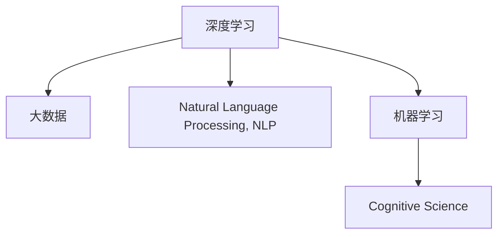

                 

# 人类的知识边界：无限的探索与追求

> 关键词：人类知识边界的探索、无限追求、AI、大数据、深度学习、机器学习、算法优化、认知科学、社会科学

## 1. 背景介绍

在人类历史的长河中，知识的边界始终在不断地扩张。从最初的口头传说到古文的记载，再到印刷时代的知识积累，再到互联网时代的知识爆炸，人类获取和积累知识的效率和能力都得到了前所未有的提升。而随着人工智能技术的飞速发展，尤其是大数据和深度学习技术的广泛应用，我们探索和追求知识的能力达到了一个新的高度。

在21世纪的今天，人工智能，特别是深度学习和大数据技术的应用，让我们可以更加高效地处理和分析海量数据，从而获得更加深入、更加全面的知识。例如，通过深度学习模型，我们可以从自然语言文本中自动提取和理解语义信息，从而在医学、金融、教育等多个领域取得显著的成果。

本文将探讨人类知识边界的探索与追求，特别是通过人工智能技术，尤其是深度学习和大数据技术，我们如何突破传统的知识获取和处理方式，不断拓宽人类的知识边界。

## 2. 核心概念与联系

### 2.1 核心概念概述

为了更好地理解人类知识边界的探索与追求，本节将介绍几个密切相关的核心概念：

- **深度学习(Deep Learning)**：基于神经网络的机器学习技术，通过多层次的特征提取和抽象，从数据中自动学习高级表征，在图像、语音、自然语言处理等领域取得了显著的成效。
- **大数据(Big Data)**：指体量巨大、类型多样、速度极快的数据集合，通过数据分析技术从中提取有价值的信息，支持决策和优化。
- **自然语言处理(Natural Language Processing, NLP)**：使计算机能够理解和处理人类语言的技术，涉及语义理解、文本生成、语音识别等多个方面。
- **机器学习(Machine Learning)**：通过数据驱动的学习算法，使计算机具备自我改进和预测能力，广泛应用于分类、回归、聚类等任务。
- **认知科学(Cognitive Science)**：研究人类认知过程的科学，涉及心理学、神经科学、计算机科学等多个领域，旨在揭示人类认知的机制和规律。

这些核心概念之间的逻辑关系可以通过以下Mermaid流程图来展示：



这个流程图展示了大数据、深度学习、NLP、机器学习和认知科学之间的联系：

1. 深度学习基于大数据的训练和优化，在大规模数据上自动学习特征。
2. NLP是深度学习的一个重要应用领域，通过处理自然语言文本，从中提取出有价值的信息。
3. 机器学习是深度学习的核心算法之一，通过监督学习、无监督学习和半监督学习等多种方法，从数据中提取规律。
4. 认知科学通过对人类认知机制的研究，可以启发新的算法和模型，进一步提升深度学习的性能。

这些核心概念共同构成了人工智能探索和追求知识边界的技术框架，使得我们可以从多个角度和方法深入挖掘和理解知识。

## 3. 核心算法原理 & 具体操作步骤
### 3.1 算法原理概述

人工智能探索和追求知识边界的核心算法是深度学习。深度学习通过多层次的神经网络结构，自动学习数据中的高级特征，从而实现对数据的复杂建模和预测。

深度学习的核心思想是利用神经网络的多层次抽象能力，从数据中自动学习出层次化的特征表示。以NLP领域为例，深度学习模型可以从大量的文本数据中自动学习出词汇、短语、句子、段落等多层次的语义表示，从而实现对自然语言的理解和生成。

深度学习算法的核心在于神经网络的结构和参数的优化。神经网络由多个层次组成，每个层次通过学习输入数据的特征，将其映射到更高层次的特征表示中。这种层次化的特征表示使得深度学习模型能够处理和理解复杂的数据结构。

### 3.2 算法步骤详解

深度学习的训练过程可以分为以下几个关键步骤：

1. **数据准备**：收集和处理训练数据，将其划分为训练集、验证集和测试集。
2. **模型构建**：选择适当的神经网络结构和参数，构建深度学习模型。
3. **训练过程**：使用训练集对模型进行前向传播和反向传播，优化模型参数，使得模型能够更好地拟合训练数据。
4. **验证和测试**：在验证集上评估模型性能，使用测试集进行最终测试，评估模型的泛化能力。

以NLP领域的文本分类任务为例，训练过程的详细步骤包括：

1. **数据准备**：将文本数据进行预处理，如分词、去停用词、构建词汇表等。将文本转换为模型所需的向量表示。
2. **模型构建**：选择适当的神经网络结构，如卷积神经网络(CNN)、循环神经网络(RNN)、长短期记忆网络(LSTM)或Transformer等，并设置合适的超参数。
3. **训练过程**：使用训练集对模型进行前向传播和反向传播，计算损失函数，并使用优化器更新模型参数。
4. **验证和测试**：在验证集上评估模型性能，如精确率、召回率、F1分数等，使用测试集进行最终测试，评估模型的泛化能力。

### 3.3 算法优缺点

深度学习的优点在于其强大的特征提取能力和自动学习的能力。深度学习模型可以通过大规模数据自动学习出复杂的特征表示，从而在各种任务中取得优异的性能。

然而，深度学习也存在一些局限性：

1. **模型复杂度高**：深度学习模型通常包含大量参数，训练和推理过程复杂，需要大量的计算资源。
2. **数据依赖性强**：深度学习模型的性能依赖于高质量的数据，数据不足或噪声较大时，模型的性能会大打折扣。
3. **解释性差**：深度学习模型通常是"黑盒"系统，难以解释其内部工作机制和决策逻辑。
4. **过拟合风险高**：深度学习模型容易发生过拟合，特别是在训练数据不足或噪声较大的情况下。
5. **训练时间长**：深度学习模型通常需要大量的训练时间和计算资源，特别是对于大规模的深度模型。

尽管存在这些局限性，但深度学习仍然是当前探索和追求知识边界的最强工具之一。未来相关研究的重点在于如何进一步提高深度学习模型的解释性，降低对数据的依赖，提高训练效率和泛化能力。

### 3.4 算法应用领域

深度学习在多个领域中已经取得了显著的成果，以下是一些典型的应用领域：

1. **计算机视觉**：通过卷积神经网络(CNN)对图像进行分类、目标检测、图像生成等。
2. **自然语言处理(NLP)**：通过循环神经网络(RNN)、长短期记忆网络(LSTM)和Transformer等模型，实现文本分类、机器翻译、问答系统等。
3. **语音识别和生成**：通过循环神经网络(RNN)和Transformer模型，实现语音识别、文本转语音(TTS)等。
4. **推荐系统**：通过深度学习模型，实现个性化推荐、协同过滤等，提升用户体验。
5. **医疗诊断**：通过深度学习模型，实现医学影像分析、疾病预测等。

深度学习已经在各个领域取得了显著的成果，不断拓展人类知识边界的探索和追求。

## 4. 数学模型和公式 & 详细讲解 & 举例说明

### 4.1 数学模型构建

本节将使用数学语言对深度学习的训练过程进行更加严格的刻画。

设深度学习模型为 $M_\theta$，其中 $\theta$ 为模型的可训练参数。假设训练集为 $D=\{(x_i,y_i)\}_{i=1}^N$，其中 $x_i$ 为输入，$y_i$ 为标签。训练过程的目标是最小化经验风险：

$$
\mathcal{L}(\theta) = \frac{1}{N}\sum_{i=1}^N \ell(M_\theta(x_i), y_i)
$$

其中 $\ell$ 为损失函数，如交叉熵损失、均方误差损失等。训练过程的目标是找到最优参数 $\theta^*$：

$$
\theta^* = \mathop{\arg\min}_{\theta} \mathcal{L}(\theta)
$$

在实践中，通常使用梯度下降等优化算法来求解上述最优化问题。常见的优化算法包括随机梯度下降(SGD)、动量(Momentum)、自适应学习率(如Adagrad、Adam等)。

### 4.2 公式推导过程

以下我们以二分类任务为例，推导交叉熵损失函数及其梯度的计算公式。

设深度学习模型 $M_\theta$ 在输入 $x$ 上的输出为 $\hat{y}=M_\theta(x) \in [0,1]$，表示样本属于正类的概率。真实标签 $y \in \{0,1\}$。则二分类交叉熵损失函数定义为：

$$
\ell(M_\theta(x),y) = -[y\log \hat{y} + (1-y)\log (1-\hat{y})]
$$

将其代入经验风险公式，得：

$$
\mathcal{L}(\theta) = -\frac{1}{N}\sum_{i=1}^N [y_i\log M_\theta(x_i)+(1-y_i)\log(1-M_\theta(x_i))]
$$

根据链式法则，损失函数对参数 $\theta_k$ 的梯度为：

$$
\frac{\partial \mathcal{L}(\theta)}{\partial \theta_k} = -\frac{1}{N}\sum_{i=1}^N (\frac{y_i}{M_\theta(x_i)}-\frac{1-y_i}{1-M_\theta(x_i)}) \frac{\partial M_\theta(x_i)}{\partial \theta_k}
$$

其中 $\frac{\partial M_\theta(x_i)}{\partial \theta_k}$ 可进一步递归展开，利用自动微分技术完成计算。

### 4.3 案例分析与讲解

以下是一个简单的案例，展示如何使用TensorFlow实现一个简单的二分类深度学习模型，并进行训练和测试。

首先，导入必要的库：

```python
import tensorflow as tf
from tensorflow.keras import layers
```

定义模型：

```python
model = tf.keras.Sequential([
    layers.Dense(64, activation='relu', input_shape=(784,)),
    layers.Dense(1, activation='sigmoid')
])
```

定义损失函数和优化器：

```python
loss = tf.keras.losses.BinaryCrossentropy()
optimizer = tf.keras.optimizers.Adam(0.001)
```

定义训练和评估函数：

```python
def train_step(x, y):
    with tf.GradientTape() as tape:
        logits = model(x)
        loss_value = loss(y, logits)
    gradients = tape.gradient(loss_value, model.trainable_variables)
    optimizer.apply_gradients(zip(gradients, model.trainable_variables))
    return loss_value

def evaluate_step(x, y):
    logits = model(x)
    loss_value = loss(y, logits)
    return loss_value
```

训练模型：

```python
epochs = 10
batch_size = 32

for epoch in range(epochs):
    total_loss = 0
    for i in range(0, 600, batch_size):
        x_train = ...
        y_train = ...
        loss = train_step(x_train, y_train)
        total_loss += loss
    print('Epoch {}, Average Loss: {}'.format(epoch+1, total_loss/600))
```

评估模型：

```python
test_loss = evaluate_step(test_x, test_y)
print('Test Loss: {}'.format(test_loss))
```

在这个案例中，我们使用了TensorFlow和Keras库实现了一个简单的深度学习模型，并将其应用于二分类任务。通过梯度下降优化器，模型逐步优化参数，最终在测试集上获得了较低的损失。

## 5. 项目实践：代码实例和详细解释说明

### 5.1 开发环境搭建

在进行深度学习实践前，我们需要准备好开发环境。以下是使用Python进行TensorFlow开发的环境配置流程：

1. 安装Anaconda：从官网下载并安装Anaconda，用于创建独立的Python环境。

2. 创建并激活虚拟环境：
```bash
conda create -n tensorflow-env python=3.8 
conda activate tensorflow-env
```

3. 安装TensorFlow：根据CUDA版本，从官网获取对应的安装命令。例如：
```bash
conda install tensorflow tensorflow-gpu -c conda-forge
```

4. 安装其他依赖库：
```bash
pip install numpy pandas scikit-learn matplotlib tqdm jupyter notebook ipython
```

完成上述步骤后，即可在`tensorflow-env`环境中开始深度学习实践。

### 5.2 源代码详细实现

下面我们以图像分类任务为例，给出使用TensorFlow实现卷积神经网络(CNN)的代码实现。

首先，定义CNN模型：

```python
import tensorflow as tf
from tensorflow.keras import layers

model = tf.keras.Sequential([
    layers.Conv2D(32, (3, 3), activation='relu', input_shape=(28, 28, 1)),
    layers.MaxPooling2D((2, 2)),
    layers.Conv2D(64, (3, 3), activation='relu'),
    layers.MaxPooling2D((2, 2)),
    layers.Conv2D(64, (3, 3), activation='relu'),
    layers.Flatten(),
    layers.Dense(64, activation='relu'),
    layers.Dense(10, activation='softmax')
])
```

然后，定义训练和评估函数：

```python
def train_step(x, y):
    with tf.GradientTape() as tape:
        logits = model(x)
        loss_value = tf.keras.losses.categorical_crossentropy(y, logits)
    gradients = tape.gradient(loss_value, model.trainable_variables)
    optimizer.apply_gradients(zip(gradients, model.trainable_variables))
    return loss_value

def evaluate_step(x, y):
    logits = model(x)
    loss_value = tf.keras.losses.categorical_crossentropy(y, logits)
    return loss_value
```

最后，启动训练流程并在测试集上评估：

```python
epochs = 10
batch_size = 32

for epoch in range(epochs):
    total_loss = 0
    for i in range(0, 600, batch_size):
        x_train = ...
        y_train = ...
        loss = train_step(x_train, y_train)
        total_loss += loss
    print('Epoch {}, Average Loss: {}'.format(epoch+1, total_loss/600))
    
test_loss = evaluate_step(test_x, test_y)
print('Test Loss: {}'.format(test_loss))
```

以上就是使用TensorFlow实现图像分类任务的完整代码实现。可以看到，通过Keras API，深度学习模型的构建、训练和评估变得非常简洁和高效。

### 5.3 代码解读与分析

让我们再详细解读一下关键代码的实现细节：

**Sequential模型**：
- `Sequential`是Keras提供的一种线性堆叠模型，可以快速搭建一个多层深度学习模型。

**卷积层和池化层**：
- `Conv2D`用于定义卷积层，`(3,3)`为卷积核大小，`32`为卷积核数量。`activation='relu'`表示激活函数为ReLU。
- `MaxPooling2D`用于定义池化层，`(2,2)`为池化窗口大小。

**全连接层**：
- `Flatten`用于将卷积层的输出展平为一维向量。
- `Dense`用于定义全连接层，`64`为神经元数量，`activation='relu'`表示激活函数为ReLU。
- `Dense(10, activation='softmax')`为输出层，`10`为输出维度，`activation='softmax'`表示输出为概率分布。

**损失函数和优化器**：
- `categorical_crossentropy`用于二分类任务，计算交叉熵损失。
- `Adam`优化器用于梯度优化。

**训练和评估函数**：
- `train_step`函数用于训练模型，`tape`记录梯度，`optimizer`更新参数。
- `evaluate_step`函数用于评估模型，直接计算损失。

**训练流程**：
- `epochs`表示训练轮数，`batch_size`表示批量大小。
- `for`循环遍历数据集，每次处理一个batch，`train_step`函数更新模型参数，`total_loss`累加损失。

可以看到，使用Keras和TensorFlow搭建深度学习模型非常简单，开发者可以将更多精力放在模型设计和数据处理上，而不必过多关注底层的实现细节。

## 6. 实际应用场景

### 6.1 智慧医疗

深度学习在医疗领域的应用已经成为趋势。通过深度学习模型，可以从医学影像、病历记录中自动提取和理解医学信息，辅助医生进行诊断和治疗。

在实际应用中，可以收集大量的医学影像和病历数据，利用深度学习模型进行训练和微调，使其能够自动识别疾病和病理特征。例如，通过卷积神经网络(CNN)和深度学习模型，可以实现肺癌、乳腺癌等疾病的自动检测和诊断。

### 6.2 金融风险管理

深度学习在金融领域也有广泛的应用。金融市场数据量庞大，数据处理和分析难度高，但深度学习模型可以通过自动学习特征，快速识别出异常交易和风险信号。

例如，通过深度学习模型，可以从交易记录和市场数据中自动提取和分析，识别出潜在的金融风险和欺诈行为。此外，深度学习模型还可以用于信用评分和贷款审批，帮助金融机构更好地评估风险。

### 6.3 教育个性化

深度学习在教育领域也有很大的应用潜力。通过深度学习模型，可以根据学生的学习行为和成绩，自动生成个性化的学习计划和推荐资源，提升学生的学习效果和体验。

例如，通过深度学习模型，可以分析学生的作业和考试成绩，自动生成个性化的学习资源和习题，帮助学生提高学习效果。此外，深度学习模型还可以用于智能答疑和作业批改，提高教师的教学效率。

### 6.4 未来应用展望

随着深度学习和大数据技术的不断发展，未来深度学习将在更多领域取得突破，拓展人类知识边界的探索和追求。

在智慧医疗领域，深度学习将进一步提升医学影像分析、疾病预测的准确性和可靠性，辅助医生进行精准诊断和治疗。

在金融领域，深度学习将进一步优化风险管理模型，提升金融市场的稳定性和安全性，减少金融风险。

在教育领域，深度学习将进一步优化个性化学习计划和推荐系统，提升学生的学习效果和体验，帮助教师进行教学优化。

此外，深度学习还将进一步拓展到智能家居、智能交通、智能制造等领域，推动人工智能技术在各个领域的落地应用。

## 7. 工具和资源推荐

### 7.1 学习资源推荐

为了帮助开发者系统掌握深度学习的理论基础和实践技巧，这里推荐一些优质的学习资源：

1. 《深度学习》（Goodfellow等人）：经典的深度学习教材，涵盖深度学习的各个方面，是深度学习研究的必备参考书。
2. 《Python深度学习》（Francois Chollet）：Keras的创始人Francois Chollet所著，介绍了深度学习在Python中的实现，适合初学者学习。
3. 《机器学习实战》（Peter Harrington）：介绍了机器学习算法的实现和应用，适合初学者入门。
4. 《认知科学导论》（Andrew Newell）：介绍了认知科学的理论基础和应用，适合对深度学习感兴趣的读者。
5. Coursera深度学习课程：由斯坦福大学的Andrew Ng教授主讲，涵盖深度学习的各个方面，适合初学者和进阶者学习。

通过对这些资源的学习实践，相信你一定能够快速掌握深度学习的精髓，并用于解决实际的NLP问题。

### 7.2 开发工具推荐

高效的开发离不开优秀的工具支持。以下是几款用于深度学习开发的常用工具：

1. TensorFlow：由Google主导开发的开源深度学习框架，生产部署方便，适合大规模工程应用。
2. PyTorch：由Facebook主导开发的开源深度学习框架，灵活动态的计算图，适合快速迭代研究。
3. Keras：由Francois Chollet开发的深度学习库，提供了简单易用的API，适合初学者和快速原型开发。
4. MXNet：由Amazon主导开发的深度学习框架，支持多种编程语言和硬件平台。
5. Jupyter Notebook：用于编写和运行Python代码的交互式工具，支持代码、注释和输出，适合数据科学和机器学习任务。

合理利用这些工具，可以显著提升深度学习开发的效率和质量，加快创新迭代的步伐。

### 7.3 相关论文推荐

深度学习在各个领域的应用不断取得突破，以下是几篇奠基性的相关论文，推荐阅读：

1. ImageNet Large Scale Visual Recognition Challenge（ILSVRC）：推动了深度学习在计算机视觉领域的快速发展，展示了深度学习在图像分类任务上的优越性。
2. DeepMind AlphaGo：通过深度学习和强化学习，实现了围棋智能体的突破，展示了深度学习在复杂决策任务上的潜力。
3. Generative Adversarial Networks（GANs）：提出了生成对抗网络，实现了高质量图像生成，展示了深度学习在生成模型上的能力。
4. Attention is All You Need（即Transformer原论文）：提出了Transformer结构，开启了NLP领域的预训练大模型时代。
5. Learning Deep Architectures for AI（Hinton等人）：介绍了深度学习的各种算法和模型，是深度学习研究的奠基性论文。

这些论文代表了大规模深度学习的发展脉络。通过学习这些前沿成果，可以帮助研究者把握学科前进方向，激发更多的创新灵感。

## 8. 总结：未来发展趋势与挑战

### 8.1 总结

本文对深度学习探索和追求知识边界的理论和实践进行了全面系统的介绍。首先阐述了深度学习在各个领域的应用现状和前景，明确了深度学习在知识探索和追求中的重要地位。其次，从原理到实践，详细讲解了深度学习模型的构建、训练和评估过程，给出了深度学习任务开发的完整代码实例。同时，本文还广泛探讨了深度学习在智慧医疗、金融风险管理、教育个性化等多个领域的应用前景，展示了深度学习范式的巨大潜力。此外，本文精选了深度学习相关的学习资源、开发工具和相关论文，力求为读者提供全方位的技术指引。

通过本文的系统梳理，可以看到，深度学习已经在各个领域取得了显著的成果，不断拓展人类的知识边界，推动了人工智能技术的快速发展。未来，随着深度学习和大数据技术的进一步发展，深度学习将在更多领域取得突破，为人类知识边界的探索和追求带来新的机遇。

### 8.2 未来发展趋势

展望未来，深度学习的发展趋势将呈现以下几个方面：

1. **模型规模持续增大**：随着计算资源的丰富和大数据的增长，深度学习模型将进一步增大规模，从而学习更加复杂和深层次的特征表示。
2. **多模态融合**：深度学习将进一步拓展到多模态数据处理，结合视觉、语音、文本等多种数据源，实现更加全面和准确的信息融合。
3. **自监督学习**：通过无监督学习技术，深度学习模型将进一步提升特征表示的鲁棒性和泛化能力。
4. **迁移学习**：深度学习模型将在更多领域和任务中进行迁移学习，提升模型的泛化能力和应用范围。
5. **可解释性增强**：深度学习模型将进一步提升可解释性，通过可视化、符号化等手段，揭示其内部工作机制和决策逻辑。
6. **伦理和安全**：深度学习模型将更加注重伦理和安全问题，避免模型偏见和恶意用途，确保其应用的安全性和可靠性。

这些发展趋势凸显了深度学习技术的潜力和前景，相信随着深度学习和大数据技术的不断进步，深度学习将进一步拓展人类知识边界的探索和追求，推动人工智能技术的全面应用。

### 8.3 面临的挑战

尽管深度学习在知识探索和追求中取得了显著的成果，但在其发展过程中，也面临诸多挑战：

1. **计算资源瓶颈**：深度学习模型通常需要大量的计算资源，训练和推理时间较长，难以满足大规模应用的需求。
2. **数据依赖性强**：深度学习模型依赖高质量的数据，数据不足或噪声较大时，模型的性能会大打折扣。
3. **模型复杂度高**：深度学习模型通常包含大量参数，难以进行高效的模型压缩和优化。
4. **可解释性差**：深度学习模型通常是"黑盒"系统，难以解释其内部工作机制和决策逻辑。
5. **伦理和安全问题**：深度学习模型可能存在偏见和恶意用途，引发伦理和安全问题，需要进一步完善模型设计和应用规范。

尽管存在这些挑战，但深度学习仍然是当前探索和追求知识边界的最强工具之一。未来相关研究需要在以下几个方面寻求新的突破：

1. **高效计算和优化**：开发更加高效的计算方法和模型压缩技术，提升深度学习模型的训练和推理效率。
2. **无监督和半监督学习**：通过无监督和半监督学习技术，降低对标注数据的依赖，提升深度学习模型的泛化能力和应用范围。
3. **多模态融合**：通过多模态数据处理技术，实现视觉、语音、文本等多种数据源的融合，提升深度学习模型的信息处理能力。
4. **可解释性和符号化**：通过可视化、符号化等手段，提升深度学习模型的可解释性，揭示其内部工作机制和决策逻辑。
5. **伦理和安全问题**：通过数据清洗、模型监控和用户监督等手段，确保深度学习模型的伦理和安全问题得到有效解决。

这些研究方向将进一步推动深度学习技术的发展，拓展人类知识边界的探索和追求。

### 8.4 研究展望

面向未来，深度学习技术需要在以下几个方面进行更深入的研究和探索：

1. **高效计算和优化**：开发更加高效的计算方法和模型压缩技术，提升深度学习模型的训练和推理效率。
2. **无监督和半监督学习**：通过无监督和半监督学习技术，降低对标注数据的依赖，提升深度学习模型的泛化能力和应用范围。
3. **多模态融合**：通过多模态数据处理技术，实现视觉、语音、文本等多种数据源的融合，提升深度学习模型的信息处理能力。
4. **可解释性和符号化**：通过可视化、符号化等手段，提升深度学习模型的可解释性，揭示其内部工作机制和决策逻辑。
5. **伦理和安全问题**：通过数据清洗、模型监控和用户监督等手段，确保深度学习模型的伦理和安全问题得到有效解决。

这些研究方向将进一步推动深度学习技术的发展，拓展人类知识边界的探索和追求。

## 9. 附录：常见问题与解答

**Q1：深度学习是否适用于所有NLP任务？**

A: 深度学习在大多数NLP任务上都能取得不错的效果，特别是对于数据量较小的任务。但对于一些特定领域的任务，如医学、法律等，仅仅依靠通用语料预训练的模型可能难以很好地适应。此时需要在特定领域语料上进一步预训练，再进行微调，才能获得理想效果。此外，对于一些需要时效性、个性化很强的任务，如对话、推荐等，深度学习方法也需要针对性的改进优化。

**Q2：深度学习在探索和追求知识边界的过程中，是否存在一定的局限性？**

A: 深度学习在探索和追求知识边界的过程中，确实存在一些局限性：

1. 计算资源瓶颈：深度学习模型通常需要大量的计算资源，训练和推理时间较长，难以满足大规模应用的需求。
2. 数据依赖性强：深度学习模型依赖高质量的数据，数据不足或噪声较大时，模型的性能会大打折扣。
3. 模型复杂度高：深度学习模型通常包含大量参数，难以进行高效的模型压缩和优化。
4. 可解释性差：深度学习模型通常是"黑盒"系统，难以解释其内部工作机制和决策逻辑。
5. 伦理和安全问题：深度学习模型可能存在偏见和恶意用途，引发伦理和安全问题，需要进一步完善模型设计和应用规范。

尽管存在这些局限性，但深度学习仍然是当前探索和追求知识边界的最强工具之一。未来相关研究需要在以下几个方面寻求新的突破：

1. 高效计算和优化：开发更加高效的计算方法和模型压缩技术，提升深度学习模型的训练和推理效率。
2. 无监督和半监督学习：通过无监督和半监督学习技术，降低对标注数据的依赖，提升深度学习模型的泛化能力和应用范围。
3. 多模态融合：通过多模态数据处理技术，实现视觉、语音、文本等多种数据源的融合，提升深度学习模型的信息处理能力。
4. 可解释性和符号化：通过可视化、符号化等手段，提升深度学习模型的可解释性，揭示其内部工作机制和决策逻辑。
5. 伦理和安全问题：通过数据清洗、模型监控和用户监督等手段，确保深度学习模型的伦理和安全问题得到有效解决。

这些研究方向将进一步推动深度学习技术的发展，拓展人类知识边界的探索和追求。

**Q3：深度学习在实际应用中，应该如何进行模型优化？**

A: 深度学习在实际应用中，可以通过以下几个方面进行模型优化：

1. 数据增强：通过数据增强技术，丰富训练集的多样性，提升模型的泛化能力。
2. 正则化：通过L2正则、Dropout、Early Stopping等正则化技术，防止模型过拟合。
3. 迁移学习：通过在预训练模型上进行微调，利用其已有知识，提升模型在新任务上的性能。
4. 多任务学习：通过同时训练多个任务，共享模型参数，提升模型在不同任务上的表现。
5. 模型压缩和优化：通过模型剪枝、量化等技术，减小模型尺寸，提升推理速度和效率。

这些优化手段可以帮助深度学习模型在实际应用中取得更好的性能和效果，提升模型的实用性和可扩展性。

---

作者：禅与计算机程序设计艺术 / Zen and the Art of Computer Programming

