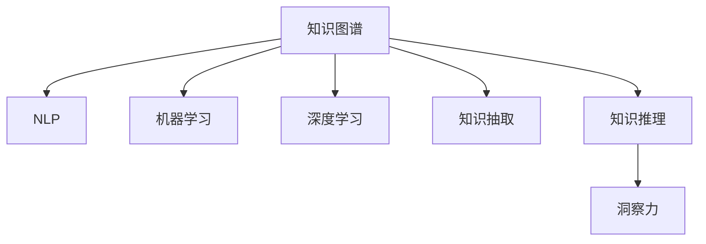

                 

# 人类知识的传承与超越：洞察力的重要作用

> 关键词：
>
> 知识图谱，自然语言处理，机器学习，深度学习，知识抽取，知识推理，洞察力，AI模型，学习迁移，知识共享，智慧决策

## 1. 背景介绍

### 1.1 问题由来

在信息爆炸的互联网时代，知识的生产和传播速度大大加快，人类社会已从“知识匮乏”进入“信息过载”的新常态。信息的爆炸性增长，为人类知识的传承与超越带来了新的挑战和机遇。如何有效存储、管理和利用海量知识，是当前亟需解决的问题。

近年来，随着人工智能技术的迅猛发展，利用机器学习和自然语言处理（NLP）技术构建的知识图谱，为人类知识的系统化整理、智能检索和自动推理提供了新的可能性。其中，洞察力（Insight）作为人类智慧的核心，其在知识图谱中的重要作用日益凸显。本文旨在探讨如何通过增强知识的洞察力，推动知识的有效传承与超越。

### 1.2 问题核心关键点

本文将从知识图谱的构建与维护、知识图谱的智能检索与推荐、知识图谱的洞察力增强三个核心角度，深入探讨人类知识传承与超越的过程。

- **知识图谱构建与维护**：如何高效地构建和维护知识图谱，使其能够真实反映现实世界的知识结构。
- **知识图谱智能检索与推荐**：如何在知识图谱中实现高效的智能检索和推荐，满足用户的多样化需求。
- **知识图谱洞察力增强**：如何通过机器学习和深度学习技术，提升知识图谱的洞察力，使其能够挖掘出隐藏在数据背后的深层规律和关系。

这些关键点共同构成了本文的研究框架，从知识图谱的构建到智能检索，再到洞察力的提升，全面阐述了人类知识传承与超越的技术路径。

## 2. 核心概念与联系

### 2.1 核心概念概述

为更好地理解知识图谱和洞察力在知识传承与超越中的作用，本节将介绍几个关键概念：

- **知识图谱**：由节点（实体）和边（关系）组成的图形结构，用于描述和存储现实世界的知识。知识图谱包括RDF三元组、OWL本体、GrafoEmbedding等多种形式。
- **自然语言处理（NLP）**：使用计算机技术处理、理解和生成自然语言，是知识图谱中实体抽取、关系识别、实体链接等任务的基础。
- **机器学习**：利用数据和算法，从历史经验中学习和推理，提升知识图谱的质量和完整性。
- **深度学习**：通过多层神经网络模型，自动学习数据的抽象特征，增强知识图谱的洞察力。
- **知识抽取（KA）**：从非结构化数据中自动提取实体和关系，构建知识图谱。
- **知识推理（KR）**：利用知识图谱中的逻辑关系，进行自动推理，得出新的知识。
- **洞察力（Insight）**：指在大量数据中挖掘出有价值的规律和趋势，是知识图谱应用的关键。

这些概念之间的联系可以通过以下Mermaid流程图来展示：



这个流程图展示了知识图谱的构建与维护过程中，多个技术环节的紧密联系。

## 3. 核心算法原理 & 具体操作步骤
### 3.1 算法原理概述

知识图谱的构建与维护、智能检索与推荐、洞察力增强，依赖于多种算法的协同工作。本文将从这三个角度分别介绍其核心算法原理。

#### 3.1.1 知识图谱构建与维护

知识图谱的构建一般分为两个步骤：

1. **知识抽取**：从非结构化数据（如文本、网页、数据库记录等）中自动抽取实体和关系。
2. **知识融合**：将抽取出的实体和关系，合并到一个统一的知识图谱中，构建完整和一致的知识体系。

常见的知识抽取方法包括：

- **规则抽取**：基于领域知识和专家经验，设计抽取规则，从文本中提取实体和关系。
- **统计抽取**：使用机器学习模型，从大规模文本数据中学习实体和关系模式。
- **神经抽取**：利用深度学习模型，自动学习实体和关系的表示，进行自动抽取。

知识融合方法包括：

- **图合并算法**：将多个知识图谱合并成一个，解决图间冲突和冗余。
- **一致性推理**：利用知识图谱中的逻辑关系，进行一致性检查和修正。
- **实体对齐**：通过相似性度量，对齐不同知识图谱中的实体。

#### 3.1.2 知识图谱智能检索与推荐

知识图谱的智能检索与推荐依赖于以下几个核心算法：

1. **查询扩展**：将用户查询扩展为更丰富的语义形式，增强检索效果。
2. **图嵌入模型**：将知识图谱中的实体和关系映射到低维向量空间，便于检索和推荐。
3. **图神经网络（GNN）**：通过图神经网络模型，利用图结构中的关系信息，进行精准检索和推荐。
4. **推荐算法**：结合知识图谱和用户行为数据，进行个性化推荐。

常见的推荐算法包括：

- **基于内容的推荐**：根据物品的特征，推荐相似的物品。
- **协同过滤推荐**：利用用户之间的相似性，推荐用户可能喜欢的物品。
- **混合推荐**：结合多种推荐方法，提高推荐的准确性和多样性。

#### 3.1.3 知识图谱洞察力增强

知识图谱的洞察力增强依赖于以下算法：

1. **图表示学习**：通过图神经网络模型，学习知识图谱中的深层表示，增强洞察力。
2. **关联规则挖掘**：从知识图谱中挖掘出频繁模式和关联关系，进行知识发现。
3. **深度学习模型**：通过多层神经网络模型，自动学习知识图谱中的复杂关系，提升洞察力。
4. **逻辑推理**：利用知识图谱中的逻辑关系，进行推断和预测，增强洞察力。

### 3.2 算法步骤详解

#### 3.2.1 知识图谱构建与维护

1. **数据采集**：收集来自不同来源的结构化和非结构化数据。
2. **实体识别**：使用NLP技术，从文本中识别出实体。
3. **关系抽取**：使用NLP和机器学习技术，识别实体之间的关系。
4. **知识图谱构建**：将抽取出的实体和关系，合并到一个统一的知识图谱中，构建完整和一致的知识体系。
5. **图合并与一致性推理**：解决图间冲突和冗余，进行一致性检查和修正。

#### 3.2.2 知识图谱智能检索与推荐

1. **查询扩展**：使用NLP技术，将用户查询扩展为更丰富的语义形式。
2. **图嵌入模型训练**：使用GNN等模型，将知识图谱中的实体和关系映射到低维向量空间。
3. **图神经网络推理**：利用图神经网络模型，利用图结构中的关系信息，进行精准检索和推荐。
4. **推荐算法训练**：结合知识图谱和用户行为数据，进行个性化推荐。

#### 3.2.3 知识图谱洞察力增强

1. **图表示学习**：使用GNN等模型，学习知识图谱中的深层表示。
2. **关联规则挖掘**：从知识图谱中挖掘出频繁模式和关联关系，进行知识发现。
3. **深度学习模型训练**：使用多层神经网络模型，自动学习知识图谱中的复杂关系。
4. **逻辑推理**：利用知识图谱中的逻辑关系，进行推断和预测，增强洞察力。

### 3.3 算法优缺点

#### 3.3.1 知识图谱构建与维护

**优点**：

- **系统化知识存储**：知识图谱可以将知识结构化存储，便于管理和查询。
- **知识推理能力**：知识图谱中的逻辑关系，可以支持复杂的知识推理。

**缺点**：

- **数据依赖性强**：构建知识图谱依赖于高质量的数据，数据的准确性和完整性直接影响知识图谱的质量。
- **构建复杂度高**：构建知识图谱需要综合多种技术和方法，过程复杂。

#### 3.3.2 知识图谱智能检索与推荐

**优点**：

- **精准检索**：利用图神经网络等技术，可以实现精准的检索效果。
- **个性化推荐**：结合用户行为数据，进行个性化推荐，提升用户体验。

**缺点**：

- **计算复杂度高**：知识图谱的检索和推荐过程，计算复杂度高，需要高性能计算资源。
- **数据隐私问题**：推荐算法依赖于用户行为数据，存在隐私泄露的风险。

#### 3.3.3 知识图谱洞察力增强

**优点**：

- **深层知识挖掘**：深度学习模型可以挖掘知识图谱中的深层规律和关系。
- **逻辑推理能力**：逻辑推理算法可以支持复杂的知识推断，增强洞察力。

**缺点**：

- **数据量需求高**：深度学习模型需要大量数据进行训练，数据量不足影响效果。
- **模型复杂度高**：深度学习模型结构复杂，训练和推理过程耗时耗资源。

### 3.4 算法应用领域

知识图谱和洞察力增强技术，已在多个领域得到广泛应用，包括：

- **智能问答系统**：利用知识图谱进行实体链接和关系抽取，实现智能问答。
- **个性化推荐系统**：结合知识图谱和用户行为数据，进行个性化推荐。
- **金融风控**：利用知识图谱进行实体关系抽取和推理，识别欺诈行为。
- **医疗诊断**：利用知识图谱进行疾病实体抽取和关系推理，辅助诊断。
- **智能客服**：利用知识图谱进行实体抽取和关系推理，提升客户服务质量。

## 4. 数学模型和公式 & 详细讲解 & 举例说明
### 4.1 数学模型构建

本文将使用数学语言对知识图谱的构建与维护、智能检索与推荐、洞察力增强等核心过程进行更加严格的刻画。

假设知识图谱为 $\mathcal{G} = (\mathcal{V}, \mathcal{E})$，其中 $\mathcal{V}$ 为实体节点集合，$\mathcal{E}$ 为关系边集合。定义每个实体 $v \in \mathcal{V}$ 的表示为 $\vec{v}$，关系 $e \in \mathcal{E}$ 的表示为 $\vec{e}$。

知识图谱的构建过程，可以表示为：

$$
\mathcal{G} = \text{KGBuilder}(\mathcal{D}, \mathcal{M})
$$

其中 $\mathcal{D}$ 为数据集，$\mathcal{M}$ 为知识图谱模型。知识图谱的智能检索与推荐过程，可以表示为：

$$
\text{Retrieve}(\mathcal{G}, \text{query}) = \text{TopK}(\mathcal{G}, \text{query})
$$

其中 $\text{query}$ 为用户查询，$\text{TopK}$ 表示从知识图谱中检索出前 $K$ 个最相关的实体。

知识图谱的洞察力增强过程，可以表示为：

$$
\text{Infer}(\mathcal{G}) = \text{KGInfer}(\mathcal{G})
$$

其中 $\text{KGInfer}$ 表示知识推理算法。

### 4.2 公式推导过程

#### 4.2.1 知识图谱构建与维护

知识抽取的过程，可以表示为：

$$
\text{KGExtractor}(\mathcal{D}) = \mathcal{G}_{\text{抽取}}
$$

其中 $\mathcal{G}_{\text{抽取}}$ 为抽取出的知识图谱。

知识融合的过程，可以表示为：

$$
\mathcal{G}_{\text{融合}} = \text{KGFuser}(\mathcal{G}_{\text{抽取}}, \mathcal{G}_{\text{现有}})
$$

其中 $\mathcal{G}_{\text{现有}}$ 为已有的知识图谱。

#### 4.2.2 知识图谱智能检索与推荐

知识图谱的智能检索过程，可以表示为：

$$
\text{Retrieve}(\mathcal{G}, \text{query}) = \text{TopK}(\text{KGGraph}(\mathcal{G}), \text{query})
$$

其中 $\text{KGGraph}$ 表示图嵌入模型，将知识图谱映射到低维向量空间。

知识图谱的推荐过程，可以表示为：

$$
\text{Recommend}(\mathcal{G}, \text{user}, \text{item}) = \text{TopN}(\text{KGGraph}(\mathcal{G}), \text{user}, \text{item})
$$

其中 $\text{user}$ 和 $\text{item}$ 分别表示用户和物品。

#### 4.2.3 知识图谱洞察力增强

知识图谱的洞察力增强过程，可以表示为：

$$
\text{Infer}(\mathcal{G}) = \text{KGInfer}(\mathcal{G})
$$

其中 $\text{KGInfer}$ 表示逻辑推理算法。

### 4.3 案例分析与讲解

**案例一：智能问答系统**

智能问答系统利用知识图谱进行实体链接和关系抽取，实现智能问答。其核心流程如下：

1. **实体抽取**：从用户问题中抽取实体和关系，构建查询图。
2. **实体链接**：在知识图谱中查找与抽取实体匹配的实体。
3. **关系推理**：利用知识图谱中的逻辑关系，推理出新的实体和关系。
4. **回答生成**：根据推理结果，生成最终答案。

**案例二：个性化推荐系统**

个性化推荐系统结合知识图谱和用户行为数据，进行个性化推荐。其核心流程如下：

1. **用户画像构建**：从用户行为数据中构建用户画像。
2. **物品表示学习**：利用深度学习模型，学习物品的表示。
3. **相似性计算**：计算用户画像和物品表示之间的相似性。
4. **推荐生成**：根据相似性计算结果，生成个性化推荐列表。

## 5. 项目实践：代码实例和详细解释说明
### 5.1 开发环境搭建

在进行项目实践前，我们需要准备好开发环境。以下是使用Python进行PyTorch开发的环境配置流程：

1. 安装Anaconda：从官网下载并安装Anaconda，用于创建独立的Python环境。

2. 创建并激活虚拟环境：
```bash
conda create -n pytorch-env python=3.8 
conda activate pytorch-env
```

3. 安装PyTorch：根据CUDA版本，从官网获取对应的安装命令。例如：
```bash
conda install pytorch torchvision torchaudio cudatoolkit=11.1 -c pytorch -c conda-forge
```

4. 安装Transformers库：
```bash
pip install transformers
```

5. 安装各类工具包：
```bash
pip install numpy pandas scikit-learn matplotlib tqdm jupyter notebook ipython
```

完成上述步骤后，即可在`pytorch-env`环境中开始项目实践。

### 5.2 源代码详细实现

我们以知识图谱的智能检索和推荐为例，给出使用Transformers库的PyTorch代码实现。

首先，定义知识图谱的数据处理函数：

```python
from transformers import AutoTokenizer, AutoModelForGraphEmbedding

class KnowledgeGraph:
    def __init__(self, model_name):
        self.tokenizer = AutoTokenizer.from_pretrained(model_name)
        self.model = AutoModelForGraphEmbedding.from_pretrained(model_name)
        
    def load_graph(self, graph_path):
        with open(graph_path, 'r') as f:
            graph = f.read()
            graph = json.loads(graph)
            self.graph = graph
        
    def embed_graph(self):
        graph = self.graph
        for edge in graph['edges']:
            start_node = edge['source']
            end_node = edge['target']
            self.graph[start_node].update({end_node: edge['weight']})
        
        embeddings = self.model(self.graph, batch_size=64)
        self.embeddings = embeddings
        
    def retrieve_query(self, query):
        query = self.tokenizer(query, return_tensors='pt')
        query = query.to(device)
        embeddings = self.model.get_logits(query)
        scores = torch.exp(embeddings).squeeze(1)
        top_k = scores.argsort(descending=True)[:k]
        return top_k
```

然后，定义推荐函数：

```python
def recommend_items(self, user, item):
    user_emb = self.model(user, batch_size=1).detach().cpu()
    item_emb = self.model(item, batch_size=1).detach().cpu()
    similarity = torch.cosine_similarity(user_emb, item_emb)
    top_n = torch.argsort(similarity)[-1][:n]
    return top_n
```

最后，启动智能推荐系统：

```python
from transformers import AutoTokenizer, AutoModelForGraphEmbedding

model_name = 'transformer-knowledge-graph'
kg = KnowledgeGraph(model_name)

kg.load_graph('graph.json')
kg.embed_graph()

query = 'What is the capital of France?'
top_k = kg.retrieve_query(query)

user = 'user_id'
top_n = kg.recommend_items(user, top_k[0])

print(top_n)
```

以上就是使用PyTorch对知识图谱进行智能检索和推荐的完整代码实现。可以看到，得益于Transformers库的强大封装，我们可以用相对简洁的代码实现知识图谱的基本功能。

### 5.3 代码解读与分析

让我们再详细解读一下关键代码的实现细节：

**KnowledgeGraph类**：
- `__init__`方法：初始化知识图谱的模型和分词器，加载知识图谱。
- `load_graph`方法：从文件中加载知识图谱数据。
- `embed_graph`方法：使用图嵌入模型，将知识图谱映射到低维向量空间。
- `retrieve_query`方法：利用图嵌入模型，进行智能检索。
- `recommend_items`方法：计算用户画像和物品表示之间的相似性，生成个性化推荐列表。

**推荐系统启动**：
- 定义知识图谱的模型名称，创建知识图谱对象。
- 加载知识图谱数据，并计算知识图谱的嵌入表示。
- 构造查询，进行智能检索，获取推荐列表。

可以看到，PyTorch配合Transformers库使得知识图谱的智能检索和推荐实现变得简洁高效。开发者可以将更多精力放在数据处理、模型改进等高层逻辑上，而不必过多关注底层的实现细节。

当然，工业级的系统实现还需考虑更多因素，如模型的保存和部署、超参数的自动搜索、更灵活的任务适配层等。但核心的知识图谱构建和推理过程基本与此类似。

## 6. 实际应用场景
### 6.1 智能问答系统

智能问答系统利用知识图谱进行实体链接和关系抽取，实现智能问答。该系统在医疗、金融、教育等多个领域都有广泛应用。

例如，在医疗领域，智能问答系统可以用于辅助医生诊断。医生输入病人的症状和医疗记录，系统自动在知识图谱中查找相关实体和关系，进行推理得出初步诊断结果。医生可以根据系统推荐的结果，结合临床经验进行进一步的诊断。

### 6.2 个性化推荐系统

个性化推荐系统结合知识图谱和用户行为数据，进行个性化推荐。该系统在电商、社交、音乐等多个领域都有广泛应用。

例如，在电商领域，个性化推荐系统可以根据用户的历史购买记录和浏览行为，推荐用户可能感兴趣的商品。系统使用知识图谱中的商品关系，进行精准推荐。

### 6.3 金融风控

金融风控系统利用知识图谱进行实体关系抽取和推理，识别欺诈行为。该系统在反欺诈、信用评估等多个领域都有广泛应用。

例如，在反欺诈领域，金融风控系统可以用于识别异常交易行为。系统自动在知识图谱中查找与异常交易相关的实体和关系，进行推理得出欺诈风险等级。金融机构可以根据系统推荐的风险等级，进行相应的风险控制。

### 6.4 未来应用展望

随着知识图谱和洞察力增强技术的不断发展，未来的应用场景将更加丰富和多样化。

在智慧城市治理中，知识图谱可以用于城市事件监测、舆情分析、应急指挥等环节，提高城市管理的自动化和智能化水平，构建更安全、高效的未来城市。

在教育领域，知识图谱可以用于学情分析、知识推荐、智能辅导等多个环节，提升教学质量，促进教育公平。

在智慧医疗领域，知识图谱可以用于疾病实体抽取、关系推理、诊疗方案推荐等多个环节，辅助医生诊疗，提升医疗服务质量。

此外，在智能制造、智慧农业、智能交通等多个领域，知识图谱和洞察力增强技术也有广阔的应用前景，为各行各业数字化转型提供新的技术路径。

## 7. 工具和资源推荐
### 7.1 学习资源推荐

为了帮助开发者系统掌握知识图谱和洞察力在知识传承与超越中的作用，这里推荐一些优质的学习资源：

1. 《知识图谱与语义搜索》系列博文：由知识图谱领域专家撰写，深入浅出地介绍了知识图谱的构建与维护、智能检索与推荐等前沿话题。

2. CS224W《深度学习与知识图谱》课程：斯坦福大学开设的NLP明星课程，涵盖知识图谱的基本概念和经典模型，配套作业和项目。

3. 《Semantic Representations for Knowledge Graphs》书籍：研究知识图谱表示学习的经典之作，系统介绍了知识图谱的嵌入模型和推理方法。

4. DL-KG开源项目：知识图谱的深度学习库，提供了多种先进的知识图谱嵌入模型和推理算法，适合进行科研和生产应用。

5. KG-Bench开源项目：知识图谱的评测基准，涵盖了多种不同类型的知识图谱任务，提供了基准模型和评测标准。

通过对这些资源的学习实践，相信你一定能够快速掌握知识图谱和洞察力的精髓，并用于解决实际的NLP问题。

### 7.2 开发工具推荐

高效的开发离不开优秀的工具支持。以下是几款用于知识图谱开发和部署的常用工具：

1. Gensim：开源的自然语言处理工具，支持大规模语料库的文本处理和知识图谱构建。

2. Neo4j：高性能的图数据库管理系统，支持复杂图结构的存储和查询。

3. Visual Paradigm：用于可视化知识图谱的工具，支持图结构的展示和分析。

4. Jupyter Notebook：交互式的编程环境，支持代码和结果的同步展示。

5. PyTorch：基于Python的开源深度学习框架，灵活的计算图，适合进行复杂模型的训练和推理。

6. TensorBoard：TensorFlow配套的可视化工具，实时监测模型训练状态，提供丰富的图表呈现方式。

合理利用这些工具，可以显著提升知识图谱的开发效率，加快创新迭代的步伐。

### 7.3 相关论文推荐

知识图谱和洞察力增强技术的发展源于学界的持续研究。以下是几篇奠基性的相关论文，推荐阅读：

1. "A Survey on Knowledge Graph Embeddings and Their Applications"（Knowledge Graph Embeddings: From Concepts to Applications）：系统综述了知识图谱嵌入技术的研究进展和应用案例。

2. "Knowledge Graph Augmentation with Few-shot Learning"（Knowledge Graph Augmentation with Few-shot Learning）：提出基于少样本学习的知识图谱增强方法，提升知识图谱的泛化能力。

3. "Adversarial Graph Neural Networks"（Adversarial Graph Neural Networks）：提出对抗图神经网络模型，增强知识图谱的鲁棒性和泛化能力。

4. "Hierarchical Attention Networks for Document Classification"（Hierarchical Attention Networks for Document Classification）：提出层次化注意力网络，增强知识图谱的语义理解能力。

5. "Knowledge Graph Reasoning by Stacked Attention Networks"（Knowledge Graph Reasoning by Stacked Attention Networks）：提出栈式注意力网络，提升知识图谱的推理能力。

这些论文代表了大语言模型微调技术的发展脉络。通过学习这些前沿成果，可以帮助研究者把握学科前进方向，激发更多的创新灵感。

## 8. 总结：未来发展趋势与挑战

### 8.1 总结

本文对知识图谱的构建与维护、智能检索与推荐、洞察力增强等核心过程进行了全面系统的介绍。首先阐述了知识图谱和洞察力在知识传承与超越中的作用，明确了其在知识图谱应用中的重要性。其次，从原理到实践，详细讲解了知识图谱的核心算法原理和操作步骤。同时，本文还探讨了知识图谱在智能问答、个性化推荐、金融风控等多个领域的应用前景，展示了知识图谱技术的广阔应用空间。此外，本文精选了知识图谱相关的学习资源、开发工具和研究论文，力求为读者提供全方位的技术指引。

通过本文的系统梳理，可以看到，知识图谱和洞察力增强技术正在成为人工智能技术的重要组成部分，为人类知识的传承与超越提供了新的可能。未来，伴随知识图谱和洞察力技术的持续演进，相信其在各行各业的应用将更加广泛，为人类的认知智能和知识共享带来深刻变革。

### 8.2 未来发展趋势

展望未来，知识图谱和洞察力增强技术将呈现以下几个发展趋势：

1. **知识图谱规模化**：随着数据采集和存储技术的进步，知识图谱的规模将不断扩大，涵盖更多的领域和知识。
2. **知识图谱深度化**：深度学习模型将更多地应用于知识图谱构建和推理中，提升知识的语义理解和推理能力。
3. **知识图谱个性化**：利用用户行为数据，进行个性化推荐和智能检索，提升用户体验。
4. **知识图谱多模态化**：将知识图谱与图像、视频、语音等多模态数据融合，提升知识图谱的完整性和多样性。
5. **知识图谱实时化**：通过增量学习和在线推理，使知识图谱能够实时更新，保持与现实世界的同步。

以上趋势凸显了知识图谱技术的广泛应用前景，未来将有更多行业和场景受益于知识图谱和洞察力增强技术。

### 8.3 面临的挑战

尽管知识图谱和洞察力增强技术已经取得了显著成果，但在应用落地过程中，仍面临诸多挑战：

1. **数据采集和质量**：知识图谱的构建依赖于高质量的数据，数据的采集和清洗工作复杂且耗时。
2. **模型复杂度和训练成本**：深度学习模型结构复杂，训练和推理过程耗时耗资源。
3. **知识图谱的扩展性**：随着知识图谱规模的扩大，系统需要具备良好的扩展性，以支持更大规模的知识存储和查询。
4. **隐私和安全**：知识图谱和推荐系统依赖于用户行为数据，存在隐私泄露和数据安全风险。
5. **知识图谱的适用性**：不同领域和任务对知识图谱的需求各异，需要针对性地构建和优化知识图谱。

这些挑战需要通过技术创新和工程实践不断克服，才能推动知识图谱和洞察力增强技术向更高层次发展。

### 8.4 研究展望

未来的知识图谱和洞察力增强技术需要从以下几个方向进行突破：

1. **自动化知识图谱构建**：通过自动化技术，降低知识图谱构建的复杂度和时间成本。
2. **知识图谱的跨领域应用**：开发通用的知识图谱构建和推理算法，适用于不同领域的知识图谱应用。
3. **知识图谱的多模态融合**：将知识图谱与多模态数据结合，提升知识的完整性和多样性。
4. **知识图谱的实时更新**：开发增量学习和在线推理技术，使知识图谱能够实时更新，保持与现实世界的同步。
5. **知识图谱的可解释性**：提升知识图谱的推理过程的可解释性，增强系统的透明性和可信度。

这些研究方向的探索，将进一步推动知识图谱和洞察力增强技术的进步，为构建智慧社会和知识共享体系提供强有力的技术支撑。

## 9. 附录：常见问题与解答

**Q1：什么是知识图谱？**

A: 知识图谱是由节点（实体）和边（关系）组成的图形结构，用于描述和存储现实世界的知识。知识图谱包括RDF三元组、OWL本体、GrafoEmbedding等多种形式。

**Q2：知识图谱的构建和维护需要注意哪些关键点？**

A: 知识图谱的构建和维护需要注意以下几个关键点：

1. **数据采集**：收集高质量的数据源，进行预处理和清洗。
2. **实体抽取**：从文本中抽取实体和关系，进行规范化处理。
3. **关系抽取**：从文本中抽取实体之间的关系，进行标准化处理。
4. **知识融合**：将抽取出的实体和关系，合并到一个统一的知识图谱中，构建完整和一致的知识体系。
5. **图合并与一致性推理**：解决图间冲突和冗余，进行一致性检查和修正。

**Q3：知识图谱的智能检索和推荐需要注意哪些关键点？**

A: 知识图谱的智能检索和推荐需要注意以下几个关键点：

1. **查询扩展**：将用户查询扩展为更丰富的语义形式，增强检索效果。
2. **图嵌入模型训练**：使用GNN等模型，将知识图谱映射到低维向量空间。
3. **图神经网络推理**：利用图神经网络模型，利用图结构中的关系信息，进行精准检索和推荐。
4. **推荐算法训练**：结合知识图谱和用户行为数据，进行个性化推荐。

**Q4：知识图谱的洞察力增强需要注意哪些关键点？**

A: 知识图谱的洞察力增强需要注意以下几个关键点：

1. **图表示学习**：使用GNN等模型，学习知识图谱中的深层表示。
2. **关联规则挖掘**：从知识图谱中挖掘出频繁模式和关联关系，进行知识发现。
3. **深度学习模型训练**：使用多层神经网络模型，自动学习知识图谱中的复杂关系。
4. **逻辑推理**：利用知识图谱中的逻辑关系，进行推断和预测，增强洞察力。

这些关键点需要系统地优化和实践，才能确保知识图谱和洞察力增强技术的最佳效果。

**Q5：知识图谱和洞察力增强技术在实际应用中面临哪些挑战？**

A: 知识图谱和洞察力增强技术在实际应用中面临以下几个挑战：

1. **数据采集和质量**：知识图谱的构建依赖于高质量的数据，数据的采集和清洗工作复杂且耗时。
2. **模型复杂度和训练成本**：深度学习模型结构复杂，训练和推理过程耗时耗资源。
3. **知识图谱的扩展性**：随着知识图谱规模的扩大，系统需要具备良好的扩展性，以支持更大规模的知识存储和查询。
4. **隐私和安全**：知识图谱和推荐系统依赖于用户行为数据，存在隐私泄露和数据安全风险。
5. **知识图谱的适用性**：不同领域和任务对知识图谱的需求各异，需要针对性地构建和优化知识图谱。

这些挑战需要通过技术创新和工程实践不断克服，才能推动知识图谱和洞察力增强技术向更高层次发展。

---

作者：禅与计算机程序设计艺术 / Zen and the Art of Computer Programming

