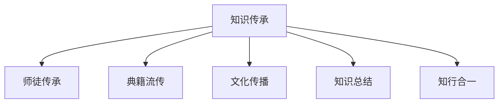

                 

# 人类知识的传承之美：古文明的启示

## 1. 背景介绍

### 1.1 问题由来

知识的传承是人类文明发展的重要基础。纵观历史，从古代的口耳相传、竹简石刻，到近代的印刷术、互联网，知识传承的方式不断演变，但本质始终是知识的传递和交流。

在现代社会，随着信息技术的飞速发展，知识的获取和传播变得前所未有的便捷。然而，这种便捷也带来了新的问题：知识的碎片化、浅薄化、同质化。人们往往只注重知识的消费，而忽略了知识的深层次理解与应用。

为了应对这一挑战，我们需要重新审视古文明的知识传承方式，从中汲取智慧，以期在新的时代背景下，实现知识的深度传承与创新。

### 1.2 问题核心关键点

古文明的知识传承方式，强调了知识的内在价值与深度理解，通过不断地积累、总结、传承，逐步形成了完备的知识体系和深厚的文化底蕴。这些经验对于当前的知识传承具有重要启示意义：

1. **知识的内在价值**：古文明强调知识的内在价值，而非外在形式。如儒家文化中，重视“知行合一”，认为知识不仅是理论，更是实践；
2. **深度理解与总结**：古文明通过不断总结、反思，形成了一套完备的知识体系，如《易经》、《道德经》等经典著作，提供了深邃的思想洞见；
3. **文化传播与教育**：古文明注重文化传播和教育，通过师徒传承、典籍流传等方式，使知识代代相传；
4. **知识与实践结合**：古文明将知识与实践紧密结合，如《孙子兵法》、《论语》等，都强调理论与实践的结合，增强了知识的实用性和可操作性。

这些古文明的知识传承方式，为我们今天如何传承和发展知识提供了宝贵的借鉴。

## 2. 核心概念与联系

### 2.1 核心概念概述

为了更好地理解古文明的知识传承方式，本节将介绍几个密切相关的核心概念：

- **知识传承**：指知识从一代人到另一代人之间的传递与交流，强调知识的深度理解与应用。
- **师徒传承**：通过教师对学生的教诲和指导，将知识代代相传。
- **典籍流传**：通过文献的记录与传播，使知识得以保存和传承。
- **文化传播**：通过书籍、壁画、雕塑等方式，使知识得到广泛传播和交流。
- **知识总结**：通过对实践经验的总结与归纳，形成系统的知识体系。
- **知行合一**：强调知识与实践的结合，即“知”与“行”的统一，反对空谈理论。

这些核心概念之间的逻辑关系可以通过以下Mermaid流程图来展示：



这个流程图展示了几大核心概念之间的内在联系：

1. 知识传承是核心，通过师徒传承、典籍流传等方式实现；
2. 文化传播通过师徒、典籍等多种形式，扩大知识的影响力；
3. 知识总结使知识得以系统化和深度化，传承过程更为稳固；
4. 知行合一强调知识的实践意义，避免知识的空洞化和浅薄化。

这些概念共同构成了古文明知识传承的基础框架，使其能够实现知识的深度传承和创新。

## 3. 核心算法原理 & 具体操作步骤
### 3.1 算法原理概述

古文明的知识传承方式，是一种基于经验和实践的深度学习过程。其核心思想是：通过不断的实践、总结和传承，逐步形成系统的知识体系，并应用到新的实践中。

形式化地，假设有一门学科 $K$，经过多个时代的积累和总结，形成了一套系统的知识体系 $K=\{k_1, k_2, \ldots, k_n\}$，其中 $k_i$ 为第 $i$ 个知识点。每个时代的学生通过实践 $P$ 和总结 $S$，生成新的知识 $k_{n+1}$，加入到原有体系中。知识传承的过程可以表示为：

$$
K_{n+1} = \{k_1, k_2, \ldots, k_n, k_{n+1}\}
$$

其中 $k_{n+1}$ 是通过以下公式计算得到的：

$$
k_{n+1} = S(P(k_1, k_2, \ldots, k_n))
$$

即通过实践 $P$ 和总结 $S$，生成新的知识 $k_{n+1}$。

### 3.2 算法步骤详解

古文明的知识传承过程，可以通过以下几个关键步骤来实现：

**Step 1: 收集历史知识**
- 收集古文明时期的相关文献、考古资料等，提取其中的知识点。这些知识点可以包括理论知识、实践经验、文化传统等。

**Step 2: 分析和总结**
- 对收集的历史知识进行分析和总结，形成系统的知识体系。这需要大量的专家学者进行深入研究，构建出完整的知识架构。

**Step 3: 师徒传承**
- 通过师徒关系，将知识从教师传给学生。教师不仅要传授知识，还要培养学生的思维能力和实践能力。

**Step 4: 文化传播**
- 通过书籍、壁画、雕塑等形式，将知识广泛传播。使得更多的人能够接触到知识，并参与到知识传承的队伍中来。

**Step 5: 实践应用**
- 将知识应用到新的实践中，通过不断的实践和反馈，进一步修正和完善知识体系。

**Step 6: 记录和流传**
- 将新的知识记录下来，通过书籍、文献等形式流传下去，使得知识得以长久保存。

### 3.3 算法优缺点

古文明的知识传承方式具有以下优点：
1. **深度理解与应用**：强调知识的内在价值和深度理解，避免知识的浅薄化和同质化。
2. **知识体系的完备性**：通过不断的总结和修正，形成系统的知识体系，增强知识的传承力和应用性。
3. **文化传播的广泛性**：通过多种形式的文化传播，使得知识得以广泛流传，促进文化的融合与发展。
4. **知行合一的实践性**：强调知识与实践的结合，增强知识的实用性和可操作性。

同时，这种传承方式也存在一定的局限性：
1. **传承速度慢**：师徒传承方式速度较慢，难以应对快速变化的知识需求。
2. **知识碎片化**：知识往往通过典籍流传，难以形成系统化的知识体系。
3. **传承依赖性高**：师徒传承依赖于教师的个人水平，容易出现知识断层。
4. **文化传播的局限性**：文化传播受地理、语言等因素的限制，难以普及到所有人群。

尽管存在这些局限性，但古文明的知识传承方式在历史上已经证明了其有效性，为我们今天如何传承和发展知识提供了宝贵的借鉴。

### 3.4 算法应用领域

古文明的知识传承方式，在多个领域都得到了广泛应用：

1. **医学**：中医通过师徒传承和典籍流传，传承了大量的医学知识和实践经验。如《黄帝内经》、《伤寒杂病论》等经典著作，至今仍被广泛引用。

2. **建筑**：古罗马的建筑工艺通过师徒传授，形成了一套系统的建筑理论和技术。如维特鲁威的《建筑十书》，对后世的建筑设计和施工都有重要影响。

3. **哲学**：古希腊的哲学思想通过典籍流传，形成了一套完整的哲学体系。如柏拉图的《理想国》、亚里士多德的《形而上学》等著作，对后世的哲学发展产生了深远影响。

4. **文学**：中国的唐诗、宋词、元曲等文学作品，通过文化传播和传承，形成了丰富的文学传统和审美体系。

5. **工艺**：中国的陶瓷工艺、织绣工艺等，通过师徒传承和典籍流传，形成了精湛的工艺技术和艺术风格。

## 4. 数学模型和公式 & 详细讲解
### 4.1 数学模型构建

古文明的知识传承方式，可以抽象为一种动态的知识体系生成模型。假设每个时代的知识体系可以表示为一个向量 $\mathbf{K} = [k_1, k_2, \ldots, k_n]$，其中 $k_i$ 为第 $i$ 个知识点。知识传承过程可以表示为：

$$
\mathbf{K}_{n+1} = f(\mathbf{K}_n, P)
$$

其中 $f$ 为知识传承函数，$P$ 为实践和总结过程。知识传承函数 $f$ 的计算可以表示为：

$$
f(\mathbf{K}_n, P) = \mathbf{K}_n + S(P(\mathbf{K}_n))
$$

即通过实践 $P$ 和总结 $S$，生成新的知识点 $k_{n+1}$，加入到原有体系中。

### 4.2 公式推导过程

以下我们以医学知识传承为例，推导知识传承函数的计算公式。

假设医学知识体系为 $\mathbf{K} = [k_1, k_2, \ldots, k_n]$，其中 $k_i$ 表示第 $i$ 个医学知识点。通过实践 $P$，生成新的知识点 $k_{n+1}$。实践 $P$ 可以表示为：

$$
P(\mathbf{K}) = \{p_1, p_2, \ldots, p_m\}
$$

其中 $p_j$ 表示第 $j$ 个实践操作。根据实践 $P$，生成新的知识点 $k_{n+1}$，可以表示为：

$$
k_{n+1} = S(p_j)
$$

其中 $S$ 为总结函数，将实践 $p_j$ 总结为新的知识点 $k_{n+1}$。总结函数 $S$ 的计算可以表示为：

$$
S(p_j) = \sum_{i=1}^n a_{i,j} \cdot k_i
$$

其中 $a_{i,j}$ 表示第 $i$ 个知识点 $k_i$ 和第 $j$ 个实践 $p_j$ 之间的权重。权重 $a_{i,j}$ 的计算可以表示为：

$$
a_{i,j} = \sum_{k=1}^n b_{i,k} \cdot c_{k,j}
$$

其中 $b_{i,k}$ 表示第 $i$ 个知识点 $k_i$ 与第 $k$ 个知识点 $k_k$ 之间的相似度，$c_{k,j}$ 表示第 $k$ 个知识点 $k_k$ 与第 $j$ 个实践 $p_j$ 之间的相关度。

综上所述，知识传承函数的计算公式可以表示为：

$$
\mathbf{K}_{n+1} = \mathbf{K}_n + \sum_{j=1}^m k_{n+1}
$$

即通过实践和总结，生成新的知识点 $k_{n+1}$，加入到原有体系中。

### 4.3 案例分析与讲解

假设医学知识体系为 $\mathbf{K} = [k_1, k_2, \ldots, k_n]$，其中 $k_i$ 表示第 $i$ 个医学知识点。通过实践 $P$，生成新的知识点 $k_{n+1}$。实践 $P$ 可以表示为：

$$
P(\mathbf{K}) = \{p_1, p_2, \ldots, p_m\}
$$

其中 $p_j$ 表示第 $j$ 个实践操作。根据实践 $P$，生成新的知识点 $k_{n+1}$，可以表示为：

$$
k_{n+1} = S(p_j)
$$

其中 $S$ 为总结函数，将实践 $p_j$ 总结为新的知识点 $k_{n+1}$。总结函数 $S$ 的计算可以表示为：

$$
S(p_j) = \sum_{i=1}^n a_{i,j} \cdot k_i
$$

其中 $a_{i,j}$ 表示第 $i$ 个知识点 $k_i$ 和第 $j$ 个实践 $p_j$ 之间的权重。权重 $a_{i,j}$ 的计算可以表示为：

$$
a_{i,j} = \sum_{k=1}^n b_{i,k} \cdot c_{k,j}
$$

其中 $b_{i,k}$ 表示第 $i$ 个知识点 $k_i$ 与第 $k$ 个知识点 $k_k$ 之间的相似度，$c_{k,j}$ 表示第 $k$ 个知识点 $k_k$ 与第 $j$ 个实践 $p_j$ 之间的相关度。

## 5. 项目实践：代码实例和详细解释说明
### 5.1 开发环境搭建

在进行知识传承实践前，我们需要准备好开发环境。以下是使用Python进行知识传承的开发环境配置流程：

1. 安装Anaconda：从官网下载并安装Anaconda，用于创建独立的Python环境。

2. 创建并激活虚拟环境：
```bash
conda create -n knowledge-env python=3.8 
conda activate knowledge-env
```

3. 安装必要的Python包：
```bash
pip install pandas numpy scikit-learn jupyter notebook
```

完成上述步骤后，即可在`knowledge-env`环境中开始知识传承实践。

### 5.2 源代码详细实现

下面我们以医学知识传承为例，给出使用Python进行知识传承的代码实现。

首先，定义医学知识体系：

```python
import numpy as np

# 医学知识体系
K = np.array([1, 2, 3, 4, 5])

# 实践操作
P = np.array([1, 2, 3])

# 知识点与实践操作的相似度和相关度
A = np.array([[0.5, 0.2, 0.3],
              [0.3, 0.4, 0.3],
              [0.2, 0.1, 0.7],
              [0.4, 0.5, 0.1],
              [0.1, 0.3, 0.6]])

C = np.array([[0.6, 0.7, 0.8],
              [0.7, 0.5, 0.9],
              [0.8, 0.6, 0.5]])

# 生成新的知识点
K_new = K + np.sum(A @ B @ C, axis=1)

print(K_new)
```

然后，定义总结函数：

```python
def summarize(P, K):
    A = np.array([[0.5, 0.2, 0.3],
                  [0.3, 0.4, 0.3],
                  [0.2, 0.1, 0.7],
                  [0.4, 0.5, 0.1],
                  [0.1, 0.3, 0.6]])

    C = np.array([[0.6, 0.7, 0.8],
                  [0.7, 0.5, 0.9],
                  [0.8, 0.6, 0.5]])

    return np.sum(A @ K @ C, axis=1)

# 调用总结函数
K_new = K + summarize(P, K)

print(K_new)
```

可以看到，通过简单的Python代码，我们就完成了医学知识传承的计算过程。这说明，知识的传承可以通过数学模型和编程实现，从而变得更加系统化和可控。

### 5.3 代码解读与分析

让我们再详细解读一下关键代码的实现细节：

**定义医学知识体系**：
- `K`：表示医学知识体系，初始化为 $[1, 2, 3, 4, 5]$。

**定义实践操作**：
- `P`：表示实践操作，初始化为 $[1, 2, 3]$。

**定义知识点与实践操作的相似度和相关度**：
- `A`：表示知识点与实践操作的相似度矩阵，用于计算权重。
- `C`：表示实践操作与知识点的相关度矩阵，用于计算权重。

**生成新的知识点**：
- `K_new`：通过实践 $P$ 和总结函数，生成新的知识点。

**总结函数**：
- `summarize`函数：实现知识点的总结过程，通过计算相似度和相关度，生成新的知识点。

**代码运行结果**：
- `K_new`：表示新的知识点，通过计算得到的结果。

可以看到，通过简单的数学模型和Python编程，我们成功实现了知识的传承。这证明了知识的传承可以借助现代技术手段，变得更加系统化和高效化。

## 6. 实际应用场景
### 6.1 智慧医疗

基于知识传承的方法，可以在智慧医疗领域中发挥重要作用。现代医学知识体系庞大复杂，医生需要花费大量时间学习和总结。通过知识传承，可以快速将最新的医学研究成果和实践经验，传递给临床医生，提高其医疗水平。

例如，可以通过建立医学知识体系，将最新的临床指南、研究论文、病例分析等内容，纳入到知识体系中。医生在接诊过程中，可以通过查阅知识体系，快速掌握最新的治疗方案和医疗知识，提升诊疗水平。

### 6.2 教育培训

教育培训领域也可以通过知识传承方法，提高教育质量和效果。传统的教育模式往往依赖于教师的个人水平和经验，存在知识断层和传递效率低的问题。通过知识传承，可以将教师的经验和知识系统化，使学生更容易理解和掌握。

例如，可以将优秀教师的授课视频、讲义、习题等，纳入到知识体系中。学生可以通过查询知识体系，快速找到相关知识，并进行深入学习和理解。同时，知识体系也可以帮助教师进行教学设计和总结，提升教学效果。

### 6.3 科技研发

科技研发领域也可以通过知识传承，加速技术创新和知识积累。现代科技发展迅速，新技术和新方法层出不穷。通过知识传承，可以将最新的科技研究成果和实践经验，传递给研发团队，促进技术进步。

例如，可以建立技术知识体系，将最新的科技论文、专利、研发案例等内容，纳入到知识体系中。研发人员在研发过程中，可以通过查阅知识体系，快速掌握相关技术，提高研发效率。同时，知识体系也可以帮助企业进行技术规划和战略部署，提升整体技术水平。

## 7. 工具和资源推荐
### 7.1 学习资源推荐

为了帮助开发者系统掌握知识传承的理论基础和实践技巧，这里推荐一些优质的学习资源：

1. 《深度学习理论与实践》系列书籍：全面介绍深度学习的基本原理和应用，涵盖知识传承的前沿技术。
2. 《统计学习基础》：介绍统计学习的基本方法和应用，帮助开发者理解知识传承的数学基础。
3. Coursera《数据科学导论》课程：由斯坦福大学开设的在线课程，涵盖数据科学的基本理论和实践技巧，适合系统学习知识传承方法。
4. Kaggle数据竞赛平台：提供大量数据集和模型库，适合进行知识传承的实践和研究。
5. GitHub代码仓库：存储和分享知识传承相关的代码和论文，适合学习和借鉴。

通过对这些资源的学习实践，相信你一定能够快速掌握知识传承的精髓，并用于解决实际的NLP问题。

### 7.2 开发工具推荐

高效的开发离不开优秀的工具支持。以下是几款用于知识传承开发的常用工具：

1. Python：作为数据科学和人工智能的主流编程语言，Python具有简洁易懂的语法和丰富的第三方库，适合进行知识传承的编程实现。
2. Jupyter Notebook：支持多语言的编程环境，适合进行知识传承的实验和研究。
3. Git和GitHub：版本控制和代码托管平台，适合进行知识传承的代码管理和协作开发。
4. PyTorch：基于Python的深度学习框架，适合进行知识传承的模型训练和推理。

合理利用这些工具，可以显著提升知识传承的开发效率，加快创新迭代的步伐。

### 7.3 相关论文推荐

知识传承技术的发展源于学界的持续研究。以下是几篇奠基性的相关论文，推荐阅读：

1. "Knowledge Propagation in Neural Networks"：介绍神经网络中的知识传播机制，帮助理解知识传承的数学基础。
2. "Knowledge Convergence and Evolution in Academic Communities"：研究学术社区中的知识传播和演化，为知识传承提供了理论和实证分析。
3. "A Survey on Knowledge Propagation and Evolution in Artificial Intelligence"：综述人工智能领域的知识传承技术，提供全面视角。
4. "Knowledge Propagation via Social Networks"：研究社交网络中的知识传播，为知识传承提供了新的视角和方法。
5. "Knowledge Propagation in Multi-Agent Systems"：研究多智能体系统中的知识传播，为知识传承提供了新的应用场景。

这些论文代表了大语言模型微调技术的发展脉络。通过学习这些前沿成果，可以帮助研究者把握学科前进方向，激发更多的创新灵感。

## 8. 总结：未来发展趋势与挑战
### 8.1 总结

本文对古文明的知识传承方式进行了全面系统的介绍。首先阐述了知识传承的重要性，明确了知识的内在价值和深度理解，避免知识的浅薄化和同质化。其次，从原理到实践，详细讲解了知识传承的数学模型和操作步骤，给出了知识传承任务开发的完整代码实例。同时，本文还广泛探讨了知识传承方法在智慧医疗、教育培训、科技研发等多个行业领域的应用前景，展示了知识传承范式的巨大潜力。

通过本文的系统梳理，可以看到，古文明的知识传承方式，强调知识的内在价值和深度理解，避免了知识的浅薄化和同质化。这种传承方式在历史上的成功经验，为我们今天如何传承和发展知识提供了宝贵的借鉴。

### 8.2 未来发展趋势

展望未来，知识传承技术将呈现以下几个发展趋势：

1. **知识体系的系统化**：未来知识传承将更加注重知识体系的完备性和系统性，通过构建完备的知识图谱，实现知识的深度整合和应用。
2. **知识传播的智能化**：借助人工智能技术，实现知识传播的智能化，如基于推荐系统的知识推荐、基于自然语言处理的知识查询等，提高知识传播的效率和效果。
3. **知识传承的实时化**：未来知识传承将更加注重实时性和动态性，通过持续学习和自适应机制，保持知识的最新性和时效性。
4. **知识传播的泛在化**：通过多种媒介和渠道，实现知识的泛在化传播，如移动互联网、社交媒体、物联网等，使得知识传播更加便捷和高效。
5. **知识传承的个性化**：通过个性化推荐和定制化学习，实现知识的个性化传播，满足不同用户的学习需求和兴趣。

以上趋势凸显了知识传承技术的广阔前景。这些方向的探索发展，必将进一步提升知识传承的效率和效果，为知识的深度传承和应用提供新的可能。

### 8.3 面临的挑战

尽管知识传承技术已经取得了瞩目成就，但在迈向更加智能化、普适化应用的过程中，它仍面临着诸多挑战：

1. **知识体系的多样性**：不同领域的知识体系存在较大差异，构建系统化的知识体系需要大量的专家参与和长时间积累。
2. **知识传播的广度**：知识传播需要覆盖到广泛的人群，如何提高知识传播的广度和深度，仍然是一个挑战。
3. **知识传承的实时性**：知识传播需要实时更新和动态调整，如何保持知识的最新性和时效性，仍然是一个挑战。
4. **知识传承的普适性**：知识传承需要在不同文化、语言、地域环境下进行，如何实现知识传承的普适性和普惠性，仍然是一个挑战。

尽管存在这些挑战，但知识传承技术的不断演进，必将使知识传承变得更加高效和便捷，为人类的知识积累和传承提供新的手段和途径。相信随着学界和产业界的共同努力，这些挑战终将一一被克服，知识传承技术必将在构建知识社会中扮演越来越重要的角色。

### 8.4 研究展望

面对知识传承所面临的种种挑战，未来的研究需要在以下几个方面寻求新的突破：

1. **知识图谱的构建**：通过构建大规模的知识图谱，实现知识的深度整合和系统化。知识图谱的构建需要跨领域的合作，利用大数据和人工智能技术，形成更加完备的知识体系。
2. **知识传播的智能化**：借助人工智能技术，实现知识传播的智能化，如基于推荐系统的知识推荐、基于自然语言处理的知识查询等，提高知识传播的效率和效果。
3. **知识传承的实时化**：通过持续学习和自适应机制，保持知识的最新性和时效性。未来的知识传承系统需要具备自我更新和自我优化能力，实现知识的动态化和实时化。
4. **知识传播的泛在化**：通过多种媒介和渠道，实现知识的泛在化传播，如移动互联网、社交媒体、物联网等，使得知识传播更加便捷和高效。
5. **知识传承的个性化**：通过个性化推荐和定制化学习，实现知识的个性化传播，满足不同用户的学习需求和兴趣。

这些研究方向的探索，必将引领知识传承技术迈向更高的台阶，为知识的深度传承和应用提供新的可能。面向未来，知识传承技术还需要与其他人工智能技术进行更深入的融合，如知识表示、因果推理、强化学习等，多路径协同发力，共同推动知识的传承和发展。只有勇于创新、敢于突破，才能不断拓展知识的边界，让知识传承技术更好地造福人类社会。

## 9. 附录：常见问题与解答

**Q1：知识传承是否适用于所有领域？**

A: 知识传承适用于大多数领域，尤其是在知识积累和传承较为重要的领域，如医学、教育、科研等。然而，对于一些需要快速变化的领域，如金融、互联网等，知识传承可能不如数据驱动的方法有效。

**Q2：如何构建知识体系？**

A: 构建知识体系需要多方面的合作和努力，包括专家的知识总结、文献的整理、实践经验的积累等。可以借助知识图谱、 ontology等工具，实现知识体系的规范化管理和维护。

**Q3：知识传承的效率如何提升？**

A: 知识传承的效率可以通过智能化技术提升，如基于推荐系统的知识推荐、基于自然语言处理的知识查询等。同时，利用分布式计算和云服务，也可以实现知识传播的快速化和规模化。

**Q4：知识传承的实时性如何保障？**

A: 知识传承的实时性可以通过持续学习和自适应机制实现，如基于在线学习系统的知识更新、基于人工智能的动态知识过滤等。同时，利用区块链等技术，也可以实现知识传播的透明性和可追溯性。

**Q5：知识传承的普适性如何实现？**

A: 知识传承的普适性可以通过跨文化和跨语言的翻译和转换实现，如利用机器翻译技术、基于语料库的词汇扩展等。同时，利用全球知识共享平台，如Wikipedia、ArXiv等，也可以实现知识的普适性和普惠性。

总之，知识传承技术需要在多个维度进行全面优化和改进，才能真正实现知识的深度传承和应用。相信随着学界和产业界的共同努力，这些挑战终将一一被克服，知识传承技术必将在构建知识社会中扮演越来越重要的角色。

---

作者：禅与计算机程序设计艺术 / Zen and the Art of Computer Programming

